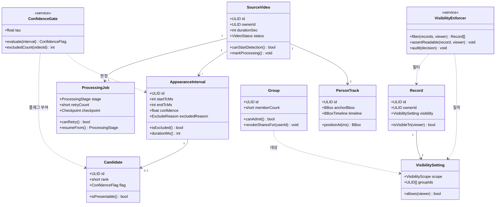
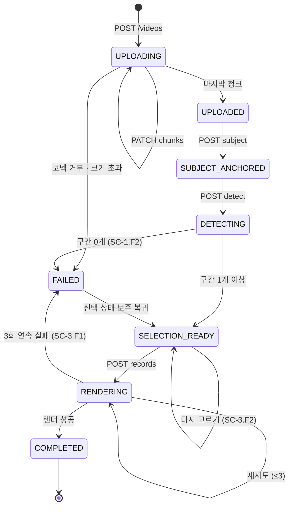

# Software Design Description (SDD)

**Document ID:** DS-HILIT-MVP-001

**version:** 1.1

**Date:** 2026-08-30

**Standard:** IEEE 1016 설계 관점(Design Viewpoints) 구조

**상위 문서:** `SRS/[SRS]hilit-SRSv1.8.md` (요구사항 45건 · 시나리오 42건 · 다이어그램 18종)

---

### 판 이력

| 판 | 날짜 | 변경 | 근거 |
| --- | --- | --- | --- |
| 1.0 | 2026-08-30 | **초판.** SRS가 *"개요"* 로 한정한 세 영역을 설계 수준으로 확정 — **API 스키마 · 데이터 모델 속성 · 도메인 클래스**. 감사 P1-6·7·8 · P2-1 대상 | `AUDIT_SRS_2026-08-30.md` |
| **1.1** | **2026-08-30** | **SRS v1.8 정합화.** ① **§2.1 Use Case 모델을 SRS로 이관** — 팀 SRS에 이미 UC-01~09가 있는데 DS가 UCS-1~8을 새로 만들어 **`UC-01`이 두 문서에서 다른 뜻**이 됐다. SRS 그림 4-1을 정본으로 단일화 ② SRS 절 참조 4건 갱신(§6.4→6.5 · §6.3→6.4) ③ §9-1(행위자 구분)은 SRS v1.8 §2.3.1에서 해소 | `SRS/[SRS]hilit-SRSv1.8.md` |

---

## 이 문서가 존재하는 이유

SRS v1.5는 스스로를 **요구사항 명세**로 한정하고 API·엔티티를 *"개요"* 로 표기했다. 감사는 그것을 **P1 4건**(API 스키마 전무 · Entity 속성 전무 · Use Case Diagram 부재 · Class Diagram 빈약)으로 판정했다.

이를 SRS 안에서 해소하면 **문서의 성격이 바뀐다** — 요구사항 명세가 설계 명세를 겸하게 되고, *"무엇을 만족해야 하는가"* 와 *"어떻게 만들 것인가"* 가 한 문서에 섞인다. **분리가 표준적 분업이다.**

| 문서 | 답하는 질문 | 변경 주체 |
| --- | --- | --- |
| VPS 0.3 | 왜 만드는가 | 사업·제품 |
| PRD v0.1 | 무엇을 해결하는가 | 제품 |
| **SRS v1.5** | **무엇을 만족해야 하는가** | 제품 아키텍트 |
| **DS v1.0** *(이 문서)* | **어떻게 만들 것인가** | 백엔드·AI·클라이언트 리드 |

> **이 문서는 요구사항을 만들지 않는다.** SRS의 요구사항을 만족시키는 **설계 결정**만 담는다. 여기서 새 요구가 필요해지면 **SRS 개정으로 올린다** — 그 항목은 §9에 모았다.

**모든 설계값은 `[PROPOSED]`다.** SRS에 근거가 있는 값만 `[SOURCE·SRS]`로 표기한다.

---

# 1. 서론

## 1.1 목적

SRS v1.5의 요구사항 45건을 구현하기 위한 **인터페이스 · 데이터 · 컴포넌트 · 상태 설계**를 확정한다.

## 1.2 범위

| 포함 | 제외 |
| --- | --- |
| API 요청·응답·오류 스키마 · 인증·인가 · 멱등성 · 속도 제한 | 요구사항 정의 (SRS 소관) |
| 엔티티 속성 · 타입 · 키 · 제약 · 인덱스 · 보존 정책 | 실험 설계 · 게이트 판정 (SRS §6.5) |
| 도메인 클래스 · 상태 기계 | 인프라 프로비저닝 · 배포 파이프라인 |
| Use Case 모델 | 화면 상세 디자인 |

## 1.3 참조

| ID | 문서 |
| --- | --- |
| **DREF-01** | `SRS/[SRS]hilit-SRSv1.8.md` — 요구사항 원천 |
| **DREF-02** | `AUDIT_SRS_2026-08-30.md` — 이 문서가 해소하는 지적 |
| **DREF-03** | `prototype_v0_6.html` — 화면 규격 |
| **DREF-04** | IEEE 1016 — 설계 관점 구조 |

## 1.4 표기

| 태그 | 뜻 |
| --- | --- |
| `[SOURCE·SRS]` | SRS에 명시된 값을 그대로 옮김 |
| `[PROPOSED]` | 이 문서가 새로 제안하는 설계값 |
| `[TBD]` | 설계 결정이 남음 |
| 🔺 | **SRS 개정 필요** — §9에 모음 |

---

# 2. Context Viewpoint

## 2.1 Use Case 모델 — SRS로 이관

> 🔴 **이 절은 v1.1에서 SRS로 이관됐다.** 정본은 **`SRS §4 그림 4-1 유스케이스 다이어그램`**(UC-01~UC-10)이다.

**이관 사유** — DS v1.0은 감사 P1-6(Use Case Diagram 부재)을 해소하려고 **UCS-1~8** 체계를 새로 만들었으나, **팀 SRS에 이미 UC-01~09 체계가 있었다.** 두 체계가 공존하면 같은 개념에 번호가 둘이 되고, 특히 **`UC-01`이 SRS에서는 "원본 불러오기"(유스케이스)를, DS에서는 "기록형 동호인"(이용자 클래스)을 가리켜** 하나의 ID가 서로 다른 의미로 쓰였다.

**SRS v1.8이 팀 체계를 채택**하면서 이 문제가 해소됐다. DS는 유스케이스를 다루지 않고 **설계 관점(§3~§6)에 집중**한다.

| 이관 전 (DS UCS) | 이관 후 (SRS UC) |
| --- | --- |
| UCS-1 원본에서 내 장면 찾기 | **UC-01 · UC-02** |
| UCS-2 장면 고르고 완성하기 | **UC-03 · UC-04** |
| UCS-3 공개 없이 기록 남기기 | **UC-05** |
| UCS-4 그룹에만 열기 | **UC-06** |
| UCS-5 피드 보고 반응하기 | **UC-07 · UC-08 · UC-09** |
| UCS-6 원본 정리하기 | *(REQ-FUNC-019 — 유스케이스 미부여)* |
| UCS-7 동의 관리 | **UC-10** |
| UCS-8 신고 처리 | *(UC-08에 포함)* |

## 2.2 시스템 경계

**시스템 안** — 업로드 · 추적 · 후보 · 선택 · 보정 · 렌더 · 기록 · 공개 범위 · 그룹 · 피드 · 반응 · 공유 · 계측
**시스템 밖** — 촬영 · 갤러리 · 객체 스토리지 · GPU 인프라 · 음원 제공자 · 카카오톡 · 외부 발행

---

# 3. Interface Viewpoint — API 명세

> 감사 **P1-7** 해소. SRS §6.1의 20개 엔드포인트에 스키마·오류·인증·멱등성을 부여한다.

## 3.1 공통 규약

### 3.1.1 인증 · 인가

🔺 **SRS에 인증 요구사항이 없다.** REQ-NF-009(공개 범위 서버 측 강제)가 인증을 전제하지만 **명시적 요구사항이 없어** 이 문서가 설계를 제안한다(§9-2).

| 항목 | 설계 | 근거 |
| --- | --- | --- |
| 인증 방식 | **Bearer 토큰** · 모든 API 필수 | `[PROPOSED]` |
| 미인증 | `401 Unauthorized` | `[PROPOSED]` |
| 권한 없음 | 🔴 **`404 Not Found`** — `403`을 쓰지 않는다 | **REQ-NF-009** *"자원의 존재를 노출하지 않는다"* `[SOURCE·SRS]` |
| 소유권 | 모든 자원 접근은 `owner_id == subject` 또는 **VisibilityEnforcer 통과** | REQ-NF-009 |
| 역할 | `user` · `operator` 2종. MVP는 `user`만 발급 | `[PROPOSED]` |

> **`403`이 아니라 `404`인 이유** — `403`은 *"그 자원은 있는데 당신은 못 본다"* 를 알려준다. SRS §4.2 REQ-NF-009는 **건수·존재를 유추할 수 있는 정보도 반환 금지**를 요구하므로 `403`은 위반이다.

### 3.1.2 오류 응답 형식 `[PROPOSED]`

```json
{
  "error": {
    "code": "CODEC_UNSUPPORTED",
    "message": "지원하지 않는 형식입니다",
    "detail": { "codec": "hevc-hdr", "supported": ["h264", "hevc-sdr"] },
    "traceId": "01J8..."
  }
}
```

| 상태 | 사용처 |
| --- | --- |
| `400` | 요청 형식 오류 · 검증 실패 |
| `401` | 미인증 |
| `404` | 자원 없음 **또는 권한 없음** |
| `409` | 상태 충돌 (중복 처리 요청 · 그룹 정원 초과) |
| `413` | 파일 크기 초과 |
| `415` | 미지원 코덱·컨테이너 |
| `429` | 속도 제한 |
| `503` | 처리 큐 포화 |

### 3.1.3 멱등성 · 속도 제한 · 타임아웃 `[PROPOSED]`

| 항목 | 설계 |
| --- | --- |
| 멱등성 | 상태를 만드는 `POST`는 **`Idempotency-Key` 헤더 필수** — `/videos` · `/records` · `/groups` · `/follows` · `/reactions` · `/share` |
| 키 보존 | 24시간. 동일 키 재요청은 **최초 응답을 재생** |
| 속도 제한 | 사용자당 분당 60건. 업로드 개시는 **분당 3건** |
| 초과 시 | `429` + `Retry-After` |
| 타임아웃 | 동기 API **5초** · 업로드 청크 **30초** · 비동기 작업은 큐 위임 |

### 3.1.4 비동기 처리

**탐지(`/detect`)와 렌더(`/records`)는 즉시 완료되지 않는다.** `202 Accepted` + `jobId`를 반환하고 `GET /jobs/{id}`로 상태를 조회한다.

## 3.2 엔드포인트 명세

### Media Ingest Service

| # | API | 요청 | 응답 | 오류 | 멱등 | REQ |
| :--: | --- | --- | --- | --- | :--: | --- |
| **A-01** | `POST /videos` | `{filename, sizeBytes, durationSec, codec, container}` | `201 {videoId, uploadSessionId, chunkSizeBytes, expiresAt}` | `415` 미지원 코덱 · `413` 크기 초과 | ✅ | REQ-FUNC-001 · SC-1.F1 |
| **A-02** | `PATCH /videos/{id}/chunks` | `Content-Range` 헤더 + 바이너리 | `200 {receivedBytes, nextOffset}` · 완료 시 `201 {status:"UPLOADED"}` | `409` 오프셋 불일치 · `404` 세션 만료 | ➖ 자연 멱등 | REQ-FUNC-001 · SC-1.F3 |
| **A-03** | `GET /videos/{id}/upload-session` | — | `200 {nextOffset, receivedBytes, expiresAt}` | `404` | ➖ | SC-1.F3 · F4 |
| **A-04** | `DELETE /videos/{id}` | — | `204` | `404` · `409` 처리 중 | ➖ | REQ-FUNC-019 · REQ-NF-019 |

> **A-01이 코덱을 요청 본문으로 받는 이유** — SC-1.F1은 *"업로드 개시 전 거부 · GPU 작업 생성 0건"* 을 요구한다. **바이트를 받기 전에 판정**하려면 메타데이터가 먼저 와야 한다. A-03은 SC-1.F4(앱 종료 후 재개)의 복구 지점이다.

### Vision Tracking Engine

| # | API | 요청 | 응답 | 오류 | 멱등 | REQ |
| :--: | --- | --- | --- | --- | :--: | --- |
| **A-05** | `POST /videos/{id}/subject` | `{frameTimeMs, bbox:{x,y,w,h}}` | `201 {personTrackId}` | `400` bbox 범위 초과 · `409` 이미 지정됨 | ✅ | REQ-FUNC-002 |
| **A-06** | `POST /videos/{id}/detect` | `{personTrackId}` | `202 {jobId}` | `409` 진행 중 · `503` 큐 포화 | ✅ | REQ-FUNC-002 · 003 |
| **A-07** | `GET /jobs/{id}` | — | `200 {stage, status, progressPct, checkpoint, failureClass?}` | `404` | ➖ | SC-1.F4 |

### Highlight Composer

| # | API | 요청 | 응답 | 오류 | 멱등 | REQ |
| :--: | --- | --- | --- | --- | :--: | --- |
| **A-08** | `GET /videos/{id}/candidates` | `?cursor&limit` | `200 {items:[{candidateId, startTc, endTc, rank, thumbnailUrl, confidenceFlag}], excludedCount, nextCursor}` | `404` · `409` 탐지 미완 | ➖ | REQ-FUNC-004 · 027 |
| **A-09** | `GET /music` | `?category&cursor` | `200 {items:[{musicTrackId, title, durationSec, category, previewUrl}], nextCursor}` | — | ➖ | REQ-FUNC-007 |
| **A-10** | `POST /records` | `{videoId, candidateIds:[], musicTrackId?, visibility?}` | `202 {jobId, recordDraftId}` | `400` 후보 0개 · `404` · `409` | ✅ | REQ-FUNC-005~009 |

> **A-08의 `excludedCount`가 SC-1.F6을 구현한다.** ConfidenceGate가 제외한 건수를 응답에 포함해야 *"제외로 후보가 현저히 줄었을 때 사유를 안내"* 할 수 있다. `confidenceFlag`는 `NORMAL`만 반환된다 — `LOW`·`EXCLUDED`는 목록에 오르지 않는다(REQ-FUNC-027).

### Record Store Service

| # | API | 요청 | 응답 | 오류 | 멱등 | REQ |
| :--: | --- | --- | --- | --- | :--: | --- |
| **A-11** | `GET /records` | `?scope&sport&cursor&limit` | `200 {items:[{recordId, thumbnailUrl, createdAt, visibility}], counts:{total, public, group, private}, nextCursor}` | — | ➖ | REQ-FUNC-010 · SC-4.3 · 4.5 |
| **A-12** | `GET /users/{id}/profile` | — | 🔴 **소유자**: `{counts:{total,public,group,private}, items:[전체]}`<br>🔴 **타인**: `{counts:{public}, items:[공개만]}` | `404` | ➖ | **REQ-NF-009** · SC-4.4 |
| **A-13** | `PATCH /records/{id}/visibility` | `{scope:"public"\|"group"\|"private", groupIds?:[]}` | `200 {recordId, scope, groupIds}` | `400` 그룹 미지정 · `404` · `409` 미성년 동의 미확보 | ➖ 자연 멱등 | REQ-FUNC-010 · REQ-NF-017 |
| **A-14** | `POST /groups` | `{name, memberUserIds:[]}` | `201 {groupId, inviteToken}` | `400` 정원 초과 | ✅ | REQ-FUNC-013 |
| **A-15** | `GET /groups/{id}/members` | `?cursor` | `200 {items:[{userId, handle, joinedAt}], nextCursor}` | `404` | ➖ | REQ-FUNC-013 |
| **A-16** | `DELETE /groups/{id}/members/{userId}` | — | `204` | `404` · `409` 마지막 소유자 | ➖ | REQ-FUNC-013 · SC-2.F1 · F2 |

> 🔴 **A-12가 이 시스템에서 가장 위험한 엔드포인트다.** 같은 URL이 **호출자에 따라 다른 스키마를 반환**한다. 타인 조회 시 `counts`에 `total`·`group`·`private`이 **키 자체로 존재해서는 안 된다** — 키가 있으면 값이 0이어도 *"비공개 기록이 있다는 개념"* 이 노출된다. SC-4.4의 *"개수에도 미포함"* 이 이 뜻이다.

### Social Graph · Feed Service

| # | API | 요청 | 응답 | 오류 | 멱등 | REQ |
| :--: | --- | --- | --- | --- | :--: | --- |
| **A-17** | `POST /follows` | `{followeeId}` | `201 {followerId, followeeId}` | `404` · `409` 자기 자신 | ✅ | REQ-FUNC-012 |
| **A-18** | `DELETE /follows/{followeeId}` | — | `204` | `404` | ➖ | REQ-FUNC-012 |
| **A-19** | `GET /feed` | `?tab=following\|recommend\|group&groupId?&cursor` | `200 {items:[...], fallbackType?, nextCursor}` | `400` 잘못된 tab | ➖ | REQ-FUNC-014 · SC-6.F1 |
| **A-20** | `POST /records/{id}/reactions` | `{type:"like"\|"comment", text?}` | `201 {reactionId}` | `404` **비공개 기록** · `400` 빈 댓글 | ✅ | REQ-FUNC-015 · 016 · SC-6.2 |
| **A-21** | `POST /reactions/{id}/report` | `{reason}` | `202 {reportId}` | `404` | ✅ | REQ-FUNC-016 · SC-6.3 |
| **A-22** | `POST /records/{id}/share` | — | `201 {shareUrl, token, expiresAt}` | `404` **비공개 기록** | ✅ | REQ-FUNC-017 · REQ-NF-012 |
| **A-23** | `POST /events` | `{events:[{name, occurredAt, sessionId, schemaVersion, props}]}` | `202 {accepted, rejected}` | `400` 스키마 위반 | ➖ | REQ-NF-014 |

**`fallbackType`이 SC-6.F1을 구현한다** — 피드가 비면 `"own_records"` 또는 `"recommend"` 를 담아 클라이언트가 대체 노출을 알 수 있게 한다.

**A-20·A-22가 비공개 기록에 `404`를 반환한다** — `400`이나 `403`이면 *"그 기록은 존재하나 비공개"* 가 드러난다.

**총 23개** — SRS §6.1의 20개에 **A-03(업로드 세션 조회) · A-12(프로필) · A-18(언팔로우)** 3개를 추가했다. 🔺 SRS §6.1 갱신 필요(§9-3).

---

# 4. Information Viewpoint — 데이터 모델

> 감사 **P1-8** 해소. SRS §6.2의 엔티티 16개에 타입·키·제약·인덱스·보존을 부여한다.

## 4.1 공통 규약 `[PROPOSED]`

| 항목 | 설계 |
| --- | --- |
| PK | `ULID` (26자) — 시간 정렬 가능 · 분산 생성 |
| 시각 | `TIMESTAMPTZ` · UTC 저장 · 응답은 ISO 8601 |
| 공통 컬럼 | `created_at` 필수 · `updated_at` 변경 가능 엔티티만 |
| 논리 삭제 | 사업 자원만 `deleted_at`. **개인정보·영상은 물리 삭제** |
| 문자열 | `TEXT` + `CHECK` 길이 제약 |

> **논리/물리 삭제 분리 근거** — REQ-NF-019는 *"원본과 모든 파생물을 전량 삭제"* 를 요구한다. 논리 삭제는 이를 만족하지 않는다.

## 4.2 엔티티 상세

### User

| 컬럼 | 타입 | 제약 | 비고 |
| --- | --- | --- | --- |
| `id` | ULID | **PK** | |
| `handle` | TEXT(30) | **UNIQUE** · NOT NULL | |
| `display_name` | TEXT(50) | NOT NULL | |
| `birth_year` | SMALLINT | NULL 허용 | 🔴 **개인정보** · REQ-NF-016 연령 분기 |
| `guardian_consent_at` | TIMESTAMPTZ | NULL | 만 14세 미만만 |
| `role` | ENUM | NOT NULL · 기본 `user` | `user` · `operator` |
| `created_at` / `deleted_at` | TIMESTAMPTZ | | |

**인덱스** `UNIQUE(handle)` · `INDEX(deleted_at)`
**보존** 마지막 활동 후 **1년** `[PROPOSED]` → 삭제 요청 시 즉시 물리 삭제

### SourceVideo

| 컬럼 | 타입 | 제약 | 비고 |
| --- | --- | --- | --- |
| `id` | ULID | **PK** | |
| `owner_id` | ULID | **FK → User** · NOT NULL · `ON DELETE CASCADE` | |
| `duration_sec` | INTEGER | `CHECK (0 < duration_sec <= 5400)` | 90분 상한 `[PROPOSED]` |
| `size_bytes` | BIGINT | `CHECK (<= 6442450944)` | 6GB 상한 `[PROPOSED]` |
| `codec` | TEXT(20) | NOT NULL | 검증 통과분만 저장 |
| `storage_uri` | TEXT | NOT NULL | |
| `status` | ENUM | NOT NULL | `UPLOADING`·`UPLOADED`·`PROCESSING`·`READY`·`FAILED` |
| `created_at` | TIMESTAMPTZ | | |

**인덱스** `INDEX(owner_id, created_at DESC)`
**보존** 🔴 **결과물 확보 후 사용자 삭제 유도**(REQ-FUNC-019). 자동 삭제 정책 `[TBD]`
**개인정보** 🔴 **영상 자체가 개인정보** — 저장 시 암호화(REQ-NF-011)

### PersonTrack

| 컬럼 | 타입 | 제약 |
| --- | --- | --- |
| `id` | ULID | **PK** |
| `video_id` | ULID | **FK → SourceVideo** · `CASCADE` |
| `anchor_frame_ms` | INTEGER | NOT NULL |
| `anchor_bbox` | JSONB | `{x,y,w,h}` 정규화 좌표 0~1 |
| `bbox_timeline` | JSONB | 프레임별 좌표 배열 |

**인덱스** `UNIQUE(video_id)` — 대상 지정은 영상당 1회(REQ-FUNC-002)
**보존** SourceVideo와 동일 생명주기 · 🔴 **얼굴 특징 벡터를 저장하지 않는다** `[PROPOSED]`

> **특징 벡터 미저장 근거** — REQ-NF-010(얼굴 정보 동의·파기)의 적용 범위를 좁힌다. 좌표만 남기면 원본 삭제 시 재식별 가능성이 사라진다.

### AppearanceInterval

| 컬럼 | 타입 | 제약 |
| --- | --- | --- |
| `id` | ULID | **PK** |
| `video_id` | ULID | **FK → SourceVideo** · `CASCADE` |
| `start_tc_ms` / `end_tc_ms` | INTEGER | `CHECK (start < end)` |
| `confidence` | REAL | `CHECK (0 <= confidence <= 1)` |
| `excluded_reason` | ENUM | NULL — `LOW_CONFIDENCE` |

**인덱스** `INDEX(video_id, start_tc_ms)` · `INDEX(video_id, excluded_reason)`
**설계 주** `excluded_reason`이 **제외 전/후 탐지율 분리 집계의 근거**다(SRS §4.2). 제외분을 지우지 않고 사유와 함께 남긴다.

### Candidate

| 컬럼 | 타입 | 제약 |
| --- | --- | --- |
| `id` | ULID | **PK** |
| `interval_id` | ULID | **FK → AppearanceInterval** · `CASCADE` |
| `rank` | SMALLINT | NOT NULL |
| `thumbnail_uri` | TEXT | |
| `confidence_flag` | ENUM | `NORMAL`·`LOW`·`EXCLUDED` |

**인덱스** `INDEX(interval_id)` · `UNIQUE(interval_id, rank)`
**제약** `confidence_flag != 'NORMAL'` 인 행은 **API 응답에서 제외**(REQ-FUNC-027)

### Selection

| 컬럼 | 타입 | 제약 |
| --- | --- | --- |
| `id` | ULID | **PK** |
| `candidate_id` | ULID | **FK → Candidate** |
| `user_id` | ULID | **FK → User** |
| `selected_at` | TIMESTAMPTZ | NOT NULL |
| `is_reselection` | BOOLEAN | 기본 `false` |

**인덱스** `INDEX(user_id, selected_at)` · `UNIQUE(candidate_id, user_id)`
**보존** 🔴 **원본 삭제 후에도 유지** — 향후 학습 원천(REQ-FUNC-023). 단 **사용자 삭제 요청 시 물리 삭제**
**설계 주** `is_reselection`이 **ADR-3의 판정 지표**(`reselection_started`) 근거다.

### GeneratedVideo · Record · VisibilitySetting

| 엔티티 | 주요 컬럼 | 제약 |
| --- | --- | --- |
| **GeneratedVideo** | `id` PK · `owner_id` FK · `source_video_id` FK `ON DELETE SET NULL` · `music_track_id` FK · `duration_sec CHECK(<=60)` · `storage_uri` | 🔴 `SET NULL` — **원본을 지워도 결과물은 남는다**(REQ-FUNC-019) |
| **Record** | `id` PK · `generated_video_id` FK **UNIQUE** · `owner_id` FK · `sport` TEXT · `created_at` | 1:1 · `INDEX(owner_id, created_at DESC)` |
| **VisibilitySetting** | `record_id` **PK·FK** · `scope` ENUM NOT NULL **기본 `private`** · `group_ids` ULID[] · `updated_at` | `CHECK (scope != 'group' OR array_length(group_ids,1) >= 1)` |

> **`scope` 기본값 `private`이 DB 레벨 `DEFAULT`여야 한다** — 애플리케이션 기본값만으로는 REQ-FUNC-010(ADR-4)이 보장되지 않는다. 신규 삽입 경로가 늘면 누락된다.

### Group · GroupMember

| 엔티티 | 주요 컬럼 | 제약 |
| --- | --- | --- |
| **Group** | `id` PK · `owner_id` FK · `name` TEXT(30) · `member_count` SMALLINT | 🔴 `CHECK (member_count <= 20)` · **이름 중복 허용**(UNIQUE 없음) |
| **GroupMember** | `group_id`+`user_id` **복합 PK** · `joined_at` · `left_at` NULL | `INDEX(user_id)` · **이탈 이력 보존**(`left_at` 소프트) |

**정원 20명 강제** — `member_count`를 **동일 트랜잭션 내 원자 증가 + CHECK**로 처리한다. 조회 후 삽입 방식은 동시 초대 시 정원을 넘긴다(SC-5.F1).

### FollowRelation · MusicTrack · Reaction · ShareLink

| 엔티티 | 주요 컬럼 | 제약 |
| --- | --- | --- |
| **FollowRelation** | `follower_id`+`followee_id` **복합 PK** · `created_at` | `CHECK (follower_id != followee_id)` · `INDEX(followee_id)` · **단방향** |
| **MusicTrack** | `id` PK · `title` · `category` ENUM(5) · `duration_sec` · `license_ref` NOT NULL · `license_expires_at` | 🔴 `license_ref` **NOT NULL** — 라이선스 없는 곡은 행 자체가 생기지 않는다(REQ-FUNC-007) |
| **Reaction** | `id` PK · `record_id` FK `CASCADE` · `user_id` FK · `type` ENUM · `text` TEXT(300) · `report_flag` BOOLEAN | `UNIQUE(record_id, user_id) WHERE type='like'` · `CHECK (type!='comment' OR text IS NOT NULL)` |
| **ShareLink** | `id` PK · `record_id` FK `CASCADE` · `token` TEXT **UNIQUE** · `expires_at` NOT NULL · `revoked_at` NULL · `target_user_id` FK NULL | `INDEX(token)` · `INDEX(record_id, revoked_at)` · **기본 만료 30일**(REQ-NF-012) |

### ProcessingJob

| 컬럼 | 타입 | 제약 |
| --- | --- | --- |
| `id` | ULID | **PK** |
| `video_id` | ULID | **FK → SourceVideo** · `CASCADE` |
| `stage` | ENUM | `UPLOADING`·`SUBJECT_ANCHORED`·`DETECTING`·`SELECTION_READY`·`RENDERING`·`COMPLETED`·`FAILED` |
| `status` | ENUM | `QUEUED`·`RUNNING`·`SUCCEEDED`·`FAILED` |
| `retry_count` | SMALLINT | 기본 0 · `CHECK (<= 3)` |
| `checkpoint` | JSONB | 재개 지점 |
| `failure_class` | ENUM | `CAPTURE`·`MODEL`·`UX`·`INFRA`·`POLICY` |

**인덱스** `INDEX(status, created_at)` — 큐 폴링 · `INDEX(video_id)`
**설계 주** `checkpoint`가 SC-1.F4(앱 종료 재개)의 저장소다. `retry_count <= 3`이 REQ-NF-008을 DB에서 강제한다.

## 4.3 PRD ↔ SRS ↔ DS 명칭 매핑

> 감사 **P1-3** 해소.

| PRD | SRS · DS | 변경 사유 |
| --- | --- | --- |
| `Video` | **`SourceVideo`** | `GeneratedVideo`와 구분 |
| `VideoSegment` | **`AppearanceInterval`** | 등장 구간임을 명시 |
| `HighlightCandidate` | **`Candidate`** | 축약 |
| `HighlightSelection` | **`Selection`** | 축약 |
| `PrivacySetting` | **`VisibilitySetting`** | API 경로 `/visibility`와 일치 |

## 4.4 보존 정책 종합 `[PROPOSED]`

| 데이터 | 보존 | 삭제 요청 시 |
| --- | --- | --- |
| 원본 영상 · 추적 궤적 | 사용자 삭제까지 | **물리 삭제** |
| 완성 영상 · 기록 | 사용자 삭제까지 | **물리 삭제** |
| 선택 이력 | 무기한 | **물리 삭제** |
| 계측 이벤트 | **90일** | 사용자 식별자 **비식별화** · 집계는 유지 |
| 감사 로그(REQ-NF-009) | **1년** | 유지 — 보안 기록 |
| 그룹 이탈 이력 | 그룹 존속 기간 | 물리 삭제 |

🔺 **보존 기간은 SRS에서 `[TBD]`였다.** 위 값은 이 문서의 제안이며 법무 확정이 필요하다(§9-4).

---

# 5. Logical Viewpoint — 도메인 클래스

> 감사 **P2-1** 해소. SRS §6.2의 열거형 다이어그램에 **도메인 클래스**를 더한다.



**설계 원칙 3가지**

| # | 원칙 | 이유 |
| --- | --- | --- |
| **D1** | `VisibilityEnforcer`를 **거치지 않는 조회 경로를 두지 않는다** | REQ-NF-009. 우회 경로가 하나라도 있으면 요구사항이 성립하지 않는다 |
| **D2** | `ConfidenceGate`가 **제외를 수행하되 데이터를 지우지 않는다** | 제외 전/후 분리 집계(SRS §4.2)의 전제 |
| **D3** | `Record.isVisibleTo()`는 **판정만** 하고 `VisibilityEnforcer`가 **감사 로그까지** 책임진다 | 감사 로그 100%(REQ-NF-009)를 도메인 객체에 흩뿌리지 않는다 |

---

# 6. Interaction Viewpoint — 상태 동역학

**시퀀스 다이어그램은 SRS §3.5·§6.4에 9개가 있다.** 여기서는 SRS가 다루지 않은 **상태 전이**만 설계한다.



| 전이 | 보존되는 것 | 근거 |
| --- | --- | --- |
| `RENDERING → FAILED` | **선택 · 음악 설정 · 원본** | SC-3.F1 *"원본을 삭제하지 않는다"* |
| `FAILED → SELECTION_READY` | 위 전부 | 사용자를 처음으로 되돌리지 않는다 |
| `SELECTION_READY` 자기 전이 | 기존 선택 | SC-3.F2 · `is_reselection = true` 기록 |
| 앱 종료 후 재진입 | `checkpoint` | SC-1.F4 |

> **`DETECTING → FAILED`(구간 0개)는 시스템 오류가 아니다.** `failure_class = CAPTURE`로 분류하고 원인 후보를 제시한다(SC-1.F2). 이를 `INFRA`로 기록하면 실패 분류(REQ-NF-014)가 오염된다.

---

# 7. 추적성 — DS → SRS

| DS 산출 | 대응 요구사항 | 해소한 감사 지적 |
| --- | --- | --- |
| ~~§2.1 Use Case 모델~~ → **SRS §4 그림 4-1로 이관** | REQ-FUNC 전체 | **P1-6 (SRS가 해소)** |
| §3.1 인증·인가 · 오류 · 멱등성 | REQ-NF-009 · 013 | **P1-7** |
| §3.2 API 23개 스키마 | REQ-FUNC-001~019 · REQ-NF-012·014 | **P1-7** |
| §4.2 엔티티 16개 속성 | REQ-FUNC-009·010·013 · REQ-NF-007·011·022 | **P1-8** |
| §4.3 명칭 매핑 | — | **P1-3** |
| §4.4 보존 정책 | REQ-NF-019 | P1-8 |
| §5 도메인 클래스 | REQ-NF-009 · REQ-FUNC-027 | **P2-1** |
| §6 상태 기계 | SC-1.F2·F4 · SC-3.F1·F2 · REQ-NF-008 | — |

**감사 P1 4건 · P2 1건 · P1-3 해소.** 잔여는 **P1-4**(API 경로 불일치 — PRD 개정 사안) · **P1-5**(O3·O9 REQ-NF 복귀 — SRS 개정 사안) · **P2-2**(AC ID 역참조 — SRS 개정 사안)로, **전부 상위 문서에서 처리할 항목**이다.

---

# 8. 설계 결정 요약

| # | 결정 | 대안 | 선택 이유 |
| --- | --- | --- | --- |
| **DD-1** | 권한 없음에 `404` | `403` | `403`은 자원 존재를 노출한다 — REQ-NF-009 위반 |
| **DD-2** | 코덱을 업로드 **개시 요청 본문**으로 수신 | 첫 청크 분석 | 바이트 수신 전 거부 · **GPU 작업 0건**(SC-1.F1) |
| **DD-3** | `visibility.scope` **DB 기본값** `private` | 애플리케이션 기본값 | 삽입 경로가 늘어도 누락되지 않는다 (ADR-4) |
| **DD-4** | 제외 구간을 **사유와 함께 보존** | 삭제 | 제외 전/후 분리 집계의 전제 |
| **DD-5** | 얼굴 **특징 벡터 미저장** | 저장해 재사용 | REQ-NF-010의 적용 범위 축소 · 원본 삭제로 재식별 불가 |
| **DD-6** | `GeneratedVideo.source_video_id` `ON DELETE SET NULL` | `CASCADE` | 원본을 지워도 결과물이 남아야 한다(REQ-FUNC-019 · O4) |
| **DD-7** | 그룹 정원을 **원자 증가 + CHECK** | 조회 후 삽입 | 동시 초대 시 정원 초과 방지(SC-5.F1) |
| **DD-8** | 선택 이력을 원본 삭제 후에도 유지 | 함께 삭제 | REQ-FUNC-023 학습 원천 · 단 삭제 요청 시 물리 삭제 |

---

# 9. 🔺 SRS 개정 요청

이 문서가 설계하면서 **요구사항의 공백**을 발견한 항목이다. **DS가 요구사항을 만들지 않으므로 SRS 개정으로 올린다.**

| # | 내용 | 근거 | 제안 |
| :--: | --- | --- | --- |
| ~~9-1~~ | ~~행위자 구분 부재~~ | — | ✅ **SRS v1.8 §2.3.1에서 해소** — 법정대리인·운영자를 명시 |
| **9-2** | 🔴 **인증 요구사항 부재** — REQ-NF-009가 인증을 전제하나 명시적 요구사항이 없다 | §3.1.1 | **REQ-NF 신설** — 모든 API 인증 필수 · 미인증 `401` · 권한 없음 `404` |
| **9-3** | API 3개 누락 — 업로드 세션 조회 · 프로필 조회 · 언팔로우 | §3.2 A-03 · A-12 · A-18 | SRS §6.1에 3행 추가. **A-12는 SC-4.4의 구현 지점**이라 특히 중요 |
| **9-4** | 보존 기간 `[TBD]` | §4.4 | 법무 확정 후 SRS §4.4 규제 준수 표에 반영 |
| **9-5** | 영상 길이·크기 상한 미규정 | §4.2 SourceVideo `CHECK` | 90분·6GB는 설계 제안값. **요구사항으로 확정 필요** |

---

*작성자: 백엔드 리드 · 검토자: AI 리드 · 클라이언트 개발자 · 보안 담당자 · 승인자: 제품 아키텍트*
