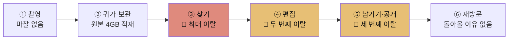
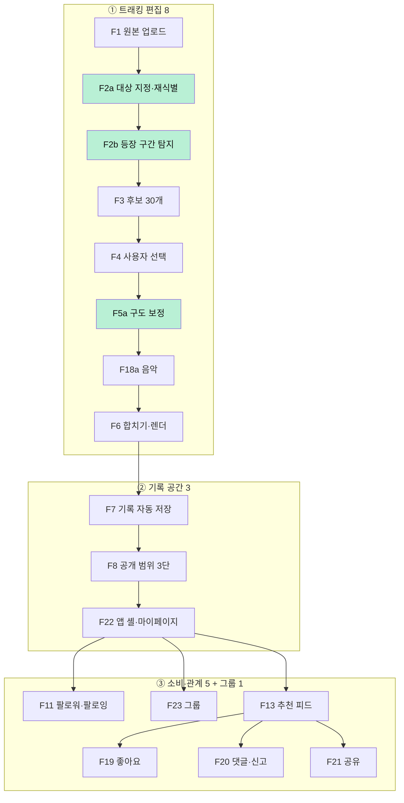
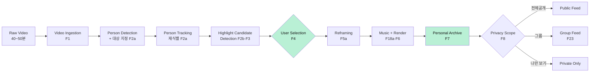
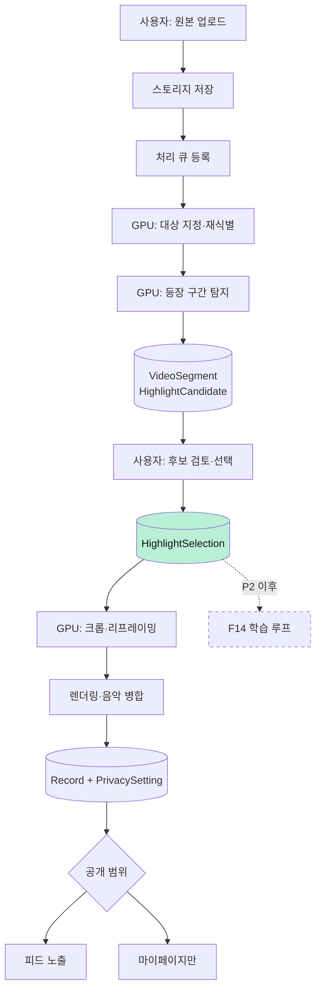

# HILiT PRD v0.1

| 항목 | 내용 |
| --- | --- |
| **Owner 팀** | HILiT Product — 제품 아키텍트 · AI 팀 · 클라이언트 · 백엔드 · 디자인 |
| **최종 업데이트** | 2026-08-30 |
| **PRD Status** | **Draft** |
| **Source of Truth** | `VPS_v0_3.html` (Value Proposition 0.3, 2026-08-29 개정) |
| **보조 근거** | `Value-Proposition_claude-opus-5-1m_effort-high (1).html` · 팀 PRD 초안 `hilit-prd-v1_0.html` |
| **이번 릴리스 범위** | **MVP 17개 기능** — Gate A · Gate B 통과가 조건 |
| **다루지 않는 것** | 수익 모델 · 가격 · 매출 목표 (구독 도입 여부와 시점 미정) |

---

## 표기 규칙 — 모든 숫자는 출처 상태를 갖는다

| 태그 | 뜻 |
| --- | --- |
| **[SOURCE]** | VPS 0.3에 **직접 명시**된 값. 그대로 옮겼다 |
| **[HYPOTHESIS]** | VPS 0.3이 **1년차 가설·추정**으로 명시한 값. 실측치가 아니다 |
| **[PROPOSED]** | 이 PRD가 **새로 제안하는 초안**. VPS에 근거가 없다. 착수 전 팀 합의가 필요하다 |
| **[INFERENCE]** | VPS 내용을 제품 요구사항으로 **해석**한 것 |
| **[TBD]** | 추가 의사결정이 필요하다 |
| 🔴 **[EVIDENCE GAP]** | **VPS와 PRD 사이 논리 연결이 끊긴 지점.** 근거 보강 없이 진행하면 위험하다 |

> **NFR(5장)·데이터/API(6장)의 수치는 대부분 [PROPOSED]다.** VPS는 제품 가치를 다루고 시스템 사양은 다루지 않았다.

### 이 PRD가 스스로에게 건 3가지 금지

| # | 금지 | 이유 |
| --- | --- | --- |
| **N1** | **경쟁사 대비 배수·퍼센트를 쓰지 않는다** | "탐지율 2배", "원가 20% 절감" 같은 표현은 **측정된 적 없는 분모**를 전제한다. VPS의 주장은 범주적이다 — *"코트에는 말하는 사람이 없다. 이 조건에서 사람을 놓치지 않는 서비스는 조사한 목록에 없다"*. 범주적 주장이 정량 주장보다 **강하고 반박하기 어렵다.** 약한 형태로 번역하지 않는다 |
| **N2** | **판정할 수 없는 문장을 요구사항으로 쓰지 않는다** | "법무 검토 선행 필수"는 요구사항이 아니라 소망이다. 통과/실패를 판정할 수 없기 때문이다. **산출물 승인 = 배포 게이트**로 바꿔야 CI가 판정한다 |
| **N3** | **기준선 빈칸을 그럴듯한 숫자로 메우지 않는다** | 없는 숫자 대신 **언제·무엇으로 확정할지**를 적는다. VPS가 대시(—)로 둔 칸은 이 PRD에서도 대시로 남는다 |

---

# 1. 개요·목표

## 1.1 문제 정의

선별 페르소나 6명에게 공통으로 나타난 Pain 3가지. **실패 KPI**는 "지금 얼마나 실패하고 있는가"다.

| # | Pain | 근본 원인 | 해당 | 실패 KPI (현재) | 상태 |
| --- | --- | --- | :---: | --- | :---: |
| **P1** | 원본에서 자기 장면을 찾는 시간이 편집보다 오래 걸린다 | 고정 카메라는 경기를 담지만 **누가 어디에 있었는지는 기록하지 않는다** | **6/6** | 원본 1편당 탐색 **60분 이상** · 원본→완성 전환율 **약 4%** (원본 47편 → 업로드 2건) | [SOURCE] |
| **P2** | 고정 카메라는 사람을 따라오지 않아 화면에 작게 잡힌다 | **P1과 원인이 동일** | 3/6 | 재촬영 **1~3회/결과물** · "잘 잡혔다" 평가 **측정 불가** | [SOURCE] |
| **P3** | 공개할 자신이 없으면 기록도 남지 않는다 | 기존 SNS는 **올려야 남는** 구조다 | 3/6 | 비공개 기록 비율 **0%** · 월 기록 생성 **0.7건** · 편집 외주 **월 60만 원**(강태오) | [SOURCE]/[HYPOTHESIS] |

> **P1과 P2의 원인은 하나다.** 고정 카메라가 사람의 위치를 모른다는 사실이 두 문제를 동시에 만들었다. 그래서 **사용자 트래킹 하나가 P1과 P2를 함께 없앤다**. [SOURCE]

## 1.2 Value Proposition

> ### **① AI가 영상 속 나를 끝까지 따라가며 하이라이트를 찾아주고, 내가 선택한 순간을 나 중심의 영상으로 완성한다.**
> ### **② 누구에게 보여주기 위한 기록뿐만 아니라 나를 위해 오래 남겨두는 개인 기록 공간을 제공한다.**
>
> *"40분을 넣으면 **내가 주인공인** 15초가 나온다. 그리고 그 15초는 올리지 않아도 남는다."* [SOURCE]

## 1.3 Core Job

> **"이미 찍어둔 긴 영상에서, 내가 의미 있다고 판단한 순간만 건져서, 남에게 보여줄지와 무관하게 내 기록으로 만들고 싶다."** [SOURCE]

**세 부분으로 나눠 읽는다. 이 의미를 임의로 확장하지 않는다.**

| 구절 | 제품 경계 |
| --- | --- |
| **이미 찍어둔** | 촬영 기능을 만들지 않는다 |
| **내가 판단한** | 최종 선택권을 기계에 넘기지 않는다 |
| **보여줄지와 무관하게** | 기록과 공개를 분리한다 |

> 세 조건 중 **하나라도 빠지면 이 Job은 기존 대안으로도 충족된다.** [SOURCE]

## 1.4 목표

| 구분 | 내용 | 상태 |
| --- | --- | :---: |
| **우리가 푸는 것** | 게시 **이전**의 실행 문제 — 찾기 · 구도 · 완성 · 반복 노동 · 저장공간 | [SOURCE] |
| **우리가 풀지 않는 것** | 게시 **이후**의 결과 문제 — 팔로워 성장 · 조회수 · 수익화. 다만 카테고리 랭킹(F15, P1)으로 노출 자리는 만든다 | [SOURCE] |

> **범위를 좁히는 것이 오히려 더 강한 논증이 된다.** Podia 조사에서 크리에이터의 1위 고민은 편집이 아니라 **오디언스 성장(32.9%)** 이었다. 이 사실을 무시하고 "가장 큰 문제는 편집"이라고 말하면 즉시 반박당한다. [SOURCE]

## 1.5 성공 지표

| 구분 | 지표 | 값 | 상태 |
| --- | --- | ---: | :---: |
| **1년차 성공 지표** | 기록 3개 이상 축적 사용자 | **1만 명** | [HYPOTHESIS] |
| | 처리 영상 | **연 12만 편** (1만 명 × 월 1편) | [HYPOTHESIS] |
| **매출** | — | **다루지 않음** (구독 미정) | [SOURCE] |

> 처리 물량 12만 편은 **가치사슬 분석의 GPU 원가에 직접 비례**하므로 사업 계획과 원가가 같은 지표를 공유한다. [SOURCE]

---

# 2. 사용자와 페르소나

## 2.1 세그먼트 선별

**1순위 기준은 "원본 영상이 있는가"다.** HILiT은 앱에서 촬영하지 않으므로 원본이 없으면 제품이 아예 작동하지 않는다. 2순위는 "돈이나 시간을 쓸 의향이 있는가". [SOURCE]

| 세그먼트 | 정의 | 국내 규모 | 페르소나 | 처리 |
| --- | --- | ---: | --- | --- |
| **Q1** | 원본 O · 지불의향 O | 약 50만 명 [HYPOTHESIS] | 김도현(A-1) · 박서연(A-2) · 강태오(C-1) · 오세진(C-3) | **대상 · 1순위** |
| **Q4** | 원본 O · 지불의향 X | 약 450만 명 [HYPOTHESIS] | 이준혁(A-3) · 정민수(B-2) | **대상 · 2순위** |
| Q2 | 원본 X · 지불의향 O | 약 200만 명 [HYPOTHESIS] | 최윤아(B-1) | 보류 — F17 촬영 가이드 단계에서 열림 |
| Q3 | 순수 소비자 | 약 2,800만 명 [HYPOTHESIS] | — | 타깃 아님 |
| 밖 | 첫 카테고리(농구·구기) 밖 | — | 한지우(B-3) · 서하린(C-2) | 확장 단계 · Proof 근거로 재활용 |

## 2.2 핵심 페르소나 6명

| ID | 페르소나 | 세그먼트 | 핵심 Pain | Needs |
| --- | --- | :---: | --- | --- |
| **A-1** | **김도현** 26 · 3년차 직장인 · 주 2회 사회인 농구 · 본계정+부계정 | Q1 | 40분 원본에서 자기 장면 찾는 데 **1시간 이상** · 코트 반대편에서 **화면 구석에 작게** · 원본 47개 적재, 3개월 업로드 2건 | 원본을 뒤지지 않고 잘 나온 장면만 남기기 |
| **A-2** | **박서연** 22 · 풋살 동아리 주장 겸 촬영 담당 | Q1 | 팀원 **8명분**을 사람 손으로 찾는 것은 불가능 · 촬영 담당이라 **자기 기록만 없음** | 원본 하나로 각자 자기 장면 가져가게 · 자기 기록도 남기기 |
| **C-1** | **강태오** 24 · 농구 크리에이터 · 팔로워 8,200 | Q1 | 촬영 1시간 + **편집 3시간** → 주 3회 못 지킴 · 외주 **월 60만 원대** [HYPOTHESIS ⚠️] | 완성도 지키며 편집 시간만 줄이기 |
| **C-3** | **오세진** 30 · 풋살팀 운영 · 팀원 12명 | Q1 | **12명이 각자 원하나 편집 인력 1명** · 팀 계정 하나라 개인 기록이 안 남음 | 팀원이 각자 스스로 만들게 |
| **A-3** | **이준혁** 34 · 카페 자영업 · 액션캠 50분·4GB | Q4 | 남길 건 15초인데 **50분 원본을 못 지움** · 유료 앱 3개 결제 후 전부 해지 | 15초 건지고 원본 지우기 · 공개 없이 해마다 쌓기 |
| **B-2** | **정민수** 28 · 제조업 사무직 · 업로드 연 3회 | Q4 | 컷·자막·음악까지 **30분 넘어 중도 포기** · 갤러리 미편집 **약 200개** | 편집 실력 없이 볼 만한 영상 하나 · 1년 뒤 다시 볼 기록 |

*모든 인물·수치는 VPS 0.3 기준 [SOURCE], 팔로워·영상 개수 등은 가상 인터뷰 예시 [HYPOTHESIS]*

## 2.3 Persona Journey — 이탈이 몰린 곳



| 단계 | 현재 상태 | 마찰 |
| --- | --- | --- |
| ① 촬영 | 삼각대 세우고 녹화 — 1분이면 끝 | 없음 |
| ② 귀가·보관 | 원본 4GB 적재 | 저장공간 압박 |
| **③ 찾기** | 40분을 10초씩 되돌려 봄 | 🔴 **1시간 이상 · 최대 이탈** |
| **④ 편집** | 컷·자막·음악 직접 | 🔴 **30분 초과 · 중도 포기** |
| **⑤ 남기기·공개** | *"이 정도를 남한테 보여줄 수준인가"* | 🔴 **세 번째 이탈** |
| ⑥ 재방문 | 기록이 없으니 돌아올 이유도 없음 | 원본만 증가 |

> **가설의 표현을 "편집이 어려워서 못 올린다"에서 "촬영 이후에 발생하는 시간·기술·반복 작업의 부담"으로 바꿔야 한다.** 앞은 직접 조사 데이터가 없어 반박당하고, 뒤는 여러 조사에서 반복 확인된다. [SOURCE]

## 2.4 Pain → KPI 변환

| Persona | Pain | 실패 KPI | Baseline | Target | 측정 방법 | 상태 |
| --- | --- | --- | ---: | ---: | --- | :---: |
| 김도현·정민수·강태오 | 장면 탐색 시간 | 원본 1편당 탐색 소요 시간 | **60분 이상** [SOURCE] | **5분 이내** [HYPOTHESIS] | task completion time · 클라이언트 계측 | O1 |
| 김도현·강태오·오세진 | 완성으로 안 이어짐 | 원본 대비 완성 영상 전환율 | **약 4%** [SOURCE] | **60% 이상** [HYPOTHESIS] | 업로드 건수 ÷ 완성 건수 | O2 |
| 김도현·강태오 | 화면에 작게 잡힘 | "잘 잡혔다" 평가 비율 | **측정 불가** [SOURCE] | **80% 이상** [HYPOTHESIS] | 완성 직후 1문항 설문 | O3 |
| 전원 | 추적 누락 | 실제 등장 구간 대비 탐지 비율 | **해당 없음** [SOURCE] | **85% 이상** [HYPOTHESIS] | 사람이 표시한 정답과 비교 | **O9 · Gate A** |
| 강태오·서하린 | 재촬영 | 결과물당 재촬영 횟수 | **1~3회** [SOURCE] | **0회** [HYPOTHESIS] | 사용자 로그 | O10 |
| 이준혁 | 원본 못 지움 | 결과물 확보 후 원본 삭제 실행률 | **0%** [SOURCE] | **50% 이상** [HYPOTHESIS] | F9 이벤트 | O4 |
| 이준혁·정민수·최윤아 | 공개 부담 | 비공개(나만 보기) 기록 비율 | **0%** [SOURCE] | **30% 이상** [HYPOTHESIS] | F8 설정값 | O5 |
| 전원 | 기록 끊김 | 월간 기록 생성 편수 | **월 0.7건** [SOURCE] | **월 4건** [HYPOTHESIS] | 기록 생성 이벤트 | O6 |
| 전원 | 재방문 없음 | 기록 3개 이상 축적 사용자 | — | **1만 명** [HYPOTHESIS] | 코호트 분석 | **O7 · North Star** |
| 강태오·오세진 | 외주 지출 | 편집 외주 지출 | **월 60만 원** [HYPOTHESIS] | **0원** [HYPOTHESIS] | 인터뷰 | O8 |

---

# 3. 사용자 스토리와 수용 기준

각 JTBD를 User Story로 변환하고 **측정 가능한 AC를 최소 3개** 붙였다. JTBD 원문은 [SOURCE].

## US-1 · 김도현 (A-1, Q1) — 40분에서 내 장면 찾기

> **As a** 주 2회 농구를 하고 부계정을 운영하는 직장인,
> **I want** 40분 원본에서 내가 잘 나온 장면을 대신 찾아주기를,
> **so that** 편집에 한 시간을 쓰지 않고도 오늘의 기록을 남길 수 있다. [SOURCE]

| AC | Given | When | Then |
| --- | --- | --- | --- |
| **AC1-1** | 40분·4GB 원본이 업로드되어 있고 사용자가 자신을 1회 지정했을 때 | 탐지(F2b)를 실행하면 | 실제 등장 구간 대비 탐지 비율이 **≥ 85%** [HYPOTHESIS · O9 · **Gate A 판정**] |
| **AC1-2** | 탐지가 완료되었을 때 | 후보 목록을 조회하면 | **약 30개**의 후보가 제시되고 [SOURCE], 각 후보에 시작·종료 타임코드가 표시된다 |
| **AC1-3** | 40분 원본이 업로드되었을 때 | 탐지를 실행하면 | `detection_started` → `selection_opened` 구간 **p95 ≤ 8분** [PROPOSED] — O1(체감 5분) 달성의 상한<br>*(VPS 원문 "체감 5분" → 계측 이벤트로 치환. 무엇을 무엇으로 바꿨는지 남겨 두어 치환이 틀리면 되돌린다)* |
| **AC1-4** | 업로드가 네트워크 오류로 중단되었을 때 | 사용자가 재시도하면 | 중단 지점부터 **이어올리기**가 되고 재개 성공률 **≥ 99%** [PROPOSED] |
| **AC1-5** | 후보 목록이 표시되었을 때 | 사용자가 어떤 후보든 선택·제외하면 | **후보 100%에 대해** 선택·제외가 가능하다 [INFERENCE — Core Job "내가 판단한"] |

## US-2 · 이준혁 (A-3, Q4) — 원본을 지울 수 있게

> **As a** 액션캠으로 50분을 찍고 저장공간 경고를 받는 사람,
> **I want** 50분 원본에서 남길 15초를 확실히 건져 주기를,
> **so that** 공개하지 않고도 내 운동 기록을 해마다 쌓을 수 있다. [SOURCE]

| AC | Given | When | Then |
| --- | --- | --- | --- |
| **AC2-1** | 완성 영상이 생성되었을 때 | 저장을 실행하면 | **공개 범위 설정과 무관하게** 개인 기록에 저장된다 [SOURCE · F7] |
| **AC2-2** | 기록이 저장되었을 때 | 공개 범위를 선택하면 | **전체공개 / 그룹에만 공개 / 나만 보기** 3단 중 하나를 **기록 단위로** 지정할 수 있다 [SOURCE · F8] |
| **AC2-3** | 저장이 완료되었을 때 | 저장 성공 여부를 확인하면 | 기록 저장 성공률 **≥ 99.9%** [PROPOSED] — 여기서 유실되면 제품 주장 자체가 무너진다 |
| **AC2-4** | 아무 공개 범위도 선택하지 않았을 때 | 기록을 저장하면 | 기본값은 **나만 보기**다 [PROPOSED — VPS는 기본값을 명시하지 않음] |

## US-3 · 정민수 (B-2, Q4) — 편집 실력 없이 완성

> **As a** 편집에 30분 넘게 걸려 매번 포기하는 사람,
> **I want** 편집 실력 없이도 볼 만한 영상 하나가 완성되기를,
> **so that** 1년 뒤에 다시 볼 기록을 갖고 싶다. [SOURCE]

| AC | Given | When | Then |
| --- | --- | --- | --- |
| **AC3-1** | 사용자가 후보를 선택했을 때 | 구도 보정(F5a)이 실행되면 | 추적 좌표 기준으로 프레임이 재구성되고, 완성 후 설문에서 "잘 잡혔다" 응답이 **≥ 80%** [HYPOTHESIS · O3] |
| **AC3-2** | 선택 장면이 확정되었을 때 | 음악 라이브러리(F18a)를 열면 | **저작권이 정리된 곡만** 앱 안에서 제공된다 [SOURCE] — 외부 반입 경로를 제공하지 않는다 |
| **AC3-3** | 장면·음악이 확정되었을 때 | 렌더를 실행하면 | 하나의 영상으로 합쳐지고 **p95 ≤ 90초** [PROPOSED] |
| **AC3-4** | 완성까지의 전 과정에서 | 사용자가 작업을 진행하면 | **다른 앱으로 나가지 않고** 완성된다 [SOURCE — Core Job "앱을 옮기지 않고 완성"] · 계측: 세션 내 외부 앱 전환 이벤트 **0건** |
| **AC3-5** | 음악 라이브러리(F18a)가 열렸을 때 | 사용자가 곡을 탐색·삽입하면 | 곡 수 **[TBD] 이상** · 라이선스 문서 확보율 **100%** · 곡 삽입 성공률 **≥ 99%** [PROPOSED] |

> **AC3-5를 왜 따로 두는가.** F18a는 P0인데 "저작권이 정리된 곡만"이라는 조건만으로는 **곡 12개짜리 목록으로 출시해도 AC를 통과한다.** VPS는 F18a를 O2(완성 전환율 4% → 60%) 달성의 인과 경로로 지목했으므로 [SOURCE], 규모·커버리지·삽입 성공률에 검수 기준이 필요하다. 곡 수 목표는 **Q9(음원 라이선스 조달) 결정 직후 확정**한다.

## US-4 · 박서연 (A-2, Q1) — 각자 자기 장면을 가져가기

> **As a** 풋살 동아리 주장 겸 촬영 담당,
> **I want** 사람마다 자기가 나온 장면을 각자 골라 가져갈 수 있기를,
> **so that** 촬영 담당인 나도 내 기록을 남길 수 있다. [SOURCE]

> 🔴 **[EVIDENCE GAP]** 이 Story를 **완전히** 충족하려면 F16(팀 공유 편집)이 필요한데 **F16은 P3·미정**이다 [SOURCE]. MVP 범위에서는 **박서연 본인의 기록**만 해결되고, 팀원 8명 배포는 해결되지 않는다. AC는 MVP 범위로 한정해 작성한다.

| AC | Given | When | Then |
| --- | --- | --- | --- |
| **AC4-1** | 박서연이 자신을 지정했을 때 | 탐지를 실행하면 | **촬영 담당인 자신의 등장 구간**도 다른 사용자와 동일한 정확도로 탐지된다 [INFERENCE] |
| **AC4-2** | 기록이 완성되었을 때 | 그룹에만 공개를 선택하면 | 지정한 그룹 구성원에게만 노출된다 [SOURCE · F23] |
| **AC4-3** | 그룹 구성원 목록을 조회할 때 | 필터를 적용하면 | **p95 ≤ 300ms** [PROPOSED] |

## US-5 · 오세진 (C-3, Q1) — 소비 루프로 다시 오게

> **As a** 팀 계정을 혼자 관리하는 운영자,
> **I want** 팀원 각자가 자기 하이라이트를 스스로 만들 수 있기를,
> **so that** 홍보 주기를 나 한 명의 편집 속도에서 떼어낼 수 있다. [SOURCE]

> 🔴 **[EVIDENCE GAP]** US-4와 동일 — 완전 충족은 F16(P3) 필요. MVP는 **각 팀원이 개별 계정으로 자기 원본을 처리**하는 경로만 지원한다.

| AC | Given | When | Then |
| --- | --- | --- | --- |
| **AC5-1** | 사용자가 앱을 실행했을 때 | 앱 셸이 로드되면 | **팔로잉 탭**에 영상이 바로 재생되고 첫 프레임 **p95 ≤ 1.5초** [PROPOSED · F22] |
| **AC5-2** | 공개된 기록이 있을 때 | 다른 사용자가 좋아요·댓글을 남기면 | 작성자에게 반영되며, **"나만 보기" 기록에는 좋아요가 붙지 않는다** [SOURCE · F19] |
| **AC5-3** | 기록을 앱 밖으로 보낼 때 | 링크·카카오톡 공유를 실행하면 | **공유 링크도 기록의 공개 범위를 따른다** [SOURCE · F21] |

## US-6 · 강태오 (C-1, Q1) — 편집 시간 단축

> **As a** 주 3회 업로드를 목표로 하는 농구 크리에이터,
> **I want** 편집 시간을 3시간에서 크게 줄여 주기를,
> **so that** 쌓여 있는 원본을 업로드로 연결하고 성장 근거를 만들 수 있다. [SOURCE]

| AC | Given | When | Then |
| --- | --- | --- | --- |
| **AC6-1** | 원본 업로드부터 완성까지 | 전 과정을 1회 수행하면 | 사용자 조작 시간이 **[TBD] 목표 미확정** — Gate B 이후 실측으로 설정 |
| **AC6-2** | 완성 영상이 저장되었을 때 | 외부 플랫폼 발행이 필요하면 | 🔴 **[EVIDENCE GAP]** VPS 0.3은 외부 내보내기 정책을 명시하지 않는다. **[TBD] 결정 필요** |
| **AC6-3** | 후보 30개가 제시되었을 때 | 사용자가 검토하면 | 후보 목록 렌더 **p95 ≤ 1초** [PROPOSED] |

---

## 3.7 실패 경로 AC — 성공 경로만 정의된 요구사항은 출시되지 않는다

> VPS 0.3은 **가치**를 다루고 실패 경로를 다루지 않는다. 그러나 40분·4GB 원본을 다루는 파이프라인에서 사용자가 실제로 겪는 것은 대부분 여기다. 아래 9종은 **이 PRD의 신설**이며 VPS에 대응 근거가 없다 [PROPOSED].

| AC | Given | When | Then |
| --- | --- | --- | --- |
| **AF-1** | 지원하지 않는 코덱·컨테이너 파일일 때 | 업로드를 시도하면 | 업로드 **전에** 거부되고, 지원 형식과 **변환 방법**을 안내한다 (업로드 후 실패 금지) |
| **AF-2** | 업로드가 네트워크 오류로 끊겼을 때 | 앱을 재실행하면 | 진행률이 보존된 상태로 **이어올리기**를 제안한다 → AC1-4 |
| **AF-3** | 탐지 결과가 **0건**일 때 | 후보 화면에 진입하면 | 빈 화면 대신 **원인 후보**(대상 미검출 / 촬영 거리 / 조도)와 다음 행동을 제시한다 |
| **AF-4** | F2a 재식별 신뢰도가 임계 미만일 때 | 후보를 제시하면 | 해당 후보를 **저신뢰로 표시하거나 제외**한다 — 타인 장면을 조용히 섞지 않는다 [SOURCE · R2] |
| **AF-5** | 렌더가 실패했을 때 | 사용자가 재시도하면 | 선택·음악 상태가 보존되고 **처음부터 다시 고르게 하지 않는다** |
| **AF-6** | 처리 중 앱이 종료되었을 때 | 재진입하면 | 마지막 완료 단계에서 재개된다 (업로드/탐지/선택/렌더 단계별 체크포인트) |
| **AF-7** | 그룹(F23) 구성원이 이탈했을 때 | 그의 장면이 포함된 기록을 조회하면 | 본인 기록은 유지되고, 이탈자 대상 공유 링크는 **회수**된다 |
| **AF-8** | 팔로잉이 0명이거나 새 영상이 없을 때 | 피드를 열면 | 빈 피드 대신 **본인 기록 또는 추천**을 노출한다 — O7 재방문 루프가 첫 진입에서 끊기지 않게 |
| **AF-9** | 저장 용량·쿼터를 초과했을 때 | 업로드를 시도하면 | 초과 사실과 **정리 가능한 대상**을 함께 제시한다 (원본 삭제는 US-2의 핵심 동기다) |

### 상위 지표 — 파이프라인 완주율

| KPI | 정의 | Baseline | Target | 상태 |
| --- | --- | --- | ---: | :---: |
| **S-완주** | `render_succeeded` ÷ `detection_started` | 미측정 | **≥ 95%** | [PROPOSED] |

> **왜 상위 지표가 따로 필요한가.** AF-1~AF-9는 각각 **알려진** 실패만 잡는다. 파이프라인 완주율은 **아직 이름 붙이지 못한 누수**까지 하나로 잡아낸다. 개별 실패 AC가 전부 통과하는데 완주율이 80%라면, 우리가 모르는 실패 경로가 있다는 뜻이다.

---

# 4. 기능 요구사항

## 4.1 Feature Architecture



**민트색 F2a · F2b · F5a가 사용자 트래킹 기능** — MVP 17개 중 셋이며 고객 가치의 원천이다. [SOURCE]

## 4.2 MSCW Prioritization

| 분류 | Feature | 근거 (Core Job 기여 · Pain 제거 · 차별 가치) |
| --- | --- | --- |
| **Must** | F1 · F2a · F2b · F3 · F4 · F5a · F6 · F7 · F8 · F22 | Core Job 3조건(이미 찍어둔 / 내가 판단 / 공개 무관)이 이 열로 성립. F2a·F2b·F5a는 **차별 가치의 원천** |
| **Must** | F18a | 없으면 사용자가 CapCut·릴스로 내보내 붙이고 **그 순간 기록도 그쪽에 남는다** — Core Job "앱을 옮기지 않고 완성"이 깨진다 [SOURCE] |
| **Must** | F11 · F23 · F13 · F19 · F20 · F21 | Core Job에는 없으나 **O7 재방문 루프**에 필수. 관계망은 나중에 붙일 수 없다 [SOURCE] |
| **Should** | F9 · F10 · F12 · F15 · F5b | MVP 직후(P1). O4·O6·O7 심화 및 결과물 완성도 |
| **Could** | F14 | 방어선이지만 **학습할 선택 데이터가 사용자 없이는 생기지 않는다** (P2) [SOURCE] |
| **Won't** | F16 · F17 · F18b | 기획 미정. 정해지지 않은 것을 MVP에 넣지 않는다 (P3) [SOURCE] |

## 4.3 Functional Requirements — MVP 17

| ID | Feature | User Job | Requirement | 중요도 | 우선 | AC | 상태 |
| --- | --- | --- | --- | :---: | :---: | --- | :---: |
| **F1** | 긴 원본 영상 업로드 | 이미 찍어둔 영상을 가져온다 | 40~50분 · 4GB급 파일 수용 · 이어올리기 지원 | H | P0 | AC1-4 | [SOURCE] |
| **F2a** | 추적 대상 지정·재식별 | 내가 누구인지 앱이 알게 한다 | 사용자가 자기를 **1회 지정** · 가려졌다 다시 나타나도 **같은 사람으로 인식** | H | P0 | AC1-1 | [SOURCE] |
| **F2b** | 등장 구간 자동 탐지 | 내 장면을 대신 찾아준다 | 영상 내내 추적하며 등장 구간 표시 · **최우선 검증 대상** | H | P0 | **AC1-1 · Gate A** | [SOURCE] |
| **F3** | 장면 후보 약 30개 | 판단할 대상을 좁혀준다 | 1차 컷편집 · **온전히 잡힌 구간 우선** | H | P0 | AC1-2 | [SOURCE] |
| **F4** | 사용자 장면 선택 UI | 의미 있는 순간을 내가 고른다 | "여기가 하이라이트다" · **후보 100%에 선택·제외 가능** | H | P0 | AC1-5 | [SOURCE] |
| **F5a** | 사용자 중심 크롭·리프레이밍 | 내가 알아볼 수 있게 잡아준다 | **추적 좌표로 프레임 재구성** | H | P0 | AC3-1 | [SOURCE] |
| **F18a** | 음악 라이브러리 | 앱을 옮기지 않고 완성한다 | **저작권이 정리된 곡만** 앱 내 제공 · 사용자가 곡을 가져오게 하지 않는다 | M | P0 | AC3-2 | [SOURCE] |
| **F6** | 합치기·렌더링 | 앱을 옮기지 않고 완성한다 | 선택 장면을 하나의 영상으로 병합 | H | P0 | AC3-3 | [SOURCE] |
| **F7** | 개인 기록 자동 저장 | 공개하지 않아도 남는다 | **공개와 무관하게** 마이페이지에 저장 | H | P0 | AC2-1 · AC2-3 | [SOURCE] |
| **F8** | 기록 단위 공개 범위 | 계정을 쪼개지 않는다 | **전체공개 · 그룹에만 공개 · 나만 보기** 3단 | H | P0 | AC2-2 · AC2-4 | [SOURCE] |
| **F22** | 앱 셸 — 3탭·+·마이페이지 | 앱을 열면 볼 것이 있다 | 진입 시 **팔로잉 탭** 재생 · 탭은 **팔로잉·추천·그룹** · 가운데 **+**가 편집·업로드 | H | P0 | AC5-1 | [SOURCE] |
| **F11** | 팔로워 · 팔로잉 | 가까운 사람과 나눈다 | 관계는 **공개 기록만** 정한다 · v0.6에서 맞팔로우를 걷어냄 | H | P0 | — | [SOURCE] |
| **F23** | 그룹 · 소그룹 공유 | 같이 뛰는 사람에게만 연다 | 승인 절차 없이 생성 · **F8의 선택지 하나 + F13의 탭 하나**로 붙는다 | H | P0 | AC4-2 · AC4-3 | [SOURCE] |
| **F13** | 추천 피드 · 진입 화면 | 콘텐츠를 소비한다 | MVP는 **팔로잉·인기 기준** · 취향 설문(F12) 반영은 이후 | M | P0 | AC5-1 | [SOURCE] |
| **F19** | 좋아요 | 반응을 받는다 | **공개 범위 안에서만** 보인다 — "나만 보기"에는 붙지 않는다 | M | P0 | AC5-2 | [SOURCE] |
| **F20** | 댓글 · 신고 | 반응을 주고받는다 | 댓글에 **신고 기능 포함** — 공개 기록을 여는 최소 안전장치 | M | P0 | — | [SOURCE] |
| **F21** | 공유 — 링크·카톡 | 앱 밖의 사람에게 보낸다 | **공유 링크도 기록의 공개 범위를 따른다** | M | P0 | AC5-3 | [SOURCE] |

**MVP 외 (참고)**

| ID | Feature | 우선 | 사유 |
| --- | --- | :---: | --- |
| F5b | 구도 규칙·앵글 연출 | P1 | 별도 연출 규칙 설계 필요 |
| F9 | 원본 삭제 안내 | P1 | O4 |
| F10 | 기록 타임라인 | P1 | O6·O7 |
| F12 | 취향 설문 | P1 | F13이 팔로잉·인기로 먼저 작동 |
| F15 | 카테고리 랭킹 | P1 | "게시 이후 문제" 선 바로 위 · 노출 자리를 만드는 유일한 수단 |
| F14 | 선택 데이터 학습 | P2 | 사용자 없이 데이터가 안 생김 |
| **F16** | 팀 공유 편집 | **P3** | 🔴 팀 계정·공유 권한·얼굴 동의·비용 부담 **넷 다 미정** |
| F17 | 촬영 가이드 | P3 | Q2 확장용 |
| F18b | 자막 편집 | P3 | 기획 미정 |

## 4.4 구현 규모와 스프린트 적합성 [PROPOSED]

> **인·일로 환산하지 않는다.** 팀 속도(velocity) 실측이 없으므로 **상대 규모**만 적는다. 첫 스프린트 종료 후 실측으로 보정한다.

| 규모 | 정의 | 1스프린트 적합성 |
| :--: | --- | --- |
| **S** | 기존 패턴 조합 · 신규 기술 위험 없음 | ✅ 한 스프린트에 **복수** 소화 가능 |
| **M** | 신규 설계가 필요하나 **결과가 예측 가능** | ✅ 한 스프린트에 **1개** |
| **L** | **모델 성능이 결과를 좌우** — 종료 조건이 정확도·만족도 | ❌ **부적합** — 아래 참조 |

### Must (MVP 17)

| 규모 | Feature | 판정 근거 |
| :--: | --- | --- |
| **L** | **F2a · F2b · F5a** | **크기 때문이 아니라 종료 조건 때문이다.** 완료 판정이 "구현됐다"가 아니라 **"85%에 도달했다"(O9) · "80%가 잘 잡혔다고 답했다"(O3)** 이다. 정확도는 스프린트로 **도달**하는 것이 아니라 반복으로 **수렴**한다 |
| **M** | F1 업로드 | 4GB 청크·이어올리기·재개 성공률 99% — 인프라 설계 필요 |
| **M** | F6 렌더링 | 인코딩 파이프라인 · p95 90초 |
| **M** | F3 후보 30개 | F2b 출력의 컷 분할·정렬 규칙 |
| **M** | F22 앱 셸 | 3탭 + 진입 자동재생 p95 1.5초 |
| **M** | F13 추천 피드 | 팔로잉·인기 랭킹 + 피드 API p95 400ms |
| **M** | F23 그룹 | F8·F13 **양쪽에 걸리는 교차 의존** |
| **M** | F18a 음악 | 기술 규모는 M이나 **차단 요인이 계약**이다 → Q9 |
| **S** | F4 · F7 · F8 · F11 · F19 · F20 · F21 | 목록·토글·관계·반응 — 기존 패턴 조합 |

**Must 17 = L 3 · M 7 · S 7**

### Should · Could

| 규모 | Feature | 판정 근거 |
| :--: | --- | --- |
| **M** | F5b 구도 규칙 · F15 카테고리 랭킹 | 연출 규칙 / 랭킹 로직 신규 설계 |
| **S** | F9 원본 삭제 안내 · F10 타임라인 · F12 취향 설문 | 화면·조회 중심 |
| **L** | **F14 선택 데이터 학습** | 모델 작업인 데다 **학습할 데이터가 사용자 없이는 생기지 않아 착수 자체가 불가**하다 [SOURCE] — Could 유보의 실질 사유가 우선순위가 아니라 **선행 조건 부재**임을 여기서 확인한다 |

### 🔴 이 표가 드러낸 것 — L 3개는 스프린트 백로그에 두면 안 된다

F2a·F2b·F5a를 일반 스프린트에 넣으면 **매 스프린트 "미완"으로 이월**된다. 종료 조건이 스프린트 안에서 판정되지 않기 때문이다. [PROPOSED] **두 트랙으로 분리한다.**

| 트랙 | 대상 | 종료 조건 | 리듬 |
| --- | --- | --- | --- |
| **Gate A 트랙** | F2a · F2b · F5a | **O9 ≥ 85% · O3 ≥ 80%** 도달 | 스프린트가 아니라 **측정 주기** |
| **스프린트 트랙** | M 7 · S 7 | 기능 완료 + AC 통과 | 통상 스프린트 |

> **두 트랙은 병렬이다.** Gate A가 열리기를 기다리며 스프린트 트랙을 멈추면 안 된다 — S 7개(F4·F7·F8·F11·F19·F20·F21)는 **탐지 결과가 없어도 만들 수 있다.** 다만 Gate A가 실패하면 스프린트 트랙 결과물은 **기록 앱 하나로 남는다**(§9.4 D1). 이것이 R1을 치명으로 판정한 이유다.

**패스 기준 대비** — "Could 이상 1스프린트 내 구현 가능성"에 대해: **S 7 · M 7은 적합**, **L 4(F2a·F2b·F5a·F14)는 부적합하며 그 사유를 명시**했다. F14는 선행 조건 부재로 **규모 판정 이전 단계**다.

## 4.5 Job-Feature Traceability

| Core Job 구절 | 담당 Feature | 없으면 |
| --- | --- | --- |
| **"이미 찍어둔 긴 영상에서"** | F1 | 촬영 앱이 되어 제품 정의가 바뀐다 |
| **"내가 의미 있다고 판단한 순간만 건져서"** | F2a · F2b · F3 · **F4** | 기계 판정이 되어 기존 대안과 같아진다 |
| **"남에게 보여줄지와 무관하게 내 기록으로"** | F7 · F8 · F22 · F23 | 올려야 남는 구조가 되어 Instagram과 같아진다 |
| *(가치 전달 통로)* | F5a · F18a · F6 | 완성이 안 되거나 다른 앱으로 나간다 |
| *(재방문 루프)* | F11 · F13 · F19 · F20 · F21 | O7이 성립하지 않는다 |

---

# 5. 비기능 요구사항

> **이 장의 수치는 대부분 [PROPOSED]다.** VPS 0.3은 제품 가치를 다루고 시스템 사양을 다루지 않았다.

## 5.1 Performance

| 항목 | Threshold | Baseline | 근거 | 상태 |
| --- | ---: | ---: | --- | :---: |
| 앱 진입 → 첫 영상 프레임 | **p95 ≤ 1.5초** | 미측정 | AC5-1 · "로그인 화면 없이 바로 재생" | [PROPOSED] |
| 40분·4GB 원본 업로드(LTE) | **p95 ≤ 6분** | 미측정 | 이어올리기 필수 | [PROPOSED] |
| **탐지(F2b) — 40분 원본** | **p95 ≤ 8분** | 미측정 | **O1(체감 5분) 달성의 상한** | [PROPOSED] |
| 후보 목록(F3) 렌더 | **p95 ≤ 1초** | 미측정 | — | [PROPOSED] |
| 15초 결과물 렌더(F6) | **p95 ≤ 90초** | 미측정 | AC3-3 | [PROPOSED] |
| 피드·목록 API | **p95 ≤ 400ms** | 미측정 | AC5-1 | [PROPOSED] |
| 그룹 멤버 필터 | **p95 ≤ 300ms** | 미측정 | AC4-3 | [PROPOSED] |

## 5.2 Reliability

| 항목 | Threshold | 비고 | 상태 |
| --- | ---: | --- | :---: |
| 월 가용성 (앱 셸·피드·기록 조회) | **≥ 99.5%** | — | [PROPOSED] |
| 월 가용성 (AI 처리 파이프라인) | **≥ 99.0%** | 비동기 큐로 **지연은 허용, 유실은 불허** | [PROPOSED] |
| **기록 저장 성공률 (F7)** | **≥ 99.9%** | 🔴 **Gate B의 전제.** 여기서 유실되면 제품 주장 자체가 무너진다 | [PROPOSED] |
| 업로드 실패율 / 재개 성공률 | **< 0.5% / ≥ 99%** | — | [PROPOSED] |
| API 5xx 오류율 | **≤ 0.1%** | — | [PROPOSED] |
| 처리 실패 시 | 원본·중간 산출물 보존 후 **재시도 ≥ 3회** | — | [PROPOSED] |

## 5.3 AI Quality

| 항목 | Threshold | Baseline | 상태 |
| --- | ---: | ---: | :---: |
| **F2b 등장 구간 탐지율 (O9)** | **≥ 85%** | 해당 없음 (사람이 눈으로 찾음) | **[HYPOTHESIS] · Gate A 판정** |
| **F2a 재식별 오탐률** | **[TBD]** | 미측정 | 🔴 **VPS에 지표 없음 — 별도 정의 필요** |
| F5a 구도 보정 만족도 (O3) | **≥ 80%** | 측정 불가 | [HYPOTHESIS] |

> ### 🔴 [EVIDENCE GAP] F2a에 판정 지표가 없다
> VPS 0.3은 *"F2a가 틀리면 **다른 사람의 장면**을 내 하이라이트로 준다. 앞의 실패는 신뢰를 즉시 깨뜨린다"* 고 명시했으나 [SOURCE], **F2a의 정량 임계값은 제시하지 않았다.** O9(85%)는 F2b 지표다.
> **[PROPOSED]** F2a 오탐률 ≤ 5% — 다만 이 값은 근거가 없으므로 Gate A 실험에서 **F2a·F2b를 분리 계측**해 실측 후 확정한다.

## 5.4 Security & Privacy

| 항목 | 요구 | 상태 |
| --- | --- | :---: |
| 영상 저장 | 저장 시 암호화 · 접근 통제 | [PROPOSED] |
| **제3자 얼굴** | 🔴 영상에 함께 잡힌 타인의 처리 방침 **[TBD]** — VPS는 F16 논의에서만 언급 | [SOURCE·미정] |
| 삭제 요청 | 사용자 요청 시 원본·파생물 전량 삭제 | [PROPOSED] |
| 미성년자 | **[TBD]** — 서비스 대상 연령 정책 미정 | [TBD] |
| 신고 처리 | F20에 신고 기능 포함 · 처리 절차 **[TBD]** | [SOURCE·미정] |

## 5.5 Cost

| 항목 | 내용 | 상태 |
| --- | --- | :---: |
| 처리 물량 목표 | **연 12만 편** (1만 명 × 월 1편) | [HYPOTHESIS] |
| GPU 원가 | 🔴 **영상 1편당 단가 미산정** — 사업 계획과 같은 지표를 공유하므로 조기 산정 필요 | **[TBD]** |
| 원가 절감 설계 | **선택 후 고도화** — 후보 30개를 모두 고화질 처리하지 않고 사용자가 고른 것만 F5a 적용 | [INFERENCE] |

## 5.6 Observability

| 항목 | 요구 | 상태 |
| --- | --- | :---: |
| 파이프라인 단계별 계측 | 업로드·F2a·F2b·F3·F5a·F6 각 단계 소요·성공률 | [PROPOSED] |
| **Gate 판정 지표 자동 집계** | O9 · O3 · O7을 대시보드로 상시 노출 | [PROPOSED] |
| 실패 분류 | 촬영 / 모델 / UX / 인프라 / 정책 5분류 | [PROPOSED] |
| 큐 대기 시간 | p95 모니터링 · 임계 초과 시 알림 | [PROPOSED] |

---

# 6. 데이터·인터페이스 개요

## 6.1 Entity Model

| Entity | 주요 Field | 설명 | 출처 |
| --- | --- | --- | :---: |
| **User** | id · handle · profile | 개인 계정 | [SOURCE] |
| **Video** (원본) | id · owner_id · duration · size · storage_uri · status | 업로드된 긴 원본 | [SOURCE · F1] |
| **PersonTrack** | id · video_id · subject_ref · bbox_timeline | F2a가 지정한 대상의 추적 궤적 | [INFERENCE · F2a] |
| **VideoSegment** | id · video_id · start_tc · end_tc · confidence | F2b가 탐지한 등장 구간 | [INFERENCE · F2b] |
| **HighlightCandidate** | id · segment_id · rank · thumbnail | F3이 제시하는 후보 약 30개 | [INFERENCE · F3] |
| **HighlightSelection** | id · candidate_id · user_id · selected_at | 🔴 **F14 학습의 원천 데이터** | [INFERENCE · F4] |
| **GeneratedVideo** | id · owner_id · source_video_id · duration · music_id | 완성 영상 | [INFERENCE · F6] |
| **Record** (개인 기록) | id · generated_video_id · privacy · created_at | **공개와 무관하게 존재** | [SOURCE · F7] |
| **PrivacySetting** | record_id · scope(public\|group\|private) · group_ids | 기록 단위 3단 | [SOURCE · F8] |
| **Group** | id · owner_id · name · member_ids | 승인 절차 없이 생성 | [SOURCE · F23] |
| **FollowRelation** | follower_id · followee_id | 단방향 — 맞팔 개념 없음 | [SOURCE · F11] |
| **ProcessingJob** | id · video_id · stage · status · retry_count | 비동기 큐 작업 | [PROPOSED] |
| **MusicTrack** | id · title · license_ref | 저작권 정리된 곡만 | [SOURCE · F18a] |
| **Reaction** | id · record_id · user_id · type(like\|comment) · report_flag | 공개 범위 내에서만 | [SOURCE · F19·F20] |

## 6.2 AI Data Pipeline



> 🔴 **F(User Selection)와 I(Personal Archive)가 이 파이프라인의 두 분기점**이다. F가 없으면 기계 판정이 되고, I가 없으면 올려야 남는 구조가 된다.

## 6.3 Internal API (개요)

| 엔드포인트 | 역할 | 상태 |
| --- | --- | :---: |
| `POST /videos` | 원본 업로드 개시 · 이어올리기 세션 | [PROPOSED] |
| `POST /videos/{id}/subject` | F2a 대상 지정 | [PROPOSED] |
| `POST /videos/{id}/detect` | F2b 탐지 작업 큐 등록 | [PROPOSED] |
| `GET /videos/{id}/candidates` | F3 후보 목록 | [PROPOSED] |
| `POST /records` | F4 선택 → F5a·F6 렌더 → F7 저장 | [PROPOSED] |
| `PATCH /records/{id}/privacy` | F8 공개 범위 변경 | [PROPOSED] |
| `GET /feed?tab=following\|recommend\|group` | F13·F22 | [PROPOSED] |

## 6.4 External API

| 대상 | 용도 | 상태 |
| --- | --- | :---: |
| 카카오톡 공유 | F21 | [PROPOSED] |
| 음원 라이선스 제공자 | F18a | **[TBD]** — 계약 미정 |
| 외부 플랫폼 발행 | 🔴 **[EVIDENCE GAP]** VPS 0.3에 정책 없음 | **[TBD]** |

## 6.5 Data Flow — End-to-End



---

# 7. 범위·리스크·가정·의존성

## 7.1 In Scope

| 구분 | 범위 | 상태 |
| --- | --- | :---: |
| **MVP In** | 이미 촬영된 원본 · 대상 지정·재식별 · 등장 구간 탐지 · 후보 30개 · 사용자 선택 · 구도 보정 · 음악 · 합치기 · 개인 기록 · 공개 범위 3단 · 앱 셸 · 팔로워/팔로잉 · 그룹 · 추천 피드 · 좋아요 · 댓글/신고 · 공유 **(17개)** | [SOURCE] |
| **P1** | F5b 구도 규칙 · F9 원본 삭제 · F10 타임라인 · F12 취향 설문 · F15 카테고리 랭킹 | [SOURCE] |
| **P2** | F14 선택 데이터 학습 | [SOURCE] |
| **Future/P3** | F16 팀 공유 편집 · F17 촬영 가이드 · F18b 자막 | [SOURCE] |

## 7.2 Out of Scope

| 제외 | 사유 | 상태 |
| --- | --- | :---: |
| **촬영 기능** | Core Job "이미 찍어둔" | [SOURCE] |
| **팔로워 성장 · 조회수 최적화 · 수익화** | "게시 이후의 결과 문제는 풀지 않는다" | [SOURCE] |
| **매출 목표** | 구독 도입 여부·시점 미정 | [SOURCE] |
| 자막 편집 | F18b 기획 미정 | [SOURCE] |

## 7.3 Risk

| # | Risk | Impact | Prob. | Mitigation | Trigger Metric | 출처 |
| --- | --- | :---: | :---: | --- | --- | :---: |
| **R1** | **F2b 탐지 정확도가 85%에 못 미친다** | 🔴 치명 — 이후 전부 무의미 | [TBD] | Gate A를 **최우선·단독** 수행. 실패 시 전면 재검토 | O9 < 85% | [SOURCE] |
| **R2** | **F2a 재식별 실패로 타인 장면을 내 것으로 제공** | 🔴 치명 — 신뢰 즉시 붕괴 | [TBD] | F2a·F2b **분리 계측**. 오탐 시 후보에서 제외하거나 저신뢰 표시 | F2a 오탐률 [TBD] | [SOURCE] |
| **R3** | **처리 물량 증가에 따른 GPU 원가 급증** | 🔴 높음 — 성장이 곧 적자 | [TBD] | **선택 후 고도화** 설계 · 저해상도 1차 훑기 · 단가 조기 산정 | 편당 GPU 원가 [TBD] | [SOURCE] |
| **R4** | **원본 촬영 조건(거리·조도)에 따라 결과 품질이 크게 갈린다** | 🔴 높음 | [TBD] | Gate A 테스트에 **다양한 촬영 조건 포함** · 실패 시 원인 안내 | 조건별 O9 편차 | [INFERENCE] |
| **R5** | **공개하지 않고 기록만 하는 사용자가 재방문하지 않는다** | 🟡 중간 — O7 미달 | [TBD] | 소비 루프 5기능을 MVP에 포함 · 그룹으로 공개 문턱 낮춤 | O7 코호트 | [SOURCE] |
| **R6** | **사용자가 AI 후보를 신뢰하지 않아 전부 다시 고른다** | 🟡 중간 | [TBD] | `다시 고르기` 클릭률을 품질 신호로 계측 | 재선택률 [TBD] | [INFERENCE] |
| **R7** | 🔴 **[EVIDENCE GAP]** 영상에 함께 잡힌 제3자 처리 방침 부재 | 🔴 높음 — 공개 기능의 전제 | — | F8 공개 전환 시점에만 적용되는 정책 수립 **[TBD]** | — | [SOURCE·미정] |

## 7.4 Assumption

| # | 가정 | 검증 방법 | 상태 |
| --- | --- | --- | :---: |
| A1 | 대상 사용자는 이미 원본을 갖고 있다 | 세그먼트 정의 자체가 이 가정 | [SOURCE] |
| A2 | 첫 카테고리는 농구·구기 | VPS 선별 기준 | [SOURCE] |
| A3 | 후보 **약 30개**가 적정하다 | 🔴 **초안값** — 파일럿/베타에서 선택 개수 실측 | [SOURCE·초안] |
| A4 | 사용자는 "나만 보기"를 실제로 쓴다 (O5 30%) | Gate B | [HYPOTHESIS] |
| A5 | 그룹이 부계정을 대체한다 | Gate B | [SOURCE] |

## 7.5 Dependency

| 대상 | 내용 | 상태 |
| --- | --- | :---: |
| GPU 인프라 | 탐지·리프레이밍·렌더 | [PROPOSED] |
| 음원 라이선스 | F18a — **계약 필요** | **[TBD]** |
| 카카오 공유 SDK | F21 | [PROPOSED] |
| 객체 스토리지 | 원본·중간 산출물·결과물 | [PROPOSED] |

## 7.6 ADR Candidates

| # | 결정 후보 | 선택지 | 영향 |
| --- | --- | --- | --- |
| ADR-1 | 추적 모델 조달 | 공개 모델 파인튜닝 / 자체 학습 / 상용 API | R1·R3·개발 기간 |
| ADR-2 | 처리 방식 | 서버 GPU / 온디바이스 / 하이브리드 | R3 원가 · 프라이버시 |
| ADR-3 | 후보 생성 해상도 | 저해상도 1차 → 선택분만 고화질 | R3 원가 |
| ADR-4 | 공개 범위 기본값 | 나만 보기 / 그룹 / 전체공개 | O5 · 첫 저장 이탈 |
| ADR-5 | 외부 내보내기 | 허용 / 미허용 | 🔴 **[EVIDENCE GAP]** VPS 0.3 무언급 |

---

# 8. 실험·롤아웃·측정

## 8.1 Validation Gates

**Gate A와 Gate B는 순서를 바꿀 수 없다.** [SOURCE]

| Gate | 검증 대상 | 판정 지표 | 임계 | 실패 시 |
| --- | --- | --- | ---: | --- |
| **Gate A** | F1 · F2a · F2b — **AI가 사용자를 놓치지 않고 찾는가** | **O9 등장 구간 탐지율** | **≥ 85%** [HYPOTHESIS] | 🔴 **이후 전부 무의미. 전면 재검토** |
| **(흐름)** | F3 · F4 · F5a · F18a · F6 | O3 "잘 잡혔다" | ≥ 80% [HYPOTHESIS] | 구도 규칙(F5b) 조기 투입 검토 |
| **Gate B** | F7 · F8 · F22 — **개인 기록 공간이 부계정을 대체할 만큼 편한가** | 마이페이지가 "올리지 않아도 남는 자리"로 읽히는가 | **[TBD]** | 기록 구조 재설계 |
| **(루프)** | F11 · F23 · F13 · F19 · F20 · F21 | **O7 기록 3개 이상 축적 사용자** | 1만 명 [HYPOTHESIS] | 소비 루프 재설계 |

## 8.2 Experiment Design

### E1 · Gate A — 탐지 정확도 (Offline)

| 항목 | 내용 |
| --- | --- |
| **Hypothesis** | F2b가 실제 등장 구간의 85% 이상을 찾아낸다 [HYPOTHESIS] |
| 대상 | 실제 농구 경기 원본 (40~50분) |
| **Sample Size** | **[TBD]** — statistical power calculation 필요. [PROPOSED] 초기 내부 검증 n=30 영상 |
| Control | 사람이 표시한 정답(GT) 라벨 |
| Treatment | F2b 자동 탐지 결과 |
| **Primary Metric** | 등장 구간 Recall (O9) |
| Secondary | F2a 재식별 오탐률 · 처리 소요 시간 |
| **Success Threshold** | Recall ≥ 85% [HYPOTHESIS] |
| Duration | [TBD] |
| **Stop Condition** | Recall < 70%가 연속 확인되면 중단하고 모델 전략 재검토 [PROPOSED] |
| **Next Decision** | 통과 → 흐름 완성 착수 / 미달 → ADR-1 재검토 |

> 🔴 **[PROPOSED] 조건 다양성 요건** — 테스트 영상에 **촬영 거리·조도·복장 유사도**가 다른 케이스를 포함한다. 단일 조건(밝은 실내·구분되는 복장)에서만 검증하면 R4가 출시 후 드러난다.

### E2 · 흐름 완성 — 구도 보정 만족도

| 항목 | 내용 |
| --- | --- |
| **Hypothesis** | F5a 결과물을 사용자가 "잘 잡혔다"고 평가한다 (≥80%) [HYPOTHESIS] |
| 대상 | Gate A 통과 영상으로 완성된 결과물 |
| **Sample Size** | **[TBD]** — [PROPOSED] 내부 알파 n=50 결과물 |
| Primary Metric | O3 만족도 (완성 직후 1문항) |
| Secondary | O10 재촬영 횟수 · 렌더 소요 |
| **Success Threshold** | O3 ≥ 80% [HYPOTHESIS] |
| **Next Decision** | 미달 시 F5b(구도 규칙) 조기 투입 또는 목표 재정의 |

> ### 🔴 [EVIDENCE GAP] O3 목표의 달성 가능 범위가 정의되어 있지 않다
> **[PROPOSED · 보조 근거 문서 기반]** 세로 숏폼(1080×1920) 출력 시 화질 손실 없는 확대 배율은 원본 해상도·방향에 따라 제한된다. **촬영 거리가 멀수록 인물이 차지하는 픽셀이 줄어 목표 달성이 물리적으로 어려워진다.**
> 따라서 **E2에서 촬영 거리 구간별로 O3를 분리 계측**하고, 그 결과로 O3 목표를 **거리 조건부**로 재정의할 것을 제안한다. 구체 수치는 실측 전까지 확정하지 않는다.

### E3 · Gate B — 기록 공간 수용성

| 항목 | 내용 |
| --- | --- |
| **Hypothesis** | 개인 기록 공간이 부계정을 대체할 만큼 편하다 [HYPOTHESIS] |
| 대상 | 부계정 운영 경험자 |
| **Sample Size** | **[TBD]** |
| Primary Metric | **[TBD]** — "계정 하나로 되면 옮기겠나"에 대한 정성 판정 + O5 비공개 비율 |
| **Success Threshold** | **[TBD]** |
| **Next Decision** | 미달 시 F8·F23 구조 재설계 |

### E4 · 소비 루프 — 재방문

| 항목 | 내용 |
| --- | --- |
| **Hypothesis** | 기록을 한 번 만든 사람이 다음 경기에도 앱을 연다 [HYPOTHESIS] |
| Primary Metric | **O7 기록 3개 이상 축적 사용자** |
| **Success Threshold** | 1년차 1만 명 [HYPOTHESIS] |
| Secondary | 팔로잉 탭 진입률 · 좋아요 수신률 · 그룹 생성률 |

## 8.3 Beta Rollout

| Phase | 대상 | 기능 범위 | 핵심 KPI | Exit Criteria | Rollback |
| --- | --- | --- | --- | --- | --- |
| **Phase 0**<br>Offline AI validation | 내부 · 수집 영상 | F1·F2a·F2b | **O9** | **Gate A 통과 (≥85%)** | 미달 시 ADR-1 재검토 |
| **Phase 1**<br>Internal alpha | 내부 팀 | + F3·F4·F5a·F18a·F6 | O3 · 렌더 성공률 | O3 ≥ 80% · 완성 성공률 [TBD] | 파이프라인 단계 롤백 |
| **Phase 2**<br>Closed beta | 초대 · **Q1 세그먼트** | + F7·F8·F22 | **Gate B** · O5 | 기록 저장 성공률 ≥ 99.9% · O5 [TBD] | 기록 구조 재설계 |
| **Phase 3**<br>Limited public beta | 농구 카테고리 공개 | **MVP 17 전체** | **O7** · O2 · O6 | O7 코호트 성립 | 소비 루프 재설계 |

> **F2 탐지·트래킹을 가장 먼저 검증한다** — VPS가 "실패하면 이후 전부 무의미"라고 명시한 순서를 그대로 따른다. [SOURCE]

## 8.4 Competitive Benchmark

**수치 근거가 없는 성능 비교는 하지 않는다.** 검증 가능한 **기능 존재 여부·전제조건**만 비교한다.

| 비교 항목 | 기존 대안 | HILiT | 차이 | 상태 |
| --- | --- | --- | --- | :---: |
| **추적 대상** | AlphaCut·Filmora·Vrew: **말하는 사람(화자)·음성** | 넓은 코트에서 **작게 잡힌 채 움직이는 사람** | 구조적 차이 | [SOURCE] |
| **긴 원본 처리** | setlog: 지금 찍는 2초 | 40~50분 원본 | 대상 자체가 다름 | [SOURCE] |
| **기록의 주인** | Veo·Hudl: 클럽·팀 | 개인 | 계약 주체 차이 | [SOURCE] |
| **전용 장비** | Veo·Pixellot: 필요 | 기존 원본 활용 | 진입장벽 차이 | [SOURCE] |
| **공개 없이 보관** | Instagram·CapCut·VLLO: 없음 | 기록 우선·공개 선택 | 구조적 차이 | [SOURCE] |
| 작업 시간 | 미측정 | 미측정 | 실험 필요 | **[TBD]** |
| 결과 품질 | 미측정 | 미측정 | 실험 필요 | **[TBD]** |

> ### 🔴 [EVIDENCE GAP] 개인 대상 스포츠 AI 계층이 VPS 0.3에 없다
> VPS 0.3의 경쟁사 9곳 중 ③ 기록·트래킹 계층은 **setlog · Veo · Pixellot · Hudl** 넷이며, **Veo·Pixellot·Hudl은 모두 팀·조직 대상**이다.
> **보조 근거 문서(v1 계열)는 개인 대상 스포츠 AI 사업자를 별도 확인했고, 그중 일부는 "추적 결과로 화면을 재구성"하는 기능을 개인 요금제로 제공한다.** 이 사실은 **차별점 D1·D3의 근거 강도에 직접 영향**을 준다.
> **[TBD] 조치** — VPS 차기 개정에서 ③ 계층을 **팀 대상 / 개인 대상**으로 분리하고 경쟁사를 재조사할 것을 권고한다. 그 전까지 이 PRD는 **VPS 0.3의 비교만 확정으로 취급**한다.

## 8.5 Stop / Rollback Criteria

| 조건 | 조치 |
| --- | --- |
| **Gate A 미달 (O9 < 85%)** | 🔴 **이후 개발 전면 중단.** ADR-1 재검토 |
| F2a 오탐이 사용자 신고로 확인 | 해당 기능 비활성화 · 후보에 저신뢰 표시 도입 |
| 기록 저장 성공률 < 99.9% | 🔴 **Phase 진행 중단.** 제품 주장의 전제가 무너짐 |
| 편당 GPU 원가가 [TBD] 상한 초과 | 처리 방식 재설계 (ADR-2·3) |
| O7 코호트가 형성되지 않음 | 소비 루프 재설계 · 목표 재정의 |

---

# 9. 근거(Proof)

## 9.1 VPS-derived Evidence

| 주장 | 근거 | 상태 |
| --- | --- | :---: |
| P1이 6명 전원에게 나타남 | 페르소나 6명 Pain 표 (6/6) | [SOURCE] |
| P1·P2의 원인이 동일 | "고정 카메라가 사람의 위치를 모른다" | [SOURCE] |
| 이탈이 ③찾기·④편집·⑤남기기에 몰림 | CJM 6단계 | [SOURCE] |
| 트래킹이 V1·V2 두 가치를 만듦 | 13장 Core value | [SOURCE] |
| MVP 17개 · 그중 셋이 트래킹 | 22장 MVP scope | [SOURCE] |

## 9.2 Persona / JTBD Evidence

| 페르소나 | JTBD 원문 | 담당 Feature |
| --- | --- | --- |
| 김도현 | "40분 원본에서 내가 잘 나온 장면을 대신 찾아주기를" | F2a·F2b·F3 |
| 박서연 | "사람마다 자기가 나온 장면을 각자 골라 가져갈 수 있기를" | F2a (🔴 완전 충족은 F16) |
| 강태오 | "편집 시간을 3시간에서 크게 줄여 주기를" | F2b·F5a·F6 |
| 오세진 | "팀원 각자가 자기 하이라이트를 스스로 만들 수 있기를" | (🔴 완전 충족은 F16) |
| 이준혁 | "50분 원본에서 남길 15초를 확실히 건져 주기를" | F3·F4·F9 |
| 정민수 | "편집 실력 없이도 볼 만한 영상 하나가 완성되기를" | F5a·F18a·F6 |

*전부 [SOURCE]*

## 9.3 Competitive Evidence

VPS 0.3은 경쟁사 9곳의 **공식 홈페이지·매니페스토·앱스토어 소개에서 회사가 직접 쓴 문구**를 확인해 옮겼다(2026-08-28 웹 확인). **우리가 만든 요약이 아니라 그들의 자기 선언이므로 반박하기 어렵다.** [SOURCE]

| 대안 | 공식 선언 | Job을 못 푸는 지점 |
| --- | --- | --- |
| Instagram | "당신이 사랑하는 사람과 좋아하는 것에 더 가까이" | 선언의 주어가 **사람과 사람의 연결**. 혼자 보관하는 기록은 선언에 없다 |
| TikTok | "Inspire Creativity, Enrich Life" | **영감과 즐거움**을 말하고 보관을 말하지 않는다 |
| CapCut | "모두를 위한 AI 사진·영상 편집기" | 선언이 **편집기**에서 끝난다 |
| Veo | "모든 선수에게 기술을 개방한다" | 주어가 **선수와 클럽**. 하드웨어·계약이 전제 |
| Hudl | "팀이 모든 순간을 값지게 쓰게 한다" | 수혜자가 **팀** |

> **가장 강한 대체재는 사용자의 포기다.** Pew Research 2023: 성인 틱톡 이용자 약 절반이 한 번도 게시하지 않음. [SOURCE]

## 9.4 Differentiation & Defensibility — 차별점 D1~D4

> **차별점 넷은 모두 트래킹에서 나오거나 트래킹을 전제로 한다.** [SOURCE]

| # | 차별점 | 고객이 받는 것 | 기존 대안이 못 하는 지점 |
| :--: | --- | --- | --- |
| **D1** | **말하지 않고 움직이는 사람을 추적한다** | 40분에서 내 구간만 남고, **구석의 내가 화면 주인공이 된다** (V1·V2) | AlphaCut · Filmora · Vrew는 모두 **화자(말하는 사람)**를 추적한다. 코트에는 말하는 사람이 없고 대상은 멀고 작고 계속 움직인다. **이 조건에서 사람을 놓치지 않는 서비스는 조사한 목록에 없다** |
| **D2** | **최종 선택권이 사람에게 있다** | 오늘 그 3점이 **왜 특별했는지를 내가 반영**할 수 있다 | Veo · Pixellot은 **기계가 하이라이트를 판정**한다. HILiT은 트래킹으로 후보를 좁히고 판단은 사람에게 남긴다 |
| **D3** | **기록의 주인이 개인이다** | 전용 카메라도 팀 계약도 없이 **내 휴대폰 영상으로 오늘 시작**할 수 있다 | Veo · Hudl · Pixellot도 사람을 추적하지만 기록의 주인이 **클럽·학교·팀**이고 하드웨어 계약이 전제다 |
| **D4** | **기록이 먼저고 공개가 선택이다** | 트래킹 결과물이 **올리지 않아도** 내 기록에 남는다 | Instagram은 **올려야 남는다**. CapCut · VLLO는 완성에서 끝나고 보관을 담당하지 않는다 |

**넷의 관계** — D1이 가치를 만들고, D2가 그 가치를 사람의 판단과 결합하고, D3·D4가 결과물을 개인에게 남긴다. **D1이 실패하면 나머지 셋은 기록 앱 하나가 된다.** [SOURCE]

### Pain 커버리지 — ● 핵심 해결 · ○ 부분 해결

| 차별점 | 김도현 | 박서연 | 이준혁 | 정민수 | 강태오 | 오세진 | 합계 |
| --- | :-: | :-: | :-: | :-: | :-: | :-: | :-: |
| **D1** 인물 추적 | ● | ● | ● | ● | ● | ● | **6 / 6** |
| **D2** 사람이 선택 | ● | ● | ○ | ○ | ● | ● | 4 / 6 |
| **D3** 개인 소유 기록 | ● | ● | ● | ● | ○ | ● | 5 / 6 |
| **D4** 기록 우선·공개 선택 | ○ | ○ | ● | ● | ○ | ● | 3 / 6 |

*전부 [SOURCE]*

### 방어 가능성 — 얼마나 오래 버티는가

| 차별점 | 모방 난이도 | 위험 | 상태 |
| --- | :-: | --- | :-: |
| **D1** 인물 추적 정확도 | **높음** — 데이터·모델 축적 필요 | Veo · Pixellot이 이미 상용화한 기술. **개인 시장으로 내려오면 우위가 사라진다** | [SOURCE] |
| **D2** 사람이 선택 | 낮음 — UI 결정이라 복제가 쉽다 | **단독으로는 방어선이 되지 못한다** | [SOURCE] |
| **D3** 개인 소유 기록 | 중간 — 사업 모델 전환 필요 | B2B 3사가 B2C로 내려오려면 조직·가격 구조를 바꿔야 해 시간이 걸린다 | [SOURCE] |
| **D4** 기록 우선·공개 선택 | 낮음 — 화면 복제가 쉽다 | **setlog가 이미 갖고 있다.** 여기에 인물 추적만 붙으면 차별점이 사라진다 | [SOURCE] |
| **D2 + 선택 데이터 축적** | **높음** | 사용자 선택이 쌓여 추천이 좋아지는 순환은 화면 복제로 따라올 수 없다 (KSF 5) | [SOURCE] |

### 이 표가 PRD 결정에 걸리는 지점

| 판정 | 이 PRD에서의 귀결 |
| --- | --- |
| **D1은 6/6 · 실패하면 나머지 셋이 무의미** | **Gate A(O9 ≥ 85%)를 최우선·단독 수행**하는 근거가 여기다 (§8) · R1 치명 등급의 출처 |
| **D4는 차별점이 아니라 진입 조건** — 모방 난이도 낮음, setlog 이미 보유 | D4를 우위로 발표하지 않는다. **F11·F13·F22 앱 셸이 Must인 이유** — 관계망 없이 기록만 남기면 **편집기 하나로 남는다** [SOURCE] |
| **D2 단독은 방어선이 아니다** | 방어선은 **D2 + 선택 데이터 축적**(F14)에 있다. 그러나 F14는 **사용자 없이는 학습할 선택 데이터가 생기지 않아** Could로 유보된다(§4.2·§4.4) — 순환 의존 |
| **방어선은 D1 기술 축적 · D2 선택 데이터 축적 두 곳** | 둘 다 **시간이 필요한 자산**이다. MVP 단계에서 방어선은 아직 없다 |

> ### 🔴 [EVIDENCE GAP · G10] D1·D3의 방어력 판정이 팀 대상 경쟁사만 놓고 내려졌다
> VPS 0.3이 D1·D3의 비교 대상으로 든 Veo · Hudl · Pixellot은 **전부 팀·클럽 계약**이다. 그래서 D3("같은 기술을 개인에게 개인 자격으로 주는 곳이 없다")가 성립한다. 그러나 **보조 근거 문서는 개인 대상 스포츠 AI 사업자를 별도로 확인했고, 그중 일부는 추적 결과로 화면을 재구성하는 기능을 개인 요금제로 제공한다**(§9.3 · G3).
> **D1의 "개인 시장으로 내려오면 우위가 사라진다"는 위험이 이미 현재형일 수 있다.** VPS 차기 개정에서 ③ 계층을 팀 대상 / 개인 대상으로 분리해 D1·D3을 재판정해야 한다. **이 PRD는 v0.3 판정을 그대로 옮기고, 재판정 전까지 D3을 대외 발표의 핵심 논거로 쓰지 않을 것을 권고한다.** [PROPOSED]

## 9.5 Experiment Evidence

**현재 실험 결과는 없다.** E1~E4는 모두 **설계 단계**이며, 이 PRD의 모든 목표값은 [HYPOTHESIS] 또는 [PROPOSED]다.

### 🔴 [EVIDENCE GAP · G9] 남은 정량 근거 9건은 전부 대리 지표다

VPS 0.3이 직접 고백한 한계다. 홈비디오 연구의 19%·89%는 **원 출처를 찾지 못해 폐기**했고, 그 결과 가장 직접적인 정량 근거가 사라졌다. 남은 9건은 **마케터(Wyzowl) · 해외 크리에이터(Podia) · 미국 이용자(Pew)** 대상이다. [SOURCE]

> **"한국 사람이 찍어놓고 안 올린다"를 증명한 자료가 국내에 한 건도 없다.**

| 조치 | 내용 | 시점 |
| --- | --- | --- |
| **E0 · 국내 기초 설문** | 농구 동호회 **100명** · 문항 2개 — ① 원본 보유 개수 ② 미게시 사유 | **MVP 개발보다 먼저** [SOURCE] |

**예산 문제가 아니라 순서 문제다.** P1·P3의 실패 KPI(원본 47편 → 업로드 2건, 비공개 기록 0%)는 현재 **가상 인터뷰 예시**에 의존하고 있다. E0가 이 값을 국내 실측으로 대체한다. E0 결과가 가정과 크게 다르면 **P1·P3 정의부터 재검토**한다.

**유리한 근거를 지우지 않는다.** Podia 조사는 크리에이터의 1위 고민이 편집이 아니라고 말한다 — 우리에게 불리하지만 §9에 남긴다. 폐기 기준은 **유불리가 아니라 원 출처 추적 가능 여부**다.

## 9.6 Evidence Gaps

| # | Gap | 영향 | 조치 |
| --- | --- | --- | --- |
| **G1** | **F2a 판정 지표 부재** | R2 대응 불가 | E1에서 F2a·F2b 분리 계측 |
| **G2** | **O3 달성 가능 범위 미정의** | 물리적으로 불가능한 구간에 목표를 걸 위험 | E2에서 거리 구간별 분리 계측 |
| **G3** | **개인 대상 스포츠 AI 경쟁사 미반영** | D1·D3 근거 강도 | VPS 차기 개정에서 ③ 계층 분리 |
| **G4** | **제3자 얼굴 처리 방침 부재** | 공개 기능의 전제 | 정책 수립 [TBD] |
| **G5** | **편당 GPU 원가 미산정** | R3 · 사업 계획 | 조기 산정 |
| **G6** | **외부 내보내기 정책 부재** | AC6-2 미완 | ADR-5 |
| **G7** | **F16 미정이 US-4·US-5를 절반만 충족** | 박서연·오세진 Pain 잔존 | 아래 12장 참조 |
| **G8** | **농구 단독으로 North Star 1만 명에 미달** (약 4,000명) | 목표의 40%에서 정체 | 확장 시점을 **Gate A 통과에 연동** · §10.1 |
| **G9** | **국내 정량 근거 0건** — 남은 9건 전부 대리 지표 | P1·P3 실패 KPI가 가상 예시에 의존 | **E0 국내 설문을 MVP보다 먼저** · §9.5 |
| **G10** | **D1·D3 방어력이 팀 대상 경쟁사만 놓고 판정됨** | 개인 시장 우위 상실이 **현재형일 수 있음** | ③ 계층 분리 재판정 · §9.4 |

## 9.7 검증 이력 — 팀 PRD 초안 대조

`hilit-prd-v1_0.html`(팀 초안)을 VPS 0.3 대비 7개 항목(Feature ID 정합 · 범위 위반 · Core Job 확장 · 게이트 순서 · O1~O10 누락 · KPI 계층 · AC 커버리지)으로 대조했다. **VPS를 정면으로 위반한 항목은 없었다.** 이 PRD에 반영한 결과는 다음과 같다.

| 대조 결과 | 이 PRD의 처리 |
| --- | --- |
| 팀 초안이 경쟁 비교를 4단계 기호 매트릭스로 압축 — VPS가 "반박하기 어렵다"고 지목한 **자기 선언 원문**이 소실 | **§9.3에 원문 인용 형태로 복원.** 회사들이 직접 쓴 문구가 우리가 매긴 등급보다 방어력이 높다 |
| 팀 초안이 "경쟁사 대비 탐지율 ≥ 2배"를 실험 기준으로 사용 — **분모가 측정된 적 없다.** 코트에 말하는 사람이 없으므로 화자추적 도구의 탐지율은 0에 수렴하고, 배수는 정의되지 않는다 | **N1로 금지.** E2는 배수 대신 O3 만족도로 판정한다 |
| 팀 초안 요약 첫 문장이 Core Job 3조건 중 **"내가 판단한"**을 떨어뜨림 | §1.3·AC1-5·§4.2에서 3조건 유지. **최종 선택권을 기계에 넘기지 않는다** [SOURCE] |
| 팀 초안이 F18a를 P0로 두고 **전용 AC 없음** | **AC3-5 신설** |
| 팀 초안의 AC6-4가 D30 코호트 지표 — 릴리스 시점에 판정 불가 | AC로 두지 않고 **O7 코호트 지표(§10)로만** 유지 |
| 팀 초안이 O7 기준선을 "0명"으로 기재 — VPS는 대시(—) | **N3에 따라 대시 유지** |

**팀 초안에서 가져온 것** — ① `확정/가설/초안` 3단 태깅 규율(이 PRD의 6단 태그 체계로 확장) ② 기준선 날조 거부 원칙(N3) ③ 주관어를 계측 이벤트로 치환하되 **치환 사실을 남기는** 방식(AC1-3) ④ **실패 경로 AC와 파이프라인 완주율**(§3.7) ⑤ 판정 불가능한 소망을 배포 게이트로 바꾸는 방식(N2 · §12).

---

# 10. KPI Framework

## 10.1 North Star KPI

> ### **기록 3개 이상 축적 사용자 수** — 1년차 **1만 명** [HYPOTHESIS]

**설치 수가 아니라 "못 떠나게 된 사람" 수로 성공을 판정한다.** [SOURCE]
이 지표는 TAM·SAM·SOM 문서의 1년차 SOM과 같은 숫자이며, 처리 물량 12만 편을 통해 **GPU 원가와 같은 지표를 공유**한다.

### 🔴 [EVIDENCE GAP · G8] 농구 단독으로는 이 목표에 닿지 않는다

VPS 0.3이 스스로 밝힌 재검증 결과다 — 촬영 습관이 있는 국내 농구 인구는 **약 3만~5만 명**, 커뮤니티 침투율 10%를 적용하면 가입자는 **약 4,000명**이다. **1만 명 목표의 40%에서 멈춘다.** [SOURCE]

| 구성 | 수 | 조건 |
| --- | ---: | --- |
| 농구 (첫 카테고리) | **약 4,000명** | 침투율 10% 가정 [HYPOTHESIS] |
| 확장 종목 | **약 6,000명** | **F2b 탐지율 85% 달성(Gate A) 이후 착수** [SOURCE] |

> **목표를 낮추지 않고 조건을 붙인다.** 확장 시점은 임의 일정이 아니라 **Gate A 통과에 연동**된다 — 농구에서 탐지가 안 되면 종목을 늘려도 같은 실패가 복제된다. 이 PRD의 MVP 범위는 **농구 단독**이며(§7.1), 확장 종목은 범위 밖이다. **North Star를 단일 카테고리 지표로 오독하지 않도록 이 표를 함께 읽는다.**

## 10.2 Outcome KPI

| KPI | 정의 | Baseline | Target | 주기 | Data Source | 상태 |
| --- | --- | ---: | ---: | --- | --- | :---: |
| **O1** | 원본 1편당 장면 탐색 시간 | 60분 이상 | 5분 이내 | 주 | 클라이언트 계측 | [HYPOTHESIS] |
| **O2** | 원본 대비 완성 전환율 | 약 4% | 60% 이상 | 주 | 업로드·완성 이벤트 | [HYPOTHESIS] |
| **O3** | "잘 잡혔다" 평가 비율 | 측정 불가 | 80% 이상 | 주 | 완성 직후 설문 | [HYPOTHESIS] |
| **O4** | 원본 삭제 실행률 | 0% | 50% 이상 | 월 | F9 이벤트 | [HYPOTHESIS] |
| **O5** | 비공개 기록 비율 | 0% | 30% 이상 | 월 | F8 설정값 | [HYPOTHESIS] |
| **O6** | 월간 기록 생성 편수 | 0.7건 | 4건 | 월 | 기록 생성 이벤트 | [HYPOTHESIS] |
| **O7** | 기록 3개 이상 축적 사용자 | — | 1만 명 | 월 | 코호트 | **North Star** |
| **O8** | 편집 외주 지출 | 월 60만 원 | 0원 | 분기 | 인터뷰 | [HYPOTHESIS] |
| **O10** | 결과물당 재촬영 횟수 | 1~3회 | 0회 | 월 | 사용자 로그 | [HYPOTHESIS] |

## 10.3 Product KPI

| KPI | 정의 | Baseline | Target | 상태 |
| --- | --- | ---: | ---: | :---: |
| 업로드 완료율 | 시작 대비 완료 | 미측정 | [TBD] | [PROPOSED] |
| 후보 선택률 | 후보 30개 중 선택 개수 | 미측정 | **[TBD]** — A3 검증 | [PROPOSED] |
| 재선택률 | `다시 고르기` 클릭 비율 | 미측정 | [TBD] | [PROPOSED] |
| 완성 도달률 | 선택 → 렌더 완료 | 미측정 | [TBD] | [PROPOSED] |
| 저장 완료율 | 렌더 → 기록 저장 | 미측정 | [TBD] | [PROPOSED] |
| 그룹 생성률 | 사용자당 그룹 생성 | 미측정 | [TBD] | [PROPOSED] |
| 팔로잉 탭 진입률 | 앱 실행 시 | 미측정 | [TBD] | [PROPOSED] |

## 10.4 AI / System KPI

| KPI | 정의 | Baseline | Target | 상태 |
| --- | --- | ---: | ---: | :---: |
| **O9 등장 구간 탐지율** | GT 대비 Recall | 해당 없음 | **≥ 85%** | **[HYPOTHESIS] · Gate A** |
| F2a 재식별 오탐률 | 타인을 대상으로 오인 | 미측정 | **[TBD]** | 🔴 G1 |
| 탐지 처리 시간 | 40분 원본 p95 | 미측정 | ≤ 8분 | [PROPOSED] |
| 렌더 성공률 | — | 미측정 | [TBD] | [PROPOSED] |
| **파이프라인 완주율** | `render_succeeded` ÷ `detection_started` | 미측정 | **≥ 95%** | [PROPOSED] · **실패 AC 9종의 상위 지표** |
| 기록 저장 성공률 | — | 미측정 | ≥ 99.9% | [PROPOSED] |
| 편당 GPU 원가 | — | 미측정 | **[TBD]** | 🔴 G5 |

## 10.5 KPI Tree

```
North Star — 기록 3개 이상 축적 사용자 (O7)
│
├── [Outcome] 기록이 끊기지 않는다 (O6 월 4건)
│   ├── [Outcome] 완성 전환율 (O2 60%)
│   │   ├── [Product] 업로드 완료율
│   │   ├── [Product] 후보 선택률
│   │   ├── [Product] 완성 도달률
│   │   └── [Outcome] 탐색 시간 단축 (O1 5분)
│   │       └── [AI] 등장 구간 탐지율 (O9 ≥85%) ★ Gate A
│   │           └── [AI] 재식별 오탐률 [TBD]
│   └── [Outcome] 결과 품질 (O3 80%)
│       ├── [AI] 구도 보정 성공률
│       └── [Outcome] 재촬영 0회 (O10)
│
├── [Outcome] 공개 없이 기록이 쌓인다 (O5 30%)
│   ├── [Product] 저장 완료율
│   ├── [System] 기록 저장 성공률 (≥99.9%)
│   └── [Product] 그룹 생성률
│
└── [Product] 다시 열 이유가 있다
    ├── [Product] 팔로잉 탭 진입률
    ├── [Product] 좋아요 수신률
    └── [Product] 댓글 발생률

[Cost 축 — 별도 관리]
└── [System] 편당 GPU 원가 [TBD] × 처리 물량 (연 12만 편)
```

> **AI/System KPI와 Product KPI를 계층으로 분리했다.** O9(AI 지표)는 O1(Outcome)의 하위이지 North Star와 동렬이 아니다.

---

# 11. Traceability Matrix

| VPS 근거 | Pain | JTBD (페르소나) | Outcome | Feature | Requirement | KPI | Experiment | 상태 |
| --- | :---: | --- | :---: | --- | --- | --- | :---: | :---: |
| 6/6 공통 Pain | **P1** | "대신 찾아주기를" (김도현) | O1·O9 | **F2a·F2b·F3** | AC1-1·AC1-2·AC1-3 | O9 ≥85% | **E1** | [SOURCE] |
| Core Job "내가 판단한" | P1 | "내가 고르기" (전원) | O2 | **F4** | AC1-5 | 후보 선택률 | E2 | [SOURCE] |
| 3/6 공통 Pain | **P2** | "크게 잡아주기를" (김도현·강태오) | O3·O10 | **F5a** | AC3-1 | O3 ≥80% | **E2** | [SOURCE] |
| "앱을 옮기지 않고 완성" | P2 | "완성되기를" (정민수) | O2 | **F18a·F6** | AC3-2·AC3-3·AC3-4 | 완성 도달률 | E2 | [SOURCE] |
| 3/6 공통 Pain | **P3** | "공개하지 않고도" (이준혁) | O5·O7 | **F7·F8** | AC2-1·AC2-2·AC2-3 | O5 30% | **E3** | [SOURCE] |
| "부계정 대체" | P3 | "계정을 쪼개지 않는다" | O5 | **F23·F11** | AC4-2·AC4-3 | 그룹 생성률 | E3 | [SOURCE] |
| "열었을 때 볼 것이 있는 화면" | P3 | 재방문 | **O7** | **F22·F13·F19·F20·F21** | AC5-1·AC5-2·AC5-3 | **O7 1만 명** | **E4** | [SOURCE] |
| 저장공간 압박 | P1 | "원본을 지우기" (이준혁) | O4 | F9 (P1) | — | O4 50% | — | [SOURCE] |
| KSF 5번 방어선 | P1 | — | O1·O3 | F14 (P2) | — | — | — | [SOURCE] |
| 🔴 8명·12명분 | P1 | "각자 가져가게" (박서연·오세진) | O2 | **F16 (P3 미정)** | 🔴 **AC 없음** | — | — | **G7** |

> **모든 P0 기능이 최소 하나의 AC와 KPI로 연결된다.** 예외는 F11·F20으로, 관계·안전장치 기능이라 별도 AC 없이 F13·F19의 AC에 포함된다. **[PROPOSED]** 착수 전 F11·F20에도 개별 AC를 부여할 것을 권고한다.

---

# 12. Open Questions / Decision Log

| ID | Question | Impact | Owner | Decision Needed By | Status |
| --- | --- | --- | --- | --- | :---: |
| **Q1** | **F2a 판정 지표를 무엇으로 할 것인가** | 🔴 R2 대응 불가 · Gate A 설계 | AI 팀 | **E1 착수 전** | 🔴 Open (G1) |
| **Q2** | **O3 목표를 촬영 거리 조건부로 재정의할 것인가** | 물리적으로 불가능한 구간에 목표를 걸 위험 | 제품 · AI | E2 설계 시 | 🔴 Open (G2) |
| **Q3** | **편당 GPU 원가 상한을 얼마로 볼 것인가** | 🔴 성장이 곧 적자 · ADR-2·3 | 백엔드 · 사업 | **Phase 1 전** | 🔴 Open (G5) |
| **Q4** | **제3자 얼굴 처리 방침** | 🔴 공개 기능의 전제 | 법무 · 제품 | **Phase 2 전** | 🔴 Open (G4) |
| **Q5** | **외부 내보내기를 허용할 것인가** | 강태오 진입 여부 · SNS 성장 | 제품 | Phase 3 전 | 🔴 Open (G6 · ADR-5) |
| **Q6** | **공개 범위 기본값** | O5 · 첫 저장 이탈 | 제품 · 디자인 | Phase 2 전 | Open (ADR-4) |
| **Q7** | **후보 개수 30개가 적정한가** | A3 · 사용자 피로 | 제품 | Phase 1 실측 후 | Open |
| **Q8** | 🔴 **F16을 어떻게 교착에서 꺼낼 것인가** | US-4·US-5가 절반만 충족 | 제품 | **[TBD]** | 🔴 Open (G7) |
| **Q9** | 음원 라이선스 조달 방식 | F18a — MVP 필수 기능 | 사업 · 법무 | **Phase 1 전** | Open |
| **Q10** | 미성년자 이용 정책 | 서비스 대상 연령 | 법무 | Phase 3 전 | Open |
| **Q11** | **확장 종목을 무엇으로 할 것인가** | 🔴 North Star 6,000명분 · G8 | 제품 · 사업 | **Gate A 통과 시점** | 🔴 Open (G8) |
| **Q12** | **E0 국내 설문을 언제 돌릴 것인가** | 🔴 P1·P3 근거 · G9 | 제품 | **Phase 1 착수 전** | 🔴 Open (G9) |
| **Q13** | **D3을 대외 논거로 쓸 것인가** | 개인 대상 경쟁사 재판정 전까지 보류 권고 | 사업 · 제품 | VPS 차기 개정 시 | 🔴 Open (G10) |

## 12.1 Gap 해소 순서 — Phase 1 착수 전 [PROPOSED]

미결이 13건이라 **무엇부터인가**가 곧 실행 계획이다. 순서는 소요 시간이 아니라 **세 기준**으로 정한다.

| 기준 | 질문 |
| --- | --- |
| **① 전복 가능성** | 이 답이 사업 자체를 무효로 만들 수 있는가 |
| **② 차단성** | 이것이 없으면 다음 작업을 **설계조차** 못 하는가 |
| **③ 되돌리는 비용** | 나중에 하면 그때까지 만든 것을 버려야 하는가 |

### 순서

| 순위 | Gap | 왜 이 자리인가 | 선행 조건 |
| :--: | --- | --- | --- |
| **0** | **G9** 국내 정량 근거 0건<br>*(E0 · 농구 동호회 100명 · 문항 2개)* | **셋 중 유일하게 PRD 전체를 무효로 만들 수 있다.** P1·P3의 실패 KPI가 지금 가상 인터뷰 예시에 의존한다 — "한국 사람이 찍어놓고 안 올린다"가 사실이 아니면 Core Job이 성립하지 않는다. **가장 싸고, 독립이고, 결론을 뒤집을 수 있다** | 없음 |
| **1a** | **G1** F2a 판정 지표 **정의** | Gate A를 **설계할 수 없다.** 다만 지표를 정하는 일 자체는 합의 문제라 비용이 낮다 | 없음 — **G9와 병렬** |
| **1b** | **G1** 정답셋 **구축** | 비용이 큰 쪽. G9가 뒤집히면 이 노력이 통째로 낭비된다 | **G9 결과 확인 후** |
| **2** | **G8** 확장 종목 결정 | VPS 0.3이 확장 시점을 **"Gate A 통과 시점"**으로 이미 못 박았다 [SOURCE]. 지금 정하는 것은 **순서 위반**이다 — 농구에서 탐지가 안 되면 종목을 늘려도 같은 실패가 복제된다 | **Gate A 통과** |

> **G9를 0순위에 두는 이유는 시간이 아니라 종류다.** G1은 "만들 수 있는가"를 묻고, G9는 **"만들 이유가 있는가"**를 묻는다. **가장 싸게 사업을 죽일 수 있는 검증을 먼저 돌린다** — G9가 실패하면 Gate A의 성패는 의미가 없다.

> **G8은 지금 "결정"하지 않지만 지금 "기록"한다.** North Star 1만 명을 4,000 + 6,000으로 쪼개 적는 일(§10.1)은 이미 끝났다. 미룬 것은 **확장 종목이 무엇인가**뿐이다.

### 같은 관문의 다른 미결 — 병렬 가능

Q3(편당 GPU 원가)·Q9(음원 라이선스)도 **Phase 1 전** 기한이다. Owner가 백엔드·사업·법무로 위 셋과 겹치지 않아 **병렬 진행할 수 있다.** 다만 Q9는 F18a 배포 게이트이므로(§12 N2), **Phase 1 종료 시점이 아니라 F18a 착수 시점**이 실질 기한이다.

### N2 적용 — Q4·Q9·Q10을 배포 게이트로 바꾼다

"법무 검토 선행 필수"는 **요구사항이 아니라 소망**이다. 통과/실패를 판정할 수 없기 때문이다. 아래처럼 **산출물 승인**으로 바꾸면 릴리스 파이프라인이 판정한다. [PROPOSED]

| Q | 판정 가능한 게이트 | 승인 산출물 | 차단 대상 |
| --- | --- | --- | --- |
| **Q4** | 제3자 얼굴 게이트 | ① 처리 방침 문서 ② 동의 획득 UX 명세 ③ 미동의자 처리 로직 명세 ④ 신고·삭제 절차 — **4종 전부 승인** | **F13(공개 발행) 배포 차단** |
| **Q9** | 음원 라이선스 게이트 | ① 계약서 또는 라이선스 증빙 ② 곡별 사용 범위표 ③ 만료·회수 절차 — **3종 전부 승인** | **F18a 배포 차단** (AC3-5 라이선스 문서 확보율 100%와 동일 판정) |
| **Q10** | 연령 게이트 | ① 최소 연령 정책 ② 연령 확인 방식 ③ 보호자 동의 경로 — **3종 전부 승인** | **가입 플로우 배포 차단** |

> 세 게이트 모두 **산출물 존재 여부**로 CI가 판정한다. "검토했다"는 판정 불가, "4종이 승인 상태다"는 판정 가능하다.

## Q8 상세 — F16 교착 구조

VPS 0.3은 F16을 P3에 두고 **넷이 미정**이라 밝혔다 — 팀 계정 · 공유 권한 · 얼굴 정보 동의 · 비용 부담. [SOURCE]

그런데 **F16이 없으면 박서연·오세진의 핵심 Pain이 절반만 풀린다**는 것도 VPS가 명시했다. [SOURCE]

> **[PROPOSED] 교착을 끊는 두 방향**
>
> **① F16을 난이도·미정 항목 기준으로 분해한다.** VPS의 미정 넷은 **배포·권한·동의** 쪽에 몰려 있고, **"추적 대상을 본인이 아닌 타인으로 지정하는 것"** 은 F2a의 파라미터 차이에 가깝다. 분해하면 미정에 걸리지 않는 부분을 먼저 진행할 수 있다.
>
> **② 지불 의사·전달 방식을 기능 없이 먼저 관찰한다.** 다중 인물 요구가 실재하는지, 실제로 어떻게 전달하는지를 **소규모 운영으로 관찰**하면 미정 넷 중 셋(계정 구조·권한·동의)의 요구사항이 실물로 확보된다.
>
> 두 방향 모두 **VPS 0.3에 없는 제안**이므로 [PROPOSED]이며, 채택 여부는 별도 결정이 필요하다.

---

## 부록 · 문서 간 불일치 처리 기록

| 항목 | VPS 0.3 | 보조 문서 | 이 PRD의 처리 |
| --- | --- | --- | --- |
| MVP 기능 수 | **17개** | 16개 (구판) | **17개** — VPS 0.3 우선 |
| 관계 모델 | **팔로워·팔로잉 + 그룹** | 맞팔로우 | **팔로워·팔로잉 + 그룹** — VPS 0.3 우선 |
| Job-Feature Map | **26개** | 20개 | **26개** — VPS 0.3 우선 |
| 경쟁사 ③ 계층 | setlog·Veo·Pixellot·Hudl | + 개인 대상 사업자 | **VPS 0.3만 확정 취급** · 차이는 **G3**로 기록 |
| F15 랭킹 | **P1** (MVP 직후) | P1 | 일치 |

---

*이 PRD의 모든 목표값은 [HYPOTHESIS] 또는 [PROPOSED]이며 실측치가 아니다. Gate A(O9 ≥ 85%)를 통과하지 못하면 이후 계획은 전부 무효다. 문서 간 값이 다를 경우 `VPS_v0_3.html`을 우선한다.*
