# Software Requirements Specification (SRS)

**Document ID:** SRS-HILIT-MVP-001

**version:** 1.5

**Date:** 2026-08-30

**Standard:** ISO/IEC/IEEE 29148:2018

---

### 판 이력

| 판 | 날짜 | 변경 | 근거 |
| --- | --- | --- | --- |
| v0.1 | 2026-08-29 | PRD v1.0 → 29148 SRS 양식 이관 초안 | 팀 작업 |
| v1.0 | 2026-08-29 | 추적성 매트릭스 30건 확정 · 운영 시나리오 33건에 REQ 연결 · 매트릭스 범위 명문화 | 팀 작업 (`hilit-srs-v1_0.html`) |
| v1.1 | 2026-08-30 | 통합 개정. 팀 SRS v1.0(REQ 41건)의 ID 체계를 보존하고 PRD v0.1 고유 내용을 REQ-FUNC-027~035 · REQ-NF-016~022로 증분 추가(16건) | REF-02 · REF-04 |
| v1.2 | 2026-08-30 | 프로토타입 v0.6(REF-13) 대조 개정. ADR-4를 확정으로 정정 · 음악 5갈래 500곡 · 그룹 확정 4건 · 공유 범위 경계 · 갤러리 직접 사용 반영 | REF-13 |
| v1.3 | 2026-08-30 | 증분 축약 개정. 증분 19건 중 17건이 팀 문서에 이미 존재함을 확인하고 요구사항에서 내렸다. 운영 시나리오와 설계 결정에 TC ID를 부여해 추적성 매트릭스에 진입시켰다(§5.2·§5.3) | REF-04 §11 |
| v1.4 | 2026-08-30 | **두 결정 반영.** ① **REQ-FUNC-027을 "제외"로 확정** — 저신뢰 표시를 버리고 후보에서 제외. 재현율 손실을 다루기 위해 **제외 전/후 탐지율 동시 집계**를 신설 ② **미성년자 정책을 이용자(REQ-NF-016)와 피촬영자(REQ-NF-017)로 분리** — 클럽·교습 영상이 곧 미성년자 영상이라는 이 서비스 특유의 위험 반영. 요구사항 44건 · 시나리오 42건 | 사용자 결정 · REF-11 |
| **v1.5** | **2026-08-30** | **감사 P0 3건 해소.** ① **§3.3 Component Architecture 신설** — §5.1이 참조하던 컴포넌트 **30개를 전부 정의**하고 계층 다이어그램 추가 ② **US-6 추적 복원** — REQ-NF-018(사용자 조작 시간) 신설 및 매트릭스 3행 추가 ③ AC1-2의 **"약 30개" 수치 복원**. **요구사항 45건** | `AUDIT_SRS-v1.4_2026-08-30.md` |

> ### v1.3의 개정 성격 — 요구사항을 늘리지 않고 검증 가능성만 얻는다
>
> v1.1~v1.2는 실패 경로와 화면 규격을 **요구사항으로 승격**해 REQ를 41 → 60건으로 늘렸다. **그러나 그 중 17건은 팀 SRS의 §11 운영 시나리오와 API 설명에 이미 있었다.** 없던 것은 둘뿐이다.
>
> 진짜 문제는 요구사항이 없다는 것이 아니라, **운영 시나리오가 §5 추적성 매트릭스에 행이 없어 테스트 케이스 ID가 붙지 않는다**는 것이었다. 그래서 `TC-FUNC-001`이 코덱 거부 케이스를 포함했는지 문서로 확인할 수 없었다.
>
> **v1.3은 그 구멍만 막는다** — 시나리오 38건과 설계 결정 3건에 TC ID를 부여해 매트릭스에 넣었다. 요구사항 승인 절차를 다시 밟을 필요가 없고, 팀 입장에서는 *"요구사항이 19개 늘었다"* 가 아니라 *"기존 시나리오에 번호가 붙었다"* 가 된다.
>
> | 구간 | v1.2 | v1.3 | **v1.4** |
> | --- | ---: | ---: | ---: |
> | 요구사항 | 60 | 43 | **44** (팀 41 + 승격 3) |
> | 운영 시나리오 | — | 38 | **42** (팀 33 + 신설 9) |
> | 설계 결정 검증 | — | 3 | **3** |
> | **매트릭스 총 행** | 60 | 84 | **89** |

> **v1.1의 개정 성격 — 이것은 대체가 아니라 증분이다.** 팀 SRS v1.0은 이미 추적성 매트릭스와 테스트 케이스 ID를 확정했다. **ID를 재번호하면 그 매트릭스가 전부 끊어지므로**, REQ-FUNC-001~026 · REQ-NF-001~015의 **식별자와 의미를 손대지 않고** 새 번호만 뒤에 붙였다.
>
> 증분 16건의 성격은 두 가지다. ① **단일성 분해** — 팀 v1.0이 하나의 요구사항에 묶어둔, 이행 수단이 서로 다른 통제를 분리했다(업로드/이어올리기/코덱검증). ② **PRD v0.1 고유 내용** — 실패 경로 요구사항과 확정된 설계 결정 2건이다.

> ### v1.2 정정 — ADR-4는 보류가 아니라 확정이었다
>
> **v1.1은 공개 범위 기본값(ADR-4)을 "보류 — Gate B에서 판정"으로 기재했다. 이것은 판정 오류다.** 프로토타입 v0.6은 이 항목을 **확정**으로 명시하고 있고(*기본값 **나만 보기** · 표시는 **글자 배지***), 팀 PRD·SRS도 인수 기준에 `기본 공개 범위 private`을 이미 넣고 있었다. **세 문서가 모두 확정으로 취급하는 결정을 SRS가 되돌린 셈이다.**
>
> v1.1이 근거로 든 "빈 피드 양방향 리스크"는 **우려로서는 유효하나 결정을 뒤집을 사유가 아니다.** 완화 수단이 이미 **SC-6.F1(빈 피드 대체 노출)** 로 존재한다. v1.2는 ADR-4를 **확정**으로 되돌리고 리스크는 RISK-05로만 추적한다.

> **출처 상태 태그를 보존한다.** `[SOURCE]`(VPS 명시) · `[HYPOTHESIS]`(1년차 가설) · `[PROPOSED]`(신규 제안) · `[TBD]`(미정). 인수 기준에 수치가 있어도 그것이 실측치인지 가설인지를 태그가 구분한다. **없는 숫자를 지어내지 않았고, 상위 문서가 비워둔 칸은 비워둔 채로 옮겼다.**

---

# 1. Introduction

## 1.1 Purpose

본 문서는 ISO/IEC/IEEE 29148:2018 표준에 따라, **이미 촬영된 긴 스포츠 영상에서 특정 인물을 추적해 본인이 선택한 구간만 숏폼으로 완성하고, 공개 여부와 무관하게 개인 기록으로 보관하는 서비스**의 요구사항을 정의한다.

이 제품이 해결하는 단일 과업(Core Job)은 다음과 같으며, **세 조건 중 하나라도 빠지면 기존 대안으로도 충족된다** [REF-01].

> **이미 찍어둔 긴 영상**에서, **내가 의미 있다고 판단한 순간만** 건져서, **남에게 보여줄지와 무관하게** 내 기록으로.

해결 대상 문제는 셋이다.

| # | 문제 | 근본 원인 | 해당 | 현재 실패 수준 |
| --- | --- | --- | :---: | --- |
| **P1** | 원본에서 자기 장면을 찾는 시간이 편집보다 오래 걸린다 | 고정 카메라는 경기를 담지만 **누가 어디에 있었는지는 기록하지 않는다** | **6/6** | 원본 1편당 탐색 60분 이상 · 원본→완성 전환율 약 4% `[SOURCE]` |
| **P2** | 고정 카메라는 사람을 따라오지 않아 화면에 작게 잡힌다 | P1과 원인이 동일 | 3/6 | 재촬영 1~3회/결과물 `[SOURCE]` |
| **P3** | 공개할 자신이 없으면 기록도 남지 않는다 | 기존 SNS는 **올려야 남는** 구조다 | 3/6 | 비공개 기록 비율 0% · 월 기록 생성 0.7건 `[SOURCE]` |

**P1과 P2는 원인이 같다.** 추적 기능(REQ-FUNC-002 · 003 · 006)이 둘을 함께 제거한다.

## 1.2 Scope

### 1.2.1 In-Scope

| # | 범위 | 대응 요구사항 |
| --- | --- | --- |
| 1 | 이미 촬영된 40~50분·4GB급 원본의 업로드와 비동기 처리 | REQ-FUNC-001 · 027 · 028 |
| 2 | 추적 대상 1회 지정 및 가림·재등장 시 재식별 | REQ-FUNC-002 · 029 |
| 3 | 등장 구간 자동 탐지 및 후보 제시 | REQ-FUNC-003 · 004 · 030 |
| 4 | **최종 선택권의 사용자 귀속** — 기계가 확정하지 않는다 | REQ-FUNC-005 |
| 5 | 추적 좌표 기반 구도 보정 및 세로 숏폼 렌더 | REQ-FUNC-006 · 008 · 031 |
| 6 | 저작권이 정리된 곡만 담은 앱 내 음악 라이브러리 | REQ-FUNC-007 |
| 7 | **공개 여부와 무관한 개인 기록 보관** 및 기록 단위 3단 공개 범위 | REQ-FUNC-009 · 010 |
| 8 | 소비 루프 — 앱 셸 3탭 · 팔로우 · 그룹 · 피드 · 좋아요 · 댓글/신고 · 공유 | REQ-FUNC-011~017 · 033 · 034 |
| 9 | 처리 실패 복구 — 체크포인트 재개 · 상태 보존 | SC-3.F1 · 032 · 035 |

### 1.2.2 Out-of-Scope

| 제외 | 사유 | 근거 |
| --- | --- | --- |
| **앱 내 촬영 기능** | Core Job "이미 찍어둔"의 경계. 포함하면 제품 정의가 바뀐다 | `[SOURCE]` |
| **게시 이후의 결과** — 팔로워 성장 · 조회수 최적화 · 수익화 | "게시 이후의 결과 문제는 풀지 않는다" | `[SOURCE]` |
| **매출 목표 · 과금 구조 · 가격** | 구독 도입 여부와 시점이 미정 | `[SOURCE]` |
| 팀 공유 편집 (한 원본 다중 사용자) | 팀 계정 · 공유 권한 · 얼굴 동의 · 인원 비례 원가 **넷이 전부 미정** | REQ-FUNC-024 |
| 촬영 가이드 | 원본이 없는 사용자 유입용. 본 범위의 전제와 어긋남 | REQ-FUNC-025 |
| 자막 편집 | 기획 미정. 음악(REQ-FUNC-007)과 분리 | REQ-FUNC-026 |
| **앱 안 DM (다이렉트 메시지)** | **후순위 · 도입 시점 미정.** DM은 사람이 이미 모여 있어야 쓸모가 생긴다. 지금 확인할 것은 Gate A·B이며 **검증할 것을 두 개로 늘리지 않는다** | REQ-FUNC-017 |

## 1.3 Definitions, Acronyms, Abbreviations

| 용어 | 정의 |
| --- | --- |
| **Core Job** | 이 제품이 해결하는 단일 과업. 1.1 참조 |
| **원본 (Source Video)** | 사용자가 이미 촬영해 보유한 40~50분·4GB급 긴 영상 |
| **재식별 (Re-identification)** | 대상이 가려지거나 화면을 벗어났다 다시 나타났을 때 동일 인물로 판정하는 것 |
| **등장 구간 (Appearance Interval)** | 원본 안에서 지정 대상이 화면에 존재하는 시간 구간 |
| **후보 (Candidate)** | 등장 구간을 1차 컷편집해 사용자에게 제시하는 선택 단위 |
| **구도 보정 (Reframing)** | 추적 좌표를 기준으로 프레임을 재구성해 대상을 화면 주인공으로 만드는 처리 |
| **기록 (Record)** | 완성 영상이 **공개 여부와 무관하게** 개인 계정에 남는 단위 |
| **공개 범위 (Visibility Scope)** | 기록 단위로 지정하는 `public` · `group` · `private` 3단 |
| **VisibilityEnforcer** | 조회 시 반드시 통과해야 하는 **서버 측 공개 범위 검문소**. 클래스가 아니라 경로다 |
| **Gate A** | 등장 구간 탐지율이 임계에 도달하는지 판정하는 최우선 관문. 실패 시 이후가 무의미하다 |
| **Gate B** | 개인 기록 공간이 부계정을 대체할 만큼 편한지 판정하는 관문 |
| **수렴형 작업** | 완료 판정이 "구현됐다"가 아니라 "임계에 도달했다"인 작업. 스프린트로 종료를 판정할 수 없다 |
| **JTBD** (Jobs To Be Done) | 사용자가 제품을 "고용"해 완수하려는 과업. 사용자 스토리의 원천 |
| **AOS** (Adjusted Opportunity Score) | 중요도 × (1 − 만족도/5). 기회 크기 산정 지표 |
| **DOS** (Discovered Opportunity Score) | AOS × 시장 관련도. 사분면 배치에 사용 |
| **O1~O10** | 고객 성과 지표(Outcome). 5.2 참조 |
| **북극성 지표** | 기록 3개 이상을 축적한 사용자 수 (O7) |
| **p95 / p90** | 응답 시간 분포의 95 / 90 백분위수 |
| **IoU** (Intersection over Union) | 정답 구간과 탐지 구간의 겹침 비율. 정탐 판정 기준 |
| **MSCW** | Must / Should / Could / Won't Have 우선순위 체계 |
| `[SOURCE]` | 상위 문서(REF-01)에 직접 명시된 값 |
| `[HYPOTHESIS]` | 상위 문서가 1년차 가설·추정으로 명시한 값. 실측치가 아니다 |
| `[PROPOSED]` | 이 SRS 또는 REF-02가 새로 제안하는 값. 상위 문서에 근거가 없다 |
| `[TBD]` | 추가 의사결정이 필요한 미정 상태 |

## 1.4 References

| ID | 문서 | 역할 |
| --- | --- | --- |
| **REF-01** | `VPS_v0_3.html` — Value Proposition v0.3 | **Source of Truth.** Core Job · Outcome · 차별점 · MVP 범위의 원천 |
| **REF-02** | `PRD/HILiT_PRD_v0.1.md` — PRD v0.1 | 요구사항 도출 원천. 실패 경로 AC · ADR · 기준선 계획 |
| **REF-03** | `hilit-prd-v1_0.html` — 팀 PRD v1.0 | 요구사항 도출 원천 (팀 작업) |
| **REF-04** | `hilit-srs-v1_0.html` — 팀 SRS v1.0 | **ID 체계·운영 시나리오·추적성 매트릭스의 기준** |
| **REF-05** | ISO/IEC/IEEE 29148:2018 | 문서 구조 및 요구사항 품질 기준 |
| **REF-06** | `reference/SRS-example-AD-Core-Platform.md` | 사내 SRS 양식 — 절 구성 · 9열 표 서식 · ID 체계 |
| **REF-07** | `페르소나 스펙트럼/` (7건) | 이용자 클래스(2.2)의 원천 |
| **REF-08** | `고객 여정지도/01_고객여정지도_하일릿-페르소나-6인.md` | 운영 시나리오(3.4)의 원천 |
| **REF-09** | `JTBD/01_인터뷰-문항지_하일릿.md` | 사용자 스토리의 원천 |
| **REF-10** | `경쟁사 분석/` (3건) | 차별점 판정 근거 |
| **REF-11** | `기술 검토/01_화질리스크_정량계산.md` | 구도 보정의 물리적 상한 근거 |
| **REF-12** | `시장기회분석/01_AOS-DOS_매트릭스_하일릿.md` | 기회 점수 산정 |
| **REF-13** | `prototype_v0_6.html` — 가상 프로토타입 v0.6 (화면 14장) | **화면 규격·UI 흐름·확정/미정 구분의 원천.** 팀 SRS v1.0이 원천으로 명시 |
| **REF-14** | `실행 계획/01_파일럿_실행계획_wizard-of-oz.md` | 클럽 파일럿 계획. **REQ-NF-017 ③④와 Q10-b의 실측 입력원** |

> **REF-05는 저장소에 포함하지 않는다.** IEEE 라이선스 제한 문서로 공개 배포가 저작권 위반이다. 조항 내용은 본문에 인용 형태로만 반영했다.

## 1.5 Constraints

ADR(설계 결정)·제약을 여기에 통합한다 (REF-05 §9.6.7 · §9.6.16).

### 1.5.1 제품 정의상 제약

| # | 제약 | 위반 시 결과 |
| --- | --- | --- |
| **C1** | 앱 내 촬영 기능을 제공하지 않는다 | Core Job "이미 찍어둔"이 깨지고 촬영 앱이 된다 |
| **C2** | **최종 선택을 기계가 대신하지 않는다** | 자동 하이라이트 생성기가 되어 기존 대안과 같아진다 |
| **C3** | 사용자가 외부에서 음원을 반입하는 경로를 제공하지 않는다 | 저작권 리스크 · 앱 이탈 |
| **C4** | 게시 이후의 결과를 다루지 않는다 | 범위 확산 |
| **C5** | **전용 하드웨어를 요구하지 않는다** | 차별점 D3의 전제가 무너진다 |
| **C6** | 음원 라이선스 계약이 미체결이다 | REQ-FUNC-007의 **배포 차단 요인.** 개발 일정이 아니라 계약이 병목 |

### 1.5.2 확정된 설계 결정 (ADR)

| # | 결정 | 상태 |
| --- | --- | :---: |
| **ADR-1** | 추적 모델 조달 | ⏸ **보류** — Gate A 결과에 종속 |
| **ADR-2** | 처리 방식 | ✅ **확정 — 서버 GPU** |
| **ADR-3** | 후보 생성 해상도 | ✅ **확정 — 저해상도 1차 → 선택분만 고화질** |
| **ADR-4** | 공개 범위 기본값 | ✅ **확정 — 나만 보기 · 글자 배지 표시** |
| **ADR-5** | 외부 내보내기 | ⏸ **보류** — 상위 문서 무언급 |

**ADR-2 · 처리 방식은 서버 GPU로 한다** → ADR-2

- **맥락** : 4.2의 응답 시간·가용성·원가 요구사항이 이미 서버 처리를 전제로 기술되어 있다. 이 결정은 새 선택이 아니라 **암묵적 전제의 명문화**다
- **근거** : ① 40분·4GB 원본을 단말에서 처리하면 발열·배터리·소요 시간이 사용자 경험을 지배한다 ② 탐지 모델은 Gate A 판정 대상이라 자주 교체·재학습해야 하는데, **온디바이스는 모델 갱신이 앱 배포 주기에 묶인다** — 수렴형 작업(4.3)과 배포 주기가 충돌한다 ③ 전용 하드웨어를 쓰지 않는 것이 차별점이지, 처리 부담을 단말에 전가하는 것이 차별점은 아니다
- **감수하는 것** : 원본이 서버로 전송되므로 **얼굴 정보 처리(REQ-NF-010)·삭제 요청(REQ-NF-014)의 부담이 온디바이스 대비 커진다.** GPU 원가가 사용량에 비례한다(RISK-03)
- **재검토 조건** : 편당 처리 원가가 REQ-NF-013의 상한을 초과하면 하이브리드(1차 탐지만 온디바이스)를 재검토한다

**ADR-3 · 후보는 저해상도로 생성하고 선택분만 고화질로 처리한다** → ADR-3

- **맥락** : 후보 전량을 고화질 처리하면 실제로 쓰이지 않는 대부분의 처리비가 버려진다
- **근거** : ① RISK-03을 직접 완화하는 유일한 설계 수단이다 ② **최종 선택권이 사용자에게 있으므로**(C2) 선택 이전 단계에 고화질이 필요 없다 — 후보 화면에서 사용자가 판단하는 것은 화질이 아니라 **구간의 적합성**이다 ③ 후보 목록의 목적은 감상이 아니라 탐색이다
- **감수하는 것** : 선택 시점에 최종 화질을 알 수 없어 **만족도가 선택 단계에서 예측되지 않는다.** 선택 → 렌더 → 재선택 루프가 발생하면 그 비용이 절감분을 잠식할 수 있다(RISK-06)
- **재검토 조건** : `reselection_started` 비율이 높게 나오면 후보 미리보기 해상도 상향을 검토한다. **이 결정의 검증 지표는 원가가 아니라 재선택률이다**

**ADR-4 · 공개 범위 기본값은 `나만 보기`로 한다** → REQ-FUNC-010

- **맥락** : 사용자가 공개 범위를 고르지 않고 저장했을 때 어떤 값이 적용되는가
- **결정** : 기본값 **나만 보기**. 화면 표시는 **글자 배지**로 하며 영상을 가리지 않는다 [REF-13 확정]
- **근거** : ① P3("공개할 자신이 없으면 기록도 남지 않는다")를 정면으로 겨냥한다 ② D4("기록이 먼저고 공개가 선택")의 직접 구현이다 ③ 기존 SNS의 "올린 뒤 숨긴다"와 달리 **처음부터 안 올린다** — 남에게 한 번도 보이지 않는다
- **감수하는 것** : **공개 콘텐츠가 늘지 않아 피드에 볼 것이 부족해질 수 있다.** 완화 수단은 SC-6.F1(빈 피드 대체 노출)이며, 잔여 위험은 RISK-05로 추적한다
- **재검토 조건** : O5(비공개 비율 30%)를 크게 초과하면서 동시에 `feed_empty_fallback` 발생률이 높으면 온보딩 단계의 공개 유도를 검토한다. **기본값 자체는 바꾸지 않는다** — 바꾸면 제품 주장이 무너진다

**보류 2건 — 지금 결정하지 않는 이유**

| # | 보류 근거 |
| --- | --- |
| **ADR-1** 추적 모델 조달 | **Gate A 결과에 종속된다.** 공개 모델로 85%가 달성되면 자체 학습이 불필요하고, 미달이면 모든 선택지를 같은 조건에서 재평가해야 한다. 지금 결정하면 어느 쪽이든 근거가 없다. **판단 입력은 제외 전 탐지율이다** — 미달 원인이 모델인지 임계인지를 그 값이 가른다 |
| ~~**ADR-4** 공개 범위 기본값~~ | **v1.2에서 확정으로 이동.** 아래 참조 |
| **ADR-5** 외부 내보내기 | 🔴 **REF-01에 근거가 없다.** 허용하면 UC-05(크리에이터)의 진입 조건이 되지만 Core Job "앱을 옮기지 않고 완성"(REQ-FUNC-008)과 정면 충돌한다. 상위 문서가 침묵하는 사안을 SRS가 단독으로 결정할 수 없다 |

### 1.5.3 리스크

| # | 리스크 | 영향 | 완화 | 조기 경보 |
| --- | --- | --- | --- | --- |
| **RISK-01** | 등장 구간 탐지율이 85%에 미달한다 | 🔴 **치명 — 이후 전부 무의미** | Gate A를 최우선·단독 수행 | **제외 후** 탐지율 < 85% |
| **RISK-02** | 재식별 실패로 타인의 장면을 사용자 것으로 제공한다 | 🔴 치명 — 신뢰 즉시 붕괴 | 재식별·탐지 분리 계측 · 저신뢰 표시(REQ-FUNC-027) | 오탐률 `[TBD]` |
| **RISK-03** | 처리 물량 증가로 GPU 원가가 급증한다 | 🔴 높음 — 성장이 곧 적자 | 선택 후 고도화(ADR-3) · 단가 조기 산정 | 편당 원가 `[TBD]` |
| **RISK-04** | 촬영 조건(거리·조도)에 따라 품질이 크게 갈린다 | 🔴 높음 | Gate A 테스트에 다양한 조건 포함 · 실패 시 원인 안내(SC-1.F2) | 조건별 탐지율 편차 |
| **RISK-05** | 공개하지 않고 기록만 하는 사용자가 재방문하지 않는다 | 🟡 중간 | 소비 루프를 MVP에 포함 · 그룹으로 공개 문턱 완화 | O7 코호트 |
| **RISK-06** | 사용자가 후보를 신뢰하지 않아 전부 다시 고른다 | 🟡 중간 | `reselection_started` 계측 — **ADR-3의 검증 지표** | 재선택률 |
| **RISK-07** | 얼굴 정보 처리 방침 부재 상태로 공개 기능이 배포된다 | 🔴 높음 | REQ-NF-010을 **CI 배포 차단 게이트**로 운영 | 산출물 4종 승인 상태 |

## 1.6 Assumptions

| # | 가정 | 검증 창구 | 상태 |
| --- | --- | --- | :---: |
| **A1** | 대상 사용자는 이미 원본 영상을 보유하고 있다 | 세그먼트 정의 자체가 이 가정 | `[SOURCE]` |
| **A2** | 첫 카테고리는 농구·구기 종목이다 | REF-01 선별 기준 | `[SOURCE]` |
| **A3** | 후보 약 30개가 적정 규모다 | 🔴 **초안값** — 후보 15/30/50 A/B/n 테스트 | `[SOURCE·초안]` |
| **A4** | 사용자는 "나만 보기"를 실제로 사용한다 (O5 30%) | Gate B | `[HYPOTHESIS]` |
| **A5** | 그룹 기능이 부계정을 대체한다 | Gate B | `[SOURCE]` |
| **A6** | **"한국 사용자가 원본을 쌓아두고 게시하지 않는다"가 사실이다** | 🔴 **국내 정량 근거 0건** — 6.4.4 | `[TBD]` |

> **A6이 가장 위험한 가정이다.** 남은 정량 근거 9건은 전부 마케터·해외 크리에이터·미국 이용자 대상의 **대리 지표**다. **"한국 사람이 찍어놓고 안 올린다"를 증명한 국내 자료가 한 건도 없다.** 1.1의 실패 수준(원본 47편 → 게시 2건, 비공개 기록 0%)은 현재 가상 인터뷰 예시에 의존한다. **이 가정이 뒤집히면 1.1의 문제 정의부터 재검토해야 한다.**

---

# 2. Stakeholders

## 2.1 이해관계자

| 역할 | 부서 | 책임 | 관심사 |
| --- | --- | --- | --- |
| 제품 리드 (PM) | 제품팀 | 요구사항 우선순위 · 범위 경계 판정 · Gate 통과 승인 | 북극성 지표 달성 · 범위 확산 방지 |
| 제품 아키텍트 | 제품팀 | 요구사항 문서화 · 상위 문서와의 정합성 유지 | 추적성 · Core Job 3조건 보존 |
| AI 리드 | AI팀 | 탐지·재식별·구도 보정 모델 · Gate A 판정 지표 정의 · **제외 임계 `τ` 관리** | **제외 후** 탐지율 85% · 오탐률 ≤ 2% · **제외 손실 폭** |
| 백엔드 리드 | 백엔드팀 | 처리 파이프라인 · 큐 · 스토리지 · 편당 단가 | 가용성 · 완주율 · 원가 |
| 백엔드 온콜 | 백엔드팀 | 가용성·저장 성공률 상시 감시 및 1차 대응 | 대응 SLA 준수 |
| 클라이언트 개발자 | 클라이언트팀 | 앱 셸 · 선택 UI · 피드 · 업로드 재개 | 진입 응답 시간 · 이탈률 |
| 디자인 리드 | 디자인팀 | 공개 범위 UX · 후보 검토 화면 · 첫 저장 경험 | 첫 저장 이탈 · 기본값 설계 |
| 보안 담당자 | 보안팀 | 암호화 · 접근 통제 · 공개 범위 서버 측 강제 검증 | 우회 시도 0건 |
| 사업 담당자 | 사업팀 | 음원 라이선스 조달 · 확장 종목 결정 · 원가 상한 | 계약 · 손익 |
| 법무 담당자 | 법무팀 | 얼굴 정보 처리 · 미성년자 정책 · 신고 처리 절차 | 규제 준수 · 배포 게이트 |
| QA 담당자 | 품질팀 | 인수 기준 검증 · 실패 경로 회귀 | 테스트 커버리지 |

## 2.2 이용자 클래스 및 특성

> 이 절은 이용자 특성만 기술하며 **구체적 요구사항을 명시하지 않는다** (REF-05 §9.6.6). 대응 요구사항 ID만 참조한다.

| 클래스 | 대표 | 특성 | 문제 | 대응 요구사항 |
| --- | --- | --- | --- | --- |
| **UC-01 기록형 동호인** | 26 · 직장인 · 주 2회 · 본계정+부계정 | 원본이 쌓이지만 게시로 이어지지 않음. 계정을 쪼개 운영 | P1 · P2 · P3 | REQ-FUNC-001~010 |
| **UC-02 촬영 담당 겸 참가자** | 22 · 동아리 주장 | 팀원 다수를 손으로 찾는 것이 불가능. **촬영 담당이라 본인 기록만 없음** | P1 | REQ-FUNC-002~005 · 013 |
| **UC-03 저장공간 압박형** | 34 · 자영업 · 액션캠 50분·4GB | 남길 것은 15초인데 원본을 지우지 못함. **공개 의사 없음** | P1 · P3 | REQ-FUNC-009 · 010 · 019 · 035 |
| **UC-04 편집 포기형** | 28 · 사무직 · 게시 연 3회 | 컷·자막·음악에 30분 넘어 중도 포기 | P1 | REQ-FUNC-006~008 |
| **UC-05 크리에이터** | 24 · 팔로워 8,200 | 촬영 1시간 + 편집 3시간. 외주 지출 발생 | P1 | REQ-FUNC-003~008 · **REQ-NF-018** |
| **UC-06 팀 운영자** | 30 · 팀원 12명 | 팀원 다수가 각자 원하나 편집 인력 1명. 팀 계정 하나라 개인 기록이 남지 않음 | P1 · P3 | REQ-FUNC-010 · 013 · 014 |

> **UC-02·UC-06은 본 범위에서 절반만 충족된다.** 완전 충족은 팀 공유 편집(REQ-FUNC-024)이 필요하나 **넷이 전부 미정**이라 제외했다. 본 범위는 **본인 기록 생성**과 **각 구성원의 개별 계정 처리** 경로만 지원한다.

---

# 3. System Context and Interfaces

## 3.1 External Systems

| 시스템 | 용도 | 대응 요구사항 | 상태 |
| --- | --- | --- | :---: |
| 객체 스토리지 | 원본 · 중간 산출물 · 결과물 보관 | REQ-FUNC-001 · REQ-NF-011 | `[PROPOSED]` |
| GPU 인프라 | 탐지 · 재식별 · 리프레이밍 · 렌더 | REQ-FUNC-002 · 003 · 006 · 008 | `[PROPOSED]` |
| 음원 라이선스 제공자 | 음악 라이브러리 | REQ-FUNC-007 | 🔴 **`[TBD]` 계약 미체결** |
| 카카오톡 · OS 공유 시트 | 공유 링크 전달 | REQ-FUNC-017 | `[PROPOSED]` |
| 외부 플랫폼 발행 | — | ADR-5 | 🔴 **`[TBD]` REF-01 무언급** |

> **하드웨어 인터페이스는 해당 없다** (REF-05 §9.6.4.3). 전용 카메라·전용 단말을 요구하지 않는 것이 차별점의 전제이며(C5), 입력은 사용자가 이미 보유한 파일이다.
>
> **메모리 제약도 별도로 규정하지 않는다** (§9.6.4.6). 이 시스템의 자원 제약은 메모리 용량이 아니라 **GPU 처리량과 편당 단가**로 표현되며, REQ-NF-013으로 대체한다.

## 3.2 Client Applications

| 클라이언트 | 구성 | 대응 요구사항 |
| --- | --- | --- |
| 모바일 앱 (Client Shell) | 3탭 내비게이션 — **팔로잉 · 추천 · 그룹** · 가운데 `+`가 편집·업로드 진입 · 마이페이지 | REQ-FUNC-011 · REQ-NF-001 |

**진입 규칙** — 앱 실행 시 **로그인 화면 없이 팔로잉 탭에서 영상이 바로 재생**된다. 첫 프레임까지 p95 ≤ 1.5초 (REQ-NF-001).

## 3.3 Component Architecture

> **P0-2·P0-3 해소** — §5.1 추적성 매트릭스의 `구현 컴포넌트` 열이 참조하는 이름 **28개를 여기서 정의한다.** 이 절이 없던 동안 매트릭스는 실체 없는 대상을 가리키고 있었다.

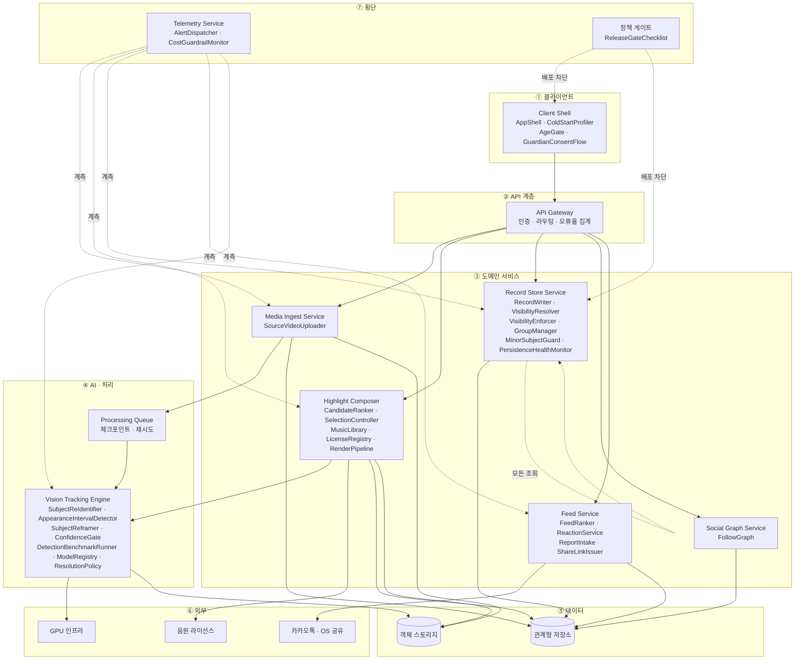

> **`VisibilityEnforcer`는 컴포넌트라기보다 경로다.** Record Store Service의 모든 조회가 반드시 통과해야 하는 검문소이며, 우회 경로가 존재하면 REQ-NF-009가 성립하지 않는다.

### 3.3.1 컴포넌트 정의

| 컴포넌트 | 소속 | 책임 | 주요 의존 | 대응 요구사항 |
| --- | --- | --- | --- | --- |
| **AppShell** | Client Shell | 3탭 내비게이션 · 진입 자동재생 · `+` 편집 진입 | Feed Service | REQ-FUNC-011 · REQ-NF-001 |
| **ColdStartProfiler** | Client Shell | 콜드/웜 시작 구간 계측 | Telemetry | REQ-NF-001 |
| **AgeGate** | Client Shell | 가입 연령 수집 · 만 14세 미만 분기 | GuardianConsentFlow | REQ-NF-016 |
| **GuardianConsentFlow** | Client Shell | 법정대리인 동의·철회 경로 | 정책 게이트 | REQ-NF-016 |
| **SourceVideoUploader** | Media Ingest | 청크 업로드 · **코덱 사전 검증** · 이어올리기 세션 | 객체 스토리지 · Processing Queue | REQ-FUNC-001 · SC-1.F1 · F3 · F4 |
| **SubjectReIdentifier** | Vision Tracking | 대상 1회 지정 · 가림·재등장 재식별 | GPU | REQ-FUNC-002 · SC-1.2 |
| **AppearanceIntervalDetector** | Vision Tracking | 등장 구간 탐지 · IoU 정탐 판정 | GPU · ResolutionPolicy | REQ-FUNC-003 · SC-1.1 |
| **ConfidenceGate** | Vision Tracking | 신뢰도 임계 `τ` 판정 · **저신뢰 후보 제외** · 제외율 계측 | Telemetry | **REQ-FUNC-027** · SC-1.F5 · F6 |
| **SubjectReframer** | Vision Tracking | 추적 좌표 기반 구도 재구성 · 세로 숏폼 출력 | GPU | REQ-FUNC-006 · SC-3.1 |
| **DetectionBenchmarkRunner** | Vision Tracking | 정답셋 회귀 배치 · **제외 전/후 분리 집계** | ConfidenceGate | REQ-NF-003 · SC-1.1 |
| **ModelRegistry** | Vision Tracking | 모델 버전 관리 · **앱 배포와 독립한 서버 측 갱신** | — | **ADR-2** (TC-ADR-02) |
| **ResolutionPolicy** | Vision Tracking | 저해상도 1차 / 선택분만 원본 해상도 처리 규칙 | — | **ADR-3** (TC-ADR-03) |
| **CandidateRanker** | Highlight Composer | 후보 산출 · 온전도 우선 정렬 · 타임코드 부여 | AppearanceIntervalDetector | REQ-FUNC-004 |
| **SelectionController** | Highlight Composer · Client | 후보 선택·제외 상태 · **자동 확정 차단** · 재선택 복귀 | — | REQ-FUNC-005 · SC-3.3 · F2 |
| **MusicLibrary** | Highlight Composer | 5갈래 500곡 목록 · 15초 자동 맞춤 삽입 | LicenseRegistry | REQ-FUNC-007 |
| **LicenseRegistry** | Highlight Composer | 곡별 라이선스 문서 · 사용 범위 · 만료 관리 | 음원 제공자 | REQ-FUNC-007 |
| **RenderPipeline** | Highlight Composer | 병합 · 인코딩 · **실패 시 선택 상태 보존 후 3회 재시도** | SubjectReframer · GPU | REQ-FUNC-008 · REQ-NF-004 · 008 · SC-3.F1 |
| **RecordWriter** | Record Store | 기록 저장 트랜잭션 · **공개 범위 결정 전 행 생성** | 관계형 저장소 | REQ-FUNC-009 · REQ-NF-007 · SC-4.1 |
| **VisibilityResolver** | Record Store | 공개 범위 지정·변경 · 기본값 `private` 적용 | — | REQ-FUNC-010 · ADR-4 |
| **VisibilityEnforcer** | Record Store | 🔴 **서버 측 공개 범위 강제 검문소** · 감사 로그 · 미허용 자원 응답 완전 제외 | 감사 로그 | **REQ-NF-009** · SC-4.4 · 4.F1 · 5.2 · 5.5 |
| **GroupManager** | Record Store | 그룹 생성(승인 없음) · 상한 20명 · 초대 · **이탈 시 공유 회수** | ShareLinkIssuer | REQ-FUNC-013 · SC-2.F1 · F2 · 5.F1 |
| **MinorSubjectGuard** | Record Store | 영상 내 미성년자 동의 확인 · **미확보 시 공개 경로 차단** | 정책 게이트 | **REQ-NF-017** · SC-0.F1 |
| **PersistenceHealthMonitor** | Record Store | 저장 성공률 상시 감시 · 1차 대응 SLA 15분 | Telemetry | REQ-NF-007 |
| **FollowGraph** | Social Graph | 단방향 팔로우 관계 · **공개 기록만 노출 대상** | — | REQ-FUNC-012 · SC-5.5 |
| **FeedRanker** | Feed Service | 팔로잉·인기 정렬 · **빈 피드 대체 노출** | VisibilityEnforcer | REQ-FUNC-014 · SC-6.F1 |
| **ReactionService** | Feed Service | 좋아요·댓글 · **비공개 기록에 반응 UI 미부착** | VisibilityEnforcer | REQ-FUNC-015 · 016 · SC-6.2 |
| **ReportIntake** | Feed Service | 신고 접수 · 이력 보존 (처리 절차 `[TBD]`) | — | REQ-FUNC-016 · SC-6.3 |
| **ShareLinkIssuer** | Feed Service | 링크 발급 · **공개 범위 승계** · 만료 30일 · 회수 | VisibilityEnforcer | REQ-FUNC-017 · REQ-NF-012 |
| **AlertDispatcher** | Telemetry | 게이트 지표 · 저장 성공률 · 보안 위반 · 큐 적체 · **완주율** · 비용 알림 | 전 서비스 | REQ-NF-014 |
| **CostGuardrailMonitor** | Telemetry | 편당 처리 원가 추적 · 상한 초과 시 업로드 제한 | ResolutionPolicy | REQ-NF-013 |
| **ReleaseGateChecklist** | 정책 게이트 | 산출물 승인 상태 판정 · **미승인 시 CI 배포 차단** | — | REQ-NF-010 · 016 · 017 |

**30개 컴포넌트 · 8개 소속.** §5.1이 참조하는 이름은 전부 이 표에 있다.

### 3.3.2 설계 시 확정으로 남긴 것

§5.1에서 `설계 시 확정`으로 표기한 항목은 **컴포넌트를 특정하지 않고 책임만 규정한다.** 파이프라인 전 구간에 걸리므로 단일 컴포넌트로 귀속시킬 수 없다.

| 책임 | 소속 | 대응 요구사항 | 단일 책임자 |
| --- | --- | --- | --- |
| 가용성 감시 · 이중화 | 전 서비스 공통 | REQ-NF-006 | 백엔드 온콜 |
| 오류율 · 재시도 정책 | 전 서비스 공통 | REQ-NF-008 | 백엔드 리드 |
| 저장 시 암호화 · TLS 1.2+ | 전 서비스 공통 | REQ-NF-011 | 보안 담당자 |
| 업로드·렌더·조회 지연 계측 | API Gateway · AI Pipeline | REQ-NF-002 · 004 · 005 | 백엔드 리드 |

> **전원의 일은 아무의 일도 아니므로 단일 책임자를 지정했다.** 컴포넌트가 정해지지 않았다는 사실 자체는 숨기지 않는다.

## 3.4 API Overview

| 서비스 | 책임 | 주요 엔드포인트 |
| --- | --- | --- |
| **Media Ingest Service** | 업로드 · 청크 · 이어올리기 · 코덱 검증 | `POST /videos` · `PATCH /videos/{id}/chunks` |
| **Vision Tracking Engine** | 대상 지정 · 재식별 · 등장 구간 탐지 · 리프레이밍 | `POST /videos/{id}/subject` · `POST /videos/{id}/detect` |
| **Highlight Composer** | 후보 산출 · 선택 · 음악 · 렌더 | `GET /videos/{id}/candidates` · `POST /records` |
| **Record Store Service** | 기록 저장 · 공개 범위 강제 · 그룹 | `PATCH /records/{id}/visibility` · `POST /groups` |
| **Social Graph Service** | 팔로우 관계 | `POST /follows` |
| **Feed Service** | 피드 구성 · 반응 · 공유 링크 | `GET /feed` · `POST /records/{id}/reactions` |
| **Telemetry Service** | 계측 · 게이트 지표 집계 · 알림 | `POST /events` |

전체 목록은 **6.1**에 있다.

## 3.5 Interaction Sequences

> **시퀀스 다이어그램 읽는 법** — 위쪽 가로줄이 참여자(사람·서비스), 아래로 내려가는 세로선이 시간이다. 가로 화살표는 요청·응답이고, `alt`로 묶인 영역은 **조건에 따라 갈리는 분기**다.

### 3.5.1 원본 업로드 및 등장 구간 탐지

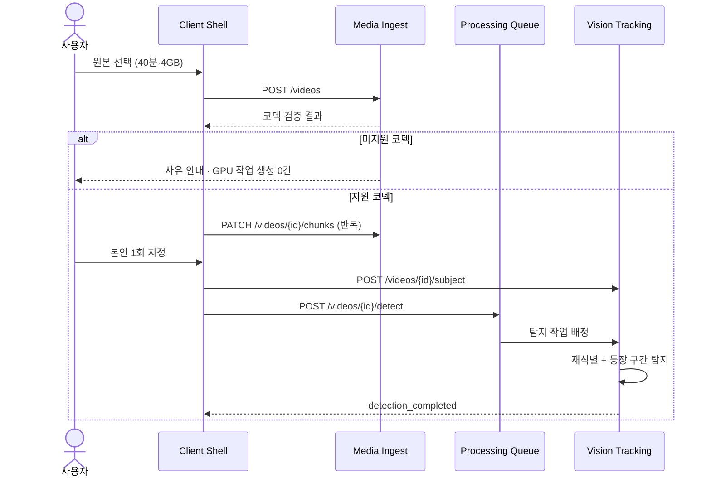

### 3.5.2 후보 선택 및 완성

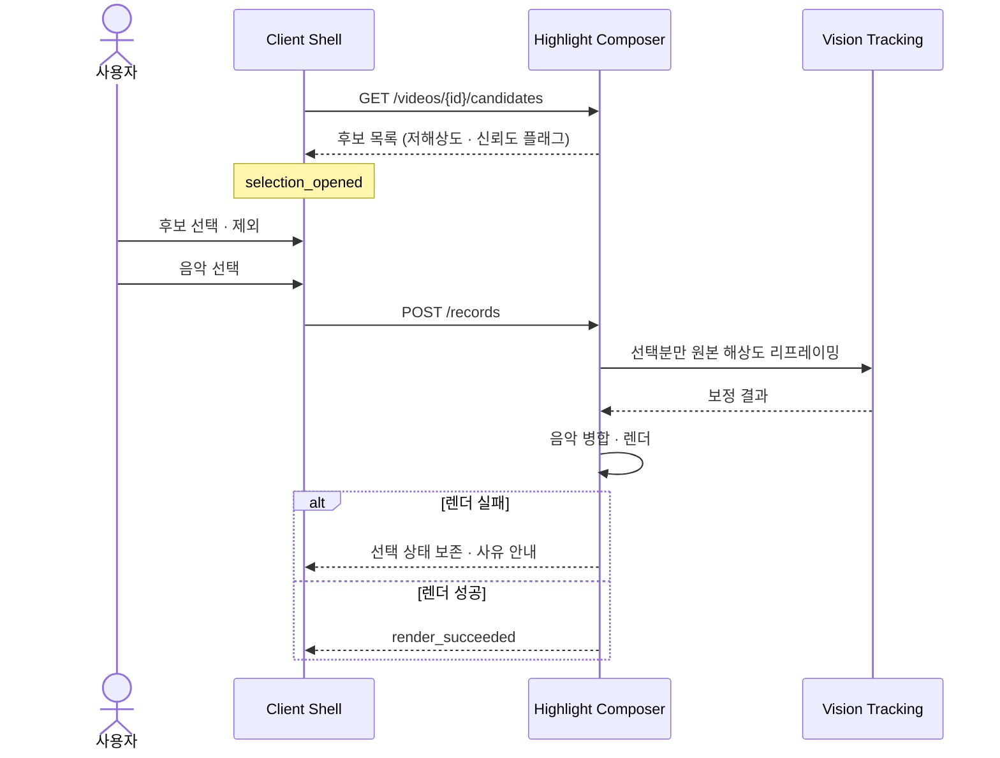

### 3.5.3 기록 저장 및 공개 범위 지정

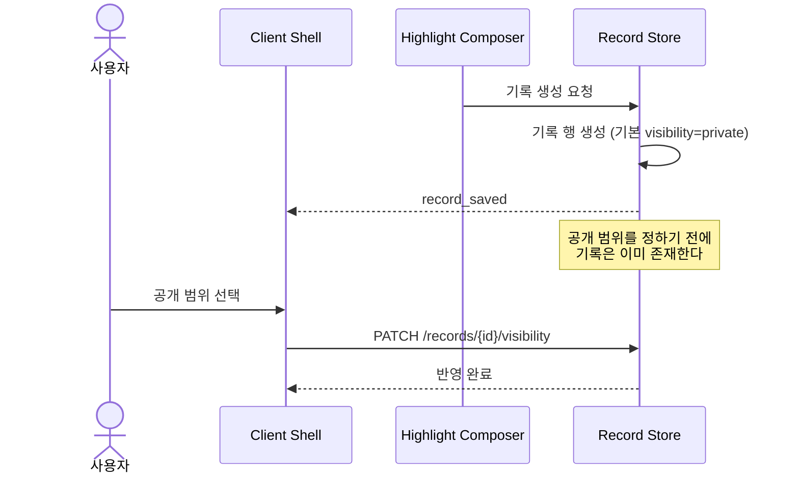

### 3.5.4 피드 조회와 공개 범위 강제

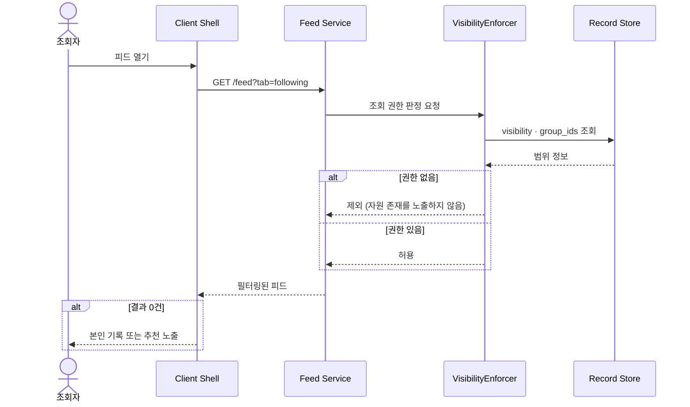

---

# 4. Specific Requirements

## 4.1 Functional Requirements

**REQ-FUNC-001~026 · REQ-NF-001~015는 REF-04(팀 SRS v1.0)의 식별자와 의미를 보존한다.** 증분은 **REQ-FUNC-027 · REQ-NF-016 · 017 · 018 네 건**이며, 나머지는 §5.2 운영 시나리오와 §5.3 설계 결정으로 옮겼다 — **총 45건**(REQ-FUNC 27 · REQ-NF 18).

| ID | 제목 | 출처 | 우선순위 | 유형 | 검증 방식 | 인수 기준 | 상태 | 담당자 |
| --- | --- | --- | --- | --- | --- | --- | --- | --- |
| **REQ-FUNC-001** | 장시간 원본 영상 업로드 | US-1 · REF-03 4-1 (F1)<br>+ REF-13 화면 06 | Must Have | Functional | 1) 대용량 업로드 테스트<br>2) 형식 수용 검증<br>3) QA 검증 | 40~50분·4GB급 원본을 업로드할 수 있어야 한다. **원본 선택은 앱이 만든 목록이 아니라 OS 갤러리를 그대로 사용**해야 하며, 날짜별 썸네일과 재생 시간이 보여야 한다 | Draft | 백엔드 리드 |
| **REQ-FUNC-002** | 추적 대상 지정 및 재식별 | US-1 · REF-03 4-1 (F2a) | Must Have | Functional | 1) 재식별 정확도 테스트<br>2) 가림 구간 라벨 정답셋 검증<br>3) QA 검증 | 사용자가 자기를 **1회 지정**하면, 대상이 가려지거나 화면을 벗어났다 다시 나타나도 **동일 인물로 인식**해야 한다. 재식별 정확도 **≥ 90%**, **오인식 ≤ 2%** `[SOURCE · REF-04]` | Draft | AI 리드 |
| **REQ-FUNC-003** | 사용자 등장 구간 자동 탐지 | US-1 · REF-03 4-1 (F2b) | Must Have | Functional | 1) 정답셋 회귀 배치<br>2) **IoU 기반 정탐 판정**<br>3) **제외 전/후 분리 집계**<br>4) QA 검증 | 사람이 표시한 정답 구간 대비 **사용자에게 제시된**(REQ-FUNC-027 제외 적용 후) 탐지 구간 비율이 **85% 이상**이어야 한다 `[HYPOTHESIS · Gate A 판정]`. **제외 전 비율도 함께 집계**하되 이는 진단용이며 게이트 판정에 쓰지 않는다 | Draft | AI 리드 |
| **REQ-FUNC-004** | 장면 후보 제시 | US-1 · US-6 · REF-03 4-1 (F3)<br>REF-02 AC1-2 | Must Have | Functional | 1) 후보 개수 검증<br>2) 온전도 우선순위 검증<br>3) QA 검증 | 탐지 결과를 **약 30개**의 후보로 좁혀 제시해야 하며 `[SOURCE·초안 — 가정 A3]`, 각 후보에 **시작·종료 타임코드**가 표시되어야 한다. 온전히 잡힌 구간을 우선 배열한다. **개수는 15/30/50 A/B/n 실측 후 확정한다** | Draft | AI 리드 |
| **REQ-FUNC-005** | 사용자 장면 선택 | US-1 · REF-03 4-1 (F4) | Must Have | Functional | 1) 선택 이벤트 검증<br>2) **자동 확정 차단 테스트**<br>3) QA 검증 | **최종 선택권은 사람에게 있어야 한다.** 사용자의 명시적 선택 없이 결과물이 확정되어서는 안 되며, 제시된 후보 **100% 전부**에 선택·제외가 가능해야 한다 | Draft | 제품 아키텍트 |
| **REQ-FUNC-006** | 사용자 중심 크롭·리프레이밍 | US-3 · REF-03 4-1 (F5a) | Must Have | Functional | 1) 주관 평가(5점 척도)<br>2) 출력 해상도 검증<br>3) QA 검증 | 화면 구석에 작게 잡힌 대상을 **중앙·확대 배치**해 세로 숏폼으로 출력해야 한다 | Draft | AI 리드 |
| **REQ-FUNC-007** | 음악 라이브러리 | US-3 · REF-03 4-1 (F18a)<br>+ REF-13 화면 10 | Must Have | Functional | 1) 곡 선택·삽입 테스트<br>2) 저작권 메타 검증<br>3) 카테고리 배분 검증<br>4) QA 검증 | **개인 기록 영상 삽입 용도로 사전 허락을 받은 자체 곡만** 제공해야 하며, 사용자가 외부에서 곡을 반입하는 경로를 열어서는 안 된다. 규모는 **5개 카테고리 총 500곡**(감성 120 · 여행 80 · 일상 110 · 운동 105 · 추억 85)으로 하되 **카테고리별 배분은 초안**이다 `[SOURCE·초안]`. 선택한 곡은 **15초 길이에 맞춰 자동 삽입**된다. 라이선스 문서 확보율 **100%** · 삽입 성공률 **≥ 99%** | Draft | 사업 담당자 |
| **REQ-FUNC-008** | 합치기 및 렌더링 | US-3 · REF-03 4-1 (F6) | Must Have | Functional | 1) 렌더 시간 측정<br>2) 실패 복구 테스트<br>3) QA 검증 | 선택된 장면이 하나의 완성 영상으로 합쳐져야 하며, 업로드부터 완성까지 **외부 앱 전환 이벤트 0건**이어야 한다 | Draft | 백엔드 리드 |
| **REQ-FUNC-009** | 개인 기록 자동 저장 | US-2 · REF-03 4-1 (F7) | Must Have | Functional | 1) 저장 성공률 측정<br>2) **공개 범위 결정 전 존재 검증**<br>3) QA 검증 | **공개 범위를 정하기 전에 이미 기록이 저장돼 있어야 한다.** 게시하지 않은 결과물도 동일하게 보관된다 | Draft | 백엔드 리드 |
| **REQ-FUNC-010** | 기록 단위 공개 범위 | US-2 · REF-03 4-1 (F8)<br>+ REF-13 화면 11 | Must Have | Functional | 1) 3단계 전환 테스트<br>2) 기본값 검증<br>3) 사후 변경 테스트<br>4) QA 검증 | 기록마다 **전체공개 / 그룹에만 공개 / 나만 보기**를 선택할 수 있어야 한다. **미선택 시 기본값은 나만 보기**이며, 현재 범위는 **글자 배지**로 표시하되 영상을 가려서는 안 된다 `[SOURCE · ADR-4 확정]`. 저장 이후에도 마이페이지에서 기록별로 변경할 수 있어야 한다 | Draft | 디자인 리드 |
| **REQ-FUNC-011** | 앱 셸 — 3탭 내비 · 마이페이지 | US-5 · REF-03 4-1 (F22) | Must Have | Functional | 1) 진입 시간 측정<br>2) 탭 전환 테스트<br>3) **소리 활성 전환 계측**<br>4) QA 검증 | 앱 진입 시 **로그인 화면 없이 팔로잉 탭**에서 영상이 재생되어야 한다. 탭은 팔로잉·추천·그룹 3종이며 가운데 `+`가 편집·업로드 진입점이다. **재생은 음소거로 시작하고 사용자의 첫 조작(스크롤·탭) 시 소리를 활성화**하며, 이후 세션 내 유지한다 `[PROPOSED · 브라우저 자동재생 정책]` | Draft | 클라이언트 개발자 |
| **REQ-FUNC-012** | 팔로워 · 팔로잉 관계 | US-5 · REF-03 4-1 (F11) | Must Have | Functional | 1) 관계 CRUD 테스트<br>2) 공개 범위 경계 검증<br>3) QA 검증 | 관계는 **공개 기록만** 정해야 한다. 팔로우는 단방향이며 **팔로우 관계만으로 그룹·비공개 기록에 접근할 수 없다** | Draft | 백엔드 리드 |
| **REQ-FUNC-013** | 그룹 — 소그룹 공유 | US-4 · REF-03 4-1 (F23)<br>+ REF-13 화면 03 | Must Have | Functional | 1) 생성·초대·탈퇴 테스트<br>2) **3경로 노출 차단 검증**<br>3) 이름 중복 허용 검증<br>4) QA 검증 | 승인 절차 없이 생성되며 **인원 상한 20명**(생성자 포함)이다. **링크 초대는 가입자에게만 유효**하고, **그룹 이름 중복을 허용**한다. 그룹 공개 기록은 구성원에게만 노출되며, **팔로우 관계만으로는 절대 열리지 않아야 한다** `[SOURCE · 확정 4건]` | Draft | 백엔드 리드 |
| **REQ-FUNC-014** | 피드 — 팔로잉 · 추천 · 그룹 | US-5 · REF-03 4-1 (F13) | Must Have | Functional | 1) 피드 구성 테스트<br>2) 빈 피드 대체 노출 검증<br>3) QA 검증 | MVP는 **팔로잉·인기 기준**으로 구성한다. 취향 설문 반영은 본 범위에 포함하지 않는다 | Draft | 백엔드 리드 |
| **REQ-FUNC-015** | 좋아요 | US-5 · REF-03 4-1 (F19) | Must Have | Functional | 1) 반응 기록 테스트<br>2) 공개 범위 연동 검증<br>3) QA 검증 | **공개 범위 안에서만** 노출되어야 한다. **"나만 보기" 기록에 반응 UI가 붙어서는 안 된다** | Draft | 클라이언트 개발자 |
| **REQ-FUNC-016** | 댓글 및 신고 | US-5 · REF-03 4-1 (F20) | Must Have | Functional | 1) 댓글 CRUD 테스트<br>2) 신고 접수 테스트<br>3) QA 검증 | 댓글에 신고 기능이 포함되어야 하며 **접수 성공률 ≥ 99%**. **신고 처리 절차는 미정**이므로 접수와 이력 보존까지만 구현한다 `[TBD]` | Draft | 법무 담당자 |
| **REQ-FUNC-017** | 공유 — 링크 · 카카오톡/메시지 | US-5 · REF-03 4-1 (F21)<br>+ REF-13 화면 05 | Must Have | Functional | 1) 링크 생성 테스트<br>2) **공개 범위 승계 검증**<br>3) QA 검증 | 공유 링크도 **기록의 공개 범위를 따라야 한다.** 비공개 기록의 링크는 발급되지 않거나 접근이 거부되어야 한다. 제공 경로는 **링크 복사 · 카카오톡 · 문자 메시지 셋으로 한정**하며, **앱 안 DM은 이 요구사항의 범위가 아니다** | Draft | 클라이언트 개발자 |
| **REQ-FUNC-018** | 촬영 노하우 기반 구도 규칙 | REF-03 4-1 (F5b) | Should Have | Functional | 1) 구도 규칙 적용 테스트<br>2) 주관 평가 비교<br>3) QA 검증 | 추적 좌표 활용을 넘어 촬영 노하우 기반 구도·앵글 연출을 적용해야 한다 | Draft | AI 리드 |
| **REQ-FUNC-019** | 원본 삭제 안내 및 저장공간 회수 | US-2 · REF-03 4-1 (F9) | Should Have | Functional | 1) 삭제 안내 노출 테스트<br>2) 실행률 측정<br>3) QA 검증 | 결과물 확보 후 원본 삭제를 안내해야 하며, 삭제 실행률을 계측해야 한다 | Draft | 클라이언트 개발자 |
| **REQ-FUNC-020** | 기록 타임라인 (날짜별 축적 뷰) | REF-03 4-1 (F10) | Should Have | Functional | 1) 타임라인 렌더 테스트<br>2) 정렬 검증<br>3) QA 검증 | 날짜별로 기록 축적을 확인할 수 있는 뷰를 제공해야 한다 | Draft | 클라이언트 개발자 |
| **REQ-FUNC-021** | 온보딩 카테고리 취향 설문 | REF-03 4-1 (F12) | Should Have | Functional | 1) 설문 흐름 테스트<br>2) 피드 반영 검증<br>3) QA 검증 | 취향 설문 결과가 추천 피드 구성에 반영되어야 한다 | Draft | 디자인 리드 |
| **REQ-FUNC-022** | 카테고리별 조회수 랭킹 | REF-03 4-1 (F15) | Should Have | Functional | 1) 랭킹 산정 테스트<br>2) 노출 정책 검증<br>3) QA 검증 | 시점은 MVP 직후로 확정했으나 **도입 여부 자체는 미정**이다 `[TBD]` | Draft | 제품 리드 |
| **REQ-FUNC-023** | 선택 데이터 학습 기반 정확도 개선 | REF-03 4-1 (F14) | Could Have | Functional | 1) 학습 파이프라인 테스트<br>2) 정확도 개선 측정<br>3) QA 검증 | 사용자 선택 데이터가 축적되어 탐지·후보 순위 품질을 개선해야 한다. **선행 조건은 사용자 축적이며, 사용자가 없으면 학습 데이터가 생기지 않는다** | Draft | AI 리드 |
| **REQ-FUNC-024** | 팀 공유 편집 (한 원본 다중 사용자) | REF-03 4-1 (F16) | **Won't Have (P3)** | Functional | 기획 확정 후 재판정 | 팀 계정 · 원본 공유 권한 · 얼굴 정보 동의 · 인원 비례 원가 **넷이 전부 미정**이다 | Draft | 제품 리드 |
| **REQ-FUNC-025** | 촬영 가이드 | REF-03 4-1 (F17) | **Won't Have (P3)** | Functional | 기획 확정 후 재판정 | 원본이 없는 사용자를 유입시키기 위한 기능. 본 범위에서 제외한다 | Draft | 제품 리드 |
| **REQ-FUNC-026** | 자막 편집 | REF-03 4-1 (F18b) | **Won't Have (P3)** | Functional | 기획 확정 후 재판정 | 기획 미정. 음악(REQ-FUNC-007)과 분리해 본 범위에서 제외한다 | Draft | 제품 리드 |
| **REQ-FUNC-027** | 재식별 저신뢰 후보 **제외** | REF-02 AF-4 · RISK-02<br>*(v1.3 승격 — SC·REQ 어디에도 없던 처리 방침)* | Must Have | Functional | 1) 임계 미만 구간 제외 테스트<br>2) 제외율 계측 검증<br>3) 제외 사유 안내 검증<br>4) QA 검증 | 재식별 신뢰도가 임계 미만인 후보는 **후보 목록에서 제외**해야 한다 — 저신뢰 표시로 사용자에게 판단을 넘기지 않는다. **타인의 장면이 후보에 포함되어서는 안 된다**(무표시 혼입 **0건**). 임계는 REQ-FUNC-002의 `오인식 ≤ 2%`를 기준으로 한다. **제외 건수와 제외율을 계측**하고, 제외로 후보가 현저히 줄면 사용자에게 **사유를 안내**해야 한다 | Proposed | AI 리드 |

## 4.2 Non-Functional Requirements

| ID | 제목 | 출처 | 우선순위 | 유형 | 검증 방식 | 인수 기준 | 상태 | 담당자 |
| --- | --- | --- | --- | --- | --- | --- | --- | --- |
| **REQ-NF-001** | 앱 진입 응답 시간 | REF-03 5-1 | Must Have | Performance | 콜드/웜 스타트 부하 테스트 | 앱 실행부터 첫 영상 프레임까지 **p95 ≤ 1.5초**, 빈 피드 노출률 **< 5%** `[PROPOSED]` | Draft | 클라이언트 개발자 |
| **REQ-NF-002** | 원본 업로드 소요 시간 | REF-03 5-1 | Must Have | Performance | LTE 환경 대용량 업로드 테스트 | 40분·4GB 원본 업로드 **p95 ≤ 6분**, 업로드 실패율 **< 0.5%**, 재개 성공률 **≥ 99%** `[PROPOSED]` | Draft | 백엔드 리드 |
| **REQ-NF-003** | 탐지 처리 시간 | REF-03 5-1 · REF-02 AC1-3 | Must Have | Performance | 정답셋 100편 배치 처리 시간 측정 | 40분 원본의 탐지 완료 **p95 ≤ 8분**. `detection_started` → `selection_opened` 구간의 **중앙값 ≤ 5분 · p90 ≤ 10분**을 만족하기 위한 상한이며, **앱 백그라운드 시간은 제외**한다 `[PROPOSED]` | Draft | AI 리드 |
| **REQ-NF-004** | 렌더링 시간 | REF-03 5-1 | Must Have | Performance | 15초 결과물 렌더 반복 측정 · **실행 환경별 분리 계측** | 15초 결과물 렌더 **p95 ≤ 90초** `[PROPOSED]`. **렌더를 사용자 단말에서 수행하는 구현에서는 단말 등급별로 재정의**하고, 하한 등급 미만에서의 처리 방침을 함께 정한다 `[TBD]` | Draft | 백엔드 리드 |
| **REQ-NF-005** | 조회 API 응답 시간 | REF-03 5-1 | Must Have | Performance | API 부하 테스트 | 피드·목록 API **p95 ≤ 400ms**, 그룹 멤버 필터 **p95 ≤ 300ms**, 후보 목록 렌더 **p95 ≤ 1초**, 그룹 생성 **p95 ≤ 500ms** `[PROPOSED]` | Draft | 백엔드 리드 |
| **REQ-NF-006** | 가용성 | REF-03 5-2 | Must Have | Reliability | 월간 가용성 모니터링 및 SLA 검증 | 앱 셸·피드·기록 조회 월 가용성 **≥ 99.5%**, AI 처리 파이프라인 **≥ 99.0%**. 비동기 큐로 **처리 지연은 허용하되 유실은 불허**한다 `[PROPOSED]` | Draft | 백엔드 온콜 |
| **REQ-NF-007** | 기록 저장 성공률 | REF-03 5-2 · REF-02 AC2-3 | Must Have | Reliability | 저장 성공률 상시 모니터링 | 렌더 성공 대비 기록 저장 성공률 **≥ 99.9%**. **Gate B의 전제이며, 여기서 유실되면 제품의 핵심 주장이 무너진다.** 1차 대응 SLA **15분** `[PROPOSED]` | Draft | 백엔드 온콜 |
| **REQ-NF-008** | 오류율 및 재시도 정책 | REF-03 5-2 | Must Have | Reliability | 오류 주입 테스트 | API 5xx 오류율 **≤ 0.1%**. 처리 실패 시 원본·중간 산출물을 보존한 채 **재시도 3회 이상** 수행해야 한다 `[PROPOSED]` | Draft | 백엔드 리드 |
| **REQ-NF-009** | 공개 범위 서버 측 강제 | REF-03 5-3<br>+ REF-13 화면 12 | Must Have | Security | 회귀 테스트 스위트 · 우회 시도 테스트 | 공개 범위는 **서버에서 강제**해야 한다. **클라이언트 필터링만으로는 불충분하다.** 조작된 요청의 우회 성공 **0건**, 감사 로그 기록률 **100%**. 권한 없는 자원은 **응답에서 완전히 제외**해야 하며, 건수·존재 여부를 유추할 수 있는 정보를 반환해서는 안 된다 | Draft | 보안 담당자 |
| **REQ-NF-010** | 얼굴 정보 처리 동의 및 파기 | REF-03 5-3 | Must Have | Security | 법무 산출물 체크리스트 승인 | 동의 문구 · 보관 기간 · 파기 절차 · 처리 위탁 **4종이 전부 승인되기 전 프로덕션 배포 0건**. 미승인 시 **CI 배포를 차단**한다 `[TBD]` | Draft | 법무 담당자 |
| **REQ-NF-011** | 저장·전송 암호화 | REF-03 5-3 | Must Have | Security | 주간 스캔 및 핸드셰이크 검사 | 영상 저장 시 **at-rest 암호화**, 전송 구간 **TLS 1.2 이상**. 미암호화 객체 **0건**, TLS 1.1 이하 핸드셰이크 **0건** `[PROPOSED]` | Draft | 보안 담당자 |
| **REQ-NF-012** | 공유 링크 만료 및 회수 | REF-03 5-3 | Should Have | Security | 만료·회수 동작 테스트 | 공유 링크 기본 만료 **30일**, 만료 후 접근 성공 **0건**, 회수 반영 지연 **≤ 60초** `[PROPOSED]` | Draft | 백엔드 리드 |
| **REQ-NF-013** | 편당 처리 원가 가드레일 | REF-03 5-4 | Must Have | Cost | 처리 물량 대비 원가 추적 | 처리 물량은 **연 12만 편**(1만 명 × 월 1편)에 직접 비례한다 `[HYPOTHESIS]`. **편당 처리 원가 상한이 확정되기 전에는 무제한 업로드를 열지 않는다** `[TBD]` | Draft | 사업 담당자 |
| **REQ-NF-014** | 모니터링 · 알림 · 대응 SLA | REF-03 5-5 | Must Have | Operability | 알림 발화 테스트 및 대응 훈련 | 게이트 지표 · 저장 성공률 · 보안 위반 · 큐 적체 · 완주율 · 비용에 대해 **알림 기준 · 수신자 · 1차 대응 SLA**가 정의되어야 한다. **파이프라인 완주율**(`render_succeeded ÷ detection_started`)의 알림 임계는 **95%** 로 한다 `[PROPOSED · v1.3 추가]` — 개별 실패 시나리오가 잡지 못한 누수를 탐지하는 상위 지표다 | Draft | 백엔드 온콜 |
| **REQ-NF-015** | 유지보수성 — 열거형 확장 방식 | REF-03 6-1 | Could Have | Maintainability | 코드 리뷰 및 확장성 테스트 | 공개 범위·피드 탭·계측 이벤트 등 분류값을 추가할 때 **열거형(enum) 패턴**으로 코드 변경을 최소화해야 한다 | Draft | 백엔드 리드 |
| **REQ-NF-016** | 미성년 **이용자** 보호 | REF-02 5.4<br>*(v1.3 승격 — 팀 문서 전무)* | Must Have | Security | 1) 연령 분기 흐름 테스트<br>2) 법정대리인 동의 경로 검증<br>3) 법무 산출물 체크리스트 승인 | ① 가입 시 **연령을 수집**하고 만 **14세 미만**은 **법정대리인 동의 없이는 가입을 완료할 수 없어야** 한다(개인정보보호법 제22조의2 — 적용 범위는 법무 확정) ② 미성년 이용자의 공개 범위 기본값은 **나만 보기**를 유지하며 **전체공개 전환 시 추가 확인**을 거쳐야 한다 ③ 법정대리인의 **열람·삭제·동의 철회** 경로를 제공해야 한다 ④ **산출물 4종**(최소 연령 정책 · 연령 확인 방식 · 법정대리인 동의 경로 · 철회·삭제 절차)이 **전부 승인되기 전까지 가입 플로우를 배포할 수 없다** `[TBD]` | Proposed | 법무 담당자 |
| **REQ-NF-018** | 완성까지의 사용자 조작 시간 | REF-02 AC6-1 · US-6<br>*(v1.5 승격 — 팀 문서 전무)* | Must Have | Efficiency | 1) 세션 조작 시간 계측<br>2) Gate B 이후 실측 기준선 확보 | 원본 업로드부터 완성까지 **사용자가 직접 조작한 시간**(대기 시간 제외)을 계측해야 한다. 목표값은 **Gate B 이후 실측으로 설정**한다 `[TBD]`. 계측 구간은 `upload_started` → `record_saved` 중 **화면이 사용자 입력을 기다린 시간의 합**으로 정의한다 | Proposed | 제품 아키텍트 |
| **REQ-NF-017** | 영상 **내** 미성년자 보호 | REF-02 5.4 · REF-11<br>*(v1.3 승격 — 이 서비스 특유 위험)* | Must Have | Security | 1) 클럽 영상 표본 점검<br>2) 동의 확보 절차 검증<br>3) 법무 산출물 체크리스트 승인 | 업로더가 성인이어도 **영상에 함께 잡힌 인물이 미성년자일 수 있다.** ① 미성년자가 포함될 개연성이 높은 경로(**클럽·교습 영상**)에 대해 **업로드 단계에서 고지**해야 한다 ② 해당 영상의 **공개 발행**은 REQ-NF-010의 얼굴 정보 동의에 더해 **법정대리인 동의 확보 절차**를 거쳐야 한다 ③ 동의가 확보되지 않은 영상은 **비공개 기록까지만** 허용하고 전체공개·그룹 공개를 차단해야 한다 `[TBD]` ④ **산출물 3종**(적용 대상 판별 기준 · 동의 확보 절차 · 미확보 시 차단 로직)이 승인되기 전까지 **공개 발행 기능을 배포할 수 없다** | Proposed | 법무 담당자 |

> **v1.3에서 증분 요구사항 19건을 2건으로 줄였다.** 나머지 17건은 요구사항이 아니라 **팀의 운영 시나리오(§11)와 설계 결정(1.5.2)에 이미 존재하던 내용**이었다. 그 내용에 **테스트 케이스 ID를 부여**해 §5 추적성 매트릭스에 진입시키는 것으로 대체했다 — 요구사항을 늘리지 않고 검증 가능성만 얻는다.
>
> **승격한 3건의 공통점** — 팀 SRS의 §4(요구사항)·§11(시나리오)·API 설명 **어디에도 없던 것**이다. REQ-FUNC-027은 오인식률 임계는 있으나 **임계를 넘은 후보를 어떻게 처리할지**가 없었고, REQ-NF-016은 전무했다.

> ### 🔴 REQ-NF-017을 왜 별도로 두는가 — 클럽이 곧 미성년자다
>
> 가입자 연령만 다루면 이 서비스의 실제 위험을 놓친다. **업로더가 성인이어도 영상 속 인물은 다르다.**
>
> **첫 카테고리(농구)의 B2B 경로가 정확히 이 문제 위에 있다.** 체육교습업은 **법령상 만 13세 미만을 교습 대상으로 하는 업종**이며, 농구는 그 지정 종목에 포함된다 [REF-11]. 즉 **클럽 파일럿에서 다루는 영상은 대부분 미성년자가 주요 피사체**다.
>
> 그리고 이 제품은 그 영상에서 **특정 인물을 추적해 얼굴이 크게 나오도록 구도를 재구성**한 뒤(REQ-FUNC-006) **공개 발행 경로**(REQ-FUNC-014·017)에 올린다. **일반 영상 서비스보다 노출 강도가 높다.**
>
> | 구분 | 대상 | 대응 |
> | --- | --- | --- |
> | REQ-NF-016 | **가입자** 본인이 미성년 | 법정대리인 동의 · 공개 범위 제약 |
> | **REQ-NF-017** | **피촬영자**가 미성년 | 업로드 고지 · 동의 확보 · **미확보 시 비공개 한정** |
> | REQ-NF-010 | 제3자 얼굴 일반 | 동의·보관·파기·위탁 4종 |
>
> **셋은 겹치지 않는다.** REQ-NF-010은 성인 제3자까지 포함하는 일반 규정이고, REQ-NF-017은 그중 **미성년자에 대한 가중 요건**이다. 이 구분이 없으면 "얼굴 동의 받았으니 됐다"로 처리되어 법정대리인 동의가 누락된다.
>
> **[PROPOSED] ③의 기본 태도** — 동의가 확인되지 않으면 **막는 것이 아니라 비공개로 남긴다.** 기록은 생성되고 본인은 볼 수 있으며 **공개 경로만 닫힌다.** 이것이 D4("기록이 먼저고 공개가 선택")와 정합적이다 — 안전을 이유로 기록 자체를 막으면 제품 주장이 무너진다.
>
> ### REQ-NF-017의 단계별 적용 범위
>
> **네 항목이 동시에 필요한 것은 아니다.** 공개 발행 기능이 없는 단계에서는 ①②만 적용된다.
>
> | 단계 | ① 고지 | ② 동의 확보 | ③ 공개 차단 | ④ 산출물 게이트 |
> | --- | :--: | :--: | :--: | :--: |
> | **클럽 파일럿** (공개 발행 없음) | ✅ | ✅ | ➖ | ➖ |
> | Phase 0~1 (내부 검증) | ✅ | ✅ | ➖ | ➖ |
> | **Phase 2~3** (공개 발행 포함) | ✅ | ✅ | ✅ | ✅ |
>
> **따라서 이 요구사항이 미승인 상태여도 파일럿과 Phase 0~1은 착수할 수 있다.** 선행 조건은 **①②의 확정**뿐이다.
>
> **그리고 ③④의 설계 근거는 파일럿에서 나온다.** 클럽이 이미 보유한 동의의 범위, 동의 거부 발생률, 한 영상에 여러 아동이 혼재할 때의 실제 처리 방식 — 셋 다 실측이 필요하며 **책상에서 만들 수 없다.** 파일럿 산출물 4-b가 그 입력이다 [REF-14].

> ### 🔴 REQ-FUNC-027의 귀결 — 제외는 재현율을 깎는다
>
> **저신뢰 표시가 아니라 제외를 택한 이유**는 D2에 있다. *"최종 선택권이 사람에게 있다"* 는 **사람이 고르기 쉬운 상태까지 만들어 준다**는 뜻이지, **판단하기 어려운 것을 사람에게 떠넘긴다**는 뜻이 아니다. "이게 나인지 아닌지 당신이 판단하라"는 화면은 Core Job이 없애려던 바로 그 작업(원본을 되감아 확인하기)을 되살린다.
>
> **대신 정밀도를 얻고 재현율을 잃는다.** 실제로 본인인데 신뢰도가 낮아 제외된 구간은 사라진다. **이것이 O9(등장 구간 탐지율 85%)와 직접 충돌한다.**
>
> **[PROPOSED] 둘 다 재되, Gate A 판정은 제외 후로 한다.**
>
> 제외 임계를 `τ`라 할 때 세 지표는 `τ`에 다르게 반응한다.
>
> | 지표 | `τ`를 **올릴 때** | 게이트로서의 성질 |
> | --- | --- | --- |
> | 오탐률 (REQ-FUNC-002 `≤ 2%`) | **좋아진다** | `τ` 상향의 **유인** |
> | 제외 **전** 탐지율 | **변하지 않는다** | `τ`와 독립 — **상향을 억제하지 못한다** |
> | 제외 **후** 탐지율 | **나빠진다** | 🔴 **`τ` 상향의 브레이크** |
>
> **Gate A를 제외 전으로 걸면 게이트가 조작에 무감각해진다.** 오탐률을 좋게 만들려고 `τ`를 올려도 제외 전 탐지율은 그대로이므로 게이트가 저항하지 않는다. 사용자가 받는 후보는 계속 줄어드는데 **게이트는 통과한다.**
>
> **사용자 가치 기준으로도 같은 결론이다.** Gate A가 묻는 것은 *"AI가 나를 놓치지 않고 찾는가"*이고, 사용자가 아는 것은 **화면에 뜬 후보**뿐이다. 제외 전 85%인데 제외 후 50%면 사용자는 절반만 받는데 게이트는 통과한다 — **게이트가 사용자 경험과 분리된다.**
>
> | 지표 | 역할 |
> | --- | --- |
> | **제외 후 탐지율** | 🔴 **Gate A 판정 지표** — 사용자가 실제로 받는 것 |
> | 제외 **전** 탐지율 | **진단 지표** — 미달 시 *"모델이 약한가, 임계가 과한가"*를 가른다 |
> | 두 값의 차 | **제외로 잃은 양.** 커지면 `τ`를 재조정한다 |
>
> **제외 전 값은 ADR-1(모델 조달) 재검토의 입력이다.** 미달 원인이 모델이면 모델을 바꾸고 임계면 임계를 내린다. **그것은 진단이지 게이트가 아니다.**

## 4.3 요구사항 의존성 및 구현 규모

> 확장 근거: REF-05 §9.6.9 Apportioning of requirements

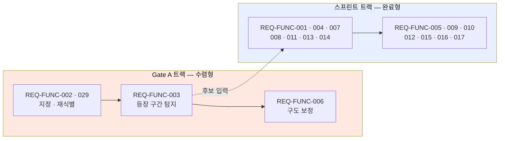

구현 규모는 **인·일로 환산하지 않는다.** 팀 속도 실측이 없으므로 상대 규모만 기술하며 첫 스프린트 종료 후 보정한다 `[PROPOSED]`.

| 규모 | 정의 | 1스프린트 적합성 | 대상 |
| :--: | --- | --- | --- |
| **S** | 기존 패턴 조합 · 신규 기술 위험 없음 | 한 스프린트에 복수 소화 | REQ-FUNC-005 · 009 · 010 · 012 · 015 · 016 · 017 |
| **M** | 신규 설계가 필요하나 **결과가 예측 가능** | 한 스프린트에 1건 | REQ-FUNC-001 · 004 · 007 · 008 · 011 · 013 · 014 |
| **L** | **모델 성능이 결과를 좌우** — 종료 조건이 정확도·만족도 | **부적합** | REQ-FUNC-002 · 003 · 006 · **027** · 023 |

> **L 4건을 일반 스프린트에 배치해서는 안 된다.** 완료 판정이 "구현됐다"가 아니라 **"제외 후 85%에 도달했다"(REQ-FUNC-003) · "80%가 잘 잡혔다고 답했다"(SC-3.1)** 이기 때문이다. 정확도는 스프린트로 도달하는 것이 아니라 반복으로 **수렴**하므로, 일반 스프린트에 넣으면 **매 스프린트 미완으로 이월된다.**
>
> **두 트랙은 병렬로 진행한다.** 규모 S 7건은 탐지 결과 없이도 구현 가능하므로 Gate A를 기다릴 이유가 없다. **다만 Gate A가 실패하면 스프린트 트랙의 산출물은 일반 기록 앱으로 남는다** — 이것이 RISK-01을 치명으로 판정한 근거다.
>
> **REQ-FUNC-023은 규모 판정 이전 단계다.** 모델 작업인 데다 **학습할 선택 데이터가 사용자 없이는 생기지 않아 착수 자체가 불가능**하다. Could 유보의 실질 사유는 우선순위가 아니라 **선행 조건 부재**다.

## 4.4 표준 및 규제 준수

> 확장 근거: REF-05 §9.6.17 Standards compliance · §9.6.16 Design constraints

| 항목 | 요구 | 대응 | 상태 |
| --- | --- | --- | :---: |
| 저작권 (음원) | 라이선스가 확보된 곡만 제공. 곡별 사용 범위와 만료·회수 절차를 문서로 보유 | REQ-FUNC-007 | 🔴 `[TBD]` 계약 미체결 |
| 개인정보 — 얼굴 정보 | 동의 문구 · 보관 기간 · 파기 절차 · 처리 위탁 4종 승인 | REQ-NF-010 | 🔴 `[TBD]` 미수립 |
| 개인정보 — 정보주체 권리 | 삭제 요청 시 원본·파생물 전량 삭제 | REQ-NF-014 · 6.2 | `[PROPOSED]` |
| 개인정보 — 접근 통제 | 공개 범위 서버 측 강제 · 감사 로그 100% | REQ-NF-009 | `[PROPOSED]` |
| 전송 보안 | TLS 1.2 이상 · at-rest 암호화 | REQ-NF-011 | `[PROPOSED]` |
| 미성년 **이용자** 보호 | 만 14세 미만 법정대리인 동의 · 공개 범위 제약 · 철회 경로 (**산출물 4종**) | REQ-NF-016 | 🔴 `[TBD]` 미수립 |
| 영상 **내** 미성년자 보호 | 클럽·교습 영상 고지 · 법정대리인 동의 · **미확보 시 비공개 한정** (**산출물 3종**) | REQ-NF-017 | 🔴 `[TBD]` 미수립 |
| 유해 콘텐츠 대응 | 신고 접수 기능 제공. 처리 절차는 운영 정책 확정 후 | REQ-FUNC-016 | `[TBD]` |

> **REQ-NF-010 · 021은 "법무 검토 선행 필수"가 아니라 산출물 승인 게이트로 기술했다.** "검토했다"는 통과·실패를 판정할 수 없어 요구사항이 될 수 없고, **"명시한 산출물이 전부 승인 상태다"는 배포 파이프라인이 판정할 수 있기 때문이다.**

---

# 5. Traceability Matrix

## 5.1 Story ↔ Requirement ↔ Test Case

**본 매트릭스의 범위** — 1차 출시 대상인 **Must Have 요구사항**에 한정한다. 2차 이후 항목(REQ-FUNC-018~026 · REQ-NF-012 · 015)은 4.1·4.2의 우선순위 열을 참조한다. REQ-FUNC-024~026은 인수 기준이 "기획 확정 후 재판정"이므로 매트릭스에 행을 두지 않는다.

| Story | 요구사항 ID | 모듈 | 구현 컴포넌트 | 테스트 케이스 ID |
| --- | --- | --- | --- | --- |
| US-1 | REQ-FUNC-001 | Media Ingest Service | SourceVideoUploader | TC-FUNC-001 |
| US-1 | REQ-FUNC-002 | Vision Tracking Engine | SubjectReIdentifier | TC-FUNC-002 |
| US-1 | REQ-FUNC-003 | Vision Tracking Engine | AppearanceIntervalDetector | TC-FUNC-003 |
| US-1 | REQ-FUNC-004 | Highlight Composer | CandidateRanker | TC-FUNC-004 |
| US-1 | REQ-FUNC-005 | Highlight Composer | SelectionController | TC-FUNC-005 |
| US-3 | REQ-FUNC-006 | Vision Tracking Engine | SubjectReframer | TC-FUNC-006 |
| US-3 | REQ-FUNC-007 | Highlight Composer | MusicLibrary · LicenseRegistry | TC-FUNC-007 |
| US-3 | REQ-FUNC-008 | Highlight Composer | RenderPipeline | TC-FUNC-008 |
| US-2 | REQ-FUNC-009 | Record Store Service | RecordWriter | TC-FUNC-009 |
| US-2 | REQ-FUNC-010 | Record Store Service | VisibilityResolver | TC-FUNC-010 |
| US-5 | REQ-FUNC-011 | Client Shell | AppShell | TC-FUNC-011 |
| US-5 | REQ-FUNC-012 | Social Graph Service | FollowGraph | TC-FUNC-012 |
| US-4 | REQ-FUNC-013 | Record Store Service | GroupManager | TC-FUNC-013 |
| US-5 | REQ-FUNC-014 | Feed Service | FeedRanker | TC-FUNC-014 |
| US-5 | REQ-FUNC-015 | Feed Service | ReactionService | TC-FUNC-015 |
| US-5 | REQ-FUNC-016 | Feed Service | ReportIntake | TC-FUNC-016 |
| US-5 | REQ-FUNC-017 | Feed Service | ShareLinkIssuer | TC-FUNC-017 |
| **US-6** | **REQ-NF-018** | Telemetry Service | AlertDispatcher *(조작 시간 집계)* | **TC-NF-018** |
| **US-6** | REQ-FUNC-004 · 005 | Highlight Composer | CandidateRanker · SelectionController | TC-FUNC-004 · 005 |
| **US-6** | REQ-NF-005 | Highlight Composer | 설계 시 확정 | TC-NF-005 |

> **US-6(크리에이터) 추적 복원** — v1.4까지 이 Story는 §2.2 이용자 클래스(UC-05)로만 존재하고 **추적성 매트릭스에 행이 없었다.** Story의 핵심 요구(*"편집 시간을 3시간에서 크게 줄여 주기를"*)에 대응하는 요구사항이 **REQ-NF-018로 신설**되면서 체인이 연결됐다.
>
> **AC6-2(외부 내보내기)는 여전히 요구사항이 아니다** — ADR-5로 보류돼 있고 상위 문서에 근거가 없다(§1.5.2). 이는 누락이 아니라 **미결로 표기된 상태**다.
| US-1 | **REQ-FUNC-027** | Vision Tracking Engine | ConfidenceGate | **TC-FUNC-027** |
| — | REQ-NF-001 | Client Shell | ColdStartProfiler | TC-NF-001 |
| — | REQ-NF-002 | Media Ingest Service | 설계 시 확정 | TC-NF-002 |
| — | REQ-NF-003 | Vision Tracking Engine | DetectionBenchmarkRunner | TC-NF-003 |
| — | REQ-NF-004 | Highlight Composer | 설계 시 확정 | TC-NF-004 |
| — | REQ-NF-005 | Feed Service · Highlight Composer · Social Graph Service | 설계 시 확정 | TC-NF-005 |
| — | REQ-NF-006 | 전 서비스 공통 *(책임자: 백엔드 온콜)* | 설계 시 확정 | TC-NF-006 |
| — | REQ-NF-007 | Record Store Service | PersistenceHealthMonitor | TC-NF-007 |
| — | REQ-NF-008 | 전 서비스 공통 *(책임자: 백엔드 리드)* | 설계 시 확정 | TC-NF-008 |
| — | REQ-NF-009 | Record Store Service | **VisibilityEnforcer (서버 측)** | TC-NF-009 |
| — | REQ-NF-010 | Vision Tracking Engine · Record Store Service | 설계 시 확정 | TC-NF-010 |
| — | REQ-NF-011 | 전 서비스 공통 *(책임자: 보안 담당자)* | 설계 시 확정 | TC-NF-011 |
| — | REQ-NF-013 | Telemetry Service | CostGuardrailMonitor | TC-NF-013 |
| — | REQ-NF-014 | Telemetry Service | AlertDispatcher | TC-NF-014 |
| — | **REQ-NF-016** | Client Shell · 정책 게이트 *(책임자: 법무 담당자)* | AgeGate · GuardianConsentFlow | **TC-NF-016** |
| — | **REQ-NF-017** | Record Store Service · 정책 게이트 *(책임자: 법무 담당자)* | MinorSubjectGuard | **TC-NF-017** |
| — | **REQ-NF-018** | Telemetry Service | AlertDispatcher | **TC-NF-018** |

> **전 서비스 공통 3건에 대하여** — REQ-NF-006(가용성) · 008(오류율·재시도) · 011(암호화)은 단일 서비스가 아니라 파이프라인 전 구간에 걸린다. **모듈이 `전 서비스 공통`인 행에는 단일 책임자를 함께 지정했다. 전원의 일은 아무의 일도 아니기 때문이다.**

## 5.2 Operational Scenario ↔ Requirement ↔ Test Case

**이 절이 v1.3의 핵심이다.** 팀 SRS §11의 운영 시나리오는 Given–When–Then 구조라 그대로 테스트가 되는데, **§5 매트릭스에 행이 없어 테스트 케이스 ID가 붙지 않았다.** 그 결과 `TC-FUNC-001` 안에 코덱 거부 케이스가 들어갔는지 문서로 확인할 방법이 없었다.

**시나리오에 ID를 부여해 매트릭스에 넣는다. 요구사항은 늘지 않는다.**

| SC | 시나리오 | 연결 REQ | 테스트 케이스 ID |
| --- | --- | --- | --- |
| **SC-0.1** 🆕 | **만 14세 미만 — 법정대리인 동의 없이 가입 불가** | **REQ-NF-016** | **TC-SC-0.1** |
| **SC-0.F1** 🆕 | **영상 내 미성년자 — 동의 미확보 시 비공개 한정** | **REQ-NF-017** | **TC-SC-0.F1** |
| SC-1.1 | **제외 후** 정답 구간 대비 탐지 비율 ≥ 85% (Gate A) · 제외 전 병행 집계 | REQ-FUNC-003 · 027 | **TC-SC-1.1** |
| SC-1.2 | 가림 후 재식별 — 정확도 ≥ 90% · 오인식 ≤ 2% | REQ-FUNC-002 | **TC-SC-1.2** |
| SC-1.3 | 탐색 체감 시간 — 중앙값 ≤ 5분 · p90 ≤ 10분 | REQ-NF-003 | **TC-SC-1.3** |
| SC-1.F1 | 미지원 코덱 — 업로드 전 중단 · GPU 작업 0건 | REQ-FUNC-001 · REQ-NF-008 | **TC-SC-1.F1** |
| SC-1.F2 | 대상 미등장 — "찾지 못함" + 재지정 경로 | REQ-FUNC-002 · 003 | **TC-SC-1.F2** |
| SC-1.F3 | 네트워크 중단 — 이어올리기 재개율 ≥ 99% | REQ-FUNC-001 · REQ-NF-002 | **TC-SC-1.F3** |
| **SC-1.F4** 🆕 | **처리 중 앱 종료 — 마지막 완료 단계에서 재개** | REQ-FUNC-001 · REQ-NF-008 | **TC-SC-1.F4** |
| **SC-1.F5** 🆕 | **재식별 신뢰도 미달 — 후보에서 제외 · 제외율 계측** | **REQ-FUNC-027** | **TC-SC-1.F5** |
| **SC-1.F6** 🆕 | **제외로 후보 부족 — 사유 안내** | REQ-FUNC-027 | **TC-SC-1.F6** |
| SC-2.1 | 그룹 멤버 필터 — p95 ≤ 300ms · 오표시 0건 | REQ-FUNC-013 · REQ-NF-005 | **TC-SC-2.1** |
| SC-2.2 | 촬영 담당 본인 탐지 | REQ-FUNC-002 · 003 | **TC-SC-2.2** |
| SC-2.3 | 팀원 각자 개별 처리 | REQ-FUNC-001~009 | **TC-SC-2.3** |
| SC-2.4 | 한 원본 공동 편집 — MVP 미제공 안내 | REQ-FUNC-024 | **TC-SC-2.4** |
| SC-2.F1 | 그룹 이탈 경고 — 영상 N개 회수 고지 | REQ-FUNC-013 | **TC-SC-2.F1** |
| SC-2.F2 | 이탈 후 — 그룹에서 사라지되 본인 기록 유지 | REQ-FUNC-013 | **TC-SC-2.F2** |
| SC-3.1 | 구석 인물 → 화면 주인공 · "잘 잡혔다" ≥ 80% | REQ-FUNC-006 | **TC-SC-3.1** |
| SC-3.2 | 리프레이밍 확인 — 세션 내 재업로드 0건 | REQ-FUNC-006 | **TC-SC-3.2** |
| SC-3.3 | **명시적 선택 없이 결과물이 확정되지 않는다** | REQ-FUNC-005 | **TC-SC-3.3** |
| SC-3.4 | 앱 안에서 완성 — 외부 앱 전환 0건 | REQ-FUNC-008 · REQ-NF-004 | **TC-SC-3.4** |
| SC-3.F1 | 렌더 3회 연속 실패 — 선택 보존 · 원본 미삭제 | REQ-FUNC-008 · REQ-NF-008 | **TC-SC-3.F1** |
| **SC-3.F2** 🆕 | **보정 결과 불만족 — 다시 고르기로 복귀 · 선택 상태 보존** | REQ-FUNC-005 · 006 | **TC-SC-3.F2** |
| SC-4.1 | 공개 범위 결정 전 기록 행 존재 · 기본 private | REQ-FUNC-009 · 010 · REQ-NF-007 | **TC-SC-4.1** |
| SC-4.2 | 월말 비공개 비율 기준 충족 | REQ-FUNC-010 | **TC-SC-4.2** |
| SC-4.3 | 마이페이지 격자 — 기록별 공개 범위 배지 | REQ-FUNC-010 | **TC-SC-4.3** |
| SC-4.4 | **타인 프로필 — 전체공개만 · 비공개는 개수에도 미포함** | REQ-FUNC-010 · REQ-NF-009 | **TC-SC-4.4** |
| **SC-4.5** 🆕 | **기록 필터 — 종목별 · 공개 범위별** | REQ-FUNC-010 · 020 | **TC-SC-4.5** |
| SC-4.F1 | 조작된 요청으로 타인 비공개 조회 — 서버 차단 | REQ-NF-009 | **TC-SC-4.F1** |
| **SC-4.F2** 🆕 | **저장 용량 초과 — 초과 사실과 정리 대상 제시** | REQ-FUNC-019 | **TC-SC-4.F2** |
| SC-5.1 | 승인 절차 없이 그룹 생성 | REQ-FUNC-013 | **TC-SC-5.1** |
| SC-5.2 | 그룹 밖 사용자 — 검색·피드·URL 3경로 차단 | REQ-FUNC-013 · REQ-NF-009 | **TC-SC-5.2** |
| SC-5.3 | 초대 링크 — 가입·로그인한 사람만 유효 | REQ-FUNC-013 | **TC-SC-5.3** |
| SC-5.4 | 그룹에서 내려도 본인 기록에는 남는다 | REQ-FUNC-009 · 013 | **TC-SC-5.4** |
| SC-5.5 | **팔로우 관계만으로는 그룹 기록에 접근 불가** | REQ-FUNC-012 · 013 | **TC-SC-5.5** |
| SC-5.F1 | 21번째 초대 — 인원 상한 20명 거부 | REQ-FUNC-013 | **TC-SC-5.F1** |
| SC-6.1 | 로그인 화면 없이 팔로잉 탭 재생 | REQ-FUNC-011 · REQ-NF-001 | **TC-SC-6.1** |
| SC-6.2 | "나만 보기" 기록에 반응 UI 미부착 | REQ-FUNC-015 · 016 | **TC-SC-6.2** |
| SC-6.3 | 신고 접수 확인 — 접수 성공률 ≥ 99% | REQ-FUNC-016 | **TC-SC-6.3** |
| SC-6.4 | D30 기록 3편 이상 코호트 | REQ-FUNC-009 | **TC-SC-6.4** |
| SC-6.F1 | 팔로잉 0명 — 빈 화면 대신 추천 노출 | REQ-FUNC-014 · REQ-NF-001 | **TC-SC-6.F1** |

**총 42건** — 팀 v1.0의 33건 + **v1.3 신설 9건**(🆕). 신설 5건의 원천과 승격하지 않은 이유는 §11에 있다.

> **SC-3.3과 SC-5.5는 성능이 아니라 제품 정의를 지킨다.** 전자는 Core Job "내가 판단한"을, 후자는 차별점 D4의 경계를 검증한다. 이 둘이 깨지면 기능은 동작해도 제품이 아니다.

## 5.3 Architecture Decision ↔ 검증 항목 ↔ Test Case

설계 결정도 검증 대상이다. **ADR을 정본으로 두고 REQ로 복제하지 않되, 매트릭스에는 진입시킨다.**

| ADR | 결정 | 검증 항목 | 테스트 케이스 ID |
| --- | --- | --- | --- |
| **ADR-2** | 처리 방식 — 서버 GPU | 모델 교체가 클라이언트 앱 배포 없이 반영되는가 | **TC-ADR-02** |
| **ADR-3** | 저해상도 1차 → 선택분만 고화질 | ① 후보 생성 단계 해상도가 원본 미만인가<br>② 선택 구간만 원본 해상도로 처리되는가<br>③ `reselection_started` 비율 — **이 결정의 판정 지표** | **TC-ADR-03** |
| **ADR-4** | 공개 범위 기본값 — 나만 보기 | 미선택 저장 시 `private`으로 기록되는가 | **TC-ADR-04** (= TC-SC-4.1) |

> **ADR 변경 시 이 표와 1.5.2를 함께 개정한다.** ADR이 정본이고 이 표는 그 이행 확인 항목이다 — 두 곳에 요구사항을 복제하지 않는다.

## 5.4 Requirement ↔ 측정 지표

| 지표 | 정의 | 기준선 | 목표 | 대응 요구사항 | 상태 |
| --- | --- | ---: | ---: | --- | :---: |
| **O1** 체감 탐색 시간 | `detection_started` → `selection_opened` | 미측정 | 5분 | REQ-NF-003 | `[HYPOTHESIS]` |
| **O2** 완성 전환율 | 완성 건수 ÷ 업로드 건수 | 약 4% | 60% 이상 | REQ-FUNC-004~008 | `[HYPOTHESIS]` |
| **O3** 구도 만족도 | 완성 직후 1문항 긍정 응답률 | 측정 불가 | 80% 이상 | SC-3.1 | `[HYPOTHESIS]` |
| **O4** 원본 삭제율 | 완성 후 원본 삭제 비율 — 🔴 **자기신고** | 미측정 | 50% | REQ-FUNC-019 | `[HYPOTHESIS]` |
| **S-무음소비** 무음 재생 비율 | `first_unmute` 이전 재생 시간 ÷ 전체 | 미측정 | **[TBD]** | REQ-FUNC-011 | `[PROPOSED]` |
| **O5** 비공개 기록 비율 | `private` 기록 ÷ 전체 기록 | 0% | 30% | REQ-FUNC-009 · 010 | `[HYPOTHESIS]` |
| **O6** 월 기록 생성 | 사용자당 월 기록 건수 | 0.7건 | 4건 | REQ-FUNC-009 | `[HYPOTHESIS]` |
| **O7** **북극성** — 기록 3개 이상 사용자 | 월 코호트 집계 | **—** | 1만 명 | REQ-FUNC-009~017 | `[HYPOTHESIS]` |
| **O8** 편집 외주 지출 | 인터뷰 | 월 60만 원대 | 0원 | REQ-FUNC-003~008 · **REQ-NF-018** | `[HYPOTHESIS]` |
| **S-조작** 사용자 조작 시간 | `upload_started`→`record_saved` 중 입력 대기 시간 합 | 미측정 | **[TBD]** | **REQ-NF-018** · US-6 | `[PROPOSED]` |
| **O9** 등장 구간 탐지율 | 정답셋 대비 재현율 — **제외 후 기준** | 해당 없음 | 85% 이상 | REQ-FUNC-003 · SC-1.1 | `[HYPOTHESIS]` |
| **S-제외전** 원 탐지율 | 제외 적용 전 재현율 | 미측정 | **[TBD]** | 진단 · ADR-1 입력 | `[PROPOSED]` |
| **S-제외손실** 제외로 잃은 양 | S-제외전 − O9 | 미측정 | **[TBD]** | 임계 `τ` 재조정 판단 | `[PROPOSED]` |
| **O10** 재촬영 횟수 | 결과물당 재촬영 | 1~3회 | 0회 | REQ-FUNC-006 | `[HYPOTHESIS]` |
| **S-완주** 파이프라인 완주율 | `render_succeeded ÷ detection_started` | 미측정 | 95% 이상 | REQ-NF-014 | `[PROPOSED]` |
| **S-원가** 편당 처리 원가 | 총 처리 비용 ÷ 처리 편수 | 미측정 | **`[TBD]`** | REQ-NF-013 · 019 | `[TBD]` |
| **S-재선택** 재선택률 | `reselection_started` ÷ `selection_opened` | 미측정 | **`[TBD]`** | ADR-3 검증 지표 | `[PROPOSED]` |

> **O7의 기준선은 대시(—)로 둔다.** 상위 문서가 비워둔 칸을 이 SRS가 구체값으로 채우지 않는다.
>
> **O7 1만 명은 첫 카테고리 단독으로 달성되지 않는다.** 촬영 습관이 있는 국내 농구 인구 약 3만~5만 명에 커뮤니티 침투율 10%를 적용하면 **약 4,000명으로 목표의 40%**다 `[SOURCE]`. 나머지 약 6,000명은 확장 종목에서 나오며, **확장 착수 시점은 임의 일정이 아니라 Gate A 통과에 연동**된다(6.6 Q11). 첫 카테고리에서 탐지가 실패하면 종목을 늘려도 같은 실패가 복제되기 때문이다.

---

# 6. Appendix

## 6.1 API Endpoint List

| 서비스 | 메서드 | 엔드포인트 | 설명 | 대응 요구사항 |
| --- | --- | --- | --- | --- |
| **Media Ingest** | POST | `/videos` | 원본 업로드 개시 · 코덱 검증 · 이어올리기 세션 생성 | REQ-FUNC-001 · 027 · 028 |
| **Media Ingest** | PATCH | `/videos/{id}/chunks` | 청크 업로드 · 진행률 갱신 | REQ-FUNC-027 |
| **Media Ingest** | DELETE | `/videos/{id}` | 원본 삭제 | REQ-FUNC-019 · REQ-NF-014 |
| **Vision Tracking** | POST | `/videos/{id}/subject` | 추적 대상 1회 지정 | REQ-FUNC-002 |
| **Vision Tracking** | POST | `/videos/{id}/detect` | 재식별 · 등장 구간 탐지 작업 등록 | REQ-FUNC-002 · 003 |
| **Highlight Composer** | GET | `/videos/{id}/candidates` | 후보 목록 조회 (신뢰도 플래그 포함) | REQ-FUNC-004 · 029 · 030 |
| **Highlight Composer** | GET | `/music` | 음악 라이브러리 목록 | REQ-FUNC-007 |
| **Highlight Composer** | POST | `/records` | 선택 확정 → 리프레이밍 · 렌더 · 기록 저장 | REQ-FUNC-005~009 · 031 |
| **Processing Queue** | GET | `/jobs/{id}` | 처리 작업 상태 · 체크포인트 조회 | SC-1.F4 |
| **Record Store** | PATCH | `/records/{id}/visibility` | 공개 범위 변경 | REQ-FUNC-010 · REQ-NF-009 |
| **Record Store** | GET | `/records` | 마이페이지 기록 목록 · 타임라인 | REQ-FUNC-020 |
| **Record Store** | POST | `/groups` | 그룹 생성 (상한 20명) | REQ-FUNC-013 |
| **Record Store** | GET | `/groups/{id}/members` | 그룹 구성원 조회 · 필터 | REQ-FUNC-013 · REQ-NF-005 |
| **Record Store** | DELETE | `/groups/{id}/members/{userId}` | 구성원 이탈 · 공유 링크 회수 | SC-2.F1·F2 |
| **Social Graph** | POST | `/follows` | 팔로우 생성 (단방향) | REQ-FUNC-012 |
| **Feed** | GET | `/feed?tab=following\|recommend\|group` | 탭별 피드 조회 · 빈 피드 대체 | REQ-FUNC-014 · 034 |
| **Feed** | POST | `/records/{id}/reactions` | 좋아요 · 댓글 | REQ-FUNC-015 · 016 |
| **Feed** | POST | `/reactions/{id}/report` | 신고 접수 | REQ-FUNC-016 |
| **Feed** | POST | `/records/{id}/share` | 공유 링크 발급 (만료 30일) | REQ-FUNC-017 · REQ-NF-012 |
| **Telemetry** | POST | `/events` | 계측 이벤트 수집 | REQ-NF-014 · 022 |

## 6.2 Entity & Data Model

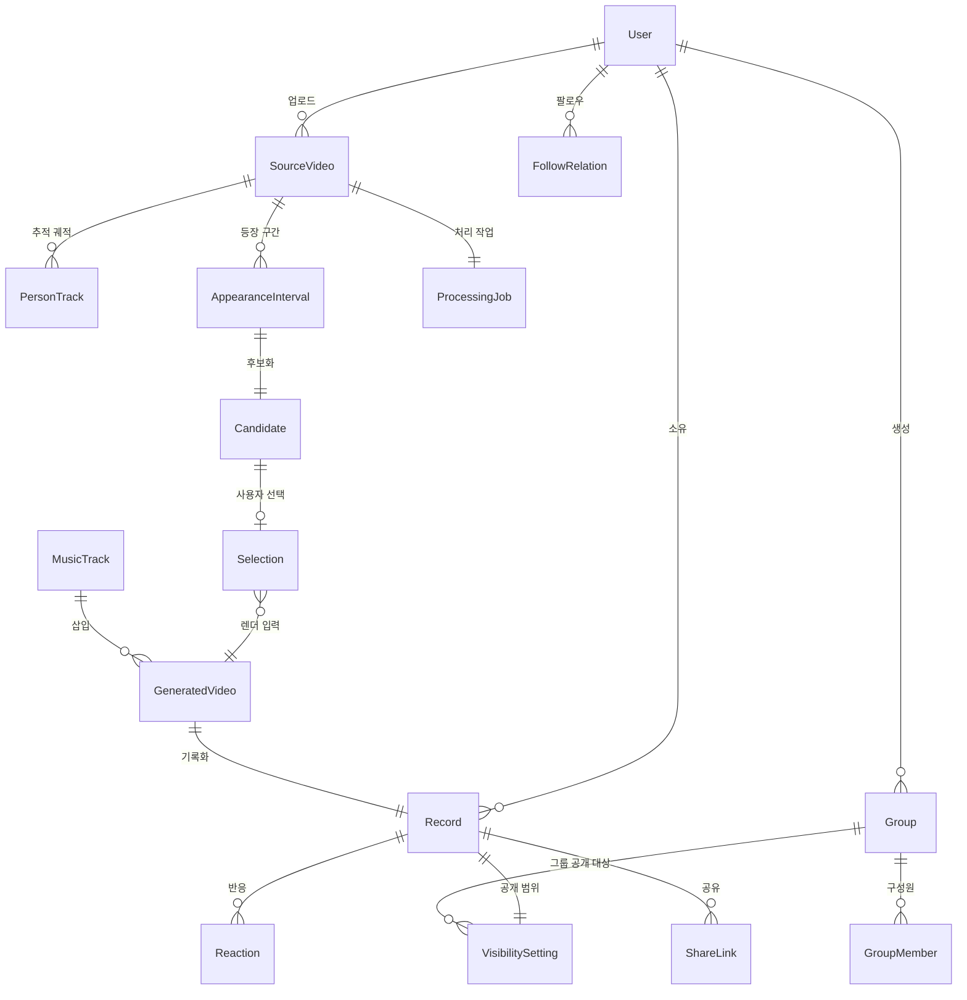

| Entity | 주요 필드 | 설명 | 대응 요구사항 |
| --- | --- | --- | --- |
| **User** | `id` · `handle` · `profile` · `birth_year` | 개인 계정 | REQ-NF-016 |
| **SourceVideo** | `id` · `owner_id` · `duration` · `size` · `codec` · `storage_uri` · `status` | 업로드된 긴 원본 | REQ-FUNC-001 · 028 |
| **PersonTrack** | `id` · `video_id` · `subject_ref` · `bbox_timeline` | 지정 대상의 추적 궤적 | REQ-FUNC-002 |
| **AppearanceInterval** | `id` · `video_id` · `start_tc` · `end_tc` · `confidence` | 탐지된 등장 구간 | REQ-FUNC-003 |
| **Candidate** | `id` · `interval_id` · `rank` · `thumbnail_uri` · `confidence_flag` | 사용자에게 제시되는 후보 | REQ-FUNC-004 · 029 |
| **Selection** | `id` · `candidate_id` · `user_id` · `selected_at` | **사용자 선택 기록.** 향후 학습의 원천 | REQ-FUNC-005 · 023 |
| **GeneratedVideo** | `id` · `owner_id` · `source_video_id` · `duration` · `music_id` | 완성 영상 | REQ-FUNC-008 |
| **Record** | `id` · `generated_video_id` · `created_at` | **공개와 무관하게 존재하는 기록 단위** | REQ-FUNC-009 |
| **VisibilitySetting** | `record_id` · `scope` · `group_ids` | 기록 단위 공개 범위 | REQ-FUNC-010 · REQ-NF-009 |
| **Group** | `id` · `owner_id` · `name` · `member_count` | 승인 절차 없이 생성 · **상한 20명** | REQ-FUNC-013 |
| **GroupMember** | `group_id` · `user_id` · `joined_at` · `left_at` | 구성원 · 이탈 이력 | SC-2.F1·F2 |
| **FollowRelation** | `follower_id` · `followee_id` | **단방향** — 맞팔 개념 없음 | REQ-FUNC-012 |
| **ProcessingJob** | `id` · `video_id` · `stage` · `status` · `retry_count` · `checkpoint` | 비동기 작업 | SC-1.F4 · REQ-NF-008 |
| **MusicTrack** | `id` · `title` · `license_ref` · `license_expires_at` | 라이선스가 확보된 곡만 | REQ-FUNC-007 |
| **Reaction** | `id` · `record_id` · `user_id` · `type` · `report_flag` | 공개 범위 내에서만 | REQ-FUNC-015 · 016 |
| **ShareLink** | `id` · `record_id` · `token` · `expires_at` · `revoked_at` | 만료 30일 · 회수 대상 | REQ-FUNC-017 · 033 · REQ-NF-012 |

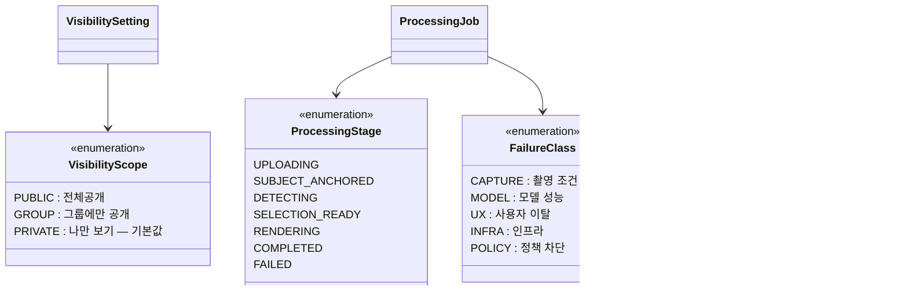

**데이터베이스 스키마 개요**

```sql
users                     -- 개인 계정
source_videos             -- 원본 (storage_uri, codec, status)
person_tracks             -- 추적 궤적 (bbox_timeline)
appearance_intervals      -- 등장 구간 (start_tc, end_tc, confidence)
candidates                -- 후보 (rank, thumbnail_uri, confidence_flag)
selections                -- 사용자 선택 이력 (학습 원천 데이터)
generated_videos          -- 완성 영상
records                   -- 기록 (공개와 무관하게 존재)
visibility_settings       -- 기록 단위 공개 범위 (scope, group_ids)
groups / group_members    -- 그룹 (상한 20명) 및 구성원·이탈 이력
follow_relations          -- 단방향 팔로우
processing_jobs           -- 비동기 작업 (stage, retry_count, checkpoint)
music_tracks              -- 라이선스 확보 곡 (license_ref, expires_at)
reactions                 -- 좋아요 · 댓글 · 신고 플래그
share_links               -- 공유 링크 (만료 30일, 회수 대상)
telemetry_events          -- 계측 이벤트 (schema_version)
```

**보존 및 삭제** — 사용자의 삭제 요청 시 `source_videos` · `person_tracks` · `appearance_intervals` · `candidates` · `generated_videos` · `records` 및 객체 스토리지의 모든 파생물을 **전량 삭제**한다 (REQ-NF-014). 구체적 보존 기간은 미정이다 `[TBD]`.

## 6.3 Detailed Interaction Models

### 6.3.1 업로드 실패와 재개 — 상세

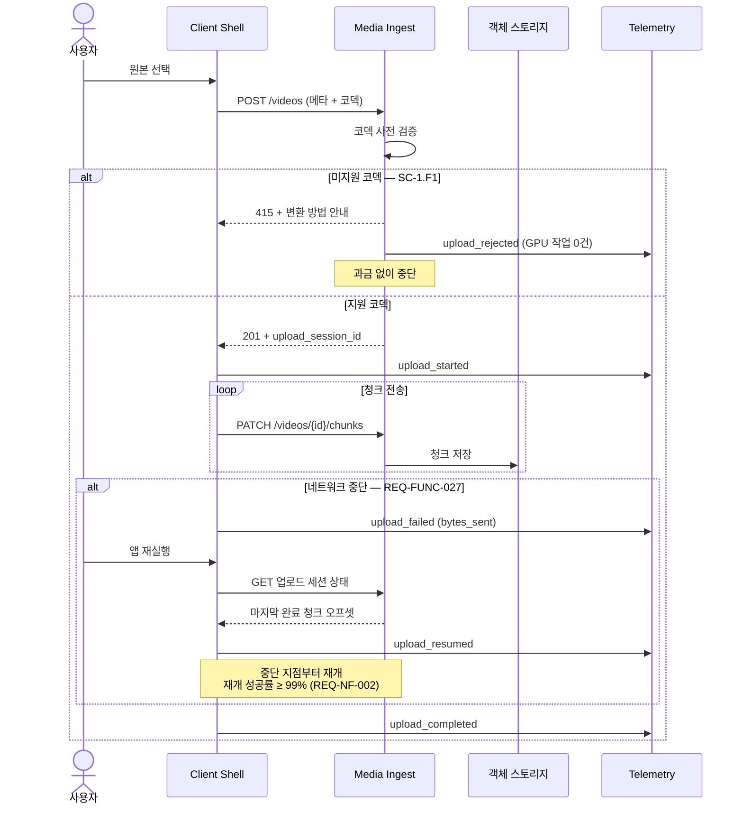

### 6.3.2 탐지 파이프라인과 Gate A 계측 — 상세

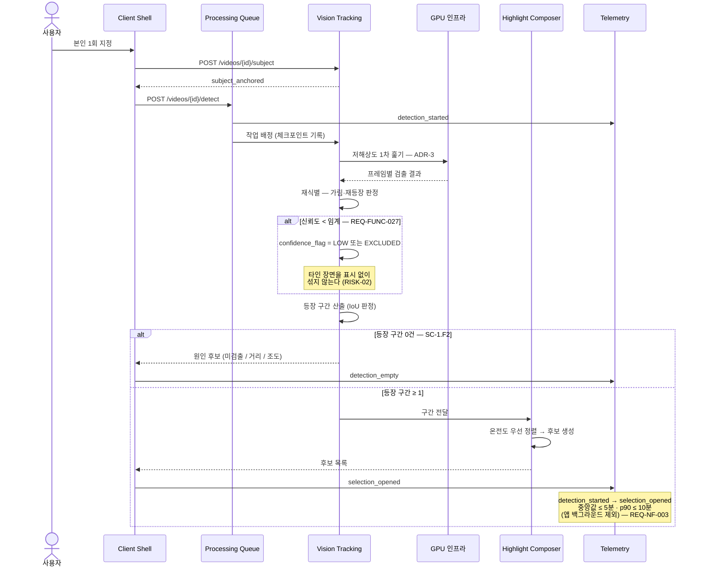

### 6.3.3 렌더 실패와 상태 보존 — 상세

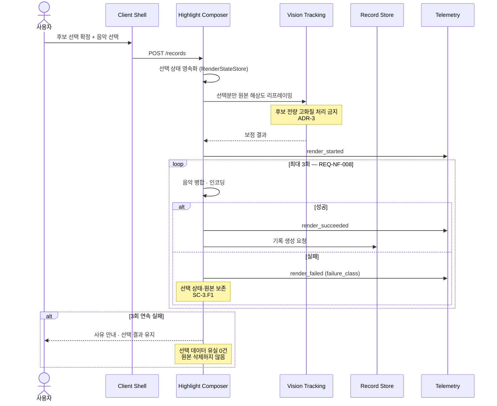

### 6.3.4 공개 범위 서버 측 강제 — 상세

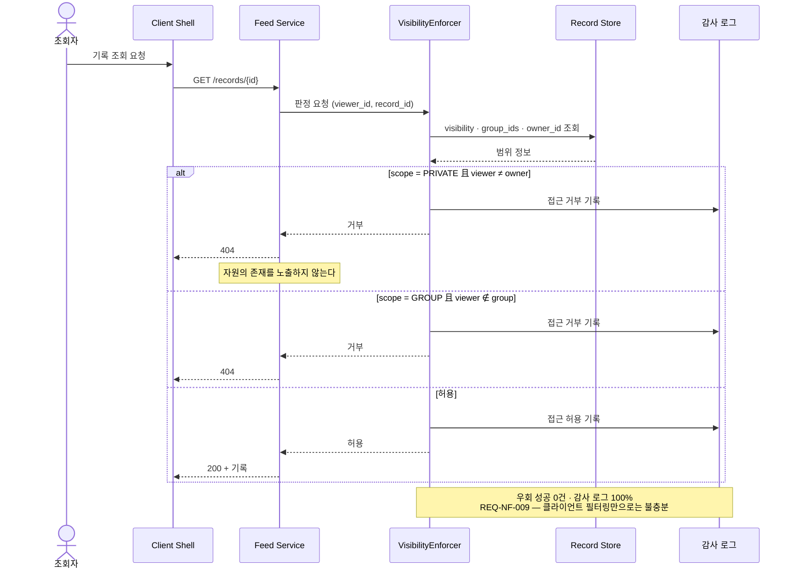

### 6.3.5 그룹 이탈과 공유 링크 회수 — 상세

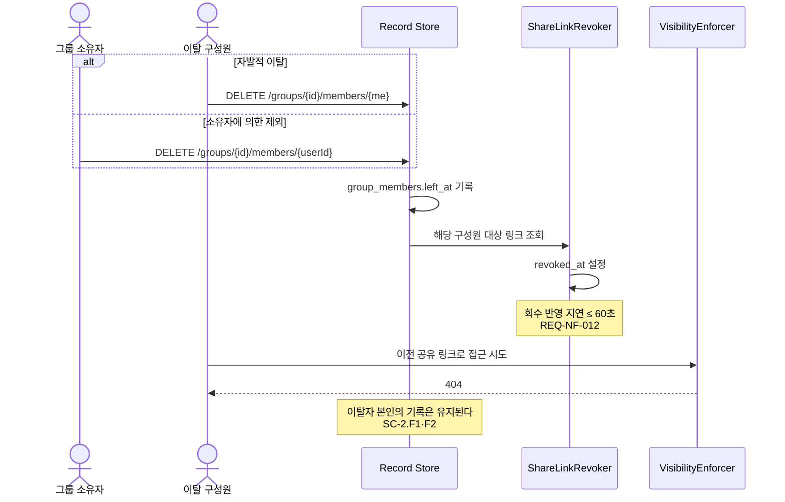

## 6.4 Validation Plan

> 확장 근거: REF-05 §9.6.19 Verification

### 6.4.1 검증 게이트

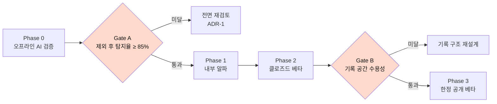

**Gate A와 Gate B는 순서를 바꿀 수 없다.**

| Phase | 대상 | 포함 요구사항 | 판정 지표 | 통과 기준 | 롤백 |
| --- | --- | --- | --- | --- | --- |
| **Phase 0** 오프라인 AI 검증 | 내부 · 수집 영상 | REQ-FUNC-001~003 · 027 · SC-1.F1·F2·F5 | O9 | **Gate A — 제외 후 탐지율 ≥ 85%** | ADR-1 재검토 |
| **Phase 1** 내부 알파 | 내부 팀 | + REQ-FUNC-004~008 · 030 · 031 | O3 · 완주율 | O3 ≥ 80% · 완주율 `[TBD]` | 파이프라인 단계 롤백 |
| **Phase 2** 클로즈드 베타 | 초대 · UC-01 · UC-02 · UC-06 | + REQ-FUNC-009~011 · 032 | **Gate B** · O5 | 저장 성공률 ≥ 99.9% · O5 `[TBD]` | 기록 구조 재설계 |
| **Phase 3** 한정 공개 베타 | 첫 카테고리 공개 | Must Have 전체 | O7 · O2 · O6 | O7 코호트 성립 | 소비 루프 재설계 |

**중단 기준**

| 조건 | 조치 |
| --- | --- |
| **Gate A 미달 (제외 후 탐지율 < 85%)** | 🔴 **이후 개발 전면 중단.** **제외 전 값을 함께 보아 원인을 가른다** — 모델이면 ADR-1 재검토, 임계가 과하면 `τ` 하향 |
| 재식별 오탐이 사용자 신고로 확인 | 해당 기능 비활성화 · 저신뢰 표시 도입 (REQ-FUNC-027) |
| 기록 저장 성공률 < 99.9% | 🔴 **Phase 진행 중단.** 제품 주장의 전제가 무너짐 |
| 편당 처리 원가가 상한 초과 | 처리 방식 재설계 (ADR-2 · ADR-3) |
| **REQ-NF-010 산출물 4종 미승인** | 🔴 **CI가 프로덕션 배포를 차단** |
| **REQ-FUNC-007 라이선스 증빙 미확보** | 음악 라이브러리 배포 차단 |
| **REQ-NF-016 산출물 3종 미승인** | 가입 플로우 배포 차단 |

### 6.4.2 실험 설계 — 착수 조건

| 실험 | 대상 | 설계 |
| --- | --- | --- |
| **Gate A 벤치마크** | REQ-FUNC-002 · 003 | 정답셋 **농구 원본 n=100편**(40분급). **촬영 거리·조도·복장 유사도가 다른 케이스를 포함**해야 한다 — 단일 조건에서만 검증하면 RISK-04가 출시 후 드러난다 |
| **후보 개수 A/B/n** | REQ-FUNC-004 · 가정 A3 | 후보 **15 / 30 / 50개** 조건별 선택 소요·선택 개수·재선택률 비교 |
| **구도 만족도** | REQ-FUNC-006 · SC-3.1 | 완성 직후 1문항. **촬영 거리 구간별로 분리 계측**해 목표를 거리 조건부로 재정의할지 판정 |

> **표본 크기와 성공 임계는 실측 분산 확보 후 확정한다.** 기준선이 없는 단계에서 미리 정한 실험 설계는 실측 분산이 드러나는 순간 폐기된다.

### 6.4.3 계측 이벤트

공통 속성 4개: `session_id` · `user_id` · `occurred_at` · `schema_version`

| 이벤트 | 트리거 | 고유 속성 |
| --- | --- | --- |
| `upload_started` / `upload_completed` / `upload_resumed` / `upload_failed` / `upload_rejected` | 업로드 각 단계 | `video_id` · `bytes` · `codec` · `retry_count` |
| `subject_anchored` | 대상 지정 완료 | `video_id` |
| `detection_started` / `detection_completed` / `detection_empty` | 탐지 각 단계 | `video_id` · `interval_count` · `elapsed_ms` |
| `selection_opened` | 후보 목록 표시 | `video_id` · `candidate_count` |
| `candidate_selected` / `candidate_excluded` | 후보 선택·제외 | `candidate_id` · `rank` · `confidence_flag` |
| `reselection_started` | 선택을 처음부터 다시 시작 | `record_draft_id` — **ADR-3 검증 지표** |
| `render_started` / `render_succeeded` / `render_failed` | 렌더 각 단계 | `record_draft_id` · `elapsed_ms` · `failure_class` |
| `record_saved` | 기록 저장 완료 | `record_id` · `visibility_scope` |
| `visibility_changed` | 공개 범위 변경 | `record_id` · `from` · `to` |
| `app_opened` / `first_frame_rendered` | 앱 진입 · 첫 프레임 | `elapsed_ms` · `tab` |
| **`first_unmute`** | 사용자 첫 조작으로 소리가 활성됨 | `elapsed_ms` · `muted_playback_ms` — **REQ-FUNC-011 검증** |
| **`origin_delete_reported`** | 사용자가 원본 삭제를 자기신고 | `record_id` — **O4 측정** |
| `feed_empty_fallback` | 빈 피드 대체 노출 | `fallback_type` — SC-6.F1 |
| `external_app_switch` | 완성 과정 중 외부 앱 전환 | `stage` — **REQ-FUNC-008 검증. 0건이어야 한다** |
| `visibility_denied` | 공개 범위 접근 거부 | `record_id` · `reason` — REQ-NF-009 감사 로그 |

**운영 규칙** — 세션은 30분 무활동 시 종료 `[PROPOSED]`. **이벤트 누락률이 5%를 초과한 기간의 지표는 공표하지 않는다** `[PROPOSED]`. 모든 이벤트에 `schema_version`을 포함하고 정의 변경 시 증가시킨다.

### 6.4.4 기준선 확보 계획

| 순위 | 대상 | 방법 | 선행 조건 |
| :--: | --- | --- | --- |
| **0** | **가정 A6 — 국내 정량 근거 0건** | 농구 동호회 **100명** 설문. 문항 2개(원본 보유 개수 · 미게시 사유) | 없음 — **MVP 개발보다 먼저** |
| **1a** | **REQ-FUNC-027** 제외 임계 확정 | 재식별·탐지 분리 계측 + **제외 전/후 탐지율 동시 집계** 설계 | 없음 — 0순위와 **병렬** |
| **1b** | REQ-FUNC-002 · 003 **정답셋 구축** | 6.4.2 조건 다양성 요건 충족 | **0순위 결과 확인 후** |
| **2** | O1 · O2 · O3 · O5 · O6 기준선 | Phase 1~2 실측 | Gate A 통과 |
| **3** | S-원가 편당 처리 원가 | Phase 1 처리 물량 집계 | Phase 1 착수 |

> **0순위를 먼저 두는 이유는 소요 시간이 아니라 종류다.** REQ-FUNC-003은 *"만들 수 있는가"*를 묻고, 가정 A6은 ***"만들 이유가 있는가"***를 묻는다. **가장 싸게 사업을 부정할 수 있는 검증을 먼저 수행한다** — A6이 뒤집히면 Gate A의 성패는 의미가 없다.
>
> **1b를 0순위 뒤에 두는 이유**도 같다. 정답셋 구축은 비용이 큰 작업이라 0순위가 뒤집히면 그 노력이 통째로 낭비된다. 반면 1a(지표 정의)는 합의 문제라 비용이 낮아 병렬로 진행한다.

## 6.5 차별점 근거

> 이 절은 배경 정보이며 **요구사항이 아니다** (REF-05 §9.6.20).

| # | 차별점 | 커버리지 | 모방 난이도 | 대응 요구사항 |
| :--: | --- | :--: | :--: | --- |
| **D1** | 말하지 않고 움직이는 사람을 추적한다 | **6/6** | **높음** | REQ-FUNC-002 · 003 |
| **D2** | 최종 선택권이 사람에게 있다 | 4/6 | 낮음 | REQ-FUNC-005 |
| **D3** | 기록의 주인이 개인이다 | 5/6 | 중간 | REQ-FUNC-009 · 제약 C5 |
| **D4** | 기록이 먼저고 공개가 선택이다 | 3/6 | 낮음 | REQ-FUNC-009 · 010 |

**D1이 실패하면 나머지 셋은 일반 기록 앱이 된다.** 이것이 Gate A를 최우선·단독으로 배치한 근거이며 RISK-01을 치명으로 판정한 이유다.

**D4는 차별점이 아니라 진입 조건이다.** 모방 난이도가 낮고 유사 서비스가 이미 보유하고 있어, 여기에 인물 추적이 더해지면 차별점이 소멸한다. 이것이 소비 루프(REQ-FUNC-011~017)를 본 범위에 포함한 근거다 — **관계망 없이 기록만 남기면 편집기 하나로 남는다.**

**검증 가능한 비교만 기술한다.**

| 비교 항목 | 기존 대안 | 본 제품 | 차이의 성격 |
| --- | --- | --- | --- |
| 추적 대상 | 화자(말하는 사람)·음성 | 넓은 코트에서 작게 잡힌 채 움직이는 사람 | 구조적 차이 |
| 긴 원본 처리 | 촬영 중 짧은 구간 | 40~50분 원본 | 대상 자체가 다름 |
| 기록의 주인 | 클럽·학교·팀 | 개인 | 계약 주체 차이 |
| 전용 장비 | 필요 | 기존 원본 활용 | 진입장벽 차이 |
| 공개 없이 보관 | 없음 | 기록 우선·공개 선택 | 구조적 차이 |
| 작업 시간 · 결과 품질 | 미측정 | 미측정 | **실험 필요** `[TBD]` |

> **경쟁사 대비 배수·퍼센트를 쓰지 않는다.** "탐지율 2배" 같은 표현은 **측정된 적 없는 분모**를 전제한다. 원 주장은 범주적이다 — *"코트에는 말하는 사람이 없다. 이 조건에서 사람을 놓치지 않는 서비스는 조사한 목록에 없다."* **범주적 주장이 정량 주장보다 강하고 반박하기 어려우므로 약한 형태로 번역하지 않는다.**

## 6.6 운영 시나리오 — v1.3 신설 5건

팀 SRS v1.0의 시나리오 33건에 더해 **5건을 신설**했다. 전부 **요구사항이 아니라 시나리오로 둔** 것이며, 그 판단 근거를 함께 적는다.

**형식은 팀 §11을 그대로 따른다** — Given–When–Then, 실패 경로는 `F` 접미사, `연결 REQ` 열로 §4를 가리킨다. 표준 근거는 REF-05 **§9.4.17 Operational scenarios**이며, **새로운 요구사항이 아니라 인수 기준의 시나리오 단위 상세화**다.

| SC | Given – When – Then | 판정 기준 | 연결 REQ |
| --- | --- | --- | --- |
| **SC-1.F4** | Given 업로드·탐지·렌더 중 앱이 강제 종료됐을 때 / When 사용자가 재진입하면 / Then **마지막 완료 단계에서 재개**된다 | 단계 복원 성공률 `[TBD]` · **선택 데이터 유실 0건** · 중간 산출물 유실 0건 | REQ-FUNC-001 · REQ-NF-008 |
| **SC-1.F5** | Given 재식별 신뢰도가 임계 미만인 구간이 있을 때 / When 후보를 제시하면 / Then **후보 목록에서 제외**한다 | 타인 장면 혼입 **0건** · 제외율 계측 100% · **제외 전/후 탐지율 동시 집계** | **REQ-FUNC-027** |
| **SC-1.F6** 🆕 | Given 제외로 후보가 현저히 줄었을 때 / When 후보 화면을 열면 / Then **사유를 안내**한다 | 빈 화면 노출 0건 · 사유 없는 후보 부족 0건 | REQ-FUNC-027 · SC-1.F2 |
| **SC-3.F2** | Given 구도 보정 결과가 마음에 들지 않을 때 / When **다시 고르기**를 누르면 / Then 장면 선택 단계로 복귀하고 기존 선택이 보존된다 | 선택 상태 유실 **0건** · `reselection_started` 발생 — **ADR-3의 판정 지표** | REQ-FUNC-005 · 006 |
| **SC-4.5** | Given 마이페이지에 기록이 쌓였을 때 / When 종목·공개 범위 칩을 누르면 / Then 해당 조건의 기록만 표시된다 | 오표시 **0건** · 비공개 기록이 타인 뷰에 유입 0건 | REQ-FUNC-010 · 020 |
| **SC-4.F2** | Given 저장 용량·쿼터를 초과했을 때 / When 업로드를 시도하면 / Then 초과 사실과 **정리 가능한 대상**을 함께 제시한다 | 정리 대상 제시율 100% · 원인 없는 실패 0건 | REQ-FUNC-019 |
| **SC-0.1** 🆕 | Given 가입자가 만 14세 미만일 때 / When 가입을 시도하면 / Then **법정대리인 동의 없이는 완료되지 않는다** | 동의 없는 계정 생성 **0건** · 연령 미수집 가입 0건 | **REQ-NF-016** |
| **SC-0.F1** 🆕 | Given 미성년자가 포함된 클럽 영상일 때 / When 전체공개·그룹 공개를 시도하면 / Then **동의 미확보 시 비공개까지만 허용**한다 | 동의 미확보 공개 발행 **0건** · 기록 생성은 정상 진행 | **REQ-NF-017** |

### 왜 이 5건을 요구사항으로 올리지 않았는가

| SC | 승격하지 않은 이유 |
| --- | --- |
| **SC-1.F4** | 부모 REQ-FUNC-001·REQ-NF-008과 **담당자가 같다**(백엔드 리드). 한 ID로 묶어도 책임이 흐려지지 않는다 |
| **SC-1.F5** | **승격했다** → REQ-FUNC-027. 오인식률 임계는 팀에 있었으나 **임계 초과 시 처리 방침**이 어디에도 없었다. 시나리오는 그 요구사항의 검증 짝이다 |
| **SC-3.F2** | 화면 동작이지 시스템 능력이 아니다. 다만 **ADR-3의 유일한 판정 경로**이므로 §5.3에서 `TC-ADR-03`과 연결했다 |
| **SC-4.5** | Should 수준. 없어도 Core Job이 성립한다 |
| **SC-4.F2** | 원본 삭제 안내(REQ-FUNC-019, Should)와 **같은 흐름**이라 별도 요구사항이 불필요하다 |
| **SC-0.1 · SC-0.F1** | **승격했다** → REQ-NF-016 · REQ-NF-017. 둘 다 팀 문서 전무이고 담당자(법무)가 다르며 없으면 규제 대응 수단이 사라진다 — 승격 기준 셋을 모두 충족한다 |
| **SC-1.F6** | 후보 부족 안내는 SC-1.F2(대상 미등장)와 **같은 화면·같은 담당자**다 |

> **승격 판정 기준** — ① 팀 §4·§11·API 어디에도 없는가 ② 부모 요구사항과 **담당자가 다른가** ③ 없으면 리스크 대응 수단이 사라지는가. **셋 중 둘 이상이면 승격**한다. 이 기준으로 19건 중 2건만 남았다.

## 6.7 미해결 사항

| ID | 질문 | 영향 | 담당 | 결정 시한 |
| --- | --- | --- | --- | --- |
| **Q1** | 재식별 오탐률 판정 지표를 무엇으로 할 것인가 | 🔴 RISK-02 대응 불가 · Gate A 설계 | AI 리드 | **Gate A 설계 전** |
| **Q2** | 구도 보정 목표를 촬영 거리 조건부로 재정의할 것인가 | 물리적으로 불가능한 구간에 목표를 거는 위험 | 제품 · AI | Phase 1 |
| **Q3** | 편당 처리 원가 상한을 얼마로 볼 것인가 | 🔴 성장이 곧 적자 · ADR-2 · 3 | 백엔드 · 사업 | **Phase 1 전** |
| **Q4** | 얼굴 정보 처리 방침 (산출물 4종) | 🔴 프로덕션 배포 차단 | 법무 · 제품 | **Phase 2 전** |
| **Q5** | 외부 내보내기를 허용할 것인가 | UC-05 진입 여부 · ADR-5 | 제품 | Phase 3 전 |
| **Q6** | 공개 범위 기본값 (ADR-4) | O5 · 첫 저장 이탈 | 제품 · 디자인 | Gate B |
| **Q7** | 후보 약 30개가 적정한가 (가정 A3) | 사용자 피로 | 제품 | Phase 1 실측 후 |
| **Q8** | 팀 공유 편집을 어떻게 교착에서 꺼낼 것인가 | UC-02 · UC-06이 절반만 충족 | 제품 | `[TBD]` |
| **Q9** | 음원 라이선스 조달 방식 (증빙 3종) | 🔴 음악 라이브러리 배포 차단 | 사업 · 법무 | **Phase 1 전** |
| **Q10** | 미성년 **이용자** 정책 (산출물 4종) | 🔴 가입 플로우 배포 차단 | 법무 | Phase 3 전 |
| **Q10-b** | **영상 내 미성년자 판별 기준** — 자동 판별인가 신고 기반인가 | 🔴 공개 발행 배포 차단 (REQ-NF-017 ③) | 법무 · 제품 | **파일럿 8주 종료 후** — 입력은 REF-14 산출물 4-b |
| **Q10-c** | **파일럿 동의서의 주체** — 클럽인가 법정대리인인가 · 기존 동의로 커버되는가 | 🔴 **파일럿 착수 자체의 전제** | 법무 | **파일럿 0주차 전** |
| **Q11** | 확장 종목을 무엇으로 할 것인가 | 🔴 O7의 약 6,000명분 | 제품 · 사업 | **Gate A 통과 시점** |
| **Q12** | 국내 기초 설문을 언제 수행할 것인가 (가정 A6) | 🔴 문제 정의의 근거 | 제품 | **Phase 1 착수 전** |
| **Q13** | 카테고리별 조회수 랭킹을 도입할 것인가 | REQ-FUNC-022 도입 여부 자체가 미정 | 제품 | MVP 직후 |
| **Q17** | **무음 소비 비율이 높으면 진입 방식을 바꿀 것인가** | REQ-FUNC-011 · 음악(F18a)의 가치 전달 | 제품 · 디자인 | 베타 2주차 실측 후 |
| **Q18** | **단말 등급 하한 미만에서 완성을 어떻게 처리할 것인가** | REQ-NF-004 · 클라이언트 렌더 구현 시 | 클라이언트 · 제품 | 렌더 스파이크 후 |
| **Q14** | 팔로우 승인 방식 — 승인제 / 자동 | REQ-FUNC-012 관계 생성 흐름 | 제품 · 디자인 | 사용자 테스트 후 |
| **Q15** | 그룹 안 좋아요·댓글 정책 | REQ-FUNC-013 · 015 · 016의 그룹 내 동작 | 제품 | Phase 2 전 |
| **Q16** | 음악 카테고리별 곡 수 배분 | REQ-FUNC-007 — 총 500곡은 확정, **배분은 초안** | 사업 · 제품 | 실사용 선택 분포 확인 후 |

**해소 순서** — 6.4.4의 순위를 따른다. **Q12 → Q1 → Q11** 순이며, 근거는 소요 시간이 아니라 ① 전복 가능성 ② 차단성 ③ 되돌리는 비용이다.

---

*작성자: 제품 아키텍트, 검토자: AI 리드 · 백엔드 리드 · 보안 담당자, 승인자: 제품 리드 (PM)*
