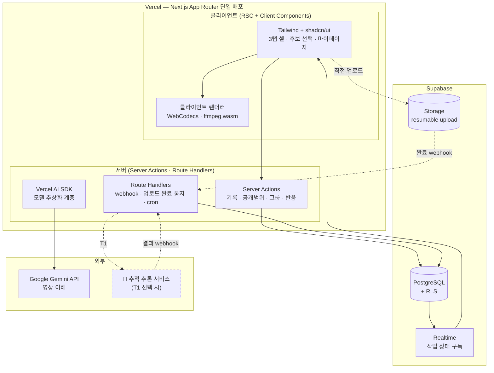
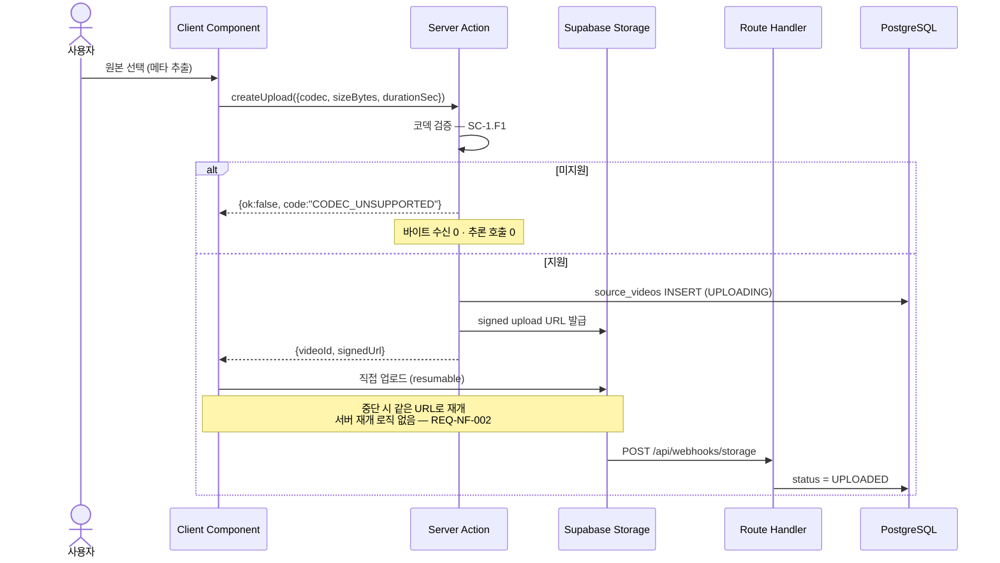
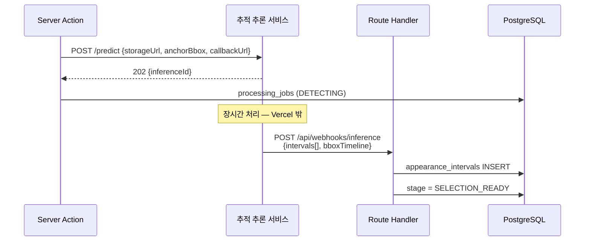

# Software Requirements Specification (SRS) — 기술 제약 반영판

**Document ID:** SRS-HILIT-NEXTJS-001

**version:** 2.0

**Date:** 2026-08-30

**Standard:** ISO/IEC/IEEE 29148:2018

**성격:** `[SRS]hilit-SRSv1.5.md`와 **병렬 문서**. 기존 SRS를 대체하지 않는다.

---

## 이 문서의 위치

| 문서 | 전제 | 답하는 것 |
| --- | --- | --- |
| `[SRS]hilit-SRSv1.5.md` | **기술 중립** | 무엇을 만족해야 하는가 |
| **이 문서 (v2.0)** | **C-TEC-001~007 고정** | **그 제약 안에서 무엇을 만들 수 있는가** |

**두 문서는 요구사항 ID를 공유한다.** v1.5의 `REQ-FUNC-nnn`·`REQ-NF-nnn`을 그대로 인용하고, 이 문서는 **각 요구사항이 지정된 스택에서 구현 가능한지를 판정**한다.

> ### 🔴 먼저 읽어야 할 결론
>
> **지정된 스택은 이 제품의 소비·기록 계층을 잘 지원하지만, 트래킹 계층은 지원하지 못한다.**
>
> MVP 요구사항 45건 중 **✅ 32건은 그대로 구현 가능**하고, **🟡 8건은 설계를 바꾸면 가능**하며, **🔴 5건은 이 스택만으로는 불가능**하다. 불가능한 5건이 **하필 제품의 차별점 D1**(REQ-FUNC-002 · 003 · 006 · 027 · REQ-NF-003)이다.
>
> **§2가 이 문서의 핵심이다.** 무엇이 왜 막히는지와 선택지 3개를 거기에 정리했다.

---

# 1. Introduction

## 1.1 Purpose

**Next.js 단일 풀스택 프레임워크 · Vercel 배포 · Supabase · Gemini API** 제약 하에서, HILiT MVP의 요구사항 중 **구현 가능한 범위와 그 설계**를 정의한다.

## 1.2 Scope

### 1.2.1 In-Scope

이 문서는 v1.5의 요구사항을 **재작성하지 않고 판정한다.** 판정 결과 ✅·🟡인 요구사항의 **구현 설계**를 §3~§7에 담는다.

### 1.2.2 Out-of-Scope

- 요구사항의 신규 정의 — v1.5 소관
- 제품 가치·시장 판단 — VPS 0.3 소관
- 🔴 판정 요구사항의 **대체 구현** — §2.4의 선택지 결정 후 별도 문서

## 1.3 Definitions

| 용어 | 정의 |
| --- | --- |
| **Server Action** | Next.js App Router에서 `'use server'`로 표시된 서버 실행 함수. 클라이언트에서 직접 호출 |
| **Route Handler** | `app/api/**/route.ts`의 HTTP 핸들러 |
| **Serverless Function** | Vercel에서 Route Handler·Server Action이 실행되는 단위. **실행 시간 상한이 있다** |
| **Signed URL** | Supabase Storage가 발급하는 시한부 직접 업로드·다운로드 주소 |
| **Resumable Upload** | 중단 지점부터 재개 가능한 업로드 프로토콜 |
| **RLS** | Row Level Security. PostgreSQL의 행 단위 접근 제어 |
| **인물 추적 (Person Tracking)** | 영상 프레임마다 특정 인물의 위치(bbox)를 산출하고 시간축으로 연결하는 것 |
| **영상 이해 (Video Understanding)** | 영상의 내용을 자연어로 기술하거나 구간을 분류하는 것. **좌표를 산출하지 않는다** |

## 1.4 References

| ID | 문서 |
| --- | --- |
| **TREF-01** | `[SRS]hilit-SRSv1.5.md` — 요구사항 원천 |
| **TREF-02** | `[DS]hilit-DSv1.0.md` — 기술 중립 설계 |
| **TREF-03** | `VPS_v0_3.html` — 차별점 D1~D4 |
| **TREF-04** | Next.js App Router · Vercel · Supabase · Prisma · Vercel AI SDK 공식 문서 ⚠️ **버전별 제한값은 착수 시 재확인** |

## 1.5 Assumptions & Constraints

### 1.5.1 기술 제약 — 확정

**시스템 내부 — 단일 통합 프레임워크**

| ID | 제약 |
| --- | --- |
| **C-TEC-001** | 모든 서비스는 **Next.js (App Router)** 기반 단일 풀스택 프레임워크로 구현한다. 프론트엔드와 백엔드를 별도 분리하지 않는다 |
| **C-TEC-002** | 서버 측 로직(DB 접근·API 호출)은 **Server Actions 또는 Route Handlers**로 구현한다. 별도 백엔드 서버를 두지 않는다 |
| **C-TEC-003** | 데이터베이스는 **Prisma + 로컬 Supabase**로 개발환경을 구성하고, 배포 시 **Supabase(PostgreSQL)** 를 사용한다 |
| **C-TEC-004** | UI·스타일링은 **Tailwind CSS + shadcn/ui**를 사용한다 |

**시스템 외부 — 연결 및 AI 통합**

| ID | 제약 |
| --- | --- |
| **C-TEC-005** | AI 기능은 자체 서버 구축 없이 **Vercel AI SDK**로 Next.js에서 외부 API를 호출하는 형태로 구현한다 |
| **C-TEC-006** | 외부 AI 호출은 **Google Gemini API**를 기본으로 하며, **환경 변수만으로 모델 교체**가 가능하도록 SDK 표준 인터페이스를 준수한다 |
| **C-TEC-007** | 배포·인프라는 **Vercel 단일화**하며, CI/CD 설정 없이 **Git Push만으로 배포**한다 |

### 1.5.2 제약에서 파생되는 전제

| # | 전제 | 근거 |
| --- | --- | --- |
| **A-T1** | 서버 실행 시간에 **상한이 있다** | Serverless Function의 성질 (C-TEC-002 · 007) |
| **A-T2** | 요청 본문 크기에 **상한이 있다** | 동일 |
| **A-T3** | **장시간 백그라운드 워커를 둘 수 없다** | 별도 서버 금지 (C-TEC-002) |
| **A-T4** | **GPU를 직접 사용할 수 없다** | 외부 API 호출만 허용 (C-TEC-005) |
| **A-T5** | AI 능력은 **Gemini API가 제공하는 범위**로 한정된다 | C-TEC-006 |
| **A-T6** | 상태 저장은 **PostgreSQL + Supabase Storage**로 한정된다 | C-TEC-003 |

> ⚠️ **A-T1·A-T2의 구체적 수치는 플랜과 버전에 따라 다르므로 이 문서에 적지 않는다.** 착수 시 실측하고 확정한다. **다만 "40분 영상을 함수 안에서 처리할 수 없다"는 결론은 어떤 플랜에서도 성립한다.**

---

# 2. 🔴 제약이 요구사항에 미치는 영향

**이 절이 이 문서의 존재 이유다.**

## 2.1 판정 요약

| 판정 | 건수 | 뜻 |
| :--: | ---: | --- |
| ✅ **구현 가능** | **32** | 스택 그대로 만족 |
| 🟡 **설계 변경 후 가능** | **8** | 우회 설계 필요. 요구사항은 유지 |
| 🔴 **이 스택으로 불가** | **5** | 요구사항을 낮추거나 제약을 풀어야 함 |

## 2.2 🔴 불가 5건

| REQ | 요구 | 막히는 이유 |
| --- | --- | --- |
| **REQ-FUNC-002** | 대상 지정 후 **가림·재등장 시 재식별** · 오인식 ≤ 2% | Gemini는 **영상 이해**를 하고 **인물 추적**을 하지 않는다. 프레임별 동일 인물 식별과 오인식률 관리는 전용 추적 모델의 작업이다 |
| **REQ-FUNC-003** | 등장 구간 탐지 · **IoU 기반 정탐 판정** · 탐지율 ≥ 85% | IoU는 **bbox 좌표**를 전제한다. 좌표를 산출하지 않는 API로는 판정 자체가 불가능하다 |
| **REQ-FUNC-006** | **추적 좌표 기반** 구도 재구성 | 🔴 **입력이 없다.** 좌표가 없으면 리프레이밍이 성립하지 않는다 |
| **REQ-FUNC-027** | 재식별 신뢰도 임계 미만 후보 **제외** | 재식별 신뢰도라는 값 자체가 생성되지 않는다 |
| **REQ-NF-003** | 40분 원본 탐지 **p95 ≤ 8분** | 🔴 **A-T1·A-T3.** Serverless Function 실행 시간 상한 안에서 40분 영상을 처리할 수 없고, 장시간 워커를 둘 수 없다 |

> ### 이 5건이 왜 치명적인가
>
> VPS 0.3이 정의한 차별점 **D1 — "말하지 않고 움직이는 사람을 추적한다"** 가 정확히 이 다섯이다. SRS v1.5 §6.5는 **D1이 실패하면 나머지 셋은 일반 기록 앱이 된다**고 적었다.
>
> **즉 이 스택으로 만들면, 만들 수 있는 것은 "기록이 남는 숏폼 SNS"이지 "AI가 나를 찾아주는 서비스"가 아니다.**

## 2.3 🟡 설계 변경 후 가능 8건

| REQ | 요구 | 우회 설계 |
| --- | --- | --- |
| **REQ-FUNC-001** | 40~50분 · 4GB 업로드 | 🟡 **A-T2 우회** — Route Handler를 경유하지 않고 **Supabase Storage로 직접 업로드**(Signed URL). 서버는 메타데이터와 완료 통지만 받는다 |
| **REQ-NF-002** | 업로드 p95 ≤ 6분 · 재개 성공률 ≥ 99% | 🟡 Supabase Storage의 **resumable upload**로 구현. 서버 재개 로직을 두지 않는다 |
| **REQ-FUNC-004** | 후보 **약 30개** 제시 | 🟡 좌표 없이 **시간 구간만** 산출하는 방식으로 대체 가능 — §7.3 |
| **REQ-FUNC-008** | 합치기·렌더링 · p95 ≤ 90초 | 🟡 **A-T1.** 서버 렌더 불가 → **클라이언트 측 렌더**(WebCodecs·ffmpeg.wasm)로 이전. 단말 성능 편차가 새 위험이 된다 |
| **REQ-NF-004** | 렌더 p95 ≤ 90초 | 🟡 위와 동일. 단말 기준으로 재정의 필요 |
| **REQ-NF-009** | **공개 범위 서버 측 강제** · 우회 0건 | 🟡 **Supabase RLS**로 구현. Server Action 계층이 아니라 **DB 정책**에 두어야 우회가 원천 차단된다 |
| **REQ-NF-013** | 편당 처리 원가 상한 | 🟡 GPU 원가가 아니라 **Gemini API 토큰·영상 처리 요금** + Vercel 실행 시간으로 원가 구조가 바뀐다. 재산정 필요 |
| **REQ-NF-018** | 사용자 조작 시간 계측 | 🟡 계측 자체는 가능. 다만 §2.2로 인해 **조작 흐름이 달라지면 기준선이 무의미**해진다 |

## 2.4 선택지 3개

**이 문제는 설계로 풀리지 않는다. 제약이나 제품 정의를 바꿔야 한다.**

| # | 선택 | 바뀌는 것 | 유지되는 것 | 비용 |
| :--: | --- | --- | --- | --- |
| **T1** | **C-TEC-005를 완화** — AI만 전용 추론 서비스 사용 | AI 계층만 외부 (Replicate·Modal 등 추적 모델 호스팅) | 제품 정의 · D1 · 나머지 6개 제약 | 인프라 1개 추가 · 원가 구조 재산정 |
| **T2** | **제품 범위 축소** — 추적을 포기하고 **구간 탐색**만 | 🔴 **D1 상실.** "AI가 나를 찾아준다" → "AI가 볼 만한 구간을 골라준다" | 스택 7개 제약 전부 · 기록·소비 계층 | **차별점 소실** · VPS 재작성 |
| **T3** | **단계 분리** — 1단계는 기록·소비만, 2단계에 추적 | 출시 순서 | 최종 제품 정의 | Gate A가 2단계로 밀림 · **검증 순서 역전** |

### 권고

> **T1을 권한다.** 일곱 제약 중 여섯(001~004 · 006~007)이 그대로 유지되고, **C-TEC-005의 "자체 서버 구축 없이"라는 취지도 지켜진다** — 전용 추론 서비스는 자체 서버가 아니라 **또 하나의 외부 API**다.
>
> **T3은 겉보기에 안전하나 위험하다.** VPS와 SRS가 *"Gate A가 실패하면 이후 전부 무의미"* 를 반복해 명시했다. 추적 검증을 뒤로 미루면 **가장 비싼 것을 가장 늦게 확인**하게 된다.
>
> **T2는 사업 판단이다.** 기술 문서가 결정할 사안이 아니다. 다만 그 경우 **VPS의 차별점 4개 중 D1·D3이 성립하지 않으므로 상위 문서부터 개정해야 한다.**

**이 문서의 §3 이후는 T1을 전제로 작성한다.** T2·T3을 택하면 §7(AI 통합)을 다시 써야 한다.

---

# 3. System Architecture

## 3.1 단일 앱 구성 (C-TEC-001 · 002)



## 3.2 계층 책임

| 계층 | 구현 | 담당 요구사항 |
| --- | --- | --- |
| **RSC (서버 컴포넌트)** | 피드·기록 목록 조회 · 초기 렌더 | REQ-FUNC-011 · 014 · REQ-NF-001 |
| **Client Component** | 후보 선택 · 공개 범위 UI · 렌더 진행 | REQ-FUNC-005 · 010 |
| **Server Action** | 상태 변경 전부 (기록·그룹·반응·팔로우) | REQ-FUNC-009 · 010 · 012 · 013 · 015~017 |
| **Route Handler** | 외부 webhook 수신 · Vercel Cron · 업로드 완료 통지 | REQ-FUNC-001 · 003 |
| **Supabase RLS** | 🔴 **공개 범위 강제** | **REQ-NF-009** |
| **Supabase Storage** | 원본·결과물 · 직접 업로드 | REQ-FUNC-001 · REQ-NF-002 · 011 |
| **Supabase Realtime** | 처리 상태 구독 | SC-1.F4 |
| **Vercel AI SDK** | 모델 호출 추상화 | REQ-FUNC-004 |

## 3.3 🔴 서버 렌더를 클라이언트로 옮긴다

**A-T1 때문에 서버에서 영상을 인코딩할 수 없다.** 렌더를 클라이언트로 이전한다.

| 항목 | 서버 렌더(v1.5) | **클라이언트 렌더(v2.0)** |
| --- | --- | --- |
| 실행 위치 | GPU 인프라 | **사용자 단말** |
| 소요 | p95 ≤ 90초 (REQ-NF-004) | 🔺 **단말 성능에 종속** — 재정의 필요 |
| 실패 처리 | 서버 재시도 3회 | 단말 재시도 · **선택 상태는 서버 보존** |
| 원가 | 편당 GPU | **0** — 사용자 단말 부담 |
| 새 위험 | — | 🔴 **구형 단말에서 완성 불가** · 배터리·발열 |

> **원가가 0이 되는 대신 성공률이 단말에 종속된다.** REQ-NF-004(p95 ≤ 90초)를 **단말 등급별로 재정의**해야 하며, 저사양 단말에서의 실패는 SC-3.F1(선택 상태 보존)로 흡수한다.

---

# 4. Data Design (C-TEC-003)

## 4.1 Prisma 스키마 — 핵심 발췌

```prisma
model User {
  id                String    @id @default(dbgenerated("gen_random_uuid()")) @db.Uuid
  handle            String    @unique @db.VarChar(30)
  displayName       String    @db.VarChar(50)
  birthYear         Int?      @db.SmallInt
  guardianConsentAt DateTime?
  role              Role      @default(user)
  createdAt         DateTime  @default(now())
  deletedAt         DateTime?

  sourceVideos SourceVideo[]
  records      Record[]
  @@index([deletedAt])
  @@map("users")
}

model SourceVideo {
  id          String      @id @default(dbgenerated("gen_random_uuid()")) @db.Uuid
  ownerId     String      @db.Uuid
  durationSec Int
  sizeBytes   BigInt
  codec       String      @db.VarChar(20)
  storagePath String
  status      VideoStatus @default(UPLOADING)
  createdAt   DateTime    @default(now())

  owner     User        @relation(fields: [ownerId], references: [id], onDelete: Cascade)
  intervals AppearanceInterval[]
  job       ProcessingJob?
  @@index([ownerId, createdAt(sort: Desc)])
  @@map("source_videos")
}

model Record {
  id                String   @id @default(dbgenerated("gen_random_uuid()")) @db.Uuid
  ownerId           String   @db.Uuid
  generatedVideoId  String   @unique @db.Uuid
  sport             String?  @db.VarChar(30)
  createdAt         DateTime @default(now())

  owner      User               @relation(fields: [ownerId], references: [id], onDelete: Cascade)
  visibility VisibilitySetting?
  reactions  Reaction[]
  @@index([ownerId, createdAt(sort: Desc)])
  @@map("records")
}

model VisibilitySetting {
  recordId  String          @id @db.Uuid
  scope     VisibilityScope @default(private)   // 🔴 DB 기본값
  groupIds  String[]        @db.Uuid
  updatedAt DateTime        @updatedAt

  record Record @relation(fields: [recordId], references: [id], onDelete: Cascade)
  @@map("visibility_settings")
}

enum VisibilityScope { public group private }
enum VideoStatus { UPLOADING UPLOADED PROCESSING READY FAILED }
enum Role { user operator }
```

**전체 16개 모델의 속성·제약·인덱스는 `[DS]hilit-DSv1.0.md` §4.2를 따른다.** 이 문서는 **Prisma·PostgreSQL로의 사상만** 다룬다.

| DS 설계 | Prisma·PG 구현 |
| --- | --- |
| ULID PK | 🔺 `uuid` 로 대체 — Prisma·PG 기본 지원 우선 |
| `CHECK` 제약 | Prisma 미지원 → **마이그레이션 SQL에 직접 작성** |
| `ULID[]` 배열 | `String[] @db.Uuid` — PG 네이티브 배열 |
| 부분 UNIQUE | Prisma 미지원 → 마이그레이션 SQL |
| 논리/물리 삭제 분리 | `deletedAt` + `onDelete: Cascade` 병용 |

> 🔺 **Prisma가 표현하지 못하는 제약이 있다.** `CHECK (member_count <= 20)` 같은 것은 마이그레이션 SQL로 넣고 **스키마 파일에 주석으로 남긴다.** 그러지 않으면 다음 `prisma migrate` 때 유실된다.

## 4.2 🔴 RLS로 공개 범위를 강제한다 (REQ-NF-009)

**Server Action 계층의 필터링만으로는 REQ-NF-009를 만족하지 못한다.** 새 조회 경로가 추가될 때마다 누락 위험이 생기기 때문이다. **DB 정책에 둔다.**

```sql
alter table records enable row level security;

create policy record_read on records for select using (
  owner_id = auth.uid()
  or exists (
    select 1 from visibility_settings v
    where v.record_id = records.id
      and (
        v.scope = 'public'
        or (v.scope = 'group' and exists (
              select 1 from group_members m
              where m.user_id = auth.uid()
                and m.left_at is null
                and m.group_id = any(v.group_ids)))
      )
  )
);
```

| REQ-NF-009 요구 | RLS 구현 |
| --- | --- |
| 서버 측 강제 | ✅ **DB 계층** — 애플리케이션 우회 불가 |
| 우회 성공 0건 | ✅ 모든 `select`가 정책을 통과 |
| **건수·존재 유추 정보 반환 금지** | ✅ 정책 미통과 행은 **결과 집합에 없다** — `count(*)`도 자동으로 제외 |
| 감사 로그 100% | 🔺 **RLS는 로그를 남기지 않는다** — 별도 설계 필요(§9-2) |

> **RLS가 SC-4.4(타인 프로필 — 개수에도 미포함)를 구조적으로 해결한다.** 애플리케이션이 `count(*)`를 세도 정책이 걸러낸 뒤의 수만 보인다. **개발자가 실수할 여지가 없다** — 이것이 이 스택의 가장 큰 이점이다.

---

# 5. Interface Design (C-TEC-002)

## 5.1 Server Action / Route Handler 배분

**원칙** — 사용자가 일으키는 상태 변경은 **Server Action**, 외부가 일으키는 것은 **Route Handler**.

| 기능 | 방식 | 시그니처 | REQ |
| --- | --- | --- | --- |
| 업로드 개시 | Server Action | `createUpload(meta) → {videoId, signedUrl}` | REQ-FUNC-001 · SC-1.F1 |
| 업로드 완료 통지 | **Route Handler** | `POST /api/webhooks/storage` | REQ-FUNC-001 |
| 대상 지정 | Server Action | `anchorSubject(videoId, frameMs, bbox)` | REQ-FUNC-002 |
| 탐지 요청 | Server Action | `requestDetection(videoId) → {jobId}` | REQ-FUNC-003 |
| 추론 결과 수신 | **Route Handler** | `POST /api/webhooks/inference` | REQ-FUNC-003 |
| 후보 조회 | **RSC 직접 조회** | `getCandidates(videoId)` | REQ-FUNC-004 |
| 선택 확정 | Server Action | `confirmSelection(videoId, candidateIds, musicId)` | REQ-FUNC-005 |
| 렌더 완료 등록 | Server Action | `registerRendered(draftId, storagePath)` | REQ-FUNC-008 · 009 |
| 공개 범위 변경 | Server Action | `setVisibility(recordId, scope, groupIds?)` | REQ-FUNC-010 |
| 그룹 생성·초대·이탈 | Server Action | `createGroup` · `inviteMember` · `leaveGroup` | REQ-FUNC-013 |
| 팔로우 | Server Action | `follow(followeeId)` · `unfollow(...)` | REQ-FUNC-012 |
| 반응·신고 | Server Action | `react(recordId, type, text?)` · `report(reactionId, reason)` | REQ-FUNC-015 · 016 |
| 공유 링크 | Server Action | `issueShareLink(recordId) → {url, expiresAt}` | REQ-FUNC-017 |
| 상태 폴링 대체 | **Supabase Realtime** | `processing_jobs` 구독 | SC-1.F4 |
| 정리 배치 | **Vercel Cron → Route Handler** | `GET /api/cron/expire-shares` | REQ-NF-012 |

## 5.2 공통 규약 (C-TEC-002)

| 항목 | 설계 |
| --- | --- |
| 인증 | **Supabase Auth** 세션 → Server Action에서 `auth.uid()` 확보 |
| 권한 없음 | RLS가 **빈 결과**를 반환 → 애플리케이션은 `notFound()` 처리 (v1.5 §3.1.1의 `404` 원칙과 일치) |
| 입력 검증 | **Zod** 스키마 — Server Action 첫 줄에서 파싱 |
| 오류 전달 | Server Action은 **예외를 던지지 않고** `{ok:false, code, message}` 반환 — 클라이언트 UI가 분기 |
| 멱등성 | `Idempotency-Key`를 인자로 받아 `idempotency_keys` 테이블에 기록 |
| 속도 제한 | 🔺 Vercel 미들웨어 또는 DB 카운터. **설계 미확정**(§9-3) |

## 5.3 🔴 4GB 업로드 — Route Handler를 우회한다

**A-T2 때문에 서버를 경유할 수 없다.**



**이 설계가 SC-1.F1을 더 잘 만족한다** — 코덱 판정이 **Signed URL 발급 전**에 일어나므로 바이트가 단 한 번도 전송되지 않는다.

---

# 6. UI Design (C-TEC-004)

| 화면 | shadcn/ui 구성 | REQ |
| --- | --- | --- |
| 앱 셸 3탭 | `Tabs` + 하단 고정 네비 · RSC 스트리밍 | REQ-FUNC-011 · REQ-NF-001 |
| 후보 목록 | `ScrollArea` + `Card` + `Checkbox` · 가상 스크롤 | REQ-FUNC-004 · 005 |
| 공개 범위 | `RadioGroup` + `Badge`(글자 배지) | REQ-FUNC-010 · ADR-4 |
| 그룹 | `Dialog` + `Command`(멤버 검색) | REQ-FUNC-013 |
| 마이페이지 | `Tabs` + `ToggleGroup`(필터) | SC-4.3 · 4.5 |
| 반응 | `Sheet`(하단 시트 댓글) | REQ-FUNC-015 · 016 · SC-6.2 |
| 공유 | `Sheet` + OS 공유 API | REQ-FUNC-017 |
| 처리 진행 | `Progress` + Realtime 구독 | SC-1.F4 |

**공개 범위 배지는 `Badge` variant로 고정한다** — 프로토타입이 *"글자 배지 · 영상 가림 없이"* 를 확정했다(ADR-4).

---

# 7. AI Integration (C-TEC-005 · 006)

## 7.1 모델 추상화 (C-TEC-006)

```ts
// lib/ai/provider.ts — 환경 변수만으로 교체
import { google } from '@ai-sdk/google';
import { generateObject } from 'ai';

export const videoModel = google(process.env.AI_VIDEO_MODEL ?? 'gemini-2.0-flash');
```

| C-TEC-006 요구 | 구현 |
| --- | --- |
| Gemini 기본 | `@ai-sdk/google` 프로바이더 |
| **환경 변수만으로 교체** | 모델 ID를 `AI_VIDEO_MODEL`로 주입 · 프로바이더는 팩토리로 분리 |
| SDK 표준 인터페이스 | `generateObject` + Zod 스키마 — 프로바이더 무관 |

## 7.2 Gemini가 할 수 있는 것과 없는 것

| 작업 | Gemini | 근거 |
| --- | :--: | --- |
| 영상 내용 요약·구간 분류 | ✅ | 영상 이해 |
| "슛하는 장면" 같은 **의미 구간** 식별 | ✅ | 동일 |
| **특정 인물**을 프레임마다 추적 | 🔴 | 인물 추적은 전용 모델 작업 |
| 가림 후 **동일 인물 재식별** · 오인식률 관리 | 🔴 | 동일 |
| **bbox 좌표 시계열** 산출 | 🔴 | 리프레이밍의 입력 |
| 40분 영상 **8분 내** 처리 | 🔴 | A-T1 · A-T3 |

## 7.3 🟡 후보 생성의 대체 설계 (REQ-FUNC-004)

**좌표 없이 시간 구간만** 산출하는 경로다. T2를 택할 경우의 최소 구현이며, **T1에서는 추적 결과와 병합**한다.

```ts
const CandidateSchema = z.object({
  segments: z.array(z.object({
    startMs: z.number(),
    endMs: z.number(),
    reason: z.string(),          // "골대 앞 슈팅"
    confidence: z.number(),      // 🔺 인물 신뢰도가 아니다
  })).max(30),                   // REQ-FUNC-004 — 약 30개
});
```

> 🔴 **여기서 나오는 `confidence`는 REQ-FUNC-027의 재식별 신뢰도가 아니다.** *"이 구간이 볼 만한가"* 이지 *"이 사람이 당신인가"* 가 아니다. **두 값을 같은 이름으로 쓰면 요구사항이 조용히 바뀐다.**

## 7.4 🔺 T1 선택 시 — 추적 추론 서비스 연동



**C-TEC-002·007은 유지된다** — 자체 서버를 두지 않고 **외부 API를 호출**할 뿐이며, Vercel에는 webhook 수신 Route Handler만 추가된다. 실행 시간 상한에도 걸리지 않는다.

---

# 8. Deployment (C-TEC-007)

| 항목 | 설계 |
| --- | --- |
| 배포 | Vercel Git 연동 · **`main` push → 프로덕션** · PR → Preview |
| 마이그레이션 | 🔺 `prisma migrate deploy`를 **빌드 단계에 넣지 않는다** — 롤백 불가. **수동 실행 후 배포** |
| 환경 변수 | Vercel 대시보드 · `AI_VIDEO_MODEL` 포함 |
| 로컬 | Supabase CLI 로컬 스택 + `prisma migrate dev` |
| 배포 게이트 | 🔴 **CI/CD 없음(C-TEC-007)** → SRS의 산출물 승인 게이트(REQ-NF-010 · 016 · 017)를 **자동 차단할 수단이 없다** |

> ### 🔴 C-TEC-007과 배포 게이트가 충돌한다
>
> SRS v1.5는 **얼굴 정보 4종·미성년자 3종·음원 증빙이 미승인이면 CI가 배포를 차단**하도록 요구한다(REQ-NF-010 · 016 · 017). **CI 설정 없이 Git Push만으로 배포하면 이 차단이 작동하지 않는다.**
>
> **[PROPOSED] 최소 대안** — 차단을 **런타임 기능 플래그**로 옮긴다. `FEATURE_PUBLIC_PUBLISH` 같은 환경 변수를 두고, 산출물 승인 전까지 **공개 발행 경로를 코드에서 비활성**한다. 배포는 막지 않되 **기능이 켜지지 않는다.**
>
> 이것은 CI 차단보다 약하다 — **환경 변수를 켜는 사람이 승인 여부를 확인해야 한다.** 그 확인이 사람에게 남는다는 점을 인지하고 선택해야 한다.

---

# 9. 🔺 상위 문서 개정 요청

| # | 내용 | 대상 | 사유 |
| :--: | --- | --- | --- |
| **9-1** | 🔴 **REQ-FUNC-002 · 003 · 006 · 027 · REQ-NF-003의 실현 경로 확정** | VPS · SRS v1.5 | §2.4의 T1·T2·T3 중 택일 없이는 개발 착수 불가 |
| **9-2** | **RLS 감사 로그** — RLS는 접근 거부를 기록하지 않는다 | SRS REQ-NF-009 | 감사 로그 100% 요구를 별도 설계로 충족해야 함 |
| **9-3** | 속도 제한 구현 방식 미확정 | DS §3.1.3 | Vercel 미들웨어 vs DB 카운터 |
| **9-4** | **REQ-NF-004(렌더 p95 ≤ 90초)를 단말 기준으로 재정의** | SRS | 클라이언트 렌더 전환(§3.3) |
| **9-5** | **REQ-NF-013 원가 구조 재산정** | SRS | GPU 원가 → API 요금 + 실행 시간 |
| **9-6** | **배포 게이트를 기능 플래그로 대체**하는 것의 승인 | SRS REQ-NF-010 · 016 · 017 | §8 — CI 차단 대비 강도가 낮음 |

---

# 10. 판정 종합

| 계층 | 이 스택 적합도 | 근거 |
| --- | :--: | --- |
| **기록·보관** (REQ-FUNC-009 · 010) | 🟢 **매우 적합** | RLS가 공개 범위를 구조적으로 보장 |
| **소비·관계** (REQ-FUNC-011~017) | 🟢 **매우 적합** | RSC + Server Action의 전형적 영역 |
| **업로드** (REQ-FUNC-001) | 🟡 적합 | Storage 직접 업로드로 우회 |
| **완성·렌더** (REQ-FUNC-008) | 🟡 조건부 | 클라이언트 렌더 · 단말 종속 |
| **트래킹** (REQ-FUNC-002 · 003 · 006 · 027) | 🔴 **부적합** | 외부 추론 서비스 없이는 불가 |

> **이 스택은 잘못된 선택이 아니다.** 이 제품의 **기록·소비 계층에는 오히려 강점**이 있다 — 특히 RLS가 REQ-NF-009를 개발자 실수 없이 보장하는 것은 일반 백엔드 구성보다 안전하다.
>
> **다만 트래킹은 이 틀 밖에 있다.** C-TEC-005의 취지("자체 서버 구축 없이")를 지키면서 이를 해결하는 방법이 **T1**이며, 추가되는 것은 서버가 아니라 **호출 대상 API 하나**다.

---

*작성자: 제품 아키텍트 · 검토자: AI 리드 · 백엔드 리드 · 승인자: 제품 리드 (PM)*
*이 문서는 `[SRS]hilit-SRSv1.5.md`를 대체하지 않는다. 요구사항의 원천은 v1.5이며, 이 문서는 지정된 기술 제약 하에서의 실현 가능성과 설계를 다룬다.*
