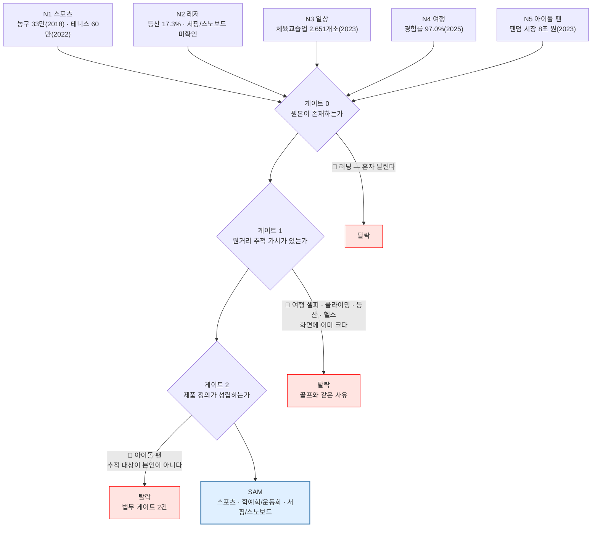
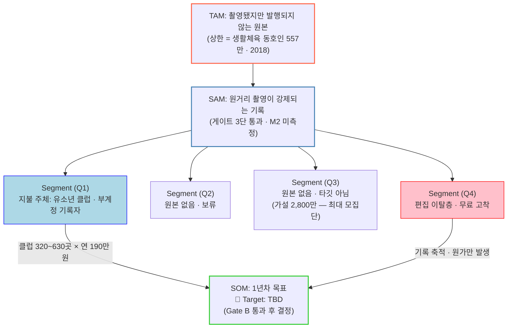

# 02 · TAM-SAM-SOM 니치별 산정

| 항목 | 내용 |
| --- | --- |
| **문서 성격** | 수치 문서 — 규칙은 `00_방법론`, 판정은 `01_게이트판정` |
| **작성** | 2026-09-02 |
| **적용 규칙** | `00` 2절 산정식 · 4절 표기 규칙 R1~R3 |

---

## 0. 🔴 먼저 — 이 문서가 낼 수 있는 것과 없는 것

`00` 2-1절에서 확인한 대로 **산정식의 변수 5개 중 3개가 미측정**이다.

| 낼 수 있는 것 | 낼 수 없는 것 |
| --- | --- |
| 🟢 니치별 **모집단** — 공표 통계 `[SOURCE]` | 🔴 **TAM 확정값** — 촬영 습관 보유율(M1)이 없다 |
| 🟢 **손익분기 역산 구조** — 몇 명·몇 클럽이 필요한가 | 🔴 **SAM 확정값** — 원거리 촬영 비율(M2)이 없다 |
| 🟢 **감도 구간** — 변수가 어디쯤이면 결론이 어떻게 갈리는가 | 🔴 **SOM 목표치** — 자체 전환율(M5)이 없다 |

> 🔴 **그래서 이 문서는 「시장이 얼마나 큰가」가 아니라 「어느 변수가 결론을 가르는가」를 낸다.**
> 부록D가 체육교습업 농구 비중을 5~20% 시나리오로 다룬 것과 같은 방식이고, 그 문서가 붙인 경고도 같이 승계한다 — **`[예시계산]`은 추정치가 아니다.**

---

## 1. TAM — 니치별 모집단

### 1-1. 확보한 모집단 `[SOURCE]`

| 니치 | 모집단 | 값 | 조사 연도 | 출처 |
| --- | --- | ---: | :---: | --- |
| **N1** | 생활체육 동호인 총계 | **557만 명** | 2018 | 국민생활체육조사 |
| **N1** | 체육 동호회 가입률 | **11.3%** | 2023 | 〃 |
| **N1** | 생활체육 참여율 | **49.5%** | 2024 | 〃 |
| **N1** | └ 농구 (상위 5위 밖, 6% 상한 가정) | **약 33만 명** | 2018 기준 | 부록A · 04 4차검증 |
| **N1** | └ 테니스 | **60만 명** | 2022 | 테니스피플 등 |
| **N1** | └ 동호회 종목 비율 | 축구/풋살 **22.9%** · 배드민턴 **12.3%** · 탁구 **10.5%** · 골프 **9.7%** · 테니스 **6.1%** | 2023 | 국민생활체육조사 |
| **N2** | 등산 참여율 | **17.3%** | 2023 | 〃 |
| **N2** | 걷기 참여율 | **37.2%** | 2023 | 〃 |
| **N2** | 보디빌딩 참여율 | **16.3%** | 2023 | 〃 |
| **N2** | 서핑 · 스노보드 · 클라이밍 | 🔴 **미확인 (M4)** | — | 상위 종목에 없음 |
| **N3** | 체육교습업 사업체 | **2,651개소** (+28.8%) | 2023 | 국가지표체계 |
| **N3** | 전체 체육시설업 | **64,378개소** (+6.16%) | 2023 | 〃 |
| **N4** | 국내여행 경험률 | **97.0%** | 2025 | 국민여행조사 |
| **N4** | 국내여행 횟수 · 지출 | **3.0억 회** · **39.5조 원** | 2025 | 〃 |
| **N5** | K팝 팬덤 시장 | **8조 원** | 2023 | 포브스코리아 |
| **N5** | 세계 한류 팬 | **2억 2,500만 명** | 2023 | 〃 |

### 1-2. 🔴 이 표를 인용하기 전에 알아야 할 결함 3개

| # | 결함 | 영향 |
| --- | --- | --- |
| **F1** | 🔴 **연도가 섞여 있다** — 모수는 **557만(2018)** 인데 종목 비율은 **2023**이다 | 파생값(예: 축구/풋살 인구)은 **7년 차 데이터의 곱**이다. R1 규칙이 이걸 잡으라고 있는 것 |
| **F2** | 🔴 **단위가 섞여 있다** — N1·N2는 **명**, N3는 **개소**, N4는 **회/원**, N5는 **원** | **니치 간 직접 비교가 불가능하다.** 같은 표에 있다고 같은 축이 아니다 |
| **F3** | 🔴 **중복이 제거되지 않았다** (M6) | 국내여행 경험률 97.0%는 N1·N2·N3 인구를 **거의 전부 포함**한다. 합산 금지(`00` 2-2절) |

> 🔺 **F1을 닫으려면 KOSIS 원자료에서 동일 연도 모수와 비율을 함께 받아야 한다**(확인 항목 4). 지금 표의 파생값은 방향을 보는 용도이지 규모를 확정하는 용도가 아니다.

### 1-3. TAM 산정 — 모집단에서 「버려지는 원본」으로

```
TAM(니치 n) = 니치 n 모집단 × 촬영 습관 보유율(M1) × 미발행률
```

| 항 | 상태 |
| --- | --- |
| 니치 모집단 | 🟢 `[SOURCE]` 1-1절 |
| **촬영 습관 보유율 (M1)** | 🔴 **Baseline: 미측정** |
| **미발행률** | 🟡 정성 근거만 — PRD §1-3 *"30분 초과 시 포기"* · 페르소나 이준혁 *"원본 47개 적재 / 3개월 업로드 2건"* |

> 🔴 **TAM은 지금 계산할 수 없다.** M1이 없기 때문이고, 이것이 이 폴더의 병목이다(`00` 5절).
>
> 🟢 **대신 상한은 알 수 있다.** 촬영 습관 보유율을 100%로 두면 TAM = 모집단이다. **N1 스포츠 TAM 상한 = 동호인 557만 명(2018)** 이고, 이것이 니치 확장 없이 도달 가능한 최대치다.

### 1-4. 🔴 PRD §2-1 모집단 가설과의 대조

PRD가 이미 제시한 사분면 모집단은 **농구 단일 종목 전제**다. 니치 확장 시 반드시 갱신해야 한다.

| 사분면 | PRD §2-1 값 | 성격 | 니치 확장 시 |
| --- | ---: | --- | --- |
| Q1 (원본 O · 지불의향 高) | 약 **50만 명** | `[HYPOTHESIS]` "가설" 표기 | 🔴 **재산정 필요** |
| Q2 (원본 X · 지불의향 高) | 약 **200만 명** | 〃 | 🔴 재산정 필요 |
| Q3 (원본 X · 지불의향 低) | 약 **2,800만 명** | 〃 | 🔴 재산정 필요 |
| Q4 (원본 O · 지불의향 低) | 약 **450만 명** | 〃 | 🔴 재산정 필요 |

🔺 **네 값 모두 PRD 본문에 "가설"로 명시돼 있다.** `[SOURCE]`가 아니라 `[HYPOTHESIS]`이며, 이 문서는 이 값을 확정값으로 승계하지 않는다.

---

## 2. SAM — 게이트 통과분

```
SAM(니치 n) = TAM(니치 n) × 원거리 촬영 강제 비율(M2)
```

### 2-1. 게이트 통과 니치만 남긴다

`01` 5절 판정에 따라 **N1 · N3(학예회·운동회) · N2(서핑·스노보드)** 만 SAM에 들어간다.

| 니치 | 게이트 종합 | SAM 포함 |
| --- | :---: | :---: |
| N1 스포츠 (농구·테니스) | 🟢 통과 | ✅ |
| N3 학예회·운동회·유소년 경기 | 🟢 통과 | ✅ |
| N2 서핑·스노보드 | 🟢 통과 | ✅ |
| N2 러닝·클라이밍·등산 / N4 여행 / N5 아이돌 팬 | 🚫 탈락 | ❌ |

> 🔴 **탈락분을 SAM에 넣지 않는다.** 넣으면 SAM이 커 보이지만, 그 인구에게 제품이 작동하지 않으므로 **SOM으로 가는 전환율이 0**이다. 큰 SAM은 자산이 아니라 착시다.

### 2-2. `[예시계산]` — M2 감도

🔴 **아래는 추정치가 아니라 계산 예시다.** M2가 어느 구간이면 결론이 어떻게 갈리는지만 본다.

**N1 농구 기준** (TAM 상한 = 33만 명, 촬영 습관 100% 가정)

| 원거리 촬영 강제 비율 (M2) | SAM | × 전환율 1~3% | 손익분기 유료 1~2만 명 |
| ---: | ---: | ---: | :---: |
| 30% | 9.9만 명 | 990 ~ 2,970명 | 🔴 미달 |
| 60% | 19.8만 명 | 1,980 ~ 5,940명 | 🔴 미달 |
| **100%** | **33만 명** | **3,300 ~ 9,900명** | 🔴 **미달** |

> 🔴 **M2를 100%로 둬도 농구 단독으로는 개인 구독 손익분기에 닿지 않는다.**
> 04 4차검증 3절이 이미 낸 결론과 같다 — *"국내 농구 동호인을 100% 획득해도 손익분기 하단에 겨우 닿습니다."* **니치를 늘려도 이 구조는 개인 구독 경로에서 바뀌지 않는다.**

🔴 **따라서 SOM은 개인 구독이 아니라 B2B에서 역산해야 한다**(4절). 이것은 이 문서의 판단이 아니라 04 4차검증 4절이 이미 내린 판정을 확인한 것이다.

---

## 3. 니치 × 사분면 교차 — 두 축은 직교한다

🔴 **니치 축(N1~N5)과 사분면 축(Q1~Q4)은 서로 다른 것을 가른다.** 하나로 합치면 안 된다.

| 축 | 무엇을 가르나 | 역할 |
| --- | --- | --- |
| **니치 (N)** | **제품이 작동하는가** — 원거리 촬영인가 | **SAM 분할축** |
| **사분면 (Q)** | **누가 돈을 내는가** — 원본 보유 × 지불의향 | **SOM 추출축** |

### 3-1. 교차표

| | **Q1** 원본O·지불高 | **Q2** 원본X·지불高 | **Q3** 원본X·지불低 | **Q4** 원본O·지불低 |
| --- | --- | --- | --- | --- |
| **N1 스포츠** | 🟢 **부계정 운영 기록자** — 1순위·가장 싼 획득 | ⚪ 촬영 습관 없음 | ⚪ | 🟢 **편집 이탈층** — 무료 고착·최대 시장 |
| **N3 학예회·운동회** | 🟢 **유소년 클럽 운영자**(사업체) — 🔴 **지불 주체** | ⚪ | ⚪ | 🟡 **학부모 개인** — 빈도 낮음(T7) |
| **N2 서핑·스노보드** | 🟡 **강습장·서핑샵** — 🔺 지불 주체 미확인 | ⚪ | ⚪ | 🟡 개인 — 계절 편중(T8) |
| ~~N4 여행~~ | 🚫 게이트 1 탈락 | 🚫 | 🚫 | 🚫 |
| ~~N5 아이돌 팬~~ | 🚫 게이트 2 탈락 | 🚫 | 🚫 | 🚫 |

> 🔴 **Q2·Q3 열이 통째로 비어 있는 것이 이 표의 요점이다.**
> PRD §2-1이 Q3를 **약 2,800만 명 가설** 로 잡았는데, **모집단이 가장 큰 칸이 아무 니치와도 만나지 않는다.** 원본이 없으면 니치가 무엇이든 제품이 작동하지 않기 때문이다(게이트 0).

### 3-2. 🔴 Q1과 Q4를 다르게 다뤄야 한다

| | **Q1** | **Q4** |
| --- | --- | --- |
| 역할 | **매출** | 🔴 **사업의 본체** (PRD §2-1) |
| 받는 값 | 편집 시간 회수 | **기록 축적** |
| 등급 | 구독·충전 | **무료 고착 — 의도된 결과** |
| 🔴 금지 | — | **페이월을 첫 완주 이전에 노출하지 않는다** — 🔺 **단 완주 경로는 수동 편집이다**(ADR-8 v1.9) |

> Q4는 원가를 만들지만 매출을 만들지 않는다. **그럼에도 무료 완주 경로를 남기는 것이 ADR-8의 설계**이고(SRS v1.9 근거 ④), Gate B 판정이 오염되지 않으려면 이 순서를 지켜야 한다.
>
> 🔴 **다만 v1.9에서 완주의 뜻이 바뀌었다.** 무료 등급은 **AI 추론을 쓰지 못하고 수동 편집으로 완주**한다. 즉 **Q4는 HILiT의 차별점(원거리 자동 추적)을 경험하지 않는다.**
>
> 🔺 **게이트 판정에 미치는 영향** — 게이트 1(원거리 추적 가치)은 **유료 등급에서만 실현되는 가치**를 재는 것이 된다. 니치 판정 자체는 바뀌지 않지만(*제품이 그 니치에서 작동하는가*를 묻는 것이므로), **Q4를 SOM 근거로 쓸 때 "무료 사용자는 자동 추적을 못 쓴다"를 함께 적어야 한다.**
>
> 🔴 **Gate A 판정 대상도 무료가 아니라 구독 등급이다**(SRS v1.9 ADR-8) — *"무료 등급은 탐지를 실행하지 않아 잴 대상이 없다."* **Gate B만 무료 등급으로 판정한다.**

---

## 4. SOM — 손익분기에서 역산한다

### 4-1. 기준값 `[SOURCE]`

04 4차검증 3·4절에서 그대로 가져온다.

```
손익분기 연매출          약 6 ~ 12억 원
  = 유료 1~2만 명 × ARPU 6만 원        ← 개인 구독 경로
  = 클럽 320 ~ 630곳 × 연 190만 원      ← B2B 경로 (Veo 실측 대입)
```

🔺 **2026-09-02 재계산으로 B2B 쪽 분모가 구간이 됐다**(`05` 3절). Veo 요금 구조를 확인한 결과 클럽당 연 매출이 **170~242만 원** 구간이며, 필요 클럽 수는 **약 250~700곳**이다.

| 클럽당 연 매출 | 근거 | 필요 클럽 |
| ---: | --- | ---: |
| 242만 원 | ARR ÷ **20,000 클럽**(공식) | **248 ~ 496곳** |
| **190만 원** | ARR ÷ 25,000 — 04 4차검증 채택값 | **316 ~ 632곳** |
| 170만 원 | Veo **Club 티어 구독만** | **353 ~ 706곳** |

🟢 **04 4차검증의 320~630곳은 이 구간의 중간이며 틀린 값이 아니다.** 다만 정밀하지도 않으므로, 인용할 때 **구간으로 옮긴다.**

### 4-2. 경로 A — 개인 구독 🔴 니치를 늘려도 닿지 않는다

| 필요 유료 | 전환율 1% | 전환율 3% |
| ---: | ---: | ---: |
| 1만 명 | MAU **100만** | MAU **33만** |
| 2만 명 | MAU **200만** | MAU **67만** |

**이것을 모집단 침투율로 바꿔 보면 경로 A가 왜 닫히는지 보인다.** `[예시계산]`

| 모집단 | 필요 MAU 33만 (유료 1만·전환율 3%) | 필요 MAU 200만 (유료 2만·전환율 1%) |
| --- | ---: | ---: |
| 전 종목 동호인 **557만**(2018) | 침투율 **5.9%** | 침투율 **36%** |
| 게이트 1 통과 종목만 (미확정) | 🔴 **557만보다 훨씬 작다** | 🔴 — |
| 농구 단독 **33만** | 침투율 **100%** | 🔴 **불가능** |

🔴 **557만은 「모든 종목 동호인 전체」이지 게이트 통과분이 아니다.** 축구·배드민턴·탁구가 상위 3종목인데 이들의 촬영 조건은 아직 판정하지 않았고, 골프(9.7%)는 이미 탈락했다. **분모로 쓸 수 있는 값이 아니다.**

> 🔴 **경로 A는 니치 확장으로 풀리지 않는다.**
> 🔺 게다가 전환율 1~3%는 직전 판 TAM의 값이고, **대조군 CapCut은 약 0.44%**(매출 역산 `추정치`)다. 1%도 낙관적일 수 있다. 자체 값은 **Baseline: 미측정**이다.

### 4-3. 경로 B — 클럽 B2B 🟢 여기서 N3 확장의 값이 나온다

부록D는 B2B 모집단을 **「체육교습업 중 농구」** 로 좁게 잡았다. T2 트리거가 거기 걸려 있었다.

**N3(학예회·운동회·유소년 경기)로 넓히면 그 제약이 풀린다.** 학예회와 운동회는 종목을 가리지 않기 때문이다.

🟢 **2026-09-02 확인으로 분모의 구조가 잡혔다**(`04` 1절). 체육교습업은 **법으로 8종목만 해당**한다 — 농구·축구·야구·빙상·롤러스케이트·배드민턴·수영·줄넘기 `[SOURCE]`.

| | 부록D (농구 한정) | **N3 확장 시** |
| --- | --- | --- |
| B2B 모집단 | 체육교습업 **2,651개소 × 농구 비중(M3)** | 체육교습업 **2,651개소 × 게이트 1 통과 종목 비중** |
| 농구 비중 10%일 때 | **265곳** → 🔴 필요 320곳 미달 | — |
| 🟢 **8종목 균등 배분 시 농구** | **331곳** → 🟢 필요 320곳 **통과** | — |
| 🟢 **게이트 1 명확 통과 4종**(농구·축구·야구·빙상) = **50%** `[예시계산]` | — | **1,326곳** → 🟢 필요 320~630곳 **초과** |
| 필요 침투율 | 🔴 농구 클럽의 **100%+** | 🟢 통과 클럽의 **24 ~ 48%** `[예시계산]` |

> ### 🟢 N3 확장의 진짜 값은 새 고객이 아니라 **B2B 모집단 제약을 푸는 것**이다
> 부록D가 *"결정적 결측 하나(체육교습업 중 농구 비중)로 판정이 갈린다"* 고 쓴 그 결측이, **N3로 넓히면 판정을 가르지 않게 된다.**
>
> 🔴 **다만 「체육교습업 전체」가 아니다.** 8종목 중 **줄넘기는 근접이라 탈락**하고, **수영은 수영모·고글로 얼굴이 가려져 재식별이 극히 어렵다.** 배드민턴·롤러스케이트는 조건부다. `04` 1-1절.
>
> 🔺 **부록D가 분모에 넣었던 태권도·발레는 애초에 체육교습업이 아니다** — 태권도는 **체육도장업**, 발레는 학원 소관이다. 분모가 좁아지므로 **농구 비중은 부록D 가정보다 높다**(`04` 1-2절).

> ### 🔴 그런데 이 경로 전체가 법무 게이트 위에 서 있다
> **체육교습업의 법적 정의가 「13세 미만 어린이」다** `[SOURCE]`. 예외가 없다.
>
> 아이별 기록을 아동·보호자 계정에 남기는 순간 🔴 **`MINOR_POLICY`(가입 플로우 전체 차단)** 가 걸리고, 그 모델이 바로 HILiT의 제품 정의다. **승인 전에는 이 경로의 매출이 0이다.**
>
> 🔴 **따라서 경로 B의 선행 조건은 M3가 아니라 M7(`MINOR_POLICY` 승인)이다.** 상세는 `04` 1-3절.

### 4-4. 1년차 SOM 목표

| | 값 |
| --- | --- |
| **1년차 SOM** | 🔴 **Target: TBD** |
| **결정 조건** | Gate B 통과 후 요금제 도입 (PRD ADR-04) · M5(자체 전환율) 실측 |
| **역산 구조** | 🟢 확보됨 — 클럽 **320~630곳** × 연 **190만 원** = 손익분기 |

🔴 **1년차 SOM에 숫자를 넣지 않는다.** CLAUDE.md가 유료 전환율을 **Baseline: 미측정**으로, 무료 등급 쿼터를 **`[TBD]` 전부**로 못 박았고, **요금제 도입 시점 자체가 Gate B 통과 후**다. 지금 SOM 수치를 만들면 그 결정을 앞당겨 오염시킨다.

---

## 5. 다이어그램

### 5-1. 게이트 깔때기 — 니치 5종이 어디서 걸리는가



**세 게이트가 서로 다른 니치를 떨어뜨린다.** 하나의 기준으로는 다섯 개를 가를 수 없다는 뜻이고, 게이트를 순서대로 둔 이유이기도 하다.

### 5-2. TAM → SAM → SOM — 참조 형식 적용



🔴 **Q3가 가장 큰 모집단인데 SOM으로 가는 화살표가 없다.** 참조 차트에서 Q2·Q3가 연결되지 않은 것과 같은 구조이며, HILiT에서는 **원본 부재**가 그 단절의 이유다.

---

## 6. 🔴 인용 금지 목록

이 문서에서 **바깥 문서로 옮기면 안 되는 값**이다. `00` 4절 R2·R3 위반이 되기 쉬운 지점만 모았다.

| 값 | 왜 금지인가 | 대신 쓸 것 |
| --- | --- | --- |
| 2-2절 SAM 표의 모든 숫자 | `[예시계산]` — M2 감도 예시다 | "M2 미측정이라 SAM 확정 불가" |
| 4-2절 침투율 표 (5.9% · 36% · 100%) | `[예시계산]` — 분모 557만이 게이트 통과분이 아니다 | "경로 A는 개인 구독으로 닫히지 않는다"는 방향만 |
| 4-3절 "통과 종목 40%", "1,060곳" | `[예시계산]` — 40%는 가정이다 | "M3 확인 후 산출" |
| 4-3절 필요 침투율 30~59% | 위 예시에서 파생 | 〃 |
| 1-1절 파생 인구 (종목 비율 × 557만) | 🔴 **F1 — 2018 모수 × 2023 비율** | 동일 연도 원자료 확보 후 |
| PRD §2-1 Q1~Q4 모집단 4건 | PRD 본문이 **"가설"** 로 명시 | `[HYPOTHESIS]` 표기를 함께 옮길 것 |

🟢 **인용해도 되는 것** — 1-1절 `[SOURCE]` 원값(연도 병기), 4-1절 손익분기 기준값, 4-2절 필요 MAU 역산.

---

## 7. 갱신 조건

`00` 5절 미결 원장의 값이 닫히면 **이 문서의 어느 절이 바뀌는지**를 미리 못 박는다.

| 닫히는 값 | 갱신 대상 | 결론이 바뀔 수 있는가 |
| --- | --- | :---: |
| **M1** 촬영 습관 보유율 | 1-3절 TAM | 🔴 **예 — TAM 전체** |
| **M2** 원거리 촬영 비율 | 2-2절 SAM · 게이트 1 정량화 | 🔴 **예 — SAM 전체** |
| **M3** 게이트 1 통과 종목 비중 | 4-3절 경로 B | 🔴 **예 — 손익분기 도달 여부** |
| **M4** 서핑·스노보드 참여 인구 | 1-1절 N2 · `01` 7-2절 매트릭스 | 🟡 확장 순서 4번 |
| **M5** 자체 전환율 | 4-2절 · 4-4절 SOM | 🔴 **예 — SOM 전체** |
| **M6** 니치 간 중복률 | 1-2절 F3 · 합계 산출 가능 여부 | 🟡 표기만 |
| 동일 연도 원자료 | 1-2절 F1 | 🟡 파생값 신뢰도 |

> 🟢 **M3가 가장 값싸면서 가장 크게 바꾼다.** PDF 한 건 조회로 4-3절의 손익분기 도달 여부가 갈린다.

---

*이 문서의 `[SOURCE]` 값은 전부 조사 연도를 병기했다(R1). 2-2절·4-3절의 계산은 `[예시계산]`이며 추정치가 아니다(R2). 1-1절 표는 니치별 단위가 다르므로 가로로 비교하면 안 된다(F2). SOM 1년차 목표는 의도적으로 비워 두었다 — Gate B 이전에 채우면 PRD ADR-04의 결정 순서를 앞당기게 된다.*
