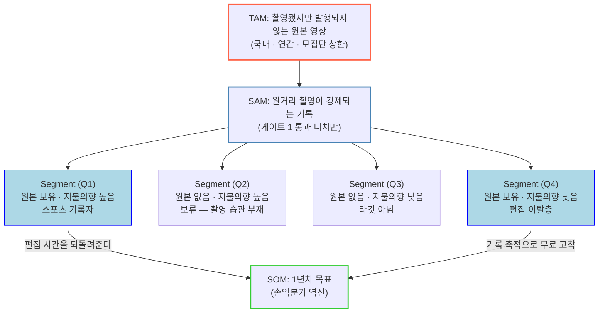

# 4단계 · TAM-SAM-SOM + Market Segment

| 항목 | 내용 |
| --- | --- |
| **분석 단계** | 1-Five-Forces → 2-Value-Chain → 3-KSFs → **4-TAM-SAM-SOM** → 5-Persona |
| **판** | **v1.0 — 니치 축 재분할판** (2026-09-02) |
| **직전 판** | Notion `TAM-deep-research` · `tam-sam-som-segment-sns-shortform` — 🔴 **저장소에 실물이 없다** |
| **대상 제품** | `hilit-prd-v2_0.md` — 40분 원본에서 *내가 주인공인 15초*를 만들고, 올리지 않아도 남기는 앱 |
| **개정 사유** | 고객군을 **스포츠 · 레저 · 일상 · 여행 · 아이돌 팬** 5개 니치로 확장하기로 결정 |

---

## 0. 이 개정이 무엇을 바꿨나

### 0-1. 세그먼트 축을 갈아끼웠다

직전 판의 S1~S4는 **창작자 유형**(개인 크리에이터 50% · 중소기업 25% · 대행사 15% · 교육·언론 10%)으로 갈려 있었다. 이 축은 니치 축과 **교차하지 않는다** — "스포츠를 찍는 개인 크리에이터"와 "여행을 찍는 개인 크리에이터"가 같은 칸에 들어가는데, 이 둘은 **제품이 작동하는지 여부가 갈린다.**

그래서 축을 바꾼다.

| | 직전 판 | **이 판** |
| --- | --- | --- |
| 분할축 | 창작자 유형 (S1~S5) | **촬영 대상 니치 (N1~N5)** |
| TAM 정의 | 숏폼 **편집 도구** 시장 | **버려지는 원본 영상** |
| 판정 기준 | 시장 비중 | **Kill Criteria 게이트**(부록B 승계) |

🔴 **축을 바꿔도 S1~S5를 버리지 않는다.** 페르소나 14인 · AOS-DOS 매트릭스 · JTBD 인터뷰 문항이 전부 S 코드에 묶여 있다. 대조표는 `03_대조표_구S1~S5-신N1~N5.md`에 있다.

### 0-2. TAM 정의가 제품 정의를 따라가지 못하고 있었다

직전 판은 TAM을 **숏폼 편집 도구 시장**으로 잡았다. 그런데 PRD v2.0은 제품을 **기록 공간**으로 정의하고, 편집은 수단이라고 못 박았다. **TAM이 경쟁사 시장을 재고 있었던 것이다.**

이 판은 TAM을 **"촬영됐지만 발행되지 않고 버려지는 원본 영상"** 으로 다시 잡는다. HILiT가 회수하려는 것이 바로 그것이고, PRD §1-3이 이탈 지점으로 지목한 것도 같다.

---

## 1. 4단계 구조 — 한 장

**Q2·Q3에서 SOM으로 가는 화살표가 없는 것이 이 그림의 요점이다.** 모집단이 가장 큰 Q3(2,800만 명 가설)가 아무 데도 연결되지 않는다. PRD §2-1이 이미 정한 것을 그대로 옮겼다.

---

## 2. 문서 구성

| 문서 | 역할 | 이걸 먼저 읽어야 하는 경우 |
| --- | --- | --- |
| [`00_방법론_산정규칙-판정절차.md`](./00_방법론_산정규칙-판정절차.md) | 산정식 · 판정 절차 · 숫자 표기 규칙 · **미결 숫자 원장** | 숫자의 신뢰도를 따질 때 |
| [`01_니치-세그먼트_정의와-게이트판정.md`](./01_니치-세그먼트_정의와-게이트판정.md) | 🔴 **핵심.** N1~N5 정의와 Kill Criteria 판정 | **어느 니치에 들어갈지 정할 때** |
| [`02_TAM-SAM-SOM_니치별-산정.md`](./02_TAM-SAM-SOM_니치별-산정.md) | 3단 수치 · 니치 × Q사분면 교차 · 손익분기 역산 | 규모를 인용할 때 |
| [`03_대조표_구S1~S5-신N1~N5.md`](./03_대조표_구S1~S5-신N1~N5.md) | 페르소나 · AOS-DOS · JTBD 연결 보존 | 기존 문서를 고칠 때 |
| [`04_확인결과_체육교습업-법령-N1내부종목.md`](./04_확인결과_체육교습업-법령-N1내부종목.md) 🆕 | **조사 기록** — 체육교습업 법정 8종목 · 축구/풋살·배드민턴·탁구 판정 · 🔴 **법무 리스크 발견** | 부록D를 인용하기 전에 |
| [`05_확인결과_Veo-클럽당매출-손익분기재계산.md`](./05_확인결과_Veo-클럽당매출-손익분기재계산.md) 🆕 | **조사 기록** — Veo 요금 구조 · 필요 클럽 수 재계산 · 🔴 **Gate A 데이터셋 조건 발견** | 손익분기·필요 클럽 수를 인용할 때 |

---

## 3. 결론 먼저 — 게이트 판정 요약

판정 절차는 `부록B`에서 승계했고, **게이트 0은 이번에 신설**했다(`01` 1절).

| 니치 · 상황 | 게이트 0 원본 존재 | 게이트 1 원거리 추적 가치 | 게이트 2 제품 정의 | 판정 |
| --- | :---: | :---: | :---: | --- |
| **N1 스포츠** (농구·테니스) | ✅ | ✅ **최상** | ✅ | 🟢 **통과 — 확정 진입** (부록B 승계) |
| **N3 학예회·운동회·유소년 경기** | ✅ **최상** | ✅ **최상** | ✅ **최상** | 🟢 **통과 — 🆕 확장 3순위 권고** |
| **N2 서핑 · 스노보드** | ✅ | ✅ **최상** | ✅ | 🟢 **통과 — 확장 4순위 (조건부)** |
| N2 러닝 | 🚫 **혼자 달린다** | ✅ | — | 🚫 **탈락 — 게이트 0** |
| N2 클라이밍 · 등산 · 헬스 | ✅ | 🚫 화면에 이미 크다 | — | 🚫 탈락 — 게이트 1 |
| N3 놀이터 | ✅ | 🟡 중간 | ✅ | 🟡 조건부 |
| N3 실내 가족 행사 | ✅ | 🚫 화면 가득 | — | 🚫 탈락 — 게이트 1 |
| N4 여행 | ✅ | 🚫 **추적할 것이 없다** | — | 🚫 **탈락 — 골프와 같은 사유** |
| N5 아이돌 팬 | ✅ **최상** | ✅ **최상** | 🚫 **불성립** | 🚫 **탈락 — 게이트 2 · 법무 게이트 2건** |

**5개 니치 중 통째로 통과하거나 통째로 탈락한 것은 하나도 없다.** N2는 서핑·스노보드만, N3는 학예회·운동회만 통과한다.

> ### 🔴 이번 분석의 핵심 발견 세 가지
>
> **① 게이트는 니치에 걸리지 않는다. 촬영 상황에 걸린다.** (`01` 6-1절)
> "여행"이 통째로 탈락하는 게 아니라 **셀피·풍경 촬영**이 탈락하는 것이고, 같은 여행 안의 **서핑·패러글라이딩은 통과**한다. 🔴 **따라서 니치를 그대로 세그먼트로 쓰면 안 된다** — 니치는 마케팅 진입 언어로 쓰고, 제품이 작동하는 단위는 **"원거리 촬영이 강제되는 상황"** 으로 잡는다. 이것을 어기면 *"여행 영상도 됩니다"* 라고 광고하고 셀피를 받게 된다.
>
> **② 게이트가 하나 부족했다.** (`01` 1절)
> 부록B의 게이트는 농구·골프·테니스를 가르려고 만들어져서 **"촬영 문화가 이미 있다"를 전제**하고 있었다. 니치를 스포츠 밖으로 넓히면 그 전제가 깨진다. **게이트 0(원본이 존재하는가)** 을 신설했고 곧바로 **러닝이 걸렸다** — 개인 성장 지표가 5개 니치 중 최상인데도, 혼자 달리는 사람은 자기를 찍지 않는다.
>
> **③ D4가 N3에서 경쟁 우위로 바뀐다.** (`01` 4-1절 · `03` 5절)
> 학예회 영상에는 남의 아이가 대량으로 찍힌다. 공개 전제 편집앱에서는 **올릴 수 없어 제품이 쓸모없어지는** 조건인데, HILiT는 `private`이 DB `DEFAULT`다 — **안 올려도 남으므로 그대로 작동한다.** CLAUDE.md 절대 규칙 1이 여기서 방어가 아니라 무기가 된다.

### 3-1. 🔴 규모가 큰 니치일수록 탈락했다

| 니치 | 모집단 규모 | 판정 |
| --- | --- | :---: |
| N4 여행 | 🟢🟢 **경험률 97.0%** — 사실상 전 국민 | 🚫 탈락 |
| N5 아이돌 팬 | 🟢🟢 **팬덤 시장 8조 원** | 🚫 탈락 |
| N1 스포츠 (농구) | 🔴 **상한 33만** | ✅ 확정 진입 |

> 부록A 5절이 이미 같은 구조를 지적했다 — *"규모와 경쟁 공백은 같은 변수의 앞뒷면"* 이다. 이번에는 **규모와 게이트 통과가 앞뒷면**으로 나왔다. **큰 시장은 근접 촬영이 쉬운 시장이고, 근접 촬영에서 HILiT는 차별점이 없다.**

### 3-2. ✅ N1 안도 마저 채웠다 (2026-09-02 확인)

부록A·B는 **농구 · 골프 · 테니스** 세 종목만 비교했다. 동호회 가입 최대 종목은 그 셋이 아니어서 판정을 마저 돌렸다 — 결과는 [`04`](./04_확인결과_체육교습업-법령-N1내부종목.md) 2절.

| 종목 | 동호회 비율(2023) | 농구 대비 | 판정 |
| --- | ---: | ---: | --- |
| **축구 · 풋살** | **22.9%** | 🔴 **약 4배** | 🟢 게이트 통과 — 🔴 **단 Veo가 축구 전용으로 20,000+ 클럽 선점** |
| 배드민턴 | 12.3% | 약 2배 | 🟡 보류 — M2 실측 후 |
| 탁구 | 10.5% | 약 2배 | 🚫 탈락 — 탁구대 2.74×1.525 m |
| **농구** (확정 진입) | 6% 미만 | — | ✅ 통과 |

> 🔴 **부록A 5절의 명제가 세 번째로 확인됐다** — *"규모가 큰 이유 = 경쟁이 들어온 이유."* 골프엔 앱 80개, 테니스엔 SwingVision, **축구엔 Veo**, 농구엔 아무도 없다. 축구/풋살은 게이트 1에서 농구보다 나은데도 **6축 합계는 3.05 : 3.15로 뒤진다.**
>
> **확장 순서는 바뀌지 않았다.** 넓힐 곳이 늘지 않았다는 것을 확인한 값이다.

### 3-3. 🔴 그리고 법무 리스크가 하나 나왔다

체육교습업의 **법적 정의가 「13세 미만 어린이」** 다 `[SOURCE]`. 예외가 없다.

> 04 4차검증이 **「유일한 손익분기 경로」** 로 지목한 클럽 B2B가, **정의상 피촬영자 전원이 미성년**이다.
> 아이별 기록을 아동·보호자 계정에 남기는 순간 🔴 **`MINOR_POLICY`(가입 플로우 전체 차단)** 가 걸리는데, **그 모델이 바로 HILiT의 제품 정의**다.
>
> 🔴 **B2B 경로의 선행 조건은 모집단 크기(M3)가 아니라 `MINOR_POLICY` 승인(M7)이다.** 부록D는 이 조건을 보지 않았다. 상세 `04` 1-3절.

### 3-4. 🟢 손익분기 경로가 숫자로 잡혔다 (2026-09-02 확인)

Veo 요금 구조를 확인해 **필요 클럽 수를 재계산**했다 — [`05`](./05_확인결과_Veo-클럽당매출-손익분기재계산.md).

| 진입 범위 | 클럽 수 `[예시계산]` | 필요 250곳 | 필요 700곳 |
| --- | ---: | :---: | :---: |
| **농구 단독** | **331곳** | 🟡 침투율 **76%** | 🔴 **불가능** |
| **게이트 1 통과 4종**(농구·축구·야구·빙상) | **1,326곳** | 🟢 **19%** | 🟢 **53%** |

> 🟢 **`01` 7-1절의 N3 권고가 정성 판단에서 산술로 바뀌었다.** 농구 단독 클럽으로는 손익분기가 위태롭고, 게이트 통과 4종으로 넓혀야 침투율이 현실 구간에 들어온다.
>
> 🟢 **그리고 "장비를 팔지 않는다"가 우위로 드러났다.** Veo는 카메라 199~260만 원이 별도라 클럽 1년차 부담이 **350~450만 원**인데, HILiT는 하드웨어가 0이라 **약 190만 원**이다. 유소년 클럽 매출 대비 부담률이 **4.9~6.3% vs 2.6%** — A-T2(앱이 촬영하지 않는다)라는 기술 제약이 가격 우위로 바뀐다.

### 3-5. 🟢 지금 남은 값싼 확인 3건

| # | 할 일 | 닫히는 것 | 비용 |
| --- | --- | --- | :---: |
| **1** | 🔴 **`MINOR_POLICY` 승인 일정 확인** | **M7** — B2B 매출 개시 시점 전체 | 🟡 법무 |
| **2** | 🆕 **Gate A 평가 데이터셋에 촬영 기기 조건 명시** — *"삼각대 고정 스마트폰"* | 🔴 **Gate A 판정의 유효성 자체** (`05` 4-3절) | 🟢 PRD 한 줄 |
| **3** | 문체부 문의(044-203-3150) — **체육교습업 종목별 개소 수** | **M3 나머지 절반** | 🟢 전화 1통 |

🔴 **1번이 여전히 앞선다.** 문이 안 열리면 모집단 크기는 의미가 없다.

🔴 **2번이 이번에 새로 올라왔고, 성격이 다르다.** HILiT가 받는 원본은 Veo의 듀얼 4K 파노라마가 아니라 **삼각대에 올린 스마트폰**이다. 전용 카메라 영상으로 Gate A 85%를 넘겨도 **실제 입력이 스마트폰이면 그 값은 판정 근거가 아니다.** PRD §8-2 E1에 촬영 기기 조건이 지금 없다.

---

## 4. 숫자 신뢰등급 — 이 폴더 공통 범례

CLAUDE.md 「숫자를 다루는 규칙」을 그대로 따른다.

| 표기 | 뜻 | 인용해도 되는가 |
| --- | --- | --- |
| `[SOURCE]` | 외부 공표 통계 또는 상위 문서에 있는 값. **출처 링크 필수** | 🟢 가능 |
| `[HYPOTHESIS]` | 정성 판단을 정량으로 옮긴 값 | 🟡 가설로 명시하면 가능 |
| `[예시계산]` | 미지 변수의 감도를 보이기 위한 **계산 예시.** 추정치가 아니다 | 🔴 **단독 인용 금지** |
| **Baseline: 미측정** | 기준선 자체가 없음 | 🔴 인용 금지 |
| **Target: TBD** | 목표 미정 | 🔴 인용 금지 |

🔴 **`[예시계산]`을 추정치로 인용하는 것이 이 폴더에서 가장 하기 쉬운 실수다.** 부록D가 체육교습업 농구 비중 5~20% 시나리오에 붙인 경고와 같다 — *"계산 예시이지 추정치가 아닙니다."*

---

## 5. 판본 이력

| 판 | 날짜 | 변경 |
| --- | --- | --- |
| **v1.2** | 2026-09-02 | 🆕 `05` 조사 기록 추가 — Veo 요금 구조 확인 · **필요 클럽 수 250~700곳으로 구간화** · N3 권고에 산술 근거 확보 · 🔴 **Gate A 데이터셋 촬영 기기 조건 발견** · 부록D 부담률 정정 |
| **v1.1** | 2026-09-02 | 🆕 `04` 조사 기록 추가 — 체육교습업 **법정 8종목** 확인(M3 절반 해소) · 축구/풋살·배드민턴·탁구 판정 · 🔴 **`MINOR_POLICY` 리스크 발견(M7 신설)** · 부록D 전제 오류 1건 정정 |
| **v1.0** | 2026-09-02 | 니치 축(N1~N5) 재분할 · TAM 정의를 「버려지는 원본 영상」으로 변경 · Kill Criteria 게이트를 니치 판정에 승계 · **게이트 0 신설** · 구 S1~S5 대조표 신설 |
| v0 (Notion) | — | 창작자 유형 S1~S4 · 숏폼 편집 도구 시장 TAM. 🔴 **실물이 저장소에 없어 재현 불가** |

---

## 6. 상위 문서와의 연결

| 문서 | 이 폴더가 받은 것 | 이 폴더가 돌려주는 것 |
| --- | --- | --- |
| `hilit-prd-v2_0.md` §2-1 | Q1~Q4 사분면 · 모집단 가설 4건 | 🔴 **니치 확장 시 §2-1 갱신 필요** |
| `페르소나 스펙트럼/부록A·B` | 6축 평가 · Kill Criteria 게이트 · 되돌림 비용 절차 | 니치 5종으로 확대 적용한 결과 |
| `페르소나 스펙트럼/부록D` | 손익분기 · B2B 모집단 · 지불 주체 판정 | 니치별 지불 주체 재판정 |
| `시장기회분석/01_AOS-DOS` | Market Relevance 배분 | 🔴 **배분 근거가 구 TAM 비중이라 재계산 필요** |
| `docs/grill/GRILL_LEDGER.md` | — | 미결 숫자 6건 (`00` 문서 5절) |
