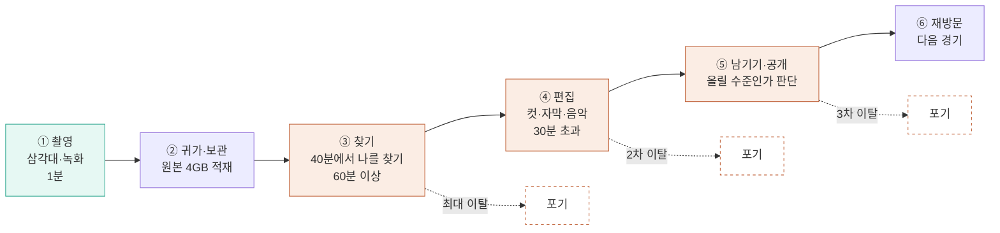
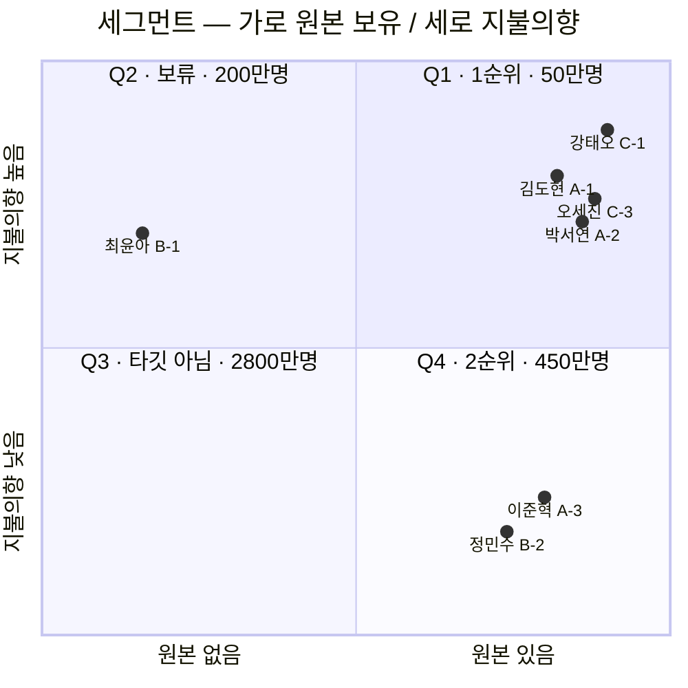
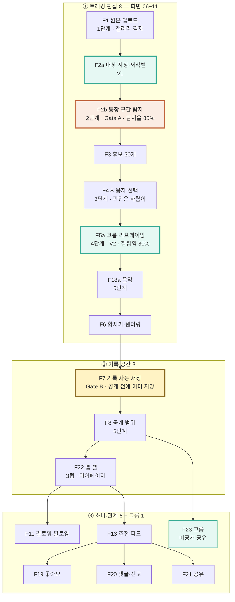
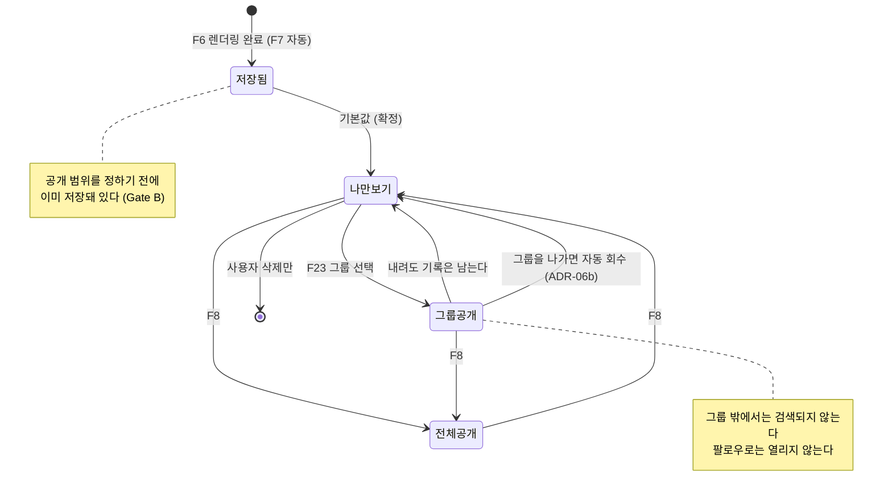
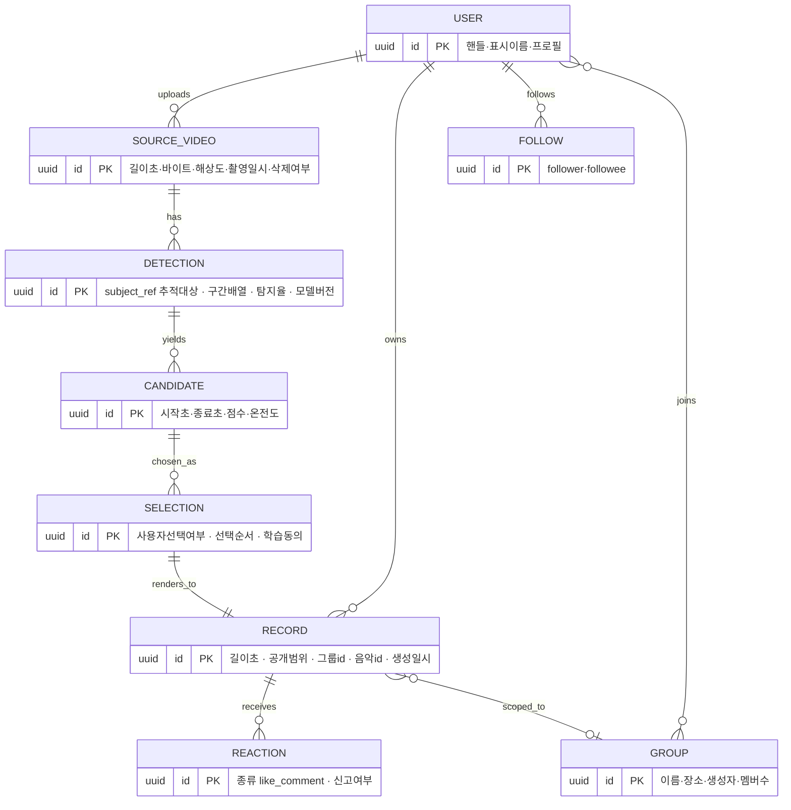
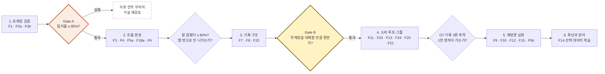

# HILiT PRD v1.0 (팀 초안)

HILiT_project v1.0 · Product Requirements Document

# 40분 원본에서 *내가 주인공인 15초*를 만들고, 올리지 않아도 남기는 앱을 만든다

이 문서는 무엇을 만들지, 무엇을 만들지 않을지, 그리고 그것이 잘 됐는지를
어떤 숫자로 판정할지를 정한 개발 착수 기준 문서다.

00 · How to read

## 이 문서를 읽기 전에

##### 숫자 읽는 법 — 확정과 초안을 섞지 않는다

| 표기 | 뜻 |
| --- | --- |
| 확정 | VPS 0.3에서 **확정**한 값. 그대로 옮겼다 |
| 가설 | VPS 0.3이 **1년차 가설·추정**으로 명시한 값. 실측치가 아니다 |
| 초안 | **이 PRD가 새로 제안하는 초안**. VPS에 근거가 없다. 착수 전 팀 합의가 필요하다 |

NFR(5장)·데이터/API(6장)의 수치는 **대부분 초안**다. VPS는 제품 가치를 다루고 시스템 사양은 다루지 않았다. 초안을 확정처럼 말하지 않기 위해 표기를 분리했다.

01 · Overview & Goal

## 개요·목표

### 1-1. 한 문장

**40분 원본에서 나를 끝까지 추적해 15초 하이라이트를 만들고, 올리지 않아도 내 기록으로 남긴다.** 확정

앱은 촬영하지 않는다. 이미 찍어둔 긴 영상을 받아 ①내 구간을 찾고 ②나를 화면 주인공으로 다시 잡고 ③공개와 무관하게 보관한다.

### 1-2. 문제 정의 — Pain과 실패 KPI

선별 페르소나 6명에게 공통으로 나타난 Pain 3가지다. **실패 KPI**는 "지금 얼마나 실패하고 있는가"를 수치로 적은 것이다.

| # | Pain | 근본 원인 | 해당 | 실패 KPI (현재) |
| --- | --- | --- | --- | --- |
| **P1** | 원본에서 자기 장면을 찾는 시간이 편집보다 오래 걸린다 | 고정 카메라는 경기를 담지만 **누가 어디에 있었는지는 기록하지 않는다** | **6/6** 확정 | 원본 1편당 탐색 **60분 이상** 확정 · 원본→완성 전환율 **약 4%**(원본 47편 → 업로드 2건) 확정 |
| **P2** | 고정 카메라는 사람을 따라오지 않아 화면에 작게 잡힌다 | P1과 **원인이 동일**하다 | 3/6 확정 | 재촬영 **1~3회/결과물** 확정 · "잘 잡혔다" 평가 **측정 불가**(재촬영으로 대응) 확정 |
| **P3** | 공개할 자신이 없으면 기록도 남지 않는다 | 기존 SNS는 **올려야 남는** 구조다 | 3/6 확정 | 비공개 기록 비율 **0%** 확정 · 월 기록 생성 **0.7건** 확정 · 편집 외주 **월 60만 원**(강태오) 가설 |

**P1과 P2의 원인은 하나다.** 고정 카메라가 사람의 위치를 모른다는 사실이 두 문제를 동시에 만들었다. 그래서 **사용자 트래킹 하나(F2a·F2b·F5a)가 P1과 P2를 함께 없앤다** — 이것이 F2b를 최우선 검증 대상으로 삼는 근거다. 확정

### 1-3. 이탈 지점 — 문제는 촬영이 아니라 그 다음에 있다

가설의 표현을 "편집이 어려워서 못 올린다"에서 **"촬영 이후에 발생하는 시간·기술·반복 작업의 부담"**으로 바꿔야 한다. 앞의 표현은 직접 조사 데이터가 없어 반박당하고, 뒤의 표현은 서로 다른 조사 여러 건에서 반복 확인된다. 확정

### 1-4. 목표 — Desired Outcome 수치화

Outcome은 기능이 아니라 **고객이 도달하려는 상태**다. 목표값은 전부 **1년차 가설**이며 실측치가 아니다. 가설 **측정 경로**는 "이 숫자를 어느 이벤트에서, 어떤 산식으로 뽑는가"다 — 전부 초안 신규 정의이며 계측 착수 전 데이터팀 확인이 필요하다.

| # | 도달 상태 | 지표 | 기준선 | 1년차 목표 가설 | **측정 경로 (이벤트 · 산식)** 초안 | 검증 |
| --- | --- | --- | --- | --- | --- | --- |
| **O1** | 내 장면을 찾는 데 시간을 쓰지 않는다 | 탐색 소요 시간 | 60분+ | **≤ 5분**(중앙값) | `detection_started` → `selection_opened` 구간 합. 앱 백그라운드 시간 제외 | **E4** |
| **O2** | 찍은 영상이 완성으로 이어진다 | 원본→완성 전환율 | 약 4% | **≥ 60%** | `render_succeeded` 고유 `source_video_id` ÷ `upload_completed` 고유 건수 · 30일 코호트 | **E5** |
| **O3** | 화면에서 알아볼 수 있게 잡힌다 | "잘 잡혔다" 비율 | **베타 1주차 실측으로 확정** 초안 | **≥ 80%** | 렌더 직후 **5점 척도 1문항**, `reframe_rating` **4점 이상 ÷ 전체 응답**. 응답률 < 30%면 무효 처리 | **E3** |
| **O4** | 원본을 지울 수 있다 | 원본 삭제 실행률 | 0% | **≥ 50%** | `source_deleted` ÷ `render_succeeded` (F9 노출 사용자 한정) | E5 파생 |
| **O5** | 공개와 무관하게 기록이 쌓인다 | 비공개 기록 비율 | 0% | **≥ 30%** | `RECORD.visibility='private'` ÷ 전체 RECORD · 월말 스냅샷 | **E6** |
| **O6** | 기록이 끊기지 않는다 | 월간 기록 생성 편수 | 0.7건 | **4건** | 월간 `render_succeeded` ÷ MAU | E8 |
| **O7** | 다음 경기에도 돌아온다 | **기록 3편 이상 보유 사용자 수** | 0명 | **10,000명** | `RECORD` 보유 ≥ 3인 **순 user_id**, **월말 스냅샷**(누적 아님) | **E8** |
| **O8** | 편집을 남에게 맡기지 않아도 된다 | 편집 외주 지출 | 월 60만 원 가설 | **0원** | **분기 설문 n≥30** 초안 — 로그로 잡히지 않는 유일한 지표 | 설문 |
| **O9** | 놓치지 않고 추적된다 | 등장 구간 탐지율 | **정답셋 구축 시 확정** 초안 | **≥ 85%** | 정답 구간과 모델 출력의 **IoU ≥ 0.5**를 정탐으로 보고 `정탐 ÷ 정답 총 구간`. 모델 버전 태깅 필수 | **E1 · Gate A** |
| **O10** | 같은 동작을 다시 찍지 않는다 | 재촬영 횟수 | 1~3회 | **0회** | 동일 `session_id` 내 `upload_completed` 2건 이상 발생률 + E3 재촬영 의향 문항 | **E3** |

**O3·O9의 기준선은 지금 "없음"이 맞다.** 없는 숫자를 지어내는 대신 **언제 무엇으로 확정할지**를 적었다 — O3는 베타 1주차 실측, O9는 정답셋 구축 시점. 초안

### 1-5. 성공 지표 — 북극성 KPI와 보조 KPI

**북극성 KPI**

| KPI | 정의 | 기준선 | 1년차 목표 | 측정 주기 | **측정 경로** 초안 | **판정 주체** 초안 |
| --- | --- | --- | --- | --- | --- | --- |
| **O7 · 기록 3편 이상 보유 사용자 수** | 개인 기록 저장소에 결과물 3편 이상을 보유한 **순 사용자** | 0명 | **10,000명** 가설 | 주간 추이 · **월말 판정** | `SELECT COUNT(DISTINCT user_id) FROM record GROUP BY user_id HAVING COUNT(*)>=3` · **월말 23:59 스냅샷** | 제품 리드 (월간 리뷰) |

**왜 설치 수가 아니라 축적 사용자인가.** 설치는 마케팅으로 만들 수 있지만 기록 3편은 제품이 실제로 작동해야 쌓인다. 확정

**스냅샷이지 누적이 아니다** 초안 — 기록을 지워 3편 아래로 내려간 사용자는 그 달 집계에서 빠진다. 이탈을 성공으로 세지 않기 위해서다.

처리 물량 **연 약 12만 편**(1만 명 × 월 1편)이 붙고, 이 숫자는 GPU 원가에 직접 비례한다. 확정

**보조 KPI**

| # | KPI | 기준선 | 목표 가설 | 주기 | **측정 경로** 초안 | **판정 주체** 초안 | 게이트 |
| --- | --- | --- | --- | --- | --- | --- | --- |
| S1 | 등장 구간 탐지율 (O9) | 정답셋 구축 시 확정 | ≥ 85% | 릴리스마다 + 주간 | 정답셋 회귀 배치 · 모델 버전별 | **AI 리드** | **Gate A** |
| S2 | "잘 잡혔다" 비율 (O3) | 베타 1주차 확정 | ≥ 80% | 주간 | `reframe_rating` 4점↑ 비율 · 응답률 동시 보고 | AI 리드 | Gate A 이후 |
| S3 | 원본→완성 전환율 (O2) | 4% | ≥ 60% | 주간 | 30일 코호트 · 이탈 단계 분해 동시 보고 | 제품 리드 | 흐름 완성 |
| S4 | 탐색 소요 시간 (O1) | 60분+ | ≤ 5분 | 주간 | 이벤트 구간 중앙값 · p90 병기 | 제품 리드 | Gate A |
| S5 | 비공개 기록 비율 (O5) | 0% | ≥ 30% | 월간 | 월말 스냅샷 | 제품 리드 | **Gate B** |
| S6 | 월간 기록 생성 편수 (O6) | 0.7건 | 4건 | 월간 | `render_succeeded` ÷ MAU | 제품 리드 | Gate B |
| S7 | 원본 삭제 실행률 (O4) | 0% | ≥ 50% | 월간 | F9 노출 사용자 한정 | 제품 리드 | P1(F9) 이후 |
| S8 | 재촬영 횟수 (O10) | 1~3회 | 0회 | 월간 | 세션 내 중복 업로드율 | AI 리드 | Gate A 이후 |
| S9 | 편집 외주 지출 (O8) | 월 60만 원 가설 | 0원 | 분기 | **설문 n≥30** — 로그 측정 불가 명시 | 제품 리드 | — |
| **S10** 초안 | **파이프라인 완주율** | — | **≥ 95%** | 주간 | `render_succeeded` ÷ `detection_started` — **실패 AC들의 상위 지표** | 백엔드 리드 | 전 구간 |

### 1-6. 차별 가치 — 기존 대안 대비 수치 비교

각 비교는 **어떤 조건에서 잰 값인지**를 함께 적어야 반박에 견딘다. 조건·표본은 전부 초안 제안이다.

| 축 | 기존 대안 | HILiT 목표 | 개선폭 | **측정 조건 (동일 조건 비교)** 초안 | **검증** |
| --- | --- | --- | --- | --- | --- |
| **탐색 시간** | 사람 눈으로 60분+ 확정 | **≤ 5분** 가설 | **12배 ↓** | 동일 사용자 **n=30명** × 자기 원본 3편 · within-subject 전후 비교 · 중앙값 | **E4** |
| **원본→완성 전환율** | 약 4% 확정 | **≥ 60%** 가설 | **15배 ↑** | 베타 **30일 코호트** · 분모는 업로드 완료 원본 | **E5** |
| **편집 외주 비용** | 월 60만 원 가설 | **0원** 가설 | **100% ↓** | 분기 설문 **n≥30** · 자기보고 — *로그 검증 불가를 명시* | 설문 |
| **재촬영 횟수** | 1~3회 확정 | **0회** 가설 | **100% ↓** | 세션 내 중복 업로드율 + 주관 의향 문항 **n=50명** | **E3** |
| **추적 대상** | AlphaCut·Filmora·Vrew = **화자만** 확정 | 말하지 않고 움직이는 사람 | **탐지율 ≥ 2배** 초안 | **동일 원본 n=100편**을 양쪽에 투입 · 동일 정답셋 · IoU ≥ 0.5 | **E2** |
| **하드웨어 전제** | Veo·Pixellot·Hudl = 전용 카메라·팀 계약 확정 | 휴대폰 영상만 | **초기 비용 0원** | 공개 가격표 기준 정성 비교 — *실험 대상 아님* | — |

**`12배 ↓`는 동일 사용자가 같은 원본을 두 방식으로 처리했을 때의 중앙값 비교**다. 조건을 밝히지 않은 배수는 근거가 아니라 구호다. 초안

02 · Users & Personas

## 사용자와 페르소나

### 2-1. 세그먼트 — Q1으로 들어가 Q4로 넓힌다

1순위 기준은 **원본 영상이 있는가**다. 앱에서 촬영하지 않으므로 원본이 없으면 제품이 작동하지 않는다. 2순위는 **지불의향**이다. 확정

- **Q1 (약 50만 명 가설 )** — 김도현·박서연·강태오·오세진. 촬영 습관이 있고 편집 부담을 몸으로 안다. **전환이 가장 싸다.**
- **Q4 (약 450만 명 가설 )** — 이준혁·정민수. 페인이 가장 크고 시장이 **9배**지만 돈을 내지 않는다. 값을 편집이 아니라 **기록 축적**에서 받기로 이미 정했으므로, Q4를 무료로 확보하는 일이 사업의 본체다. 확정
- **범위 밖** — 최윤아(Q2·원본 없음), 한지우·서하린(첫 카테고리 밖). 버리지 않고 **Proof 근거로 재활용**한다.

### 2-2. 대상 페르소나 6명 — Pain·Needs·여정 단계

| 페르소나 | 세그 | 프로필 | 여정 Pain (단계) | Needs | 실패 KPI |
| --- | --- | --- | --- | --- | --- |
| **김도현** A-1 | Q1 | 26세 · 주 2회 사회인 농구 · 본계정+농구 부계정 | ③ 자기 장면 탐색 60분+ · ④ 구석에 작게 잡힘, 확대 시 화질 파괴 · ⑥ 기억 흐려짐 | 원본을 뒤지지 않고 잘 나온 장면만 남기기 | 원본 **47개** 적재 / 3개월 업로드 **2건** 가설 |
| **박서연** A-2 | Q1 | 22세 · 풋살 동아리 주장 겸 촬영 담당 | ③ 팀원 **8명분** 수작업 불가 · ③ 자기 편집이 늘 마지막 순위 · ③ 원본 전송 시 화질 파괴 · ⑤ 모집 영상 급조 | 원본 하나로 각자 가져가게 · 촬영 담당인 자기 기록도 | **자기 기록만 0건** |
| **강태오** C-1 | Q1 | 24세 · 농구 크리에이터 · 팔로워 8,200 가설 · 주 3회 목표 | ④ 촬영 1h + 편집 **3h** · ④ 외주 **월 60만 원**이 수익 초과 · ⑤ 큰 계정에 묻힘 | 완성도 유지하며 편집 시간만 줄이기 | 업로드 전환 **절반 미달** |
| **오세진** C-3 | Q1 | 30세 · 풋살팀 운영 · 팀원 **12명** · 팔로워 4,500 가설 | ③ 12명분 편집 인력 **1명** · ⑤ 개인 성장 기록이 아무에게도 안 남음 | 팀원이 각자 스스로 만들게 | 매주 원본 생성 / 업로드 **월 2회** |
| **이준혁** A-3 | Q4 | 34세 · 자영업 · 액션캠 50분 · 파일 4GB | ② 15초 위해 50분을 못 지움 · ④ 유료 앱 **3개 결제 후 전부 해지** · ⑤ "보여줄 수준인가"에서 멈춤 | 15초 건지고 원본 지우기 · 공개 없이 해마다 쌓기 | 저장공간 경고 **반복** / 남은 건 원본 폴더뿐 |
| **정민수** B-2 | Q4 | 28세 · 사무직 · 갤러리 미편집 **약 200개** 가설 | ④ 30분 넘겨 매번 중도 포기 · ⑤ 비교 후 "못 올린다" · ⑥ 1년 뒤 기억 안 남 | 실력 없이도 볼 만한 영상 하나 | 업로드 **연 3회** 가설 |

03 · Stories & Acceptance Criteria

## 사용자 스토리와 수용 기준(AC)

각 Job을 **Given–When–Then**으로 옮기고, AC마다 **측정 가능한 임계치**를 붙였다. **모든 스토리에 정상 AC 3개 이상 + 실패 AC 1개 이상**을 둔다(US-2는 2개). 실패 AC는 `AC*-F*`로 표기한다. 초안

`[Gate A]` 실패 시 이후 전부 무의미해지는 관문 · `[Gate B]` 기록 공간 관문 확정

#### US-1 · 40분 원본에서 내 장면을 대신 찾아준다 `[Gate A]`

**As a** 김도현(Q1), **I want** 40분 원본에서 내가 잘 나온 장면을 대신 찾아주기를, **so that** 편집에 한 시간을 쓰지 않고도 오늘의 기록을 남긴다. 확정

| AC | Given / When / Then | 임계치 · 측정 경로 |
| --- | --- | --- |
| **AC1-1** | **Given** 40분·4GB 원본과 지정된 추적 대상이 있을 때 / **When** 탐지를 실행하면 / **Then** 정답 구간 대비 탐지 구간 비율이 기준을 넘는다 | **탐지율 ≥ 85%** 확정 · IoU ≥ 0.5를 정탐으로 · 정답셋 회귀 배치 (**Gate A 판정**) |
| **AC1-2** | **Given** 사용자가 자기를 한 번 지정했을 때 / **When** 대상이 가려졌다 다시 나타나면 / **Then** 같은 사람으로 재식별한다 | **재식별 정확도 ≥ 90%** 초안 · **오인식 ≤ 2%** 초안 · 가림 구간 라벨 포함 정답셋 |
| **AC1-3** | **Given** 탐지가 끝났을 때 / **When** 사용자가 선택 화면에 도달하면 / **Then** `detection_started`→`selection_opened` 구간이 기준 이하다 | **중앙값 ≤ 5분** 확정 · **p90 ≤ 10분** 초안 · 백그라운드 시간 제외 *(원문 `체감 시간` → 계측 이벤트로 치환)* |
| **AC1-F1** 초안 | **Given** 손상·미지원 코덱 원본을 올렸을 때 / **When** 검증 단계에서 판별되면 / **Then** **업로드 전에** 사유를 안내하고 과금 없이 중단한다 | 사전 판별율 **≥ 95%** · 판별 소요 **≤ 10초** · **GPU 작업 생성 0건** |
| **AC1-F2** 초안 | **Given** 원본에 대상이 한 번도 등장하지 않을 때 / **When** 탐지가 끝나면 / **Then** 빈 결과가 아니라 **"찾지 못함" 상태와 재지정 경로**를 제공한다 | 빈 화면 노출 **0건** · 재지정 진입률 측정 · 오탐(없는데 있다고) **≤ 3%** |
| **AC1-F3** 초안 | **Given** 업로드 중 네트워크가 끊겼을 때 / **When** 재연결되면 / **Then** 이어올리기로 복구된다 | **재개 성공률 ≥ 99%** 초안 · 업로드 실패율 ** 초안 · 재시도 **≥ 3회** |

#### US-2 · 팀원이 각자 자기 장면을 가져간다

**As a** 박서연(촬영 담당) / 오세진(팀 운영), **I want** 사람마다 자기가 나온 장면을 각자 골라 가져가기를, **so that** 촬영 담당인 나도 내 기록을 남기고 홍보 주기를 내 편집 속도에서 떼어낸다. 확정

| AC | Given / When / Then | 임계치 · 측정 경로 |
| --- | --- | --- |
| **AC2-1** | **Given** 그룹 멤버가 기록을 보유할 때 / **When** 멤버 필터를 누르면 / **Then** 해당 멤버 기록만 표시된다 | **p95 ≤ 300ms** 초안 · 오표시(타 멤버 기록 노출) **0건** |
| **AC2-2** | **Given** 촬영 담당 본인이 원본을 올렸을 때 / **When** 본인 대상으로 탐지하면 / **Then** 본인 기록도 동일 품질로 생성된다 | 렌더 성공률 **타 멤버와 ±2%p 이내** 초안 · 탐지율 차 **≤ 3%p** 초안 |
| **AC2-3** | **Given** 팀원 12명이 각자 자기 원본을 올렸을 때 / **When** 각자 하이라이트를 만들면 / **Then** **타인 계정에서 발생한 편집 이벤트가 0건**이다 | **타 계정 `selection_*` 이벤트 0건** 초안 *(원문 `편집 담당 개입 0회` → 관찰 가능한 이벤트로 치환)* |
| **AC2-4** | **Given** 한 원본을 여러 사용자가 쓰려 할 때 / **When** MVP 버전에서 시도하면 / **Then** **기능 없음을 명시하고 각자 업로드 경로를 안내**한다 | 안내 노출률 **100%** · 무응답·오류 종료 **0건** *(원문은 GWT가 아닌 범위 선언문 — 구조 위반이라 재작성)* · F16 = **P3 보류** 확정 |
| **AC2-F1** 초안 | **Given** 그룹에 영상 **N개**를 올린 멤버가 **나가기**를 누를 때 / **When** 확인 화면이 뜨면 / **Then** **"이 그룹에 올린 영상 N개가 함께 내려갑니다 · 내 기록에는 그대로 남습니다"**를 실제 개수와 함께 보여준다 | 경고 노출률 **100%** 확정 · 표시 개수가 실제와 불일치 **0건** · **확인 없이 나가기 완료 0건** |
| **AC2-F2** 초안 | **Given** 멤버가 경고를 확인하고 나갔을 때 / **When** 남은 멤버가 그룹 화면을 열면 / **Then** 그 멤버의 영상이 **전부 사라지되, 본인 기록 저장소에는 남는다** | 그룹 잔존 노출 **0건** 확정 · **본인 기록 유실 0건** 확정 · 회수 반영 지연 **≤ 60초** 초안 · 부분 회수(일부만 사라짐) **0건** |

#### US-3 · 구석의 내가 화면 주인공이 된다

**As a** 강태오 / 김도현, **I want** 편집 시간을 3시간에서 크게 줄여 주기를, **so that** 쌓인 원본을 업로드로 연결하고 성장 근거를 만든다. 확정

| AC | Given / When / Then | 임계치 · 측정 경로 |
| --- | --- | --- |
| **AC3-1** | **Given** 대상이 화면 구석에 작게 잡힌 원본일 때 / **When** 리프레이밍 결과를 보여주면 / **Then** 렌더 직후 **5점 척도 1문항**에서 4점 이상 응답 비율이 기준을 넘는다 | **≥ 80%** 확정 · **응답률 ≥ 30%** 초안 (미만이면 무효) *(측정 도구를 AC 안으로 끌어옴)* |
| **AC3-2** | **Given** 리프레이밍 결과가 나왔을 때 / **When** 사용자가 확인하면 / **Then** 세션 내 재업로드가 발생하지 않는다 | **세션 내 중복 업로드 0건** 초안 · 출력 **≥ 1080×1920** 초안 |
| **AC3-3** | **Given** 후보가 제시됐을 때 / **When** 결과물이 생성되면 / **Then** 사용자의 명시적 선택 없이 확정된 건이 없다 | **`selection_confirmed` 없는 `render_started` 0건** 초안 (D2 보장) · 후보 수 **30개는 초안** 가설 |
| **AC3-4** | **Given** 선택이 끝났을 때 / **When** 합치기·렌더링을 실행하면 / **Then** 앱 안에서 완성된다 | **렌더 p95 ≤ 90초** 초안 · 외부 앱 전환 이벤트 **0건** |
| **AC3-F1** 초안 | **Given** 렌더링이 실패했을 때 / **When** 재시도해도 3회 연속 실패하면 / **Then** **선택 결과를 보존한 채** 사유를 안내하고 원본을 삭제하지 않는다 | 선택 데이터 유실 **0건** · 재시도 **≥ 3회** · 최종 실패율 **≤ 0.5%** |

#### US-4 · 공개하지 않아도 기록이 남는다 `[Gate B]`

**As a** 이준혁 / 정민수(Q4), **I want** 남길 15초를 확실히 건지기를, **so that** 공개하지 않고도 기록을 해마다 쌓는다. 확정

| AC | Given / When / Then | 임계치 · 측정 경로 |
| --- | --- | --- |
| **AC4-1** | **Given** 렌더가 완료됐을 때 / **When** 공개 범위를 정하기 **전**이라도 / **Then** RECORD 행이 이미 존재한다 | **저장 성공률 ≥ 99.9%** 초안 · `render_succeeded` 대비 RECORD 누락 **0건** · **기본 공개 범위 = `private`(나만 보기)** 확정 · 렌더 직후 `visibility` 값이 `private`이 아닌 건 **0건** |
| **AC4-2** | **Given** 기록이 쌓였을 때 / **When** 월말 스냅샷을 뽑으면 / **Then** 비공개 비율이 기준을 넘는다 | **≥ 30%** 확정 · `visibility='private'` ÷ 전체 |
| **AC4-2b** 초안 | **Given** 마이페이지 격자에 기록이 있을 때 / **When** 목록을 보면 / **Then** 각 기록에 공개 범위 배지(`공개`/`그룹`/`나만`)가 붙되 **영상 내용을 가리지 않는다** | 배지 미표시 **0건** · **명도 대비 ≥ 4.5:1**(밝은·어두운 영상 모두) 초안 · 배지 면적 **≤ 썸네일의 8%** 초안 · **중앙 안전영역(가운데 60%) 침범 0** 초안 |
| **AC4-3** | **Given** 남이 내 프로필을 열었을 때 / **When** 목록·개수를 조회하면 / **Then** 전체공개만 보이고 나머지는 **개수에도 포함되지 않는다** | 비공개·그룹 노출 **0건** 확정 · **API 응답 필드 단위 검증** 초안 · **p95 ≤ 400ms** 초안 |
| **AC4-F1** 초안 | **Given** 클라이언트가 조작된 요청으로 타인의 비공개 기록을 직접 조회할 때 / **When** 서버가 처리하면 / **Then** **403으로 차단하고 감사 로그를 남긴다** | 우회 성공 **0건** · 감사 로그 기록률 **100%** · **회귀 테스트 스위트 상시 통과** |

#### US-5 · 같이 뛰는 사람에게만 연다 (그룹)

**As a** 김도현 / 오세진, **I want** 팔로워 128명 전부가 아니라 함께 뛰는 대여섯 명에게만 열기를, **so that** 계정을 쪼개지 않는다. 확정

| AC | Given / When / Then | 임계치 · 측정 경로 |
| --- | --- | --- |
| **AC5-1** | **Given** 팔로잉 친구가 있을 때 / **When** 이름을 적고 골라 만들면 / **Then** 승인 절차 없이 생성된다 | **승인 단계 0** 확정 · **p95 ≤ 500ms** 초안 |
| **AC5-2** | **Given** "그룹에만 공개" 기록이 있을 때 / **When** 그룹 밖 사용자가 검색·피드·직접 URL로 접근하면 / **Then** 세 경로 모두 노출되지 않는다 | **3경로 전부 0건** 확정 · 검색 색인 제외 **100%** 초안 |
| **AC5-3** | **Given** 그룹에 올린 기록을 내렸을 때 / **When** 내 기록을 열면 / **Then** 그대로 남아 있다 | **기록 유실 0건** 확정 |
| **AC5-4** | **Given** 팔로우 관계만 있을 때 / **When** 그룹 공개 기록에 접근을 시도하면 / **Then** 차단된다 | **열람 성공 0건** 확정 · 감사 로그 **100%** |
| **AC5-2b** 초안 | **Given** 그룹 초대 링크를 받은 사람이 있을 때 / **When** 링크를 열면 / **Then** **가입·로그인한 경우에만 참여**되고, 미가입자는 **가입 화면으로 안내**된다 | **비가입 상태 참여 0건** 확정 · 가입 후 원래 그룹으로 복귀 성공률 **≥ 95%** 초안 · 링크 유효기간 **7일** 초안 · 만료 링크 참여 **0건** |
| **AC5-F1** 초안 | **Given** 그룹 멤버가 **20명**인 상태에서 21번째를 초대할 때 / **When** 초대를 실행하면 / **Then** 사유를 안내하고 **부분 생성 없이 롤백**한다 | **상한 20명** 확정 · 21번째 초대 성공 **0건** · 부분 생성(멤버만 추가되고 실패) **0건** · 안내 노출률 **100%** |

#### US-6 · 앱을 열면 볼 것이 있다 (소비 루프)

**As a** 전원, **I want** 열었을 때 볼 것이 있고 반응을 주고받기를, **so that** 다음 경기에도 앱을 연다. 확정

| AC | Given / When / Then | 임계치 · 측정 경로 |
| --- | --- | --- |
| **AC6-1** | **Given** 앱을 실행했을 때 / **When** 진입하면 / **Then** 로그인 없이 팔로잉 탭에서 영상이 재생된다 | **첫 프레임 p95 ≤ 1.5초** 초안 · 빈 피드 노출률 ** 초안 |
| **AC6-2** | **Given** "나만 보기" 기록일 때 / **When** 피드를 구성하면 / **Then** 좋아요·댓글 UI가 붙지 않는다 | **비공개 기록 반응 노출 0건** 확정 |
| **AC6-3** | **Given** 부적절한 댓글을 만났을 때 / **When** 신고하면 / **Then** 접수 확인이 표시된다 | **접수 성공률 ≥ 99%** 초안 · *처리 기준·주체는 **미정** 확정 — 접수까지만 테스트 대상* |
| **AC6-4** | **Given** 기록을 만든 사용자일 때 / **When** 가입 30일이 지나면 / **Then** 기록 3편 이상을 보유한다 | **D30 코호트 전환 ≥ 30%** 초안 (북극성 선행지표) |
| **AC6-F1** 초안 | **Given** 팔로잉이 0명이라 피드가 비었을 때 / **When** 앱에 진입하면 / **Then** **빈 화면 대신 추천 탭으로 대체 노출**한다 | 빈 화면 체류 **0초** · 대체 노출률 **100%** · 신규 사용자 첫 세션 이탈률 **≤ 20%** 초안 |

**AC 총계: 정상 24 + 실패 9 = 33개.** 모든 Then은 로그·쿼리·테스트로 관찰 가능하며, 주관어("체감", "잘 잡혔다", "개입")는 전부 계측 이벤트나 척도 문항으로 정의했다.

04 · Functional Requirements

## 기능 요구사항(Functional)

### 4-1. MoSCoW 우선순위

**MVP = 17개** 확정 — 트래킹 편집 8 · 기록 공간 3 · 소비·관계 5 · 그룹 1

| MoSCoW | 기능 | 근거 (대안 대비 가치) |
| --- | --- | --- |
| **Must** (17 = MVP) | **F1** 긴 원본 업로드 · **F2a** 대상 지정·재식별 · **F2b** 등장 구간 탐지 · **F3** 후보 30개 · **F4** 사용자 선택 · **F5a** 크롭·리프레이밍 · **F6** 합치기·렌더링 · **F18a** 음악 라이브러리 · **F7** 기록 자동 저장 · **F8** 공개 범위 · **F22** 앱 셸 · **F11** 팔로워·팔로잉 · **F23** 그룹 · **F13** 추천 피드 · **F19** 좋아요 · **F20** 댓글·신고 · **F21** 공유 | F2a·F2b·F5a가 **D1(6/6 커버)**의 본체 — 조사한 대안 중 *말하지 않고 움직이는 사람*을 추적하는 곳이 없다. F7·F8·F23은 **D4** — Instagram은 올려야 남고, CapCut·VLLO는 보관하지 않는다. F13·F19·F20·F21·F22는 **O7 재방문**의 조건 — 열었을 때 볼 것이 없으면 돌아오지 않는다 |
| **Should** (P1 · MVP 직후) | **F5b** 구도 규칙·앵글 · **F9** 원본 삭제·저장공간 회수 · **F10** 기록 타임라인 · **F12** 취향 설문 · **F15** 카테고리 랭킹 | F9는 O4(삭제율 50%)의 유일한 수단. F15는 *"게시 이후 결과 문제는 풀지 않는다"* 선 바로 위 — 노출 자리를 만드는 유일한 수단이라 **시점만** MVP 직후로 확정, **도입 여부는 미정** 확정 |
| **Could** (P2) | **F14** 선택 데이터 학습 → 정확도 개선 | 가장 강한 방어선(KSF 5번)이지만 **학습할 선택 데이터가 사용자 없이는 생기지 않는다.** 순서상 나중이 맞다 확정 |
| **Won't** (P3 · 이번 범위 밖) | **F16** 팀 공유 편집 · **F17** 촬영 가이드 · **F18b** 자막 편집 | F16은 박서연·오세진의 최대 Pain을 완전히 푸는 기능이지만 **팀 계정·원본 공유 권한·얼굴 정보 동의·인원 비례 원가** 넷이 전부 미정이다. 정해지지 않은 것을 MVP에 넣을 수 없다 확정 |

### 4-2. MVP 흐름 — 영상 한 편이 만들어지는 6단계

### 4-3. 공개 범위 상태 — 기록과 공개의 분리

05 · Non-Functional Requirements

## 비기능 요구사항(NFR)

가설 **이 장의 수치는 대부분 초안 초안이다.** VPS 0.3은 제품 가치를 다루고 시스템 사양을 다루지 않았다. 착수 전 팀 합의가 필요하며, 원가에 직접 영향을 주는 항목은 별도 표시했다.

### 5-1. 성능

| 항목 | 목표 | 근거 |
| --- | --- | --- |
| 앱 진입 → 첫 영상 프레임 | **p95 ≤ 1.5초** 초안 | AC6-1 · "로그인 화면 없이 바로 재생" 확정 |
| 40분·4GB 원본 업로드(LTE) | **p95 ≤ 6분** 초안 · 이어올리기 필수 | AC1-4 |
| 탐지(F2b) 완료 — 40분 원본 | **p95 ≤ 8분** 초안 | AC1-3 · O1(체감 5분) 달성의 상한 |
| 후보 목록(F3) 렌더 | **p95 ≤ 1초** 초안 | — |
| 15초 결과물 렌더(F6) | **p95 ≤ 90초** 초안 | AC3-4 |
| 피드·목록 API | **p95 ≤ 400ms** 초안 | AC4-3 |
| 그룹 멤버 필터 | **p95 ≤ 300ms** 초안 | AC2-1 |

### 5-2. 신뢰성

| 항목 | 목표 |
| --- | --- |
| 월 가용성(앱 셸·피드·기록 조회) | **≥ 99.5%** 초안 |
| 월 가용성(AI 처리 파이프라인) | **≥ 99.0%** 초안 — 비동기 큐로 처리 지연은 허용, 유실은 불허 |
| **기록 저장 성공률(F7)** | **≥ 99.9%** 초안 — *Gate B의 전제. 여기서 유실되면 제품 주장 자체가 무너진다* |
| 업로드 실패율 | ** 초안 · 재개 성공률 **≥ 99%** 초안 |
| API 5xx 오류율 | **≤ 0.1%** 초안 |
| 처리 실패 시 | 원본·중간 산출물 **보존 후 재시도 ≥ 3회** 초안 |

### 5-3. 보안·프라이버시

| 항목 | 요구 | **임계치 · 검증 방법** 초안 |
| --- | --- | --- |
| **얼굴 정보** | 추적을 위해 인물 특징을 처리한다 | **ADR-11 산출물 체크리스트 4종**(동의 문구 · 보관 기간 · 파기 절차 · 처리 위탁)이 **전부 승인되기 전 프로덕션 배포 0건**. 미승인 시 CI 배포 차단 |
| 영상 저장 | at-rest 암호화 · TLS 1.2+ | 미암호화 객체 **0건**(주간 스캔) · TLS 1.1 이하 핸드셰이크 **0건** |
| **공개 범위 강제** | 서버 측 강제 | **회귀 테스트 스위트**(AC4-F1·AC5-2·AC5-4) **릴리스마다 100% 통과** · 위반 접근 시도 **월 0건** 목표, 1건이라도 감지 시 즉시 알림 |
| 공유 링크(F21) | 링크도 공개 범위를 따른다 | 링크 기본 만료 **30일** 초안 · 만료 후 접근 성공 **0건** · 회수 반영 지연 **≤ 60초** |
| 신고(F20) | 접수는 MVP | 접수 성공률 **≥ 99%** · *처리 기준·운영 주체 **미정** 확정 — 처리 SLA는 확정 후 삽입* |

**`법무 검토 선행 필수`는 요구사항이 아니라 소망이었다.** 통과/실패를 판정할 수 없기 때문이다. **산출물 4종 승인 = 배포 게이트**로 바꾸면 CI가 판정할 수 있다. 초안

### 5-4. 비용

| 항목 | 내용 |
| --- | --- |
| **GPU 원가** | 처리 물량 **연 12만 편**(1만 명 × 월 1편)에 **직접 비례** 확정 — 북극성 KPI가 곧 원가 동인이다 |
| 편당 처리 원가 상한 | **미정** 확정 — VPS는 "AI·클라우드(GPU) 비용 구조"를 미정으로 남겼다. **단가 확정 전에는 무제한 업로드를 열지 않는다** 초안 |
| 저장 원가 | 원본 보관은 **결과물 확보까지만**을 기본으로 한다 초안 (F9가 P1인 이유) |

### 5-5. 모니터링

| 구분 | 항목 | 알림 기준 초안 | **수신자** 초안 | **1차 대응 SLA** 초안 |
| --- | --- | --- | --- | --- |
| **게이트** | 탐지율(O9) | 일간 **< 80%** | AI 리드 | **2시간** — Gate A 회귀 |
| **저장** | F7 저장 성공률 | **< 99.9%** | 백엔드 온콜 | **15분** — 최우선 |
| **보안** | 공개 범위 위반 접근 | **1건** | 보안 담당 + 제품 리드 | **30분** |
| 파이프라인 | 큐 대기 p95 | **> 15분** | 백엔드 온콜 | 4시간 |
| 파이프라인 | 완주율(S10) | 주간 **< 95%** | 백엔드 리드 | 1일 |
| 북극성 선행 | D30 3편 도달률 | 주간 **< 20%** | 제품 리드 | 주간 리뷰 |
| 비용 | 일간 GPU 예산 | **80% 초과** | 백엔드 리드 + 제품 리드 | 4시간 |
| 로그 | 업로드·탐지·선택·렌더·저장·공개변경 | — | — | 선택 로그는 **F14 학습 데이터**로도 사용 |

06 · Data & Interface

## 데이터·인터페이스 개요

초안 **전 항목 초안.** VPS에 데이터 모델이 없어 기능 정의에서 역산했다.

### 6-1. 핵심 엔터티

**공개 범위 필드** — `RECORD.visibility ∈ {private, group, public}`. `group`일 때만 `group_id`가 유효하다. **서버가 모든 조회 경로에서 강제**한다.

### 6-2. 주요 API 개요

| API | 입력 | 출력 | 제약 |
| --- | --- | --- | --- |
| `POST /uploads` | 원본 메타(길이·크기·해상도) | 업로드 세션 + 이어올리기 토큰 | 최대 **60분 / 6GB** 초안 · 재개 필수 |
| `POST /detections` | `source_video_id`, `subject_ref`(사용자 지정 1회) | `detection_id`(비동기) | **Gate A 지표 기록 필수** · 모델 버전 태깅 |
| `GET /detections/{id}` | — | 상태 · 구간 배열 · 탐지율 | 폴링/웹소켓 초안 |
| `GET /candidates` | `detection_id` | 후보 ≤ **30개**(초안) 가설 | 온전히 잡힌 구간 우선 확정 |
| `POST /records` | 선택 후보 배열 · 음악 id | `record_id`(렌더 비동기) | **렌더 전에 기록 행 선생성**(F7 보장) |
| `PATCH /records/{id}/visibility` | `private\|group\|public`, `group_id?` | 변경 결과 | 그룹→해제 시 **기록 유지** 확정 |
| `POST /groups` | 이름 · 장소 · 초대 대상 | `group_id` | **승인 절차 없음** 확정 · **인원 상한 20명**(생성자 포함) 확정 · 초과 시 **422 반환 · 부분 생성 없음** 초안 · **이름 중복 허용** 확정 |
| `POST /groups/{id}/invite-link` | — | 초대 링크 · 만료일시 | **유효기간 7일** 초안 · 링크 소지만으로는 참여 불가, **가입·로그인 필수** 확정 · 인원 상한 20명 도달 시 **422** · 생성자가 언제든 **회수 가능** 초안 |
| `DELETE /groups/{id}/members/me` | — | 회수된 기록 수 | **나가기.** 사전 조회로 회수 대상 수를 반환해 **경고에 실제 개수 표시**(AC2-F1) · 실행 시 해당 멤버 기록을 그룹에서 **일괄 회수**, `RECORD`는 `visibility=private`로 전환하고 **삭제하지 않는다**(AC2-F2) 초안 |
| `GET /feed` | `tab ∈ {following, recommend, group}` | 영상 목록 | 진입 기본 **following** 확정 · 공개 범위 서버 강제 |
| `GET /users/{id}/profile` | — | 공개 기록만 | **비공개·그룹 기록은 개수에도 미포함** 확정 |

**외부 의존** — 음악 라이브러리(F18a): 저작권 정리된 곡만 앱 내 제공, **곡 확보 경로·라이선스 비용 미정** 확정 / 공유(F21): 카카오톡·문자 링크. **앱 안 DM 없음(후순위)** 확정

07 · Scope · Risks · ADR

## 범위(In/Out), 리스크·가정·의존성

### 7-1. In / Out

| In (MVP) | Out (이번 범위 밖) |
| --- | --- |
| 이미 찍어둔 원본 **불러오기** 확정 | **앱 내 촬영** — 촬영은 이미 습관이다 확정 |
| **게시 이전의 실행 문제** — 찾기·구도·완성·반복 노동 확정 | **게시 이후의 결과 문제** — 팔로워 성장·조회수·수익화 확정 |
| 첫 카테고리 **농구·구기** 확정 | 클라이밍·필라테스 등 확장 — **시점 미정** 확정 |
| 기록 단위 공개 범위 3종 + 그룹 확정 | **앱 안 DM** — 후순위, 시점 미정 확정 |
| 좋아요·댓글·신고 **접수** 확정 | 신고 **처리 기준·운영** — 미정 확정 |
| 팀원이 **각자 자기 원본**을 올림 확정 | **F16 한 원본 다중 사용자** — P3 확정 |
| — | **수익 모델·가격·구독** — 전부 미정 확정 |

### 7-2. 리스크

| # | 리스크 | 영향 | 완화 |
| --- | --- | --- | --- |
| **R1** | **탐지율이 85%에 못 미친다** — Gate A 실패 | **치명.** D1이 무너지면 D2·D3·D4는 기록 앱 하나가 된다 확정 | 다른 무엇보다 F2b를 **먼저** 검증. 농구 한 종목으로 좁혀 데이터 밀도를 올린다. 실패 시 **범위를 더 좁히거나 제품 가설을 재검토** |
| **R2** | **GPU 원가가 수익 없이 선행한다** | 처리량이 북극성과 함께 늘어 **원가가 성장에 비례**한다 확정 | 편당 처리 원가 상한을 먼저 정하고, 확정 전 무제한 업로드를 열지 않는다 초안 |
| **R3** | **D1이 복제된다** — Veo·Pixellot의 B2C 하향 | 우위 소멸 확정 | 방어선을 **선택 데이터 축적(F14)**으로 옮긴다. 다만 F14는 사용자가 있어야 시작된다 → **속도가 방어다** |
| **R4** | **얼굴 정보 동의 절차 미정** | 법적 위험 · F16 착수 불가 확정 | 착수 전 법무 검토. MVP는 **본인 지정 1회** 범위로 한정 초안 |
| **R5** | **Q4가 돈을 내지 않는다** | 시장 9배지만 매출 0 확정 | 값을 편집이 아니라 **기록 축적**에서 받기로 이미 결정. 다만 **가격·시점 미정**이라 검증 불가 |
| **R6** | **근거가 전부 대리 지표다** | 마케터·해외·미국 데이터뿐, 국내 직접 조사 없음 확정 | 국내 미게시 비율 조사 **실시 여부 미정** 확정 → 베타에서 자체 로그로 대체 수집 초안 |

### 7-3. 가정·의존성 (ADR 후보)

| 항목 | 상태 | 결정 필요 시점 |
| --- | --- | --- |
| **ADR-01** 편집으로 과금하지 않는다 | 확정 확정 (수익 설계 결정이지 편집 가치가 작다는 뜻이 아님) | — |
| **ADR-02** 관계는 팔로워·팔로잉, 비공개 공유는 그룹 | 확정 확정 (v0.6에서 맞팔로우 제거) | — |
| **ADR-03** 첫 검증은 농구 한 카테고리 | 확정 확정 | — |
| **ADR-04** 수익 모델·가격·구독 시점 | 확정 **미정** | Gate B 통과 후 |
| **ADR-05** GPU 원가 구조·편당 상한 | 확정 **미정** | **Gate A 착수 전** 초안 |
| **ADR-06a** 그룹 인원 상한 | 확정 **확정 — 20명**(생성자 포함) | 결정 완료 |
| **ADR-06b** 그룹을 나갔을 때 이미 올린 기록 처리 | 확정 **확정 — 그룹에서 함께 회수**(본인 기록에는 잔존) · **나가기 전 경고 필수** | 결정 완료 |
| **ADR-06c** 그룹 초대 방식 | 확정 **확정 — 링크 초대 허용, 단 참여는 가입자만** | 결정 완료 |
| **ADR-06d** 그룹 이름 중복 | 확정 **확정 — 허용**(그룹은 검색이 아니라 초대로 들어온다) | 결정 완료 |
| **ADR-07a** 저장 직후 기본 공개 범위 | 확정 **확정 — 나만 보기(`private`)** | 결정 완료 |
| **ADR-07b** 공개 범위 표시 방식 | 확정 **확정 — 글자 배지**(`공개`/`그룹`/`나만`) · **영상 가독성 침해 금지 조건 부여** | 결정 완료 |
| **ADR-08** 후보 30개 — 초안 수치 | 확정 **미정** | 베타 A/B로 결정 |
| **ADR-09** 팔로우 승인제 / 자동 | 확정 **미정** | 소비 루프 착수 전 |
| **ADR-10** 랭킹(F15) 도입 여부 | 확정 **미정** (시점만 P1 확정) | MVP 이후 |
| **ADR-11** 얼굴 정보 동의·보관·파기 | 확정 **미정** | **법무 — 최우선** |
| **ADR-12** 음악 곡 확보 경로·라이선스 비용 | 확정 **미정** | F18a 착수 전 |

08 · Experiment · Rollout

## 실험·롤아웃·측정

### 8-1. 게이트 순서 — 바꿀 수 없다

### 8-2. 실험 설계 — 주장마다 검증 방법을 붙인다

| # | 주장 | 실험 설계(Design) | 측정 도구(Metrics) | 성공 기준 |
| --- | --- | --- | --- | --- |
| **E1** | **D1 — 말하지 않고 움직이는 사람을 추적한다** | **정답 라벨 벤치마크.** 농구 원본 **n=100편**(40분급)에 사람이 등장 구간을 수작업 표시한 정답셋 구축 → 모델 출력과 IoU 비교 | 구간 IoU · **탐지율(%)** · 재식별 정확도 · 오인식률 · 편당 처리 시간(초) | **탐지율 ≥ 85%** 확정 · 오인식 ≤ 2% 초안 → **Gate A** |
| **E2** | **경쟁 대안 대비 우위** | **동일 원본 벤치마크.** 같은 100편을 AlphaCut·Filmora(화자 추적)와 **사람 수작업**에 각각 투입 | 탐지율 · 탐색 소요 시간(분) · 결과물 도달률 | HILiT 탐지율이 화자추적군 대비 **≥ 2배**, 수작업 대비 탐색시간 **≤ 1/12** 초안 |
| **E3** | **V2 — 구석의 나를 주인공으로 잡는다** | **주관 평가.** 리프레이밍 전/후 쌍을 **n=200쌍**, 참가자 **n=50명**에게 블라인드 제시 | **"잘 잡혔다" 5점 척도** · 4점 이상 비율 · 재촬영 의향 | **≥ 80%** 확정 · 재촬영 의향 ≤ 10% 초안 |
| **E4** | **O1 — 탐색 시간 60분 → 5분** | **전후 비교(within-subject).** 베타 사용자 **n=30명**이 자기 원본 3편을 ①기존 방식 ②HILiT으로 처리 | 스톱워치 실측(분) · 앱 내 단계별 체류 로그 | **중앙값 ≤ 5분** 확정 · 기존 대비 **≥ 12배 단축** |
| **E5** | **O2 — 전환율 4% → 60%** | **코호트 추적.** 베타 30일 코호트의 업로드 원본 대비 완성 결과물 | 원본 수 · 완성 수 · 중도 이탈 단계 | **≥ 60%** 확정 · 이탈이 특정 단계에 몰리지 않을 것 |
| **E6** | **D4 — 올리지 않아도 남는다 (Gate B)** | **A/B 테스트 (n=500).** A: 공개 범위를 저장 **후** 선택 / B: 저장 **전** 선택 | **비공개 기록 비율(%)** · 기록 생성 편수 · 마이페이지 재방문율 | 비공개 **≥ 30%** 확정 · A안이 B안 대비 기록 편수 **≥ 1.3배** 초안 |
| **E7** | **그룹이 맞팔로우를 대체한다 (F23)** | **A/B 테스트 (n=500).** A: 전체공개/나만보기 2종 / B: **그룹 포함 3종** | 공개 전환율 · 그룹 공개 선택률 · 그룹 생성률 | B안 공개 전환율이 A안 대비 **≥ 1.5배** 초안 · 그룹 선택 **≥ 25%** 초안 |
| **E8** | **O7 — 재방문·축적 (북극성)** | **코호트 리텐션.** 주간 코호트의 D7·D30 기록 축적 | 기록 3편 도달률 · D30 재방문율 | **D30 3편 도달 ≥ 30%** 초안 → 1만 명 경로 검증 |
| **E9** | **후보 30개가 적정한가 (ADR-08)** | **A/B/n 테스트.** 후보 15 / 30 / 50개 | 선택 완료율 · 선택 소요 시간 · 선택 개수 | 선택 완료율 최대 구간 채택 |

### 8-3. 롤아웃

| 단계 | 대상 | 규모 초안 | **판정 지표** | **판정 주체** 초안 | **판정 시점** 초안 | **실패 시 행동** 초안 |
| --- | --- | --- | --- | --- | --- | --- |
| **α 내부** | 팀 + 농구 동호회 1곳 | 20명 · 원본 100편 | **E1 탐지율 ≥ 85%** (Gate A) | AI 리드 + 제품 리드 **공동** | 정답셋 100편 처리 완료 시 | **다음 단계 진입 금지.** 모델 재학습 또는 **제품 가설 재검토** |
| **β 비공개** | Q1 농구 사용자 | 200명 | E3 ≥80% · E4 ≤5분 · E5 ≥60% | 제품 리드 | 코호트 30일 경과 시 | 미달 지표만 개선 후 **재판정**, 공개 베타 보류 |
| **β 공개** | 농구 카테고리 | 2,000명 | **E6 비공개 ≥30%** (Gate B) · E7 그룹 선택 ≥25% | 제품 리드 | A/B n=500 도달 시 | Gate B 미달 시 **기록 공간 UX 재설계** — 소비 루프 확장 중단 |
| **정식** | 농구 → 구기 확장 | — | E8 D30 3편 ≥30% | 제품 리드 + 경영 | 월말 판정 | 확장 시점 연기 — *확장 기준 자체가 **미정*** 확정 |

09 · Proof

## 근거(Proof)

### 9-1. 직접 근거 — 조사 9건

**불리한 데이터를 지우지 않았고, 출처를 대지 못하는 수치는 유리하더라도 지웠다.** 확정

이전 판이 최우선 근거로 쓰던 홈비디오 연구의 19%·89%는 **원 출처를 찾지 못해 폐기**했다. 확정

| 근거 | 핵심 수치 | 증명하는 것 | 한계 |
| --- | --- | --- | --- |
| Pew Research 2023 | 틱톡 이용자 2,745명 중 성인 약 **절반이 한 번도 게시 안 함** | **Q4가 최대 시장** | 미국 데이터 |
| Adobe 2024 | 경험 부족 59% · 교육 56% · **시간 52%** | 문제는 "프로그램이 어렵다"가 아니라 **촬영 이후 반복 노동** | 크리에이티브 직군 |
| Wyzowl 2024·2025 | 미사용 마케터 **33% 시간 부족 1위** · 68% 내년 시작 계획 | 비용·ROI보다 **시간이 최대 장벽** | 마케터 대상 |
| OpusClip·Wyzowl 2026 | **72.9%가 팔로워 1만 미만** · Talking-head 56.89% · AI 도구 51%→63% | 작은 크리에이터 중심 · **AI 트래킹 적합성** | 자사 데이터 — 편향 |
| Podia 지불의사 | 추가 자금 시 **43%가 외부 인력 고용** | 지불의사 대리 지표 | 가정 질문 — 실제 결제 아님 |
| MBO Partners 2024 | 독립 크리에이터 **46% 성공 어려움 · 41% 번아웃** | **"영상 1개 × 매주 반복"**이 실제 문제 | 편집을 원인으로 특정 안 함 |
| 2023 CHI 학술연구 | 틱톡 내부 편집조차 UI·학습곡선이 장벽 | 숏폼은 **짧은 시간에 많은 판단** | 정성 연구 |
| 홈비디오 편집 선행연구 2편 | *수치 폐기* — 정성 근거로만 유지 | 편집 의도의 존재 | 비율 수치 없음 |
| **Podia 조사(900명+)** `불리한 근거` | **오디언스 성장 32.9%** · 시간 21.6% · 수익화 14.4% | 1위 고민은 편집이 아니다 → **범위를 좁히는 것이 더 강한 논증** | 해외 크리에이터 |

가설 **남은 정량 근거 9건은 모두 마케터·해외 크리에이터·미국 이용자 대상의 대리 지표다.** 국내 직접 조사는 없다(R6). 확정

### 9-2. 대안 커버리지 — Core Job 7조건

`● 제공 · ◐ 부분·제약 · — 가능하나 목적 아님 · ○ 미제공` 확정

| 대안 | 긴 원본 | 인물 자동탐색 | 사람 선택 | 구도 보정 | 개인 보관 | 공개범위 분리 | HW 불필요 |
| --- | --- | --- | --- | --- | --- | --- | --- |
| **HILiT** | ● | ● | ● | ● | ● | ● | ● |
| Instagram | — | ○ | ● | ○ | ◐ | ◐ | ● |
| TikTok | — | ○ | ● | ○ | ○ | ◐ | ● |
| CapCut | ● | ○ | ● | ◐ | ○ | ○ | ● |
| VLLO | ● | ○ | ● | ○ | ○ | ○ | ● |
| setlog | ○ | ○ | ○ | ○ | ● | ● | ● |
| Veo | ● | ● | ◐ | ● | ◐ | ○ | ○ |
| Pixellot | ● | ● | ○ | ● | ◐ | ○ | ○ |
| Hudl | ● | ● | ● | ● | ◐ | ○ | ○ |
| AlphaCut·Filmora | ● | ◐ 화자만 | ● | ◐ | ○ | ○ | ● |
| 아무것도 안 함 | — | ○ | — | ○ | ○ | — | ● |

**HILiT만 일곱 칸이 전부 채워진다. 다만 이것은 계획이지 실적이 아니다.** 인물 자동 탐색의 정확도가 검증되지 않으면 첫 칸부터 무너진다. 확정

### 9-3. 내부 참조 문서

| 문서 | 역할 |
| --- | --- |
| [`docs/VPS/VPS_v0_3.html`](../VPS/VPS_v0_3.html) · [`.md`](../VPS/VPS_v0_3.md) | **본 PRD의 원천.** 페르소나·Pain·JTBD·Outcome·차별점·Proof·기능 원장 |
| [`docs/prototype/prototype_v0_6.html`](../prototype/prototype_v0_6.html) | **화면↔기능(F번호) 매핑의 기준.** 관계 모델·공개 범위·탭 구성 |
| [`docs/4-TAM-SAM-SOM-Market-Segment/tam-sam-som-segment-sns-shortform.md`](../4-TAM-SAM-SOM-Market-Segment/tam-sam-som-segment-sns-shortform.md) | 세그먼트 Q1~Q4 정의 · SAM/SOM · 근거 데이터 10건 |
| [`docs/5-Persona/CW-personas.html`](../5-Persona/CW-personas.html) | 페르소나 9명 · CJM Pain · JTBD 선언 |
| [`docs/3-KSFs/`](../3-KSFs/) · [`docs/2-Value-Chain/`](../2-Value-Chain/) · [`docs/1-Five-Forces/`](../1-Five-Forces/) | KSF 5번(선택 데이터 순환) · GPU 원가 · 경쟁 구조 |
| `hilit-prd-v0.1.html` | 선행 판 — MVP **12개** 기준. 본 문서가 **17개**로 대체 |

10 · Appendix & Decision Log

## 부록 · 이 PRD가 새로 제안한 것( 초안 ) 요약

VPS 0.3에 근거가 없어 이 문서가 초안으로 제시한 항목이다. **착수 전 합의가 필요하다.**

1. **NFR 전 항목**(5장) — p95 응답·가용성·오류율·재시도 정책
2. **데이터 모델과 API 계약**(6장) — 엔터티·필드·엔드포인트·상한
3. **AC의 시스템 임계치** — 재식별 정확도 90% · 오인식 2% · 렌더 90초 등
4. **실험 표본 수와 성공 기준** — n=100편 / n=50명 / n=500 A/B
5. **롤아웃 규모** — α 20명 → β 200명 → 2,000명
6. **원가 가드레일** — 편당 처리 원가 상한 확정 전 무제한 업로드 금지
7. **이벤트 계측 스키마 8종** — `detection_started` · `selection_opened` · `selection_confirmed` · `render_started` · `render_succeeded` · `source_deleted` · `reframe_rating` · `upload_completed` → §1-4·§1-5의 **측정 경로가 전부 이 8종에 의존**한다. **데이터팀 확정 필요** — 이름·페이로드·전송 시점이 정해지지 않으면 지표 산식은 있으나 데이터가 쌓이지 않아 대시보드가 빈 화면이 된다
8. **S10 파이프라인 완주율 신설** — `render_succeeded ÷ detection_started`, 목표 **≥ 95%**, 주간, 백엔드 리드 판정 → **실패 AC 9종(AC*-F*)의 상위 지표.** 개별 AC는 통과/실패만 알려주고 "실제로 몇 명이 어디서 이탈했는가"는 알려주지 않는다. 이 한 지표가 그 누수를 잡는다

가장 급한 것은 **ADR-11(얼굴 정보 동의)**와 **ADR-05(GPU 편당 원가)**다. 둘 다 Gate A 착수 전에 답이 필요하다.

**리뷰 반영 이력** — v0.2 단계, 2026-08-29 [`hilit-prd-v0.2-review.md`](./hilit-prd-v0.2-review.md)의 측정·검증 가능성 리뷰를 반영해 §1-4·§1-5·§1-6·§3·§5-3·§5-5·§8-3을 교체했다. 전 지표에 측정 경로와 판정 주체를 부여하고, 실패 AC를 1건에서 8건으로 늘렸다.

**2026-08-29 결정 6건** — 리뷰가 지적한 미결정 사항을 **모두 확정**했다. **테스트 불가 AC 0건 · 그룹/공개범위 관련 미정 0건.**

| 결정 | 값 | 채워진 곳 |
| --- | --- | --- |
| **ADR-06a** 그룹 인원 상한 | **20명**(생성자 포함) | AC5-F1 · `POST /groups` 422 |
| **ADR-06b** 나갔을 때 기록 처리 | **그룹에서 함께 회수** · 본인 기록에는 잔존 · **나가기 전 경고 필수** | AC2-F1(경고) · AC2-F2(회수) |
| **ADR-06c** 초대 방식 | **링크 초대 허용** · 단 **참여는 가입자만**(미가입자는 가입 안내) · 유효기간 7일 | AC5-2b · `POST /groups/{id}/invite-link` |
| **ADR-06d** 그룹 이름 중복 | **허용** — 그룹은 검색이 아니라 초대로 들어오므로 유일할 필요가 없다 | `POST /groups` |
| **ADR-07a** 기본 공개 범위 | **나만 보기(`private`)** | AC4-1 · §4-3 상태도 |
| **ADR-07b** 공개 범위 표시 | **글자 배지**(`공개`/`그룹`/`나만`) · **영상 가독성 침해 금지** | AC4-2b |

**왜 이렇게 정했나 — 세 가지 판단 근거**

**ADR-06b** — "그룹에만 공개"를 고른 사용자의 의도는 *"이 사람들에게만"*이다. 그룹을 떠났다는 것은 그 관계가 끝났다는 뜻이므로 공개도 함께 끝나는 것이 약속에 맞다. 다만 회수량이 클 수 있어(20명 그룹의 장기 활동자) 나가기 전 **실제 개수를 명시한 경고**를 필수로 두었다.

**ADR-06c** — 그룹의 컨셉이 "카카오톡 단체방을 만들듯"이므로 **링크 초대는 필요**하다. 팔로잉 목록만으로는 *아직 앱을 쓰지 않는 팀원*을 부를 수 없어 그룹 자체가 만들어지지 않는다. 동시에 **참여를 가입자로 제한**해 링크 유출 시의 무단 진입을 막는다 — 링크는 **가입 유입 경로**가 되고, 인원 상한 20명이 2차 방어선으로 작동한다.

**ADR-07b** — 공개 범위를 기록마다 정하는 것이 이 제품의 핵심 주장이므로 **표시하지 않는 선택지는 없다.** 아이콘은 뜻을 배워야 하지만 글자는 즉시 읽힌다. 다만 격자에 배지가 34개 깔리므로 **영상을 가리지 않을 것**을 측정 가능한 조건(대비 4.5:1 · 면적 8% · 중앙 안전영역)으로 못 박았다.

**v1.0 확정** — 2026-08-29. v0.2 내용을 그대로 확정판으로 올린 것이며 내용 변경은 없다. 남은 미정은 ADR-04·05·08·09·10·11·12 일곱 건이고, 그중 **ADR-11(얼굴 정보 동의)·ADR-05(GPU 편당 원가)**가 Gate A 착수 전에 답이 필요하다. **공수·스프린트 추정은 개발팀 합류 시점에 채운다.**
