# HILiT PRD v2.0

HILiT_project v2.0 · Product Requirements Document · 2026-09-01

# 40분 원본에서 *내가 주인공인 15초*를 만들고, 올리지 않아도 남기는 앱을 만든다

이 문서는 무엇을 만들지, 무엇을 만들지 않을지, 그리고 그것이 잘 됐는지를
어떤 숫자로 판정할지를 정한 개발 착수 기준 문서다.

**v2.0이 v1.0과 다른 점은 하나다 — 편집을 값으로 바꾸는 경계를 그었다.** v1.0은 *"수익 모델·가격·구독 전부 미정"*(§7-1 Out)으로 두고 편집 전 구간을 무료로 전제했다. v2.0은 **무료 = 사람이 손으로 하는 편집 · 유료 = AI가 대신 하는 편집**으로 경계를 정하고, 그 경계에 맞춰 기능·데이터·API·실험을 다시 짰다.

00 · How to read

## 이 문서를 읽기 전에

##### 숫자 읽는 법 — 확정과 초안을 섞지 않는다

| 표기 | 뜻 |
| --- | --- |
| 확정 | VPS 0.3 또는 사용자 결정으로 **확정**한 값. 그대로 옮겼다 |
| 가설 | VPS 0.3이 **1년차 가설·추정**으로 명시한 값. 실측치가 아니다 |
| 초안 | **이 PRD가 새로 제안하는 초안**. 상위 문서에 근거가 없다. 착수 전 팀 합의가 필요하다 |
| 🔴 `[TBD]` | **값이 없다.** 지어내지 않고 비워 뒀다. 옆 칸에 *언제 무엇으로 정하는지*를 적었다 |
| 🔺 | 미결·주의 — 결정은 됐으나 상위 문서와 정합이 안 맞거나 확인이 남았다 |

NFR(5장)·데이터/API(6장)의 수치는 **대부분 초안**이다. 초안을 확정처럼 말하지 않기 위해 표기를 분리했다.

### 0-1. v1.0 → v2.0 변경 요약

| # | 변경 | 범위 |
| --- | --- | --- |
| **C1** | **편집 서비스 과금 모델 신설** — 무료(기본 편집도구) · 구독(월 9,900원 3편) · 충전형 종량제(19,800원 3편) 3종 | §4-4 · §4-5 · §7-3 ADR-13~16 |
| **C2** | **그룹 기능 전면 제외** — F23 · US-5 · ADR-06a~d · `POST /groups` 계열 · E7 삭제 | §3 · §4 · §6 · §7 · §8 |
| **C3** | **공개 범위 3종 → 2종** — `{private, public}`. `group` 상태·`group_id` 필드 제거 | §4-3 · §6-1 · AC4-2b |
| **C4** | **무료 기본 편집도구 신설** — 좌우반전 · 수동 컷 · 수동 트래킹 · 자막(OFL 폰트) | US-5 재정의 · F24~F26 · F18b 승격 |
| **C5** | **프롬프트 컷 신설** — Gemini 구간 메타데이터 → Claude Haiku 4.5 대조 판정 2단 파이프라인 | US-7 · F27 · §4-6 · §11-2 |
| **C6** | **AI 음악(Suno) 신설** — 1회 생성 2곡 중 선택 · 편당 3회 상한 | US-7 · F28 · §4-6 · §11-3 |
| **C7** | **원본 임시 보관 7일 + 리캡 신설** — 재편집 경로 | F29 · §6-1 |
| **C8** | **기술 검토 장 신설** — 추적 PoC 실측 · 2단 컷 파이프라인 · 원가 상한 · Vercel 제약 정합 | **§11 신규** |
| **C9** | **SNS 형식은 유지** — 팔로워·팔로잉 · 추천 피드 · 좋아요 · 댓글·신고 · 공유 그대로 | §3 US-6 · §4-1 |

### 0-2. 🔴 상위 문서와 충돌하는 것 3건 — 개정이 필요하다

이 문서가 새 과금 모델을 반영하면서 **상위 문서의 확정 결정 3건과 정면으로 어긋난다.** 숨기지 않고 여기 모았다. 개정 전까지 이 문서는 **PRD 단독 판정**이다.

| # | 충돌 대상 | 무엇이 어긋나는가 | 이 문서의 처리 |
| --- | --- | --- | --- |
| **X1** | **SRS v1.8 ADR-8** — *"기능은 전부 열고 분량·횟수·규격에만 과금"* · 🔴 *"Gate A · Gate B의 판정 대상은 무료 등급"* | 새 모델은 **AI 트래킹·AI 컷·AI 음악을 구독 전용**으로 둔다. 무료 등급은 탐지를 실행하지 않으므로 **무료 등급으로 Gate A(탐지율 85%)를 잴 대상 자체가 없다** | **ADR-8을 개정한다**(ADR-13). **Gate A 판정 대상 = 구독 등급** · **Gate B 판정 대상 = 무료 등급**(기록 저장·공개 범위는 전 등급 무료로 남으므로 판정이 성립한다). ADR-8의 금지 5건 중 **품질 등급화 · `τ` 차등 · 기록 저장 등급화 3건은 그대로 유지** — 🔴 **구독 등급 내부에서 다시 나누지 않는다**.<br>✅ **2026-09-01 반영 완료 — SRS v1.9** |
| **X2** | **PRD v1.0 ADR-01** — *"편집으로 과금하지 않는다"* | 새 모델은 **편집 기능(AI 컷·AI 트래킹)에 값을 받는다** | **ADR-01을 폐기하고 ADR-13으로 대체한다.** 값을 받는 대상은 *"편집"* 이 아니라 **"사람 대신 판단하는 추론"** 이라는 정의로 좁힌다 — 손으로 하는 편집은 무료로 남는다 |
| **X3** | **CLAUDE.md 규칙 4** — *"편집을 늘리지 않는다 · 원본 자르기·수동 구도 조정을 추가하지 않는다"* | 무료 등급이 **수동 컷 · 수동 트래킹 · 좌우반전**을 포함한다 — 규칙 4가 막으려던 바로 그 도구다 | **규칙 4를 "유료 등급에 한정"으로 좁힌다**(ADR-14). 🔴 **위험은 그대로 남는다** — §3 여정 분석의 *"④ 편집은 2차 이탈 지점"* 은 무료 등급에서 되살아난다. 그래서 무료 등급의 판정 지표를 **완주율이 아니라 구독 전환율**로 바꿔 두었다(S12) |

> 🔺 **번호 체계 주의** — 이 문서의 `ADR-01`~`ADR-20`과 SRS v1.8의 `ADR-1`~`ADR-8`은 **독립된 번호 체계**다. 예컨대 본 문서 `ADR-08`(후보 30개)과 SRS `ADR-8`(편집 과금의 경계)은 **다른 결정**이다. 이 문서는 SRS 쪽을 인용할 때 항상 **`SRS ADR-n`** 으로 적는다.

> 🔺 **X3이 가장 위험하다.** 무료 사용자가 손으로 30분을 쓰다 지치면 구독으로 올라오는 것이 아니라 앱을 지운다. **E12(무료 등급 이탈 구조)가 이 가설의 검증 장치**이며, 실패 시 무료 등급 설계를 되돌린다(§8-2).

01 · Overview & Goal

## 개요·목표

### 1-1. 한 문장

**40분 원본에서 나를 끝까지 추적해 15초 하이라이트를 만들고, 올리지 않아도 내 기록으로 남긴다.** 확정

앱은 촬영하지 않는다. 이미 찍어둔 긴 영상을 받아 ①내 구간을 찾고 ②나를 화면 주인공으로 다시 잡고 ③공개와 무관하게 보관한다.

**v2.0이 덧붙인 한 줄 — 값은 "편집"이 아니라 "사람 대신 판단하는 추론"에 붙는다.** 초안

```
무료   사람이 손으로 한다     좌우반전 · 수동 컷 · 수동 트래킹 · 자막 · 무료 라이브러리 음악
                              → 원가 ≈ 0 (GPU 호출 0회 · 외부 추론 0회)
유료   AI가 대신 판단한다     AI 트래킹 · 프롬프트 컷 · AI 음악 · 원본 임시 보관
                              → 원가 = GPU 초 + 추론 토큰 + 생성 단가에 직접 비례
```

이 경계가 원가선과 정확히 겹친다는 점이 근거다. **무료 등급이 원가를 만들지 않으므로 Q4(약 450만 명 · 지불의향 없음)를 무제한에 가깝게 받아도 사업이 무너지지 않는다.** 초안

### 1-2. 문제 정의 — Pain과 실패 KPI

선별 페르소나 6명에게 공통으로 나타난 Pain 3가지다. **실패 KPI**는 "지금 얼마나 실패하고 있는가"를 수치로 적은 것이다.

| # | Pain | 근본 원인 | 해당 | 실패 KPI (현재) |
| --- | --- | --- | --- | --- |
| **P1** | 원본에서 자기 장면을 찾는 시간이 편집보다 오래 걸린다 | 고정 카메라는 경기를 담지만 **누가 어디에 있었는지는 기록하지 않는다** | **6/6** 확정 | 원본 1편당 탐색 **60분 이상** 확정 · 원본→완성 전환율 **약 4%**(원본 47편 → 업로드 2건) 확정 |
| **P2** | 고정 카메라는 사람을 따라오지 않아 화면에 작게 잡힌다 | P1과 **원인이 동일**하다 | 3/6 확정 | 재촬영 **1~3회/결과물** 확정 · "잘 잡혔다" 평가 **측정 불가**(재촬영으로 대응) 확정 |
| **P3** | 공개할 자신이 없으면 기록도 남지 않는다 | 기존 SNS는 **올려야 남는** 구조다 | 3/6 확정 | 비공개 기록 비율 **0%** 확정 · 월 기록 생성 **0.7건** 확정 · 편집 외주 **월 60만 원**(강태오) 가설 |

**P1과 P2의 원인은 하나다.** 고정 카메라가 사람의 위치를 모른다는 사실이 두 문제를 동시에 만들었다. 그래서 **사용자 트래킹 하나(F2a·F2b·F5a)가 P1과 P2를 함께 없앤다** — 이것이 F2b를 최우선 검증 대상으로 삼는 근거다. 확정

### 1-3. 이탈 지점 — 문제는 촬영이 아니라 그 다음에 있다

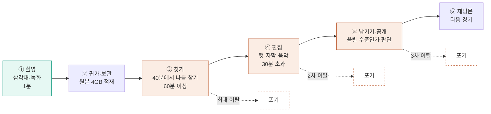

가설의 표현을 "편집이 어려워서 못 올린다"에서 **"촬영 이후에 발생하는 시간·기술·반복 작업의 부담"**으로 바꿔야 한다. 앞의 표현은 직접 조사 데이터가 없어 반박당하고, 뒤의 표현은 서로 다른 조사 여러 건에서 반복 확인된다. 확정

### 1-4. 목표 — Desired Outcome 수치화

Outcome은 기능이 아니라 **고객이 도달하려는 상태**다. 목표값은 전부 **1년차 가설**이며 실측치가 아니다. 가설 **측정 경로**는 "이 숫자를 어느 이벤트에서, 어떤 산식으로 뽑는가"다 — 전부 초안 신규 정의이며 계측 착수 전 데이터팀 확인이 필요하다.

| # | 도달 상태 | 지표 | 기준선 | 1년차 목표 가설 | **측정 경로 (이벤트 · 산식)** 초안 | 검증 |
| --- | --- | --- | --- | --- | --- | --- |
| **O1** | 내 장면을 찾는 데 시간을 쓰지 않는다 | 탐색 소요 시간 | 60분+ | **≤ 5분**(중앙값) | `detection_started` → `selection_opened` 구간 합. 앱 백그라운드 시간 제외 | **E4** |
| **O2** | 찍은 영상이 완성으로 이어진다 | 원본→완성 전환율 | 약 4% | **≥ 60%** | `render_succeeded` 고유 `source_video_id` ÷ `upload_completed` 고유 건수 · 30일 코호트 | **E5** |
| **O3** | 화면에서 알아볼 수 있게 잡힌다 | "잘 잡혔다" 비율 | **베타 1주차 실측으로 확정** 초안 | **≥ 80%** | 렌더 직후 **5점 척도 1문항**, `reframe_rating` **4점 이상 ÷ 전체 응답**. 응답률 < 30%면 무효 처리 | **E3** |
| **O4** | 원본을 지울 수 있다 | 원본 삭제 실행률 | 0% | **≥ 50%** | `source_deleted` ÷ `render_succeeded` (F9 노출 사용자 한정) | E5 파생 |
| **O5** | 공개와 무관하게 기록이 쌓인다 | 비공개 기록 비율 | 0% | **≥ 30%** | `RECORD.visibility='private'` ÷ 전체 RECORD · 월말 스냅샷 | **E6** |
| **O6** | 기록이 끊기지 않는다 | 월간 기록 생성 편수 | 0.7건 | **4건** | 월간 `render_succeeded` ÷ MAU | E8 |
| **O7** | 다음 경기에도 돌아온다 | **기록 3편 이상 보유 사용자 수** | 0명 | **10,000명** | `RECORD` 보유 ≥ 3인 **순 user_id**, **월말 스냅샷**(누적 아님) | **E8** |
| **O8** | 편집을 남에게 맡기지 않아도 된다 | 편집 외주 지출 | 월 60만 원 가설 | **0원** | **분기 설문 n≥30** 초안 — 로그로 잡히지 않는 유일한 지표 | 설문 |
| **O9** | 놓치지 않고 추적된다 | 등장 구간 탐지율 | **정답셋 구축 시 확정** 초안 | **≥ 85%** | 정답 구간과 모델 출력의 **IoU ≥ 0.5**를 정탐으로 보고 `정탐 ÷ 정답 총 구간`. 모델 버전 태깅 필수 | **E1 · Gate A** |
| **O10** | 같은 동작을 다시 찍지 않는다 | 재촬영 횟수 | 1~3회 | **0회** | 동일 `session_id` 내 `upload_completed` 2건 이상 발생률 + E3 재촬영 의향 문항 | **E3** |
| **O11** 초안 | **손으로 하다 지치지 않는다** | **무료 등급 편집 완주율** | 🔴 **`[TBD]`** — 무료 등급 미출시 | **≥ 40%** 초안 | 무료 등급 `render_succeeded` ÷ `edit_session_started` · 30일 코호트 | **E12** |
| **O12** 초안 | **AI가 대신 하는 값을 지불한다** | **무료 → 유료 전환율** | 🔴 **Baseline: 미측정** — 대조군은 CapCut 약 **0.44%**(매출 역산 `추정치`)뿐 | 🔴 **Target: TBD** — E10 실측 후 확정 | 최초 결제 고유 `user_id` ÷ 무료 등급 활성 `user_id` · 월말 스냅샷 | **E10** |

**O3·O9·O11·O12의 기준선은 지금 "없음"이 맞다.** 없는 숫자를 지어내는 대신 **언제 무엇으로 확정할지**를 적었다 — O3는 베타 1주차 실측, O9는 정답셋 구축 시점, O11·O12는 무료 등급 출시 후 첫 30일 코호트.

🔴 **O12에 목표 숫자를 넣지 않았다.** 자체 기준선이 없는 상태에서 전환율 목표를 적으면 그 숫자가 이후 모든 원가 계산의 분모로 쓰인다. **E10이 실측을 내기 전까지 비워 둔다.**

### 1-5. 성공 지표 — 북극성 KPI와 보조 KPI

**북극성 KPI**

| KPI | 정의 | 기준선 | 1년차 목표 | 측정 주기 | **측정 경로** 초안 | **판정 주체** 초안 |
| --- | --- | --- | --- | --- | --- | --- |
| **O7 · 기록 3편 이상 보유 사용자 수** | 개인 기록 저장소에 결과물 3편 이상을 보유한 **순 사용자** | 0명 | **10,000명** 가설 | 주간 추이 · **월말 판정** | `SELECT COUNT(DISTINCT user_id) FROM record GROUP BY user_id HAVING COUNT(*)>=3` · **월말 23:59 스냅샷** | 제품 리드 (월간 리뷰) |

**왜 설치 수가 아니라 축적 사용자인가.** 설치는 마케팅으로 만들 수 있지만 기록 3편은 제품이 실제로 작동해야 쌓인다. 확정

**스냅샷이지 누적이 아니다** 초안 — 기록을 지워 3편 아래로 내려간 사용자는 그 달 집계에서 빠진다. 이탈을 성공으로 세지 않기 위해서다.

처리 물량 **연 약 12만 편**(1만 명 × 월 1편)이 붙고, 이 숫자는 GPU 원가에 직접 비례한다. 확정

**보조 KPI**

| # | KPI | 기준선 | 목표 가설 | 주기 | **측정 경로** 초안 | **판정 주체** 초안 | 게이트 |
| --- | --- | --- | --- | --- | --- | --- | --- |
| S1 | 등장 구간 탐지율 (O9) | 정답셋 구축 시 확정 | ≥ 85% | 릴리스마다 + 주간 | 정답셋 회귀 배치 · 모델 버전별 | **AI 리드** | **Gate A** |
| S2 | "잘 잡혔다" 비율 (O3) | 베타 1주차 확정 | ≥ 80% | 주간 | `reframe_rating` 4점↑ 비율 · 응답률 동시 보고 | AI 리드 | Gate A 이후 |
| S3 | 원본→완성 전환율 (O2) | 4% | ≥ 60% | 주간 | 30일 코호트 · 이탈 단계 분해 동시 보고 | 제품 리드 | 흐름 완성 |
| S4 | 탐색 소요 시간 (O1) | 60분+ | ≤ 5분 | 주간 | 이벤트 구간 중앙값 · p90 병기 | 제품 리드 | Gate A |
| S5 | 비공개 기록 비율 (O5) | 0% | ≥ 30% | 월간 | 월말 스냅샷 | 제품 리드 | **Gate B** |
| S6 | 월간 기록 생성 편수 (O6) | 0.7건 | 4건 | 월간 | `render_succeeded` ÷ MAU | 제품 리드 | Gate B |
| S7 | 원본 삭제 실행률 (O4) | 0% | ≥ 50% | 월간 | F9 노출 사용자 한정 | 제품 리드 | P1(F9) 이후 |
| S8 | 재촬영 횟수 (O10) | 1~3회 | 0회 | 월간 | 세션 내 중복 업로드율 | AI 리드 | Gate A 이후 |
| S9 | 편집 외주 지출 (O8) | 월 60만 원 가설 | 0원 | 분기 | **설문 n≥30** — 로그 측정 불가 명시 | 제품 리드 | — |
| **S10** 초안 | **파이프라인 완주율** | — | **≥ 95%** | 주간 | `render_succeeded` ÷ `detection_started` — **실패 AC들의 상위 지표** | 백엔드 리드 | 전 구간 |
| **S11** 초안 | **편당 실처리 원가** | 🔴 `[TBD]` | 🔴 `[TBD]` — **ADR-05 확정 시 삽입** | 주간 | `(GPU초 × 시간당단가) + 추론토큰원가 + 음악생성원가 + 전송량원가` ÷ `render_succeeded` · **등급별 분리 집계** | 백엔드 리드 | **ADR-05** |
| **S12** 초안 | **무료 등급 편집 완주율** (O11) | 🔴 `[TBD]` | ≥ 40% | 주간 | 무료 `render_succeeded` ÷ `edit_session_started` · **이탈 도구 분해 동시 보고**(컷·트래킹·자막 중 어디서 멈췄는가) | 제품 리드 | **X3 검증** |
| **S13** 초안 | **무료 → 유료 전환율** (O12) | 🔴 Baseline: 미측정 | 🔴 Target: TBD | 월간 | 최초 결제 고유 `user_id` ÷ 무료 활성 `user_id` · 월말 스냅샷 | 제품 리드 + 경영 | **E10** |

🔴 **S11이 새 요금제의 생사를 가른다.** 구독 9,900원 ÷ 3편 = **편당 3,300원**이 매출 상한이고, S11이 그 아래 어디에 앉는지가 아직 실측되지 않았다. §11-5에 **원가 구성요소별 상한 추정**을 적었으나 그중 Gemini 단가와 저장·전송 원가가 `[TBD]`라 합계가 닫히지 않는다.

### 1-6. 차별 가치 — 기존 대안 대비 수치 비교

각 비교는 **어떤 조건에서 잰 값인지**를 함께 적어야 반박에 견딘다. 조건·표본은 전부 초안 제안이다.

| 축 | 기존 대안 | HILiT 목표 | 개선폭 | **측정 조건 (동일 조건 비교)** 초안 | **검증** |
| --- | --- | --- | --- | --- | --- |
| **탐색 시간** | 사람 눈으로 60분+ 확정 | **≤ 5분** 가설 | **12배 ↓** | 동일 사용자 **n=30명** × 자기 원본 3편 · within-subject 전후 비교 · 중앙값 | **E4** |
| **원본→완성 전환율** | 약 4% 확정 | **≥ 60%** 가설 | **15배 ↑** | 베타 **30일 코호트** · 분모는 업로드 완료 원본 | **E5** |
| **편집 외주 비용** | 월 60만 원 가설 | **0원** 가설 | **100% ↓** | 분기 설문 **n≥30** · 자기보고 — *로그 검증 불가를 명시* | 설문 |
| **재촬영 횟수** | 1~3회 확정 | **0회** 가설 | **100% ↓** | 세션 내 중복 업로드율 + 주관 의향 문항 **n=50명** | **E3** |
| **추적 대상** | AlphaCut·Filmora·Vrew = **화자만** 확정 | 말하지 않고 움직이는 사람 | **탐지율 ≥ 2배** 초안 | **동일 원본 n=100편**을 양쪽에 투입 · 동일 정답셋 · IoU ≥ 0.5 | **E2** |
| **하드웨어 전제** | Veo·Pixellot·Hudl = 전용 카메라·팀 계약 확정 | 휴대폰 영상만 | **초기 비용 0원** | 공개 가격표 기준 정성 비교 — *실험 대상 아님* | — |

**`12배 ↓`는 동일 사용자가 같은 원본을 두 방식으로 처리했을 때의 중앙값 비교**다. 조건을 밝히지 않은 배수는 근거가 아니라 구호다. 초안

02 · Users & Personas

## 사용자와 페르소나

### 2-1. 세그먼트 — Q1으로 들어가 Q4로 넓힌다

1순위 기준은 **원본 영상이 있는가**다. 앱에서 촬영하지 않으므로 원본이 없으면 제품이 작동하지 않는다. 2순위는 **지불의향**이다. 확정

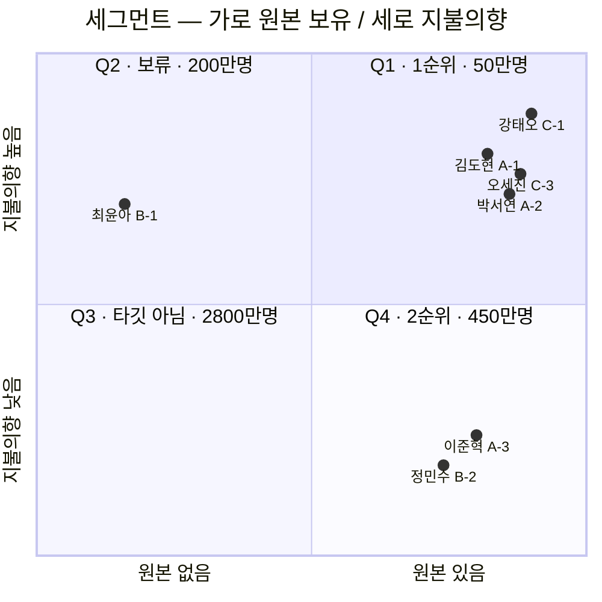

- **Q1 (약 50만 명 가설 )** — 김도현·박서연·강태오·오세진. 촬영 습관이 있고 편집 부담을 몸으로 안다. **전환이 가장 싸다.**
- **Q4 (약 450만 명 가설 )** — 이준혁·정민수. 페인이 가장 크고 시장이 **9배**지만 돈을 내지 않는다. 값을 편집이 아니라 **기록 축적**에서 받기로 이미 정했으므로, Q4를 무료로 확보하는 일이 사업의 본체다. 확정
- **범위 밖** — 최윤아(Q2·원본 없음), 한지우·서하린(첫 카테고리 밖). 버리지 않고 **Proof 근거로 재활용**한다.

### 2-2. 대상 페르소나 6명 — Pain·Needs·여정 단계

| 페르소나 | 세그 | 프로필 | 여정 Pain (단계) | Needs | 실패 KPI |
| --- | --- | --- | --- | --- | --- |
| **김도현** A-1 | Q1 | 26세 · 주 2회 사회인 농구 · 본계정+농구 부계정 | ③ 자기 장면 탐색 60분+ · ④ 구석에 작게 잡힘, 확대 시 화질 파괴 · ⑥ 기억 흐려짐 | 원본을 뒤지지 않고 잘 나온 장면만 남기기 | 원본 **47개** 적재 / 3개월 업로드 **2건** 가설 |
| **박서연** A-2 | Q1 | 22세 · 풋살 동아리 주장 겸 촬영 담당 | ③ 팀원 **8명분** 수작업 불가 · ③ 자기 편집이 늘 마지막 순위 · ③ 원본 전송 시 화질 파괴 · ⑤ 모집 영상 급조 | 원본 하나로 각자 가져가게 · 촬영 담당인 자기 기록도 | **자기 기록만 0건** |
| **강태오** C-1 | Q1 | 24세 · 농구 크리에이터 · 팔로워 8,200 가설 · 주 3회 목표 | ④ 촬영 1h + 편집 **3h** · ④ 외주 **월 60만 원**이 수익 초과 · ⑤ 큰 계정에 묻힘 | 완성도 유지하며 편집 시간만 줄이기 | 업로드 전환 **절반 미달** |
| **오세진** C-3 | Q1 | 30세 · 풋살팀 운영 · 팀원 **12명** · 팔로워 4,500 가설 | ③ 12명분 편집 인력 **1명** · ⑤ 개인 성장 기록이 아무에게도 안 남음 | 팀원이 각자 스스로 만들게 | 매주 원본 생성 / 업로드 **월 2회** |
| **이준혁** A-3 | Q4 | 34세 · 자영업 · 액션캠 50분 · 파일 4GB | ② 15초 위해 50분을 못 지움 · ④ 유료 앱 **3개 결제 후 전부 해지** · ⑤ "보여줄 수준인가"에서 멈춤 | 15초 건지고 원본 지우기 · 공개 없이 해마다 쌓기 | 저장공간 경고 **반복** / 남은 건 원본 폴더뿐 |
| **정민수** B-2 | Q4 | 28세 · 사무직 · 갤러리 미편집 **약 200개** 가설 | ④ 30분 넘겨 매번 중도 포기 · ⑤ 비교 후 "못 올린다" · ⑥ 1년 뒤 기억 안 남 | 실력 없이도 볼 만한 영상 하나 | 업로드 **연 3회** 가설 |

### 2-3. 페르소나 → 요금제 매핑 초안

**어느 페르소나가 어느 등급에 앉는지를 정해야 요금제가 검증 가능해진다.** 전부 초안이며 E10이 실측 대상이다.

| 페르소나 | 예상 등급 | 근거 | 🔴 이 매핑이 틀리면 |
| --- | --- | --- | --- |
| **강태오** C-1 (크리에이터 · 주 3회) | **구독** | 월 3편이 촬영 주기와 맞고, 외주 60만 원 대비 9,900원은 자릿수가 다르다 | 월 3편 상한이 부족하면 충전 추가 결제로 흘러 **단가가 9,900원/편**이 된다 — 🔺 아래 표의 단가 역전 참조 |
| **오세진** C-3 (팀 운영 · 12명) | **충전형** | 팀 이벤트 후 몰아서 편집한다. 월 구독보다 **필요할 때 3편 충전**이 형태에 맞다 | 12명분을 각자 결제하게 두면 팀 단위 지불 의사가 흩어진다 — 🔴 **팀 결제 수단 없음**(§7-1 Out) |
| **김도현** A-1 (주 2회 사회인) | **구독 ↔ 무료 경계** | 월 8회 촬영에 월 3편이면 3분의 1만 남긴다. 지불의향은 있으나 **금액 민감** | 🔺 **이 경계가 O12의 실질 분모다.** 김도현이 무료에 머물면 전환율이 무너진다 |
| **박서연** A-2 (촬영 담당) | **무료** | 자기 기록 **0건**이 출발점이다. 먼저 손으로 한 편이라도 완주해야 유료 판단이 생긴다 | 무료 완주가 30분을 넘으면 전환 이전에 이탈한다 (**X3 · S12**) |
| **이준혁** A-3 · **정민수** B-2 (Q4) | **무료 고착** | *"유료 앱 3개 결제 후 전부 해지"*(이준혁) — 지불의향 없음이 정의다 | 🟢 **의도된 결과다.** Q4는 원가를 만들지 않는 무료 등급에 머물러도 손실이 아니다 — §1-1의 경계 설계가 이걸 노렸다 |

03 · Stories & Acceptance Criteria

## 사용자 스토리와 수용 기준(AC)

각 Job을 **Given–When–Then**으로 옮기고, AC마다 **측정 가능한 임계치**를 붙였다. **모든 스토리에 정상 AC 3개 이상 + 실패 AC 1개 이상**을 둔다(US-2는 2개). 실패 AC는 `AC*-F*`로 표기한다. 초안

`[Gate A]` 실패 시 이후 전부 무의미해지는 관문 · `[Gate B]` 기록 공간 관문 확정

#### US-1 · 40분 원본에서 내 장면을 대신 찾아준다 `[Gate A]` `[구독 전용]`

**As a** 김도현(Q1), **I want** 40분 원본에서 내가 잘 나온 장면을 대신 찾아주기를, **so that** 편집에 한 시간을 쓰지 않고도 오늘의 기록을 남긴다. 확정

🔴 **v2.0에서 이 스토리는 구독·충전 등급 전용이 됐다.** 무료 등급의 대응 경로는 **US-5(수동 트래킹)** 이며, 두 경로의 결과물은 **같은 `RECORD` 테이블에 같은 품질 규격(1080×1920)으로 저장된다** — 규격을 등급으로 나누지 않는다(ADR-13).

| AC | Given / When / Then | 임계치 · 측정 경로 |
| --- | --- | --- |
| **AC1-1** | **Given** 40분·4GB 원본과 지정된 추적 대상이 있을 때 / **When** 탐지를 실행하면 / **Then** 정답 구간 대비 탐지 구간 비율이 기준을 넘는다 | **탐지율 ≥ 85%** 확정 · IoU ≥ 0.5를 정탐으로 · 정답셋 회귀 배치 (**Gate A 판정**) |
| **AC1-2** | **Given** 사용자가 자기를 한 번 지정했을 때 / **When** 대상이 가려졌다 다시 나타나면 / **Then** 같은 사람으로 재식별한다 | **재식별 정확도 ≥ 90%** 초안 · **오인식 ≤ 2%** 초안 · 가림 구간 라벨 포함 정답셋 |
| **AC1-3** | **Given** 탐지가 끝났을 때 / **When** 사용자가 선택 화면에 도달하면 / **Then** `detection_started`→`selection_opened` 구간이 기준 이하다 | **중앙값 ≤ 5분** 확정 · **p90 ≤ 10분** 초안 · 백그라운드 시간 제외 *(원문 `체감 시간` → 계측 이벤트로 치환)* |
| **AC1-F1** 초안 | **Given** 손상·미지원 코덱 원본을 올렸을 때 / **When** 검증 단계에서 판별되면 / **Then** **업로드 전에** 사유를 안내하고 과금 없이 중단한다 | 사전 판별율 **≥ 95%** · 판별 소요 **≤ 10초** · **GPU 작업 생성 0건** |
| **AC1-F2** 초안 | **Given** 원본에 대상이 한 번도 등장하지 않을 때 / **When** 탐지가 끝나면 / **Then** 빈 결과가 아니라 **"찾지 못함" 상태와 재지정 경로**를 제공한다 | 빈 화면 노출 **0건** · 재지정 진입률 측정 · 오탐(없는데 있다고) **≤ 3%** |
| **AC1-F3** 초안 | **Given** 업로드 중 네트워크가 끊겼을 때 / **When** 재연결되면 / **Then** 이어올리기로 복구된다 | **재개 성공률 ≥ 99%** 초안 · 업로드 실패율 **≤ 1%** 초안 · 재시도 **≥ 3회** |
| **AC1-4** 초안 | **Given** 잔여 편수가 0인 사용자일 때 / **When** AI 탐지를 요청하면 / **Then** **탐지를 시작하기 전에** 잔여 0을 알리고 충전·구독 경로를 안내한다 | **잔여 0에서 발생한 `detection_started` 0건** · **GPU 작업 생성 0건** · 안내 노출률 **100%** · 🔴 **차감은 `detection_started`가 아니라 `render_succeeded` 시점**(AC8-2) |
| **AC1-F4** 초안 | **Given** 탐지가 파이프라인 내부 오류로 실패했을 때 / **When** 최종 실패가 확정되면 / **Then** **차감된 편수를 환원하고** 사유를 안내한다 | **실패 건에 대한 편수 차감 잔존 0건** · 환원 반영 지연 **≤ 60초** · `usage_ledger`에 **차감·환원 쌍이 모두 기록**됨 **100%** |

#### US-2 · 팀원이 각자 자기 장면을 가져간다

**As a** 박서연(촬영 담당) / 오세진(팀 운영), **I want** 사람마다 자기가 나온 장면을 각자 골라 가져가기를, **so that** 촬영 담당인 나도 내 기록을 남기고 홍보 주기를 내 편집 속도에서 떼어낸다. 확정

| AC | Given / When / Then | 임계치 · 측정 경로 |
| --- | --- | --- |
| **AC2-1** 초안 | **Given** 팔로잉한 팀원들이 전체공개 기록을 보유할 때 / **When** 팔로잉 탭을 열면 / **Then** 각자가 만든 기록이 사람별로 구분돼 표시된다 | **p95 ≤ 400ms** 초안 · **비공개 기록 노출 0건** 확정 · 🔴 **팔로우는 권한이 아니다** — 조회 조건에 팔로우를 넣지 않고 `visibility='public'` 만으로 거른다 |
| **AC2-2** | **Given** 촬영 담당 본인이 원본을 올렸을 때 / **When** 본인 대상으로 탐지하면 / **Then** 본인 기록도 동일 품질로 생성된다 | 렌더 성공률 **타 사용자와 ±2%p 이내** 초안 · 탐지율 차 **≤ 3%p** 초안 |
| **AC2-3** | **Given** 팀원 12명이 각자 자기 원본을 올렸을 때 / **When** 각자 하이라이트를 만들면 / **Then** **타인 계정에서 발생한 편집 이벤트가 0건**이다 | **타 계정 `selection_*` 이벤트 0건** 초안 *(원문 `편집 담당 개입 0회` → 관찰 가능한 이벤트로 치환)* |
| **AC2-4** | **Given** 한 원본을 여러 사용자가 쓰려 할 때 / **When** MVP 버전에서 시도하면 / **Then** **기능 없음을 명시하고 각자 업로드 경로를 안내**한다 | 안내 노출률 **100%** · 무응답·오류 종료 **0건** · F16 = **P3 보류** 확정 |
| **AC2-F1** 초안 | **Given** 팀원 각자가 자기 편수 쿼터를 쓰는 상태일 때 / **When** 한 사람이 잔여 0에 도달하면 / **Then** **그 사람만 막히고 다른 팀원의 편집은 영향받지 않는다** | 타인 쿼터 오차감 **0건** 확정 · `usage_ledger`의 `user_id` 불일치 **0건** · 🔴 **팀·조직 단위 결제 수단 없음**(§7-1 Out) |
| **AC2-F2** 초안 | **Given** 팀원이 자기 기록을 전체공개했다가 되돌릴 때 / **When** `private`로 바꾸면 / **Then** **팔로워 피드·검색·직접 URL 세 경로 모두에서 즉시 사라지되 본인 기록에는 남는다** | **3경로 전부 0건** 확정 · **본인 기록 유실 0건** 확정 · 회수 반영 지연 **≤ 60초** 초안 · 검색 색인 제외 **100%** 초안 |

> **v2.0 변경** — AC2-1·AC2-F1·AC2-F2는 그룹 기능(F23) 제거에 따라 재작성했다. *"팀원이 각자 자기 장면을 가져간다"* 는 Job 자체는 **그룹 없이도 성립한다** — 각자 자기 원본을 올려 자기 계정에서 편집하는 구조였으므로 그룹은 애초에 **공유 경로**였지 **편집 경로**가 아니었다. 잃은 것은 *"함께 뛰는 대여섯 명에게만 연다"* 는 중간 공개 범위 하나뿐이며, 그 상실은 §7-2 R7에 리스크로 남겼다.

#### US-3 · 구석의 내가 화면 주인공이 된다 `[구독 전용]`

**As a** 강태오 / 김도현, **I want** 편집 시간을 3시간에서 크게 줄여 주기를, **so that** 쌓인 원본을 업로드로 연결하고 성장 근거를 만든다. 확정

| AC | Given / When / Then | 임계치 · 측정 경로 |
| --- | --- | --- |
| **AC3-1** | **Given** 대상이 화면 구석에 작게 잡힌 원본일 때 / **When** 리프레이밍 결과를 보여주면 / **Then** 렌더 직후 **5점 척도 1문항**에서 4점 이상 응답 비율이 기준을 넘는다 | **≥ 80%** 확정 · **응답률 ≥ 30%** 초안 (미만이면 무효) *(측정 도구를 AC 안으로 끌어옴)* |
| **AC3-2** | **Given** 리프레이밍 결과가 나왔을 때 / **When** 사용자가 확인하면 / **Then** 세션 내 재업로드가 발생하지 않는다 | **세션 내 중복 업로드 0건** 초안 · 출력 **≥ 1080×1920** 초안 |
| **AC3-3** | **Given** 후보가 제시됐을 때 / **When** 결과물이 생성되면 / **Then** 사용자의 명시적 선택 없이 확정된 건이 없다 | **`selection_confirmed` 없는 `render_started` 0건** 초안 (D2 보장) · 후보 수 **30개는 초안** 가설 |
| **AC3-4** | **Given** 선택이 끝났을 때 / **When** 합치기·렌더링을 실행하면 / **Then** 앱 안에서 완성된다 | **렌더 p95 ≤ 90초** 초안 · 외부 앱 전환 이벤트 **0건** |
| **AC3-F1** 초안 | **Given** 렌더링이 실패했을 때 / **When** 재시도해도 3회 연속 실패하면 / **Then** **선택 결과를 보존한 채** 사유를 안내하고 원본을 삭제하지 않는다 | 선택 데이터 유실 **0건** · 재시도 **≥ 3회** · 최종 실패율 **≤ 0.5%** |

#### US-4 · 공개하지 않아도 기록이 남는다 `[Gate B]`

**As a** 이준혁 / 정민수(Q4), **I want** 남길 15초를 확실히 건지기를, **so that** 공개하지 않고도 기록을 해마다 쌓는다. 확정

| AC | Given / When / Then | 임계치 · 측정 경로 |
| --- | --- | --- |
| **AC4-1** | **Given** 렌더가 완료됐을 때 / **When** 공개 범위를 정하기 **전**이라도 / **Then** RECORD 행이 이미 존재한다 | **저장 성공률 ≥ 99.9%** 초안 · `render_succeeded` 대비 RECORD 누락 **0건** · **기본 공개 범위 = `private`(나만 보기)** 확정 · 렌더 직후 `visibility` 값이 `private`이 아닌 건 **0건** |
| **AC4-2** | **Given** 기록이 쌓였을 때 / **When** 월말 스냅샷을 뽑으면 / **Then** 비공개 비율이 기준을 넘는다 | **≥ 30%** 확정 · `visibility='private'` ÷ 전체 |
| **AC4-2b** 초안 | **Given** 마이페이지 격자에 기록이 있을 때 / **When** 목록을 보면 / **Then** 각 기록에 공개 범위 배지(`공개`/`나만`)가 붙되 **영상 내용을 가리지 않는다** | 배지 미표시 **0건** · **명도 대비 ≥ 4.5:1**(밝은·어두운 영상 모두) 초안 · 배지 면적 **≤ 썸네일의 8%** 초안 · **중앙 안전영역(가운데 60%) 침범 0** 초안 · **v2.0 — 배지 3종 → 2종**(`그룹` 제거) |
| **AC4-3** | **Given** 남이 내 프로필을 열었을 때 / **When** 목록·개수를 조회하면 / **Then** 전체공개만 보이고 나머지는 **개수에도 포함되지 않는다** | 비공개 노출 **0건** 확정 · **API 응답 필드 단위 검증** 초안 · **p95 ≤ 400ms** 초안 |
| **AC4-4** 초안 | **Given** 구독이 만료되거나 충전 편수가 소멸했을 때 / **When** 기존 기록을 열면 / **Then** **결과물은 그대로 재생·다운로드·공개 범위 변경이 가능하다** | 🔴 **결제 상태에 따른 `RECORD` 접근 차단 0건** 확정(ADR-13) · 만료 후 재생 성공률 **≥ 99.9%** · 만료를 이유로 한 결과물 삭제 **0건** |
| **AC4-F1** 초안 | **Given** 클라이언트가 조작된 요청으로 타인의 비공개 기록을 직접 조회할 때 / **When** 서버가 처리하면 / **Then** **403으로 차단하고 감사 로그를 남긴다** | 우회 성공 **0건** · 감사 로그 기록률 **100%** · **회귀 테스트 스위트 상시 통과** |

#### US-5 · 돈을 내지 않아도 한 편을 끝낸다 (무료 기본 편집도구) `[무료]` 🆕 v2.0

**As a** 박서연(자기 기록 0건) / 이준혁·정민수(Q4 · 지불의향 없음), **I want** AI 없이도 앱 안에서 한 편을 끝까지 만들기를, **so that** 결제 판단 전에 이 앱이 내 기록을 남겨준다는 것을 직접 확인한다. 초안

> **v1.0의 US-5(그룹)를 대체한다.** 그룹 기능 제외로 비게 된 자리에 **무료 등급의 완주 경로**를 넣었다. 🔴 이 스토리가 **Gate B의 판정 입력**이다 — 기록 공간 수용성은 무료 등급에서 재야 결제 의사와 섞이지 않는다(ADR-13).

| AC | Given / When / Then | 임계치 · 측정 경로 |
| --- | --- | --- |
| **AC5-1** 초안 | **Given** 무료 등급 사용자가 20분 이하 원본을 올렸을 때 / **When** 편집 화면에 들어가면 / **Then** **좌우반전 · 수동 컷 · 수동 트래킹 · 자막 네 도구가 전부 열려 있다** | 도구 잠금 노출 **0건** · 유료 유도 배너 **0건**(🔴 첫 완주 이전 페이월 금지) · 편집 화면 진입 **p95 ≤ 2초** 초안 |
| **AC5-2** 초안 | **Given** 사용자가 수동 트래킹으로 키프레임 **2개 이상**을 찍었을 때 / **When** 미리보기를 재생하면 / **Then** 키프레임 사이가 **보간된 궤적**으로 이어지고 **GPU 서버 호출이 0건**이다 | 🔴 **무료 등급 `recovery_request` 0건** 확정 · **무료 등급 편당 GPU 초 = 0** 확정 · 보간 미리보기 지연 **≤ 500ms** 초안 |
| **AC5-3** 초안 | **Given** 자막을 넣을 때 / **When** 폰트를 고르면 / **Then** **OFL 폰트 4종이 전부 무료로 제공되고 잠긴 폰트가 목록에 없다** | 잠금 폰트 노출 **0건** · 폰트 4종 로드 실패 **0건** · **라이선스 고지 화면 접근 경로 100%** 제공 · 🔺 **Freesentation 라이선스 원문 확인 필요**(§11-4) |
| **AC5-4** 초안 | **Given** 무료 편집이 끝났을 때 / **When** 렌더를 실행하면 / **Then** **구독 등급과 같은 출력 규격으로 저장되고 `RECORD`가 생성된다** | 🔴 **출력 ≥ 1080×1920 — 등급 차 0** 확정(ADR-13) · fps 등급 차 **0** · `RECORD` 누락 **0건** |
| **AC5-F1** 초안 | **Given** 무료 업로드 잔여가 0일 때 / **When** 새 업로드를 시도하면 / **Then** **업로드를 시작하기 전에** 잔여 0을 알리고, **이미 만든 기록은 그대로 열린다** | 잔여 0에서 발생한 `upload_completed` **0건** · Storage 쓰기 **0바이트** · 기존 `RECORD` 접근 차단 **0건** · 🔴 **무료 업로드 2회의 갱신 주기 `[TBD]`**(ADR-16) |
| **AC5-F2** 초안 | **Given** 사용자가 무료 편집을 하다 앱을 닫았을 때 / **When** 다시 들어오면 / **Then** **편집 상태(컷 지점·키프레임·자막)가 복원된다** | 편집 상태 유실 **0건** · 복원 성공률 **≥ 99%** 초안 · 🔴 **X3 완화 장치** — 30분을 한 번에 쓰게 하지 않는 것이 이탈 방어의 본체다 |

#### US-6 · 앱을 열면 볼 것이 있다 (소비 루프)

**As a** 전원, **I want** 열었을 때 볼 것이 있고 반응을 주고받기를, **so that** 다음 경기에도 앱을 연다. 확정

| AC | Given / When / Then | 임계치 · 측정 경로 |
| --- | --- | --- |
| **AC6-1** | **Given** 앱을 실행했을 때 / **When** 진입하면 / **Then** 로그인 없이 팔로잉 탭에서 영상이 재생된다 | **첫 프레임 p95 ≤ 1.5초** 초안 · 빈 피드 노출률 🔴 `[TBD]` — *v1.0 원문에서 값이 유실됐다. 지어내지 않고 비워 둔다* |
| **AC6-2** | **Given** "나만 보기" 기록일 때 / **When** 피드를 구성하면 / **Then** 좋아요·댓글 UI가 붙지 않는다 | **비공개 기록 반응 노출 0건** 확정 |
| **AC6-3** | **Given** 부적절한 댓글을 만났을 때 / **When** 신고하면 / **Then** 접수 확인이 표시된다 | **접수 성공률 ≥ 99%** 초안 · *처리 기준·주체는 **미정** 확정 — 접수까지만 테스트 대상* |
| **AC6-4** | **Given** 기록을 만든 사용자일 때 / **When** 가입 30일이 지나면 / **Then** 기록 3편 이상을 보유한다 | **D30 코호트 전환 ≥ 30%** 초안 (북극성 선행지표) |
| **AC6-F1** 초안 | **Given** 팔로잉이 0명이라 피드가 비었을 때 / **When** 앱에 진입하면 / **Then** **빈 화면 대신 추천 탭으로 대체 노출**한다 | 빈 화면 체류 **0초** · 대체 노출률 **100%** · 신규 사용자 첫 세션 이탈률 **≤ 20%** 초안 |

#### US-7 · 말로 고르고, 음악까지 붙여준다 `[구독 전용]` 🆕 v2.0

**As a** 강태오(크리에이터), **I want** *"3점 슛 넣은 데만"* 처럼 말로 기준을 적어 구간을 고르고 음악까지 자동으로 받기를, **so that** 후보 30개를 하나씩 보는 시간마저 없앤다. 초안

🔴 **이 스토리는 CLAUDE.md 절대 규칙 2의 선 위에 있다.** *"내가 나온 구간"* 은 **추적 API(D1)** 가 정하고, *"무엇을 했는가"* 만 **Gemini**가 읽는다. **Gemini를 인물 식별에 쓰지 않는다** — 아마추어 농구 원본에는 자막이 없어 인물 특정 근거가 없기 때문이다. 파이프라인 순서(추적 → 구간 축소 → Gemini)가 이 선을 구조로 강제한다(§4-6-1).

| AC | Given / When / Then | 임계치 · 측정 경로 |
| --- | --- | --- |
| **AC7-1** 초안 | **Given** 추적이 끝나 등장 구간이 확정됐을 때 / **When** 사용자가 자연어 기준을 입력하면 / **Then** **그 구간에 한해서만** Gemini가 행동 메타데이터를 만든다 | 🔴 **등장 구간 밖 프레임의 Gemini 투입 0건** 확정 · 투입 영상 길이 = 등장 구간 합 **±5% 이내** · 메타데이터 생성 **p95 ≤ 4분** 초안 |
| **AC7-2** 초안 | **Given** 구간 메타데이터가 만들어졌을 때 / **When** Claude Haiku 4.5가 사용자 프롬프트와 대조하면 / **Then** 선택된 구간마다 **왜 골랐는지 근거 문장**이 함께 반환된다 | 🔴 **근거 없는 선택 구간 0건** 확정(CLAUDE.md 규칙 2 — *"AI가 무엇을 골랐는지 표시"*) · 판정 **p95 ≤ 20초** 초안 · 판정 원가 **≤ $0.05/편** 초안(§11-2) |
| **AC7-3** 초안 | **Given** 사용자가 프롬프트를 바꿔 다시 고르려 할 때 / **When** 재판정을 실행하면 / **Then** **영상을 다시 읽지 않고** 저장된 메타데이터 위에서만 판정한다 | 🔴 **재판정 시 Gemini 호출 0건** 확정 · 재판정 **p95 ≤ 20초** · 재판정 원가가 최초 판정 원가의 **≤ 20%** 초안 |
| **AC7-4** 초안 | **Given** 완성본이 만들어졌을 때 / **When** 사용자가 확인하면 / **Then** **[이대로 저장]과 [직접 고르기]가 둘 다 보인다** | 🔴 **`[직접 고르기]` 미노출 0건** 확정(**SRS** ADR-6) · 🔴 **등급에 따른 `[직접 고르기]` 접근 제한 0건** 확정(ADR-13 금지 유지) · 미리 체크된 후보 **0건**(단 `[직접 고르기]` 진입 시 AI 선택분 체크는 허용) |
| **AC7-5** 초안 | **Given** 음악을 AI로 만들 때 / **When** 1회 생성을 실행하면 / **Then** **2곡이 나오고 사용자가 그중 하나를 고른다** | 🔴 **사용자 선택 없는 음악 확정 0건** 확정(D2) · 생성 **p95 ≤ 3분** 초안 · **편당 생성 3회 상한** 확정 · 4회째 시도 성공 **0건** |
| **AC7-F1** 초안 | **Given** 사용자 프롬프트에 맞는 구간이 하나도 없을 때 / **When** 판정이 끝나면 / **Then** **빈 결과가 아니라 "찾지 못함" + 기준 완화 제안 + `[직접 고르기]` 경로**를 준다 | 빈 화면 노출 **0건** · 대체 경로 노출률 **100%** · 🔴 **없는 구간을 억지로 채워 반환 0건**(REQ-FUNC-027 — *"확신이 없으면 보여주지 않는다"*) |
| **AC7-F2** 초안 | **Given** Gemini 또는 Haiku 호출이 실패했을 때 / **When** 재시도해도 실패하면 / **Then** **편수를 차감하지 않고** 후보 목록(F3) 수동 선택으로 되돌린다 | 실패 건 차감 잔존 **0건** · 대체 경로 진입 성공률 **≥ 99%** · 재시도 **≥ 2회** · 🔺 **외부 API 2곳 의존 — 가용성이 곱해진다**(§11-2) |

#### US-8 · 편수를 사고, 7일 안에 다시 손본다 `[유료]` 🆕 v2.0

**As a** 오세진(팀 운영 · 몰아서 편집), **I want** 필요한 만큼 편수를 사고 만든 뒤 며칠 안에 다시 손보기를, **so that** 한 번에 완벽하게 만들어야 한다는 부담 없이 시작한다. 초안

| AC | Given / When / Then | 임계치 · 측정 경로 |
| --- | --- | --- |
| **AC8-1** 초안 | **Given** 결제 화면을 열었을 때 / **When** 요금제를 보면 / **Then** **구독 3편·충전 3편·추가 1편의 가격과 유효기간이 편당 단가와 함께 표시된다** | 편당 단가 미표시 **0건** · 유효기간 미표시 **0건** · 🔺 **추가 1편 9,900원 = 충전 팩 편당 6,600원보다 50% 비싸다** — 의도 확인 필요(ADR-15) |
| **AC8-2** 초안 | **Given** 편집을 시작했을 때 / **When** 렌더가 성공하면 / **Then** **그때 편수 1이 차감되고 원장에 기록된다** | 🔴 **차감 시점 = `render_succeeded`** 확정 · 중복 차감 **0건** · `usage_ledger` 미기록 차감 **0건** · 잔여 표시 반영 지연 **≤ 5초** 초안 |
| **AC8-3** 초안 | **Given** 렌더가 끝난 유료 건일 때 / **When** 7일 이내에 다시 들어오면 / **Then** **원본과 중간 산출물이 남아 있어 편수 차감 없이 재편집된다** | 🔴 **7일 이내 재편집의 추가 차감 0건** 확정 · 원본 조기 파기 **0건** · 보관 만료 **정확도 ±1시간** 초안 · **7일 = 유료 전용**(무료는 렌더 직후 원본 파기) |
| **AC8-4** 초안 | **Given** 보관 만료 **24시간 전**일 때 / **When** 알림 시점이 되면 / **Then** **"원본이 내일 지워집니다 · 결과물은 그대로 남습니다"**를 알린다 | 사전 알림 발송률 **100%** · 🔴 **결과물이 지워진다는 오해를 부르는 문구 0건** · 알림 후 재진입률 측정(리캡 효과) |
| **AC8-F1** 초안 | **Given** 충전 편수의 **1개월 유효기간**이 끝났을 때 / **When** 소멸이 실행되면 / **Then** **미리 알리고, 소멸 후에도 만든 기록은 전부 열린다** | 사전 알림 **≥ 1회** 초안 · 🔴 **소멸을 이유로 한 `RECORD` 접근 차단 0건** 확정(AC4-4) · 소멸 원장 기록률 **100%** |
| **AC8-F2** 초안 | **Given** 결제가 승인됐으나 편수 적립이 실패했을 때 / **When** 불일치가 감지되면 / **Then** **자동 보정하고 감사 로그를 남긴다** | 결제·적립 불일치 잔존 **0건** 확정 · 보정 지연 **≤ 5분** 초안 · 감사 로그 **100%** · 🔴 **미적립 상태로 종료되는 결제 0건** |

**AC 총계: 정상 30 + 실패 14 = 44개.** (v1.0 33개 → v2.0 44개 · 그룹 AC 7건 삭제 · 과금·무료편집·프롬프트컷 AC 18건 신설.) 모든 Then은 로그·쿼리·테스트로 관찰 가능하며, 주관어는 전부 계측 이벤트나 척도 문항으로 정의했다.

04 · Functional Requirements

## 기능 요구사항(Functional)

### 4-1. MoSCoW 우선순위

**MVP = 23개** 초안 — 무료 편집 5 · 유료 편집 8 · 기록 공간 3 · 소비·관계 5 · 과금 2 *(v1.0 17개 → 그룹 F23 삭제 · 신규 7건)*

| MoSCoW | 기능 | 등급 | 근거 (대안 대비 가치) |
| --- | --- | --- | --- |
| **Must — 무료 편집 5** | **F1** 긴 원본 업로드 · **F24** 좌우반전 🆕 · **F25** 수동 컷(분할) 🆕 · **F26** 수동 트래킹 🆕 · **F18b** 자막 편집 *(P3 → Must 승격)* | 무료 | **원가 ≈ 0에서 완주 경로를 만든다.** 전부 클라이언트 연산이라 GPU·외부 추론 호출이 0건이다(§11-5). **Gate B의 판정 입력**이며 Q4(450만 명)의 유일한 유입 경로다 |
| **Must — 유료 편집 8** | **F2a** 대상 지정·재식별 · **F2b** 등장 구간 탐지 · **F3** 후보 30개 · **F4** 사용자 선택 · **F5a** 크롭·리프레이밍 · **F6** 합치기·렌더링 · **F27** 프롬프트 컷 🆕 · **F28** AI 음악(Suno) 🆕 | 구독·충전 | F2a·F2b·F5a가 **D1(6/6 커버)**의 본체 — 조사한 대안 중 *말하지 않고 움직이는 사람*을 추적하는 곳이 없다. **F27·F28이 v2.0의 신규 지불 근거**다 |
| **Must — 기록 공간 3** | **F18a** 음악 라이브러리 · **F7** 기록 자동 저장 · **F8** 공개 범위(2종) | 🔴 **전 등급 무료** | **D4** — Instagram은 올려야 남고, CapCut·VLLO는 보관하지 않는다. 🔴 **기록 저장·공개 범위를 등급으로 나누지 않는다**(ADR-13 금지 유지 · Gate B) |
| **Must — 소비·관계 5** | **F22** 앱 셸 · **F11** 팔로워·팔로잉 · **F13** 추천 피드 · **F19** 좋아요 · **F20** 댓글·신고 · **F21** 공유 | 전 등급 무료 | **O7 재방문**의 조건 — 열었을 때 볼 것이 없으면 돌아오지 않는다. **v2.0에서 SNS 형식은 그대로 유지**한다 |
| **Must — 과금 2** | **F30** 요금제·쿼터·크레딧(Entitlement) 🆕 · **F29** 원본 임시 보관 7일 + 리캡 🆕 | 유료 | F30 없이는 세 등급이 코드에서 구분되지 않는다. F29는 *"한 번에 완벽하게"* 부담을 없애는 재편집 경로이자 **원본 보관 원가의 상한 장치**다 |
| **Should** (P1 · MVP 직후) | **F5b** 구도 규칙·앵글 · **F9** 원본 삭제·저장공간 회수 · **F10** 기록 타임라인 · **F12** 취향 설문 · **F15** 카테고리 랭킹 | — | F9는 O4(삭제율 50%)의 유일한 수단. F15는 *"게시 이후 결과 문제는 풀지 않는다"* 선 바로 위 — **도입 여부는 미정** 확정 |
| **Could** (P2) | **F14** 선택 데이터 학습 → 정확도 개선 | — | 가장 강한 방어선(KSF 5번)이지만 **학습할 선택 데이터가 사용자 없이는 생기지 않는다.** 순서상 나중이 맞다 확정 |
| **Won't** (P3 · 이번 범위 밖) | **F16** 팀 공유 편집 · **F17** 촬영 가이드 · **F23** ~~그룹~~ **삭제** · **팀·조직 단위 결제** | — | **F23은 v2.0에서 제외**(C2) — 기능 자체를 범위에서 뺐다. F16은 **팀 계정·원본 공유 권한·얼굴 정보 동의·인원 비례 원가** 넷이 전부 미정이다 |

🔴 **F18b(자막 편집)를 Won't에서 Must로 올린 것이 v1.0 대비 가장 큰 방향 전환이다.** v1.0은 CLAUDE.md 규칙 4(*"편집을 늘리지 않는다"*)에 따라 자막을 뺐다. v2.0은 **자막을 무료 등급의 완주 도구로 되살린다.** 대가는 X3의 위험이고, 방어 장치는 **AC5-F2(편집 상태 복원)** 와 **S12(무료 완주율 · 이탈 도구 분해)** 다.

### 4-2. MVP 흐름 — 두 갈래로 갈렸다가 한 곳에서 만난다

🔴 **두 경로가 같은 `RECORD`로 수렴한다는 점이 이 그림의 핵심이다.** 결과물의 품질 규격·저장·공개 범위는 등급과 무관하다(ADR-13).

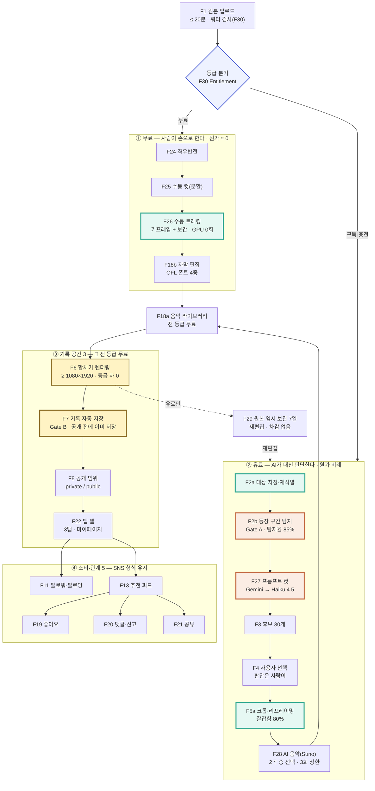

### 4-3. 공개 범위 상태 — 2종으로 줄었다

**v2.0 변경** — `group` 상태를 제거했다. 남은 것은 `private`·`public` 둘뿐이며, `RECORD.group_id` 필드도 함께 삭제한다.

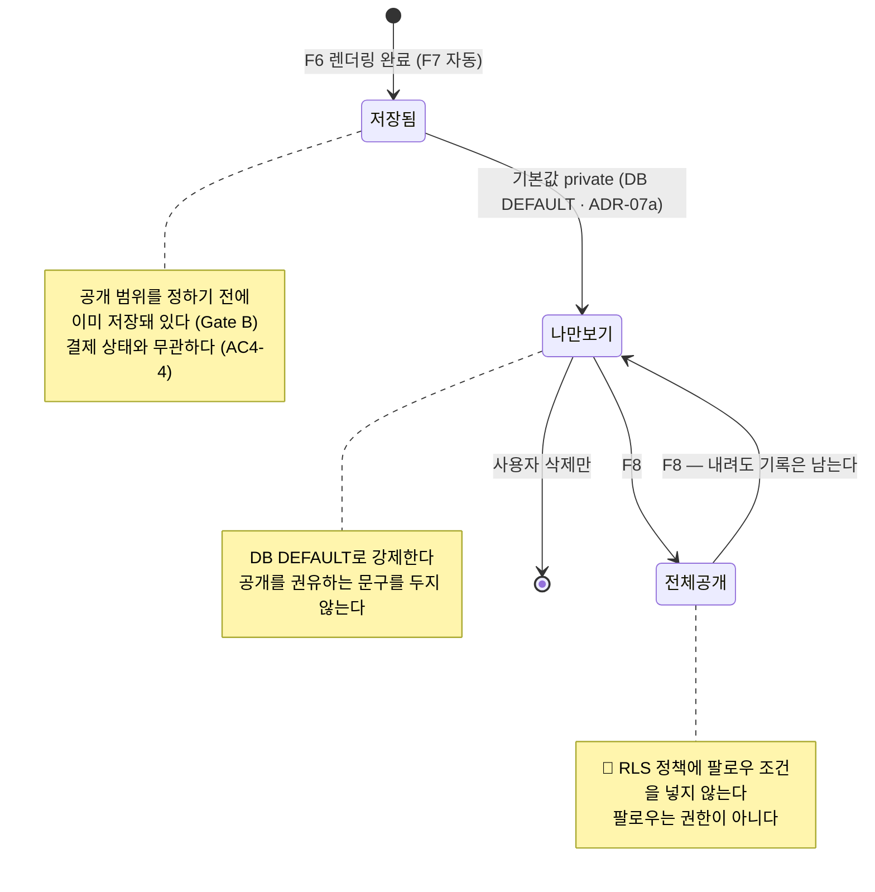

🔴 **그룹 제거로 잃은 것을 명시한다.** *"팔로워 128명 전부가 아니라 함께 뛰는 대여섯 명에게만"* 이라는 **중간 공개 범위가 사라졌다.** 남은 선택지는 *전부에게 열거나 아무에게도 안 열거나* 둘뿐이다. 이 상실이 공개 전환율에 미치는 영향은 **R7**로 리스크에 올렸고, **E7이 그룹 A/B에서 "2종 공개 범위의 전환율 기준선 측정"으로 재정의**됐다(§8-2).

### 4-4. 요금제 구성 🆕 v2.0

**전부 확정** — 사용자 결정(2026-09-01). 단 `[TBD]` 표시 항목은 값이 정해지지 않았다.

| 등급 | 가격 | 편수 | 원본 길이 | 유효기간 | 편당 단가 |
| --- | --- | --- | --- | --- | --- |
| **무료** | 0원 | **업로드 2회** | 회당 **≤ 20분** | 🔴 **`[TBD]` — 갱신 주기 미정**(월 2회? 계정당 2회?) · ADR-16 | — |
| **구독** | **월 9,900원** | **3편 / 월** | 편당 **≤ 20분** | 월 단위 갱신 · 🔴 **이월 여부 `[TBD]`** · ADR-16 | **3,300원** |
| **충전형 종량제** | **19,800원** | **3편** | 편당 **≤ 20분** | **결제 후 1개월 소멸** | **6,600원** |
| **충전 추가** | **9,900원** | **+1편** | **≤ 20분** | **결제 후 1개월 소멸** | **9,900원** |

🔺 **단가가 계단을 거꾸로 오른다 — 확인이 필요하다.** 구독 3,300원 → 충전 6,600원(2배)까지는 구독 유인으로 설명된다. 그런데 **충전 추가 1편이 9,900원으로 충전 팩 편당 단가(6,600원)보다 50% 비싸다.** 통상 추가 구매는 단가가 같거나 낮다. 세 가지 해석이 가능하다.

| 해석 | 함의 | 판정 |
| --- | --- | --- |
| ① 의도된 설계 — 추가 구매를 막고 **구독으로 밀어낸다** | 성립한다. 다만 오세진(몰아서 편집)이 4편째에서 **구독+충전 둘 다 사지 않고 멈출** 수 있다 | ADR-15에서 결정 |
| ② 추가 1편도 **6,600원**이어야 한다 | 단가 일관 · 오세진 이탈 방지 | 🔺 사용자 확인 필요 |
| ③ 추가 결제는 **3편 단위 재충전만** 허용한다 | 계단이 없어진다. 단 1편만 필요한 사용자가 19,800원을 내야 한다 | 대안 |

> 🔴 **이 문서는 사용자가 준 값(9,900원)을 그대로 적었다.** 지어내 고치지 않는다. **ADR-15의 결정 대상**으로 올린다.

### 4-5. 무료 / 유료 경계 — 기능 × 등급 행렬 🆕 v2.0

**●** 제공 · **○** 미제공 · 🔴 = 등급으로 나누는 것이 금지된 항목

| # | 기능 | 무료 | 구독 | 충전 | 원가 동인 |
| --- | --- | :--: | :--: | :--: | --- |
| F1 | 원본 업로드 | ● 2회 · ≤20분 | ● 3편/월 · ≤20분 | ● 3편 · ≤20분 | ③ 저장·전송 |
| F24 | 좌우반전 | ● | ● | ● | 없음 (클라이언트) |
| F25 | 수동 컷(분할) | ● | ● | ● | 없음 (클라이언트) |
| F26 | 수동 트래킹 | ● | ● | ● | 없음 (키프레임 보간) |
| F18b | 자막 편집 · OFL 폰트 4종 | ● | ● | ● | 없음 (클라이언트) |
| F18a | 무료 라이브러리 음악 · 삽입 | ● | ● | ● | 없음 (정적 자산) |
| **F2a·F2b** | **AI 대상 지정·재식별·등장 구간 탐지** | **○** | ● | ● | ① 추론 — GPU 초 |
| **F5a** | **AI 크롭·리프레이밍** | **○** | ● | ● | ① 추론 |
| **F27** | **프롬프트 컷** (Gemini → Haiku 4.5) | **○** | ● | ● | ① 추론 — 토큰 |
| **F28** | **AI 음악**(Suno · 2곡/회 · 편당 3회) | **○** | ● | ● | ① 추론 — 생성 단가 |
| **F29** | **원본 임시 보관 7일 + 리캡** | **○** | ● | ● | ③ 저장 |
| F3 | 후보 목록 | ○ *(AI 탐지 산출물이라 무료엔 대상이 없다)* | ● **30개** | ● **30개** | 🔴 **개수 등급화 금지** |
| F4 | `[직접 고르기]` · 사용자 선택 | — | ● | ● | 🔴 **접근 제한 금지** |
| F6 | 합치기·렌더링 | ● | ● | ● | 🔴 **출력 규격 등급화 금지** — 전 등급 ≥ 1080×1920 |
| F7 | 기록 자동 저장 | ● **영구** | ● **영구** | ● **영구** | 🔴 **저장 등급화 금지** |
| F8 | 공개 범위(private/public) | ● | ● | ● | 🔴 **등급화 금지** |
| F11·F13·F19·F20·F21·F22 | SNS — 팔로우·피드·좋아요·댓글·공유 | ● | ● | ● | 🔴 **등급화 금지** |
| — | 신뢰도 임계 `τ` | — | **동일 값** | **동일 값** | 🔴 **차등 금지** |

**금지 5건의 v2.0 처리** — **SRS** ADR-8의 금지 목록 중 무엇이 살아남고 무엇이 바뀌었는지를 여기서 못박는다.

| **SRS** ADR-8 금지 항목 | v2.0 처리 |
| --- | --- |
| 탐지·재식별·리프레이밍 **품질 등급화** | 🔴 **유지.** 구독과 충전이 같은 모델·같은 파라미터를 쓴다. **유료 등급 내부에서 다시 나누지 않는다** |
| 후보 **개수** 등급화 | 🔴 **유지.** 유료 전 등급 30개 동일. Q7 실측이 가능하다 |
| **`[직접 고르기]` 접근 제한** | 🔴 **유지.** 유료 전 등급에서 항상 노출(AC7-4) |
| 임계 **`τ`** 등급별 차등 | 🔴 **유지.** 단일 값 |
| **기록 저장 · 공개 범위** | 🔴 **유지 + 강화.** 전 등급 무료이며 **결제 만료 후에도 접근을 막지 않는다**(AC4-4 · AC8-F1) |
| ~~기능 잠금 금지~~ | ⚠️ **폐기.** AI 기능 4종(F2a·F2b·F5a·F27·F28)을 무료에서 잠근다 → **X1 · ADR-13** |

### 4-6. 시퀀스 다이어그램 🆕 v2.0

#### 4-6-1. 프롬프트 컷 — Gemini가 읽고, Haiku 4.5가 고른다

🔴 **순서가 곧 안전장치다.** 추적이 먼저 등장 구간을 좁히므로 ①Gemini에 들어가는 영상 길이가 줄어 원가가 내려가고 ②**Gemini가 인물을 식별할 필요가 사라진다**(CLAUDE.md 절대 규칙 2).

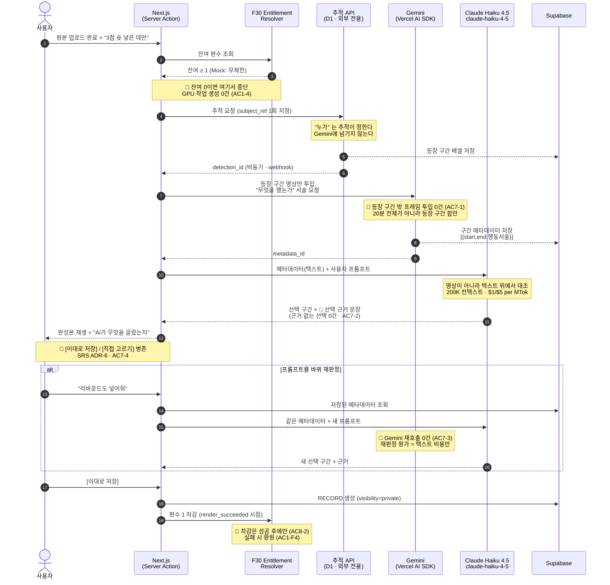

**왜 2단으로 나눴는가 — 세 가지 이유** 초안

| # | 이유 | 근거 |
| --- | --- | --- |
| **①** | **재판정이 싸진다** | 프롬프트를 바꿀 때마다 영상을 다시 읽으면 재판정 원가가 매번 전액이다. 메타데이터를 텍스트로 한 번 뽑아두면 **재판정은 Haiku 토큰 비용만** 든다. 추적 PoC의 `POST .../threshold`(다시 추적하지 않고 threshold만 바꿔 재판정)와 **같은 원리**다 |
| **②** | **근거가 남는다** | 텍스트 위 판정은 *"어느 구간을 왜 골랐는가"* 를 문장으로 반환할 수 있다. CLAUDE.md 절대 규칙 2 — 🔴 *"완성본 화면에 AI가 무엇을 골랐는지 표시한다"* 의 **구현 수단**이다 |
| **③** | **인물 식별 경로가 구조로 막힌다** | Gemini는 이미 좁혀진 *"내 구간"* 만 받는다. **누구인지 판단할 여지가 입력에 없다** — 규칙을 문서로 지키는 대신 파이프라인으로 강제한다 |

#### 4-6-2. AI 음악 — 1회 생성에 2곡, 사람이 고른다

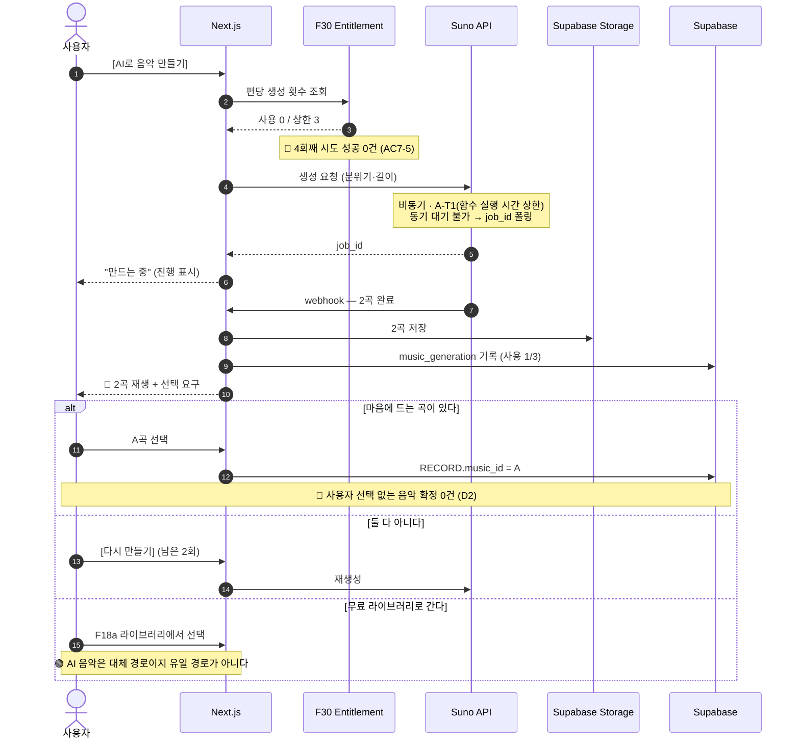

#### 4-6-3. 쿼터·크레딧 차감 — Entitlement Resolver

🔴 **지금 만드는 것은 Mock(전부 무제한 반환)이고, 실제 교체 시 호출부 변경이 0건이어야 한다**(SRS ADR-8 · CLAUDE.md).

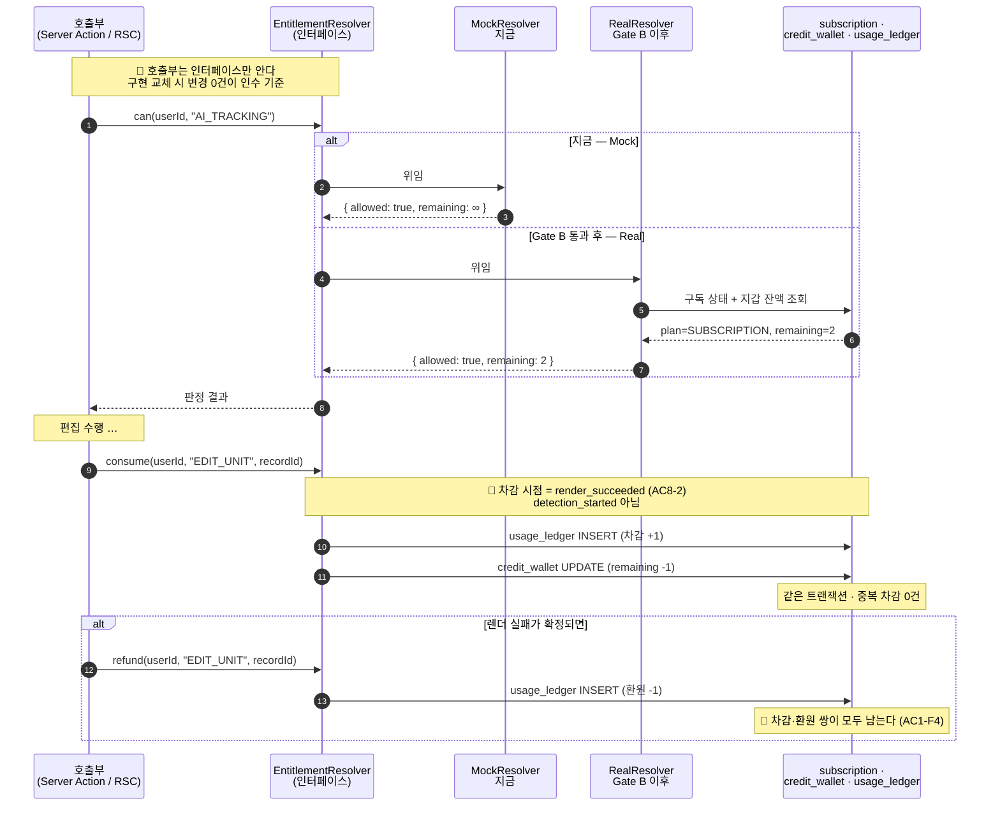

#### 4-6-4. 무료 등급 — 손으로 한 편을 끝낸다

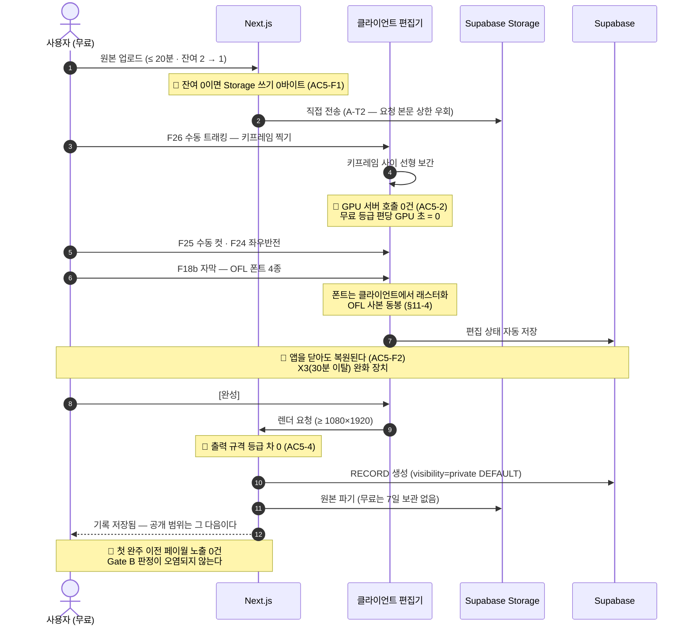

05 · Non-Functional Requirements

## 비기능 요구사항(NFR)

가설 **이 장의 수치는 대부분 초안 초안이다.** VPS 0.3은 제품 가치를 다루고 시스템 사양을 다루지 않았다. 착수 전 팀 합의가 필요하며, 원가에 직접 영향을 주는 항목은 별도 표시했다.

### 5-1. 성능

| 항목 | 목표 | 근거 |
| --- | --- | --- |
| 앱 진입 → 첫 영상 프레임 | **p95 ≤ 1.5초** 초안 | AC6-1 · "로그인 화면 없이 바로 재생" 확정 |
| 40분·4GB 원본 업로드(LTE) | **p95 ≤ 6분** 초안 · 이어올리기 필수 | AC1-F3 |
| 탐지(F2b) 완료 — 40분 원본 | **p95 ≤ 8분** 초안 | AC1-3 · O1(체감 5분) 달성의 상한 |
| 후보 목록(F3) 렌더 | **p95 ≤ 1초** 초안 | — |
| 15초 결과물 렌더(F6) | **p95 ≤ 90초** 초안 | AC3-4 |
| 피드·목록 API | **p95 ≤ 400ms** 초안 | AC4-3 |
| **무료 편집기 진입** 🆕 | **p95 ≤ 2초** 초안 | AC5-1 |
| **수동 트래킹 보간 미리보기** 🆕 | **p95 ≤ 500ms** 초안 | AC5-2 · 클라이언트 연산 |
| **Gemini 구간 메타데이터 생성** 🆕 | **p95 ≤ 4분** 초안 | AC7-1 · 🔴 **A-T1 — 동기 대기 불가**(§11-6) |
| **Haiku 4.5 대조 판정** 🆕 | **p95 ≤ 20초** 초안 | AC7-2 · 텍스트 입력 ~20K 토큰 기준 |
| **프롬프트 재판정** 🆕 | **p95 ≤ 20초** 초안 | AC7-3 · Gemini 재호출 없음 |
| **Suno 음악 생성(2곡)** 🆕 | **p95 ≤ 3분** 초안 | AC7-5 · webhook 수신 기준 |
| **잔여 편수 표시 반영** 🆕 | **≤ 5초** 초안 | AC8-2 |

> 🔴 **탐지 p95 ≤ 8분은 유료 등급 전체에 동일 적용한다.** 무료를 일부러 느리게 만들지 않는 것과 같은 이유로, **구독과 충전 사이에 우선 처리 큐 차등을 두지 않는다**(ADR-13). 차이는 혼잡 구간에서만 발생한다.

### 5-2. 신뢰성

| 항목 | 목표 |
| --- | --- |
| 월 가용성(앱 셸·피드·기록 조회) | **≥ 99.5%** 초안 |
| 월 가용성(AI 처리 파이프라인) | **≥ 99.0%** 초안 — 비동기 큐로 처리 지연은 허용, 유실은 불허 |
| **기록 저장 성공률(F7)** | **≥ 99.9%** 초안 — *Gate B의 전제. 여기서 유실되면 제품 주장 자체가 무너진다* |
| 업로드 실패율 | **≤ 1%** 초안 · 재개 성공률 **≥ 99%** 초안 |
| API 5xx 오류율 | **≤ 0.1%** 초안 |
| 처리 실패 시 | 원본·중간 산출물 **보존 후 재시도 ≥ 3회** 초안 |
| **결제·적립 정합성** 🆕 | 🔴 **불일치 잔존 0건** 확정 · 보정 지연 **≤ 5분** 초안 — *여기서 어긋나면 사용자가 돈을 내고 아무것도 못 받는다* |
| **편수 차감 정확성** 🆕 | 🔴 **중복 차감 0건 · 실패 건 차감 잔존 0건** 확정 · 차감·환원 **원장 기록률 100%** |
| **외부 추론 API 가용성** 🆕 | 🔺 **Gemini · Haiku · Suno 3곳 의존 — 가용성이 곱해진다.** 각 **≥ 99.0%** 가정 시 F27+F28 결합 가용성은 **약 97%** `[산출]` → 🔴 **어느 하나가 죽어도 F3(후보 목록) 수동 선택으로 되돌아가는 대체 경로가 필수**(AC7-F2) |
| **무료 등급 GPU 초** 🆕 | 🔴 **편당 0초** 확정 — 1건이라도 발생하면 즉시 알림(무료 등급 원가 가정이 깨진 것이다) |

### 5-3. 보안·프라이버시

| 항목 | 요구 | **임계치 · 검증 방법** 초안 |
| --- | --- | --- |
| **얼굴 정보** | 추적을 위해 인물 특징을 처리한다 | **ADR-11 산출물 체크리스트 4종**(동의 문구 · 보관 기간 · 파기 절차 · 처리 위탁)이 **전부 승인되기 전 프로덕션 배포 0건**. 미승인 시 CI 배포 차단 |
| 영상 저장 | at-rest 암호화 · TLS 1.2+ | 미암호화 객체 **0건**(주간 스캔) · TLS 1.1 이하 핸드셰이크 **0건** |
| **공개 범위 강제** | 서버 측 강제 | **회귀 테스트 스위트**(AC4-F1·AC5-2·AC5-4) **릴리스마다 100% 통과** · 위반 접근 시도 **월 0건** 목표, 1건이라도 감지 시 즉시 알림 |
| 공유 링크(F21) | 링크도 공개 범위를 따른다 | 링크 기본 만료 **30일** 초안 · 만료 후 접근 성공 **0건** · 회수 반영 지연 **≤ 60초** |
| 신고(F20) | 접수는 MVP | 접수 성공률 **≥ 99%** · *처리 기준·운영 주체 **미정** 확정 — 처리 SLA는 확정 후 삽입* |
| **결제 정보** 🆕 | 🔴 **카드 정보를 자체 저장하지 않는다** | PG사 토큰만 보관 · 자체 DB 내 PAN·CVC **0건**(주간 스캔) · 🔴 **PG사 선정 `[TBD]`** — ADR-17 |
| **외부 추론 위탁** 🆕 | Gemini · Haiku · Suno에 **영상·메타데이터가 나간다** | 🔴 **ADR-11(얼굴 정보 동의) 체크리스트의 "처리 위탁" 항목에 3개 사업자를 명시**하고 승인 전 배포 0건 · 위탁 미고지 상태의 호출 **0건** |
| **AI 음악 권리** 🆕 | Suno 생성물의 **상업적 이용·재배포 권리** | 🔴 **`MUSIC_LICENSE` 법무 게이트 확장.** 사용자가 만든 곡을 **전체공개 기록에 실어 배포**할 권리가 API 약관상 사용자에게 있는지 확인 전 F28 배포 **0건** — §11-3 |
| **폰트 라이선스** 🆕 | OFL 폰트 4종 | 🔴 **OFL 사본 동봉 100%** · Reserved Font Name 위반 **0건**(폰트 파일명·패밀리명 변경 금지) · 🔺 **Freesentation 라이선스 원문 확인 필요** — §11-4 |

**`법무 검토 선행 필수`는 요구사항이 아니라 소망이었다.** 통과/실패를 판정할 수 없기 때문이다. **산출물 4종 승인 = 배포 게이트**로 바꾸면 CI가 판정할 수 있다. 초안

### 5-4. 비용

| 항목 | 내용 |
| --- | --- |
| **GPU 원가** | 처리 물량 **연 12만 편**(1만 명 × 월 1편)에 **직접 비례** 확정 — 북극성 KPI가 곧 원가 동인이다. **v2.0 — 유료 등급 물량에만 비례한다**(무료는 GPU 0초) |
| 편당 처리 원가 상한 | 🔴 **`[TBD]`** — **매출 상한은 확정됐다: 구독 편당 3,300원.** 그 아래 어디에 앉는지가 ADR-05의 결정 대상이며, §11-5에 구성요소별 상한 추정을 적었다 |
| 저장 원가 | 원본 보관은 **결과물 확보까지만**이 기본. **v2.0 — 유료 등급만 7일 연장**(F29), 무료는 렌더 직후 파기 |
| **외부 추론 원가** 🆕 | **Gemini 토큰 + Haiku 4.5 토큰 + Suno 생성 단가.** GPU와 달리 **초 단위가 아니라 호출 단위**라 상한을 코드로 걸 수 있다 — Suno 편당 3회 상한이 그 예다 |
| **무료 등급 원가** 🆕 | 🔴 **설계 목표 = 저장·전송만.** GPU 0초 · 외부 추론 0호출. 이 가정이 깨지면 Q4 무제한 확보 전략이 무너진다 → NFR 신뢰성 표의 *"무료 등급 GPU 초 = 0"* 알림이 감시 장치다 |

### 5-5. 모니터링

| 구분 | 항목 | 알림 기준 초안 | **수신자** 초안 | **1차 대응 SLA** 초안 |
| --- | --- | --- | --- | --- |
| **게이트** | 탐지율(O9) | 일간 **< 80%** | AI 리드 | **2시간** — Gate A 회귀 |
| **저장** | F7 저장 성공률 | **< 99.9%** | 백엔드 온콜 | **15분** — 최우선 |
| **보안** | 공개 범위 위반 접근 | **1건** | 보안 담당 + 제품 리드 | **30분** |
| 파이프라인 | 큐 대기 p95 | **> 15분** | 백엔드 온콜 | 4시간 |
| 파이프라인 | 완주율(S10) | 주간 **< 95%** | 백엔드 리드 | 1일 |
| 북극성 선행 | D30 3편 도달률 | 주간 **< 20%** | 제품 리드 | 주간 리뷰 |
| 비용 | 일간 GPU 예산 | **80% 초과** | 백엔드 리드 + 제품 리드 | 4시간 |
| **과금** 🆕 | **결제·적립 불일치** | 🔴 **1건** | 백엔드 온콜 + 제품 리드 | 🔴 **15분** — 돈을 받고 못 준 상태다 |
| **과금** 🆕 | **편수 중복 차감** | 🔴 **1건** | 백엔드 온콜 | **30분** |
| **원가** 🆕 | **무료 등급 GPU 초 발생** | 🔴 **1건** | 백엔드 리드 | 🔴 **2시간** — 무료 원가 가정이 깨졌다 |
| **원가** 🆕 | 편당 실처리 원가(S11) | **구독 편당 매출 3,300원의 50% 초과** 초안 | 백엔드 리드 + 경영 | 1일 |
| **외부 API** 🆕 | Gemini · Haiku · Suno 실패율 | 각 **> 5%**(15분 창) | 백엔드 온콜 | **1시간** — 대체 경로 전환 확인 |
| **무료 등급** 🆕 | 무료 완주율(S12) | 주간 **< 25%** 초안 | 제품 리드 | 주간 리뷰 — **X3 조기 경보** |
| 로그 | 업로드·탐지·선택·렌더·저장·공개변경 · **결제·차감·환원** 🆕 | — | — | 선택 로그는 **F14 학습 데이터**로도 사용 |

06 · Data & Interface

## 데이터·인터페이스 개요

초안 **전 항목 초안.** VPS에 데이터 모델이 없어 기능 정의에서 역산했다.

### 6-1. 핵심 엔터티

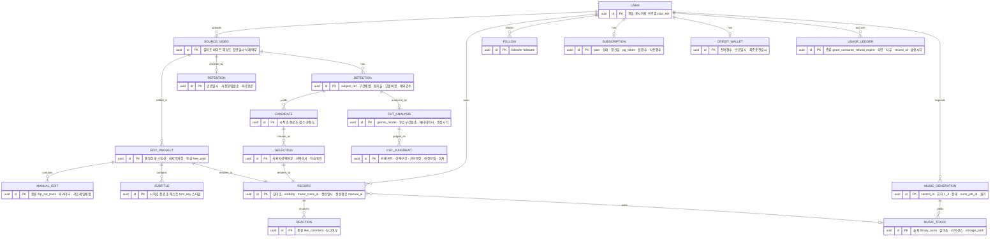

**v2.0 스키마 변경**

| 변경 | 내용 |
| --- | --- |
| 🗑 **삭제** | `GROUP` 엔터티 · `USER }o--o{ GROUP` 관계 · `RECORD.group_id` 필드 · `RECORD }o--o| GROUP` 관계 |
| ✏️ **변경** | **`RECORD.visibility ∈ {private, public}`** — 🔴 **DB `DEFAULT 'private'`로 강제**(**SRS** ADR-4 · 본 문서 ADR-07a). `group` 값 제거. `RECORD.music_id` → `music_track_id`. `RECORD.생성경로` 신설(무료 수동 / AI) |
| 🆕 **과금 4** | `SUBSCRIPTION` · `CREDIT_WALLET` · `USAGE_LEDGER` · `RETENTION` |
| 🆕 **무료 편집 3** | `EDIT_PROJECT` · `MANUAL_EDIT` · `SUBTITLE` |
| 🆕 **AI 편집 4** | `CUT_ANALYSIS` · `CUT_JUDGMENT` · `MUSIC_GENERATION` · `MUSIC_TRACK` |

**공개 범위 필드** — `RECORD.visibility ∈ {private, public}`. **서버가 모든 조회 경로에서 강제**하고, 🔴 **RLS 정책에 팔로우 조건을 넣지 않는다**(CLAUDE.md 규칙 5). 타인 프로필에서 비공개 기록은 **개수에도 잡히지 않는다**(AC4-3).

**설계 판단 3건** 초안

| # | 판단 | 근거 |
| --- | --- | --- |
| ① | **`CUT_ANALYSIS`와 `CUT_JUDGMENT`를 분리한다** | Gemini 산출물(비싸고 재사용 가능)과 Haiku 판정(싸고 프롬프트마다 다름)의 **수명이 다르다.** 분리해야 AC7-3(재판정 시 Gemini 재호출 0건)이 스키마로 보장된다. `CUT_JUDGMENT.회차`가 재판정 이력이다 |
| ② | **`USAGE_LEDGER`를 잔액과 별도로 둔다** | `CREDIT_WALLET.잔여편수`만 있으면 *"왜 줄었는가"* 를 답할 수 없다. **차감·환원·소멸이 전부 원장에 append-only로 남아야** AC8-F2(결제·적립 불일치 자동 보정)와 AC1-F4(실패 시 환원)가 검증 가능해진다 |
| ③ | **`EDIT_PROJECT`가 두 경로를 함께 받는다** | 무료(수동)와 유료(AI)가 **같은 프로젝트 테이블을 쓰고 같은 `RECORD`로 렌더된다.** 등급별로 테이블을 나누면 §4-5의 *"출력 규격 등급화 금지"* 가 코드에서 깨지기 쉬워진다 |

### 6-2. 주요 API 개요

| API | 입력 | 출력 | 제약 |
| --- | --- | --- | --- |
| `POST /uploads` | 원본 메타(길이·크기·해상도) | 업로드 세션 + 이어올리기 토큰 | 최대 **60분 / 6GB** 초안 · 재개 필수 |
| `POST /detections` | `source_video_id`, `subject_ref`(사용자 지정 1회) | `detection_id`(비동기) | **Gate A 지표 기록 필수** · 모델 버전 태깅 |
| `GET /detections/{id}` | — | 상태 · 구간 배열 · 탐지율 | 폴링/웹소켓 초안 |
| `GET /candidates` | `detection_id` | 후보 ≤ **30개**(초안) 가설 | 온전히 잡힌 구간 우선 확정 |
| `POST /records` | 선택 후보 배열 · 음악 track id | `record_id`(렌더 비동기) | **렌더 전에 기록 행 선생성**(F7 보장) |
| `PATCH /records/{id}/visibility` | `private\|public` | 변경 결과 | **v2.0 — 2종만.** 공개→비공개 전환 시 **기록 유지** 확정 · 회수 반영 지연 **≤ 60초** |
| `GET /feed` | `tab ∈ {following, recommend}` | 영상 목록 | **v2.0 — `group` 탭 제거.** 진입 기본 **following** 확정 · 공개 범위 서버 강제 · 🔴 조회 조건에 팔로우를 넣지 않고 `visibility='public'`으로 거른다 |
| `GET /users/{id}/profile` | — | 공개 기록만 | **비공개 기록은 개수에도 미포함** 확정 |
| ~~`POST /groups`~~ · ~~`/invite-link`~~ · ~~`DELETE /members/me`~~ | — | — | 🗑 **v2.0 삭제** — 그룹 기능 제외(C2) |

**v2.0 신설 API** 초안

| API | 입력 | 출력 | 제약 |
| --- | --- | --- | --- |
| `GET /entitlements` | — | `{ plan, remaining_units, expires_at, music_gen_used }` | 🔴 **RSC 직접 조회** — Server Action으로 만들지 않는다(CLAUDE.md 조회·변경 배분) · Mock은 무제한 반환 |
| `POST /edit-projects` | `source_video_id` | `edit_project_id` | **무료·유료 공통.** 잔여 0이면 **422 · Storage 쓰기 0바이트**(AC5-F1) |
| `PATCH /edit-projects/{id}` | 편집 상태 스냅샷(컷·키프레임·자막) | 저장 결과 | **자동 저장.** 🔴 편집 상태 유실 0건(AC5-F2) · 클라이언트 연산이므로 서버는 상태만 보관 |
| `POST /cut-analyses` | `detection_id`, `prompt` | `cut_analysis_id`(비동기) | 🔴 **등장 구간 밖 프레임 투입 0건**(AC7-1) · **A-T1 — 동기 대기 불가**, webhook/폴링 · Gemini 모델 버전 태깅 필수 |
| `POST /cut-judgments` | `cut_analysis_id`, `prompt` | 선택 구간 + **근거 문장** | 🔴 **근거 없는 선택 0건**(AC7-2) · **재판정 시 Gemini 재호출 0건**(AC7-3) · 판정 모델 버전 태깅 |
| `POST /music-generations` | `record_id`, 분위기·길이 | `generation_id`(비동기 · 2곡) | 🔴 **편당 3회 상한** — 4회째 **429** · 🔴 **사용자 선택 없이 확정 0건**(AC7-5) |
| `POST /checkout` | `plan ∈ {subscription, credit_pack, credit_addon}` | PG 결제 세션 | 🔴 **카드 정보 자체 저장 0건** · PG사 토큰만 · **PG사 `[TBD]`**(ADR-17) |
| `POST /webhooks/payment` | PG 결제 결과 | 200 | **Route Handler**(외부가 일으키는 사건) · 🔴 **결제·적립 불일치 잔존 0건**(AC8-F2) · 멱등 처리 필수 |
| `GET /usage-ledger` | 기간 | 차감·환원·소멸 이력 | **RSC 직접 조회** · append-only · *"왜 줄었는가"* 를 사용자에게 보인다 |
| `POST /cron/retention-sweep` | — | 파기 건수 | **Vercel Cron**(정리 배치) · 🔴 **만료 24시간 전 사전 알림**(AC8-4) · 만료 정확도 **±1시간** |
| `POST /cron/credit-expiry` | — | 소멸 건수 | **Vercel Cron** · 충전 편수 **1개월 소멸** · 🔴 **소멸이 `RECORD` 접근을 막지 않는다**(AC8-F1) |

**외부 의존 5건** — v1.0의 2건에서 늘었다. 🔺 **의존이 늘수록 결합 가용성이 곱해진다**(§5-2).

| 대상 | 용도 | 상태 |
| --- | --- | --- |
| **추적 API**(D1) | F2a·F2b — *"내가 나온 구간"* | 🔴 **미선정**(SP-1) · PoC는 자체 구현으로 실측 — §11-1 |
| **Gemini**(Vercel AI SDK) | F27 1단 — *"무엇을 했는가"* 구간 메타데이터 | 🔴 **인물 식별에 쓰지 않는다**(CLAUDE.md 규칙 2) · 단가 `[TBD]` |
| **Claude Haiku 4.5**(`claude-haiku-4-5`) | F27 2단 — 프롬프트 대조 판정 | 200K 컨텍스트 · **$1.00 / $5.00 per MTok** · §11-2 |
| **Suno** | F28 — AI 음악 생성(2곡/회) | **편당 75원**(사용자 제시) · 🔺 **1회 단가인지 편당 총액인지 확인 필요** · 🔴 `MUSIC_LICENSE` 게이트 — §11-3 |
| **PG사** | 결제 | 🔴 **`[TBD]`** — ADR-17 |
| 음악 라이브러리(F18a) | 무료 곡 | CC0 전환 검토 중(NF-016) · **곡 확보 경로 미정** 확정 |
| 공유(F21) | 카카오톡·문자 링크 | **앱 안 DM 없음(후순위)** 확정 |

07 · Scope · Risks · ADR

## 범위(In/Out), 리스크·가정·의존성

### 7-1. In / Out

| In (MVP) | Out (이번 범위 밖) |
| --- | --- |
| 이미 찍어둔 원본 **불러오기** 확정 | **앱 내 촬영** — 촬영은 이미 습관이다 확정 |
| **게시 이전의 실행 문제** — 찾기·구도·완성·반복 노동 확정 | **게시 이후의 결과 문제** — 팔로워 성장·조회수·수익화 확정 |
| 첫 카테고리 **농구·구기** 확정 | 클라이밍·필라테스 등 확장 — **시점 미정** 확정 |
| **기록 단위 공개 범위 2종**(`private`/`public`) 🆕 | 🗑 **그룹 — v2.0에서 제외**(C2) · **앱 안 DM** — 후순위 확정 |
| 좋아요·댓글·신고 **접수** 확정 · **SNS 형식 유지** 🆕 | 신고 **처리 기준·운영** — 미정 확정 |
| 팀원이 **각자 자기 원본**을 올림 확정 | **F16 한 원본 다중 사용자** — P3 확정 |
| **요금제 3종**(무료·구독·충전형) 🆕 확정 | 🔴 **팀·조직 단위 결제** — 오세진(12명)·박서연(8명)의 실제 형태이나 v2.0 범위 밖 초안 |
| **무료 기본 편집도구 4종**(좌우반전·수동컷·수동트래킹·자막) 🆕 확정 | **원본 자르기·회전 · 후보 구간 직접 조정 · 수동 구도 조정** — 규칙 4 유지 확정 |
| **프롬프트 컷 · AI 음악 · 7일 임시 보관** 🆕 확정 | **환불·구독 해지 유예·가족 계정** — 🔴 **`[TBD]`** 초안 |
| **Entitlement Resolver Mock**(전부 무제한) 확정 | **실제 Entitlement 연결** — Gate B 통과 후(PRD ADR-04) 확정 |

### 7-2. 리스크

| # | 리스크 | 영향 | 완화 |
| --- | --- | --- | --- |
| **R1** | **탐지율이 85%에 못 미친다** — Gate A 실패 | **치명.** D1이 무너지면 D2·D3·D4는 기록 앱 하나가 된다 확정 | 다른 무엇보다 F2b를 **먼저** 검증. 농구 한 종목으로 좁혀 데이터 밀도를 올린다. 실패 시 **범위를 더 좁히거나 제품 가설을 재검토** |
| **R2** | **GPU 원가가 수익 없이 선행한다** | 처리량이 북극성과 함께 늘어 **원가가 성장에 비례**한다 확정 | 편당 처리 원가 상한을 먼저 정하고, 확정 전 무제한 업로드를 열지 않는다 초안 |
| **R3** | **D1이 복제된다** — Veo·Pixellot의 B2C 하향 | 우위 소멸 확정 | 방어선을 **선택 데이터 축적(F14)**으로 옮긴다. 다만 F14는 사용자가 있어야 시작된다 → **속도가 방어다** |
| **R4** | **얼굴 정보 동의 절차 미정** | 법적 위험 · F16 착수 불가 확정 | 착수 전 법무 검토. MVP는 **본인 지정 1회** 범위로 한정 초안 |
| **R5** | **Q4가 돈을 내지 않는다** | 시장 9배지만 매출 0 확정 | 값을 편집이 아니라 **기록 축적**에서 받기로 이미 결정. 다만 **가격·시점 미정**이라 검증 불가 |
| **R6** | **근거가 전부 대리 지표다** | 마케터·해외·미국 데이터뿐, 국내 직접 조사 없음 확정 | 국내 미게시 비율 조사 **실시 여부 미정** 확정 → 베타에서 자체 로그로 대체 수집 초안 |
| **R7** 🆕 | **중간 공개 범위가 사라졌다** — 그룹 제외(C2) | 공개 선택지가 *전부에게* 아니면 *아무에게도* 둘뿐이다. **김도현의 원래 Pain이 "계정을 쪼개지 않고 대여섯 명에게만"** 이었으므로, 이 사용자는 **다시 부계정으로 돌아갈 수 있다** 초안 | **E7을 재정의**해 2종 공개 범위의 전환율 기준선을 먼저 잰다. 🔺 **전환율이 낮으면 그룹을 P1으로 되살리는 것이 첫 후보** — 제외는 v2.0 범위 결정이지 영구 폐기가 아니다 |
| **R8** 🆕 | 🔴 **무료 등급이 이탈 지점을 판다** — X3 | *"30분 초과 시 포기"* 는 v1.0이 편집 도구를 뺀 이유였다. **v2.0은 그 도구를 무료 등급에 넣었다.** 지친 사용자는 구독하는 게 아니라 앱을 지운다 초안 | **S12(무료 완주율 · 이탈 도구 분해)** 로 조기 경보 · **AC5-F2(편집 상태 복원)** 로 한 번에 끝내야 한다는 압박 제거 · **E12가 판정 실험**이고 실패 시 무료 등급 설계를 되돌린다 |
| **R9** 🆕 | **외부 추론 의존이 3곳으로 늘었다** | Gemini · Haiku · Suno. 각 99.0% 가정 시 결합 가용성 **약 97%** `[산출]` — **유료 사용자가 돈을 내고 실패를 만나는 빈도**가 v1.0보다 높아진다 초안 | **AC7-F2 대체 경로 필수**(F3 수동 선택으로 되돌림) · **실패 시 편수 차감 0건**(AC1-F4) · 외부 API 실패율 알림 **> 5% / 1시간 SLA** |
| **R10** 🆕 | 🔴 **편당 원가 합계가 아직 닫히지 않는다** | 매출 상한은 확정(편당 3,300원)인데 **Gemini 단가와 저장·전송 원가가 `[TBD]`** 다. 원가가 3,300원을 넘으면 **팔수록 손해**다 초안 | **ADR-05를 Gate A 착수 전 결정으로 유지** · §11-5의 구성요소별 상한 추정을 **실측으로 교체** · S11이 매출의 50%를 넘으면 알림 |
| **R11** 🆕 | **Suno 생성물의 배포 권리가 확인되지 않았다** | 사용자가 만든 곡을 **전체공개 기록에 실어 배포**할 권리가 없으면 F28은 *"만들 수는 있으나 올릴 수는 없는"* 기능이 된다 초안 | 🔴 **`MUSIC_LICENSE` 법무 게이트 확장** — API 약관 확인 전 F28 배포 0건. 확인 실패 시 **F28을 비공개 기록 전용으로 축소**하는 것이 대안 |

### 7-3. 가정·의존성 (ADR 후보)

| 항목 | 상태 | 결정 필요 시점 |
| --- | --- | --- |
| ~~**ADR-01** 편집으로 과금하지 않는다~~ | ⚠️ **v2.0에서 폐기 → ADR-13으로 대체**(X2) | 대체 완료 |
| **ADR-02** 관계는 팔로워·팔로잉 | ✏️ **v2.0 개정** — *"비공개 공유는 그룹"* 부분을 삭제했다. 그룹 제외로 **비공개 공유 수단이 없어졌다**(R7) | 결정 완료 |
| **ADR-03** 첫 검증은 농구 한 카테고리 | 확정 확정 | — |
| **ADR-04** 수익 모델·가격·구독 시점 | ✏️ **v2.0 개정 — 모델·가격은 확정**(§4-4), **적용 시점은 여전히 Gate B 통과 후.** 지금 만드는 것은 **Entitlement Resolver Mock**뿐이다 | 적용은 Gate B 후 |
| **ADR-05** GPU 원가 구조·편당 상한 | 확정 🔴 **미정 — 긴급도 상승.** 매출 상한(편당 3,300원)이 정해져 **원가가 그 아래인지가 사업 성립 조건**이 됐다(R10) | **Gate A 착수 전** 초안 |
| ~~**ADR-06a~d** 그룹 4건~~ | 🗑 **v2.0에서 삭제** — 그룹 기능 제외(C2) | 해당 없음 |
| **ADR-07a** 저장 직후 기본 공개 범위 | 확정 **확정 — 나만 보기(`private`)** · **DB `DEFAULT`로 강제** | 결정 완료 |
| **ADR-07b** 공개 범위 표시 방식 | ✏️ **v2.0 개정 — 글자 배지 3종 → 2종**(`공개`/`나만`) · **영상 가독성 침해 금지 조건 유지** | 결정 완료 |
| **ADR-08** 후보 30개 — 초안 수치 | 확정 **미정** | 베타 A/B로 결정 |
| **ADR-09** 팔로우 승인제 / 자동 | 확정 **미정** | 소비 루프 착수 전 |
| **ADR-10** 랭킹(F15) 도입 여부 | 확정 **미정** (시점만 P1 확정) | MVP 이후 |
| **ADR-11** 얼굴 정보 동의·보관·파기 | 확정 🔴 **미정** · **v2.0 — 위탁 대상에 Gemini·Haiku·Suno 3곳 추가** | **법무 — 최우선** |
| **ADR-12** 음악 곡 확보 경로·라이선스 비용 | 확정 **미정** · CC0 전환 검토 중(NF-016) | F18a 착수 전 |

**v2.0 신설 ADR 8건** 🆕

| 항목 | 상태 | 결정 필요 시점 |
| --- | --- | --- |
| **ADR-13** 🔴 **과금 경계 — 무료는 사람이 손으로, 유료는 AI가 대신 판단** | ✅ **확정**(사용자 결정 2026-09-01) · **SRS ADR-8을 개정한다**(X1). 🔴 **Gate A 판정 대상 = 구독 등급** · 🔴 **Gate B 판정 대상 = 무료 등급** · **금지 5건 중 품질 등급화·`τ` 차등·기록 저장 3건은 유지** — 유료 등급 내부에서 다시 나누지 않는다 | ✅ **반영 완료 — SRS v1.9**(2026-09-01). ADR-8이 게이트 판정 대상을 등급별로 분리했고, §1.3 용어·REQ-FUNC-003·§5.3 검증 기준도 동반 개정됐다 |
| **ADR-14** 무료 등급에 수동 편집 도구를 넣는다 | ✅ **확정** · **CLAUDE.md 규칙 4를 "유료 등급에 한정"으로 좁힌다**(X3). 🔴 **위험은 남는다** — E12가 판정 실험 | 🔺 **CLAUDE.md 규칙 4 개정 필요** |
| **ADR-15** 🔺 **충전 추가 1편 단가 9,900원** | 🔺 **확인 필요** — 충전 팩 편당 6,600원보다 **50% 비싸다.** 의도된 구독 유도인지, 6,600원으로 맞출지, 3편 단위 재충전만 허용할지(§4-4) | **베타 결제 오픈 전** |
| **ADR-16** 🔴 **쿼터 갱신 주기** | 🔴 **`[TBD]` 전부** — ①무료 업로드 2회가 **월 2회인가 계정당 2회인가** ②구독 3편의 **이월 여부** ③구독 해지 시 잔여 편수 처리 | **베타 결제 오픈 전** · **ADR-05 선행** |
| **ADR-17** PG사 선정 | 🔴 **`[TBD]`** — 구독(정기결제)과 단건 충전을 **한 사업자로 처리할 수 있는지**가 선정 조건 | **베타 결제 오픈 전** |
| **ADR-18** 프롬프트 컷 2단 분리 | ✅ **확정 — Gemini(구간 메타데이터) → Haiku 4.5(대조 판정).** 근거 3건은 §4-6-1. 🔴 **Gemini를 인물 식별에 쓰지 않는다** | 결정 완료 |
| **ADR-19** 🔴 **Suno 생성물의 배포 권리** | 🔴 **`[TBD]`** — 사용자가 전체공개 기록에 실어 배포할 권리가 API 약관상 있는가(R11) | **`MUSIC_LICENSE` 게이트 · F28 착수 전** |
| **ADR-20** 원본 임시 보관 7일 | ✅ **확정 — 유료 등급만 7일** · 무료는 렌더 직후 파기 · 만료 **24시간 전 사전 알림**(AC8-4) | 결정 완료 |

08 · Experiment · Rollout

## 실험·롤아웃·측정

### 8-1. 게이트 순서 — 바꿀 수 없다

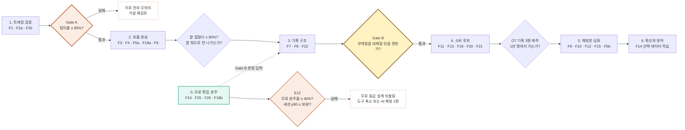

🔴 **v2.0에서 게이트 판정 대상이 등급으로 갈렸다**(ADR-13).

| 게이트 | 판정 지표 | 🔴 판정 대상 등급 | 왜 그 등급인가 |
| --- | --- | --- | --- |
| **Gate A** | 탐지율 ≥ 85% (제외 후) | **구독 등급** | AI 탐지가 구독 전용이 됐으므로 **무료 등급에는 잴 대상 자체가 없다.** 🔴 유료 등급 내부(구독 vs 충전)는 같은 모델·같은 `τ`를 쓰므로 **어느 쪽으로 재도 같은 값**이어야 한다 — 다르면 품질 등급화가 코드에 들어간 것이다 |
| **Gate B** | 기록 공간 수용성 | **무료 등급** | 기록 저장·공개 범위는 **전 등급 무료**로 남았으므로 판정이 성립한다. 🔴 **무료 등급으로 재야 결제 의사와 섞이지 않는다** — 유료 사용자는 이미 돈을 냈으므로 *"부계정을 대체할 만큼 편한가"* 에 편향이 들어간다 |
| **E12**(신규 관문) | 무료 완주율 ≥ 40% · 세션 p90 ≤ 30분 | 무료 등급 | **X3·R8의 판정 장치.** Gate가 아니라 **되돌림 조건**이다 — 실패해도 개발이 멈추지 않고 무료 등급 설계만 되돌린다 |

🔴 **순서는 그대로 바꿀 수 없다.** Gate A 실패 시 이후 단계에 착수하지 않는다.

### 8-2. 실험 설계 — 주장마다 검증 방법을 붙인다

| # | 주장 | 실험 설계(Design) | 측정 도구(Metrics) | 성공 기준 |
| --- | --- | --- | --- | --- |
| **E1** | **D1 — 말하지 않고 움직이는 사람을 추적한다** | **정답 라벨 벤치마크.** 농구 원본 **n=100편**(40분급)에 사람이 등장 구간을 수작업 표시한 정답셋 구축 → 모델 출력과 IoU 비교. 🆕 **같은 문제 클립에 Cutie와 SAM 2.1을 나란히 돌려 복구 성공률을 비교한다.** 🆕 🔴 **원본 조건을 명시한다 — 삼각대·거치대에 고정한 스마트폰 촬영본.** 전용 카메라(듀얼 4K·180° 파노라마) 영상으로 대체하지 않는다 | 구간 IoU · **탐지율(%)** · 재식별 정확도 · 오인식률 · 편당 처리 시간(초) · 🆕 **복구 성공률(Cutie vs SAM 2.1)** · 🆕 **회당 GPU 초·원가** · 🆕 🔴 **인물 픽셀 점유율** — 프레임 높이 대비 %(중앙값 · p10 · p90) | **탐지율 ≥ 85%** 확정 · 오인식 ≤ 2% 초안 → **Gate A** · 🆕 **복구 모델은 성공률·GPU 원가 둘을 함께 보고 채택**(§11-1) · 🆕 🔴 **원본이 촬영 조건을 벗어나면 탐지율 값은 Gate A 판정 근거가 아니다** |
| **E2** | **경쟁 대안 대비 우위** | **동일 원본 벤치마크.** 같은 100편을 AlphaCut·Filmora(화자 추적)와 **사람 수작업**에 각각 투입 | 탐지율 · 탐색 소요 시간(분) · 결과물 도달률 | HILiT 탐지율이 화자추적군 대비 **≥ 2배**, 수작업 대비 탐색시간 **≤ 1/12** 초안 |
| **E3** | **V2 — 구석의 나를 주인공으로 잡는다** | **주관 평가.** 리프레이밍 전/후 쌍을 **n=200쌍**, 참가자 **n=50명**에게 블라인드 제시 | **"잘 잡혔다" 5점 척도** · 4점 이상 비율 · 재촬영 의향 | **≥ 80%** 확정 · 재촬영 의향 ≤ 10% 초안 |
| **E4** | **O1 — 탐색 시간 60분 → 5분** | **전후 비교(within-subject).** 베타 사용자 **n=30명**이 자기 원본 3편을 ①기존 방식 ②HILiT으로 처리 | 스톱워치 실측(분) · 앱 내 단계별 체류 로그 | **중앙값 ≤ 5분** 확정 · 기존 대비 **≥ 12배 단축** |
| **E5** | **O2 — 전환율 4% → 60%** | **코호트 추적.** 베타 30일 코호트의 업로드 원본 대비 완성 결과물 | 원본 수 · 완성 수 · 중도 이탈 단계 | **≥ 60%** 확정 · 이탈이 특정 단계에 몰리지 않을 것 |
| **E6** | **D4 — 올리지 않아도 남는다 (Gate B)** | **A/B 테스트 (n=500).** A: 공개 범위를 저장 **후** 선택 / B: 저장 **전** 선택 | **비공개 기록 비율(%)** · 기록 생성 편수 · 마이페이지 재방문율 | 비공개 **≥ 30%** 확정 · A안이 B안 대비 기록 편수 **≥ 1.3배** 초안 |
| **E7** ✏️ | **2종 공개 범위로 충분한가 (R7)** *(v1.0 "그룹이 맞팔로우를 대체한다"에서 재정의)* | **기준선 측정 (n=500).** 그룹 없이 `private`/`public` 2종만 제공하고 공개 전환율을 잰다 | 공개 전환율 · 비공개 고착률 · **부계정 사용 여부 설문** | 🔴 **Target: TBD** — 3종 대조군이 없어 배수 비교가 불가능하다. **기준선을 먼저 만들고**, 전환율이 낮으면 그룹을 P1으로 되살리는 것이 첫 후보 |
| **E8** | **O7 — 재방문·축적 (북극성)** | **코호트 리텐션.** 주간 코호트의 D7·D30 기록 축적 | 기록 3편 도달률 · D30 재방문율 | **D30 3편 도달 ≥ 30%** 초안 → 1만 명 경로 검증 |
| **E9** | **후보 30개가 적정한가 (ADR-08)** | **A/B/n 테스트.** 후보 15 / 30 / 50개 | 선택 완료율 · 선택 소요 시간 · 선택 개수 | 선택 완료율 최대 구간 채택 |
| **E10** 🆕 | **O12 — 무료가 유료로 넘어온다** | **코호트 추적.** 무료 등급 활성 사용자의 30·60·90일 최초 결제 도달. **가격 A/B는 하지 않는다** — 표본이 부족한 상태의 가격 실험은 노이즈다 | 최초 결제 도달률 · **결제 직전 마지막 행동**(무엇이 지불을 유발했는가) · 등급별 편당 원가(S11) | 🔴 **Target: TBD** — 기준선을 먼저 만든다. **대조군은 CapCut 약 0.44%(추정치)뿐** |
| **E11** 🆕 | **프롬프트 컷이 사람 선택과 일치하는가 (F27)** | **일치도 벤치마크.** E1의 정답셋 **n=100편**에 사람이 *"3점 슛"* 등 **기준 프롬프트 10종**을 적용해 정답 구간을 표시 → Gemini+Haiku 출력과 비교 | 구간 일치율(IoU ≥ 0.5) · **근거 문장 타당성**(사람 평가 5점) · 편당 토큰·원가 · 재판정 원가 비율 | 🔴 **Target: TBD** — 기준선 없음. **다만 하한은 있다**: `[직접 고르기]` 대비 **선택 완료 시간이 짧지 않으면 지불 근거가 없다** |
| **E12** 🆕 | 🔴 **무료 등급이 이탈을 만들지 않는가 (X3 · R8)** | **완주율 + 이탈 구조 분석.** 무료 등급 30일 코호트의 편집 세션을 **도구 단위로 분해** — 컷·트래킹·자막 중 어디서 멈추는가. **v1.0의 "30분 초과 시 포기"가 재현되는지**를 본다 | 무료 완주율(S12) · **도구별 이탈률** · 편집 세션 길이 중앙값·p90 · 완주자의 D30 잔존율 | **완주율 ≥ 40%** 초안 · 🔴 **세션 길이 p90 ≤ 30분** 초안 — **초과하면 무료 등급 설계를 되돌린다**(도구 축소 또는 AI 무료 체험 1편으로 전환) |

#### 🆕 E1의 원본 조건을 왜 못 박는가

**HILiT는 촬영하지 않는다**(A-T2). 사용자가 이미 가진 원본을 받으므로, **입력이 무엇인지가 Gate A 판정의 전제**다.

| | 전용 카메라 (Veo 등) | 🔴 **HILiT가 실제로 받는 원본** |
| --- | --- | --- |
| 해상도·화각 | 듀얼 4K · 180° 파노라마 | 스마트폰 단일 렌즈 |
| 고정 | 전용 마운트 | **삼각대·거치대 또는 손** |
| 일관성 | 무인 자동 | 🔴 **촬영자에 따라 편차** |

> 🔴 **전용 카메라 영상으로 탐지율 85%를 넘겨도, 실제 입력이 스마트폰이면 그 값은 판정 근거가 아니다.**
> 조건을 명시하지 않으면 **Gate A를 통과하고도 무엇을 통과한 것인지 알 수 없다.**

**인물 픽셀 점유율을 함께 재는 이유** — §11-1 ③이 이미 지목했다. PoC 검증 영상에서 **사람 높이가 프레임 높이의 21~25%(69~85px)** 였고, OSNet 입력 256×128로 **3배 이상 업스케일**되어 임베딩 품질이 떨어졌다. **농구 코트 전경 촬영이 정확히 이 조건**이다.

🟢 **추가 비용이 거의 없다.** 탐지율을 재려면 어차피 프레임을 다 훑어야 하고, 그때 바운딩박스 높이를 함께 기록하면 된다. **한 번의 측정으로 두 가지가 닫힌다.**

| 이 항목이 닫는 것 | 어디에 쓰이나 |
| --- | --- |
| **원본 해상도 하한** | §11-1 ③의 🔴 `[TBD]` |
| **M2 — 원거리 촬영 강제 비율** | `docs/4-TAM-SAM-SOM-Market-Segment/00` 5-1절 · **게이트 1의 정량화** |

🔺 **이것이 E2에도 전파된다** — E2가 *"같은 100편"* 을 쓰므로 조건이 자동으로 승계된다. 🔴 **다만 경쟁 대안(AlphaCut·Filmora)에 유리하거나 불리한 조건이 아닌지는 별도 확인이 필요하다.**

### 8-3. 롤아웃

| 단계 | 대상 | 규모 초안 | **판정 지표** | **판정 주체** 초안 | **판정 시점** 초안 | **실패 시 행동** 초안 |
| --- | --- | --- | --- | --- | --- | --- |
| **α 내부** | 팀 + 농구 동호회 1곳 | 20명 · 원본 100편 | **E1 탐지율 ≥ 85%** (Gate A · **구독 등급으로 판정**) · 🆕 **Cutie vs SAM 2.1 복구 성공률·GPU 원가** | AI 리드 + 제품 리드 **공동** | 정답셋 100편 처리 완료 시 | **다음 단계 진입 금지.** 모델 재학습 또는 **제품 가설 재검토** |
| **β 비공개** | Q1 농구 사용자 | 200명 | E3 ≥80% · E4 ≤5분 · E5 ≥60% · 🆕 **E11 프롬프트 컷 기준선** · 🆕 **E12 무료 완주율 ≥40%** | 제품 리드 | 코호트 30일 경과 시 | 미달 지표만 개선 후 **재판정**, 공개 베타 보류. 🔴 **E12 실패 시 무료 등급 설계를 먼저 되돌린다** |
| **β 공개** | 농구 카테고리 | 2,000명 | **E6 비공개 ≥30%** (Gate B · **무료 등급으로 판정**) · 🆕 **E7 2종 공개 범위 기준선** | 제품 리드 | A/B n=500 도달 시 | Gate B 미달 시 **기록 공간 UX 재설계** — 소비 루프 확장 중단 |
| **β 결제** 🆕 | β 공개 완주자 | 🔴 **`[TBD]`** — ADR-05·ADR-16 확정 후 산정 | 🆕 **E10 전환율 기준선** · 🆕 **S11 편당 실처리 원가 < 편당 매출 3,300원** | 제품 리드 + 경영 | 최초 결제 100건 도달 시 | 🔴 **S11이 매출을 넘으면 요금제를 먼저 고친다** — 사용자를 늘리면 손실이 커진다 |
| **정식** | 농구 → 구기 확장 | — | E8 D30 3편 ≥30% | 제품 리드 + 경영 | 월말 판정 | 확장 시점 연기 — *확장 기준 자체가 **미정*** 확정 |

🔴 **β 결제 단계를 β 공개 뒤에 둔 이유** — CLAUDE.md 절대 규칙 6: *"페이월을 첫 완주 이전에 노출하지 않는다 — Gate B 판정이 오염된다."* 결제를 먼저 열면 Gate B의 *"기록 공간이 부계정을 대체하는가"* 가 *"돈을 낼 만한가"* 와 섞여 판정이 무의미해진다.

09 · Proof

## 근거(Proof)

### 9-1. 직접 근거 — 조사 9건

**불리한 데이터를 지우지 않았고, 출처를 대지 못하는 수치는 유리하더라도 지웠다.** 확정

이전 판이 최우선 근거로 쓰던 홈비디오 연구의 19%·89%는 **원 출처를 찾지 못해 폐기**했다. 확정

| 근거 | 핵심 수치 | 증명하는 것 | 한계 |
| --- | --- | --- | --- |
| Pew Research 2023 | 틱톡 이용자 2,745명 중 성인 약 **절반이 한 번도 게시 안 함** | **Q4가 최대 시장** | 미국 데이터 |
| Adobe 2024 | 경험 부족 59% · 교육 56% · **시간 52%** | 문제는 "프로그램이 어렵다"가 아니라 **촬영 이후 반복 노동** | 크리에이티브 직군 |
| Wyzowl 2024·2025 | 미사용 마케터 **33% 시간 부족 1위** · 68% 내년 시작 계획 | 비용·ROI보다 **시간이 최대 장벽** | 마케터 대상 |
| OpusClip·Wyzowl 2026 | **72.9%가 팔로워 1만 미만** · Talking-head 56.89% · AI 도구 51%→63% | 작은 크리에이터 중심 · **AI 트래킹 적합성** | 자사 데이터 — 편향 |
| Podia 지불의사 | 추가 자금 시 **43%가 외부 인력 고용** | 지불의사 대리 지표 | 가정 질문 — 실제 결제 아님 |
| MBO Partners 2024 | 독립 크리에이터 **46% 성공 어려움 · 41% 번아웃** | **"영상 1개 × 매주 반복"**이 실제 문제 | 편집을 원인으로 특정 안 함 |
| 2023 CHI 학술연구 | 틱톡 내부 편집조차 UI·학습곡선이 장벽 | 숏폼은 **짧은 시간에 많은 판단** | 정성 연구 |
| 홈비디오 편집 선행연구 2편 | *수치 폐기* — 정성 근거로만 유지 | 편집 의도의 존재 | 비율 수치 없음 |
| **Podia 조사(900명+)** `불리한 근거` | **오디언스 성장 32.9%** · 시간 21.6% · 수익화 14.4% | 1위 고민은 편집이 아니다 → **범위를 좁히는 것이 더 강한 논증** | 해외 크리에이터 |

가설 **남은 정량 근거 9건은 모두 마케터·해외 크리에이터·미국 이용자 대상의 대리 지표다.** 국내 직접 조사는 없다(R6). 확정

### 9-2. 대안 커버리지 — Core Job 7조건

`● 제공 · ◐ 부분·제약 · — 가능하나 목적 아님 · ○ 미제공` 확정

| 대안 | 긴 원본 | 인물 자동탐색 | 사람 선택 | 구도 보정 | 개인 보관 | 공개범위 분리 | HW 불필요 |
| --- | --- | --- | --- | --- | --- | --- | --- |
| **HILiT** | ● | ● | ● | ● | ● | ● | ● |
| Instagram | — | ○ | ● | ○ | ◐ | ◐ | ● |
| TikTok | — | ○ | ● | ○ | ○ | ◐ | ● |
| CapCut | ● | ○ | ● | ◐ | ○ | ○ | ● |
| VLLO | ● | ○ | ● | ○ | ○ | ○ | ● |
| setlog | ○ | ○ | ○ | ○ | ● | ● | ● |
| Veo | ● | ● | ◐ | ● | ◐ | ○ | ○ |
| Pixellot | ● | ● | ○ | ● | ◐ | ○ | ○ |
| Hudl | ● | ● | ● | ● | ◐ | ○ | ○ |
| AlphaCut·Filmora | ● | ◐ 화자만 | ● | ◐ | ○ | ○ | ● |
| 아무것도 안 함 | — | ○ | — | ○ | ○ | — | ● |

**HILiT만 일곱 칸이 전부 채워진다. 다만 이것은 계획이지 실적이 아니다.** 인물 자동 탐색의 정확도가 검증되지 않으면 첫 칸부터 무너진다. 확정

### 9-3. 내부 참조 문서

| 문서 | 역할 |
| --- | --- |
| [`docs/VPS/VPS_v0_3.html`](../VPS/VPS_v0_3.html) · [`.md`](../VPS/VPS_v0_3.md) | **본 PRD의 원천.** 페르소나·Pain·JTBD·Outcome·차별점·Proof·기능 원장 |
| [`docs/prototype/prototype_v0_6.html`](../prototype/prototype_v0_6.html) | **화면↔기능(F번호) 매핑의 기준.** 관계 모델·공개 범위·탭 구성 |
| [`docs/4-TAM-SAM-SOM-Market-Segment/tam-sam-som-segment-sns-shortform.md`](../4-TAM-SAM-SOM-Market-Segment/tam-sam-som-segment-sns-shortform.md) | 세그먼트 Q1~Q4 정의 · SAM/SOM · 근거 데이터 10건 |
| [`docs/5-Persona/CW-personas.html`](../5-Persona/CW-personas.html) | 페르소나 9명 · CJM Pain · JTBD 선언 |
| [`docs/3-KSFs/`](../3-KSFs/) · [`docs/2-Value-Chain/`](../2-Value-Chain/) · [`docs/1-Five-Forces/`](../1-Five-Forces/) | KSF 5번(선택 데이터 순환) · GPU 원가 · 경쟁 구조 |
| [`HILIT_추적PoC_기술기획서.md`](./HILIT_추적PoC_기술기획서.md) 🆕 | 🔴 **§11 기술 검토의 유일한 실측 근거.** 기준 커밋 `eecb1ce` · 2026-09-01 · Python 12,357줄. 모델 4종·Mobile-First Hybrid·4단계 복구·N-Level·GPU 원가 실측 |
| [`SRS/[SRS]hilit-SRSv1.8.md`](./SRS/[SRS]hilit-SRSv1.8.md) 🆕 | **요구사항 단일 진실 원천**(REQ-FUNC 27 · REQ-NF 19). ✅ **v1.9에서 ADR-8을 이 문서의 ADR-13과 정합하도록 개정 완료**(X1 해소) — 파일명은 v1.8 그대로이고 판 이력이 v1.9다 |
| [`docs/grill/GRILL_LEDGER.md`](./docs/grill/GRILL_LEDGER.md) 🆕 | 미해소 결정 토픽 원장 — 🔴 **ADR-15·16·17·19의 결정 경로** |
| `hilit-prd-v1_0.md` | **직전 판** — MVP **17개** · 그룹 포함 · 과금 미정. 본 문서가 **23개 · 그룹 제외 · 과금 3종**으로 대체 |
| `hilit-prd-v0.1.html` | 선행 판 — MVP **12개** 기준 |

10 · Appendix & Decision Log

## 부록 · 이 PRD가 새로 제안한 것( 초안 ) 요약

VPS 0.3에 근거가 없어 이 문서가 초안으로 제시한 항목이다. **착수 전 합의가 필요하다.**

1. **NFR 전 항목**(5장) — p95 응답·가용성·오류율·재시도 정책
2. **데이터 모델과 API 계약**(6장) — 엔터티·필드·엔드포인트·상한
3. **AC의 시스템 임계치** — 재식별 정확도 90% · 오인식 2% · 렌더 90초 등
4. **실험 표본 수와 성공 기준** — n=100편 / n=50명 / n=500 A/B
5. **롤아웃 규모** — α 20명 → β 200명 → 2,000명
6. **원가 가드레일** — 편당 처리 원가 상한 확정 전 무제한 업로드 금지
7. **이벤트 계측 스키마 8종** — `detection_started` · `selection_opened` · `selection_confirmed` · `render_started` · `render_succeeded` · `source_deleted` · `reframe_rating` · `upload_completed` → §1-4·§1-5의 **측정 경로가 전부 이 8종에 의존**한다. **데이터팀 확정 필요** — 이름·페이로드·전송 시점이 정해지지 않으면 지표 산식은 있으나 데이터가 쌓이지 않아 대시보드가 빈 화면이 된다
8. **S10 파이프라인 완주율 신설** — `render_succeeded ÷ detection_started`, 목표 **≥ 95%**, 주간, 백엔드 리드 판정 → **실패 AC 14종(`AC*-F*`)의 상위 지표.** 개별 AC는 통과/실패만 알려주고 "실제로 몇 명이 어디서 이탈했는가"는 알려주지 않는다. 이 한 지표가 그 누수를 잡는다

**v2.0이 새로 제안한 것 6건** 🆕

9. **요금제 3종의 구조**(§4-4) — 가격·편수·유효기간은 사용자 확정값이나, **갱신 주기·이월·해지 처리**(ADR-16)와 **추가 1편 단가 역전**(ADR-15)은 이 문서가 제기한 미결이다
10. **무료/유료 경계의 원가 근거**(§1-1 · §4-5) — *"무료 = 원가 ≈ 0"* 은 이 문서의 설계 주장이다. **AC5-2(GPU 0회)·NFR(무료 GPU 초 = 0 알림)** 이 그 주장을 코드로 검증 가능하게 만든 장치다
11. **프롬프트 컷의 2단 분리**(§4-6-1 · ADR-18) — 사용자는 *"Gemini가 메타데이터, Haiku가 판정"* 까지 지정했고, **왜 나누는가(재판정 원가·근거 표시·인물 식별 차단)** 와 **추적 → Gemini 순서 강제**는 이 문서가 붙인 설계다
12. **엔터티 11종 신설**(§6-1) — 과금 4 · 무료 편집 3 · AI 편집 4. **`CUT_ANALYSIS`/`CUT_JUDGMENT` 분리**와 **`USAGE_LEDGER` append-only**가 핵심 판단
13. **게이트 판정 대상의 등급 분리**(§8-1 · ADR-13) — Gate A = 구독 · Gate B = 무료. **SRS ADR-8 개정을 요구하는 변경**이다
14. **E10·E11·E12 실험 3종**(§8-2) — 특히 **E12가 무료 등급 설계의 되돌림 조건**을 명시적 임계로 만든 것

**가장 급한 것 4건 — 순서가 있다** 🆕

| 순위 | 항목 | 왜 급한가 | 선행 |
| :--: | --- | --- | --- |
| **1** | **ADR-11** 얼굴 정보 동의·보관·파기 | 법무 게이트. **v2.0에서 위탁 대상이 Gemini·Haiku·Suno 3곳 늘었다** — 체크리스트를 다시 짜야 한다 | — |
| **2** | **ADR-05** 편당 처리 원가 상한 | 🔴 **매출 상한이 확정됐다(편당 3,300원).** 원가가 그 위면 **팔수록 손해**다(R10). Gate A 착수 전 필수 | — |
| **3** | **ADR-16** 쿼터 갱신 주기 | 무료 2회·구독 3편의 **주기가 없으면 Entitlement Resolver를 구현할 수 없다** | **ADR-05** |
| **4** | **ADR-19** Suno 배포 권리 | 확인 실패 시 F28이 *"만들 수는 있으나 올릴 수는 없는"* 기능이 된다(R11) | — |

> 🔺 **ADR-15(추가 1편 단가 역전)는 급하지 않으나 잊기 쉽다.** 베타 결제 오픈 전에 결정하면 되지만, 결정하지 않으면 **9,900원이 그대로 출시된다.**

**리뷰 반영 이력** — v0.2 단계, 2026-08-29 [`hilit-prd-v0.2-review.md`](./hilit-prd-v0.2-review.md)의 측정·검증 가능성 리뷰를 반영해 §1-4·§1-5·§1-6·§3·§5-3·§5-5·§8-3을 교체했다. 전 지표에 측정 경로와 판정 주체를 부여하고, 실패 AC를 1건에서 8건으로 늘렸다.

**2026-08-29 결정 6건** — v1.0 단계에서 확정한 6건 중 **그룹 관련 4건(ADR-06a~d)은 v2.0에서 기능과 함께 삭제**됐다. 남은 2건은 유효하다.

| 결정 | 값 | 채워진 곳 | v2.0 상태 |
| --- | --- | --- | --- |
| ~~**ADR-06a** 그룹 인원 상한~~ | ~~20명~~ | — | 🗑 **삭제** |
| ~~**ADR-06b** 나갔을 때 기록 처리~~ | ~~그룹에서 함께 회수~~ | — | 🗑 **삭제** |
| ~~**ADR-06c** 초대 방식~~ | ~~링크 초대 · 가입자만~~ | — | 🗑 **삭제** |
| ~~**ADR-06d** 그룹 이름 중복~~ | ~~허용~~ | — | 🗑 **삭제** |
| **ADR-07a** 기본 공개 범위 | **나만 보기(`private`)** · **DB `DEFAULT` 강제** | AC4-1 · §4-3 상태도 | ✅ **유효** |
| **ADR-07b** 공개 범위 표시 | **글자 배지** · **영상 가독성 침해 금지** | AC4-2b | ✏️ **개정 — 3종 → 2종**(`공개`/`나만`) |

**ADR-07b가 왜 여전히 유효한가** — 공개 범위를 기록마다 정하는 것이 이 제품의 핵심 주장이므로 **표시하지 않는 선택지는 없다.** 아이콘은 뜻을 배워야 하지만 글자는 즉시 읽힌다. 배지가 2종으로 줄어 **가독성 조건(대비 4.5:1 · 면적 8% · 중앙 안전영역)은 오히려 지키기 쉬워졌다.**

### 10-1. 판본 이력

| 판 | 날짜 | 변경 |
| --- | --- | --- |
| v0.1 | — | 초판 — MVP 12개 |
| v0.2 | 2026-08-29 | 측정·검증 가능성 리뷰 반영. 전 지표에 측정 경로·판정 주체 부여, 실패 AC 1건 → 8건 |
| v1.0 | 2026-08-29 | v0.2를 확정판으로 승격. 내용 변경 없음. MVP 17개 · 그룹 포함 · **과금 전부 미정** |
| **v2.0** | **2026-09-01** | 🔴 **편집 서비스 과금 모델 신설**(무료·구독·충전형) · **그룹 전면 제외** · **공개 범위 3종 → 2종** · **무료 기본 편집도구 4종** · **프롬프트 컷(Gemini→Haiku 4.5)** · **AI 음악(Suno)** · **원본 임시 보관 7일** · **§11 기술 검토 신설**. MVP 17개 → **23개** · AC 33개 → **44개** · ADR 신설 8건 · 실험 신설 3건 |

**v2.0 확정** — 2026-09-01. **상위 문서 개정 3건 중 2건 완료** — ✅ **X1 SRS ADR-8 → v1.9에서 개정 완료**(Gate A = 구독 · Gate B = 무료) · ✅ **X2 PRD ADR-01 폐기 → ADR-13으로 대체**(본 문서 §7-3) · 🔺 **X3 CLAUDE.md 규칙 4·6 개정은 남아 있다.** 남은 미정은 **ADR-04·05·08·09·10·11·12·15·16·17·19 열한 건**이고, 그중 **ADR-11 · ADR-05 · ADR-16 · ADR-19 네 건**이 착수 전에 답이 필요하다. **공수·스프린트 추정은 개발팀 합류 시점에 채운다.**

---

11 · Technical Review

## 기술 검토 🆕 v2.0

이 장은 **§4의 기능이 실제로 만들어지는가**를 판정한다. 근거는 두 곳이다 — **추적은 자체 PoC 실측**(`HILIT_추적PoC_기술기획서.md` · 커밋 `eecb1ce`), **프롬프트 컷·음악은 공개 사양과 산출**이다. 🔴 **실측이 아닌 값에는 전부 표시를 달았다.**

### 11-1. 트래킹 — PoC가 답한 것과 답하지 못한 것

#### 채택 구조 — Mobile-First Hybrid (PoC V3)

**Cutie를 주 추적기에서 내리고 복구 전문 모델로 격하한 것**이 이 구조의 핵심이다. Cutie는 프레임마다 메모리 뱅크를 갱신하므로 20분 영상이면 GPU를 20분 넘게 점유한다 — **원가에서 무너진다.**

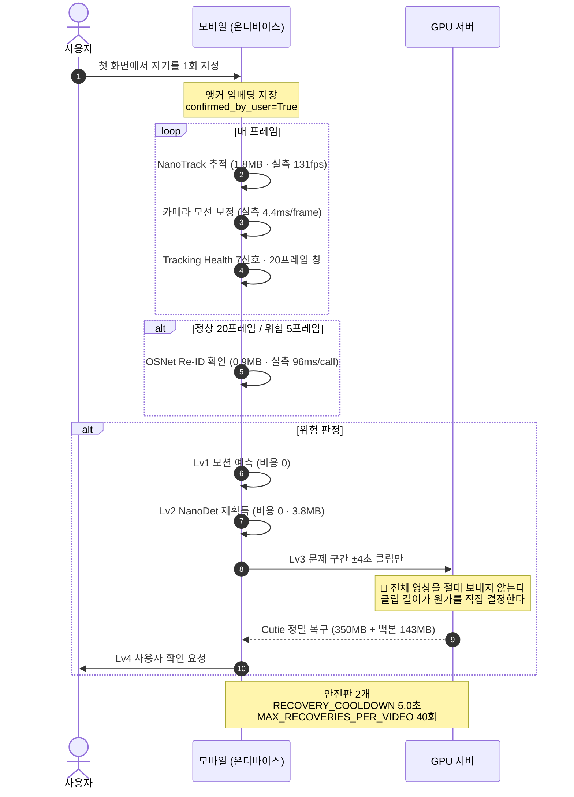

#### 실측값 — 조건을 붙인 것만 적는다

| 항목 | 실측 | 측정 조건 |
| --- | --- | --- |
| NanoTrack | **131 fps** · 7.6 ms/frame | **개발 PC의 CPU** · 720p 프록시 |
| OSNet (ONNX) | **96 ms/call** | 같은 조건 · 20/5프레임 주기 |
| NanoDet | **40 ms/call** | 같은 조건 · 필요할 때만 |
| 카메라 모션 보정 | **4.4 ms/frame** | 0.35배 축소 · sparse Lucas-Kanade |
| peak working memory | **161 MB** | 같은 조건 |
| 서버 복구 1회 | **GPU 35~60초 · 약 10~17원** | **MX250** · ±4초 클립(160프레임) · `GPU_COST_PER_HOUR_KRW = 1012.45`(RTX 4090 기준 단가) |
| 실제 영상 추적 | **coverage 평균 72.2%**(최저 62.4 · 최고 81.9) | 720×334 · 23.72fps · **7.08초** · 5명 동시 추적 |

🔴 **모바일 수치는 전부 개발 PC의 CPU에서 잰 것이다.** 안드로이드 실기 온도·배터리는 **미측정**(PoC §5.4 · §7.7). 무료 등급의 수동 트래킹이 온디바이스로 도는 이상 **실기 측정이 무료 등급 성립의 전제**다.

#### 🔴 Gate A 착수 전에 알아야 할 미검증 4건

| # | 미검증 항목 | PoC 근거 | v2.0에 미치는 영향 |
| --- | --- | --- | --- |
| **①** | **모바일 재획득(Lv2)이 한 번도 성공하지 못했다** — 합성 0/42 · 실제 0/17 | §7.3 · 실패 원인이 서로 다르다(합성=테스트 데이터, 실제=임베딩 품질) | Lv2가 안 되면 **모든 복구가 Lv3(GPU 서버)로 몰린다** → 편당 원가가 상한(§11-5)에 붙는다 |
| **②** | **잘못 추적하는데 감지하지 못한다** — H_similar에서 **ID Switch 10회 동안 서버 호출 0회** | §5.2 · *"Coverage 수치보다 이게 급한 문제"* | 🔴 **Gate A의 탐지율이 통과해도 "엉뚱한 사람"일 수 있다.** IoU 채점은 *"사람 위에 있다"* 를 정탐으로 세기 때문 |
| **③** | **사람이 작으면 Re-ID가 무력하다** — 프레임 높이의 **21~25%**(69~85px)에서 OSNet 입력 256×128로 **3배 이상 업스케일** | §7.2 | 농구 코트 전경 촬영이 정확히 이 조건이다. **원본 해상도 하한**을 요구사항으로 정해야 한다 — 🔴 `[TBD]`. ✅ **측정 경로 확보(§8-2 E1)** — 인물 픽셀 점유율을 Gate A 실측에 포함해 하한을 도출한다 |
| **④** | **N-Level 원가 절감 효과 미측정** — Critical 우회(`CRITICAL_ID_THRESHOLD = 0.35`)가 N-Level을 건너뛰어 6개 구성이 사실상 동일했다 | §5.2 · §7.6 | **N-Level이 원가 손잡이로 설계됐는데 그 효과를 모른다.** ADR-05(편당 원가 상한)의 입력이 비어 있다 |

#### 🆕 Gate A 실측에 추가할 것 — 복구 모델 비교

> 🆕 **같은 문제 클립에 Cutie와 SAM 2.1을 나란히 돌려 복구 성공률을 비교한다.**

**왜 필요한가** — Lv3(서버 복구)는 **편당 원가를 결정하는 단일 지점**이다(§11-5). PoC는 Cutie 하나만 썼고 *"복구 3회, 정상 복구"* 로 동작만 확인했을 뿐 **다른 선택지와 비교한 적이 없다.** 복구 성공률이 높으면 호출 횟수가 줄어 원가가 내려가고, 낮으면 Lv4(사용자 확인)로 넘어가 **사용자 시간을 쓴다.**

| 측정 항목 | 왜 재는가 |
| --- | --- |
| **복구 성공률** — 같은 문제 클립에서 대상을 되찾은 비율 | 두 모델을 가르는 1차 기준. **동일 클립·동일 정답 궤적**에 나란히 투입한다 |
| **회당 GPU 초 · 원가** | 성공률이 같다면 **싼 쪽이 이긴다.** Cutie 실측은 회당 35~60초(MX250) |
| **peak VRAM** | 배포 가능한 GPU 등급을 정한다. Cutie 실측 **423MB**(MX250 2GB에서 동작) |
| **ID Switch 재발률** — 복구 직후 다시 갈아타는가 | 미검증 항목 ②와 직결. **복구했다가 다시 잃으면 성공이 아니다** |
| **라이선스** | Cutie는 **MIT**(PoC §9). SAM 2.1은 **Apache-2.0**으로 알려져 있으나 🔺 **배포 조건 원문 확인 필요** — GPL·AGPL·Non-Commercial 의존성이 없어야 한다는 PoC의 기준을 유지한다 |

🔴 **비교 조건을 고정한다** — ①같은 문제 클립(±4초 · 160프레임) ②같은 정답 궤적 ③**IoU ≥ 0.30 채점**(PoC가 자기보고를 버리고 채택한 기준) ④같은 GPU. 조건이 다르면 두 숫자를 나란히 놓을 수 없다.

🔺 **채택 기준은 성공률 단독이 아니다.** 성공률이 높아도 GPU 초가 2배면 편당 원가가 매출 상한(3,300원)을 밀어올린다. **성공률과 원가를 함께 보고 판정**하며, 판정 주체는 **AI 리드 + 백엔드 리드 공동**이다.

### 11-2. 프롬프트 컷 — Gemini + Claude Haiku 4.5

#### 파이프라인 사양

| 단계 | 모델 | 입력 | 출력 | 근거 |
| --- | --- | --- | --- | --- |
| **1단** | **Gemini**(Vercel AI SDK · C-TEC-005·006) | 🔴 **추적이 좁힌 등장 구간 영상만** | 구간 메타데이터 `[{start, end, 행동서술}]` | *"무엇을 했는가"* 만 판단. 🔴 **인물 식별에 쓰지 않는다** |
| **2단** | **Claude Haiku 4.5** (`claude-haiku-4-5`) | 메타데이터(텍스트) + 사용자 프롬프트 | 선택 구간 + **근거 문장** | **200K 컨텍스트 · $1.00 / $5.00 per MTok** |

#### 컨텍스트가 들어가는가 — 산출

20분(1,200초) 원본 중 **등장 구간이 6분(360초)** 인 경우를 기준으로 잡는다. 🔺 *등장 구간 비율은 실측이 없어 가정이다.*

| 구간 밀도 | 구간 수 | 구간당 토큰 | 합계 | 200K 대비 |
| --- | --- | --- | --- | --- |
| 5초 단위 | 72 | ~80 | **약 5,800 토큰** | 3% |
| 3초 단위 | 120 | ~80 | **약 9,600 토큰** | 5% |
| 1초 단위 | 360 | ~80 | **약 28,800 토큰** | 14% |

🟢 **1초 단위로 잘라도 200K의 14%다 — 컨텍스트는 병목이 아니다.** 프롬프트·시스템·출력을 다 더해도 여유가 크다.

🔺 **다만 상한을 코드로 걸어야 한다.** 등장 구간이 20분 전체에 가까운 원본(대상이 계속 화면에 있는 경우)에서 1초 단위 서술이면 **약 96,000 토큰**까지 오른다. **구간 서술 밀도 상한**과 **200K 초과 시 청킹**을 요구사항으로 둔다 — 🔴 `[TBD]`.

#### 판정 원가 — 산출

| 항목 | 값 | 산출 |
| --- | --- | --- |
| Haiku 입력 | ~20,000 토큰 | $1.00/1M × 0.02M = **$0.02** |
| Haiku 출력 | ~2,000 토큰 | $5.00/1M × 0.002M = **$0.01** |
| **Haiku 편당 소계** | **약 $0.03** `[산출]` | 🟢 편당 매출($ 환산 전 3,300원) 대비 무시 가능 |
| **재판정 1회** | **약 $0.03** `[산출]` | 🔴 **Gemini 재호출이 없으므로 재판정도 같은 금액** — 이것이 2단 분리의 경제적 근거다 |
| **Gemini 1단** | 🔴 **`[TBD]`** | 영상 토큰 단가·해상도 옵션을 **실측으로 채운다**. 🔺 공개 사양상 영상은 **초당 고정 토큰**으로 계산되며 저해상도 옵션이 있다고 알려져 있으나 **원문 확인 전까지 숫자를 적지 않는다** |

> 🔴 **원화 환산을 적지 않았다.** 환율을 가정하면 그 가정이 이후 모든 원가표에 복제된다. **달러로 두고, ADR-05에서 환율과 함께 확정한다.**

#### 기술 리스크 4건

| # | 리스크 | 완화 |
| --- | --- | --- |
| **①** | 🔴 **A-T1 — Vercel 함수 실행 시간 상한.** 20분 영상의 Gemini 처리는 **동기로 기다릴 수 없다** | **Route Handler에서 동기 대기 금지.** Gemini 비동기 제출 → `cut_analysis_id` 반환 → **webhook 또는 사용자 재진입이 재개 트리거**(A-T3 — 상주 데몬 없음) |
| **②** | 🔺 **행동 서술의 어휘가 프롬프트와 안 맞는다.** Gemini가 *"슛"* 이라 쓰고 사용자가 *"3점"* 이라 적으면 Haiku가 못 맞춘다 | **1단 프롬프트에 서술 어휘 규격을 고정**한다(동작·위치·결과 3요소). E11이 일치율을 잰다 |
| **③** | 🔺 **모델 버전이 바뀌면 메타데이터 의미가 바뀐다** | `CUT_ANALYSIS.gemini_model` · `CUT_JUDGMENT.판정모델` **버전 태깅 필수**(§6-2). 추적 PoC가 모델 버전 태깅을 요구한 것과 같은 이유 |
| **④** | 🔺 **외부 2곳 의존 — 가용성이 곱해진다** | AC7-F2 대체 경로(F3 수동 선택) · 🔴 **실패 시 편수 차감 0건** |

#### 🟢 이 설계가 지키는 것

- 🔴 **Gemini를 인물 식별에 쓰지 않는다** — 입력이 이미 *"내 구간"* 이라 인물을 판단할 여지가 없다. **문서가 아니라 파이프라인이 규칙을 강제한다**
- 🔴 **AI가 무엇을 골랐는지 표시한다** — `CUT_JUDGMENT.근거문장`이 그 표시의 원천
- 🔴 **`[직접 고르기]` 병존** — 프롬프트 컷은 F3·F4를 **대체하지 않고 앞에 붙는다**

### 11-3. AI 음악 — Suno

| 항목 | 값 | 상태 |
| --- | --- | --- |
| 생성 단가 | **편당 75원** | 사용자 제시 · 🔺 **1회(2곡) 단가인지 편당 총액인지 확인 필요** |
| 1회 산출 | **2곡** | 확정 |
| 편당 상한 | **3회** | 확정 → 🔺 *"1회 = 75원"* 해석 시 **편당 최대 225원** |
| 선택 | 🔴 **2곡 중 사용자가 고른다** | 확정(D2) — 자동 확정 금지 |

**원가 판정** 초안 — *"1회 = 75원"* 의 최악 해석(편당 3회 전부 소진)에서도 **편당 225원**으로, 편당 매출 3,300원의 **약 7%** 다. 🟢 **음악은 원가 위험이 아니다.**

🔴 **권리가 원가보다 위험하다**(R11 · ADR-19). 사용자가 만든 곡을 **전체공개 기록에 실어 배포**할 권리가 API 약관상 사용자에게 있는지 확인해야 한다. **`MUSIC_LICENSE` 법무 게이트를 F28로 확장**하며, 확인 실패 시 대안은 **F28을 `visibility='private'` 기록 전용으로 축소**하는 것이다.

🔺 **종량제의 음악 추가 과금은 `[TBD]`**(사용자 미정). 하한은 원가(75원)이며, 상한은 *"라이브러리 무료 곡이 있는데 굳이 살 만한가"* 가 정한다.

### 11-4. 자막 폰트 — OFL 4종

| 폰트 | 라이선스 | 상태 |
| --- | --- | --- |
| **Pretendard** | SIL OFL 1.1 | 🟢 확인 가능 |
| **본고딕**(Noto Sans KR / Source Han Sans) | SIL OFL 1.1 | 🟢 확인 가능 |
| **나눔글꼴** | SIL OFL 1.1 | 🟢 확인 가능 |
| **Freesentation** | 🔺 **`[확인 필요]`** | 배포처·라이선스 원문을 확인하기 전에는 OFL로 단정하지 않는다 |

**OFL이 요구하는 것 2건** — 지키면 상업적 이용·번들·임베드가 전부 가능하다.

| 조항 | 이 제품에서의 의미 |
| --- | --- |
| **라이선스 사본 동봉** | 🔴 앱 내 라이선스 고지 화면에 **OFL 전문 포함**(AC5-3) |
| **Reserved Font Name** | 🔴 **폰트를 수정해 원래 이름으로 배포하지 않는다.** 서브셋팅(한글 자주 쓰는 글자만 추리기)은 흔한 최적화인데, **파일명·패밀리명을 유지한 채 수정하면 위반**이다 |

🟢 **자막을 영상에 굽는 것(래스터화)은 폰트 배포가 아니다** — 출력 영상에 라이선스가 전이되지 않는다. **웹폰트로 서빙할 때만** 사본 동봉 의무가 발생한다.

### 11-5. 편당 원가 — 합계가 아직 닫히지 않는다

**매출 상한은 확정됐다.** 구독 9,900원 ÷ 3편 = **편당 3,300원.**

| 구성요소 | 상한 추정 | 산출 근거 | 상태 |
| --- | --- | --- | --- |
| **트래킹 GPU** | **약 400~680원** | PoC `MAX_RECOVERIES_PER_VIDEO = 40` × 회당 10~17원(MX250 실측) | 🔺 **상한이지 기댓값이 아니다.** Lv2 재획득이 0/17이라(§11-1 ①) **실제로 상한에 붙을 위험이 있다** |
| **Gemini 1단** | 🔴 **`[TBD]`** | 영상 토큰 단가 미확인 | 🔴 **합계를 막는 유일한 큰 구멍** |
| **Haiku 2단** | 약 **$0.03** | §11-2 산출 | 🟢 무시 가능 |
| **AI 음악** | **최대 225원** | 75원 × 3회 | 🔺 단가 해석 확인 필요 |
| **저장·전송** | 🔴 **`[TBD]`** | 20분 원본 + 7일 보관 + 결과물 영구 보관 | 🔴 **F29(7일)가 이 항목을 키운다** |
| **합계** | 🔴 **닫히지 않음** | — | **ADR-05의 결정 대상** |

**지금 말할 수 있는 것 3가지** 초안

1. 🟢 **무료 등급은 원가가 없다.** GPU 0초 · 외부 추론 0호출 · 원본 즉시 파기. 남는 것은 **결과물 영구 보관의 저장 원가**뿐이며, 이는 15초 결과물이라 원본 대비 자릿수가 다르다
2. 🔺 **알려진 항목만 더해도 편당 약 900원**(GPU 상한 680 + 음악 225)으로 **매출의 27%** 다. Gemini와 저장·전송이 나머지 73%를 넘지 않아야 한다
3. 🔴 **트래킹 GPU가 가장 큰 단일 항목이고, 가장 줄일 여지도 크다.** PoC가 명시한 세 손잡이 — **클립 길이**(±4초 → ±10초면 원가 2.5배) · **N-Level** · **MAX_RECOVERIES** — 가 전부 원가에 직결한다. 🔴 **셋 다 효과가 미측정**이다(§11-1 ④)

🔴 **`MAX_RECOVERIES_PER_VIDEO = 40`이 20분 영상에도 유효한지 확인하지 않았다.** PoC의 검증 영상은 **7초·1.5분**이었다. 20분이면 40회 상한이 **조기 소진**돼 이후 구간이 복구 없이 진행될 수 있다 — 원가는 지켜지지만 **탐지율이 떨어진다.** Gate A 실측에서 **영상 길이별 복구 호출 분포**를 함께 봐야 한다.

### 11-6. Vercel 제약과의 정합 — A-T1·A-T2·A-T3

| 제약 | 무엇이 걸리는가 | v2.0의 처리 |
| --- | --- | --- |
| **A-T1** 함수 실행 시간 상한 | 탐지(p95 8분) · Gemini 메타데이터(p95 4분) · Suno 생성(p95 3분) · 렌더(p95 90초) — **전부 상한을 넘거나 근접** | 🔴 **동기 대기 0건.** 제출 → id 반환 → **webhook(Route Handler)** 수신. 사용자에게는 진행 표시 |
| **A-T2** 요청 본문 크기 상한 | 20분 원본 업로드 | **Supabase Storage 직접 전송**(§4-6-4) · Server Action을 거치지 않는다 |
| **A-T3** 장시간 워커 불가 | 상주 데몬 없음 — **폴링 루프를 서버에 둘 수 없다** | 재개 트리거는 **①webhook ②사용자 재진입** 둘뿐. 정리 배치(보관 만료·크레딧 소멸)는 **Vercel Cron** |
| **조회·변경 배분** | `GET /entitlements` · `GET /usage-ledger` | 🔴 **RSC 직접 조회** — Server Action으로 만들지 않는다 |
| — | 결제 결과 · Suno 완료 · 탐지 완료 | **Route Handler**(외부가 일으키는 사건) · 🔴 **멱등 처리 필수** — webhook은 중복 도착한다 |

🔺 **A-T3가 F29(7일 보관)와 만나는 지점을 확인해야 한다.** 만료 파기는 Vercel Cron이 돌리는데, **Cron 실행 주기가 "만료 정확도 ±1시간"(AC8-3)을 만족하는가**가 미확인이다 — 🔴 `[TBD]`.

### 11-7. 기술 검토 결론

| 판정 | 항목 |
| --- | --- |
| 🟢 **만들 수 있다** | 무료 편집 4종(클라이언트 연산) · 프롬프트 컷 2단 구조(컨텍스트·판정 원가 모두 여유) · AI 음악(원가 무시 가능) · 공개 범위 2종 · 과금 스키마 |
| 🔺 **조건부** | 트래킹 — **PoC가 동작을 보였으나 실제 영상 coverage 72.2%(7초 영상)** 로 Gate A의 85%에 미달한다. 🔴 **미검증 4건(§11-1)을 먼저 해소하지 않으면 Gate A 판정 자체가 신뢰할 수 없다** |
| 🔴 **막혀 있다** | **편당 원가 합계**(Gemini 단가·저장 원가 `[TBD]`) · **Suno 배포 권리**(ADR-19) · **쿼터 갱신 주기**(ADR-16) · **PG사**(ADR-17) |

🔴 **가장 먼저 할 일은 기능 개발이 아니라 측정이다.** PoC가 §10에서 1순위로 꼽은 것과 같다 — **실제 농구 영상 10~20개**와 **프레임 단위 정답 라벨 1~2개.** 그것 없이는 Gate A의 85%도, 편당 원가도, 복구 모델 비교(Cutie vs SAM 2.1)도 **잴 대상이 없다.**
