# HILiT SRS v1.0 (팀)

HILiT SRS v1.0 · 소프트웨어 요구사항 명세서

# [SRS 문서] HILiT

이 문서는 무엇을 만들지, 무엇을 만들지 않을지, 그리고 그것이 잘 됐는지를
어떤 숫자로 판정할지를 정한 개발 착수 기준 문서다.

서론

## 서론

### 1.1 목적

본 문서는 ISO/IEC/IEEE 29148:2018 표준에 따라, **이미 촬영된 장시간 원본 영상에서 사용자 본인을 자동 추적해 하이라이트를 생성하고, 공개 여부와 무관하게 개인 기록으로 보관하는 모바일 애플리케이션**의 요구사항을 정의한다.

제품의 핵심 명제는 다음 한 문장이다.

**40분 원본에서 나를 끝까지 추적해 15초 하이라이트를 만들고, 올리지 않아도 내 기록으로 남긴다.**

### 1.2 범위

**포함 (MVP · 요구사항 17건)**

- 휴대폰 갤러리의 **장시간 원본 영상(40~50분 · 4GB급) 불러오기**
- **사용자 인물 추적** — 본인 1회 지정 후 재식별, 등장 구간 자동 탐지
- 추적 좌표 기반 **크롭·리프레이밍**으로 인물 중심 구도 재구성
- 장면 후보 제시와 **사용자 최종 선택**, 합치기·렌더링, 음악 삽입
- **공개 여부와 분리된 개인 기록 자동 저장** 및 기록 단위 공개 범위
- **소그룹(그룹) 단위 비공개 공유** — 인원 상한 20명, 링크 초대(가입자 한정)
- 팔로워·팔로잉 관계, 3탭 피드, 좋아요·댓글·신고·공유

**제외 (이번 범위 밖)**

- 앱 내 촬영 기능 — 촬영은 이미 사용자 습관이므로 제공하지 않는다
- 게시 이후의 결과 문제(팔로워 성장·조회수·수익화)
- 한 원본을 여러 사용자가 공동 편집하는 기능 (REQ-FUNC-024, P3)
- 앱 내 DM — 카카오톡·문자 링크 공유로 대체
- 수익 모델·가격·구독 — 전부 미정
- 첫 카테고리(농구·구기) 외 종목 확장 — 시점 미정

### 1.3 정의, 약어, 축약어

| 용어 | 정의 |
| --- | --- |
| 원본(Source Video) | 사용자가 이미 촬영해 갤러리에 보관 중인 장시간 영상 (40~50분 · 4GB급) |
| 기록(Record) | 원본에서 생성된 15초 내외의 완성 결과물. 공개 여부와 무관하게 저장된다 |
| 인물 추적(Person Tracking) | 사용자가 1회 지정한 대상을 영상 전체에서 따라가는 처리. 말하는 사람이 아니라 **움직이는 사람**을 대상으로 한다 |
| 재식별(Re-identification) | 대상이 가려졌다 다시 나타났을 때 같은 사람으로 인식하는 처리 |
| 리프레이밍(Reframing) | 추적 좌표로 프레임을 다시 구성해 화면 구석의 인물을 중앙·확대 배치하는 처리 |
| 공개 범위(Visibility) | 기록 하나마다 부여되는 노출 범위 — `전체공개` / `그룹에만 공개` / `나만 보기` |
| 그룹(Group) | 비공개 공유 단위. 승인 절차 없이 생성하며 인원 상한은 20명 |
| Gate A | 인물 추적 정확도 관문. 등장 구간 탐지율 85% 미달 시 이후 공정이 무의미해진다 |
| Gate B | 개인 기록 공간 관문. 기록 공간이 계정 분리(부계정)를 대체할 만큼 편한지 판정 |
| IoU | Intersection over Union — 정답 구간과 탐지 구간의 겹침 비율. 0.5 이상을 정탐으로 본다 |
| 북극성 KPI | 제품 성공을 판정하는 단일 지표. 본 제품은 **기록 3편 이상 보유 사용자 수** |
| 코호트(Cohort) | 같은 기간에 진입한 사용자 집단. 30일 단위로 전환·잔존을 측정한다 |
| p95 | 95 백분위수 응답 시간 |
| 상태(Status) 표기 | `Approved` = 원천 문서에서 확정 · `Proposed` = 1년차 가설(실측 전) · `Draft` = 본 SRS의 초안, 착수 전 팀 확정 필요 |

이해관계자

## 이해관계자

| 역할 | 이름 / 부서 | 책임 |
| --- | --- | --- |
| 제품 리드 | HILiT Product | 요구사항 확정 및 우선순위 결정, 북극성 KPI 판정 |
| 제품 아키텍트 | HILiT Product | 요구사항 문서화 및 시스템 구조 결정 |
| AI 리드 | AI 팀 | 인물 추적·리프레이밍 모델 설계, Gate A 판정 |
| AI 엔지니어 | AI 팀 | 탐지·재식별·구도 보정 구현 및 정답셋 회귀 검증 |
| 백엔드 리드 | 백엔드 팀 | API·데이터 모델 설계 승인, 파이프라인 완주율 관리 |
| 백엔드 온콜 | 백엔드 팀 | 기록 저장 성공률·큐 적체 대응 (1차 SLA 보유) |
| 클라이언트 개발자 | 클라이언트 팀 | 앱 셸·편집 흐름·피드 화면 구현 |
| 보안 담당자 | 보안 | 공개 범위 강제 검증, 얼굴 정보 처리 정책 (ADR-11) |
| 법무 담당자 | 법무 | 얼굴 정보 동의·보관·파기 절차 승인 — **배포 게이트** |
| 데이터 담당자 | 데이터 | 계측 이벤트 스키마 확정 및 지표 산식 구현 |

시스템 맥락 및 인터페이스

## 시스템 맥락 및 인터페이스

- **클라이언트 애플리케이션** 모바일 앱 (iOS / Android) — 촬영 기능 없음, 갤러리 접근 권한 필요
- 진입 화면은 로그인 화면이 아니라 **팔로잉 탭의 영상 재생**
- **내부 서비스** Client Shell : 3탭 내비·편집 흐름·마이페이지 등 앱 화면 계층 (모바일 앱 내부)
- Media Ingest Service : 장시간 원본 업로드·이어올리기·코덱 사전 검증
- Vision Tracking Engine : 추적 대상 지정·재식별·등장 구간 탐지·리프레이밍 (**Gate A 판정 대상**)
- Highlight Composer : 장면 후보 산출, 사용자 선택 반영, 합치기·렌더링, 음악 삽입
- Record Store Service : 기록 자동 저장, 공개 범위 강제 (**Gate B 판정 대상**)
- Social Graph Service : 팔로워·팔로잉, 그룹 생성·초대·탈퇴 회수
- Feed Service : 3탭 피드(팔로잉 · 추천 · 그룹) 구성
- Engagement Service : 좋아요·댓글·신고·공유
- Telemetry Service : 계측 이벤트 수집 및 지표 집계

- 휴대폰 갤러리 (OS 미디어 라이브러리) — 원본 입력원
- 음악 라이브러리 공급처 — 저작권이 정리된 곡만 앱 내 제공 (확보 경로 미정)
- 카카오톡 / 문자 — 공유 링크 전달 채널
- GPU 처리 인프라 — 처리 물량이 원가에 직접 비례

#### 그림 3-1. 컴포넌트 구성도 (Component Diagram)

**무엇을 보여주나** — 위에 글로 적은 서비스들이 실제로 어떤 순서로 연결되는지를 그림으로 옮긴 것이다.

**읽는 법** — 실선 화살표는 데이터가 흐르는 주 경로, 점선은 보조 연결(외부 위탁·이벤트 전송)이다. **주황 테두리**는 Gate A 판정 대상, **노랑 테두리**는 Gate B 판정 대상이다. 원통 모양은 우리가 만들지 않는 외부 시스템이다.

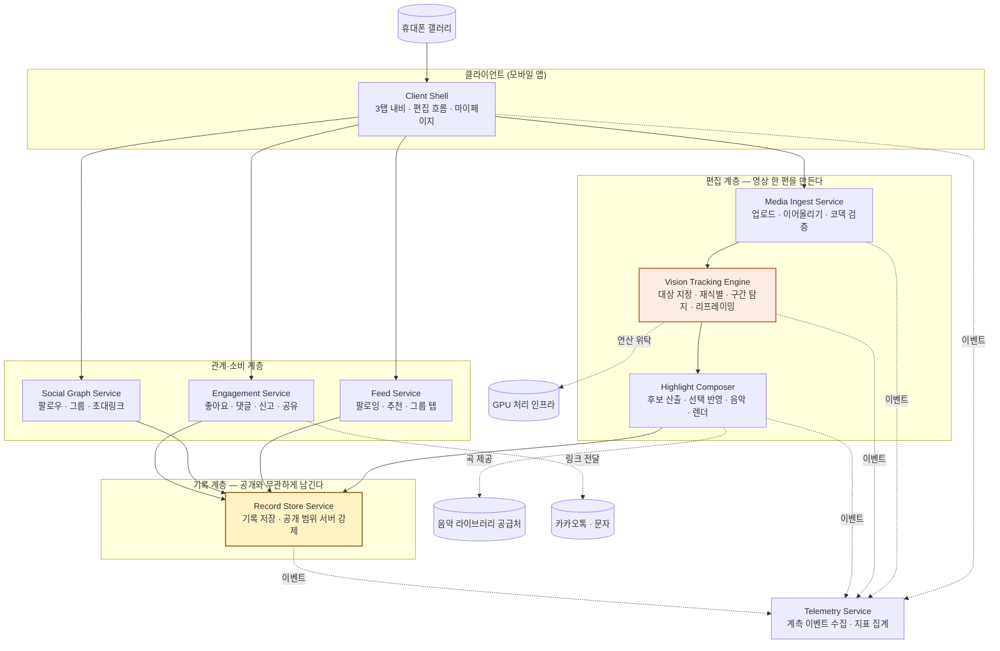

**세 계층으로 읽으면 쉽다.** ①편집 계층이 영상 한 편을 만들고 → ②기록 계층이 공개 여부와 무관하게 보관하고 → ③관계·소비 계층이 그것을 사람들에게 보여준다. Telemetry는 모든 계층에서 이벤트를 받아 지표를 만든다.

구체적 요구사항

## 구체적 요구사항

#### 그림 4-1. 유스케이스 다이어그램 (Use Case Diagram)

**무엇을 보여주나** — "누가 이 시스템으로 무엇을 하는가"를 한 장에 담은 것이다. 아래 요구사항 표를 읽기 전에 전체 그림을 잡는 용도다.

**읽는 법** — 왼쪽 둥근 상자가 **사람(액터)**, 가운데 초록 영역이 **시스템이 제공하는 기능(유스케이스)**, 오른쪽은 사람이 아닌 **외부 시스템**이다. 각 유스케이스에 붙은 `REQ-FUNC-0NN`이 §4.1 표의 요구사항 번호와 그대로 대응한다.

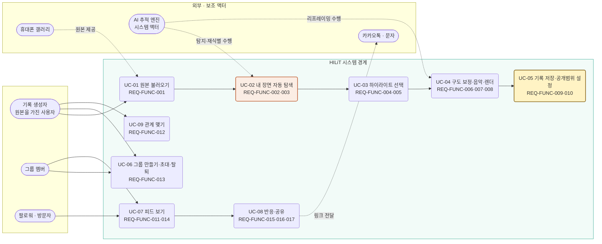

**주황 표시(UC-02)**는 실패하면 나머지가 무의미해지는 관문(Gate A)이고, **노랑 표시(UC-05)**는 이 제품의 핵심 주장인 "올리지 않아도 남는다"가 성립하는 지점(Gate B)이다.

### 4.1 기능 요구사항

| ID | 제목 | 출처 | 우선순위 | 유형 | 검증 방식 | 인수 기준 | 상태 | 담당자 |
| --- | --- | --- | --- | --- | --- | --- | --- | --- |
| **REQ-FUNC-001** | 장시간 원본 영상 업로드 | PRD 4-1 (F1) | Must Have | Functional | 1) 대용량 업로드 테스트<br>2) 이어올리기 복구 테스트<br>3) QA 검증 | 40~50분·4GB급 원본을 업로드할 수 있어야 하며, 네트워크 단절 후 재연결 시 이어올리기로 복구되어야 한다 (재개 성공률 ≥ 99%) | Approved | 백엔드 리드 |
| **REQ-FUNC-002** | 추적 대상 지정 및 재식별 | PRD 4-1 (F2a) | Must Have | Functional | 1) 재식별 정확도 테스트<br>2) 가림 구간 라벨 정답셋 검증<br>3) QA 검증 | 사용자가 자기를 1회 지정하면, 대상이 가려졌다 다시 나타나도 같은 사람으로 인식해야 한다. 재식별 정확도 ≥ 90%, 오인식 ≤ 2% | Draft | AI 엔지니어 |
| **REQ-FUNC-003** | 사용자 등장 구간 자동 탐지 | PRD 4-1 (F2b) | Must Have | Functional | 1) 정답셋 회귀 배치<br>2) IoU 기반 정탐 판정<br>3) QA 검증 | 사람이 표시한 정답 구간 대비 탐지 구간 비율이 **85% 이상**이어야 한다 (IoU ≥ 0.5를 정탐으로 판정). **Gate A 판정 요구사항** | Approved | AI 리드 |
| **REQ-FUNC-004** | 장면 후보 제시 | PRD 4-1 (F3) | Must Have | Functional | 1) 후보 산출 테스트<br>2) 온전도 우선순위 검증<br>3) QA 검증 | 탐지 결과를 사용자가 판단 가능한 개수의 후보로 좁혀 제시해야 한다. 후보 수 30개는 초안이며 베타 A/B로 확정한다 | Proposed | AI 엔지니어 |
| **REQ-FUNC-005** | 사용자 장면 선택 | PRD 4-1 (F4) | Must Have | Functional | 1) 선택 이벤트 검증<br>2) 자동 확정 차단 테스트<br>3) QA 검증 | 최종 선택권은 사람에게 있어야 한다. 사용자의 명시적 선택(`selection_confirmed`) 없이 렌더링이 시작된 건이 **0건**이어야 한다 | Approved | 클라이언트 개발자 |
| **REQ-FUNC-006** | 사용자 중심 크롭·리프레이밍 | PRD 4-1 (F5a) | Must Have | Functional | 1) 주관 평가(5점 척도)<br>2) 출력 해상도 검증<br>3) QA 검증 | 화면 구석에 작게 잡힌 대상을 중앙·확대 배치해야 한다. 렌더 직후 5점 척도에서 **4점 이상 응답 ≥ 80%**, 출력 ≥ 1080×1920 | Approved | AI 엔지니어 |
| **REQ-FUNC-007** | 음악 라이브러리 | PRD 4-1 (F18a) | Must Have | Functional | 1) 곡 선택·삽입 테스트<br>2) 저작권 메타 검증<br>3) QA 검증 | 저작권이 정리된 곡만 앱 안에서 제공해야 하며, 사용자가 외부에서 곡을 가져오게 하지 않아야 한다 | Approved | 클라이언트 개발자 |
| **REQ-FUNC-008** | 합치기 및 렌더링 | PRD 4-1 (F6) | Must Have | Functional | 1) 렌더 시간 측정<br>2) 실패 복구 테스트<br>3) QA 검증 | 선택된 장면이 하나의 완성 영상으로 합쳐져야 한다. 렌더 p95 ≤ 90초, 외부 앱 전환 이벤트 0건. 3회 연속 실패 시 선택 결과를 보존하고 원본을 삭제하지 않아야 한다 | Draft | 백엔드 리드 |
| **REQ-FUNC-009** | 개인 기록 자동 저장 | PRD 4-1 (F7) | Must Have | Functional | 1) 저장 성공률 측정<br>2) 공개 범위 결정 전 존재 검증<br>3) QA 검증 | 공개 범위를 정하기 **전에** 이미 기록이 저장돼 있어야 한다. 저장 성공률 ≥ 99.9%, 렌더 성공 대비 기록 누락 0건. **Gate B 판정 요구사항** | Approved | 백엔드 리드 |
| **REQ-FUNC-010** | 기록 단위 공개 범위 | PRD 4-1 (F8) | Must Have | Functional | 1) 3단계 전환 테스트<br>2) 기본값 검증<br>3) QA 검증 | 기록마다 `전체공개` / `그룹에만 공개` / `나만 보기`를 선택할 수 있어야 하며, **기본값은 `나만 보기`**여야 한다. 공개했다 내려도 기록은 유실되지 않아야 한다 | Approved | 백엔드 리드 |
| **REQ-FUNC-011** | 앱 셸 — 3탭 내비 · 마이페이지 | PRD 4-1 (F22) | Must Have | Functional | 1) 진입 시간 측정<br>2) 탭 전환 테스트<br>3) QA 검증 | 앱 진입 시 로그인 화면 없이 **팔로잉 탭**에서 영상이 재생되어야 한다. 탭은 팔로잉·추천·그룹 셋, 가운데 +버튼이 편집 진입, 마이페이지가 기록 보관함 | Approved | 클라이언트 개발자 |
| **REQ-FUNC-012** | 팔로워 · 팔로잉 관계 | PRD 4-1 (F11) | Must Have | Functional | 1) 관계 CRUD 테스트<br>2) 공개 범위 경계 검증<br>3) QA 검증 | 관계는 **공개 기록만** 정해야 한다. 팔로우 관계만으로 그룹 공개 기록에 접근한 건이 0건이어야 한다 | Approved | 백엔드 리드 |
| **REQ-FUNC-013** | 그룹 — 소그룹 공유 | PRD 4-1 (F23) | Must Have | Functional | 1) 생성·초대·탈퇴 테스트<br>2) 3경로 노출 차단 검증<br>3) QA 검증 | 승인 절차 없이 생성되며 **인원 상한 20명**(생성자 포함). 그룹 밖에서는 검색·피드·직접 URL 세 경로 모두 노출 0건. 탈퇴 시 해당 멤버 기록을 그룹에서 회수하되 본인 기록에는 남긴다 | Approved | 백엔드 리드 |
| **REQ-FUNC-014** | 피드 — 팔로잉 · 추천 · 그룹 | PRD 4-1 (F13) | Must Have | Functional | 1) 피드 구성 테스트<br>2) 빈 피드 대체 노출 검증<br>3) QA 검증 | MVP는 팔로잉·인기 기준으로 구성한다(취향 설문 반영은 REQ-FUNC-021 이후). 팔로잉이 0명일 때 빈 화면 대신 추천 탭으로 대체 노출해야 한다 | Approved | 클라이언트 개발자 |
| **REQ-FUNC-015** | 좋아요 | PRD 4-1 (F19) | Must Have | Functional | 1) 반응 기록 테스트<br>2) 공개 범위 연동 검증<br>3) QA 검증 | 공개 범위 안에서만 노출되어야 한다. `나만 보기` 기록에 반응 UI가 붙은 건이 0건이어야 한다 | Approved | 클라이언트 개발자 |
| **REQ-FUNC-016** | 댓글 및 신고 | PRD 4-1 (F20) | Must Have | Functional | 1) 댓글 CRUD 테스트<br>2) 신고 접수 테스트<br>3) QA 검증 | 댓글에 신고 기능이 포함되어야 하며 접수 성공률 ≥ 99%. **신고 처리 기준과 운영 주체는 미정**이므로 접수까지만 검증 대상으로 한다 | Proposed | 서비스 운영자 |
| **REQ-FUNC-017** | 공유 — 링크 · 카카오톡/메시지 | PRD 4-1 (F21) | Must Have | Functional | 1) 링크 생성 테스트<br>2) 공개 범위 승계 검증<br>3) QA 검증 | 공유 링크도 **기록의 공개 범위를 따라야** 한다. 앱 내 DM은 범위에 포함하지 않는다 | Approved | 백엔드 리드 |
| **REQ-FUNC-018** | 촬영 노하우 기반 구도 규칙 | PRD 4-1 (F5b) | Should Have | Functional | 1) 구도 규칙 적용 테스트<br>2) 주관 평가 비교<br>3) QA 검증 | 추적 좌표 활용을 넘어 촬영 노하우 기반 구도·앵글 연출을 적용해 결과물 완성도를 높여야 한다 | Proposed | AI 엔지니어 |
| **REQ-FUNC-019** | 원본 삭제 안내 및 저장공간 회수 | PRD 4-1 (F9) | Should Have | Functional | 1) 삭제 안내 노출 테스트<br>2) 실행률 측정<br>3) QA 검증 | 결과물 확보 후 원본 삭제를 안내해야 하며, 삭제 실행률 ≥ 50%를 목표로 한다 | Proposed | 클라이언트 개발자 |
| **REQ-FUNC-020** | 기록 타임라인 (날짜별 축적 뷰) | PRD 4-1 (F10) | Should Have | Functional | 1) 타임라인 렌더 테스트<br>2) 정렬 검증<br>3) QA 검증 | 날짜별로 기록 축적을 확인할 수 있는 뷰를 제공해야 한다 | Proposed | 클라이언트 개발자 |
| **REQ-FUNC-021** | 온보딩 카테고리 취향 설문 | PRD 4-1 (F12) | Should Have | Functional | 1) 설문 흐름 테스트<br>2) 피드 반영 검증<br>3) QA 검증 | 취향 설문 결과가 추천 피드 구성에 반영되어야 한다 | Proposed | 제품 아키텍트 |
| **REQ-FUNC-022** | 카테고리별 조회수 랭킹 | PRD 4-1 (F15) | Should Have | Functional | 1) 랭킹 산정 테스트<br>2) 노출 정책 검증<br>3) QA 검증 | 시점은 MVP 직후로 확정했으나 **도입 여부 자체는 미정**이다. 순위 경쟁이 제품 정서와 충돌하는지 먼저 판정한다 | Proposed | 제품 리드 |
| **REQ-FUNC-023** | 선택 데이터 학습 기반 정확도 개선 | PRD 4-1 (F14) | Could Have | Functional | 1) 학습 파이프라인 테스트<br>2) 정확도 개선 측정<br>3) QA 검증 | 사용자 선택 데이터가 축적되어 탐지 후보의 정확도를 실제로 높여야 한다. 학습 데이터가 사용자 없이는 생기지 않으므로 순서상 후순위다 | Proposed | AI 리드 |
| **REQ-FUNC-024** | 팀 공유 편집 (한 원본 다중 사용자) | PRD 4-1 (F16) | Won't Have (P3) | Functional | 기획 확정 후 재판정 | 팀 계정 · 원본 공유 권한 · 얼굴 정보 동의 · 인원 비례 원가 **넷이 전부 미정**이므로 본 범위에서 제외한다. MVP에서는 각자 자기 원본을 업로드한다 | Draft | 제품 리드 |
| **REQ-FUNC-025** | 촬영 가이드 | PRD 4-1 (F17) | Won't Have (P3) | Functional | 기획 확정 후 재판정 | 원본이 없는 사용자를 유입시키기 위한 기능. 본 범위에서 제외한다 | Draft | 제품 리드 |
| **REQ-FUNC-026** | 자막 편집 | PRD 4-1 (F18b) | Won't Have (P3) | Functional | 기획 확정 후 재판정 | 기획 미정. 음악(REQ-FUNC-007)과 분리해 본 범위에서 제외한다 | Draft | 제품 리드 |

### 4.2 비기능 요구사항

| ID | 제목 | 출처 | 우선순위 | 유형 | 검증 방식 | 인수 기준 | 상태 | 담당자 |
| --- | --- | --- | --- | --- | --- | --- | --- | --- |
| **REQ-NF-001** | 앱 진입 응답 시간 ≤ 1.5초 | PRD 5-1 | Must Have | Performance | 콜드/웜 스타트 부하 테스트 | 앱 실행부터 첫 영상 프레임까지 p95 ≤ 1.5초, 빈 피드 노출률 < 5% | Draft | 클라이언트 개발자 |
| **REQ-NF-002** | 원본 업로드 ≤ 6분 · 이어올리기 | PRD 5-1 | Must Have | Performance | LTE 환경 대용량 업로드 테스트 | 40분·4GB 원본 업로드 p95 ≤ 6분, 업로드 실패율 < 0.5%, 재개 성공률 ≥ 99% | Draft | 백엔드 리드 |
| **REQ-NF-003** | 탐지 처리 시간 ≤ 8분 | PRD 5-1 | Must Have | Performance | 정답셋 100편 배치 처리 시간 측정 | 40분 원본의 탐지 완료 p95 ≤ 8분. 체감 탐색 시간 중앙값 ≤ 5분, p90 ≤ 10분을 만족하기 위한 상한이다 | Draft | AI 리드 |
| **REQ-NF-004** | 렌더링 시간 ≤ 90초 | PRD 5-1 | Must Have | Performance | 15초 결과물 렌더 반복 측정 | 15초 결과물 렌더 p95 ≤ 90초 | Draft | 백엔드 리드 |
| **REQ-NF-005** | 조회 API 응답 시간 | PRD 5-1 | Must Have | Performance | API 부하 테스트 | 피드·목록 API p95 ≤ 400ms, 그룹 멤버 필터 p95 ≤ 300ms, 후보 목록 렌더 p95 ≤ 1초, 그룹 생성 p95 ≤ 500ms | Draft | 백엔드 리드 |
| **REQ-NF-006** | 가용성 — 앱 99.5% · AI 99.0% | PRD 5-2 | Must Have | Reliability | 월간 가용성 모니터링 및 SLA 검증 | 앱 셸·피드·기록 조회 월 가용성 ≥ 99.5%, AI 처리 파이프라인 ≥ 99.0%. 비동기 큐로 처리 지연은 허용하되 **유실은 불허**한다 | Draft | 백엔드 온콜 |
| **REQ-NF-007** | 기록 저장 성공률 ≥ 99.9% | PRD 5-2 | Must Have | Reliability | 저장 성공률 상시 모니터링 | 렌더 성공 대비 기록 저장 성공률 ≥ 99.9%. **Gate B의 전제이며, 여기서 유실되면 제품의 핵심 주장이 무너진다.** 1차 대응 SLA 15분 | Draft | 백엔드 온콜 |
| **REQ-NF-008** | 오류율 및 재시도 정책 | PRD 5-2 | Must Have | Reliability | 오류 주입 테스트 | API 5xx 오류율 ≤ 0.1%. 처리 실패 시 원본·중간 산출물을 보존한 채 **재시도 3회 이상** 수행해야 한다 | Draft | 백엔드 리드 |
| **REQ-NF-009** | 공개 범위 서버 측 강제 | PRD 5-3 | Must Have | Security | 회귀 테스트 스위트 · 우회 시도 테스트 | 공개 범위는 **서버에서 강제**해야 한다. 클라이언트 필터링만으로는 불충분하다. 조작된 요청의 우회 성공 0건, 감사 로그 기록률 100%, 위반 시도 감지 시 즉시 알림 | Draft | 보안 담당자 |
| **REQ-NF-010** | 얼굴 정보 처리 동의 및 파기 | PRD 5-3 (ADR-11) | Must Have | Security | 법무 산출물 체크리스트 승인 | 동의 문구 · 보관 기간 · 파기 절차 · 처리 위탁 **4종이 전부 승인되기 전 프로덕션 배포 0건**. 미승인 시 CI 배포를 차단한다. **Gate A 착수 전 결정 필요** | Draft | 법무 담당자 |
| **REQ-NF-011** | 저장·전송 암호화 | PRD 5-3 | Must Have | Security | 주간 스캔 및 핸드셰이크 검사 | 영상 저장 시 at-rest 암호화, 전송 구간 TLS 1.2 이상. 미암호화 객체 0건, TLS 1.1 이하 핸드셰이크 0건 | Draft | 보안 담당자 |
| **REQ-NF-012** | 공유 링크 만료 및 회수 | PRD 5-3 | Should Have | Security | 만료·회수 동작 테스트 | 공유 링크 기본 만료 30일, 만료 후 접근 성공 0건, 회수 반영 지연 ≤ 60초 | Draft | 백엔드 리드 |
| **REQ-NF-013** | GPU 편당 처리 원가 가드레일 | PRD 5-4 (ADR-05) | Must Have | Cost | 처리 물량 대비 원가 추적 | 처리 물량은 **연 12만 편**(1만 명 × 월 1편)에 직접 비례한다. **편당 처리 원가 상한이 확정되기 전에는 무제한 업로드를 열지 않는다.** 일일 예산 80% 초과 시 알림 | Draft | 백엔드 리드 |
| **REQ-NF-014** | 모니터링 · 알림 · 대응 SLA | PRD 5-5 | Must Have | Operability | 알림 발화 테스트 및 대응 훈련 | 게이트 지표·저장 성공률·보안 위반·큐 적체·완주율·비용에 대해 **알림 기준 · 수신자 · 1차 대응 SLA**가 정의되어야 한다 (§10.3 참조) | Draft | 백엔드 온콜 |
| **REQ-NF-015** | 유지보수성 — 열거형 확장 방식 | PRD 6-1 | Could Have | Maintainability | 코드 리뷰 및 확장성 테스트 | 공개 범위·피드 탭·계측 이벤트 등 분류값을 추가할 때 열거형(enum) 패턴을 통해 코드 변경을 최소화해야 한다 | Draft | 백엔드 리드 |

추적성 매트릭스

## 추적성 매트릭스

**본 매트릭스의 범위** — 1차 출시 대상인 **Must Have 요구사항 30건**에 한정한다 — 기능 17건(REQ-FUNC-001~017) · 비기능 13건(REQ-NF-001~011 · 013 · 014).

2차 이후 항목(REQ-FUNC-018~026 · REQ-NF-012·015)은 §4의 우선순위 열을 참조한다. 이 중 **REQ-FUNC-024·025·026은 인수 기준이 "기획 확정 후 재판정"** 이므로,

기획 확정 전까지는 모듈·검증 대상을 특정할 수 없어 본 표에 올리지 않는다.

`구현 클래스` 열의 **`설계 시 확정`** 은 상세 설계 단계에서 채울 자리를 뜻한다 — 임의로 이름을 붙이지 않는다.

| 요구사항 ID | 모듈 | 구현 클래스 | 테스트 케이스 ID |
| --- | --- | --- | --- |
| REQ-FUNC-001 | Media Ingest Service | SourceVideoUploader | TC-FUNC-001 |
| REQ-FUNC-002 | Vision Tracking Engine | SubjectReIdentifier | TC-FUNC-002 |
| REQ-FUNC-003 | Vision Tracking Engine | AppearanceIntervalDetector | TC-FUNC-003 |
| REQ-FUNC-004 | Highlight Composer | CandidateRanker | TC-FUNC-004 |
| REQ-FUNC-005 | Highlight Composer | SelectionController | TC-FUNC-005 |
| REQ-FUNC-006 | Vision Tracking Engine | SubjectReframer | TC-FUNC-006 |
| REQ-FUNC-007 | Highlight Composer | MusicLibraryService | TC-FUNC-007 |
| REQ-FUNC-008 | Highlight Composer | RenderPipeline | TC-FUNC-008 |
| REQ-FUNC-009 | Record Store Service | RecordPersister | TC-FUNC-009 |
| REQ-FUNC-010 | Record Store Service | VisibilityManager | TC-FUNC-010 |
| REQ-FUNC-011 | Client Shell | AppShellNavigator | TC-FUNC-011 |
| REQ-FUNC-012 | Social Graph Service | FollowRelationService | TC-FUNC-012 |
| REQ-FUNC-013 | Social Graph Service | GroupService · GroupInviteLinkService | TC-FUNC-013 |
| REQ-FUNC-014 | Feed Service | FeedComposer | TC-FUNC-014 |
| REQ-FUNC-015 | Engagement Service | ReactionService | TC-FUNC-015 |
| REQ-FUNC-016 | Engagement Service | CommentService · ReportIntake | TC-FUNC-016 |
| REQ-FUNC-017 | Engagement Service | ShareLinkService | TC-FUNC-017 |
| REQ-NF-001 | Client Shell | ColdStartProfiler | TC-NF-001 |
| REQ-NF-002 | Media Ingest Service | 설계 시 확정 | TC-NF-002 |
| REQ-NF-003 | Vision Tracking Engine | DetectionBenchmarkRunner | TC-NF-003 |
| REQ-NF-004 | Highlight Composer | 설계 시 확정 | TC-NF-004 |
| REQ-NF-005 | Feed Service · Highlight Composer · Social Graph Service | 설계 시 확정 | TC-NF-005 |
| REQ-NF-006 | **전 서비스 공통** | 설계 시 확정 | TC-NF-006 |
| REQ-NF-007 | Record Store Service | PersistenceHealthMonitor | TC-NF-007 |
| REQ-NF-008 | **전 서비스 공통** | 설계 시 확정 | TC-NF-008 |
| REQ-NF-009 | Record Store Service | VisibilityEnforcer (서버 측) | TC-NF-009 |
| REQ-NF-010 | Vision Tracking Engine · Record Store Service | 설계 시 확정 | TC-NF-010 |
| REQ-NF-011 | **전 서비스 공통** | 설계 시 확정 | TC-NF-011 |
| REQ-NF-013 | Telemetry Service | CostGuardrailMonitor | TC-NF-013 |
| REQ-NF-014 | Telemetry Service | AlertDispatcher | TC-NF-014 |

**`전 서비스 공통` 3건에 대하여** — REQ-NF-006(가용성) · 008(오류율·재시도) · 011(암호화)은 단일 서비스가 아니라 파이프라인 전 구간에 걸린다.

특정 서비스 하나를 임의로 지정하면 나머지 서비스가 책임 범위에서 빠지므로 공통으로 표기한다. 검증은 §10의 게이트 판정에서 전 구간을 대상으로 수행한다.

부록

## 부록

### 6.1 API 엔드포인트 목록

| 서비스 유형 | 메서드 | 엔드포인트 | 설명 |
| --- | --- | --- | --- |
| **Media Ingest Service** | POST | `/api/v1/uploads` | 업로드 세션 생성 및 이어올리기 토큰 발급 (최대 60분 / 6GB) |
| **Vision Tracking Engine** | POST | `/api/v1/detections` | 추적 대상 지정 후 탐지 실행 (비동기) |
| **Vision Tracking Engine** | GET | `/api/v1/detections/{detectionId}` | 탐지 상태 · 등장 구간 배열 · 탐지율 조회 |
| **Highlight Composer** | GET | `/api/v1/candidates?detectionId=` | 장면 후보 목록 조회 (온전히 잡힌 구간 우선) |
| **Highlight Composer** | POST | `/api/v1/records` | 선택 후보와 음악을 받아 렌더링 요청 (렌더 전 기록 행 선생성) |
| **Record Store Service** | PATCH | `/api/v1/records/{recordId}/visibility` | 공개 범위 변경 (`private` / `group` / `public`) |
| **Social Graph Service** | POST | `/api/v1/groups` | 그룹 생성 — 승인 절차 없음 · 인원 상한 20명 · 이름 중복 허용 |
| **Social Graph Service** | POST | `/api/v1/groups/{groupId}/invite-link` | 초대 링크 발급 — 유효기간 7일 · 참여는 가입자만 · 생성자 회수 가능 |
| **Social Graph Service** | DELETE | `/api/v1/groups/{groupId}/members/me` | 그룹 나가기 — 회수 대상 수 사전 반환, 실행 시 일괄 회수(삭제 아님) |
| **Feed Service** | GET | `/api/v1/feed?tab=` | 피드 조회 (`following` / `recommend` / `group`) · 진입 기본 `following` |
| **Record Store Service** | GET | `/api/v1/users/{userId}/profile` | 타인 프로필 조회 — 전체공개 기록만, 비공개·그룹은 개수에도 미포함 |
| **Engagement Service** | POST | `/api/v1/records/{recordId}/reactions` | 좋아요 · 댓글 · 신고 접수 |
| **Telemetry Service** | POST | `/api/v1/telemetry/events` | 계측 이벤트 일괄 수집 |

### 6.2 데이터 모델 정의

#### 그림 6-1. 클래스 다이어그램 (Class Diagram)

**무엇을 보여주나** — 아래 코드로 적은 데이터 구조를 그림으로 옮긴 것이다. 어떤 객체가 어떤 객체를 몇 개씩 가지는지 한눈에 보인다.

**읽는 법** — 상자 하나가 개념(클래스) 하나다. `+`는 외부에서 접근 가능한 항목, ` >`은 정해진 값 중 하나만 갖는 분류값이다. 화살표 옆 `1`·`0..*는 개수 관계다 — 예를 들어 SourceVideo "1" --> "0..*" Detection`은 **원본 하나에 탐지 실행이 여러 번 붙을 수 있다**는 뜻이다.

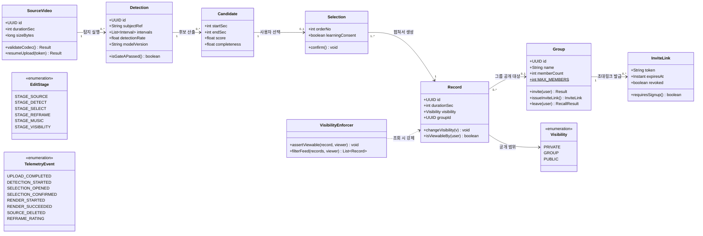

**흐름으로 읽으면** — 원본(SourceVideo) → 탐지(Detection) → 후보(Candidate) → 선택(Selection) → **기록(Record)** 순으로 좁혀진다. `VisibilityEnforcer`는 클래스가 아니라 **조회할 때마다 반드시 거쳐야 하는 검문소**이며, 이것이 서버 측 공개 범위 강제(REQ-NF-009)의 구현체다.

```
// 공개 범위 — 기록 하나마다 부여, 기본값 PRIVATE
public enum Visibility {
    PRIVATE("나만 보기", "아무에게도 보이지 않는다. 기본값"),
    GROUP("그룹에만 공개", "선택한 그룹의 멤버만 볼 수 있다. 그룹 밖에서는 검색되지 않는다"),
    PUBLIC("전체공개", "HILiT을 쓰는 누구나 볼 수 있다");
}

// 영상 만들기 6단계 — 화면 06~11에 순서대로 대응
public enum EditStage {
    STAGE_SOURCE(1, "원본 고르기", "갤러리 격자에서 장시간 원본을 선택"),
    STAGE_DETECT(2, "내 장면 찾기", "대상 지정 · 재식별 · 등장 구간 탐지"),
    STAGE_SELECT(3, "하이라이트 선택", "후보 중 사용자가 최종 선택"),
    STAGE_REFRAME(4, "구도 보정", "추적 좌표 기반 크롭 · 리프레이밍"),
    STAGE_MUSIC(5, "음악 넣기", "저작권 정리된 라이브러리에서 선택"),
    STAGE_VISIBILITY(6, "공개 범위 정하기", "저장은 이미 완료된 상태에서 범위만 결정");

    private final int stageNumber;
    private final String stageName;
    private final String description;
}

// 검증 관문 — 순서를 바꿀 수 없다
public enum Gate {
    GATE_A("추적 정확도", "등장 구간 탐지율 85% 이상", "실패 시 이후 공정 전부 무의미"),
    GATE_B("기록 공간", "개인 기록 공간이 계정 분리를 대체할 만큼 편한가", "비공개 기록 비율 30% 이상");
}

// 피드 상단 탭
public enum FeedTab {
    FOLLOWING("팔로잉", "내가 보기로 한 사람의 공개 기록 · 진입 기본값"),
    RECOMMEND("추천", "팔로잉·인기 기준 · 취향 설문 반영은 이후"),
    GROUP("그룹", "내가 속한 소그룹 목록과 그룹 피드");
}

// 반응 유형
public enum ReactionType {
    LIKE("좋아요", "공개 범위 안에서만 노출"),
    COMMENT("댓글", "신고 기능 포함"),
    REPORT("신고", "접수까지가 MVP 범위 · 처리 기준 미정"),
    SHARE("공유", "링크 · 카카오톡 · 문자 · 공개 범위 승계");
}

// 계측 이벤트 — 모든 지표 산식이 이 8종에 의존한다 (데이터팀 확정 필요)
public enum TelemetryEvent {
    UPLOAD_COMPLETED("upload_completed", "원본 업로드 완료"),
    DETECTION_STARTED("detection_started", "탐지 시작 · 탐색 시간 측정 시점"),
    SELECTION_OPENED("selection_opened", "선택 화면 도달 · 탐색 시간 종료 시점"),
    SELECTION_CONFIRMED("selection_confirmed", "사용자 최종 선택 확정"),
    RENDER_STARTED("render_started", "렌더링 시작"),
    RENDER_SUCCEEDED("render_succeeded", "렌더링 성공 · 기록 생성 기준"),
    SOURCE_DELETED("source_deleted", "원본 삭제 실행"),
    REFRAME_RATING("reframe_rating", "리프레이밍 5점 척도 응답");
}

// 그룹 탈퇴 시 기록 처리
public enum GroupLeavePolicy {
    RECALL_FROM_GROUP("그룹에서 회수", "그룹 화면에서 사라진다"),
    KEEP_IN_OWN_STORE("본인 기록 유지", "개인 기록 저장소에는 그대로 남는다"),
    WARN_BEFORE_LEAVE("나가기 전 경고", "회수될 영상 개수를 실제 값으로 표시한다");
}
```

### 6.3 비즈니스 규칙 요약

1. **기록 우선**: 공개 범위를 정하기 전에 기록이 이미 저장돼 있어야 한다. 저장과 공개는 분리된 행위다
2. **기본값은 나만 보기**: 저장 직후 공개 범위는 `PRIVATE`이다. 기본이 공개면 "올리지 않아도 남는다"는 제품 주장이 성립하지 않는다
3. **최종 선택권은 사람에게**: 사용자의 명시적 선택 없이 결과물을 확정하지 않는다
4. **공개 범위 서버 강제**: 모든 조회 경로에서 서버가 범위를 강제한다. 클라이언트 필터링만으로는 불충분하다
5. **그룹 인원 상한 20명**: 생성자를 포함하며, 초과 초대는 부분 생성 없이 롤백한다
6. **그룹 탈퇴 시 회수**: 나가면 그 그룹에 올린 기록도 함께 내려간다. 본인 기록에는 남으며, 나가기 전 회수될 개수를 실제 값으로 경고한다
7. **링크 초대는 가입자 한정**: 링크는 누구에게나 보낼 수 있으나 참여는 가입·로그인한 사용자만 가능하다. 유효기간 7일
8. **관계와 공개의 분리**: 팔로우 관계는 공개 기록만 정한다. 비공개 공유는 그룹이 맡는다
9. **원본 보관 범위**: 원본은 결과물 확보 시점까지만 보관하는 것을 기본으로 한다
10. **게이트 순서 불변**: Gate A → Gate B 순서를 바꿀 수 없다. Gate A 실패 시 이후 단계에 착수하지 않는다

### 6.4 데이터베이스 스키마 개요

#### 그림 6-2. 개체-관계 다이어그램 (ERD)

**무엇을 보여주나** — 데이터베이스에 실제로 만들 표(테이블)와 그 사이의 연결이다. 아래 스키마 목록의 상세판이다.

**읽는 법** — 상자가 테이블, 안의 줄이 열(컬럼)이다. `PK`는 그 행을 구분하는 열쇠, `FK`는 다른 표를 가리키는 참조다. 선 끝의 **까치발(◦{)** 은 "여럿", **막대(||)** 는 "하나"를 뜻한다 — `USERS ||--o{ RECORDS`는 **사용자 한 명이 기록을 여럿 가진다**는 뜻이다.

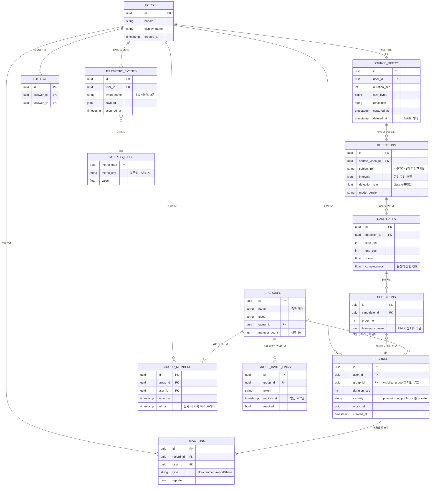

**설계상 중요한 두 지점** — ① `RECORDS.visibility`가 기본값 `private`이며 `group_id`는 `visibility=group`일 때만 유효하다. ② `SOURCE_VIDEOS.deleted_at`과 `GROUP_MEMBERS.left_at`은 **삭제하지 않고 표시만 하는 열**이다. 그룹 탈퇴 시 기록은 지워지지 않고 공개 범위만 `private`으로 되돌아간다.

```
-- 핵심 테이블 요약
users                       -- 사용자 · 핸들 · 표시이름 · 프로필
source_videos               -- 원본 메타 (길이 · 바이트 · 해상도 · 촬영일시 · 삭제여부)
detections                  -- 추적 실행 (대상 참조 · 구간 배열 · 탐지율 · 모델 버전)
candidates                  -- 장면 후보 (시작초 · 종료초 · 점수 · 온전도)
selections                  -- 사용자 선택 (선택 순서 · 학습 동의) — 학습 데이터원
records                     -- 완성 기록 (길이 · visibility · group_id · 음악 · 생성일시)
groups                      -- 그룹 (이름 · 장소 · 생성자 · 멤버수 · 상한 20)
group_members               -- 그룹 멤버십 (가입 · 탈퇴 이력)
group_invite_links          -- 초대 링크 (만료일시 · 회수 여부)
follows                     -- 팔로워 · 팔로잉 관계
reactions                   -- 좋아요 · 댓글 · 신고
telemetry_events            -- 계측 이벤트 (대용량 · 파티셔닝)
metrics_daily               -- 지표 집계 (북극성 · 보조 KPI 스냅샷)
```

### 6.5 다이어그램 색인

본 문서에 포함된 설계 다이어그램 14종이다. 배경지식 없이 문서를 처음 읽는다면 **그림 4-1 → 3-1 → 12-2** 순서로 보면 제품의 전체 구조가 가장 빨리 잡힌다.

| 그림 | 종류 | 위치 | 무엇을 답하는가 |
| --- | --- | --- | --- |
| 3-1 | Component Diagram | §3 | 어떤 서비스가 어떤 순서로 연결되는가 |
| 4-1 | Use Case Diagram | §4 | 누가 이 시스템으로 무엇을 하는가 |
| 6-1 | Class Diagram | §6.2 | 데이터 구조가 서로 몇 개씩 물려 있는가 |
| 6-2 | ERD | §6.4 | 데이터베이스 표와 참조 관계는 어떻게 되는가 |
| 9-1 | Flow Chart | §9.4 | 사용자는 어디서 포기하고, 무엇이 그것을 막는가 |
| 10-1 | Flow Chart | §10.1 | 어떤 순서로 검증하고 실패하면 무엇을 하는가 |
| 11-1 | Sequence Diagram | §11.1 | 업로드부터 후보 제시까지 무슨 일이 일어나는가 |
| 11-2 | Sequence Diagram | §11.2 | 그룹을 나가면 올린 영상은 어떻게 되는가 |
| 11-3 | Sequence Diagram | §11.3 | 선택부터 저장까지의 순서는 어떻게 되는가 |
| 11-4 | Sequence Diagram | §11.4 | 남이 내 비공개 기록에 접근하면 어떻게 막는가 |
| 11-5 | Sequence Diagram | §11.5 | 그룹을 만들고 초대하면 무슨 일이 일어나는가 |
| 11-6 | Sequence Diagram | §11.6 | 앱을 열면 무엇이 뜨고 반응은 어떻게 처리되는가 |
| 12-1 | State Diagram | §12.1 | 기록의 공개 상태는 어떻게 바뀌는가 |
| 12-2 | Flow Chart | §12.2 | 영상 한 편이 만들어지는 6단계와 실패 경로는 |

**공통 표기 규약** — 주황은 **Gate A**(추적 정확도) 관련, 노랑은 **Gate B**(기록 공간) 관련, 점선 테두리는 **실패·중단 경로**, 원통은 **외부 시스템**이다.

향후 개선 사항

## 향후 개선 사항

현재 MVP 설계는 **결정론적 인물 추적과 단일 카테고리(농구·구기)**에 초점을 두고 있다. 다음 개선 사항은 향후 버전에서 계획된다.

### 7.1 선택 데이터 학습 순환 (REQ-FUNC-023)

- 사용자 선택 데이터를 축적해 탐지 후보의 정확도를 높이는 순환 구축
- 화면 복제로 따라올 수 없는 방어선이나, 학습 데이터가 사용자 없이는 생기지 않으므로 순서상 후순위
- 선택 이벤트(`selection_confirmed`)를 학습 데이터원으로 설계 단계에서 확보

### 7.2 구도 고도화 및 기록 심화 (REQ-FUNC-018 · 020 · 021)

- 촬영 노하우 기반 구도 규칙과 앵글 연출로 결과물 완성도 향상
- 날짜별 타임라인으로 성장을 눈으로 확인하는 뷰 제공
- 온보딩 취향 설문을 추천 피드에 반영

### 7.3 저장공간 회수 및 노출 자리 (REQ-FUNC-019 · 022)

- 결과물 확보 후 원본 삭제를 안내해 저장공간 압박을 해소
- 카테고리별 랭킹으로 노출 자리를 제공 — **도입 여부 자체는 미정**

### 7.4 팀·다중 인물 확장 (REQ-FUNC-024)

- 한 원본을 여러 사용자가 사용하는 팀 공유 편집
- 기술적으로는 **다중 인물 동시 추적**이 핵심이며, 처리 물량이 인원수에 비례해 GPU 원가에 직접 영향을 준다
- 팀 계정 구조 · 원본 공유 권한 · 얼굴 정보 동의 · 원가 부담 주체 **네 가지 결정이 선행**되어야 한다

### 7.5 카테고리 확장

- 첫 검증은 농구 한 카테고리로 좁혀 시작하며, 이후 구기 종목 전반으로 확장
- 확장 시점은 미정이며, 1년차 목표 달성 경로와 함께 재판정한다

아래 8~13장은 **예시 SRS 양식(1~7장)의 범위를 벗어나는 원천 문서(PRD v1.0)의 내용**을 담기 위해 ISO/IEC/IEEE 29148:2018의 해당 조항에 근거해 개설한 챕터다. 각 장 머리에 근거 조항을 표기했다. **이미 작성된 내용만 옮겼으며 새로 만든 요구사항은 없다.**

제품 목표 및 성공 지표

## 제품 목표 및 성공 지표

**근거:** ISO/IEC/IEEE 29148:2018 §9.6.3 *Scope* — 범위는 제품이 달성할 **목표(objectives and goals)**를 포함한다.

### 8.1 북극성 KPI

| KPI | 정의 | 기준선 | 1년차 목표 | 측정 주기 | 측정 경로 | 판정 주체 |
| --- | --- | --- | --- | --- | --- | --- |
| **기록 3편 이상 보유 사용자 수** | 개인 기록 저장소에 결과물 3편 이상을 보유한 순 사용자 | 0명 | **10,000명** | 주간 추이 · **월말 판정** | `records` 기준 `COUNT(*) >= 3`인 순 `user_id` · 월말 스냅샷 | 제품 리드 |

설치 수가 아니라 축적 사용자 수를 성공 기준으로 삼는다. 설치는 마케팅으로 만들 수 있지만 기록 3편은 제품이 실제로 작동해야 쌓인다. **누적이 아니라 스냅샷**이므로 기록을 지워 3편 아래로 내려간 사용자는 그 달 집계에서 제외된다 — 이탈을 성공으로 세지 않기 위해서다.

이 지표에는 처리 물량 **연 약 12만 편**(1만 명 × 월 1편)이 붙으며, 이 값은 GPU 원가에 직접 비례한다(REQ-NF-013). 사업 계획과 원가가 같은 지표를 공유한다.

### 8.2 보조 KPI

| # | KPI | 기준선 | 목표 | 주기 | 측정 경로 | 판정 주체 | 연결 관문 |
| --- | --- | --- | --- | --- | --- | --- | --- |
| S1 | 등장 구간 탐지율 | 정답셋 구축 시 확정 | ≥ 85% | 릴리스마다 + 주간 | 정답셋 회귀 배치 · 모델 버전별 | AI 리드 | **Gate A** |
| S2 | "잘 잡혔다" 평가 비율 | 베타 1주차 확정 | ≥ 80% | 주간 | `reframe_rating` 4점 이상 비율 · 응답률 동시 보고 | AI 리드 | Gate A 이후 |
| S3 | 원본→완성 전환율 | 약 4% | ≥ 60% | 주간 | `render_succeeded` ÷ `upload_completed` · 30일 코호트 | 제품 리드 | 흐름 완성 |
| S4 | 장면 탐색 소요 시간 | 60분 이상 | ≤ 5분 | 주간 | `detection_started` → `selection_opened` 구간 · 중앙값과 p90 병기 | 제품 리드 | Gate A |
| S5 | 비공개 기록 비율 | 0% | ≥ 30% | 월간 | `visibility='private'` ÷ 전체 · 월말 스냅샷 | 제품 리드 | **Gate B** |
| S6 | 월간 기록 생성 편수 | 0.7건 | 4건 | 월간 | 월간 `render_succeeded` ÷ MAU | 제품 리드 | Gate B |
| S7 | 원본 삭제 실행률 | 0% | ≥ 50% | 월간 | `source_deleted` ÷ `render_succeeded` (안내 노출자 한정) | 제품 리드 | REQ-FUNC-019 이후 |
| S8 | 재촬영 횟수 | 1~3회 | 0회 | 월간 | 동일 세션 내 중복 업로드 발생률 | AI 리드 | Gate A 이후 |
| S9 | 편집 외주 지출 | 월 60만 원 | 0원 | 분기 | **분기 설문 n ≥ 30** — 로그로 측정 불가 | 제품 리드 | — |
| S10 | 파이프라인 완주율 | — | ≥ 95% | 주간 | `render_succeeded` ÷ `detection_started` — 실패 처리 요구사항의 상위 지표 | 백엔드 리드 | 전 구간 |

### 8.3 기존 대안 대비 차별 가치

| 축 | 기존 대안 | 목표 | 개선폭 | 측정 조건 | 검증 |
| --- | --- | --- | --- | --- | --- |
| 탐색 시간 | 사람 눈으로 60분 이상 | ≤ 5분 | **12배 이상 단축** | 동일 사용자 n=30명 × 자기 원본 3편 · 전후 비교 · 중앙값 | EXP-04 |
| 원본→완성 전환율 | 약 4% | ≥ 60% | **15배 향상** | 베타 30일 코호트 · 분모는 업로드 완료 원본 | EXP-05 |
| 편집 외주 비용 | 월 60만 원 | 0원 | **100% 절감** | 분기 설문 n ≥ 30 · 자기보고(로그 검증 불가) | 설문 |
| 재촬영 횟수 | 1~3회 | 0회 | **100% 감소** | 세션 내 중복 업로드율 + 주관 의향 문항 n=50명 | EXP-03 |
| 추적 대상 | 유사 서비스는 **화자(말하는 사람)만** 추적 | 말하지 않고 움직이는 사람 | **탐지율 2배 이상** | 동일 원본 n=100편 · 동일 정답셋 · IoU ≥ 0.5 | EXP-02 |
| 하드웨어 전제 | 전용 카메라 · 팀 계약 필요 | 휴대폰 영상만 | **초기 비용 0원** | 공개 가격표 기준 정성 비교 | — |

사용자 특성

## 사용자 특성

**근거:** ISO/IEC/IEEE 29148:2018 §9.6.6 *User characteristics* — 의도된 사용자군의 특성, 숙련도, 사용 맥락을 기술한다.

### 9.1 세그먼트 정의

대상 선별의 1순위 기준은 **원본 영상 보유 여부**다. 앱에서 촬영하지 않으므로 원본이 없으면 제품이 작동하지 않는다. 2순위는 지불의향이다.

| 세그먼트 | 정의 | 규모 | 처리 |
| --- | --- | --- | --- |
| **Q1** | 원본 있음 · 지불의향 있음 (이미 올리는 사람) | 약 50만 명 | **대상 · 1순위** — 촬영 습관이 있고 편집 부담을 체감. 전환 비용이 가장 낮다 |
| **Q4** | 원본 있음 · 지불의향 없음 (찍어놓고 안 올림) | 약 450만 명 | **대상 · 2순위** — 페인이 가장 크고 시장이 9배. 값을 편집이 아니라 기록 축적에서 받기로 정했으므로 무료 확보가 사업의 본체 |
| **Q2** | 원본 없음 · 지불의향 있음 | 약 200만 명 | 보류 — 촬영 가이드(REQ-FUNC-025) 단계에서 열림 |
| **Q3** | 순수 소비자 | 약 2,800만 명 | 대상 아님 |

### 9.2 대상 사용자 프로필

| 사용자 유형 | 세그 | 특성 | 주요 제약 | 사용 맥락 |
| --- | --- | --- | --- | --- |
| **직장인 동호회 참가자** | Q1 | 주 2회 사회인 농구 · 본계정과 종목 부계정 병행 | 원본 47편 적재 / 3개월 업로드 2건 | 경기가 끝난 밤, 40분 원본이 하나 더 늘었을 때 |
| **동아리 촬영 담당** | Q1 | 팀원 8명분 촬영을 전담 · 자기 기록은 늘 후순위 | 자기 기록 0건 | 경기 후 팀원들이 "내 장면 보내줘"라고 요청할 때 |
| **종목 크리에이터** | Q1 | 주 3회 업로드 목표 · 촬영 1시간 + 편집 3시간 | 외주 월 60만 원이 수익 초과 | 업로드 주기를 지켜야 하는데 원본만 세 개 쌓였을 때 |
| **팀 운영자** | Q1 | 팀원 12명 · 편집 인력은 본인 1명 | 매주 원본 생성 / 업로드 월 2회 | 팀원들이 "내 장면 있어?"라고 묻는데 편집자가 자기뿐일 때 |
| **저장공간 압박형** | Q4 | 액션캠 50분 촬영 · 파일 4GB | 유료 편집 앱 3개 결제 후 전부 해지 | 주말 경기 후 저장공간 부족 알림이 뜰 때 |
| **완성도 부담형** | Q4 | 갤러리 미편집 영상 약 200개 · 업로드 연 3회 | 편집 30분 초과 시 매번 중도 포기 | 주말 영상을 정리하려 편집 앱을 켰을 때 |

**공통 숙련도** — 촬영에는 마찰이 없다(1분 이내 완료). 문제는 촬영 이후에 발생하며, 편집 도구 사용 능력이 아니라 **시간과 반복 노동**이 장벽이다.

### 9.3 공통 Pain과 실패 판정선

| # | Pain | 근본 원인 | 해당 | 현재 실패 수준 |
| --- | --- | --- | --- | --- |
| **P1** | 원본에서 자기 장면을 찾는 시간이 편집보다 오래 걸린다 | 고정 카메라는 경기를 담지만 **누가 어디에 있었는지는 기록하지 않는다** | 6 / 6 | 원본 1편당 탐색 60분 이상 · 원본→완성 전환율 약 4% |
| **P2** | 고정 카메라는 사람을 따라오지 않아 화면에 작게 잡힌다 | P1과 **원인이 동일**하다 | 3 / 6 | 재촬영 1~3회 / 결과물 · "잘 잡혔다" 측정 불가 |
| **P3** | 공개할 자신이 없으면 기록도 남지 않는다 | 기존 서비스는 **올려야 남는** 구조다 | 3 / 6 | 비공개 기록 비율 0% · 월 기록 생성 0.7건 |

**P1과 P2의 원인은 하나다.** 고정 카메라가 사람의 위치를 모른다는 사실이 두 문제를 동시에 만들었다. 따라서 **인물 추적 하나(REQ-FUNC-002 · 003 · 006)가 P1과 P2를 함께 없앤다.** 이것이 REQ-FUNC-003을 최우선 검증 대상으로 삼는 근거다.

### 9.4 사용자 여정과 이탈 지점

#### 그림 9-1. 사용자 여정과 이탈 지점 (Flow Chart)

**무엇을 보여주나** — 사용자가 촬영부터 재방문까지 거치는 여섯 단계와, 그중 어디서 포기하는지다.

**읽는 법** — 초록은 마찰이 없는 단계, **주황은 이탈이 몰리는 단계**다. 아래로 뻗은 점선이 포기 경로이고, 오른쪽 연한 초록 상자는 **그 이탈을 막는 요구사항 번호**다.

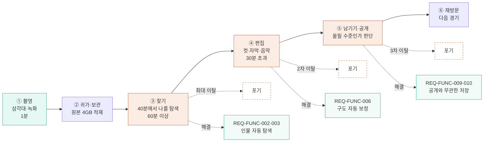

**핵심** — 이탈은 ①촬영이 아니라 **③찾기·④편집·⑤남기기**에 몰려 있다. 촬영은 이미 습관이 됐고 문제는 그 뒤에서 시작된다.

| 단계 | 사용자 행위 | 마찰 |
| --- | --- | --- |
| ① 촬영 | 삼각대를 세우고 녹화 | 거의 없음 (1분) — **이미 습관** |
| ② 귀가·보관 | 원본 4GB가 휴대폰에 쌓임 | 저장공간 경고 |
| ③ 찾기 | 40분 안에서 자기를 눈으로 탐색 | **최대 이탈 지점** (60분 이상) |
| ④ 편집 | 컷·자막·음악을 직접 제작 | **2차 이탈** (30분 초과 시 포기) |
| ⑤ 남기기·공개 | 올릴지 판단 | **3차 이탈** ("보여줄 수준인가") |
| ⑥ 재방문 | 다음 경기에 또 촬영 | 기록이 남지 않아 돌아올 이유 없음 |

검증

## 검증

**근거:** ISO/IEC/IEEE 29148:2018 §9.6.19 *Verification* — 각 요구사항이 충족되었음을 확인하는 방법·기준·순서를 기술한다.

### 10.1 검증 관문 순서

#### 그림 10-1. 검증 관문 흐름도 (Flow Chart)

**무엇을 보여주나** — 어떤 순서로 검증해야 하고, 각 관문에서 실패하면 무엇을 하는지다.

**읽는 법** — 마름모가 판정 지점이다. **굵은 주황 = Gate A**, **굵은 노랑 = Gate B**이며 이 둘은 순서를 바꿀 수 없다. 점선 테두리 상자는 **중단 상태**로, 그 위로 진행하지 않는다.

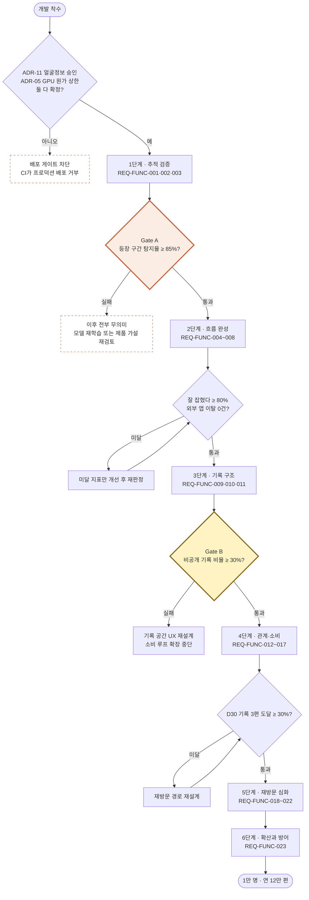

**가장 먼저 읽어야 할 것** — 맨 위 마름모다. **ADR-11(얼굴 정보 동의)과 ADR-05(GPU 원가 상한)가 확정되기 전에는 프로덕션 배포 자체가 막힌다.** 이 둘은 기술 문제가 아니라 결정 사항이다.

관문 순서는 **바꿀 수 없다.** 앞 단계 실패 시 이후 단계에 착수하지 않는다.

| 순서 | 단계 | 대상 요구사항 | 판정 조건 | 실패 시 조치 |
| --- | --- | --- | --- | --- |
| 1 | 추적 검증 | REQ-FUNC-001 · 002 · 003 | **Gate A** — 등장 구간 탐지율 ≥ 85% | **이후 전부 무의미.** 모델 재학습 또는 제품 가설 재검토 |
| 2 | 흐름 완성 | REQ-FUNC-004 ~ 008 | "잘 잡혔다" ≥ 80% · 외부 앱 이탈 0건 | 미달 지표만 개선 후 재판정 |
| 3 | 기록 구조 | REQ-FUNC-009 · 010 · 011 | **Gate B** — 비공개 기록 비율 ≥ 30% | 기록 공간 UX 재설계 · 소비 루프 확장 중단 |
| 4 | 관계 · 소비 | REQ-FUNC-012 ~ 017 | 기록 3편 도달 코호트 전환 ≥ 30% | 재방문 경로 재설계 |
| 5 | 재방문 심화 | REQ-FUNC-018 ~ 022 | 기록 3편 이상 사용자 1만 명 경로 검증 | 확장 시점 연기 |
| 6 | 확산과 방어 | REQ-FUNC-023 | 선택 데이터가 실제로 정확도를 높이는가 | — |

### 10.2 실험 설계

| ID | 검증 대상 | 실험 설계 | 측정 지표 | 성공 기준 |
| --- | --- | --- | --- | --- |
| **EXP-01** | REQ-FUNC-003 (Gate A) | **정답셋 벤치마크.** 농구 원본 n=100편(40분급)에 사람이 등장 구간을 수작업 표시한 정답셋 구축 후 모델 출력과 IoU 비교 | 구간 IoU · 탐지율 · 재식별 정확도 · 오인식률 · 편당 처리 시간 | 탐지율 ≥ 85% · 오인식 ≤ 2% |
| **EXP-02** | 차별 가치 (추적 대상) | **동일 원본 벤치마크.** 같은 100편을 화자 추적 방식과 사람 수작업에 각각 투입 | 탐지율 · 탐색 소요 시간 · 결과물 도달률 | 화자추적군 대비 탐지율 ≥ 2배, 수작업 대비 탐색시간 ≤ 1/12 |
| **EXP-03** | REQ-FUNC-006 | **주관 평가.** 리프레이밍 전/후 쌍 n=200쌍을 참가자 n=50명에게 블라인드 제시 | 5점 척도 · 4점 이상 비율 · 재촬영 의향 | 4점 이상 ≥ 80% · 재촬영 의향 ≤ 10% |
| **EXP-04** | S4 (탐색 시간) | **전후 비교(within-subject).** 베타 사용자 n=30명이 자기 원본 3편을 기존 방식과 본 제품으로 각각 처리 | 스톱워치 실측 · 단계별 체류 로그 | 중앙값 ≤ 5분 · 기존 대비 12배 이상 단축 |
| **EXP-05** | S3 (전환율) | **코호트 추적.** 베타 30일 코호트의 업로드 원본 대비 완성 결과물 | 원본 수 · 완성 수 · 중도 이탈 단계 | ≥ 60% · 이탈이 특정 단계에 몰리지 않을 것 |
| **EXP-06** | REQ-FUNC-009 · 010 (Gate B) | **A/B 테스트 (n=500).** A: 공개 범위를 저장 **후** 선택 / B: 저장 **전** 선택 | 비공개 기록 비율 · 기록 생성 편수 · 마이페이지 재방문율 | 비공개 ≥ 30% · A안이 B안 대비 기록 편수 ≥ 1.3배 |
| **EXP-07** | REQ-FUNC-013 (그룹) | **A/B 테스트 (n=500).** A: 공개 범위 2종 / B: 그룹 포함 3종 | 공개 전환율 · 그룹 공개 선택률 · 그룹 생성률 | B안 공개 전환율이 A안 대비 ≥ 1.5배 · 그룹 선택 ≥ 25% |
| **EXP-08** | 북극성 KPI | **코호트 리텐션.** 주간 코호트의 D7·D30 기록 축적 | 기록 3편 도달률 · D30 재방문율 | D30 3편 도달 ≥ 30% |
| **EXP-09** | REQ-FUNC-004 (후보 수) | **A/B/n 테스트.** 후보 15 / 30 / 50개 | 선택 완료율 · 선택 소요 시간 · 선택 개수 | 선택 완료율이 최대인 구간 채택 |

### 10.3 운영 모니터링 및 알림 기준

| 구분 | 감시 항목 | 알림 기준 | 수신자 | 1차 대응 SLA |
| --- | --- | --- | --- | --- |
| 관문 지표 | 등장 구간 탐지율 | 일간 < 80% | AI 리드 | **2시간** — Gate A 회귀 |
| 저장 | 기록 저장 성공률 | < 99.9% | 백엔드 온콜 | **15분** — 최우선 |
| 보안 | 공개 범위 위반 접근 | **1건이라도** | 보안 담당자 + 제품 리드 | **30분** |
| 파이프라인 | 큐 대기 p95 | > 15분 | 백엔드 온콜 | 4시간 |
| 파이프라인 | 완주율 (S10) | 주간 < 95% | 백엔드 리드 | 1일 |
| 북극성 선행 | D30 기록 3편 도달률 | 주간 < 20% | 제품 리드 | 주간 리뷰 |
| 비용 | 일일 GPU 예산 | 80% 초과 | 백엔드 리드 + 제품 리드 | 4시간 |

### 10.4 단계적 배포

| 단계 | 대상 | 규모 | 판정 지표 | 판정 주체 | 판정 시점 | 실패 시 조치 |
| --- | --- | --- | --- | --- | --- | --- |
| α 내부 | 팀 + 동호회 1곳 | 20명 · 원본 100편 | EXP-01 (Gate A) | AI 리드 + 제품 리드 공동 | 정답셋 100편 처리 완료 시 | 다음 단계 진입 금지 |
| β 비공개 | Q1 사용자 | 200명 | EXP-03 · 04 · 05 | 제품 리드 | 코호트 30일 경과 시 | 미달 지표 개선 후 재판정 |
| β 공개 | 첫 카테고리 | 2,000명 | EXP-06 (Gate B) · EXP-07 | 제품 리드 | A/B n=500 도달 시 | 기록 공간 UX 재설계 |
| 정식 | 카테고리 확장 | — | EXP-08 | 제품 리드 + 경영 | 월말 판정 | 확장 시점 연기 |

운영 시나리오 및 상세 수용 기준

## 운영 시나리오 및 상세 수용 기준

**근거:** ISO/IEC/IEEE 29148:2018 §9.4.17 *Operational scenarios* — 사용자 관점의 운영 시나리오로 요구사항의 사용 맥락을 기술한다. §4.1의 인수 기준을 시나리오 단위로 상세화한 것이며 새로운 요구사항이 아니다.

각 시나리오는 **Given – When – Then** 구조이며, 정상 경로와 **실패 경로(F 접미사)**를 모두 포함한다.

**`연결 REQ` 열 읽는 법** — 각 시나리오가 §4의 어느 요구사항을 검증하는지 가리킨다. 여러 요구사항에 걸치면 모두 적었고,

**딱 맞는 요구사항이 없으면 `—`로 비워 두었다** — 억지로 연결하지 않는다. 현재 `—`는 **SC-6.4 1건**이며, 이는 시스템 요구사항이 아니라

북극성 지표(§8.1)의 선행 관측이기 때문이다. 요구사항 → 모듈 → 테스트의 연결은 §5 추적성 매트릭스에서 이어진다.

### 11.1 시나리오 1 — 장시간 원본에서 본인 장면 자동 탐색 `[Gate A]`

#### 그림 11-1. 원본 업로드부터 후보 제시까지 (Sequence Diagram)

**시퀀스 다이어그램 읽는 법** — 위쪽 가로줄이 참여자(사람·서비스), 아래로 내려가는 세로선이 시간이다. 가로 화살표는 요청·응답이고 `alt`로 묶인 영역은 **조건에 따라 갈리는 분기**다. 회색 메모는 그 지점의 판정 기준이다.

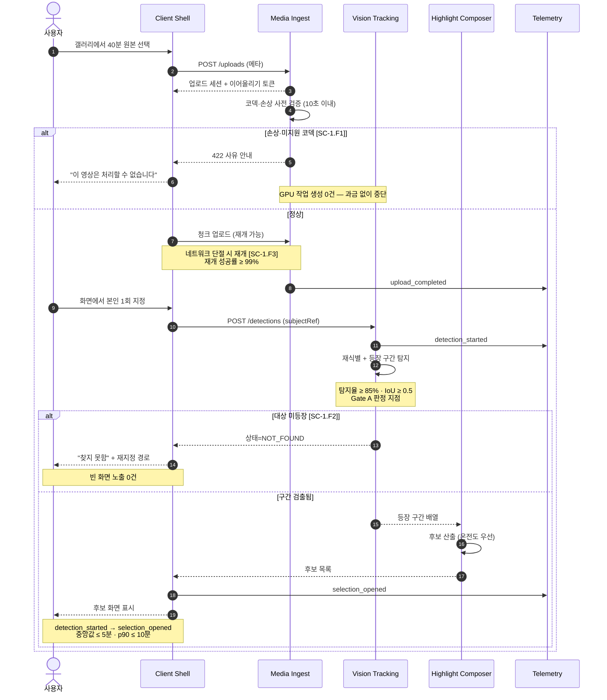

**두 갈래의 실패 경로가 핵심이다.** 파일이 깨졌으면 **GPU를 쓰기 전에** 멈추고(SC-1.F1), 영상에 본인이 안 나왔으면 빈 화면 대신 **재지정 경로**를 준다(SC-1.F2). 둘 다 없으면 사용자는 돈만 쓰고 빈 화면을 보게 된다.

**사용자로서** 40분 원본에서 내가 잘 나온 장면을 대신 찾아주기를 바란다. **그래야** 편집에 한 시간을 쓰지 않고도 오늘의 기록을 남길 수 있다.

| ID | Given / When / Then | 임계치 · 측정 경로 | 연결 REQ |
| --- | --- | --- | --- |
| SC-1.1 | **Given** 40분·4GB 원본과 지정된 추적 대상이 있을 때 / **When** 탐지를 실행하면 / **Then** 정답 구간 대비 탐지 구간 비율이 기준을 넘는다 | 탐지율 ≥ 85% · IoU ≥ 0.5를 정탐으로 · 정답셋 회귀 배치 (**Gate A 판정**) | REQ-FUNC-003 |
| SC-1.2 | **Given** 사용자가 자기를 한 번 지정했을 때 / **When** 대상이 가려졌다 다시 나타나면 / **Then** 같은 사람으로 재식별한다 | 재식별 정확도 ≥ 90% · 오인식 ≤ 2% · 가림 구간 라벨 포함 정답셋 | REQ-FUNC-002 |
| SC-1.3 | **Given** 탐지가 끝났을 때 / **When** 사용자가 선택 화면에 도달하면 / **Then** `detection_started` → `selection_opened` 구간이 기준 이하다 | 중앙값 ≤ 5분 · p90 ≤ 10분 · 앱 백그라운드 시간 제외 | REQ-NF-003 |
| **SC-1.F1** | **Given** 손상·미지원 코덱 원본을 올렸을 때 / **When** 검증 단계에서 판별되면 / **Then** **업로드 전에** 사유를 안내하고 과금 없이 중단한다 | 사전 판별율 ≥ 95% · 판별 소요 ≤ 10초 · **GPU 작업 생성 0건** | REQ-FUNC-001 · REQ-NF-008 |
| **SC-1.F2** | **Given** 원본에 대상이 한 번도 등장하지 않을 때 / **When** 탐지가 끝나면 / **Then** 빈 결과가 아니라 **"찾지 못함" 상태와 재지정 경로**를 제공한다 | 빈 화면 노출 0건 · 재지정 진입률 측정 · 오탐 ≤ 3% | REQ-FUNC-002 · REQ-FUNC-003 |
| **SC-1.F3** | **Given** 업로드 중 네트워크가 끊겼을 때 / **When** 재연결되면 / **Then** 이어올리기로 복구된다 | 재개 성공률 ≥ 99% · 업로드 실패율 < 0.5% · 재시도 ≥ 3회 | REQ-FUNC-001 · REQ-NF-002 |

### 11.2 시나리오 2 — 팀원이 각자 자기 장면을 확보

#### 그림 11-2. 그룹 탈퇴와 기록 회수 (Sequence Diagram)

**시퀀스 다이어그램 읽는 법** — 위쪽 가로줄이 참여자(사람·서비스), 아래로 내려가는 세로선이 시간이다. 가로 화살표는 요청·응답이고 `alt`로 묶인 영역은 **조건에 따라 갈리는 분기**다. 회색 메모는 그 지점의 판정 기준이다.

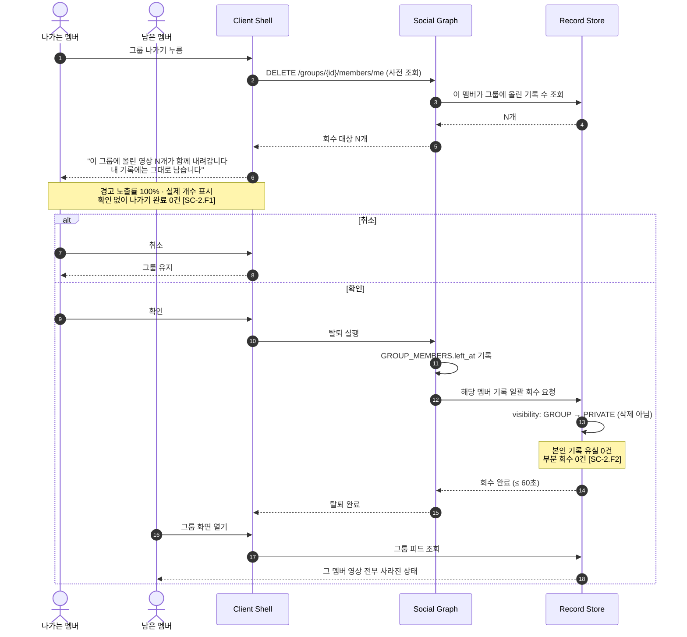

**"내려간다"와 "지운다"는 다르다.** 탈퇴하면 그 멤버의 영상은 그룹 화면에서 사라지지만, 데이터베이스에서는 공개 범위만 `GROUP → PRIVATE`로 바뀔 뿐 **삭제되지 않는다**. 본인 기록 저장소에는 그대로 남는다.

**촬영 담당·팀 운영자로서** 사람마다 자기가 나온 장면을 각자 가져가기를 바란다. **그래야** 촬영 담당인 나도 기록을 남기고, 홍보 주기를 내 편집 속도에서 떼어낼 수 있다.

| ID | Given / When / Then | 임계치 · 측정 경로 | 연결 REQ |
| --- | --- | --- | --- |
| SC-2.1 | **Given** 그룹 멤버가 기록을 보유할 때 / **When** 멤버 필터를 누르면 / **Then** 해당 멤버 기록만 표시된다 | p95 ≤ 300ms · 오표시(타 멤버 기록 노출) 0건 | REQ-FUNC-013 · REQ-NF-005 |
| SC-2.2 | **Given** 촬영 담당 본인이 원본을 올렸을 때 / **When** 본인 대상으로 탐지하면 / **Then** 본인 기록도 동일 품질로 생성된다 | 렌더 성공률 타 멤버와 ±2%p 이내 · 탐지율 차 ≤ 3%p | REQ-FUNC-003 · REQ-FUNC-008 |
| SC-2.3 | **Given** 팀원 12명이 각자 자기 원본을 올렸을 때 / **When** 각자 하이라이트를 만들면 / **Then** **타인 계정에서 발생한 편집 이벤트가 0건**이다 | 타 계정 `selection_*` 이벤트 0건 | REQ-FUNC-005 |
| SC-2.4 | **Given** 한 원본을 여러 사용자가 쓰려 할 때 / **When** MVP 버전에서 시도하면 / **Then** 기능 없음을 명시하고 각자 업로드 경로를 안내한다 | 안내 노출률 100% · 무응답·오류 종료 0건 (REQ-FUNC-024는 P3) | REQ-FUNC-024 *(P3 · 범위 밖 안내)* |
| **SC-2.F1** | **Given** 그룹에 영상 N개를 올린 멤버가 **나가기**를 누를 때 / **When** 확인 화면이 뜨면 / **Then** **"이 그룹에 올린 영상 N개가 함께 내려갑니다 · 내 기록에는 그대로 남습니다"**를 실제 개수와 함께 보여준다 | 경고 노출률 100% · 표시 개수 불일치 0건 · **확인 없이 나가기 완료 0건** | REQ-FUNC-013 |
| **SC-2.F2** | **Given** 멤버가 경고를 확인하고 나갔을 때 / **When** 남은 멤버가 그룹 화면을 열면 / **Then** 그 멤버의 영상이 **전부 사라지되 본인 기록 저장소에는 남는다** | 그룹 잔존 노출 0건 · **본인 기록 유실 0건** · 회수 반영 지연 ≤ 60초 · 부분 회수 0건 | REQ-FUNC-013 · REQ-FUNC-009 |

### 11.3 시나리오 3 — 구석의 인물을 화면 주인공으로

#### 그림 11-3. 선택부터 저장까지 (Sequence Diagram)

**시퀀스 다이어그램 읽는 법** — 위쪽 가로줄이 참여자(사람·서비스), 아래로 내려가는 세로선이 시간이다. 가로 화살표는 요청·응답이고 `alt`로 묶인 영역은 **조건에 따라 갈리는 분기**다. 회색 메모는 그 지점의 판정 기준이다.

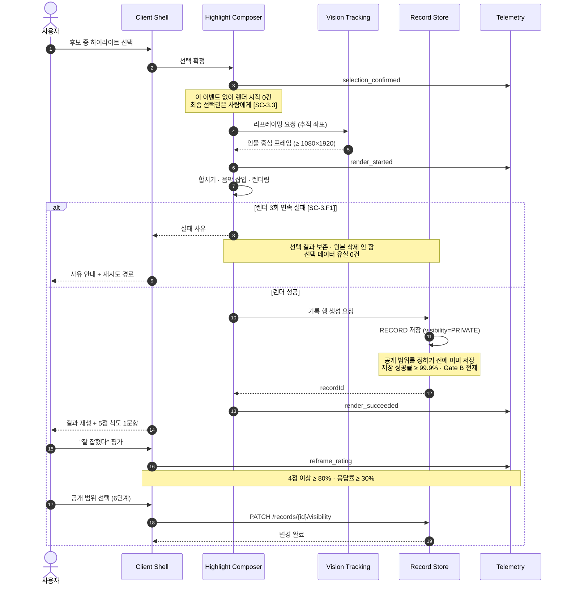

**저장이 공개보다 먼저다.** 그림에서 기록 저장(`RECORD 저장`)이 공개 범위 선택보다 **위에** 있는 것에 주목하면 된다. 이 순서가 뒤바뀌면 "올리지 않아도 남는다"는 제품 주장이 성립하지 않는다.

**크리에이터로서** 편집 시간을 3시간에서 크게 줄여 주기를 바란다. **그래야** 쌓인 원본을 업로드로 연결하고 성장 근거를 만들 수 있다.

| ID | Given / When / Then | 임계치 · 측정 경로 | 연결 REQ |
| --- | --- | --- | --- |
| SC-3.1 | **Given** 대상이 화면 구석에 작게 잡힌 원본일 때 / **When** 리프레이밍 결과를 보여주면 / **Then** 렌더 직후 5점 척도에서 4점 이상 응답 비율이 기준을 넘는다 | ≥ 80% · **응답률 ≥ 30%**(미만이면 무효) | REQ-FUNC-006 |
| SC-3.2 | **Given** 리프레이밍 결과가 나왔을 때 / **When** 사용자가 확인하면 / **Then** 세션 내 재업로드가 발생하지 않는다 | 세션 내 중복 업로드 0건 · 출력 ≥ 1080×1920 | REQ-FUNC-006 · REQ-FUNC-008 |
| SC-3.3 | **Given** 후보가 제시됐을 때 / **When** 결과물이 생성되면 / **Then** 사용자의 명시적 선택 없이 확정된 건이 없다 | `selection_confirmed` 없는 `render_started` 0건 | REQ-FUNC-005 |
| SC-3.4 | **Given** 선택이 끝났을 때 / **When** 합치기·렌더링을 실행하면 / **Then** 앱 안에서 완성된다 | 렌더 p95 ≤ 90초 · 외부 앱 전환 이벤트 0건 | REQ-FUNC-008 · REQ-NF-004 |
| **SC-3.F1** | **Given** 렌더링이 실패했을 때 / **When** 재시도해도 3회 연속 실패하면 / **Then** **선택 결과를 보존한 채** 사유를 안내하고 원본을 삭제하지 않는다 | 선택 데이터 유실 0건 · 재시도 ≥ 3회 · 최종 실패율 ≤ 0.5% | REQ-FUNC-008 · REQ-NF-008 |

### 11.4 시나리오 4 — 공개하지 않아도 기록이 남는다 `[Gate B]`

#### 그림 11-4. 타인 조회와 우회 시도 차단 (Sequence Diagram)

**시퀀스 다이어그램 읽는 법** — 위쪽 가로줄이 참여자(사람·서비스), 아래로 내려가는 세로선이 시간이다. 가로 화살표는 요청·응답이고 `alt`로 묶인 영역은 **조건에 따라 갈리는 분기**다. 회색 메모는 그 지점의 판정 기준이다.

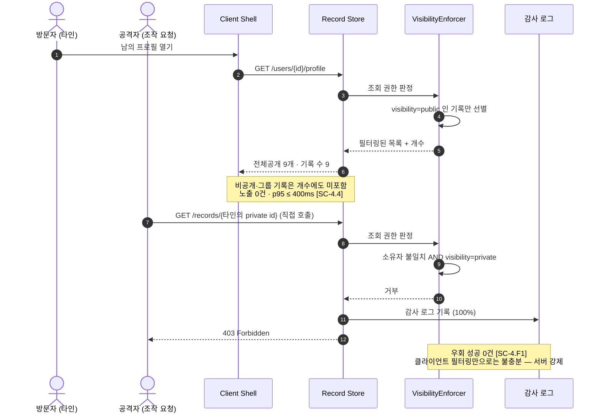

**두 경로를 나란히 그린 이유** — 위쪽은 정상 방문자, 아래쪽은 URL을 조작한 접근이다. 둘 다 **같은 검문소(VisibilityEnforcer)**를 지난다. 화면에서만 가리는 방식이었다면 아래쪽 경로가 뚫린다.

**찍어두고 올리지 않는 사용자로서** 남길 15초를 확실히 건지기를 바란다. **그래야** 공개하지 않고도 기록을 해마다 쌓을 수 있다.

| ID | Given / When / Then | 임계치 · 측정 경로 | 연결 REQ |
| --- | --- | --- | --- |
| SC-4.1 | **Given** 렌더가 완료됐을 때 / **When** 공개 범위를 정하기 **전**이라도 / **Then** 기록 행이 이미 존재한다 | 저장 성공률 ≥ 99.9% · 렌더 성공 대비 기록 누락 0건 · **기본 공개 범위 `private`** | REQ-FUNC-009 · REQ-NF-007 |
| SC-4.2 | **Given** 기록이 쌓였을 때 / **When** 월말 스냅샷을 뽑으면 / **Then** 비공개 비율이 기준을 넘는다 | ≥ 30% · `visibility='private'` ÷ 전체 | REQ-FUNC-010 |
| SC-4.3 | **Given** 마이페이지 격자에 기록이 있을 때 / **When** 목록을 보면 / **Then** 각 기록에 공개 범위 배지가 붙되 **영상 내용을 가리지 않는다** | 배지 미표시 0건 · **명도 대비 ≥ 4.5:1** · 배지 면적 ≤ 썸네일의 8% · **중앙 안전영역(가운데 60%) 침범 0** | REQ-FUNC-010 · REQ-FUNC-011 |
| SC-4.4 | **Given** 남이 내 프로필을 열었을 때 / **When** 목록·개수를 조회하면 / **Then** 전체공개만 보이고 나머지는 **개수에도 포함되지 않는다** | 비공개·그룹 노출 0건 · API 응답 필드 단위 검증 · p95 ≤ 400ms | REQ-FUNC-010 · REQ-NF-005 · REQ-NF-009 |
| **SC-4.F1** | **Given** 클라이언트가 조작된 요청으로 타인의 비공개 기록을 직접 조회할 때 / **When** 서버가 처리하면 / **Then** **403으로 차단하고 감사 로그를 남긴다** | 우회 성공 0건 · 감사 로그 기록률 100% · 회귀 테스트 스위트 상시 통과 | REQ-NF-009 |

### 11.5 시나리오 5 — 같이 뛰는 사람에게만 공개 (그룹)

#### 그림 11-5. 그룹 생성과 링크 초대 (Sequence Diagram)

**시퀀스 다이어그램 읽는 법** — 위쪽 가로줄이 참여자(사람·서비스), 아래로 내려가는 세로선이 시간이다. 가로 화살표는 요청·응답이고 `alt`로 묶인 영역은 **조건에 따라 갈리는 분기**다. 회색 메모는 그 지점의 판정 기준이다.

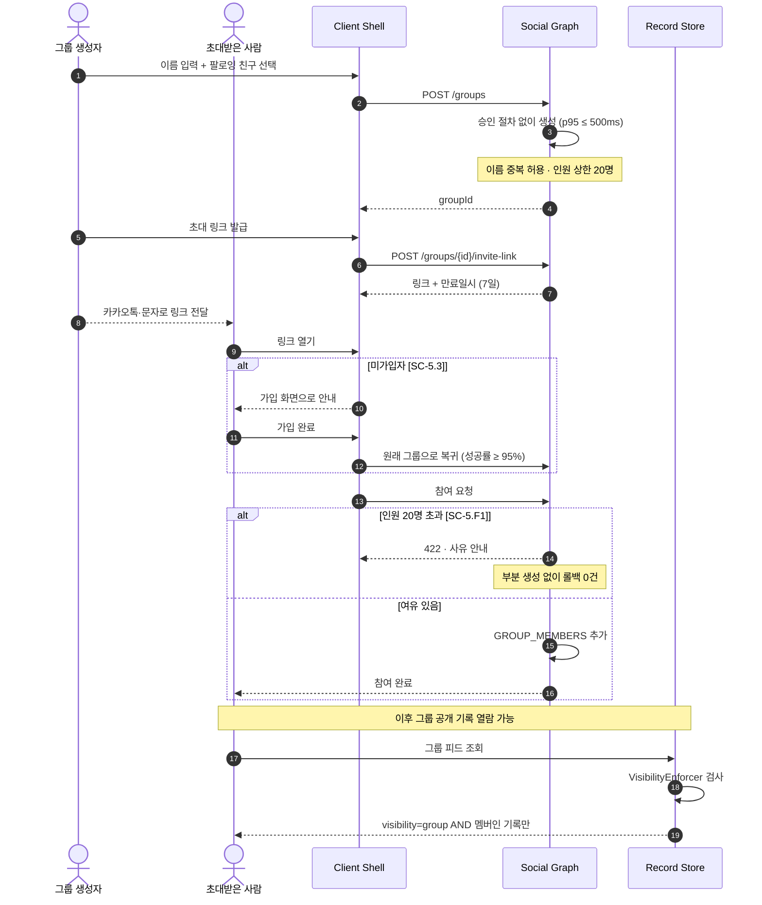

**링크는 열려 있고 참여는 닫혀 있다.** 링크 자체는 카카오톡으로 누구에게나 보낼 수 있지만, 실제 참여는 **가입한 사람만** 가능하다. 링크가 유출돼도 가입 절차와 인원 상한 20명이 이중으로 막는다.

**사용자로서** 팔로워 전부가 아니라 함께 운동하는 소수에게만 열기를 바란다. **그래야** 계정을 쪼개지 않아도 된다.

| ID | Given / When / Then | 임계치 · 측정 경로 | 연결 REQ |
| --- | --- | --- | --- |
| SC-5.1 | **Given** 팔로잉 친구가 있을 때 / **When** 이름을 적고 골라 만들면 / **Then** 승인 절차 없이 생성된다 | 승인 단계 0 · p95 ≤ 500ms · 이름 중복 허용 | REQ-FUNC-013 · REQ-NF-005 |
| SC-5.2 | **Given** "그룹에만 공개" 기록이 있을 때 / **When** 그룹 밖 사용자가 검색·피드·직접 URL로 접근하면 / **Then** 세 경로 모두 노출되지 않는다 | **3경로 전부 0건** · 검색 색인 제외 100% | REQ-FUNC-013 · REQ-NF-009 |
| SC-5.3 | **Given** 그룹 초대 링크를 받은 사람이 있을 때 / **When** 링크를 열면 / **Then** **가입·로그인한 경우에만 참여**되고, 미가입자는 가입 화면으로 안내된다 | **비가입 상태 참여 0건** · 가입 후 원래 그룹 복귀 성공률 ≥ 95% · 링크 유효기간 7일 · 만료 링크 참여 0건 | REQ-FUNC-013 |
| SC-5.4 | **Given** 그룹에 올린 기록을 내렸을 때 / **When** 내 기록을 열면 / **Then** 그대로 남아 있다 | 기록 유실 0건 | REQ-FUNC-009 · REQ-FUNC-013 |
| SC-5.5 | **Given** 팔로우 관계만 있을 때 / **When** 그룹 공개 기록에 접근을 시도하면 / **Then** 차단된다 | 열람 성공 0건 · 감사 로그 100% | REQ-FUNC-012 · REQ-NF-009 |
| **SC-5.F1** | **Given** 그룹 멤버가 **20명**인 상태에서 21번째를 초대할 때 / **When** 초대를 실행하면 / **Then** 사유를 안내하고 **부분 생성 없이 롤백**한다 | 상한 20명 · 21번째 초대 성공 0건 · 부분 생성 0건 · 안내 노출률 100% | REQ-FUNC-013 |

### 11.6 시나리오 6 — 앱을 열면 볼 것이 있다

#### 그림 11-6. 앱 진입과 반응 (Sequence Diagram)

**시퀀스 다이어그램 읽는 법** — 위쪽 가로줄이 참여자(사람·서비스), 아래로 내려가는 세로선이 시간이다. 가로 화살표는 요청·응답이고 `alt`로 묶인 영역은 **조건에 따라 갈리는 분기**다. 회색 메모는 그 지점의 판정 기준이다.

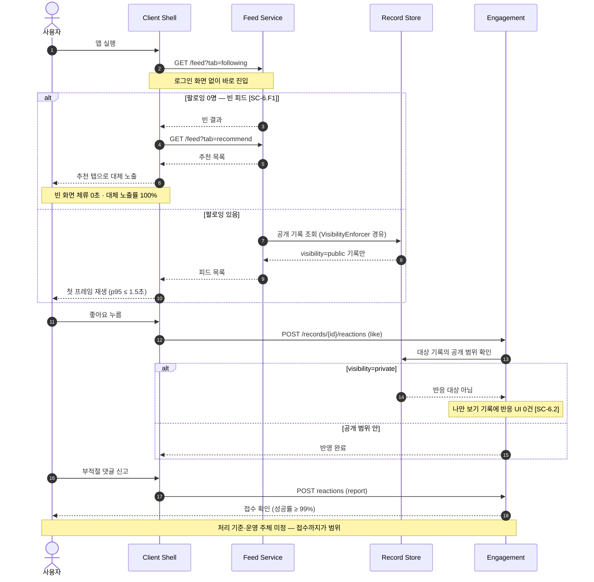

**신규 사용자가 빈 화면을 보지 않게 하는 분기**가 맨 위에 있다. 팔로잉이 0명이면 추천 탭으로 자동 대체한다 — 첫 세션에서 빈 화면을 보면 그대로 이탈하기 때문이다.

**모든 사용자로서** 앱을 열었을 때 볼 것이 있고 반응을 주고받기를 바란다. **그래야** 다음 경기에도 앱을 연다.

| ID | Given / When / Then | 임계치 · 측정 경로 | 연결 REQ |
| --- | --- | --- | --- |
| SC-6.1 | **Given** 앱을 실행했을 때 / **When** 진입하면 / **Then** 로그인 화면 없이 팔로잉 탭에서 영상이 재생된다 | 첫 프레임 p95 ≤ 1.5초 · 빈 피드 노출률 < 5% | REQ-FUNC-011 · REQ-FUNC-014 · REQ-NF-001 |
| SC-6.2 | **Given** "나만 보기" 기록일 때 / **When** 피드를 구성하면 / **Then** 좋아요·댓글 UI가 붙지 않는다 | 비공개 기록 반응 노출 0건 | REQ-FUNC-010 · REQ-FUNC-015 · REQ-FUNC-016 |
| SC-6.3 | **Given** 부적절한 댓글을 만났을 때 / **When** 신고하면 / **Then** 접수 확인이 표시된다 | 접수 성공률 ≥ 99% · *처리 기준·주체 미정 — 접수까지만 검증 대상* | REQ-FUNC-016 |
| SC-6.4 | **Given** 기록을 만든 사용자일 때 / **When** 가입 30일이 지나면 / **Then** 기록 3편 이상을 보유한다 | D30 코호트 전환 ≥ 30% (북극성 선행지표) | — *(북극성 선행지표 · §8.1)* |
| **SC-6.F1** | **Given** 팔로잉이 0명이라 피드가 비었을 때 / **When** 앱에 진입하면 / **Then** **빈 화면 대신 추천 탭으로 대체 노출**한다 | 빈 화면 체류 0초 · 대체 노출률 100% · 신규 첫 세션 이탈률 ≤ 20% | REQ-FUNC-014 |

**시나리오 총계: 정상 24건 + 실패 경로 9건 = 33건.** 모든 Then은 로그·쿼리·테스트로 관찰 가능하며, 주관적 표현은 계측 이벤트나 척도 문항으로 정의했다.

시스템 모드 및 상태

## 시스템 모드 및 상태

**근거:** ISO/IEC/IEEE 29148:2018 §9.5.10 *System modes and states* — 시스템이 취할 수 있는 상태와 전이 조건을 기술한다.

### 12.1 기록의 공개 범위 상태 전이

#### 그림 12-1. 공개 범위 상태 전이도 (State Diagram)

**무엇을 보여주나** — 기록 하나가 가질 수 있는 상태와, 어떤 사건으로 상태가 바뀌는지다. 아래 표의 그림판이다.

**읽는 법** — 둥근 상자가 상태, 화살표 위 글이 **그 전이를 일으키는 사건**이다. `[*]`는 시작·종료를 뜻한다.

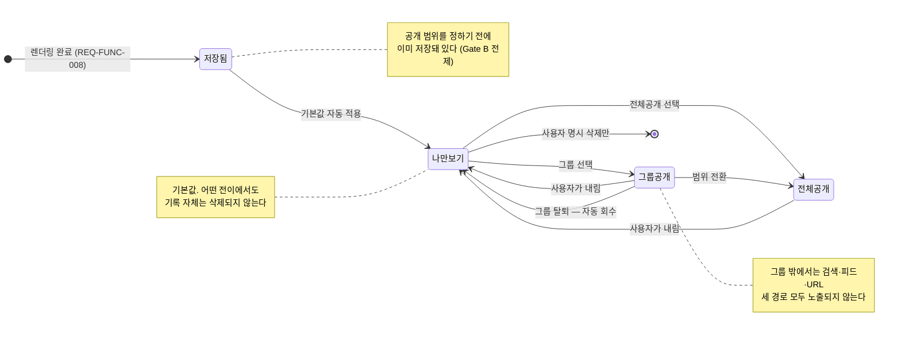

**불변 조건 하나만 기억하면 된다** — 어떤 화살표를 타도 **기록 자체는 삭제되지 않는다**. 공개 범위 변경은 노출 범위만 바꾼다. 삭제로 가는 화살표는 사용자가 명시적으로 지울 때 하나뿐이다.

| 현재 상태 | 전이 사건 | 다음 상태 | 비고 |
| --- | --- | --- | --- |
| (없음) | 렌더링 완료 (REQ-FUNC-008) | **저장됨** | 공개 범위를 정하기 전에 저장이 선행된다 (Gate B의 전제) |
| 저장됨 | 기본값 적용 | **나만 보기** | 사용자 조작 없이 `PRIVATE`로 확정 |
| 나만 보기 | 그룹 선택 (REQ-FUNC-013) | **그룹에만 공개** | 그룹 밖에서는 검색되지 않는다 |
| 나만 보기 | 전체공개 선택 | **전체공개** | — |
| 그룹에만 공개 | 사용자가 내림 | **나만 보기** | 기록은 유실되지 않는다 |
| 그룹에만 공개 | **그룹 탈퇴** | **나만 보기** | 자동 회수. 나가기 전 개수 경고 필수 (SC-2.F1) |
| 그룹에만 공개 | 전체공개 전환 | **전체공개** | — |
| 전체공개 | 사용자가 내림 | **나만 보기** | — |
| 나만 보기 | **사용자 삭제** | (종료) | 삭제는 사용자 명시 조작으로만 가능 |

**불변 조건** — 어떤 전이에서도 기록 자체는 삭제되지 않는다. 공개 범위 변경은 노출 범위만 바꾼다.

### 12.2 편집 파이프라인 단계

#### 그림 12-2. 편집 파이프라인과 실패 분기 (Flow Chart)

**무엇을 보여주나** — 영상 한 편이 만들어지는 6단계와, 각 단계에서 실패했을 때 어디로 빠지는지다.

**읽는 법** — 마름모가 판정 지점, **점선 테두리 상자가 실패 경로**다. 점선 화살표는 실패 후 되돌아가는 경로다.

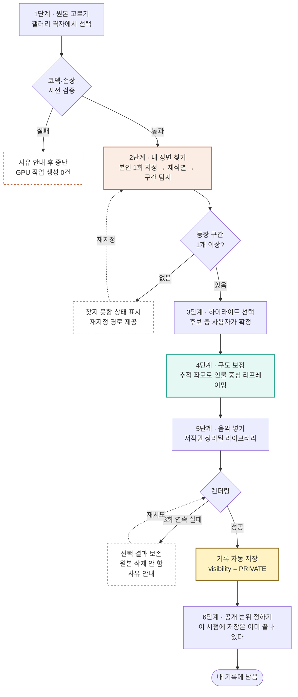

**색이 뜻하는 것** — 주황(2단계)은 Gate A 판정 지점, 초록(4단계)은 이 제품의 차별점인 구도 보정, 노랑(기록 저장)은 Gate B의 전제다. **저장이 6단계보다 앞에 있는 것**이 이 그림의 핵심이다.

| 단계 | 화면 | 담당 요구사항 | 다음 단계 진입 조건 |
| --- | --- | --- | --- |
| 1 · 원본 고르기 | 갤러리 격자 | REQ-FUNC-001 | 코덱 사전 검증 통과 (SC-1.F1) |
| 2 · 내 장면 찾기 | 탐지 진행 | REQ-FUNC-002 · 003 | 등장 구간 1개 이상 (미검출 시 SC-1.F2) |
| 3 · 하이라이트 선택 | 후보 목록 | REQ-FUNC-004 · 005 | `selection_confirmed` 발생 |
| 4 · 구도 보정 | 결과 확인 | REQ-FUNC-006 | 사용자 확인 |
| 5 · 음악 넣기 | 라이브러리 | REQ-FUNC-007 | 곡 선택 또는 건너뛰기 |
| 6 · 공개 범위 정하기 | 범위 선택 | REQ-FUNC-009 · 010 | **이 시점에 기록은 이미 저장돼 있다** |

가정, 의존성 및 제약

## 가정, 의존성 및 제약

**근거:** ISO/IEC/IEEE 29148:2018 §9.6.8 *Assumptions and dependencies* · §9.6.7 *Limitations* — 요구사항이 성립하기 위한 전제와 설계 제약을 기술한다.

### 13.1 설계 결정 기록 (ADR)

| ID | 결정 사항 | 상태 | 결정 필요 시점 |
| --- | --- | --- | --- |
| ADR-01 | 편집 기능으로 과금하지 않는다 (수익 설계 결정이며 편집 가치가 작다는 뜻이 아니다) | **확정** | — |
| ADR-02 | 관계는 팔로워·팔로잉, 비공개 공유는 그룹이 담당한다 | **확정** | — |
| ADR-03 | 첫 검증은 농구 한 카테고리로 좁혀 시작한다 | **확정** | — |
| ADR-04 | 수익 모델 · 가격 · 구독 도입 시점 | 미정 | Gate B 통과 후 |
| ADR-05 | GPU 원가 구조 및 편당 처리 원가 상한 | 미정 | **Gate A 착수 전** |
| ADR-06a | 그룹 인원 상한 — **20명**(생성자 포함) | **확정** | — |
| ADR-06b | 그룹 탈퇴 시 기록 처리 — **그룹에서 회수 · 본인 기록에는 잔존 · 나가기 전 경고 필수** | **확정** | — |
| ADR-06c | 그룹 초대 방식 — **링크 초대 허용, 참여는 가입자만, 유효기간 7일** | **확정** | — |
| ADR-06d | 그룹 이름 중복 — **허용** (그룹은 검색이 아니라 초대로 진입) | **확정** | — |
| ADR-06e | 그룹 내 좋아요·댓글 정책 | 미정 | 그룹 구현 착수 전 |
| ADR-07a | 저장 직후 기본 공개 범위 — **나만 보기(`private`)** | **확정** | — |
| ADR-07b | 공개 범위 표시 방식 — **글자 배지 · 영상 가독성 침해 금지** | **확정** | — |
| ADR-08 | 장면 후보 개수 (30개는 초안) | 미정 | 베타 A/B(EXP-09)로 결정 |
| ADR-09 | 팔로우 승인제 / 자동 | 미정 | 소비 루프 착수 전 |
| ADR-10 | 카테고리 랭킹 도입 여부 (시점만 P1 확정) | 미정 | MVP 이후 |
| ADR-11 | 얼굴 정보 동의 · 보관 · 파기 절차 | 미정 | **법무 — 최우선 · 배포 게이트** |
| ADR-12 | 음악 곡 확보 경로 및 라이선스 비용 | 미정 | REQ-FUNC-007 착수 전 |

### 13.2 리스크 및 대응

| ID | 리스크 | 영향 | 대응 |
| --- | --- | --- | --- |
| **RISK-01** | 등장 구간 탐지율이 85%에 미달 (Gate A 실패) | **치명적.** 인물 추적이 무너지면 나머지 차별점은 기록 앱 하나로 축소된다 | 다른 무엇보다 REQ-FUNC-003을 **먼저** 검증. 농구 한 종목으로 좁혀 데이터 밀도를 높인다. 실패 시 범위를 더 좁히거나 제품 가설을 재검토 |
| **RISK-02** | GPU 원가가 수익 없이 선행한다 | 처리량이 북극성 KPI와 함께 늘어 **원가가 성장에 비례**한다 | 편당 처리 원가 상한을 먼저 정하고(ADR-05), 확정 전 무제한 업로드를 열지 않는다 (REQ-NF-013) |
| **RISK-03** | 인물 추적 기술이 복제된다 | 기존 B2B 사업자가 개인 시장으로 내려오면 우위 소멸 | 방어선을 **선택 데이터 축적**(REQ-FUNC-023)으로 옮긴다. 다만 그 기능은 사용자가 있어야 시작되므로 **속도가 곧 방어** |
| **RISK-04** | 얼굴 정보 동의 절차 미정 | 법적 위험 · REQ-FUNC-024 착수 불가 | 착수 전 법무 검토(ADR-11). MVP는 **본인 지정 1회** 범위로 한정 |
| **RISK-05** | Q4 세그먼트가 비용을 지불하지 않는다 | 시장이 9배지만 매출 0 | 값을 편집이 아니라 기록 축적에서 받기로 결정. 다만 가격·시점 미정이라 검증 불가 |
| **RISK-06** | 근거가 전부 대리 지표다 | 국내 직접 조사 없이 해외·인접 직군 데이터에 의존 | 베타에서 자체 로그로 대체 수집. 국내 조사 실시 여부는 미정 |

### 13.3 설계 제약

| 구분 | 제약 |
| --- | --- |
| 입력 | 앱은 촬영하지 않는다. **원본이 없는 사용자는 제품이 작동하지 않는다** |
| 처리 물량 | 연 12만 편(1만 명 × 월 1편) 기준. 처리량이 GPU 원가에 직접 비례 |
| 업로드 상한 | 최대 60분 / 6GB. 이어올리기 필수 |
| 공개 범위 | 서버 측 강제. 클라이언트 필터링은 요구사항 충족으로 인정하지 않는다 |
| 원본 보관 | 결과물 확보 시점까지를 기본으로 한다 |
| 배포 | ADR-11(얼굴 정보) 산출물 4종 승인 전 프로덕션 배포 금지 |
| 일정 추정 | **공수·스프린트 추정은 본 문서에 포함하지 않는다.** 개발팀 합류 시점에 확정한다 |

### 13.4 미확정 항목 요약

착수 전 결정이 필요한 항목은 다음 7건이며, 그중 **ADR-11(얼굴 정보 동의)과 ADR-05(GPU 편당 원가)**가 Gate A 착수 전에 답이 필요하다.

| 항목 | 막고 있는 요구사항 |
| --- | --- |
| ADR-04 수익 모델·가격·구독 시점 | 없음 (사업 계획) |
| **ADR-05 GPU 편당 원가 상한** | **REQ-NF-013 · Gate A 착수** |
| ADR-06e 그룹 내 좋아요·댓글 정책 | REQ-FUNC-015 · 016의 그룹 적용 범위 |
| ADR-08 장면 후보 개수 | REQ-FUNC-004 임계치 |
| ADR-09 팔로우 승인제 여부 | REQ-FUNC-012 상세 흐름 |
| ADR-10 랭킹 도입 여부 | REQ-FUNC-022 |
| **ADR-11 얼굴 정보 동의·보관·파기** | **REQ-NF-010 · 프로덕션 배포 전체** |
| ADR-12 음악 라이선스 확보 경로 | REQ-FUNC-007 |

*작성자: 제품 아키텍트, 검토자: 백엔드 리드 · AI 리드, 승인자: 제품 리드*

*본 문서는 [`hilit-prd-v1_0.md`](../PRD/hilit-prd-v1_0.md)를 ISO/IEC/IEEE 29148:2018 SRS 양식으로 옮긴 것이며, 원천 문서에 없는 요구사항을 새로 만들지 않았다. 공수·일정 추정은 의도적으로 제외했다.*

*v1.0 확정 시점의 미해결 사항: **REQ-FUNC-004(장면 후보 제시) · REQ-FUNC-007(음악 라이브러리) · REQ-FUNC-017(공유)** 세 건은 §4에 인수 기준이 정의돼 있으나 §11에 대응하는 운영 시나리오가 없다. 검증은 §4의 검증 방식 열로 가능하되, 사용자 관점 시나리오는 후속 판에서 보강 대상이다.*
