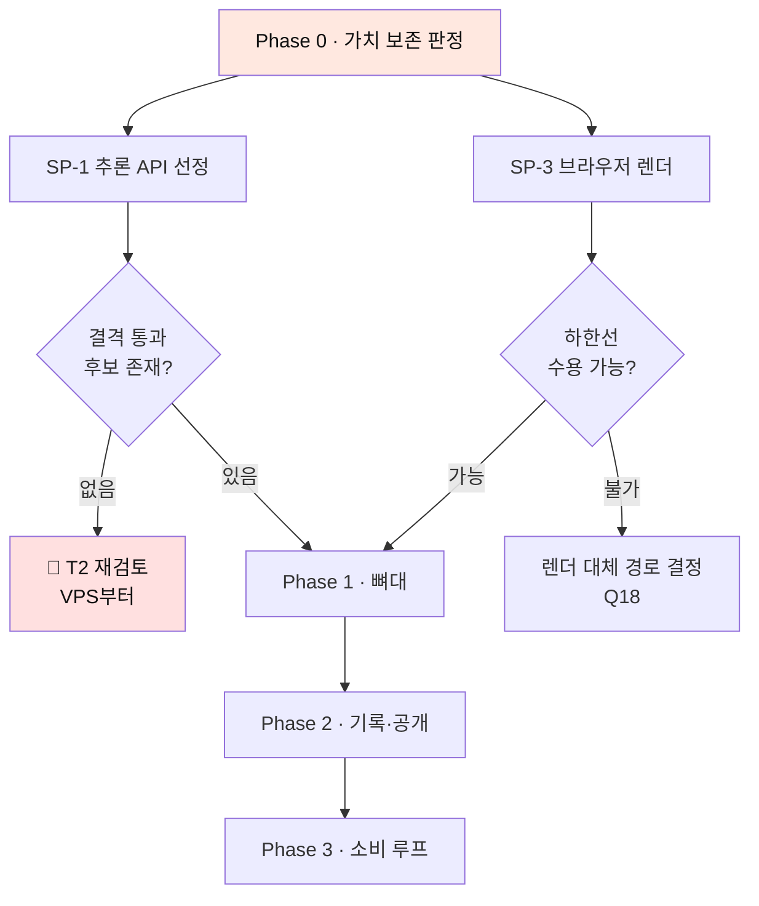

# 실행 계획 — 기술 스택 전면 적용

**대상** `SRS/[SRS]hilit-SRSv2.0-nextjs.md` (v2.2)의 분석을 요구사항·설계·실행에 전면 반영
**기준 문서** `SRS/[SRS]hilit-SRSv1.8.md` (요구사항 원천) · `DS/[DS]hilit-DSv1.1.md` (설계) · `VPS_v0_3.html` (가치 원천)
**작성일** 2026-08-30 · **상태** 착수 전

---

## 0. 이 계획이 답하는 것

| 질문 | 어디서 |
| --- | --- |
| 무엇을 바꾸는가 | §1 변경 목록 |
| 🔴 **바꾸면 제품의 가치가 훼손되는가** | **§2 가치 보존 검토** |
| 어떤 순서로 하는가 | §3 실행 순서 |
| 언제 멈추는가 | §4 중단 조건 |

> **§2가 이 문서의 핵심이다.** 기술 제약을 지키느라 **만들려던 것이 아닌 것을 만들게 되는지**를 먼저 판정하고, 그 판정 위에서 순서를 짠다.

---

# 1. 변경 목록

## 1.1 확정된 스택 제약 (C-TEC-001~007)

| ID | 제약 | 상태 |
| --- | --- | :--: |
| C-TEC-001 | Next.js (App Router) 단일 풀스택 — 프론트/백 미분리 | 확정 |
| C-TEC-002 | 서버 로직은 Server Actions / Route Handlers — 별도 백엔드 없음 | 확정 |
| C-TEC-003 | Prisma + Supabase(PostgreSQL) | 확정 |
| C-TEC-004 | Tailwind CSS + shadcn/ui | 확정 |
| **C-TEC-005** | AI는 Vercel AI SDK로 외부 API 호출 | 🔺 **T1로 부분 완화** |
| C-TEC-006 | Gemini 기본 · 환경 변수만으로 모델 교체 | 확정 |
| **C-TEC-007** | Vercel 단일화 · CI/CD 설정 없이 Git Push 배포 | 🔺 **대안 확정** |

## 1.2 적용할 결정 5건

| # | 결정 | 근거 |
| :--: | --- | --- |
| **D-1** | 🔴 **T1 채택** — 인물 추적을 외부 전용 추론 API로 위임 | v2.2 §2.4 · Gemini는 영상 이해를 하고 인물 추적을 하지 않는다 |
| **D-2** | **배포 게이트를 빌드 타임 검증으로** — `prebuild` + CODEOWNERS + 킬 스위치 3중 | v2.2 §8.1 · CI 설정 파일 없이 작동 |
| **D-3** | **자동재생은 음소거 시작 · 첫 조작 시 소리 활성** | v2.2 §6.5.1 · 브라우저 정책 |
| **D-4** | **F9는 안내만 · O4를 자기신고 지표로** | v2.2 §6.5.2 · 웹에서 측정 불가 |
| **D-5** | **렌더를 클라이언트로 이전** · 탭 종료는 R1+R2로 대응 | v2.2 §3.3 · §6.5.3 |

## 1.3 파생되는 요구사항 변경

| 요구사항 | 변경 | 사유 |
| --- | --- | --- |
| REQ-FUNC-001 | Route Handler 경유 없이 **Storage 직접 업로드** | 요청 본문 크기 상한 |
| REQ-FUNC-008 | 렌더 실행 위치가 **사용자 단말** | 함수 실행 시간 상한 |
| REQ-FUNC-011 | **음소거 시작 · 첫 조작 시 활성** | ✅ v1.7 반영 완료 |
| REQ-NF-004 | 목표를 **단말 등급별로 재정의** | 🔺 SP-3 이후 |
| REQ-NF-009 | **Supabase RLS**로 구현 | DB 계층 강제 |
| REQ-NF-013 | 원가를 **추론 API + Gemini + 단말(0원)** 3분할 | ✅ v2.2 반영 완료 |
| REQ-NF-014 | 완주율 알림 임계 95% | ✅ v1.7 반영 완료 |
| O4 | **자기신고 지표**로 정의 변경 | ✅ v1.7 반영 완료 |

---

# 2. 🔴 가치 보존 검토

**질문은 하나다 — 이 스택으로 만들면 "AI가 나를 찾아주고, 내가 고른 15초가 올리지 않아도 남는" 제품이 그대로 나오는가.**

판정 대상은 셋이다. **Core Job 3조건 · 차별점 D1~D4 · 이탈 3지점.**

## 2.1 Core Job 3조건

> **이미 찍어둔 긴 영상**에서, **내가 의미 있다고 판단한 순간만** 건져서, **남에게 보여줄지와 무관하게** 내 기록으로.
>
> *세 조건 중 하나라도 빠지면 이 Job은 기존 대안으로도 충족된다* [VPS 0.3]

| 조건 | 스택 적용 후 | 판정 |
| --- | --- | :--: |
| **① 이미 찍어둔 긴 영상에서** | Storage 직접 업로드로 40분·4GB 수용. **오히려 코덱 검증이 바이트 수신 전으로 앞당겨져** 실패 비용이 준다 | 🟢 **보존** |
| **② 내가 판단한 순간만** | 선택 UI는 Client Component. 스택과 무관하며 자동 확정 차단(SC-3.3)도 그대로 | 🟢 **보존** |
| **③ 공개와 무관하게 내 기록으로** | **RLS가 DB 계층에서 강제**. 애플리케이션 우회 경로가 원천 차단되고 `count(*)`도 정책 통과분만 셈 | 🟢 **강화** |

> **③은 오히려 좋아진다.** 일반 백엔드 구성에서는 새 조회 경로가 추가될 때마다 필터 누락 위험이 생기지만, **RLS는 개발자가 실수할 여지를 구조적으로 없앤다.** SC-4.4(*"개수에도 미포함"*)가 코드가 아니라 정책으로 보장된다.

**Core Job 3조건은 전부 보존된다.**

## 2.2 차별점 D1~D4

| # | 차별점 | 스택 적용 후 | 판정 |
| :--: | --- | --- | :--: |
| **D1** | 말하지 않고 움직이는 사람을 추적한다 | 🔴 **Gemini 단독으로는 불가** → **T1(외부 추론 API)로 보존** | 🟡 **T1에 종속** |
| **D2** | 최종 선택권이 사람에게 있다 | 선택 UI는 스택 무관 | 🟢 보존 |
| **D3** | 기록의 주인이 개인이다 | 전용 하드웨어를 쓰지 않는다는 전제가 그대로 | 🟢 보존 |
| **D4** | 기록이 먼저고 공개가 선택이다 | RLS + DB 기본값 `private` | 🟢 **강화** |

> 🔴 **D1이 T1 하나에 걸려 있다.** SP-1에서 결격 기준을 통과하는 추론 API가 없으면 **D1이 성립하지 않고, VPS가 명시했듯 나머지 셋은 일반 기록 앱이 된다.**
>
> **이것이 이 계획 전체의 단일 실패점이다.** §4 중단 조건 참조.

## 2.3 이탈 3지점 — 가치 전달 경로

**SRS §2.4가 정의한 이탈 지점에 스택 변경이 어떤 영향을 주는지가 실질 판정이다.**

### ③ 찾기 — 최대 이탈 (60분 이상)

| 항목 | 판정 |
| --- | --- |
| 막는 요구사항 | REQ-FUNC-002 · 003 |
| 스택 영향 | **T1로 이관.** 처리가 외부에서 돌아 **탭을 닫아도 계속 진행**된다 |
| 체감 | 🟢 **개선** — 사용자가 화면을 지키지 않아도 된다 |

> **T1이 부수 효과를 만든다.** 원래 SC-1.F4(앱 종료 재개)는 복구 설계가 필요한 문제였는데, **가장 긴 단계가 외부에서 돌아 애초에 끊기지 않는다.**

### ④ 편집 — 2차 이탈 (30분 초과 시 포기)

| 항목 | 판정 |
| --- | --- |
| 막는 요구사항 | REQ-FUNC-006 · 008 |
| 스택 영향 | 🔴 **렌더가 사용자 단말로 이전** |
| 체감 | 🔴 **저사양 단말에서 악화 가능** |

> 🔴 **여기가 가장 위험하다.**
>
> ④의 이탈은 *"30분 넘어 중도 포기"* 였다. 클라이언트 렌더는 **원가를 0으로 만드는 대신 성공률을 단말에 종속**시킨다. 하한 등급 단말에서 렌더가 실패하거나 수 분씩 걸리면, **우리가 없애려던 바로 그 이탈이 다른 이유로 되살아난다.**
>
> **완성도 부담형(Q4)** 프로필이 *"편집 30분 초과 시 매번 중도 포기"* 인데, 이 사용자가 구형 단말을 쓸 확률이 낮다고 볼 근거가 없다.
>
> **→ SP-3의 하한선(S3-c)이 이 계획의 두 번째 관문이다.**

### ⑤ 남기기·공개 — 3차 이탈 (*"보여줄 수준인가"*)

| 항목 | 판정 |
| --- | --- |
| 막는 요구사항 | REQ-FUNC-009 · 010 · ADR-4 |
| 스택 영향 | RLS + DB 기본값 `private` |
| 체감 | 🟢 **보존 · 구조적으로 강화** |

### ⑥ 재방문 — 그리고 ①로 거슬러 올라가는 이탈

| 항목 | 판정 |
| --- | --- |
| 스택 영향 | 🟡 **자동재생 음소거** |
| 체감 | 🟡 **첫 접점의 체감이 약해진다** |

> **음악은 부가 기능이 아니다.** VPS가 F18a를 MVP에 넣은 이유가 *"음악이 없으면 CapCut으로 내보내고 그 순간 기록도 그쪽에 남는다"* 이고, **O2(완성 전환율 4%→60%)의 인과 경로**로 지목됐다.
>
> **만드는 쪽에는 음악이 필수인데 보는 쪽 첫 접점에서 소리가 나지 않는다.** D-3(첫 조작 시 활성)이 이를 완화하나 **첫 한 편은 무음**이다.
>
> **→ `first_unmute` 계측으로 실측하고 Q17에서 판정한다.**

## 2.4 O1~O10 영향

| 지표 | 스택 영향 | 판정 |
| --- | --- | :--: |
| **O1** 체감 탐색 5분 | T1 실측에 종속 | 🟡 SP-1 |
| **O2** 완성 전환율 60% | 🔴 **클라이언트 렌더 실패율 + 무음 소비**가 하방 압력 | 🔴 **위험** |
| **O3** 구도 만족도 80% | T1 실측에 종속 | 🟡 SP-1 |
| **O4** 원본 삭제 50% | 🔴 **측정 방식 변경**(자기신고) | 🟡 신뢰도 하락 |
| **O5** 비공개 30% | RLS + 기본값 private | 🟢 보존 |
| **O6** 월 4건 | 간접 | 🟢 보존 |
| **O7** 북극성 1만 명 | 간접 | 🟢 보존 |
| **O8** 외주 0원 | 간접 | 🟢 보존 |
| **O9** 탐지율 85% | T1 실측에 종속 | 🟡 SP-1 |
| **O10** 재촬영 0회 | 간접 | 🟢 보존 |

## 2.5 종합 판정

# 🟡 조건부 보존

**Core Job 3조건과 차별점 4개는 보존되며, 둘(③ 기록·공개, D4)은 오히려 강화된다.**

**그러나 가치 전달에 두 개의 실질 위험이 남는다.**

| # | 위험 | 훼손되는 것 | 관문 |
| :--: | --- | --- | --- |
| **R-T1** | 🔴 **추론 API 결격 통과 0건** | **D1 — 제품 정체성 전체** | **SP-1** |
| **R-T2** | 🔴 **저사양 단말 렌더 실패** | **④ 편집 이탈 재발 · O2** | **SP-3** |
| R-T3 | 🟡 무음 소비 비율이 높음 | 음악의 가치 전달 · O2 | 베타 실측 · Q17 |
| R-T4 | 🟡 O4 측정 신뢰도 하락 | UC 저장공간 압박형의 검증 | 자기신고 |

> **R-T1과 R-T2가 각각 SP-1·SP-3에 걸려 있다.** 두 스파이크는 **성능 확인이 아니라 가치 보존 판정**이다. 그래서 §3의 Phase 0에 둘 다 들어간다.
>
> **R-T3·R-T4는 훼손이 아니라 약화다.** 제품은 성립하되 체감과 측정이 나빠진다. 실측 후 대응한다.

---

# 3. 실행 순서

## Phase 0 · 가치 보존 판정 — **착수 전 필수**

| # | 작업 | 산출 | 담당 |
| :--: | --- | --- | --- |
| 0-1 | 🔴 **SP-1** 추론 API 선정·벤치마크 | R-T1 판정 · O1·O3·O9·원가 입력 | AI 리드 |
| 0-2 | 🔴 **SP-3** 브라우저 렌더 하한선 | R-T2 판정 · REQ-NF-004 재정의 입력 | 클라이언트 |
| 0-3 | 선정용 정답셋 10~15편 | SP-1 입력 | AI 리드 |
| 0-4 | Supabase 로컬 스택 + Prisma 초기 스키마 | 개발 환경 | 백엔드 |

**0-1과 0-2는 병렬.** 담당자가 다르고 서로의 결과를 필요로 하지 않는다.

> **이 Phase가 끝나기 전에는 §1.3의 요구사항 변경을 확정하지 않는다.** REQ-NF-004를 지금 재정의하면 근거 없는 숫자가 된다.

## Phase 1 · 뼈대 — 편집 파이프라인

| # | 작업 | 요구사항 | 검증 |
| :--: | --- | --- | --- |
| 1-1 | Storage 직접 업로드 + 코덱 사전 검증 | REQ-FUNC-001 | SC-1.F1 · F3 |
| 1-2 | 추론 API 연동 (요청 발신 + webhook 수신) | REQ-FUNC-002 · 003 | SC-1.F2 |
| 1-3 | ConfidenceGate — 저신뢰 제외 + 제외율 계측 | REQ-FUNC-027 | SC-1.F5 · F6 |
| 1-4 | 후보 목록 (RSC) + 선택 UI | REQ-FUNC-004 · 005 | SC-3.3 |
| 1-5 | 구도 보정 결과 확인 + 다시 고르기 | REQ-FUNC-006 | SC-3.F2 |
| 1-6 | 음악 라이브러리 | REQ-FUNC-007 | 🔴 **Q9 계약 선행** |
| 1-7 | 클라이언트 렌더 + R1·R2 | REQ-FUNC-008 | SC-3.F1 |
| 1-8 | ProcessingJob 체크포인트 + Realtime 구독 | — | SC-1.F4 |

## Phase 2 · 기록·공개 — Gate B

| # | 작업 | 요구사항 | 검증 |
| :--: | --- | --- | --- |
| 2-1 | RecordWriter — 공개 범위 결정 전 행 생성 | REQ-FUNC-009 | SC-4.1 |
| 2-2 | 🔴 **RLS 정책** — 공개 범위 서버 강제 | REQ-NF-009 | SC-4.4 · 4.F1 · 5.2 · 5.5 |
| 2-3 | VisibilitySetting — DB 기본값 `private` | REQ-FUNC-010 | ADR-4 · TC-ADR-04 |
| 2-4 | 마이페이지 소유자/타인 이중 뷰 | REQ-NF-009 | SC-4.4 |
| 2-5 | 그룹 — 상한 20명 원자 증가 · 초대 7일 · 이탈 회수 | REQ-FUNC-013 | SC-5.* · 2.F* |

> **2-2를 Phase 2의 첫 작업으로 둔다.** RLS를 나중에 얹으면 그 전에 만든 조회 경로를 전부 재검증해야 한다.

## Phase 3 · 소비 루프

| # | 작업 | 요구사항 |
| :--: | --- | --- |
| 3-1 | 앱 셸 3탭 + **음소거 시작·첫 조작 시 활성** | REQ-FUNC-011 · D-3 |
| 3-2 | 팔로우 · 피드 · 빈 피드 대체 | REQ-FUNC-012 · 014 |
| 3-3 | 좋아요 · 댓글 · 신고 · 공유 | REQ-FUNC-015~017 |
| 3-4 | Telemetry — `first_unmute` · `origin_delete_reported` 포함 | REQ-NF-014 |

## 횡단 · 착수 즉시

| # | 작업 | 근거 |
| :--: | --- | --- |
| X-1 | `gates/*.gate.json` + `prebuild` 검증 스크립트 | D-2 |
| X-2 | CODEOWNERS + 브랜치 보호 | D-2 |
| X-3 | 🔴 **추론 API 학습 옵트아웃 게이트** — AWS 채택 시 필수 | SP-1 조사 §5-2 |

> **X-3은 파일럿 동의서의 *"학습 데이터로 쓰지 않음"* 과 직결된다.** 설정을 잊으면 약속이 자동으로 깨지므로 **사람의 기억이 아니라 게이트로 강제**한다.

---

# 4. 중단 조건

| 조건 | 조치 |
| --- | --- |
| 🔴 **SP-1 결격 통과 후보 0건** | **T1 불성립.** Phase 1 착수 중단 · **T2(범위 축소)로 VPS부터 재검토** |
| 🔴 **SP-3 하한선이 수용 불가** | 렌더 대체 경로를 먼저 결정(Q18) 후 Phase 1-7 착수 |
| Gate A 미달 (제외 후 탐지율 < 85%) | 이후 개발 전면 중단 · 제외 전 값으로 원인 판별 |
| REQ-NF-010 산출물 4종 미승인 | 공개 발행 기능이 **빌드 산출물에 포함되지 않음** |
| REQ-FUNC-007 라이선스 미확보 | 음악 라이브러리 배포 차단 |
| 편당 원가가 상한 초과 | ADR-2·3 재검토 |

---

# 5. 이 계획이 답하지 못하는 것

| # | 항목 | 소관 |
| :--: | --- | --- |
| 1 | 🔴 **국내 사용자가 실제로 원본을 쌓아두는가** | **Q12 국내 설문 — 이 계획보다 먼저다** |
| 2 | 클럽이 지불할 의사가 있는가 | Wizard of Oz 파일럿 |
| 3 | 하한 미만 단말 처리 방침 | SP-3 이후 제품 결정 (Q18) |
| 4 | 무음 소비 비율이 높을 때의 대응 | 베타 실측 후 제품 결정 (Q17) |
| 5 | 후보 정렬 기준 선택 필요 여부 | Phase 1 실측 후 (Q19) |

> **SRS §6.5가 정한 0순위는 여전히 Q12(국내 설문)다.** 이 계획은 *"만들 수 있는가"* 와 *"만들면 가치가 남는가"* 를 답하고, ***"만들 이유가 있는가"*** 는 설문이 답한다. **셋은 서로를 대체하지 않는다.**

---

*이 계획은 기술 스택 적용의 실행 순서와 가치 보존 판정을 담는다. 요구사항의 원천은 SRS v1.8이며, 이 문서가 요구사항을 새로 만들지 않는다. §1.3의 변경은 Phase 0 완료 후 SRS 개정으로 확정한다.*
