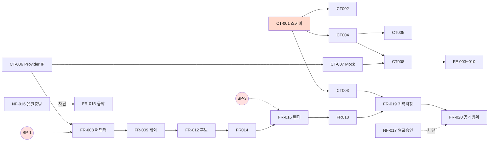

# HILiT 개발 태스크 리스트 (전체)

**원천** `SRS/[SRS]hilit-SRSv1.8.md` · `SRS/[SRS]hilit-SRSv2.0-nextjs.md`(v2.2) · `DS/[DS]hilit-DSv1.1.md`
**방법론** 4단계 추출 (계약·데이터 → 로직 → 테스트 → NFR·의존성)
**작성일** 2026-08-30 · **총 93건**

---

## 0. 표기 규약

| 접두 | 관점 | 담당 |
| :--: | --- | --- |
| **CT** | 계약·데이터 명세 (Step 1) | 백엔드 |
| **FR** | 백엔드 로직 — Command / Query (Step 2) | 백엔드 |
| **UX** | 🎨 **UI/UX 디자인** — 화면 설계 | 디자인 |
| **FE** | 프론트엔드 구현 | 클라이언트 |
| **TS** | 테스트 (Step 3) | QA |
| **NF** | 비기능·인프라·게이트 (Step 4) | 백엔드·법무 |

> **제약 준수** — UI/UX 디자인(**UX**)과 개발·인프라(**CT·FR·FE·NF**)를 분리했다. SRS에 없는 기능은 추가하지 않았고, 근거 절을 전부 명시했다.

**복잡도** — H: 성능·정확도가 결과를 좌우하거나 다수 경로에 걸침 / M: 신규 설계 필요 / L: 기존 패턴 조합

---

## 1. Step 1 — 계약 및 데이터 명세 (CT · 8건)

| Task ID | Epic (도메인) | Feature (기능명) | 관련 SRS 섹션 | 선행 태스크 | 복잡도 |
|---|---|---|---|---|---|
| CT-001 | Data Contract | [DB] Prisma 스키마 16 엔티티 정의 및 마이그레이션 | v1.8 §6.2 · DS §4.2 | None | H |
| CT-002 | Data Contract | [DB] SQL CHECK 제약 11건 및 인덱스 적용 | v1.8 §6.2.1 · v2.2 §4.1 | CT-001 | M |
| CT-003 | Data Contract | [DB] RLS 정책 — 공개범위 3단 + 그룹 멤버십 | v2.2 §4.2 · REQ-NF-009 | CT-001 | H |
| CT-004 | API Contract | [API Spec] Server Action 시그니처·Zod 스키마·오류 코드 정의 | DS §3.1 · §3.2 · v2.2 §5.1 | CT-001 | H |
| CT-005 | API Contract | [API Spec] Webhook 수신 계약 2종 (Storage · Inference) | v2.2 §5.1 | CT-004 | M |
| CT-006 | AI Contract | [API Spec] TrackingProvider 인터페이스 및 팩토리 정의 | v2.2 §7.4 · REQ-FUNC-002·003 | None | M |
| CT-007 | Mock | [Mock] 추론 결과 Mock — bbox 시계열·재식별 신뢰도 | v2.2 §7.4 · CT-006 | CT-006 | M |
| CT-008 | Mock | [Mock] 후보 목록 Mock — 신뢰도 플래그 포함 | v1.8 §6.1 · REQ-FUNC-004 | CT-004 · CT-007 | L |

---

## 2. Step 2 — 로직 Command (FR-001 ~ FR-030 · 30건)

### 2.1 Media Ingest

| Task ID | Epic (도메인) | Feature (기능명) | 관련 SRS 섹션 | 선행 태스크 | 복잡도 |
|---|---|---|---|---|---|
| FR-001 | Media Ingest | [Command] 업로드 개시 및 코덱 사전 검증 (Signed URL 발급) | REQ-FUNC-001 · SC-1.F1 · v2.2 §5.3 | CT-001 · CT-004 | M |
| FR-002 | Media Ingest | [Command] Storage 직접 업로드 세션 (resumable) 관리 | REQ-FUNC-001 · REQ-NF-002 · SC-1.F3 | FR-001 | M |
| FR-003 | Media Ingest | [Command] 업로드 완료 Webhook 수신 및 상태 전이 | v2.2 §5.1 · REQ-FUNC-001 | CT-005 · FR-002 | L |
| FR-004 | Media Ingest | [Command] 원본 삭제 처리 | v1.8 §6.1 · REQ-FUNC-019 | CT-001 | L |

### 2.2 Vision Tracking

| Task ID | Epic (도메인) | Feature (기능명) | 관련 SRS 섹션 | 선행 태스크 | 복잡도 |
|---|---|---|---|---|---|
| FR-005 | Vision Tracking | [Command] 추적 대상 1회 지정 (anchor bbox 저장) | REQ-FUNC-002 · SC-1.2 | CT-004 | M |
| FR-006 | Vision Tracking | [Command] 탐지 작업 요청 발신 및 Job 등록 | REQ-FUNC-002·003 · v2.2 §7.4 | CT-006 · FR-005 | M |
| FR-007 | Vision Tracking | [Command] 추론 결과 Webhook 수신 및 결과 정규화 | REQ-FUNC-003 · v2.2 §5.1 | CT-005 · CT-006 | M |
| FR-008 | Vision Tracking | [Command] 추론 어댑터 구현 (선정 후보) | REQ-FUNC-002·003 · REQ-NF-003 | CT-006 · **SP-1** | H |
| FR-009 | Vision Tracking | [Command] ConfidenceGate — 저신뢰 후보 제외 및 제외율 계측 | REQ-FUNC-027 · SC-1.F5·F6 | FR-007 | H |
| FR-010 | Vision Tracking | [Command] 리프레이밍 적용 (추적 좌표 기반 구도 재구성) | REQ-FUNC-006 · SC-3.1 | FR-008 | H |
| FR-011 | Vision Tracking | [Command] 처리 단계 체크포인트 저장 및 재개 | SC-1.F4 · REQ-NF-008 | CT-001 · FR-006 | M |

### 2.3 Highlight Composer

| Task ID | Epic (도메인) | Feature (기능명) | 관련 SRS 섹션 | 선행 태스크 | 복잡도 |
|---|---|---|---|---|---|
| FR-012 | Highlight Composer | [Command] 후보 산출 및 온전도 우선 정렬 (약 30개) | REQ-FUNC-004 · SC-1.F2 | FR-009 | M |
| FR-013 | Highlight Composer | [Command] Gemini 의미 구간 산출 (보조 경로) | REQ-FUNC-004 · v2.2 §7.3 | CT-004 · **SP-2** | M |
| FR-014 | Highlight Composer | [Command] 선택 확정 및 자동 확정 차단 | REQ-FUNC-005 · SC-3.3 | CT-004 · FR-012 | M |
| FR-015 | Highlight Composer | [Command] 음악 라이브러리 곡 조회·삽입 (15초 자동 맞춤) | REQ-FUNC-007 · SC-3.4 | CT-001 · **NF-016** | M |
| FR-016 | Highlight Composer | [Command] 클라이언트 렌더 엔진 (WebCodecs / ffmpeg.wasm) | REQ-FUNC-008 · v2.2 §3.3 | **SP-3** · FR-014 | H |
| FR-017 | Highlight Composer | [Command] 렌더 이탈 대응 — beforeunload 경고 · 선택 서버 저장 | v2.2 §6.5.3 · SC-3.F1·F2 | FR-014 · FR-016 | M |
| FR-018 | Highlight Composer | [Command] 렌더 완료 등록 및 기록 생성 트리거 | REQ-FUNC-008·009 | FR-016 | L |

### 2.4 Record Store

| Task ID | Epic (도메인) | Feature (기능명) | 관련 SRS 섹션 | 선행 태스크 | 복잡도 |
|---|---|---|---|---|---|
| FR-019 | Record Store | [Command] 기록 자동 저장 (공개범위 결정 전 행 생성) | REQ-FUNC-009 · SC-4.1 · REQ-NF-007 | CT-001 · CT-003 | M |
| FR-020 | Record Store | [Command] 공개 범위 변경 (3단 · 기본값 private) | REQ-FUNC-010 · ADR-4 · SC-4.2 | CT-003 · FR-019 | M |
| FR-021 | Record Store | [Command] 그룹 생성 (승인 없음 · 상한 20명 원자 증가) | REQ-FUNC-013 · SC-5.1 · SC-5.F1 | CT-001 · CT-002 | M |
| FR-022 | Record Store | [Command] 그룹 초대 (링크 7일 · 가입자 한정) | REQ-FUNC-013 · v1.8 §6.3-7 · SC-5.3 | FR-021 | M |
| FR-023 | Record Store | [Command] 그룹 이탈 처리 및 공유 링크 회수 | REQ-FUNC-013 · SC-2.F1·F2 | FR-021 · FR-028 | M |
| FR-024 | Record Store | [Command] 정보주체 삭제 요구 이행 (원본·파생물 전량 물리 삭제) | **REQ-NF-019** · v1.8 §6.2.3 | CT-001 | H |
| FR-025 | Record Store | [Command] 원본 삭제 안내 및 자기신고 수집 | REQ-FUNC-019 · v2.2 §6.5.2 | FR-018 | L |

### 2.5 Social Graph · Feed · Engagement

| Task ID | Epic (도메인) | Feature (기능명) | 관련 SRS 섹션 | 선행 태스크 | 복잡도 |
|---|---|---|---|---|---|
| FR-026 | Social Graph | [Command] 팔로우 · 언팔로우 (단방향) | REQ-FUNC-012 · SC-5.5 | CT-001 | L |
| FR-027 | Engagement | [Command] 좋아요 (공개범위 내 한정) | REQ-FUNC-015 · SC-6.2 | CT-003 · FR-019 | L |
| FR-028 | Engagement | [Command] 공유 링크 발급 (만료 30일 · 범위 승계) | REQ-FUNC-017 · REQ-NF-012 | CT-003 · FR-019 | M |
| FR-029 | Engagement | [Command] 댓글 작성 및 신고 접수 | REQ-FUNC-016 · SC-6.3 | FR-027 | L |
| FR-030 | Engagement | [Infra] Vercel Cron — 공유 링크 만료 배치 | v2.2 §5.1 · REQ-NF-012 | FR-028 | L |

---

## 3. Step 2 — 로직 Query (FR-031 ~ FR-036 · 6건)

| Task ID | Epic (도메인) | Feature (기능명) | 관련 SRS 섹션 | 선행 태스크 | 복잡도 |
|---|---|---|---|---|---|
| FR-031 | Highlight Composer | [Query] 후보 목록 조회 (신뢰도 플래그 · 제외 건수 포함) | REQ-FUNC-004 · SC-1.F6 | FR-012 | L |
| FR-032 | Record Store | [Query] 마이페이지 기록 목록 및 종목·공개범위 필터 | REQ-FUNC-020 · SC-4.3 · SC-4.5 | CT-003 | M |
| FR-033 | Record Store | [Query] 프로필 조회 — 소유자 / 타인 이중 뷰 | **REQ-NF-009** · SC-4.4 | CT-003 | H |
| FR-034 | Record Store | [Query] 그룹 구성원 목록 조회 및 필터 | REQ-FUNC-013 · REQ-NF-005 | FR-021 | L |
| FR-035 | Feed | [Query] 탭별 피드 조회 및 빈 피드 대체 노출 | REQ-FUNC-014 · SC-6.F1 | CT-003 · FR-026 | M |
| FR-036 | Telemetry | [Query] 처리 상태 Realtime 구독 (processing_jobs) | v2.2 §5.1 · SC-1.F4 | FR-011 | M |

---

## 4. 🎨 UI/UX 디자인 (UX · 10건)

> **개발과 분리한 관점.** 화면 구조·상태·흐름 설계이며 구현은 FE 태스크가 받는다. 근거는 v2.2 §6(UI Design)과 프로토타입 v0.6이다.

| Task ID | Epic (도메인) | Feature (기능명) | 관련 SRS 섹션 | 선행 태스크 | 복잡도 |
|---|---|---|---|---|---|
| UX-001 | Shell | [UX] 앱 셸 3탭 내비게이션 및 진입 재생 화면 설계 | v2.2 §6 · REQ-FUNC-011 | None | M |
| UX-002 | Editing | [UX] 원본 선택 화면 설계 (OS 갤러리 흐름) | REQ-FUNC-001 · REF-13 화면06 | None | L |
| UX-003 | Editing | [UX] 후보 목록 및 선택 화면 설계 | v2.2 §6 · REQ-FUNC-004·005 | None | M |
| UX-004 | Editing | [UX] 구도 보정 결과 비교 및 다시 고르기 화면 설계 | REQ-FUNC-006 · SC-3.F2 | None | M |
| UX-005 | Editing | [UX] 음악 선택 화면 설계 (5갈래 카테고리) | REQ-FUNC-007 | None | L |
| UX-006 | Record | [UX] 공개 범위 선택 화면 설계 (글자 배지) | v2.2 §6 · ADR-4 | None | L |
| UX-007 | Record | [UX] 마이페이지 화면 설계 (이중 뷰 · 필터) | v2.2 §6 · SC-4.3·4.4 | None | M |
| UX-008 | Social | [UX] 그룹 화면 설계 (생성 · 초대 · 멤버) | v2.2 §6 · REQ-FUNC-013 | None | M |
| UX-009 | Engagement | [UX] 반응 시트 및 공유 시트 설계 | v2.2 §6 · REQ-FUNC-015~017 | None | L |
| UX-010 | Feedback | [UX] 처리 진행 · 실패 안내 화면 설계 | v2.2 §6 · SC-1.F2·F6 · SC-3.F1 | None | M |

---

## 5. 프론트엔드 구현 (FE · 10건)

| Task ID | Epic (도메인) | Feature (기능명) | 관련 SRS 섹션 | 선행 태스크 | 복잡도 |
|---|---|---|---|---|---|
| FE-001 | Shell | [FE] 앱 셸 3탭 구현 및 음소거 자동재생·first_unmute 계측 | REQ-FUNC-011 · v2.2 §6.5.1 | UX-001 · CT-004 | M |
| FE-002 | Editing | [FE] 원본 선택 및 Storage 직접 업로드 클라이언트 | REQ-FUNC-001 · v2.2 §5.3 | UX-002 · FR-002 | M |
| FE-003 | Editing | [FE] 후보 목록·선택 UI (가상 스크롤) | REQ-FUNC-004·005 | UX-003 · CT-008 | M |
| FE-004 | Editing | [FE] 구도 보정 비교 및 다시 고르기 UI | REQ-FUNC-006 · SC-3.F2 | UX-004 · FR-010 | M |
| FE-005 | Editing | [FE] 음악 선택 UI | REQ-FUNC-007 | UX-005 · FR-015 | L |
| FE-006 | Record | [FE] 공개 범위 선택 UI | REQ-FUNC-010 | UX-006 · FR-020 | L |
| FE-007 | Record | [FE] 마이페이지 UI (이중 뷰 · 필터) | REQ-FUNC-020 · SC-4.4 | UX-007 · FR-032·033 | M |
| FE-008 | Social | [FE] 그룹 UI (생성 · 초대 · 멤버 필터) | REQ-FUNC-013 | UX-008 · FR-021·022 | M |
| FE-009 | Engagement | [FE] 반응 시트 · 공유 시트 UI | REQ-FUNC-015~017 | UX-009 · FR-027·028 | L |
| FE-010 | Feedback | [FE] 처리 진행 UI (Realtime) 및 실패 안내 | SC-1.F4 · SC-1.F2·F6 | UX-010 · FR-036 | M |

---

## 6. Step 3 — 테스트 (TS · 11건)

> **원재료가 이미 있다.** v1.8 §5.2가 운영 시나리오 42건을 `SC → 연결 REQ → TC ID`로 매핑해 뒀다.

| Task ID | Epic (도메인) | Feature (기능명) | 관련 SRS 섹션 | 선행 태스크 | 복잡도 |
|---|---|---|---|---|---|
| TS-001 | Test/Vision | [Test] 시나리오1 — 장시간 원본 본인 장면 탐색 (Gate A) | v1.8 §5.2 SC-1.1~1.3 | FR-008 | H |
| TS-002 | Test/Social | [Test] 시나리오2 — 팀원 각자 자기 장면 확보 | SC-2.1~2.4 | FR-021 · FR-023 | M |
| TS-003 | Test/Editing | [Test] 시나리오3 — 구석 인물을 화면 주인공으로 | SC-3.1~3.4 | FR-010 · FR-016 | M |
| TS-004 | Test/Record | [Test] 시나리오4 — 공개하지 않아도 기록이 남는다 (Gate B) | SC-4.1~4.5 | FR-019 · FR-020 | H |
| TS-005 | Test/Social | [Test] 시나리오5 — 같이 뛰는 사람에게만 공개 (그룹) | SC-5.1~5.5 | FR-022 · CT-003 | M |
| TS-006 | Test/Feed | [Test] 시나리오6 — 앱을 열면 볼 것이 있다 | SC-6.1~6.4 | FR-035 · FR-027 | M |
| TS-007 | Test/Failure | [Test] 실패경로 — 업로드·탐지 (SC-1.F1~F6) | v1.8 §5.2 · §6.7 | FR-001 · FR-009 | M |
| TS-008 | Test/Failure | [Test] 실패경로 — 그룹 이탈·렌더 실패 (SC-2.F1·F2 · SC-3.F1·F2) | v1.8 §5.2 | FR-023 · FR-017 | M |
| TS-009 | Test/Failure | [Test] 실패경로 — 공개범위 우회·용량 초과 (SC-4.F1·F2 · SC-5.F1) | v1.8 §5.2 | CT-003 · FR-021 | M |
| TS-010 | Test/Failure | [Test] 실패경로 — 빈 피드·미성년 동의 (SC-6.F1 · SC-0.1·0.F1) | v1.8 §5.2 · §6.7 | FR-035 · NF-015 | M |
| TS-011 | Test/Design | [Test] 설계 결정 검증 (TC-ADR-02·03·04) | v1.8 §5.3 | FR-008 · FR-009 · FR-020 | M |

---

## 7. Step 4 — 비기능·인프라·게이트 (NF · 18건)

### 7.1 성능·계측

| Task ID | Epic (도메인) | Feature (기능명) | 관련 SRS 섹션 | 선행 태스크 | 복잡도 |
|---|---|---|---|---|---|
| NF-001 | Perf | [Infra] 응답시간 계측 하니스 (p95 7종) | REQ-NF-001~005 | CT-004 | M |
| NF-002 | Perf | [Infra] 부하 시나리오 및 가용성 검증 | REQ-NF-006 · 008 | NF-001 | M |
| NF-003 | Telemetry | [Infra] 계측 이벤트 22종 발행 파이프라인 | v1.8 §6.4.3 · REQ-NF-014 | CT-004 | M |
| NF-004 | Telemetry | [Infra] 파이프라인 완주율 집계 (≥95%) | REQ-NF-014 | NF-003 · FR-011 | M |
| NF-005 | Telemetry | [Infra] 알림 기준·수신자·대응 SLA 구성 | REQ-NF-014 | NF-004 | M |
| NF-006 | Cost | [Infra] 편당 처리 원가 추적 (추론·영상이해·전송·렌더 4항목) | REQ-NF-013 | NF-003 · **SP-1** | M |

### 7.2 보안

| Task ID | Epic (도메인) | Feature (기능명) | 관련 SRS 섹션 | 선행 태스크 | 복잡도 |
|---|---|---|---|---|---|
| NF-007 | Security | [Sec] RLS 우회 시도 테스트 (우회 성공 0건) | REQ-NF-009 · SC-4.F1 | CT-003 | H |
| NF-008 | Security | [Sec] 저장 at-rest 암호화 및 TLS 1.2+ 점검 | REQ-NF-011 | CT-001 | M |
| NF-009 | Security | [Sec] 접근 거부 감사 로그 (visibility_denied) | REQ-NF-009 · v2.2 §9-2 | CT-003 · NF-003 | M |
| NF-010 | Security | [Sec] 속도 제한 구현 (분당 60 · 업로드 3) | DS §3.1.3 · v2.2 §9-3 | CT-004 | M |

### 7.3 배포 게이트

| Task ID | Epic (도메인) | Feature (기능명) | 관련 SRS 섹션 | 선행 태스크 | 복잡도 |
|---|---|---|---|---|---|
| NF-011 | Gate | [Infra] 빌드 타임 게이트 검증 스크립트 (`prebuild`) | v2.2 §8.1.3 | None | M |
| NF-012 | Gate | [Infra] CODEOWNERS 및 브랜치 보호 설정 | v2.2 §8.1.4 | None | L |
| NF-013 | Gate | [Infra] 런타임 킬 스위치 | v2.2 §8.1.5 | NF-011 | L |
| NF-014 | Gate | [Infra] 추론 API 학습 옵트아웃 게이트 | 04_API후보조사 §5-2 | NF-011 · **SP-1** | M |

### 7.4 법무 산출물 승인 — **개발 태스크가 아님**

| Task ID | Epic (도메인) | Feature (기능명) | 관련 SRS 섹션 | 선행 태스크 | 복잡도 |
|---|---|---|---|---|---|
| NF-015 | Legal Gate | [Legal] 미성년 이용자 정책 산출물 4종 승인 | REQ-NF-016 · SC-0.1 | None | H |
| NF-016 | Legal Gate | [Legal] 음원 라이선스 증빙 3종 확보 | REQ-FUNC-007 · v1.8 §4.4 | None | H |
| NF-017 | Legal Gate | [Legal] 얼굴 정보 처리 산출물 4종 승인 | REQ-NF-010 | None | H |
| NF-018 | Legal Gate | [Legal] 영상 내 미성년자 산출물 3종 승인 | REQ-NF-017 · SC-0.F1 | None | H |

---

## 8. 의존성 요약 — 임계 경로

### 🔴 차단 관계 — 개발로 풀 수 없는 것

| 차단자 | 대상 | 성격 |
| --- | --- | --- |
| **SP-1** (추론 API 선정) | FR-008 · FR-010 · NF-006 · NF-014 | 스파이크 |
| **SP-3** (브라우저 렌더) | FR-016 · FR-017 | 스파이크 |
| **SP-2** (Gemini 보조) | FR-013 | 스파이크 |
| **NF-016** (음원 증빙) | FR-015 · FE-005 | **계약** |
| **NF-017 · NF-018** (얼굴·미성년) | FR-020 공개 발행 경로 | **법무 승인** |
| **NF-015** (미성년 이용자) | 가입 플로우 전체 | **법무 승인** |

### 🟢 선행 없이 지금 착수 가능 — 9건

`CT-001` · `CT-006` · `UX-001~010`(10건) · `NF-011` · `NF-012` · `NF-015~018`(법무 4건)

> **UX 10건은 전부 선행이 없다.** 화면 설계는 백엔드 계약과 무관하므로 **CT와 완전 병렬**로 진행할 수 있다. 이것이 이 목록에서 가장 큰 병렬화 기회다.

---

## 9. 집계

| 구분 | 건수 | H | M | L |
| --- | ---: | ---: | ---: | ---: |
| CT 계약·데이터 | 8 | 3 | 4 | 1 |
| FR Command | 30 | 5 | 16 | 9 |
| FR Query | 6 | 1 | 3 | 2 |
| 🎨 UX 디자인 | 10 | 0 | 6 | 4 |
| FE 프론트엔드 | 10 | 0 | 7 | 3 |
| TS 테스트 | 11 | 2 | 9 | 0 |
| NF 비기능·게이트 | 18 | 5 | 10 | 3 |
| **합계** | **93** | **16** | **55** | **22** |

---

## 10. 이 목록이 포함하지 않는 것

| # | 항목 | 이유 |
| :--: | --- | --- |
| 1 | 공수·기간 산정 | 팀 속도 실측이 없다 `[TBD]` |
| 2 | 담당자 배정 | 조직 구성이 문서에 없다 |
| 3 | 스프린트 배치 | 스프린트 길이 미정 |
| 4 | SRS에 없는 기능 | **제약 준수** — 임의 추가하지 않았다 |
| 5 | SP-1·SP-3 스파이크 자체 | `실행 계획/03_스파이크_실행계획.md` 소관 |

---

*이 목록은 SRS v1.8 · v2.2 · DS v1.1에 명시된 내용만으로 도출했다. 각 태스크의 근거 절을 표에 명시했으며, 문서에 없는 기능은 추가하지 않았다.*
