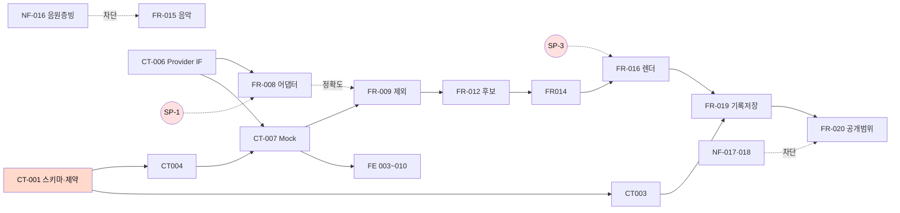

# HILiT 개발 태스크 리스트 (축약본)

**원천** `SRS/[SRS]hilit-SRSv1.8.md` · `SRS/[SRS]hilit-SRSv2.0-nextjs.md`(v2.2) · `DS/[DS]hilit-DSv1.1.md`
**방법론** 4단계 추출 (계약·데이터 → 로직 → 테스트 → NFR·의존성)
**작성일** 2026-08-30 · **총 54건** *(93건에서 축약 — `plans/TASK-축약-분석보고서.md`)*

---

## 0. 표기 규약

| 접두 | 관점 | 담당 |
| :--: | --- | --- |
| **CT** | 계약·데이터 명세 (Step 1) | 백엔드 |
| **FR** | 백엔드 로직 — Command / Query (Step 2) | 백엔드 |
| **UX** | 🎨 **UI/UX 디자인** — 화면 설계 | 디자인 |
| **FE** | 프론트엔드 구현 | 클라이언트 |
| **TS** | 테스트 (Step 3) | QA |
| **NF** | 비기능·인프라·게이트 (Step 4) | 백엔드·법무 |

> **제약 준수** — UI/UX 디자인(**UX**)과 개발·인프라(**CT·FR·FE·NF**)를 분리했다. SRS에 없는 기능은 추가하지 않았고, 근거 절을 전부 명시했다.

**복잡도** — H: 성능·정확도가 결과를 좌우하거나 다수 경로에 걸침 / M: 신규 설계 필요 / L: 기존 패턴 조합

### 서식 4종

| 서식 | 대상 | 종료 조건 |
| --- | --- | --- |
| `Feature Task` | 일반 개발 | AC 충족 |
| 🔺 **`Convergence Task`** | **FR-008 · FR-009 · FR-016** | 🔴 **임계 도달** — 구현 완료 ≠ 완료 |
| 🔴 **`Gate Task`** | **NF-015 ~ 018** | 산출물 승인 |
| 🎨 **`Design Task`** | **UX 전량** | 화면 상태 정의 완료 |

---

## 1. Step 1 — 계약 및 데이터 명세 (CT · 5건)

| Task ID | Epic | Feature | 관련 SRS 섹션 | 선행 | 복잡도 |
|---|---|---|---|---|---|
| CT-001 | Data Contract | [DB] Prisma 스키마 16 엔티티 · **SQL 제약 11건** · 인덱스 | v1.8 §6.2 · §6.2.1 · DS §4.2 | None | H |
| CT-003 | Data Contract | [DB] RLS 정책 — 공개범위 3단 + 그룹 멤버십 | v2.2 §4.2 · REQ-NF-009 | CT-001 | H |
| CT-004 | API Contract | [API Spec] Server Action 시그니처·Zod·오류 코드 · **Webhook 2종** | DS §3.1·§3.2 · v2.2 §5.1 | CT-001 · CT-006 | H |
| CT-006 | AI Contract | [API Spec] TrackingProvider 인터페이스 및 팩토리 | v2.2 §7.4 · REQ-FUNC-002·003 | None | M |
| CT-007 | Mock | [Mock] Mock 픽스처 11종 — **추론 결과 + 후보 목록** | v2.2 §7.4 · REQ-FUNC-004 | CT-004 · CT-006 | M |

---

## 2. Step 2 — 로직 (FR · 21건)

### 2.1 Media Ingest

| Task ID | Epic | Feature | 관련 SRS 섹션 | 선행 | 복잡도 |
|---|---|---|---|---|---|
| FR-001 | Media Ingest | [Command] **업로드 파이프라인** — 코덱 검증 · 직접 업로드 · 완료 수신 | REQ-FUNC-001 · REQ-NF-002 · SC-1.F1·F3 · v2.2 §5.3 | CT-001 · CT-004 | M |
| FR-004 | Media Ingest | [Command] 원본 삭제 및 **저장공간 회수 안내** | REQ-FUNC-019 · v2.2 §6.5.2 | CT-001 · FR-019 | M |

### 2.2 Vision Tracking

| Task ID | Epic | Feature | 관련 SRS 섹션 | 선행 | 복잡도 |
|---|---|---|---|---|---|
| FR-005 | Vision Tracking | [Command] **지정 · 탐지 요청 · 결과 수신** (한 왕복) | REQ-FUNC-002·003 · v2.2 §7.4 | CT-004 · CT-006 | H |
| FR-008 | Vision Tracking | 🔺 [Command] 추론 어댑터 구현 — **Gate A** | REQ-FUNC-002·003 · REQ-NF-003 | CT-006 · **SP-1** | H |
| FR-009 | Vision Tracking | 🔺 [Command] ConfidenceGate — 저신뢰 제외 · 제외율 계측 | REQ-FUNC-027 · SC-1.F5·F6 | FR-005 · CT-007 | H |
| FR-010 | Vision Tracking | [Command] 리프레이밍 적용 (추적 좌표 기반 구도 재구성) | REQ-FUNC-006 · ADR-3 · SC-3.1 | FR-008 | H |
| FR-011 | Vision Tracking | [Command] 처리 단계 체크포인트 저장 및 재개 | SC-1.F4 · REQ-NF-008 | CT-001 · FR-005 | M |

### 2.3 Highlight Composer

| Task ID | Epic | Feature | 관련 SRS 섹션 | 선행 | 복잡도 |
|---|---|---|---|---|---|
| FR-012 | Highlight Composer | [Command/Query] **후보 산출 · 온전도 정렬 · 조회** (Gemini 보조 포함) | REQ-FUNC-004 · SC-1.F2·F6 · v2.2 §7.3 | FR-009 · 🔺 **SP-2** | M |
| FR-014 | Highlight Composer | [Command] 선택 확정 및 **자동 확정 차단** | REQ-FUNC-005 · SC-3.3 | CT-004 · FR-012 | M |
| FR-015 | Highlight Composer | [Command] 음악 라이브러리 곡 조회·삽입 (15초 자동 맞춤) | REQ-FUNC-007 · SC-3.4 | CT-001 · **NF-016** | M |
| FR-016 | Highlight Composer | 🔺 [Command] **클라이언트 렌더 엔진 및 이탈 대응** | REQ-FUNC-008 · v2.2 §3.3·§6.5.3 | **SP-3** · FR-014 | H |

### 2.4 Record Store

| Task ID | Epic | Feature | 관련 SRS 섹션 | 선행 | 복잡도 |
|---|---|---|---|---|---|
| FR-019 | Record Store | [Command] **렌더 완료 등록 및 기록 자동 저장** (공개범위 결정 전) | REQ-FUNC-008·009 · REQ-NF-007 · SC-4.1 | CT-003 · FR-016 | H |
| FR-020 | Record Store | [Command] 공개 범위 변경 (3단 · 기본값 private) | REQ-FUNC-010 · ADR-4 · SC-4.2 | CT-003 · FR-019 | M |
| FR-024 | Record Store | [Command] 정보주체 삭제 요구 이행 (전량 물리 삭제) | **REQ-NF-019** · v1.8 §6.2.3 | CT-001 | H |
| FR-032 | Record Store | [Query] 마이페이지 기록 목록 및 종목·공개범위 필터 | REQ-FUNC-020 · SC-4.3·4.5 | CT-003 | M |
| FR-033 | Record Store | [Query] 프로필 조회 — 🔴 **소유자 / 타인 이중 뷰** | **REQ-NF-009** · SC-4.4 | CT-003 | H |

### 2.5 Social · Feed · Engagement

| Task ID | Epic | Feature | 관련 SRS 섹션 | 선행 | 복잡도 |
|---|---|---|---|---|---|
| FR-021 | Social Graph | [Command/Query] **그룹 — 생성 · 초대 · 이탈 · 구성원 조회** | REQ-FUNC-013 · SC-5.1~5.F1 · SC-2.1·2.F1 | CT-001 · CT-003 · FR-028 | H |
| FR-026 | Social Graph | [Command/Query] **팔로우 및 탭별 피드** (빈 피드 대체) | REQ-FUNC-012·014 · SC-6.1·6.F1 | CT-003 · FR-020 | M |
| FR-027 | Engagement | [Command] **반응 — 좋아요 · 댓글 · 신고 접수** | REQ-FUNC-015·016 · SC-6.2·6.3 | CT-003 · FR-019 | M |
| FR-028 | Engagement | [Command/Infra] **공유 링크 — 발급 · 범위 승계 · 만료 배치** | REQ-FUNC-017 · REQ-NF-012 | CT-003 · FR-019 | M |
| FR-036 | Telemetry | [Query] 처리 상태 Realtime 구독 (`processing_jobs`) | v2.2 §5.1 · SC-1.F4 | FR-011 | M |

---

## 3. 🎨 UI/UX 디자인 (UX · 5건)

> **개발과 분리한 관점.** 화면 단위가 아니라 **플로우 단위**로 묶었다 — 디자이너의 실제 산출 단위가 플로우다.

| Task ID | Epic | Feature | 관련 SRS 섹션 | 선행 | 복잡도 |
|---|---|---|---|---|---|
| UX-001 | Shell | [UX] 앱 셸 3탭 내비게이션 및 진입 재생 | v2.2 §6·§6.5.1 · REQ-FUNC-011 | None | M |
| UX-002 | Editing | [UX] **편집 플로우** — 원본 선택 → 후보 → 구도 → 음악 | REQ-FUNC-001·004~007 · SC-1.F1~F6 · SC-3.F2 | None | H |
| UX-006 | Record | [UX] **기록 · 공개 범위** — 글자 배지 · 이중 뷰 · 필터 | v2.2 §6 · ADR-4 · SC-4.1~4.5 | None | H |
| UX-008 | Social | [UX] **소셜** — 그룹 · 반응 시트 · 공유 시트 | v2.2 §6 · REQ-FUNC-013·015~017 | None | M |
| UX-010 | Feedback | [UX] 처리 진행 · 실패 안내 | v2.2 §6·§6.5.3 · SC-1.F2·F6 · SC-3.F1 | None | M |

---

## 4. 프론트엔드 구현 (FE · 7건)

| Task ID | Epic | Feature | 관련 SRS 섹션 | 선행 | 복잡도 |
|---|---|---|---|---|---|
| FE-001 | Shell | [FE] 앱 셸 3탭 · 음소거 자동재생 · `first_unmute` 계측 | REQ-FUNC-011 · v2.2 §6.5.1 | UX-001 · FR-026 | M |
| FE-002 | Editing | [FE] 원본 선택 및 Storage 직접 업로드 클라이언트 | REQ-FUNC-001 · v2.2 §5.3 | UX-002 · FR-001 | M |
| FE-003 | Editing | [FE] 후보 목록·선택 UI (가상 스크롤) | REQ-FUNC-004·005 | UX-002 · CT-007 | M |
| FE-004 | Editing | [FE] **구도 보정 비교 · 음악 선택 UI** | REQ-FUNC-006·007 · SC-3.F2 | UX-002 · FR-010 · FR-015 | M |
| FE-006 | Record | [FE] **공개 범위 선택 · 마이페이지 UI** (이중 뷰 · 필터) | REQ-FUNC-010·020 · SC-4.4 | UX-006 · FR-020 · FR-032·033 | M |
| FE-008 | Social | [FE] **그룹 · 반응 시트 · 공유 시트 UI** | REQ-FUNC-013·015~017 | UX-008 · FR-021 · FR-027·028 | M |
| FE-010 | Feedback | [FE] 처리 진행 UI (Realtime) 및 실패 안내 | SC-1.F4 · SC-1.F2·F6 | UX-010 · FR-036 | M |

---

## 5. Step 3 — 테스트 (TS · 4건)

> **원재료가 이미 있다.** v1.8 §5.2가 운영 시나리오 42건을 `SC → 연결 REQ → TC ID`로 매핑해 뒀다.
> 🔴 **추적성은 89개 TC ID가 담당하며 태스크 단위가 아니다** — 병합해도 매트릭스가 끊기지 않는다.

| Task ID | Epic | Feature | 관련 SRS 섹션 | 선행 | 복잡도 |
|---|---|---|---|---|---|
| TS-001 | Test/Gate | [Test] 🔴 **Gate A 검증** — 제외 후 탐지율 ≥ 85% (+ TC-ADR-02) | v1.8 §5.2 SC-1.1~1.3 · §5.3 | FR-008 · FR-009 | H |
| TS-002 | Test/Scenario | [Test] **정상 시나리오 스위트** — SC-2·3·5·6 (+ TC-ADR-03) | v1.8 §5.2 · §5.3 | FR-010 · FR-016 · FR-021 · FR-026 | H |
| TS-004 | Test/Gate | [Test] 🔴 **Gate B 검증** — 기록 공간 수용성 (+ TC-ADR-04) | v1.8 §5.2 SC-4.1~4.5 · §5.3 | FR-019 · FR-020 | H |
| TS-007 | Test/Failure | [Test] **실패 경로 스위트** — SC-1.F1~F6 · 2.F · 3.F · 4.F · 5.F1 · 6.F1 · 0.1·0.F1 | v1.8 §5.2 · §6.7 | FR-001 · FR-009 · CT-003 · NF-015 | H |

---

## 6. Step 4 — 비기능·인프라·게이트 (NF · 12건)

### 6.1 성능·계측·원가

| Task ID | Epic | Feature | 관련 SRS 섹션 | 선행 | 복잡도 |
|---|---|---|---|---|---|
| NF-001 | Perf | [Infra] **응답시간 계측 하니스 · 부하·가용성 검증** | REQ-NF-001~006·008 | CT-004 | M |
| NF-003 | Telemetry | [Infra] **계측 이벤트 22종 · 완주율 집계 · 알림 기준·SLA** | v1.8 §6.4.3 · REQ-NF-014 | CT-004 · FR-011 | H |
| NF-006 | Cost | [Infra] 편당 처리 원가 추적 (추론·영상이해·전송·렌더) | REQ-NF-013 | NF-003 · **SP-1** | M |

### 6.2 보안

| Task ID | Epic | Feature | 관련 SRS 섹션 | 선행 | 복잡도 |
|---|---|---|---|---|---|
| NF-007 | Security | [Sec] 🔴 **RLS 우회 시도 테스트** (우회 성공 0건 · Realtime 경로 포함) | REQ-NF-009 · SC-4.F1 | CT-003 · FR-036 | H |
| NF-008 | Security | [Sec] **플랫폼 보안 설정** — at-rest 암호화 · TLS · 속도 제한 | REQ-NF-011 · DS §3.1.3 | CT-001 · CT-004 | M |
| NF-009 | Security | [Sec] 접근 거부 감사 로그 (`visibility_denied` · 기록률 100%) | REQ-NF-009 · v2.2 §9-2 | CT-003 · NF-003 | M |

### 6.3 배포 게이트

| Task ID | Epic | Feature | 관련 SRS 섹션 | 선행 | 복잡도 |
|---|---|---|---|---|---|
| NF-011 | Gate | [Infra] **배포 게이트 3중 구조** — 빌드 검증 · CODEOWNERS · 킬 스위치 | v2.2 §8.1.2~8.1.5 | None | M |
| NF-014 | Gate | [Infra] 추론 API 학습 옵트아웃 게이트 | 04_API후보조사 §5-2 | NF-011 · **SP-1** | M |

### 6.4 법무 산출물 승인 — 🔴 **개발 태스크가 아님 · 병합 불가**

| Task ID | Epic | Feature | 관련 SRS 섹션 | 선행 | 복잡도 |
|---|---|---|---|---|---|
| NF-015 | Legal Gate | [Legal] 미성년 **이용자** 정책 산출물 4종 승인 | REQ-NF-016 · SC-0.1 | None | H |
| NF-016 | Legal Gate | [Legal] 음원 라이선스 증빙 3종 확보 | REQ-FUNC-007 · v1.8 §4.4 | None | H |
| NF-017 | Legal Gate | [Legal] 얼굴 정보 처리 산출물 4종 승인 | REQ-NF-010 | None | H |
| NF-018 | Legal Gate | [Legal] 영상 **내** 미성년자 산출물 3종 승인 | REQ-NF-017 · SC-0.F1 | None | H |

---

## 7. 🔀 폐번 리다이렉트 표 (39건)

> **재번호를 하지 않았다.** 살아남는 쪽의 ID를 유지해 기존 참조를 보존했다.

| 폐번 | → | 흡수처 |
| --- | :--: | --- |
| CT-002 SQL 제약·인덱스 | → | **CT-001** |
| CT-005 Webhook 계약 | → | **CT-004** |
| CT-008 후보 목록 Mock | → | **CT-007** |
| FR-002 직접 업로드 세션 · FR-003 완료 Webhook | → | **FR-001** |
| FR-025 삭제 안내·자기신고 | → | **FR-004** |
| FR-006 탐지 요청 · FR-007 결과 수신 | → | **FR-005** |
| FR-013 Gemini 보조 · FR-031 후보 조회 | → | **FR-012** |
| FR-017 렌더 이탈 대응 | → | **FR-016** |
| FR-018 렌더 완료 등록 | → | **FR-019** |
| FR-022 초대 · FR-023 이탈 · FR-034 구성원 조회 | → | **FR-021** |
| FR-035 탭별 피드 | → | **FR-026** |
| FR-029 댓글·신고 | → | **FR-027** |
| FR-030 Cron 만료 배치 | → | **FR-028** |
| UX-003 후보 · UX-004 구도 · UX-005 음악 | → | **UX-002** |
| UX-007 마이페이지 | → | **UX-006** |
| UX-009 반응·공유 시트 | → | **UX-008** |
| FE-005 음악 UI | → | **FE-004** |
| FE-007 마이페이지 UI | → | **FE-006** |
| FE-009 반응·공유 UI | → | **FE-008** |
| TS-003 · TS-005 · TS-006 · TS-011 | → | **TS-002** |
| TS-008 · TS-009 · TS-010 | → | **TS-007** |
| NF-002 부하·가용성 | → | **NF-001** |
| NF-004 완주율 · NF-005 알림 SLA | → | **NF-003** |
| NF-010 속도 제한 | → | **NF-008** |
| NF-012 CODEOWNERS · NF-013 킬 스위치 | → | **NF-011** |

---

## 8. 🔴 병합하지 않은 6쌍 — 합치면 요구사항이 깨진다

| # | 대상 | 합치면 무엇이 깨지는가 |
| :--: | --- | --- |
| **1** | **FR-004** 원본 삭제 ↔ **FR-024** 정보주체 삭제 | **결과가 정반대다** — 앞은 완성 영상을 **남기고**(`SET NULL`), 뒤는 **함께 지운다**. 한 함수가 되면 **둘 중 하나는 반드시 틀리고, 틀린 쪽이 법적 의무다** |
| **2** | **FR-032** 소유자 뷰 ↔ **FR-033** 타인 뷰 | **SC-4.4** — 타인에게는 비공개가 **개수에도 잡히면 안 된다**. `if (isOwner)` 분기로 다루면 집계 같은 세부에서 반드시 샌다 |
| **3** | **FR-008** 어댑터 ↔ **FR-009** 제외 | **차단자가 다르다** — FR-008은 SP-1 대기, FR-009는 Mock으로 지금 가능. 합치면 **병렬화 설계가 통째로 무효**가 된다 |
| **4** | **FR-019** 기록 저장 ↔ **FR-020** 공개 범위 | **§6.3 규칙 1** — *"저장과 공개는 분리된 행위다"*. 요구사항 본문이 분리를 명시했다 |
| **5** | **NF-015 ~ 018** 법무 게이트 4건 | **각각 별도의 `gate.json`·승인 체인·차단 대상.** NF-015는 **가입 전체**를, 나머지는 **공개 발행**을 막는다. 합치면 **하나가 미승인일 때 전부 막힌다** |
| **6** | **UX** ↔ **FE** | **사용자 제약** — UI/UX 디자인과 개발·인프라 관점의 분리 |

---

## 9. 의존성 요약 — 임계 경로

### 🔴 차단 관계 — 개발로 풀 수 없는 것

| 차단자 | 대상 | 성격 |
| --- | --- | --- |
| **SP-1** (추론 API 선정) | FR-008 · FR-010 · NF-006 · NF-014 | 스파이크 |
| **SP-3** (브라우저 렌더) | FR-016 | 스파이크 |
| **SP-2** (Gemini 보조) | FR-012 **§C만** | 스파이크 · 🟢 A·B는 진행 가능 |
| **NF-016** (음원 증빙) | FR-015 · FE-004 부분 | **계약** |
| **NF-017 · NF-018** (얼굴·미성년자) | FR-020 공개 발행 경로 | **법무 승인** · 🟢 `private` 경로는 열림 |
| **NF-015** (미성년 이용자) | 🔴 **가입 플로우 전체** | **법무 승인** |

### 🟢 선행 없이 지금 착수 가능 — 12건

`CT-001` · `CT-006` · `UX-001·002·006·008·010`(5건) · `NF-011` · `NF-015~018`(법무 4건)

> **UX 5건은 전부 선행이 없다.** 화면 설계는 백엔드 계약과 무관하므로 **CT와 완전 병렬**로 진행할 수 있다.

---

## 10. 집계

| 구분 | 현재 | *(축약 전)* | H | M | L |
| --- | ---: | ---: | ---: | ---: | ---: |
| CT 계약·데이터 | **5** | *8* | 3 | 2 | 0 |
| FR 로직 | **21** | *36* | 9 | 12 | 0 |
| 🎨 UX 디자인 | **5** | *10* | 2 | 3 | 0 |
| FE 프론트엔드 | **7** | *10* | 0 | 7 | 0 |
| TS 테스트 | **4** | *11* | 4 | 0 | 0 |
| NF 비기능·게이트 | **12** | *18* | 6 | 6 | 0 |
| **합계** | **54** | *93* | **24** | **30** | **0** |

> **L 등급이 사라졌다.** 축약이 흡수한 것이 정확히 **L 태스크들**이다 — *"기존 패턴 조합"* 수준의 작업은 **독립 태스크가 아니라 상위 태스크의 항목**이었다는 뜻이다.

---

## 11. 이 목록이 포함하지 않는 것

| # | 항목 | 이유 |
| :--: | --- | --- |
| 1 | 공수·기간 산정 | 팀 속도 실측이 없다 `[TBD]` |
| 2 | 담당자 배정 | 조직 구성이 문서에 없다 |
| 3 | 스프린트 배치 | 스프린트 길이 미정 |
| 4 | SRS에 없는 기능 | **제약 준수** — 임의 추가하지 않았다 |
| 5 | SP-1·SP-2·SP-3 스파이크 자체 | `실행 계획/03_스파이크_실행계획.md` 소관 |

---

*이 목록은 SRS v1.8 · v2.2 · DS v1.1에 명시된 내용만으로 도출했다. 축약 근거와 병합 판정 기준은 `plans/TASK-축약-분석보고서.md` §1·§4에 있다.*
