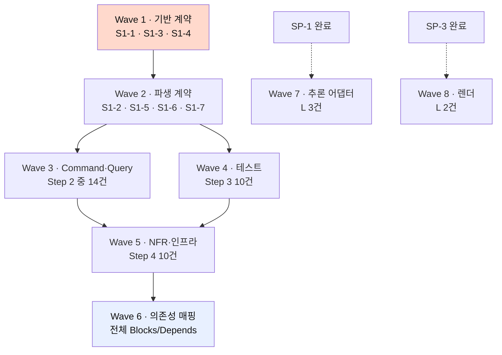

# TASK 추출 순서 평가 보고서

**목적** 4단계 태스크 추출 방법론에 비추어 **현재 태스크 목록의 수정 여지**와 **풀버전 작성 순서**를 정한다
**대상** `plans/PLAN_기술스택-전면적용.md` §3 (Phase 0~3 + 횡단 = **24개 작업 항목**)
**템플릿** `.github/ISSUE_TEMPLATE/feature-task.md`
**작성일** 2026-08-30 · **상태** 본문 작성 전 사전 평가

---

# 0. 요약

## 0.1 현재 태스크 목록의 정체

🔴 **독립된 태스크 리스트 문서는 존재하지 않는다.**

그 역할을 하는 것은 `plans/PLAN_기술스택-전면적용.md` §3의 **Phase 0~3 + 횡단 24개 항목**이며, 이것은 **실행 순서 계획이지 태스크 명세가 아니다.** 각 항목이 한 줄 요약과 대응 요구사항만 갖는다.

## 0.2 4단계 방법론 대비 판정

| Step | 대상 | 현재 상태 | 판정 |
| :--: | --- | --- | :--: |
| **1** | 계약·데이터 명세 | DB·API 명세는 **DS v1.1에 완비**되어 있으나 **태스크로 분리되지 않음**. **Mock은 개념 자체가 부재** | 🔴 **거의 없음** |
| **2** | 로직 분해 (CQRS) | 기능 단위로만 나뉨. **Read/Write 미분리** | 🔴 **분해 안 됨** |
| **3** | AC → Test Task | 🟢 **원재료는 최상급** — SC 42건 · TC ID 89개 확정. **그런데 테스트 작성 태스크가 0건** | 🔴 **부재** |
| **4** | NFR + 의존성 | 게이트 3건만 존재. 성능·부하·보안 태스크 없음. **의존성은 Phase 순서로만 암시** | 🟡 **부분** |

> **역설적인 상태다.** SRS·DS의 **명세 완성도는 높은데 태스크 분해가 거의 안 돼 있다.** 원재료가 좋아서 Step 1~3은 **새로 조사할 것 없이 옮기기만 하면 된다.**

## 0.3 🔴 템플릿을 그대로 쓸 수 없는 것이 5종 있다

**§3에서 상세히 다룬다.** 요약하면 — **L 규모 5건 · 게이트 4건 · Mock · Query 전용 · 스택 불일치.**

---

# 1. 템플릿 저장 결과

## 1.1 저장 위치와 이유

```
.github/ISSUE_TEMPLATE/feature-task.md
```

**GitHub이 이 경로를 읽어 이슈 생성 화면에 "Feature Task" 선택지를 띄운다.** front matter의 `name` · `about` · `title` · `labels` · `assignees` 가 그 UI를 채운다. 다른 경로에 두면 문서 파일일 뿐 템플릿으로 작동하지 않는다.

## 1.2 원본 보존 · 예제 상태 유지

**본문을 HILiT 내용으로 바꾸지 않았다.** 회원가입 예시 그대로 두었고, 대신 **주석 블록**을 넣어 성격을 명시했다.

```
════════════════════════════════════════════
  GitHub Project 용 TASK 템플릿
════════════════════════════════════════════
  용도  : SRS 요구사항을 개발 태스크로 분해할 때 쓰는 표준 서식
  상태  : 예제 상태 그대로 보존 — 본문은 회원가입 예시이며 HILiT 내용이 아니다
  주의  : 이 파일을 HILiT 요구사항으로 채우지 않는다.
          풀버전 TASK 본문은 별도 파일로 작성한다.
```

**주석은 `<!-- -->` 안에 있어 이슈 본문에는 나타나지 않는다.** 파일을 여는 사람에게만 보인다.

## 1.3 이 템플릿이 요구하는 것 — 8개 블록

| 블록 | HILiT에서 채울 원천 |
| --- | --- |
| 🎯 Summary | SRS §4.1 제목 · 목적 |
| 🔗 References | SRS 절 · 시퀀스(§3.5·§6.4) · ERD(§6.2) · API(DS §3.2) |
| ✅ Task Breakdown | **새로 작성해야 함** — 현재 문서에 없음 |
| 🧪 Acceptance Criteria | 🟢 **SRS §5.2 운영 시나리오 42건**이 이미 GWT |
| ⚙️ Technical & NFR | SRS §4.2 |
| 🏁 DoD | 🔺 **스택에 맞게 치환 필요** (§3.5) |
| 🚧 Dependencies | 🔴 **현재 문서에 명시 없음** — Step 4에서 생성 |

> **여덟 중 셋(References · AC · NFR)은 기존 문서에서 그대로 온다.** 새로 만들어야 하는 것은 **Task Breakdown**과 **Dependencies** 둘이다.

---

# 2. Step별 갭 분석

## 2.1 Step 1 — 계약·데이터 🔴

### 있는 것

| 자산 | 위치 | 완성도 |
| --- | --- | :--: |
| 엔티티 16종 + 타입·PK/FK·CHECK | SRS §6.2 · **DS §4.2** | 🟢 높음 |
| Prisma 스키마 발췌 | SRS v2.2 §4.1 | 🟡 핵심만 |
| API 23개 + 요청/응답/오류/인증/멱등성 | **DS §3.2** | 🟢 높음 |
| RLS 정책 예시 | SRS v2.2 §4.2 | 🟡 예시 1개 |

### 없는 것

| 누락 | 영향 |
| --- | --- |
| **DB 스키마 태스크** | Phase 0-4가 *"Supabase 로컬 스택 + Prisma 초기 스키마"* 로 **환경 세팅과 뭉쳐 있다** |
| **API 계약 태스크** | DS §3.2가 명세를 갖췄으나 **누가 언제 코드로 옮기는지가 없다** |
| 🔴 **Mock 태스크 — 개념 부재** | **이 프로젝트에서 특히 치명적이다.** §2.1.1 참조 |

### 2.1.1 🔴 Mock이 없는 것이 왜 치명적인가

**이 제품의 핵심 데이터가 외부 추론 API에서 온다.** 그런데 **SP-1이 끝나기 전에는 그 API가 무엇인지도 모른다.**

```
Mock 없음  →  프론트엔드가 SP-1 완료를 기다린다
           →  SP-1은 정답셋 15편 구축이 선행된다
           →  정답셋은 실제 농구 영상 수급이 선행된다
```

**Mock을 만들면 이 사슬이 끊어진다.** 후보 목록·bbox 시계열·신뢰도 값의 **형태만 정하면** 프론트엔드는 SP-1과 무관하게 진행한다.

> **Mock 태스크를 Step 1에 반드시 넣는다.** 이것이 현재 목록의 가장 큰 누락이다.

## 2.2 Step 2 — 로직 분해 🔴

**현재 Phase 항목은 기능 단위**다(1-1 업로드, 1-2 추론 연동, 1-4 후보+선택 UI…). **Read와 Write가 한 항목에 섞여 있다.**

### CQRS로 분해했을 때

| 구분 | 대상 | 성격 |
| --- | --- | --- |
| **Command** (상태 변경) | 업로드 개시 · 대상 지정 · 탐지 요청 · 선택 확정 · 렌더 등록 · 공개범위 변경 · 그룹 생성/초대/이탈 · 팔로우 · 반응 · 신고 · 공유링크 발급 | **약 12** |
| **Query** (조회) | 후보 목록 · 기록 목록 · **프로필(소유자/타인 이중)** · 그룹 멤버 · 피드 | **약 5** |

### 🔴 분해가 특히 필요한 지점

**REQ-NF-009(공개 범위 서버 강제)는 Query 쪽에만 걸린다.** Command는 소유자 검증이면 되지만, **Query는 조회자마다 결과가 달라진다.**

**`GET /users/{id}/profile`(A-12)은 호출자에 따라 스키마 자체가 다르다** — 소유자는 `counts:{total,public,group,private}`, 타인은 `counts:{public}`만. 이것을 Command 태스크와 같은 템플릿으로 다루면 **AC가 뭉개진다.**

> **Query 태스크는 "누가 조회하는가"를 축으로 AC를 써야 한다.** Command는 "무엇이 바뀌는가"다.

## 2.3 Step 3 — Test Task 🔴 **부재이나 원재료는 최상**

| 자산 | 규모 |
| --- | ---: |
| 운영 시나리오 (GWT) | **42건** |
| TC ID (SC·ADR·REQ) | **89개** |
| 실패 경로 시나리오 | **12건** |

**SRS §5.2가 이미 `SC → 연결 REQ → TC ID`를 매핑해 뒀다.** 방법론이 요구하는 *"AC를 테스트 코드 작성 Task로 변환"* 의 **전 단계가 이미 끝나 있다.**

### 그런데 태스크가 0건이다

**Phase 0~3 어디에도 테스트 작성 항목이 없다.** TC-SC-1.F1 같은 ID는 매트릭스에 있으나 **누가 언제 그 코드를 쓰는지가 없다.**

> **방법론의 Tip대로 하면 AC는 Feature 태스크의 DoD로 들어간다.** 그러나 **실패 경로 12건은 Feature와 별도 태스크**여야 한다 — 하나의 Feature에 실패 시나리오가 3개씩 붙으면 DoD가 감당하지 못한다.

## 2.4 Step 4 — NFR·의존성 🟡

### 있는 것

| 항목 | 위치 |
| --- | --- |
| 배포 게이트 3중 (빌드타임·저장소·킬스위치) | 횡단 X-1·X-2 |
| 추론 API 학습 옵트아웃 게이트 | 횡단 X-3 |

### 없는 것

| 누락 | 대응 요구사항 |
| --- | --- |
| **성능 검증 태스크** (p95 7종) | REQ-NF-001~007 |
| **부하·가용성 검증** | REQ-NF-006 · 008 |
| 🔴 **RLS 우회 시도 테스트** | REQ-NF-009 — *"우회 성공 0건"* 을 **누가 시도해 보는가** |
| **완주율 계측 구현** | REQ-NF-014 |
| **암호화·TLS 점검** | REQ-NF-011 |
| **법무 산출물 승인** 4종 | REQ-NF-010 · 016 · 017 · REQ-FUNC-007 |

### 🔴 의존성이 Phase 순서로만 암시된다

**`Blocks` / `Depends on` 이 어디에도 명시돼 있지 않다.** Phase 1 → 2 → 3 순서가 그것을 대신하고 있으나, **Phase 안에서 무엇이 무엇을 막는지**는 알 수 없다.

**예 — Phase 2에서 2-2(RLS)를 첫 작업으로 둔 이유**가 계획서 각주에만 있다. 이슈로 만들면 그 관계가 사라진다.

---

# 3. 🔴 템플릿과 기존 태스크의 상호작용 — 조정 5건

## 3.1 L 규모 5건 — **이 템플릿에 맞지 않는다**

| 대상 | REQ-FUNC-002 · 003 · 006 · 008 · 027 |
| --- | --- |
| 성격 | **수렴형** — 종료 조건이 *"동작한다"* 가 아니라 **"임계에 도달했다"** |
| 충돌 | 템플릿 DoD의 *"AC 충족 / 테스트 통과 / 정적분석 / Swagger 최신화"* 로는 **완료를 판정할 수 없다** |

> **일반 스프린트 태스크로 만들면 매번 미완으로 이월된다**(SRS §4.3). 
>
> 🔺 **별도 서식이 필요하다** — DoD를 *"임계 도달 여부 + 측정 회차 + 미달 시 다음 조치"* 로 바꾼 **Convergence Task** 변형.

## 3.2 게이트 4건 — **개발 태스크가 아니다**

| 게이트 | 산출물 | 담당 |
| --- | :--: | --- |
| REQ-NF-010 얼굴 정보 | 4종 | 법무 |
| REQ-NF-016 미성년 이용자 | 4종 | 법무 |
| REQ-NF-017 영상 내 미성년자 | 3종 | 법무 |
| REQ-FUNC-007 음원 라이선스 | 3종 | 사업·법무 |

**코드가 아니라 승인이다.** Task Breakdown·AC·DoD가 전부 다른 성격이므로 🔺 **Gate Task 변형** 또는 별도 라벨(`gate`, `legal`)이 필요하다.

**그리고 이 넷은 개발 태스크를 차단한다** — 의존성 매핑에서 `Blocks` 관계로 반드시 표현돼야 한다.

## 3.3 Mock 태스크 — 템플릿의 AC가 안 맞는다

**Mock의 인수 기준은 *"올바른 값을 반환한다"* 가 아니라 *"계약과 형태가 같다"* 다.** 
🔺 AC를 **스키마 일치 검증**으로 쓰고, DoD에서 *"실제 API로 교체 시 프론트 코드 변경 0건"* 을 확인한다.

## 3.4 Query 태스크 — AC 축이 다르다

**§2.2에서 본 대로 Query는 "누가 조회하는가"가 축이다.** 
🔺 AC 시나리오를 **조회자 유형별**(소유자 / 그룹 멤버 / 팔로워 / 비관계자)로 쓴다. 특히 **A-12 프로필 조회**는 이 넷이 전부 다른 결과를 받아야 한다.

## 3.5 🔺 스택 불일치 — DoD 2항목 치환

| 템플릿 원문 | HILiT 스택에서 |
| --- | --- |
| *"API Controller 연동"* | **Server Action** — 컨트롤러 계층이 없다 |
| *"API 명세서(Swagger 등) 최신화"* | 🔴 **OpenAPI 문서가 없다.** DS §3.2가 명세이므로 → *"DS §3.2 갱신"* |
| *"SonarQube / Linter"* | ESLint + TypeScript strict |
| *"단위 테스트 / 통합 테스트"* | + 🔺 **RLS 정책 테스트**를 별도 항목으로 |

---

# 4. 태스크 목록 재구성안

**24개 Phase 항목 → 약 44개 태스크.** Step별 분포는 이렇다.

| Step | 태스크 | 수 | 지금 쓸 수 있나 |
| :--: | --- | ---: | :--: |
| **1** | 계약·데이터 (DB 2 · API 3 · Mock 2) | **7** | 🟢 **전부 가능** |
| **2** | 로직 (Command 12 · Query 5) | **17** | 🟡 **14개 가능** — L 3건 제외 |
| **3** | 테스트 (정상 6 · 실패 4) | **10** | 🟢 가능 |
| **4** | NFR·인프라 (성능 3 · 보안 3 · 게이트 4) | **10** | 🟢 가능 |
| | **합계** | **44** | |

## 4.1 Step 1 상세 (7)

| ID | 태스크 | 원천 |
| --- | --- | --- |
| **S1-1** | `[DB]` Prisma 스키마 16 엔티티 + 마이그레이션 | DS §4.2 · SRS §6.2 |
| **S1-2** | `[DB]` RLS 정책 — 공개 범위 3단 + 그룹 | SRS v2.2 §4.2 |
| **S1-3** | `[API Spec]` Server Action 시그니처 + Zod + 오류 코드 | DS §3.1 · §3.2 |
| **S1-4** | `[API Spec]` **TrackingProvider 인터페이스** (어댑터 아님) | 효율성 검토 §2.3 |
| **S1-5** | `[API Spec]` webhook 수신 계약 (Storage · 추론) | SRS v2.2 §5.1 |
| **S1-6** | 🔴 `[Mock]` 추론 결과 Mock — bbox 시계열·신뢰도 | §2.1.1 |
| **S1-7** | `[Mock]` 후보 목록 Mock | §2.1.1 |

## 4.2 Step 2 상세 (17)

**Command 12** — 업로드 개시 / 대상 지정 / 탐지 요청 / 선택 확정 / 렌더 등록 / 공개범위 변경 / 그룹 생성 / 그룹 초대 / 그룹 이탈·회수 / 팔로우 / 반응·신고 / 공유링크 발급

**Query 5** — 후보 목록 / 기록 목록·필터 / **프로필 이중 뷰** / 그룹 멤버 / 피드·대체노출

> **L 3건**(REQ-FUNC-002 · 003 · 027 — 추론 어댑터)은 **SP-1 완료 후**에만 쓸 수 있다. REQ-FUNC-006·008도 SP-3 결과가 필요하다.

## 4.3 Step 3 상세 (10)

| 분류 | 근거 |
| --- | --- |
| 정상 경로 6 | SC 시나리오 1~6 묶음 |
| 실패 경로 4 | SC-1.F1~F6 · 2.F1~F2 · 3.F1~F2 · 4.F1~F2 · 5.F1 · 6.F1 (12건을 4묶음으로) |

## 4.4 Step 4 상세 (10)

| 분류 | 태스크 |
| --- | --- |
| 성능 3 | p95 계측 하니스 / 부하 시나리오 / 완주율 집계 |
| 보안 3 | **RLS 우회 시도 테스트** / 암호화·TLS 점검 / 감사 로그 |
| 게이트 4 | 얼굴 · 미성년 이용자 · 영상 내 미성년자 · 음원 |

---

# 5. 🔴 풀버전 작성 순서

**원칙 — 막는 것부터, 막지 않는 것은 병렬로. 그리고 스파이크에 종속된 것은 뒤로.**



| Wave | 태스크 | 수 | 왜 이 순서인가 |
| :--: | --- | ---: | --- |
| **1** | **S1-1 DB 스키마 · S1-3 Server Action 계약 · S1-4 Provider 인터페이스** | 3 | 🔴 **셋이 나머지 전부를 막는다.** 엔티티 이름과 함수 시그니처가 정해져야 다른 태스크가 그것을 참조할 수 있다 |
| **2** | S1-2 RLS · S1-5 webhook · **S1-6·S1-7 Mock** | 4 | Wave 1의 스키마·계약이 있어야 쓸 수 있다. **Mock이 여기 끝나면 프론트가 SP-1을 안 기다린다** |
| **3** | Step 2 Command 12 + Query 2 *(L 제외)* | 14 | 계약 위에서 작성. **Query는 조회자 축으로 AC를 쓴다** |
| **4** | Step 3 테스트 10 | 10 | **Wave 3과 병렬 가능** — SC가 이미 GWT라 Feature 본문을 기다릴 필요가 없다 |
| **5** | Step 4 NFR·인프라 10 | 10 | 대상 코드가 정해진 뒤. **단 게이트 4건은 Wave 1과 병렬 가능** |
| **6** | 🔵 **의존성 매핑** | — | **전체가 나온 뒤에만 가능.** 방법론 Step 4의 핵심 오케스트레이션 |
| **7** | 추론 어댑터 (L 3) | 3 | 🔴 **SP-1 완료 후** |
| **8** | 렌더 (L 2) | 2 | 🔴 **SP-3 완료 후** |

## 5.1 병렬 가능 조합

| 동시 진행 | 근거 |
| --- | --- |
| Wave 3 ↔ Wave 4 | 테스트는 SC에서 나오고 Feature 본문에 의존하지 않는다 |
| Wave 1 ↔ 게이트 4건 | 게이트는 법무 담당이라 개발 계약과 무관 |
| Wave 7 ↔ Wave 8 | SP-1·SP-3이 병렬이므로 결과도 병렬 |

## 5.2 🔴 Wave 1을 셋으로 좁힌 이유

**S1-1(스키마)이 없으면 나머지 43개가 엔티티 이름을 확정할 수 없다.** DS §4.2에 정의는 있으나 **Prisma 코드로 확정되기 전에는 `SourceVideo`인지 `source_videos`인지가 태스크마다 달라진다.**

**S1-3(Server Action 계약)** 은 같은 이유로 함수 이름과 인자를 고정한다. **S1-4(Provider 인터페이스)** 는 SP-1 결과와 **무관하게** 지금 쓸 수 있고, 이걸 먼저 쓰면 **SP-1 벤치마크 하니스가 그대로 프로덕션 어댑터가 된다**(효율성 검토 §2.3).

## 5.3 작성 전 확정해야 할 것 2건

| # | 항목 | 영향 |
| :--: | --- | --- |
| **1** | 🔵 **공개 발행을 MVP에 넣는가**(효율성 검토 A-4) | **넣지 않으면 Wave 3에서 반응 3건 · Wave 5에서 게이트 2건이 빠진다** — 태스크 44 → 39 |
| **2** | 🔺 **Convergence Task 서식을 만들 것인가**(§3.1) | L 5건의 작성 방식이 갈린다 |

> **둘 다 Wave 1 착수 전에 정하는 편이 낫다.** 나중에 정하면 이미 쓴 태스크를 고쳐야 한다.

---

# 6. 이 보고서가 제안하지 않는 것

| # | 항목 | 이유 |
| :--: | --- | --- |
| 1 | 태스크별 공수·기간 | 팀 속도 실측이 없다 `[TBD]` |
| 2 | 담당자 배정 | 조직 구성이 문서에 없다 |
| 3 | 스프린트 배치 | 스프린트 길이가 미정 |
| 4 | 태스크 본문 | **요청대로 착수하지 않았다.** 순서 확정 후 순차 작성 |

---

*이 보고서는 태스크 본문 작성 전의 사전 평가다. Wave 1부터 순차 작성하되, §5.3의 결정 2건을 먼저 확정할 것을 권한다.*
