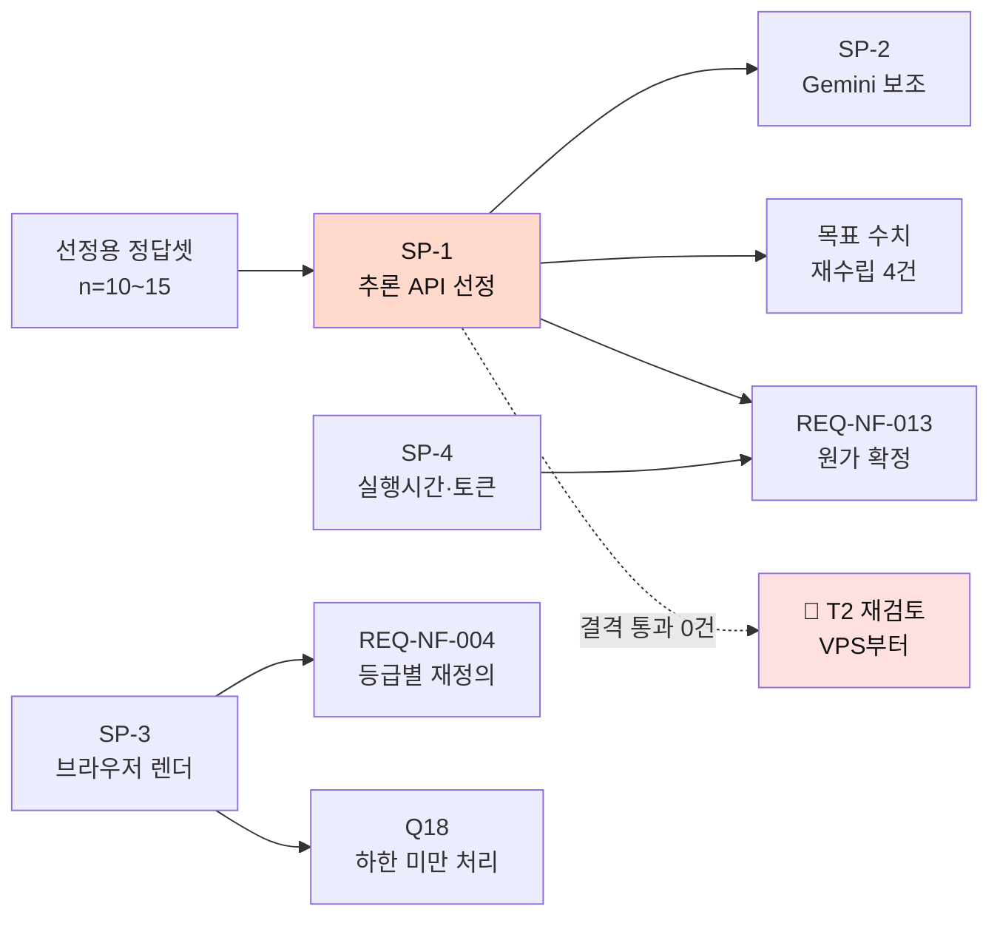

# 스파이크 실행 계획

**목적** 웹 스택 SRS의 미결 항목 중 **스파이크로 풀리는 것**을 실행 가능한 형태로 정의한다
**근거** `AUDIT/REVIEW_웹스택-미결6건.md` · `SRS/[SRS]hilit-SRSv2.0-nextjs.md` (v2.2 · T1 확정)
**작성일** 2026-08-30

---

## 0. 이 계획이 정하는 것

**"해보자"가 아니라 "무엇이 나오면 통과인가"를 정한다.** 성공 기준 없는 스파이크는 결과가 나와도 해석이 갈린다.

| ID | 스파이크 | 우선순위 | 막히면 |
| --- | --- | :--: | --- |
| **SP-1** | 외부 추론 API 선정·벤치마크 | **0** | 목표 수치 5건 중 **4건의 입력이 없다** |
| **SP-2** | Gemini 보조 경로 (구 S6 재정의) | 1 | 추론 호출량 최적화 기회 상실 |
| **SP-3** | 브라우저 렌더 (구 S5) | 1 | REQ-NF-004 재정의 불가 · 완성 경로 미확정 |
| **SP-4** | 함수 실행시간 · 토큰 원가 (구 S2·S3) | 3 | 참고값 부재 |

> **결정 사안은 여기 없다.** 자동재생·F9·탭 종료는 스파이크로 풀리지 않아 **SRS v1.5·v2.2에 이미 반영**했다.

---

## 1. 🔴 SP-1 — 외부 추론 API 선정·벤치마크

**T1 확정으로 이 제품의 핵심 AI가 외부 API로 나갔다. 그 API를 고르는 일이 지금 가장 중요하다.**

### 1.1 목적

REQ-FUNC-002 · 003 · 006 · 027과 REQ-NF-003을 만족할 **추적 추론 서비스**를 선정하고, **목표 수치 재수립의 입력**을 확보한다.

### 1.2 결격 기준 — 먼저 거른다

**아래 중 하나라도 해당하면 후보에서 제외한다.** 성능을 보기 전에 본다.

| # | 결격 사유 | 근거 |
| :--: | --- | --- |
| **K1** | 🔴 **입력 영상을 학습에 사용** (옵트아웃 불가) | 파일럿 동의서가 *"학습 데이터로 쓰지 않음"* 을 명시했다. 이 약속이 깨지면 **클럽과의 신뢰가 먼저 무너진다** |
| **K2** | 🔴 **bbox 시계열을 반환하지 않음** | REQ-FUNC-006의 입력이 없다. 리프레이밍이 성립하지 않는다 |
| **K3** | 비동기 + webhook 미지원 | Vercel 함수 실행시간 안에서 동기 대기 불가 |
| **K4** | 데이터 처리 위치·보존 정책을 명시하지 않음 | REQ-NF-010 · 017 · 022의 전제 |
| **K5** | 40분급 입력을 받지 못함 | REQ-FUNC-001의 대상 자체 |

> **K1이 가장 먼저다.** 미성년자 영상을 다루는 파일럿에서 *"학습에 안 씁니다"* 라고 말해 놓고 API가 학습에 쓰면, 그것은 성능 문제가 아니라 **약속 위반**이다.

### 1.3 평가 항목

| # | 항목 | 측정 | 연결 요구사항 |
| :--: | --- | --- | --- |
| **B1** | **탐지율** — 정답 구간 대비 (제외 후) | IoU ≥ 0.5 정탐 | REQ-FUNC-003 · O9 |
| **B2** | **재식별 정확도 · 오인식률** | 가림 구간 라벨 정답셋 | REQ-FUNC-002 |
| **B3** | **신뢰도 값 제공 여부** | 구간별 confidence 반환 | **REQ-FUNC-027** — 없으면 제외 로직이 불가 |
| **B4** | **처리 시간** — 40분 원본 | 요청 → webhook 수신 | REQ-NF-003 |
| **B5** | **편당 원가** | 단가 × 40분 | REQ-NF-013 |
| **B6** | 촬영 조건별 편차 | 거리·조도·복장 유사도 | RISK-04 |
| **B7** | 🔺 **규제 부담** | 채택 시 REQ-NF-010·016·017 산출물이 몇 종 늘어나는가 · **파일럿 동의서를 다시 받아야 하는가** | 04_API후보조사 §6 |
| **B8** | 🔴 **입력 해상도별 탐지율** | **원본 · 1/2 · 1/4** 각각에서 B1·B2 재측정 | **전송비 ↔ O9 교환비** |

### 🔴 B8을 왜 넣는가 — 전송비와 탐지율이 같은 손잡이에 걸려 있다

원본을 그대로 추론 API에 넘기면 **연 12만 편 × 4GB = 480TB 전송**이 발생한다. 저해상도로 전처리하면 전송량이 **제곱으로** 준다(1/2 해상도 → 1/4 전송).

**그런데 다운스케일은 탐지율을 떨어뜨린다.** 이 제품의 조건이 *"코트 반대편에서 화면 구석에 작게"* 이므로 **원거리 인물이 특히 취약**하다.

> **지금은 그 교환비를 모른 채 ADR-3(저해상도 1차)을 적용하고 있다.** B8이 나와야 *"탐지율을 얼마나 포기하면 전송비를 얼마나 아끼는가"* 를 계산할 수 있다.
>
> **B8은 정답셋을 3번 돌리므로 실행 루프 구조에 영향을 준다.** 나중에 추가하면 전체를 다시 돌려야 하므로 **처음부터 넣는다.**

### 1.4 🔴 정답셋을 두 단계로 나눈다

**SRS §6.4.2는 정답셋 n=100편을 요구하지만, 그것은 Gate A 판정용이다.** 선정 단계에 100편을 만들면 **선정 전에 가장 비싼 작업을 하게 된다.**

| 단계 | 규모 | 용도 | 시점 |
| --- | :--: | --- | --- |
| **선정용** | **n = 10~15편** | 후보 API 비교 · 결격 판정 | **지금** |
| **판정용** | n = 100편 | Gate A 통과 판정 | 선정 후 · Q12(국내 설문) 이후 |

**선정용 정답셋 구성** — 조건 다양성이 규모보다 중요하다.

| 조건 | 편수 |
| --- | :--: |
| 근거리(하프코트) · 밝은 실내 | 3 |
| 원거리(풀코트) · 밝은 실내 | 3 |
| 원거리 · **어두운 실내** | 3 |
| **복장 유사도 높음**(같은 유니폼) | 3 |
| 다인원(8명 이상) 혼재 | 3 |

> **복장 유사도가 높은 케이스를 반드시 넣는다.** 같은 유니폼을 입은 팀 경기가 재식별의 최악 조건이고, **이 제품의 실제 사용 조건**이다.

### 1.5 산출

| # | 산출 | 쓰이는 곳 |
| :--: | --- | --- |
| 1 | 후보 API 결격 판정표 | 선정 |
| 2 | **B1~B8 실측표** | **목표 수치 5건 중 4건 재수립** · B8은 ADR-3 교환비 |
| 3 | **편당 원가** — 추론 + **전송량 실측** | REQ-NF-013 **4항목** 중 ①③ 확정 · Q3 |
| 4 | 제외 임계 `τ` 초기값 | REQ-FUNC-027 · SRS §6.4.4 1a |
| 5 | 촬영 조건별 편차 | O3 거리 조건부 재정의 · Q2 |

### 1.6 실패 시

**결격 기준을 통과하는 후보가 없으면** — T1이 성립하지 않는다. **T2(범위 축소)로 되돌아가 VPS부터 재검토**해야 한다. 이 경우가 이 프로젝트에서 가장 무거운 분기다.

---

## 2. SP-2 — Gemini 보조 경로 (구 S6 재정의)

### 2.1 질문이 바뀌었다

| | 구 S6 | **SP-2** |
| --- | --- | --- |
| 질문 | *"Gemini가 사람을 찾아내는가"* | **"Gemini가 추론 호출량을 줄여 주는가"** |
| 성격 | 실현 가능성 | **원가 최적화** |
| 실패 시 | 설계 전체 재검토 | 최적화 포기 · **설계는 그대로** |

**T1 확정으로 추적은 외부 API가 맡는다.** Gemini에게 남는 역할은 *"이 구간이 볼 만한가"* 이다.

### 2.2 분업 가설

```
40분 원본
  ↓ ① Gemini — 의미 구간 후보 산출 (저비용)
  "슛·돌파·수비" 구간 N개
  ↓ ② 외부 추론 API — 그 구간만 인물 추적 (고비용)
  bbox 시계열 · 재식별
  ↓ ③ 후보 30개
```

**②의 입력이 40분 전체가 아니라 N개 구간이면 추론 호출량이 줄어든다.**

### 2.3 성공 기준

| # | 기준 | 임계 |
| :--: | --- | --- |
| **G1** | Gemini가 산출한 구간이 **실제 등장 구간을 포함**하는가 | 포함률 **[TBD]** — SP-1의 B1과 비교해 정함 |
| **G2** | 구간 총 길이가 원본 대비 **충분히 짧은가** | 원본의 **50% 이하**여야 절감 효과 `[PROPOSED]` |
| **G3** | ①+② 합산 원가 < ② 단독 원가 | **절감액 > Gemini 비용** |
| **G4** | ① 추가로 인한 지연 < 절감 시간 | 전체 처리 시간이 늘지 않을 것 |

> 🔴 **G1이 핵심이다.** Gemini가 놓친 구간은 ②가 볼 기회조차 없다. **이 경로는 탐지율의 상한을 Gemini가 결정하게 만든다.** G1이 낮으면 **원가를 아끼려다 O9를 잃는다.**

### 2.4 실패 시

**40분 전체를 외부 추론 API에 넘긴다.** 원가가 올라갈 뿐 **기능은 그대로**다. SP-1이 통과했다면 제품은 성립한다.

---

## 3. SP-3 — 브라우저 렌더 (구 S5)

### 3.1 목적

SRS v2.2 §3.3이 전제한 **클라이언트 렌더**가 실제로 되는지, **어느 단말부터 안 되는지** 확인한다.

### 3.2 성공 기준

| # | 확인 | 기준 |
| :--: | --- | --- |
| **S3-a** | WebCodecs 또는 ffmpeg.wasm으로 **15초 세로 숏폼 + 음악 병합** | 산출물 재생 가능 · 음성 동기 |
| **S3-b** | **소요 시간** | 단말 등급별 p95 — REQ-NF-004 재정의 입력 |
| **S3-c** | 🔴 **하한선** | **어느 등급부터 실패하는가 · 그 비율** |
| **S3-d** | 발열·배터리 | 연속 3회 처리 시 스로틀링 여부 |
| **S3-e** | 탭 종료 복구 | R1(이탈 경고) · R2(선택 서버 저장) 동작 |
| **S3-f** | 🔺 **규모 재판정 근거** | 결과에 따라 REQ-FUNC-008의 **L 판정**(SRS §4.3)을 유지할지 **M으로 환원**할지 |

### 3.3 🔴 S3-c가 핵심이다

**하한선을 모르면 REQ-NF-004를 재정의할 수 없고, 하한 미만 사용자를 어떻게 할지도 정할 수 없다.**

| 하한 미만 처리 | 판단 |
| --- | --- |
| 안내 후 차단 | 🔴 그 사용자는 **완성을 못 한다** — Core Job 미충족 |
| 저화질 렌더로 대체 | 🟡 O3(구도 만족도)와 충돌 가능 |
| **서버 렌더 예외 경로** | 🔴 C-TEC-002 위반 · 하지만 **유일하게 완성을 보장** |

> **이 셋 중 어느 것도 공짜가 아니다.** S3-c 실측 후 **제품 결정**으로 정해야 한다(v1.5 Q18).

### 3.4 대상 단말

| 등급 | 예 | 최소 표본 |
| --- | --- | :--: |
| 상 | 최근 2년 플래그십 | 2대 |
| 중 | 3~4년 전 중급기 | 2대 |
| **하** | **5년 이상 · 저가형** | **3대** |

**하 등급을 가장 많이 본다.** 실패가 거기서 나오기 때문이다.

---

## 4. SP-4 — 함수 실행시간 · 토큰 원가 (구 S2·S3)

### 4.1 T1 확정으로 중요도가 내려갔다

긴 처리가 외부로 나가 **Vercel 함수에는 밀리초 작업만 남는다** — 업로드 개시·코덱 검증·추론 요청 발신·webhook 수신·후보 조회.

**어느 것도 실행시간 상한에 근접하지 않는다.** 값은 알아야 하되 **차단 요인이 아니라 참고값**이다.

### 4.2 범위를 넓힌다

🔴 **원래 S3(Gemini 토큰 원가)만으로는 편당 원가를 산정할 수 없다.**

| 원가 항목 | 출처 | 비중 |
| --- | --- | :--: |
| **외부 추론 API** | **SP-1 B5** | 🔴 **주** |
| Gemini 토큰 | SP-4 | 보조 |
| Vercel 실행시간 | SP-4 | 미미 |
| Supabase 저장·전송 | SP-4 | 보조 |
| 렌더 | **사용자 단말** | **0원** |

**SP-4 단독으로는 REQ-NF-013을 채울 수 없다.** SP-1의 B5와 합쳐야 완성된다.

---

## 5. 순서와 의존



| 순서 | 항목 | 병렬 |
| :--: | --- | --- |
| **1** | 선정용 정답셋 10~15편 구축 | — |
| **2** | **SP-1** 추론 API 선정·벤치마크 | **SP-3와 병렬** |
| 2 | **SP-3** 브라우저 렌더 | SP-1과 병렬 |
| 3 | SP-2 Gemini 보조 경로 | SP-1 결과 필요 |
| 3 | SP-4 실행시간·토큰 원가 | 독립 |
| 4 | 목표 수치 5건 재수립 · REQ-NF-004 · 013 확정 | 전부 필요 |

**SP-1과 SP-3은 담당자가 다르고(AI 리드 / 클라이언트 개발자) 서로의 결과를 필요로 하지 않는다.** 병렬이 맞다.

---

## 6. 재수립 대상 5건 — 입력이 어디서 오는가

> 🔴 **다섯 중 넷의 입력이 Gemini가 아니라 외부 추론 API다.** *"스파이크 결과로 재수립"* 이라고만 적으면 어느 스파이크인지 불명확해진다.

| 지표 | 현재 | **입력** |
| --- | --- | --- |
| 탐지율 (O9) | 85% `[HYPOTHESIS]` | **SP-1 B1** |
| 오인식률 | ≤ 2% | **SP-1 B2** |
| 탐지 시간 (REQ-NF-003) | p95 ≤ 8분 | **SP-1 B4** |
| 편당 원가 (REQ-NF-013) | `[TBD]` | **SP-1 B5 + SP-4** |
| 렌더 시간 (REQ-NF-004) | p95 ≤ 90초 | **SP-3 S3-b·c** |
| *(참고)* 구도 만족도 (O3) | 80% `[HYPOTHESIS]` | SP-1 B6 → 거리 조건부 재정의 |

---

## 7. 이 계획이 답하지 못하는 것

| # | 항목 | 왜 |
| :--: | --- | --- |
| 1 | **국내 사용자가 실제로 원본을 쌓아두는가** | Q12(국내 설문) 소관. **스파이크와 무관하며 더 먼저다** |
| 2 | 클럽이 지불할 의사가 있는가 | Wizard of Oz 파일럿 소관 |
| 3 | 하한 미만 단말 처리 방침 | S3-c 실측 후 **제품 결정** |
| 4 | 무음 소비 비율이 높을 때의 대응 | 베타 실측 후 **제품 결정**(Q17) |

> **SRS §6.4.4가 정한 0순위는 여전히 Q12(국내 설문)다.** 이 스파이크 계획은 그것을 대체하지 않는다 — *"만들 수 있는가"* 를 답할 뿐이고, *"만들 이유가 있는가"* 는 설문이 답한다.

---

*이 계획은 실행 가능성 확인을 목적으로 하며, 제품 결정을 대신하지 않는다. 각 스파이크의 실패는 설계 변경으로 이어지되 SP-1의 결격 전무만은 사업 판단(T2)으로 이어진다.*
