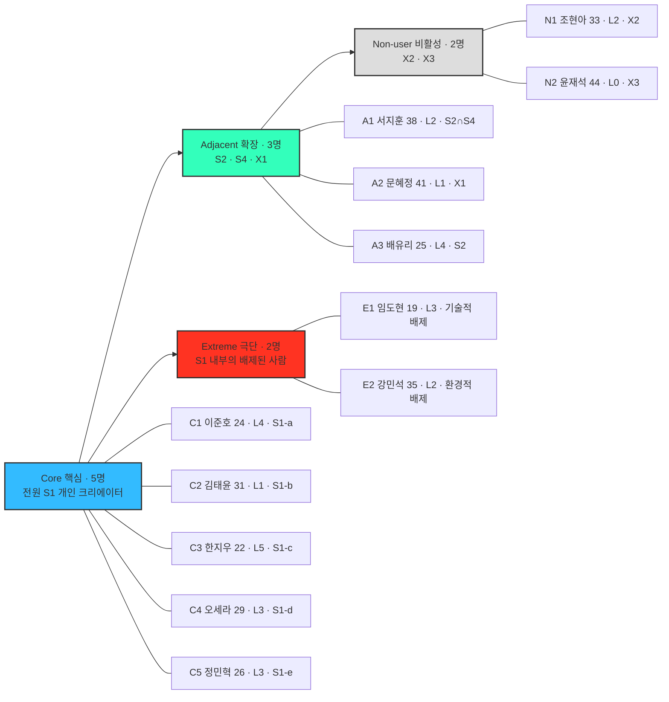

# [페르소나 스펙트럼] 1차 생성 — Divergent Thinking

| 항목 | 내용 |
| --- | --- |
| **워크플로우 단계** | ① 1차 생성 (Divergent Thinking) — 5단계 중 1단계 |
| **대상 시장** | SNS 기반 숏폼 콘텐츠 제작·편집 |
| **대상 서비스** | 하일릿(HILit) — 나의 성장을 빠짐없이 기록하는 공간 + 그 기록을 멋지게 만들어주는 편집 기능 |
| **구성** | 핵심 5 · 확장 3 · 극단 2 · 비활성 2 = **총 12명** |
| **작성** | 2026-08-28 · **문서 상태**: 초안 (2단계 수렴 전) |
| **선행 분석** | TAM-SAM-SOM + Market Segment · Five Forces · Value Chain · KSFs · 소개덱(하일릿) |

---

## 📌 문서 관리 안내 (기존 문서와의 관계)

이 문서는 **기존 「페르소나」(일반 페르소나 추출) 문서를 대체**합니다.

일반 페르소나 추출 방식은 "이상적인 주요 고객 1~3명"만 뽑기 때문에 극단·비활성 사용자가 구조적으로 누락됩니다. 하일릿은 **"AI가 나를 못 찾는 경우"와 "SNS 자체를 거부하는 사람"** 이 제품 설계를 좌우하는 서비스라, 스펙트럼 방식으로 전면 교체합니다.

**Notion 쪽 정리 방법 (수동 처리 필요)**

| 대상 | 조치 | 새 제목 |
| --- | --- | --- |
| 기존 일반 페르소나 문서 | 제목 변경 후 아카이브 | `[구버전·보관] 페르소나 추출 (일반 방식) — 스펙트럼 방식으로 대체됨` |
| 이 문서 | 신규 정본 | `페르소나 스펙트럼` |

---

## 1. 참조한 Market Segment 구조

### 1-1. TAM 문서가 정의한 4개 고객군 (S1~S4)

TAM-SAM-SOM 보고서 「2) 수요 양상 및 고객 세분화」의 정의를 그대로 승계합니다.

| 코드 | 세그먼트 | 시장 비중 | 지불의사·전환율 | 주요 니즈 | 장애 요인 |
| --- | --- | --- | --- | --- | --- |
| **S1** | **개인 크리에이터** | **50%** | **유료전환율 1~3%** (CapCut 4.9억 MAU 중 ~1% 근거) | 간편성 — AI 자동 편집·템플릿·원클릭 공유 | **편집 학습 곡선 + 시간 소모 → 상당수가 편집 과정에서 포기** |
| **S2** | 중소기업/브랜드 | 25% | 예산 확보 시 비교적 높음 (외주 1건 10만~25만원) | 자막·캡션, 커머스 연동, 자사 편집역량 | 내부 전문인력 부족, 툴 학습시간 |
| **S3** | 마케팅 대행사 | 15% | **사실상 100%** | 전문가용 툴, 클라우드 협업 | (없음 — 편집이 곧 핵심 경쟁력) |
| **S4** | 교육기관·언론사 | 10% | 정품 구독 보유 | 지속 생산, AI자막·템플릿 자동화 | 예산·인력 진입장벽 |

> **주목** — TAM 보고서가 S1의 장애 요인으로 못 박은 **"상당수가 편집 과정에서 포기"** 가 하일릿의 존재 이유 그 자체입니다. 덱 07장 "결국 안 올린다"와 같은 문장이며, 12명 중 **6명(C1·C2·C5·E1·E2 + 잠재적으로 N2)** 이 이 지점에서 만들어졌습니다.

### 1-2. 하일릿의 SOM — S1 내부의 5개 하위 슬라이스

TAM 보고서의 S1은 시장 전체를 보는 넓은 정의입니다. 하일릿의 실제 공략 대상은 **S1 안의 좁은 슬라이스**이며, 덱 19장 「타깃」의 3층 구조 + 15장 「공개 범위」에서 도출됩니다.

| 코드 | 하위 세그먼트 | 덱 근거 | 전략적 역할 |
| --- | --- | --- | --- |
| **S1-a** | 부계정 운영형 스포츠 기록자 | "이미 올리고 있는 사람 — 편집 시간만 줄여주면 바로 넘어온다" | **1순위 · 가장 싼 획득** |
| **S1-b** | 편집 이탈형 잠재 기록자 | "올리고 싶은데 편집에서 멈춘 사람 — 페인이 가장 크다" | **2순위 · 최대 시장** |
| **S1-c** | 성장기 마이크로 인플루언서 | "결과물이 곧 우리 광고. 카테고리 랭킹의 주인공" | **확산 채널** |
| **S1-d** | 비공개 성장 아카이비스트 | "컨디션 안 좋았던 날도 기록이다" · 나만 보기 | **리텐션 축 · 콜드스타트 방어** |
| **S1-e** | 인접 종목 기록자 (러닝·클라이밍·헬스) | "농구 카테고리 하나로 시작" 이후 | 확장 대상 (v1 아님) |

### 1-3. TAM에 추가로 신설한 세그먼트 (S5) — 2026-08-28 개정

A2(대리 기록자)를 **실재하는 수요로 확정**함에 따라, TAM 보고서의 S1~S4에 **S5를 신설**합니다. 판정 근거는 `02_수렴평가` 0-3절.

| 코드 | 세그먼트 | 왜 S1~S4에 없었나 | 지불의사 |
| --- | --- | --- | --- |
| **S5** | **대리 기록자 (보호자·가족)** | 본인이 창작자가 아니라 **촬영자**라서 "개인 크리에이터" 정의에 안 잡힘 | **S1보다 높음** — 자녀 관련 지출은 가격 탄력성이 낮다 |

### 1-4. TAM 정의 밖의 2개 집단 (X2~X3)

비활성 페르소나를 담기 위한 정의입니다. **제작 의사 자체가 없어 어느 세그먼트에도 속하지 않는다**는 사실이 곧 분석 결과입니다.

| 코드 | 집단 | 왜 TAM 밖인가 | 왜 그래도 봐야 하는가 |
| --- | --- | --- | --- |
| **X2** | SNS·초상권 회피층 | 창작 의사 자체가 없음 | **함께 뛰는 S1-a·S1-b의 발행률을 깎음** |
| **X3** | 디지털 리터러시 저층 | 제작 도구 접근 자체가 안 됨 | 온보딩 단순화의 기준선 |

### 1-5. 기술 수준 척도 (L0~L5) — 13명 공통 기준

| 레벨 | 정의 | 대표 도구 |
| --- | --- | --- |
| **L0** | 편집 개념 없음. 원본 그대로 전달만 | 카톡·밴드 전송 |
| **L1** | 갤러리 정리 수준. 편집 앱 미사용 | 사진 앱 앨범 |
| **L2** | 앱 내장 기본 편집(자르기·속도) | 인스타 릴스 편집기 |
| **L3** | 템플릿 편집. 자동 자막·전환 활용 | CapCut 템플릿 |
| **L4** | 수동 정밀 편집. 타임라인·키프레임 감내 | CapCut 타임라인 |
| **L5** | 전문 툴. 마스킹·트래킹·컬러 | Premiere, DaVinci |

> **주의** — 기술 수준이 높다고 하일릿을 잘 쓰는 게 아닙니다. C4(L3, 디자이너)는 **능력이 있어도 동기가 없어서** 편집을 안 하고, C2(L1)는 **능력이 없어서** 못 합니다. 두 사람의 이탈 지점이 완전히 다릅니다.

---

## 2. 스펙트럼 배치도 (① 산출물 인덱스)

> ⑤단계 Spectrum Map이 아니라, 12개 원본을 훑기 위한 임시 인덱스입니다.

---

## 3. 핵심 사용자 (Core) — 5명

> 이상적인 주요 고객군. 매출·사용 빈도 중심. **전원 S1(개인 크리에이터) 소속이며, TAM 보고서가 "유료전환율 1~3%"로 못 박은 층입니다.**

---

### C1 · 이준호 — 부계정 운영형 농구 기록자

| | |
| --- | --- |
| **이름 / 나이** | 이준호 / 24 |
| **직무** | 대학생(체육교육과 3학년), 농구 동아리 주전 가드 |
| **기술 수준** | **L4** — CapCut 타임라인·키프레임을 쓸 줄 안다. 능력이 아니라 **시간**이 없다 |
| **세그먼트** | **S1-a** (S1 개인 크리에이터 · SOM 1순위) |
| **여정 이탈 지점** | 촬영 ✅ → **편집에서 지연** → 게시 3주 1회 |
| **역할** | 주 2회 코트 활동. 본계정 외 `@junho___ball` 부계정 운영(팔로워 480) — 농구 영상만 올린다 |

**현재 문제 (Pain)**

- 코트 옆 삼각대로 40분 촬영까지는 쉽다. 그 뒤가 전부다. 좋은 장면 골라내는 데만 30분, 멀리 있는 자기를 화면 중앙으로 따라오게 하려면 키프레임을 프레임마다 찍어야 한다.
- 그래서 **3주에 1개** 올린다. 촬영 습관은 이미 있는데 발행이 병목이다.
- 부계정을 판 이유는 정체성 때문만이 아니다. **나만 보고 싶은 실패 영상을 둘 곳이 없어서**이기도 하다. 인스타는 일단 올려야 보관이 되고, 묶음 게시물에서 한 장만 지우면 복원이 안 된다.
- 40분 원본이 3.5GB씩 쌓여 저장공간 경고를 이미 받고 있다.

**목표 (Goal)**

- 경기 끝나고 집 가는 길에 **5분 안에** 그날 하이라이트를 뽑아 계정에 쌓기.
- 못 올린 날도 "그날 뛰었다"는 사실은 남기기.
- **계정을 더 이상 안 파는 것.**

**사용 상황(Context)과 감정**

| 상황 | 느끼는 감정 |
| --- | --- |
| 경기 종료 직후, 체육관 로비 벤치. 한 손·폰 하나·배터리 22% | 뿌듯함 — "오늘 그 3점 진짜 잘 들어갔는데" |
| 지하철에서 원본 40분을 넘겨보기 시작할 때 | 즉각적 피로 — "편집 또 언제 하지" |
| 3주 만에 겨우 하나 올린 뒤 | 허탈 — "이럴 거면 다음 주엔 삼각대 안 들고 가지" |
| 실패한 영상을 지우지도 올리지도 못하고 갤러리에 둘 때 | 찝찝함 — "이건 어디다 두지" |

**대체 솔루션 (Competitor)**

CapCut 수동 편집(무료) + 인스타 부계정 + 카메라롤 앨범 방치

**기대하는 개선점 (Expected Gain)**

- 편집 **40분 → 5분**. 키프레임 작업이 트래킹 자동화로 사라진다.
- 부계정을 없애도 된다 — 공개 범위가 **계정이 아니라 기록 단위**라서 "나만 보기"와 "전체공개"가 한 공간에 공존한다.
- 저장 완료가 곧 기록 완료라, **올리지 못한 날도 공백이 안 생긴다.** 원본 3.5GB를 지워도 된다.
- 발행 빈도 3주 1개 → **주 2회**(경기 있는 날마다).

> **KSF 연결** — 이 페르소나는 **KSF ① 단일 기능의 압도적 정확도**로만 전환됩니다. 이미 CapCut을 쓸 줄 알기 때문에, "쓸 수 있느냐"가 아니라 **"손으로 한 것보다 확실히 나은가"** 가 유일한 기준입니다. Veo 사례(아마추어 스포츠 자동 촬영, 25,000개 클럽 유료 구독)가 증명한 전환 조건과 같습니다.

---

### C2 · 김태윤 — 편집에서 멈춘 주말 플레이어

| | |
| --- | --- |
| **이름 / 나이** | 김태윤 / 31 |
| **직무** | 금융권 직장인(리스크관리팀), 주말 사회인 농구 동호회 |
| **기술 수준** | **L1** — 갤러리 정리가 최대치. 편집 앱을 두 번 깔았다 두 번 다 지웠다 |
| **세그먼트** | **S1-b** (S1 개인 크리에이터 · SOM 2순위 · 최대 시장) |
| **여정 이탈 지점** | 촬영 ✅ → **편집에서 완전 이탈** → 게시 0 |
| **역할** | 주말 동호회 참여 3년차. 부계정 없음. 인스타 본계정은 있지만 반년째 게시물 0개 |

**현재 문제 (Pain)**

- 올리고 싶은 마음은 분명히 있다. 실제로 두 번 시도했고 두 번 다 **타임라인 화면을 보고 껐다.**
- "나만 화면에 크게 나오게" 하는 법을 검색했더니 답이 전부 "키프레임으로 잡아주세요"였다. 그 시점에 포기했다.
- 실력이 뛰어난 편이 아니라 40분 중 볼 만한 장면이 몇 개뿐인 걸 안다. 그 몇 개를 찾자고 40분을 훑을 동기가 없다.
- 결과물이 평범하면 아예 안 올린다. 자기검열이 강하다.

**목표 (Goal)**

- **"편집"이라는 단어가 안 나오는** 방식으로 결과물을 갖기.
- 동호회 단톡방에 "이번 주 나"를 던져 반응 얻기. 전체공개는 아직 부담.

**사용 상황(Context)과 감정**

| 상황 | 느끼는 감정 |
| --- | --- |
| 토요일 오전 경기 후 집 소파. 와이파이·배터리 충분 | 여유 — "오늘은 좀 해볼까" |
| 편집 앱을 열고 타임라인이 나타난 순간 | 압도감 — "이건 내 영역이 아니다" |
| 동호회 형이 올린 편집 영상을 볼 때 | 부러움 + 자기검열 — "저 정도는 돼야 올리는 거 아닌가" |
| 첫 실행에서 지난주 영상으로 30초가 바로 나왔을 때(가정) | 안도 + 놀람 — "이게 되네" |

**대체 솔루션 (Competitor)**

**없음.** 카메라롤에 원본만 쌓아두고 아무것도 안 한다. → 경쟁자가 "무행동"이라 전환 장벽이 가장 낮으면서 동시에 가장 높다.

**기대하는 개선점 (Expected Gain)**

- 타임라인을 **한 번도 안 보고** 결과물이 나온다. 사용자의 조작은 "후보 30개 중 3개 고르기"뿐.
- 앱 내 촬영이 없어 **이미 찍어둔 지난주 영상으로 즉시 첫 성공 경험**을 만든다.
- 구도 자동 보정(로우앵글·릴리스 중심)이 "평범해서 못 올리겠다"는 자기검열을 넘긴다.
- 게시물 0개 → **월 2~3개.**

> **Five Forces 연결** — 이 페르소나의 대체재는 **"편집을 아예 안 하기"(원가 0, 노력 0)** 이며, Five Forces가 "대체재 위협 강함"의 근거로 지목한 바로 그 선택지입니다. 즉 **C2를 전환시키는 것이 대체재 압력을 실제로 이겼다는 유일한 증거**가 됩니다. TAM 시장 비중이 가장 큰 층이기도 합니다.

---

### C3 · 한지우 — 성장기 마이크로 인플루언서

| | |
| --- | --- |
| **이름 / 나이** | 한지우 / 22 |
| **직무** | 대학생 겸 농구 스킬·드릴 콘텐츠 크리에이터 |
| **기술 수준** | **L5** — Premiere·CapCut Pro 병행. 마스킹·트래킹을 손으로 한다 |
| **세그먼트** | **S1-c** (S1 개인 크리에이터 · SOM 확산 채널) |
| **여정 이탈 지점** | 촬영·편집·게시 ✅ → **수익화에서 막힘** (노출 자리 없음) |
| **역할** | 스킬 계정 팔로워 6,200명. 주 3~4회 업로드. 릴스·틱톡·쇼츠 3중 발행 |

**현재 문제 (Pain)**

- 발행 빈도가 곧 성장률이라 **편집 시간이 직접적인 성장 비용**이다. 한 편당 40~60분.
- 팔로워 6천으로는 어떤 플랫폼에서도 노출 자리가 없다. 전체 랭킹에서는 절대 안 보인다.
- 3개 플랫폼에 같은 영상을 올리면서 **정작 자기 아카이브는 관리가 안 된다.** 2년 전 영상이 어디 있는지 모른다.
- YouTube Shorts 광고수익 45% 분배도, 조회수가 안 나오면 의미가 없다.

**목표 (Goal)**

- 편집 시간 절반으로 줄여 발행 빈도 올리기.
- **카테고리별 랭킹**에서 상위 노출 — 작은 계정도 1등을 할 수 있는 자리.
- 초기 플랫폼 선점 이익 확보.

**사용 상황(Context)과 감정**

| 상황 | 느끼는 감정 |
| --- | --- |
| 촬영 직후 주중 야간, 폰으로 1차 컷 | 조급함 — "지금 안 크면 늦는다" |
| 데스크톱에서 마감 작업 40분째 | 소진감 — "이 시간에 한 편 더 찍는 게 낫지 않나" |
| 새 플랫폼 초기라 경쟁자가 적다는 걸 알았을 때 | 선점 욕심 — "지금 들어가야 자리 잡는다" |
| 하일릿 결과물을 틱톡에 내보내려는데 경로가 없을 때 | 이탈 신호 — "그럼 여기서 만들 이유가 없지" |

**대체 솔루션 (Competitor)**

CapCut Pro + Premiere + Later(예약 발행) + 노션 콘텐츠 캘린더

**기대하는 개선점 (Expected Gain)**

- 1차 컷 자동화로 **편당 40~60분 → 15분.** 주 3~4회 → 주 6회 발행 가능.
- 카테고리 랭킹으로 **팔로워 6천에도 노출 자리**가 생긴다. 전체 랭킹이었다면 없었을 기회.
- 하일릿 아카이브가 그대로 포트폴리오가 된다.
- **회사 입장의 기대 이익**: 결과물에 붙은 워터마크·출처 표기가 곧 획득 채널. Value Chain이 "원가가 거의 0인 주력 채널"로 지목한 그 자리.

> **⚠️ 진입 조건 충돌** — Value Chain 1-3의 미결정 항목 「외부 내보내기 허용 범위」가 이 페르소나에서 판정됩니다. **내보내기가 없으면 C3는 진입 자체를 안 하고**, 확산 채널 전략이 통째로 무너집니다. Value Chain의 권고("내보내기는 허용하되 기록 공간에 남는 것이 항상 더 편한 상태")가 이 페르소나 기준으로는 타당합니다.

---

### C4 · 오세라 — 안 올리는 성장 아카이비스트

> 📌 **3차 보정 완료 (2026-08-28)** — 아래 원본은 **볼더링** 설정이며 v1 카테고리(농구) 밖이라 2단계에서 ⑤축 감점 요인이었습니다. **농구로 옮긴 확정 카드는 `03_3차보정` 5절**에 있습니다. 이 원본은 발산 기록으로 보존합니다.

| | |
| --- | --- |
| **이름 / 나이** | 오세라 / 29 |
| **직무** | IT 회사 프로덕트 디자이너 |
| **기술 수준** | **L3** — 디자이너라 도구 습득력은 높다. **능력이 아니라 동기가 없어서** 편집을 안 한다 |
| **세그먼트** | **S1-d** (S1 개인 크리에이터 · SOM 리텐션 축) |
| **여정 이탈 지점** | 촬영 ✅ → **게시를 의도적으로 안 함** (이탈이 아니라 선택) |
| **역할** | 주 3회 볼더링, 3년째. SNS 계정은 관전용, 게시물 연 2~3개 |

**현재 문제 (Pain)**

- 완등 영상은 매번 찍는다. 그런데 **올릴 생각이 없어서** 아무 정리도 안 되고, 그래서 "3년간 얼마나 늘었는지"를 볼 방법이 없다.
- 갤러리에 3,000개 넘는 영상이 날짜순으로만 있다. V4를 처음 깬 날을 찾으려면 스크롤 20분.
- 인스타의 "보관"은 **한 번 올려야** 쓸 수 있다. 남에게 한 번 보이는 걸 감수해야 나만의 기록이 되는 구조가 싫다.
- 노션에 클라이밍 로그를 손으로 쓰다가 두 달 만에 그만뒀다.

**목표 (Goal)**

- 공개 압박 없이 **성장 궤적 자체를 소유**하기. 난이도·카테고리별 시간순 정리.
- 컨디션 나빴던 날, 실패한 날도 지우지 않고 남기기.
- 아주 가끔, 정말 잘된 하나만 맞팔에게 보여주기.

**사용 상황(Context)과 감정**

| 상황 | 느끼는 감정 |
| --- | --- |
| 암장에서 나와 그 자리에서 바로. 기억이 살아 있을 때 | 성취감 — "오늘 드디어 됐다" |
| 공개 범위 기본값이 "전체공개"로 뜨는 순간 | 방어 반응 — 저장을 취소하고 이탈 |
| 온보딩에서 "SNS"라는 단어를 봤을 때 | 거부감 — "나 그런 거 하려는 거 아닌데" |
| 3년치가 난이도순으로 정렬돼 보였을 때(가정) | 뭉클함 — "내가 이만큼 왔구나" |
| "혼자 쓰는 앱이 오래갈까" 생각날 때 | 불신 — 서비스 지속성에 대한 의심 |

**대체 솔루션 (Competitor)**

아이폰 사진 앨범 + 노션 클라이밍 로그(중도 포기) + 인스타 나만 보기 스토리 하이라이트

**기대하는 개선점 (Expected Gain)**

- **올리지 않아도 남는다** — 공개가 기본값이 아니라서 "한 번은 남에게 보인다"는 과정이 아예 없다.
- 스크롤 20분 → **카테고리·시간순 정렬로 즉시 조회.** 성장 궤적이 처음으로 눈에 보인다.
- 손으로 쓰던 로그가 자동화된다.

> **KSF 연결 — 이 페르소나가 KSF ④(축적이 만드는 전환 비용)의 유일한 실증 대상입니다.** Strava가 증명한 두 문장 — *"혼자 써도 값이 있다"* 와 *"같은 구간에서 내 기록이 시간에 따라 어떻게 변했는지"가 유료 구독의 핵심 혜택* — 이 그대로 적용됩니다. Five Forces가 "구매자 교섭력 강함(전환 비용 0원)"의 **유일한 완화 요인**으로 지목한 것도 이 사람의 아카이브입니다.
>
> **단, KSF 문서의 반대 사례(Evernote)를 함께 봐야 합니다** — 축적은 이탈을 늦추지만 막지는 못합니다. C4를 확보했다고 C1의 정확도(KSF ①)를 소홀히 하면 같은 경로를 밟습니다.

> **⚠️ 판정 필요** — 이 페르소나를 지키려면 **공개 범위 기본값 = 나만 보기**(덱 21장 미결정)와 **온보딩에서 "SNS" 표현 회피**가 필요합니다. Value Chain 2-1이 지적한 대로, 이 기본값은 제품 철학뿐 아니라 **미성년자 오공개 방지라는 규제 대응에서도 유리**합니다.

---

### C5 · 정민혁 — 인접 종목 선발대

| | |
| --- | --- |
| **이름 / 나이** | 정민혁 / 26 |
| **직무** | 취업준비생, 러닝 크루 소속 |
| **기술 수준** | **L3** — 스트라바·워치 연동에 익숙. 템플릿 편집까지 가능 |
| **세그먼트** | **S1-e** (S1 개인 크리에이터 · SAM 확장, **v1 아님**) |
| **여정 이탈 지점** | 촬영 ✅ → **편집 기준 자체가 없음** (하이라이트 경계 불분명) |
| **역할** | 주 4회 러닝 + 주 2회 헬스. 기록 공유 습관이 이미 강함 |

**현재 문제 (Pain)**

- 러닝은 숫자(거리·페이스)는 자동으로 남는데 **영상은 안 남는다.** 크루원이 찍어주면 화면 어딘가에 점처럼 있다.
- 헬스는 반대로 폼 체크용으로 매 세트를 찍는데 **전부 남아 있어서** 아무것도 안 남은 것과 같다.
- 농구처럼 "시작과 끝이 분명한 동작"이 아니라 어디가 하이라이트인지 판단 기준이 없다.

**목표 (Goal)**

- 러닝은 "오늘 내가 뛰는 모습" 한 컷. 헬스는 **PR 세트만** 자동으로 골라 남기기.
- 스트라바 숫자 옆에 붙일 시각적 기록.

**사용 상황(Context)과 감정**

| 상황 | 느끼는 감정 |
| --- | --- |
| 새벽 6시 러닝 후, 땀 난 손으로 폰 조작 | 짧은 인내심 — 30초 안에 안 끝나면 닫는다 |
| 밤 10시 헬스장, PR 세트를 막 성공했을 때 | 흥분 — "이거 남겨야 하는데" |
| 앱에 러닝 카테고리가 없는 걸 확인했을 때 | 즉시 이탈 — "농구 앱 아니야?" |
| 스트라바 기록 옆에 영상이 붙었을 때(가정) | 만족 — "이제 진짜 완성됐다" |

**대체 솔루션 (Competitor)**

스트라바 + 애플 워치 + 헬스장 거울 앞 셀프 촬영 후 방치

**기대하는 개선점 (Expected Gain)**

- 숫자 기록과 영상 기록의 결합 — 스트라바가 못 하는 부분.
- 헬스 전 세트 중 **PR 세트만 자동 선별.**

> **KSF 연결 — 이 페르소나는 KSF ⑤(좁은 카테고리에서 시작)에 정면으로 걸립니다.** Hudl은 "네브래스카 대학 미식축구 **한 팀** → 고등학교 → 여러 종목 → 16만 팀"의 순서로 갔고, Strava도 **사이클리스트 먼저, 러너는 그다음**이었습니다. C5는 그 "그다음"에 해당하므로 **v1 대상이 아닙니다.**
>
> ⚠️ Core에 배치했지만 **2단계 평가에서 Adjacent로 재분류될 가능성이 높은 경계 페르소나**입니다.

---

## 4. 확장 사용자 (Adjacent) — 3명

> 유사 문제를 가진 인접 시장군. 도출 질문: **"유사한 제품/서비스를 사용하고 있는 사람은 누구인가?"**

---

### A1 · 서지훈 — 레슨 피드백 제공자

| | |
| --- | --- |
| **이름 / 나이** | 서지훈 / 38 |
| **직무** | 유소년 농구 클럽 대표 겸 코치 |
| **기술 수준** | **L2** — 기본 트리밍까지. 배울 의지는 있으나 시간이 없다 |
| **세그먼트** | **S2 ∩ S4** (중소기업/브랜드 + 교육기관 성격의 경계) |
| **여정 이탈 지점** | 촬영 ✅ → **편집이 물리적으로 불가능** (40명 × 3분 = 하루 2시간) |
| **역할** | 초·중등 클럽 운영. 등록 원생 40명. 주 5일 수업, 학부모 소통 필수 |

**현재 문제 (Pain)**

- 한 번 촬영에 **40명이 섞여 있다.** 학부모가 원하는 건 "우리 애만"인데 원본을 그대로 보내면 아무도 안 본다.
- 아이별로 잘라주려면 40명 × 3분 = 하루 2시간. 실제로는 안 한다.
- 3개월 전 폼과 지금 폼을 나란히 보여주면 재등록률이 오르는 걸 아는데, 그 자료를 만들 방법이 없다.

**목표 (Goal)**

- 아이 한 명당 주 1회, **그 아이만 따라간 30초**를 학부모에게 자동 전달.
- 성장 비교 자료를 레슨 상담에 활용.

**사용 상황(Context)과 감정**

| 상황 | 느끼는 감정 |
| --- | --- |
| 수업 종료 직후 체육관, 다음 타임까지 10분 | 압박 — "지금 안 보내면 오늘도 못 보낸다" |
| 학부모가 "우리 애 나온 부분 어디예요?" 물을 때 | 난감함 — 원본 40분을 다시 뒤진다 |
| 재등록 상담에서 근거 자료가 없을 때 | 아쉬움 — "보여줄 수만 있으면 되는데" |
| 트래킹 대상이 "나"만 지정 가능한 걸 알았을 때 | 실망 — "우리한테는 안 맞네" |

**대체 솔루션 (Competitor)**

카톡 단체방에 원본 통째 전송 + 가끔 수동 편집 (TAM 문서 기준 외주 시 1건당 10만~25만원 — 40명 규모에는 비현실적)

**기대하는 개선점 (Expected Gain)**

- 하루 2시간 → **10분.** 원생 40명 개별 클립 자동 생성.
- 성장 비교 자료가 재등록 상담의 근거가 된다 → **매출 직결.**
- **회사 입장의 기대 이익**: 코치 1명이 원생 40명 + 학부모 40가구를 데려온다. Hudl이 "한 팀 → 고등학교 98%"로 확장한 것과 같은 B2B2C 경로.

> **⚠️ 설계 충돌 2건**
> ① 트래킹 대상이 "나"가 아니라 **"지정한 타인 여러 명"**이어야 한다 — Value Chain 1-2의 파이프라인 전제(내가 온전히 잡힌 구간)와 어긋납니다.
> ② Value Chain 3-4 미결정 항목 「제3자 초상권 처리」가 **여기서는 선택이 아니라 필수 전제**가 됩니다. 미성년자 40명의 영상을 다루기 때문입니다.

---

### A2 · 문혜정 — 자녀 기록 대리자

| | |
| --- | --- |
| **이름 / 나이** | 문혜정 / 41 |
| **직무** | 프리랜서 번역가, 초등 5학년 농구부 학부모 |
| **기술 수준** | **L1** — 갤러리 정리 수준. 연말에 영상 편집 앱을 한 번 시도했다 포기 |
| **세그먼트** | **S5 — 대리 기록자** (2026-08-28 신설. 창작자가 아니라 촬영자) |
| **여정 이탈 지점** | **촬영 단계부터 실패** (아이가 화면에서 콩알만 함) |
| **역할** | 아이 경기·연습을 관중석에서 촬영. 본인은 SNS를 거의 안 한다 |

**현재 문제 (Pain)**

- 관중석에서 찍으면 아이가 **화면에서 콩알만 하다.** 줌으로 따라가면 흔들려서 못 본다.
- 시즌 끝나면 영상 200개가 남는데 아무도 다시 안 본다.
- 아이 얼굴을 공개적으로 올릴 생각이 전혀 없다. **가족 3명만 보면 된다.**
- 맞팔로우·팔로우 같은 개념 자체가 낯설다.

**목표 (Goal)**

- 아이만 크게 나오는 30초 클립을 시즌별로 모으기. 졸업 때 한 번에 보여주기.
- 조부모에게 전달하기.

**사용 상황(Context)과 감정**

| 상황 | 느끼는 감정 |
| --- | --- |
| 주말 오후 경기 후 차 안. 여유 있는 시간 | 애틋함 — "오늘 잘하던데" |
| 찍은 영상을 열었는데 아이가 안 보일 때 | 무력감 — "찍긴 찍었는데 볼 수가 없네" |
| 시즌 200개 영상 앞에서 | 막막함 — "어디부터 봐야 하지" |
| 팔로우·맞팔로우 설정 화면을 만났을 때 | 혼란 — "이거 꼭 해야 하나요" |

**대체 솔루션 (Competitor)**

갤러리 + 가족 카톡방 + 연말에 한 번 시도했다 포기한 영상 편집 앱

**기대하는 개선점 (Expected Gain)**

- 관중석 원거리 영상에서 **아이만 확대·추적** — 이 사람에게는 트래킹이 "편의"가 아니라 **볼 수 있게 만드는 유일한 수단**.
- 시즌 200개 → 시즌별 하이라이트 모음.
- 공개 범위 "나만 보기 + 지정 인원"으로 안심하고 쓴다.

> **✅ 실재 확정 (2026-08-28) — S5 신설로 TAM 편입**
> TAM 보고서의 S1~S4 어디에도 들어가지 않지만, Veo가 아마추어 팀·개인 선수 대상으로 **25,000개 클럽** 규모를 만들었고 Hudl이 **미국 고교 98%**에 도달한 경로 모두 이 층을 통과합니다. 실재하지 않는다고 볼 근거가 없어 **S5(대리 기록자)를 신설해 편입**했습니다.
> **A2가 실재하면 세 가지가 바뀝니다** — 상세 판정은 `02_수렴평가` 0-3절.
> ① 트래킹 전제가 "나를 따라간다"(1인칭) → **"지정한 대상을 따라간다"(3인칭)** 로 일반화되어야 하고, 이때 A1(코치)·A3(학원)이 동시에 열린다.
> ② 공개 범위 3단으로 부족해진다 → **「지정 인원 공유」 4단째**가 필요하다. 이 항목은 N1(초상권 회피)에게도 그대로 유효하다.
> ③ 처리량 과금 모델에서 **A2는 유료 사용자**가 된다(시즌 200개 + 자녀 지출의 낮은 가격 탄력성).

> **⚠️ 설계 충돌 · v1 아님** — 촬영자와 피사체가 분리된 **대리 기록** 구조가 하일릿의 "나의 성장" 1인칭 전제를 흔들고, 미성년자 영상 처리로 규제 부담이 급증합니다(Value Chain 2-1). **v1.5~v2 대상으로 미루되, "지정 대상 추적"은 아키텍처에서 미리 열어둬야** 나중에 다시 만들지 않습니다.

---

### A4 · 노건우 — 대행사 영상팀 리드 · 🚫 배제 판정 페르소나

| | |
| --- | --- |
| **이름 / 나이** | 노건우 / 33 |
| **직무** | 숏폼 전문 마케팅 대행사 영상팀 리드 (팀원 4명) |
| **기술 수준** | **L5** — Premiere·After Effects·DaVinci. 편집이 곧 직무 |
| **세그먼트** | **S3** (마케팅 대행사 · TAM 비중 15% · **유료전환율 사실상 100%**) |
| **여정 이탈 지점** | 이탈 없음 — **전 단계가 이미 최적화되어 있음** |
| **역할** | 브랜드 8개 계정 운영 대행. 월 산출 약 120편. 스포츠 브랜드 2곳 포함 |

**현재 문제 (Pain)**

- 편집이 **원가가 아니라 핵심 경쟁력**이라 도구를 아끼지 않는다. 문제는 도구가 아니라 **검수 왕복**이다 — 브랜드 담당자 피드백이 편당 평균 3회 돈다.
- 팀 4명이 같은 프로젝트를 만지므로 **버전 관리와 권한 분리**가 필수다.
- 브랜드마다 톤·자막 스타일·로고 규격이 다르다. 필요한 건 "나를 따라가는 트래킹"이 아니라 **브랜드 가이드 준수**다.

**목표 (Goal)**

- 검수 왕복 3회 → 1.5회. 승인 리드타임 단축.
- 팀 산출량을 월 120편 → 180편으로.

**사용 상황(Context)과 감정**

| 상황 | 느끼는 감정 |
| --- | --- |
| 브랜드 담당자가 3차 수정 요청을 보냈을 때 | 소모감 — "이건 도구 문제가 아니다" |
| 신규 편집 앱 소개를 받았을 때 | 즉각적 회의 — "협업 기능 없으면 검토 안 함" |
| 스포츠 브랜드가 "아마추어 선수 UGC 캠페인" 을 요청했을 때 | 관심 — **유일한 접점** |

**대체 솔루션 (Competitor)**

Adobe Premiere + After Effects + **Frame.io**(검수 협업) + 노션 — 전부 유료 구독 중이며 **불만이 크지 않다**

**기대하는 개선점 (Expected Gain)**

- 사실상 **없음.** 하일릿이 제공하려는 것(1인칭 트래킹·개인 아카이브·기록 단위 공개)이 이 사람의 문제와 겹치지 않는다.

> **🚫 배제 판정 — 이 카드의 존재 이유는 "왜 안 하는가"를 문서로 남기는 것입니다.**
> ① 필요한 것이 다르다 — 트래킹이 아니라 **협업 워크플로**(팀 권한·버전·검수). 하일릿은 1인칭 기록 서비스라 구조가 반대다.
> ② 이미 해결되어 있다 — Adobe + Frame.io 조합에 불만이 낮다. Five Forces가 시장 경계에서 *"방송·영화용 전문 편집 소프트웨어"* 를 **제외**한 것과 같은 이유로, 전문가용 협업 영역은 Adobe(Frame.io 12.8억 달러 인수)의 영역이다.
> ③ KSF 적중이 없다 — 하일릿 KSF Top 5 중 어느 것도 이 사람에게 작동하지 않는다.
>
> **다만 하나의 접점은 남는다** — 스포츠 브랜드가 **아마추어 선수 UGC 캠페인**을 돌릴 때, 대행사는 하일릿의 **고객이 아니라 유통 파트너**가 된다. 도구를 파는 관계가 아니라 C1·C3를 데려오는 채널이다. 이 경로는 v2 이후 검토 대상.
>
> **결론: S3 15%를 비워두는 것은 누락이 아니라 의도적 배제이며, 그 판단은 타당합니다.** 상세 근거는 `02_수렴평가` 0-2절.

---

### A3 · 배유리 — 소규모 사업장 콘텐츠 담당

| | |
| --- | --- |
| **이름 / 나이** | 배유리 / 25 |
| **직무** | 댄스 학원 강사 겸 SNS 담당(겸직) |
| **기술 수준** | **L4** — CapCut 헤비 유저. 능숙하지만 그래서 더 시간을 뺏긴다 |
| **세그먼트** | **S2** (중소기업/브랜드 · TAM 비중 25%) |
| **여정 이탈 지점** | 이탈 없음 — **전 단계를 수행하지만 비용이 과다** |
| **역할** | 원생 60명 규모 학원. 강사 업무의 20%가 릴스 제작. 학원 계정 팔로워 3,100명 |

**현재 문제 (Pain)**

- 수업 영상에서 **잘 춘 사람 위주로** 뽑아야 하는데 그 판단을 매번 본인이 40분씩 앉아서 한다.
- 원생별 클립을 개인 계정용으로도 만들어 줘야 등록이 이어진다. 요청은 오는데 감당이 안 된다.
- 편집이 본업이 아니라 학원 입장에서는 순수 비용이다.

**목표 (Goal)**

- 수업 1회당 **릴스 3개 + 원생 개별 클립 5개**를 30분 안에 뽑기.
- 원생이 자기 클립을 자기 계정에 올려 학원이 자연 노출되는 구조 만들기.

**사용 상황(Context)과 감정**

| 상황 | 느끼는 감정 |
| --- | --- |
| 수업 사이 대기 시간, 학원 데스크. 폰 + 아이패드 | 시간 쫓김 — "다음 타임 전에 끝내야 해" |
| 원생이 "제 영상도 주세요" 할 때 | 의무감 + 피로 — "이건 내 일이 아닌데" |
| 원장이 릴스 조회수를 물을 때 | 부담 — 성과 압박 |
| 시간 절약 도구에 월 구독료를 낼 때 | 저항 없음 — 시간이 곧 비용이라 계산이 명확 |

**대체 솔루션 (Competitor)**

CapCut 템플릿 + 인스타 릴스 편집기 + **외주 편집자 간헐 고용(TAM 문서 기준 1건당 10만~25만원)**

**기대하는 개선점 (Expected Gain)**

- 수업 1회당 편집 2시간 → **30분.**
- 원생 개별 클립 자동 생성 → 원생 계정을 통한 자연 노출로 학원 마케팅 비용 절감.
- **회사 입장의 기대 이익**: 12명 중 **지불 의사가 유일하게 검증된 페르소나.** TAM 보고서가 S2를 "예산 확보 시 지불의사 비교적 높음"으로 분류한 것과, 이미 건당 10만~25만원을 외주에 쓰고 있다는 사실이 근거입니다.

> **🔴 정체성 충돌 — 이 문서에서 가장 큰 긴장** — 이 사람에게 하일릿은 "기록 공간"이 아니라 **"편집 도구"**입니다.
> Five Forces의 결론은 명확합니다: *"편집 기능으로 수익을 설계하지 않는다. 편집은 사용자를 데려오는 문이고, 값은 기록·관계·발견 쪽에서 나와야 한다."*
> 그런데 **TAM 보고서 6) 추천은 정반대**를 말합니다: *"고급 기능(AI 자동 편집, 협업 기능)은 별도 프리미엄으로 묶고, 월 5,000~10,000원"*.
> **두 선행 문서가 정면으로 충돌하며, A3가 그 충돌 지점에 서 있습니다.** 8절에서 다시 다룹니다.

---

## 5. 극단 사용자 (Extreme) — 2명

> 제약·극단적 상황. 도출 질문: **"가장 자주 실패를 경험하는 사람은 누구인가?"**
> **두 사람 모두 S1(개인 크리에이터)에 속하지만, 기술적·환경적 이유로 서비스에서 배제됩니다.**

---

### E1 · 임도현 — 인식 모델 밖의 선수

| | |
| --- | --- |
| **이름 / 나이** | 임도현 / 19 |
| **직무** | 대학 신입생, 지역 휠체어 농구팀 선수 |
| **기술 수준** | **L3** — 디지털에 능숙. 계정 운영 의지도 있다. **기술 수준이 문제가 아니다** |
| **세그먼트** | **S1-a 계열이지만 기술적으로 배제됨** |
| **여정 이탈 지점** | **편집 단계에서 기술적 실패** (후보에 내 장면이 안 올라옴) |
| **역할** | 주 3회 훈련. 개인 기록 계정을 만들고 싶어 하지만 아직 못 만들었다 |

**현재 문제 (Pain)**

- AI 트래킹이 **사람 실루엣 기준**으로 학습돼 있으면 휠체어와 사람이 하나로 잡히지 않아 추적이 계속 끊긴다.
- 하이라이트 판정 기준이 "점프·슛 릴리스"인데 이 종목엔 **점프가 없다.** 덱의 "로우앵글로 점프를 높아 보이게"가 통째로 무의미하다.
- 좋은 장면이 후보 30개에 아예 안 들어온다. AI가 "잘 나온 것"을 못 찾는 게 아니라 **기준 자체가 없는** 상태다.
- 휠체어 위에서 폰을 조작하므로 **한 손 조작 빈도가 높고 화면 하단 도달이 불편**하다.

**목표 (Goal)**

- 다른 선수와 똑같이, 40분에서 내 장면만 뽑기.
- "휠체어 농구 카테고리"가 별도 취급이 아니라 **그냥 농구 안에** 있는 것.

**사용 상황(Context)과 감정**

| 상황 | 느끼는 감정 |
| --- | --- |
| 훈련 후 체육관, 휠체어 위에서 한 손 조작 | 기대 — "이번엔 되려나" |
| 트래킹이 세 번 끊기고 후보에 내 장면이 없을 때 | 체념 — "역시 이번에도 나는 아니네" |
| 화면 하단 버튼에 손이 안 닿을 때 | 소외감 — 매번 겪는 익숙한 종류의 불편 |
| 앱을 삭제하는 순간 | 무반응 — **아무 피드백도 남기지 않는다** |

**대체 솔루션 (Competitor)**

팀 매니저가 찍어주는 영상 + 수동 편집 요청(부탁해야 하는 관계 비용)

**기대하는 개선점 (Expected Gain)**

- 종목·신체 조건과 무관하게 **"내가 온전히 잡힌 구간"이 후보에 올라오는 것.**
- 별도 모드가 아니라 기본 흐름 안에서 되는 것.

**설계 시사점 (제품 개선 근거)**

- 하이라이트 판정을 **동작 종류(점프·릴리스)에 하드코딩하지 말고** "온전히 잡힌 구간 + 볼 소유 변화"처럼 **종목 중립적 신호**로 설계할 것.
- 후보 30개 중 **"AI가 확신하지 못한 구간"을 별도로 보여주는 안전망**을 둘 것.
- 주요 조작을 **화면 하단 한 손 도달 범위** 안에 배치할 것.

> **Value Chain 연결 — 이 페르소나는 「기술 개발 · 편향·오류 관리」 항목의 인적 실체입니다.**
> Value Chain 2-3이 *"추적 성능은 피부색·체형·의상·조명 조건에 따라 달라질 수 있다. 평가 데이터셋을 다양한 조건으로 구성해야 한다 — 윤리 문제이자 시장 확장의 문제"* 라고 쓴 그 대상입니다.
> **KSF ②(복제되지 않는 데이터 자산)와도 직결됩니다.** 평가 데이터셋에 휠체어 농구가 없으면, 정답 라벨 자체가 이 사람을 배제한 채로 축적됩니다. **자산을 잘못 쌓으면 되돌리는 데 시간이 걸립니다.**
>
> ⚠️ **이탈이 무음이라 지표로 안 잡힙니다.** 실패 케이스를 능동적으로 수집하지 않으면 존재 자체를 모른 채 지나갑니다.

---

### E2 · 강민석 — 최악 촬영 환경 사용자

| | |
| --- | --- |
| **이름 / 나이** | 강민석 / 35 |
| **직무** | 지방 소도시 제조업 사무직 |
| **기술 수준** | **L2** — 기본 트리밍까지. 단말 성능이 기술 수준보다 더 큰 제약 |
| **세그먼트** | **S1-b 계열이지만 환경적으로 배제됨** |
| **여정 이탈 지점** | **편집 단계에서 환경적 실패** (저조도·동일 복장·저사양) |
| **역할** | 평일 밤 9시 이후 야외 공원 코트 픽업 게임. 삼각대 없음 |

**현재 문제 (Pain)**

- **야간 실외 코트, 나트륨등 하나.** 영상 전체가 어둡고 노이즈가 심해 인물 추적이 계속 실패한다.
- 픽업 게임이라 **유니폼이 제각각이거나 다 검은 티셔츠**다. AI가 다른 사람을 나로 잘못 잡는다. 덱이 "가장 어려운 지점"이라 지목한 바로 그 상황.
- 벤치에 폰을 기대 세워 찍어서 **화면이 기울어져 있고 코트 절반이 프레임 밖**이다. 구도를 다시 잡으려 해도 원본에 여유 화면이 없다.
- 3년 된 안드로이드 128GB, 남은 용량 4GB. 온디바이스 처리는 느리고 서버 업로드는 데이터가 부담이다.

**목표 (Goal)**

- 실패하더라도 **왜 실패했는지 알고 싶다.** 다음에 뭘 바꾸면 되는지.
- 40분 원본을 지워도 되는 상태 만들기(용량 회수).

**사용 상황(Context)과 감정**

| 상황 | 느끼는 감정 |
| --- | --- |
| 밤 11시 집, LTE·배터리 15% | 조급함 — 처리 3분을 못 기다린다 |
| 결과물에 나 대신 다른 사람이 잡혀 나왔을 때 | 당황 → 헛웃음 — "이건 내가 아닌데" |
| 아무 설명 없이 "처리 실패" 문구만 떴을 때 | 짜증 + **자기 탓** — "내가 잘못 찍었나 보네" |
| 앱을 지우는 순간 | 포기 — **재시도율이 12명 중 가장 낮다** |

**대체 솔루션 (Competitor)**

인스타 스토리에 원본 30초 그대로 올리기(편집 없음)

**기대하는 개선점 (Expected Gain)**

- 저조도·유사 복장 환경에서도 **최소한의 성공률**, 그게 안 되면 **명확한 실패 사유와 다음 행동 안내.**
- 처리 후 원본 삭제 유도로 용량 회수.

**설계 시사점 (제품 개선 근거)**

- **실패를 무음으로 처리하지 말 것.** Value Chain 1-3이 명시한 대로 *"오류가 발생했습니다"가 아니라 "빛이 부족해서 나를 놓쳤어요 → 다음엔 이렇게 찍어보세요"* — 실패를 촬영 가이드 학습 기회로 바꿉니다.
- **Value Chain 1-1의 「사전 판정」이 이 페르소나를 위한 장치입니다.** 분석해도 결과가 안 나올 영상을 GPU에 넣기 전에 걸러내면, **원가(KSF ③)와 사용자 실망을 동시에** 줄입니다. 다만 미결정 항목 「사전 판정 기준선」이 너무 엄격하면 E2의 정상 영상까지 거부합니다.
- **처리 성공률·소요 시간의 기준 단말을 저사양으로 잡을 것.** 프리미엄 단말 기준으로 만들면 TAM 최대 시장인 S1-b의 상당 부분이 조용히 빠져나갑니다.
- 초기 사용자 테스트에 **야간 실외·동일 복장 조건을 반드시 포함**할 것. 덱 22장의 "확인 01 · 기술"이 조명 좋은 실내 체육관에서만 검증되면 실전에서 무너집니다.

> **Veo와의 결정적 차이가 여기서 드러납니다.** KSF 문서가 지적한 대로 Veo는 **전용 카메라를 팔아 촬영 품질을 직접 통제**합니다. 하일릿은 앱 내 촬영을 하지 않기로 확정했으므로(덱 10장) **원본 품질을 통제할 수 없는 불리함을 안고 같은 정확도를 내야 합니다.** E2는 그 불리함이 가장 극단으로 나타나는 사람입니다.

---

## 6. 비활성 사용자 (Non-user) — 2명

> 아직 사용하지 않거나 회피하는 집단. 도출 질문: **"이 제품/서비스를 사용할 수 없는 사람은 누구인가?"**

---

### N1 · 조현아 — 초상권·노출 회피형

| | |
| --- | --- |
| **이름 / 나이** | 조현아 / 33 |
| **직무** | 회사원(인사팀), 사내 농구 동호회 |
| **기술 수준** | **L2** — 쓸 줄 안다. **능력이 아니라 의지의 문제** |
| **세그먼트** | **X2** (TAM 밖 — 창작 의사 자체가 없음) |
| **여정 이탈 지점** | **인식 단계에서 거부** |
| **역할** | 주 1회 사내 동호회 참여. 인스타 계정 삭제 3년 차. 카톡만 쓴다 |

**현재 문제 (= 거부 이유, Pain)**

- **자기 얼굴이 알고리즘에 태워지는 것 자체를 거부**한다. "AI가 나를 인식해서 따라다닌다"는 설명이 세일즈 포인트가 아니라 **경고음**으로 들린다.
- 농구는 여러 명이 함께 뛴다. 자기 영상에 **동료 얼굴이 찍히고** 그 사람들 동의를 받을 방법이 없다. 회사 사람이라 더 조심스럽다.
- 새 앱 = 새 계정 = 새 피로. 팔로우·추천·랭킹이 있다는 말에서 이미 마음을 닫는다.

**목표 (하일릿과 무관한, Goal)**

- 그냥 운동하고 오는 것. 기록이 필요하면 단톡방에 원본을 던지면 된다.

**사용 상황(Context)과 감정**

| 상황 | 느끼는 감정 |
| --- | --- |
| 동료가 하일릿 결과물을 보여줄 때 | 관심 — "오 잘 나왔네" (**유일한 접점**) |
| "AI가 너를 인식해서 따라간다"는 설명을 들을 때 | 경계심 — "이거 내 영상 어디로 가는데?" |
| 앱 소개에서 팔로우·추천·랭킹을 봤을 때 | 즉시 차단 — "SNS구나. 안 해" |
| 내 영상에 동료 얼굴이 그대로 남아 있는 걸 볼 때 | 부담 — "이거 올려도 되나" |

**대체 솔루션 (Competitor)**

동호회 카톡방 원본 공유. 그마저도 본인은 잘 안 올린다.

**기대하는 개선점 (Expected Gain) — 조건부**

- **처리 위치(온디바이스/서버)와 보관 정책이 첫 화면에 명시**되면 최소한 검토는 한다.
- **타인 얼굴 자동 블러**가 있으면 "동료 동의" 문제가 해소된다.
- "나만 보기 기본값"이 **이 층을 위한 최대 무기**인데 지금은 그 사실이 전달되지 않고 있다.

> **🔴 이 사람은 안 쓰는 사람으로 끝나지 않습니다.**
> Value Chain 3-4의 미결정 항목 01번 「제3자 초상권 처리」가 이 페르소나에서 결정됩니다. Value Chain은 이를 *"농구는 여러 명이 함께 뛰므로 필연적. **공개 기능의 전제 조건**"* 이라고 규정했습니다.
> **N1과 함께 뛰는 C1·C2가 그 사람 얼굴 때문에 전체공개를 주저합니다.** 비활성 층 대응이 "나중에 볼 시장"이 아니라 **v1 발행률의 직접 변수**입니다.

---

### N2 · 윤재석 — 리터러시·신뢰 장벽층

| | |
| --- | --- |
| **이름 / 나이** | 윤재석 / 44 |
| **직무** | 자영업(인쇄소 운영), 조기축구회 총무 |
| **기술 수준** | **L0** — 편집 개념 자체가 없다. 유튜브 링크를 카톡으로 보내는 게 디지털 활동의 최대치 |
| **세그먼트** | **X3** (TAM 밖 — 제작 도구 접근 자체가 안 됨) |
| **여정 이탈 지점** | **인식 단계에서 거부** (온보딩 결정 3회) |
| **역할** | 20년 차 총무. 매주 경기 사진·영상을 찍어 밴드에 올린다. **운동 기록 욕구 자체는 12명 중 상위권** |

**현재 문제 (= 거부 이유, Pain)**

- **"영상 편집"이라는 개념과 거리가 멀다.** 앱을 깔아본 경험이 거의 없다.
- "AI가 알아서 골라준다"는 말을 **믿지 않는다.** 지금까지 그렇게 말한 것 중 제대로 된 게 없었다.
- 계정 만들기, 카테고리 취향 설문, 공개 범위 3단 선택 — **온보딩에서만 결정을 세 번** 요구받고 그 지점에서 나간다.
- 밴드와 카톡이라는 이미 작동하는 습관이 있다. 바꿀 이유가 없다.

**목표 (하일릿과 무관한, Goal)**

- 회원들이 자기 사진을 보고 좋아하는 것. 그게 전부다.

**사용 상황(Context)과 감정**

| 상황 | 느끼는 감정 |
| --- | --- |
| 일요일 오전 경기 후 식당. 폰 글씨를 키워 놓은 상태, 안경 없이 조작 | 편안함 — 밴드에 사진 올리는 익숙한 루틴 |
| 젊은 회원이 앱을 대신 깔아줄 때 | 수동적 수용 — "그래 한번 해보자" (**유일한 접점**) |
| 온보딩에서 취향 설문 화면이 뜰 때 | 피로 — "뭘 자꾸 물어봐" → 이탈 |
| "AI가 알아서 골라드려요" 문구를 볼 때 | 회의 — 화나 있지 않고 그냥 **필요를 못 느낀다** |

**대체 솔루션 (Competitor)**

네이버 밴드 + 카카오톡 + 갤러리 원본

**기대하는 개선점 (Expected Gain) — 조건부**

- **첫 세션에서 아무것도 묻지 않으면** 진입 가능. 계정·설문·공개 범위를 전부 나중으로 미룬다.
- 소구 문구를 바꾸면 통한다: "AI가 골라준다" ❌ → **"40분에서 30개만 남겨뒀어요, 골라만 보세요"** ⭕ (판단 주체가 사용자에게 있다는 게 명확)

> **이 페르소나는 설득의 대상이 아니라 설계 단순화의 기준입니다.**
> 덱 21장의 열린 질문 중 **「공개 범위 기본값」**과 **「추천을 언제 켤지」**가 여기서 하나의 답으로 수렴합니다 — **첫 세션에서는 아무것도 묻지 말 것.**
> Value Chain 1-4의 정착 판정선(**"기록 3개"**)까지 이 사람을 데려가려면, 그 전에 요구하는 결정을 0으로 만들어야 합니다.

---

## 7. 12명 요약표

| # | 유형 | 유형명 | 이름 | 나이 | 직무 | 기술 | 세그먼트 | 여정 이탈 지점 | 핵심 Pain | 기대 Gain |
| --- | --- | --- | --- | --- | --- | --- | --- | --- | --- | --- |
| C1 | Core | 부계정 운영형 농구 기록자 | 이준호 | 24 | 대학생·동아리 가드 | L4 | S1-a | 편집 지연 | 촬영은 하는데 3주에 1개 | 편집 40분→5분, 부계정 불필요 |
| C2 | Core | 편집에서 멈춘 주말 플레이어 | 김태윤 | 31 | 금융권 직장인 | L1 | S1-b | **편집 완전 이탈** | 타임라인 보고 두 번 다 포기 | 타임라인 없이 결과물, 0→월 2~3 |
| C3 | Core | 성장기 마이크로 인플루언서 | 한지우 | 22 | 스킬 크리에이터 | L5 | S1-c | 수익화 막힘 | 편집=성장 비용, 노출 자리 없음 | 편당 40~60분→15분, 카테고리 랭킹 |
| C4 | Core | 안 올리는 성장 아카이비스트 | 오세라 | 29 | 프로덕트 디자이너 | L3 | S1-d | 게시 안 함(선택) | 올려야만 보관되는 구조가 싫다 | 안 올려도 남는다, 궤적 가시화 |
| C5 | Core | 인접 종목 선발대 | 정민혁 | 26 | 취준생·러닝 크루 | L3 | S1-e | 편집 기준 부재 | 하이라이트 경계 불분명 | 숫자+영상 결합, PR 세트 선별 |
| A1 | Adjacent | 레슨 피드백 제공자 | 서지훈 | 38 | 유소년 클럽 코치 | L2 | S2∩S4 | 편집 물리적 불가 | 40명 중 1명 추리기 = 하루 2시간 | 2시간→10분, 재등록 근거 |
| A2 | Adjacent | 자녀 기록 대리자 | 문혜정 | 41 | 프리랜서·학부모 | L1 | **S5(신설)** | **촬영부터 실패** | 관중석에서 아이가 콩알만 함 | 원거리 아이 추적, 시즌 앨범 |
| A3 | Adjacent | 소규모 사업장 콘텐츠 담당 | 배유리 | 25 | 댄스 학원 강사 | L4 | S2 | 이탈 없음·비용 과다 | 편집이 본업 아닌데 업무 20% | 2시간→30분, **지불의사 검증됨** |
| A4 | Adjacent | 대행사 영상팀 리드 🚫 | 노건우 | 33 | 마케팅 대행사 | L5 | S3 | 이탈 없음·최적화됨 | 도구가 아니라 검수 왕복이 문제 | **없음 — 배제 판정** |
| E1 | Extreme | 인식 모델 밖의 선수 | 임도현 | 19 | 휠체어 농구 선수 | L3 | S1-a(배제) | 편집 기술적 실패 | 트래킹·판정 기준이 종목에 안 맞음 | 종목 중립 판정, 한 손 조작 |
| E2 | Extreme | 최악 촬영 환경 사용자 | 강민석 | 35 | 제조업 사무직 | L2 | S1-b(배제) | 편집 환경적 실패 | 저조도·동일 복장, **실패 최다** | 실패 사유 안내, 저사양 기준 성능 |
| N1 | Non-user | 초상권·노출 회피형 | 조현아 | 33 | 회사원·사내 동호회 | L2 | **X2(TAM 밖)** | 인식 단계 거부 | "AI가 따라간다"가 경고음 | 처리 위치 명시 + 타인 얼굴 블러 |
| N2 | Non-user | 리터러시·신뢰 장벽층 | 윤재석 | 44 | 자영업·조기축구 총무 | L0 | **X3(TAM 밖)** | 인식 단계 거부 | 온보딩 결정 3회에서 이탈 | 첫 세션 무질문, 소구 문구 전환 |

### 7-1. 세그먼트 커버리지 점검

| TAM 세그먼트 | 비중 | 해당 페르소나 | 판정 |
| --- | --- | --- | --- |
| **S1 개인 크리에이터** | 50% | C1·C2·C3·C4·C5·E1·E2 (**7명**) | ✅ 핵심 공략 대상. 하위 슬라이스 5개 전부 커버 |
| **S2 중소기업/브랜드** | 25% | A1·A3 (2명) | ✅ **B2B 요금제로 수용** — 처리량 과금의 주 수익원 (02문서 0-1절) |
| **S3 마케팅 대행사** | 15% | A4 | 🚫 **의도적 배제 확정** — 필요한 것이 협업 워크플로라 구조가 반대 |
| **S4 교육기관·언론사** | 10% | A1 (경계) | ⚠️ 유소년 클럽이 걸치지만 언론사는 대상 아님 |
| **S5 대리 기록자 (신설)** | 미산정 | A2 | ✅ **실재 확정 · v1.5~v2** — TAM 재산정 필요 |
| **X2~X3 (TAM 밖)** | — | N1·N2 (2명) | 🔵 진입 장벽 — N1은 v1 발행률의 직접 변수 |

> **S3 배제가 확정되었습니다.** TAM 보고서는 이 층의 유료전환율을 **사실상 100%**로 보지만, A4 카드가 보여주듯 이들이 원하는 것은 트래킹이 아니라 **팀 협업·검수 워크플로**입니다. Five Forces가 시장 경계에서 전문가용 편집 소프트웨어를 명시적으로 **제외**한 것과 같은 이유이며, 하일릿 KSF Top 5 중 어느 것도 이 층에 작동하지 않습니다. **비워두는 것이 옳습니다.**

---

## 8. 1차 생성에서 이미 드러난 긴장 4가지

> 2단계 평가에서 판정해야 할 항목입니다. 여기서 결론 내지 않습니다.

### ① 콘텐츠 공급자와 리텐션 주체가 다른 사람이다

C4(S1-d)는 **"혼자 써도 이득"이라는 콜드스타트 방어 논리의 주인공이지만 콘텐츠를 하나도 공급하지 않습니다.** C3(S1-c)는 콘텐츠를 공급하지만 하일릿을 아카이브로 쓰지 않고, **외부 내보내기가 없으면 진입조차 안 합니다.**

덱 18장이 지적한 *"팔로우와 추천을 v1에 켜면 그 안전장치를 스스로 내려놓는 셈"* 이라는 긴장의 인적 실체가 이 둘입니다. Value Chain 1-3의 미결정 항목 「외부 내보내기 허용 범위」가 이 긴장의 결정 지점입니다.

### ② 🔴 TAM 보고서와 Five Forces가 정면으로 충돌한다

이번에 선행 문서 4종을 대조하며 **새로 드러난 가장 큰 문제**입니다.

| 문서 | 권고 | 근거 |
| --- | --- | --- |
| **TAM 보고서 6)** | *"고급 기능(AI 자동 편집, 협업)은 별도 프리미엄으로 묶고 월 5,000~10,000원"* | 시장 규모·경쟁사 가격대(KineMaster 월 $8.99) |
| **Five Forces 전략적 권고** | *"**편집 기능으로 수익을 설계하지 않는다.** 값은 기록·관계·발견 쪽에서 나와야 한다"* | 무료 강자가 가격을 0원에 고정, 대체재 위협 강함 |

**페르소나로 보면 이렇게 갈립니다.**

- TAM 권고가 맞다면 → **A3(댄스 학원)** 가 정답 고객. 이미 건당 10만~25만원을 외주에 쓰고 있어 월 1만원은 저렴합니다.
- Five Forces가 맞다면 → **C4(아카이비스트)** 가 정답 고객. 편집이 아니라 축적된 기록에 값을 매깁니다.

**두 사람은 같은 제품을 쓰지 않습니다.** A3에게 최적화하면 하일릿은 편집 도구가 되고, C4에게 최적화하면 기록 공간이 됩니다. 덱 02장이 못 박은 *"이 순서가 바뀌면 제품 결정이 전부 어긋난다"* 가 이 지점입니다.

> **참고 — KSF 문서의 Strava 사례는 Five Forces 쪽을 지지합니다.** Strava의 유료 구독 핵심 혜택은 편집 기능이 아니라 *"같은 구간에서 내 기록이 시간에 따라 어떻게 변했는지 보는 것"* 이었습니다. 다만 **KSF 문서 스스로 경고한 생존자 편향**을 감안해야 합니다.

### ③ 비활성 층의 문제가 핵심 층의 발행률을 직접 깎는다

N1(X2, 초상권 회피)은 안 쓰는 사람으로 끝나지 않습니다. **N1과 함께 뛰는 C1·C2가 그 사람 얼굴 때문에 전체공개를 주저합니다.**

Value Chain 3-4가 「제3자 초상권 처리」를 미결정 항목 01번으로 올리고 *"공개 기능의 전제 조건"* 이라 규정한 것과 정확히 같은 판단입니다. **비활성 층 대응은 "나중에 볼 시장"이 아니라 v1 발행률의 변수입니다.**

### ④ 극단 사용자가 KSF ①·②의 실패 조건을 동시에 정의한다

E1(휠체어 농구)과 E2(야간 코트)는 단순한 소수 사례가 아니라, **KSF Top 2가 무너지는 지점을 알려주는 사람들**입니다.

| KSF | 요구 조건 | E1·E2가 드러내는 실패 조건 |
| --- | --- | --- |
| **① 단일 기능의 압도적 정확도** | 무료 대안보다 확실히 나아야 함 | 조명·복장·신체 조건이 나쁘면 무료 대안(원본 그대로 올리기)보다 **못한** 결과가 나온다 |
| **② 복제되지 않는 데이터 자산** | 평가 데이터셋 + 정답 라벨 축적 | **평가셋을 좋은 조건으로만 채우면**, 축적할수록 E1·E2가 구조적으로 배제된다 |

> Value Chain 2-3이 *"평가 데이터셋을 다양한 조건으로 구성해야 한다 — 윤리 문제이자 시장 확장의 문제"* 라고 쓴 문장이 여기서 실체를 얻습니다. **데이터 자산은 되돌리기 비싼 자산이라, 잘못 쌓기 시작하면 늦습니다.**

### 보너스 — 기술 수준과 이탈은 비례하지 않는다

L1(김태윤)과 L5(한지우)가 둘 다 Core에 있고, L3(오세라)는 능력이 있는데도 편집을 안 합니다. **기술 수준은 세그먼트 변수가 아니라 온보딩 경로 변수**로 쓰는 게 맞다는 신호입니다.

---

## 9. 선행 분석과의 연결 지도

12명이 4개 선행 문서의 어느 결론을 검증하거나 위협하는지 정리한 표입니다. **2단계 평가의 기준표로 그대로 씁니다.**

| 페르소나 | Five Forces | KSF | Value Chain | 역할 |
| --- | --- | --- | --- | --- |
| **C1** 이준호 | ①진입자 · ⑤대체재 | **① 정확도** | 운영 03(1차 컷) | 정확도가 손보다 나은지 판정 |
| **C2** 김태윤 | **⑤대체재("안 하기")** | ① 정확도 | 운영 04(선택 UI) | **대체재를 이겼는지의 유일한 증거** |
| **C3** 한지우 | ②경쟁 | ⑤ 좁은 카테고리 | 마케팅(결과물 바이럴) · **산출(내보내기)** | 확산 채널 성립 조건 |
| **C4** 오세라 | **③구매자(전환비용)** | **④ 축적** | 산출(기록 그리드) | 리텐션·콜드스타트 방어 |
| **C5** 정민혁 | — | ⑤ 좁은 카테고리 | — | 확장 시점 판정 (v1 아님) |
| **A1** 서지훈 | — | ⑤ 좁은 카테고리(Hudl 경로) | 운영(타인 추적) · 인프라(초상권) | B2B2C 유입 가설 |
| **A2** 문혜정 | — | ① 정확도 | 운영(원거리 추적) | **TAM 재산정 필요성** |
| **A3** 배유리 | **②경쟁(수익 모델)** | — | 조달(앱마켓 수수료) | **TAM ↔ Five Forces 충돌 지점** |
| **E1** 임도현 | ①진입자 | **② 데이터 자산(편향)** | 기술개발(편향 관리) | 포용적 설계 · 자산 오염 방지 |
| **E2** 강민석 | ⑤대체재 | ① 정확도 · **③ 원가** | 투입(사전 판정) · 운영(저사양) | **실패 최다 — 성능 기준선** |
| **N1** 조현아 | — | — | **인프라(제3자 초상권)** | v1 발행률의 숨은 변수 |
| **N2** 윤재석 | — | — | 마케팅(정착 판정선) | 온보딩 단순화 기준 |

> **읽는 방법** — Value Chain 3-2가 *"5개 압력 중 4개가 운영·생산과 기술 개발로 수렴한다"* 고 결론 내렸습니다. 페르소나로 보면 그 수렴점에 서 있는 사람은 **C2·C4·E1·E2 네 명**입니다. 자원이 부족한 초기에 누구를 보고 만들지가 이 표로 정해집니다.

---

## 10. 다음 단계 안내

| 단계 | 할 일 | 이 문서와의 관계 |
| --- | --- | --- |
| **② 2차 평가** | 12개를 문제·행동·맥락의 현실성 기준으로 평가해 유형별 상위 1개씩, 총 4개 선별 | 이 문서가 입력. **9절 연결 지도를 평가 기준표로 사용** |
| **③ 3차 보정** | 선별된 4개를 하일릿 언어(기록 공간·후처리·공개 범위 3단)로 재기술 | 4종 페르소나 카드 |
| **④ 4차 검증** | 다중 AI 교차검증 — 실제 시장 존재 확률과 근거 | 검증 코멘트 리포트 |
| **⑤ 5차 통합** | Spectrum Map 시각화 | 2절의 임시 인덱스를 정식 맵으로 대체 |

### 2단계로 넘기는 판정 항목 5가지

| # | 판정 항목 | 관련 페르소나 | 왜 지금 못 정하나 |
| --- | --- | --- | --- |
| 01 | **수익을 편집에서 받을 것인가, 축적에서 받을 것인가** | A3 ↔ C4 | TAM 보고서와 Five Forces가 정면 충돌 (8절 ②) |
| 02 | **C5를 Core로 둘 것인가 Adjacent로 내릴 것인가** | C5 | KSF ⑤(좁게 시작)에 따르면 v1 대상 아님 |
| 03 | **S3(마케팅 대행사) 15%를 비워두는 것이 의도인가** | 해당 없음 | 유료전환율 100% 층을 통째로 포기하는 결정 |
| 04 | **A2(대리 기록자)를 TAM에 편입해 재산정할 것인가** | A2 | S1~S4 어디에도 없는데 지불의사는 높을 수 있음 |
| 05 | **E1·E2를 v1 평가 데이터셋에 포함할 것인가** | E1·E2 | 나중에 넣으면 KSF ② 자산이 이미 편향된 뒤 |

---

## 근거 자료

| 문서 | 이 문서에서 사용한 부분 |
| --- | --- |
| **TAM-SAM-SOM + Market Segment** | 2) 수요 양상 및 고객 세분화 → S1~S4 정의, 유료전환율 1~3%, 외주 단가 10만~25만원, 6) 추천의 가격 전략 |
| **Five Forces** | 5개 힘 강도 판정, 대체재("안 하기"), 구매자 교섭력 완화 요인(아카이브), 전략적 권고 4개 |
| **Value Chain** | 운영 파이프라인 6단계, 사전 판정, 미결정 항목 5개, 편향·오류 관리, 정착 판정선(기록 3개) |
| **KSFs 사례집** | Veo(정확도), Scale AI·Tesla·Midjourney(데이터 자산), Netflix(원가 설계), Strava·Duolingo·Evernote(축적), Hudl·Facebook(좁게 시작) |
| **소개덱 (하일릿)** | 02·07·08·10·12·13·14·15·16·17·18·19·20·21·22장 |

---

*모든 인물·수치는 1차 발산 단계의 가설입니다. 덱에 명시된 사실(40분 원본, 후보 30개 초안, 공개 범위 3단, 농구 우선, 앱 내 촬영 없음)과 선행 문서에 명시된 수치만 확정 사항이며, 페르소나 개개인의 나이·직무·팔로워 수·시간 수치는 검증 대상입니다.*
