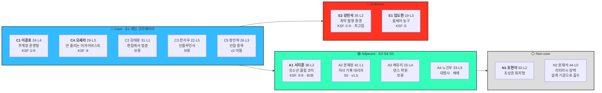
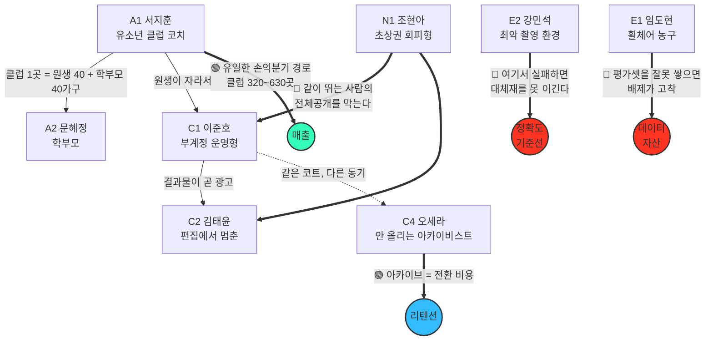
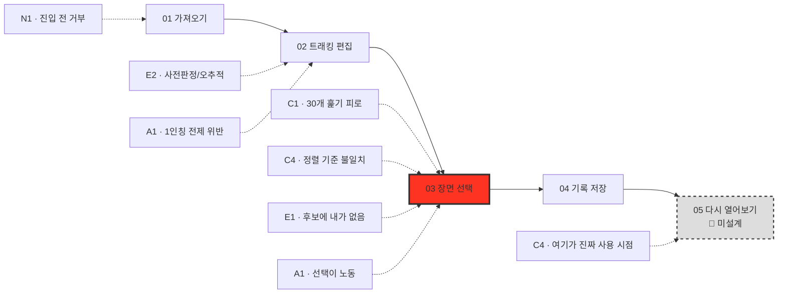

# [페르소나 스펙트럼] 5차 통합 — Spectrum Map

| 항목 | 내용 |
| --- | --- |
| **워크플로우 단계** | ⑤ 5차 통합 (Spectrum Map) — **5단계 중 마지막** |
| **전제** | 시작 카테고리 = **농구** 확정 (`부록B`) · T1 부분 해소 (`부록C`) |
| **대상** | 13명 전체 — 대표 4 · 검증 전용 2 · 보류·배제 7 |
| **작성** | 2026-08-28 |

---

## 1. 전체 배치도

**굵게 표시한 6명이 확정 구성**입니다 — 대표 4(C1·A1·E2·N1) + 검증 전용 2(C4·E1).

---

## 2. 🔑 관계 구조 — 이 맵의 핵심

페르소나를 나열이 아니라 **서로에게 미치는 영향**으로 연결한 것이 5단계의 산출입니다.

### 이 그림에서 읽어야 할 것 4가지

| # | 관계 | 함의 |
| --- | --- | --- |
| 01 | **A1 → 매출** | A1이 유일하게 손익분기에 닿는다. 개인 경로는 국내 농구 동호인 전체를 획득해도 미달(`04` 3절) |
| 02 | **C4 → 리텐션** | Five Forces "구매자 교섭력 강함"의 **유일한 완화 요인** |
| 03 | 🔴 **N1 → C1·C2** | 비활성 사용자가 **핵심 사용자의 발행률을 깎는다.** 화살표가 거꾸로 간다 |
| 04 | 🔴 **E2·E1 → 기준선** | 극단 사용자가 **성능·자산의 하한선을 정의한다.** 예외가 아니라 기준이다 |

> **③·④가 이 워크플로우를 스펙트럼으로 한 이유입니다.** 일반 페르소나 추출이었다면 N1·E1·E2는 뽑히지 않았고, **v1 발행률과 성능 기준선이 정의되지 않은 채로 진행됐을 것**입니다.

---

## 3. 4단계 흐름 위의 배치 — 누가 어디서 걸리나

> 🔴 **「03 장면 선택」에 5명이 몰립니다.** 덱 13장이 *"사람은 정하기를 한다"* 를 단일 원칙으로 못 박았지만, 실제로는 **4가지 다른 요구**입니다 — 개수(C1) · 정렬 기준(C4) · 신뢰도(E2) · 자동화(A1). 그리고 E1은 후보에 아예 없습니다.
>
> 🔵 **「05 다시 열어보기」는 아직 설계되지 않았습니다.** C4의 진짜 사용 시점이고, KSF ④ 검증의 전제입니다.

---

## 4. KSF 커버리지 — 6명이 최소 구성인 이유

| KSF / 힘 | C1 | A1 | E2 | N1 | C4 | E1 |
| --- | :---: | :---: | :---: | :---: | :---: | :---: |
| ① 정확도 | ✅ | | ✅ | | | |
| ② 데이터 자산·편향 | | | | | | ✅ |
| ③ 원가 설계 | | ✅ | ✅ | | | |
| ④ 축적·전환비용 | | | | | ✅ | |
| ⑤ 좁게 시작 | ✅ | ✅ | | | ✅ | |
| FF③ 구매자 교섭력 | | | | ✅ | ✅ | |
| FF⑤ 대체재 | ✅ | | ✅ | | | |
| 수익(B2B) | | ✅ | | | | |
| 제3자 초상권 | | ✅ | | ✅ | | |
| 포용적 설계 | | | | | | ✅ |

> **한 명이라도 빼면 검증 주체를 잃는 항목이 생깁니다.** C4를 빼면 KSF ④와 FF③이, E1을 빼면 KSF ②와 포용적 설계가 무주공산이 됩니다.

---

## 5. 세그먼트 최종 배치

| 코드 | 세그먼트 | 페르소나 | v1 판정 |
| --- | --- | --- | --- |
| **S1-a** | 부계정 운영형 스포츠 기록자 | **C1** · E1(배제됨) | ✅ v1 핵심 |
| **S1-b** | 편집 이탈형 잠재 기록자 | C2 · **E2**(배제됨) | ✅ v1 (C2는 행동증거 미약) |
| **S1-c** | 성장기 마이크로 인플루언서 | C3 | ⏸️ 외부 내보내기 결정 후 |
| **S1-d** | 비공개 성장 아카이비스트 | **C4** | ✅ v1 리텐션 |
| **S1-e** | 인접 종목 기록자 | C5 | ⏸️ v2 (테니스와 함께) |
| **S2 ∩ S4** | 지도자·클럽 | **A1** | 🟡 매출 경로 · 시점 미정 |
| **S2** | 소규모 사업장 | A3 | ⏸️ 보류 |
| **S3** | 마케팅 대행사 | A4 | 🚫 배제 확정 |
| **S5** | 대리 기록자 | A2 | ⏸️ v1.5~v2 |
| **X2** | 초상권 회피층 | **N1** | ✅ v1 (본인 획득 아닌 기능 요구) |
| **X3** | 리터러시 저층 | N2 | 🔄 설계 원칙으로 흡수 |

---

## 6. 5단계까지의 확정 사항 종합

| # | 항목 | 확정 |
| --- | --- | --- |
| 01 | **시작 카테고리** | 🏀 **농구** (조건부) · v2 = 🎾 테니스 · ⛳ 골프 제외 |
| 02 | **수익 모델** | 기능 무료 + **처리량 과금** · B2B 별도 · 실패 건 무과금 |
| 03 | **대표 페르소나** | C1 · A1 · E2 · N1 |
| 04 | **검증 전용** | C4(KSF ④) · E1(KSF ②) |
| 05 | **S3 마케팅 대행사** | 🚫 배제 (협업 워크플로 요구 = 구조가 반대) |
| 06 | **S5 대리 기록자** | ✅ 신설 · v1.5~v2 |
| 07 | **손익분기 경로** | 개인 유료 1~2만 명 ❌ → **클럽 320~630곳** ✅ |

### 아직 열려 있는 결정 5건

| # | 결정 | 어디서 나왔나 |
| --- | --- | --- |
| 01 | 🔴 **「지정 대상 추적」을 v1에 넣을 것인가** — 매출의 전제 기능인데 v1.5에 있다 | `04` 4절 |
| 02 | 🔴 **「03 장면 선택」을 4가지 요구로 분해** (개수·정렬·신뢰도·자동화) | `03` 7-1절 |
| 03 | 🔵 **「05 다시 열어보기」 화면 신설** — KSF ④ 검증 전제 | `03` 7-2절 |
| 04 | 🔴 **「지정 인원 공유」 4단째 공개 범위** — A1·A2·N1이 동시에 요구 | `03` 7-3절 |
| 05 | 🟡 **무료 처리 한도** — GPU 단위 원가 시산 후 확정 (C4가 판정선에 걸림) | `02` 0-1절 |

---

## 7. 워크플로우 종료 — 5단계 산출물 목록

| 단계 | 문서 | 산출 |
| --- | --- | --- |
| ① 1차 생성 | `01_1차생성_divergent` | 13명 원본 페르소나 |
| ② 2차 평가 | `02_2차평가_convergent` | 선결 판정 3건 + 대표 4 + 검증 2 |
| ③ 3차 보정 | `03_3차보정_카드` | 하일릿 적용 카드 6종 (C4 농구 보정) |
| ④ 4차 검증 | `04_4차검증_peer-review` | 존재 확률 + 반증 시나리오 + 교차검증 프롬프트 |
| ⑤ 5차 통합 | `05_5차통합_spectrum-map` | **이 문서** |
| 부록 A | `부록A_카테고리-재검토` | 농구·골프·테니스 6축 비교 |
| 부록 B | `부록B_카테고리-확정` | 판정 방법 선정 + 농구 확정 + 트리거 5개 |
| 부록 C | `부록C_T1검증` | T1 부분 해소 + 4차 검증 오판 정정 |

### 다음에 할 일 (우선순위)

| # | 할 일 | 비용 | 근거 |
| --- | --- | :---: | --- |
| **1** | **유소년 농구 클럽 수 조회** (스포츠클럽포털·KBL) | 🟢 즉시·무료 | T2 트리거 · 유일한 매출 경로 |
| **2** | **덱 22장 「확인 02」에 문항 4개 추가** (`부록C` 7절) | 🟢 문항만 | T1 잔여분 + N1 인과 |
| **3** | **덱 22장 「확인 01」을 농구 + 테니스 양쪽 영상으로** | 🟢 영상 추가만 | T5 · 테니스 옵션 유지 |
| **4** | 열려 있는 결정 5건을 제품 사양으로 이관 | 🟡 중간 | 6절 |

---

*이 맵은 농구 확정을 전제로 그려졌습니다. 부록B의 전환 트리거(T1~T5) 중 하나가 발동해 테니스로 전환하면, 2절의 관계 구조는 유지되지만 A1(SwingVision과 경합)·E2(조명 있는 코트)·N1(1:1이라 타인 적음)의 위상이 달라집니다 — 부록A 6절 참조.*
